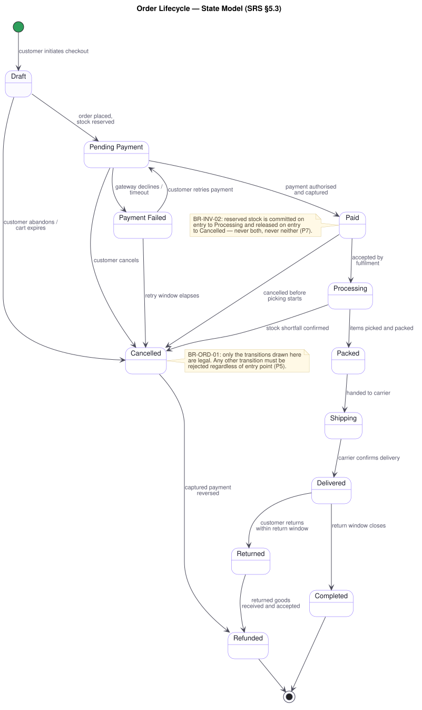
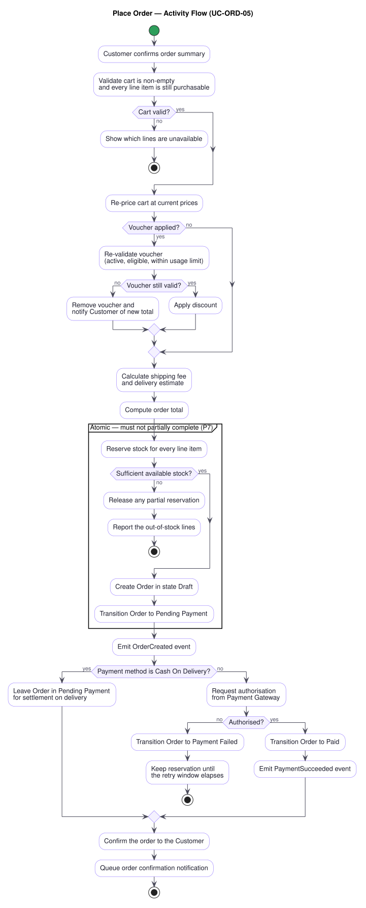

# Software Requirements Specification — Enterprise Commerce Platform (ECP)

**Document type:** Software Requirements Specification (SRS)
**Related documents:** [`requirement.md`](./requirement.md) (Product Owner Requirements — stakeholder input) · [`general-approach.md`](./general-approach.md) (Business Problem Analysis) · [`use-cases/`](./use-cases/README.md) (Use Case Specification) · [`traceability-matrix.md`](./traceability-matrix.md)
**Audience:** Product Management, Solution Architecture, Engineering, Quality Assurance
**Version:** 1.0
**Status:** Draft for stakeholder review

---

## 1. Introduction

### 1.1 Purpose

This document specifies **what the Enterprise Commerce Platform (ECP) must do**, in terms precise enough to design against, build against, and test against.

It sits between two documents that already exist:

- [`requirement.md`](./requirement.md) captures the Product Owner's requirements as originally stated. It is deliberately preserved unchanged as the record of stakeholder intent, but it is expressed as prose and bullet lists with no identifiers, no measurable targets, and no separation between functional behaviour, business rules, and quality attributes.
- [`general-approach.md`](./general-approach.md) explains **why** the platform must exist, cataloguing seventeen business problems (**P1–P17**).

This SRS converts the Product Owner's requirements into individually identified, individually verifiable statements, and connects them in both directions: back to the business problems that justify them, and forward to the use cases that realise them and the architecture that implements them.

Consistent with [`general-approach.md`](./general-approach.md), this document **specifies no technology**. It states what must be true of the system, never how the system is to be built. The *how* belongs to [Solution Architecture](../SA-docs/01-system/Solution%20Architecture.md).

### 1.2 Scope

**In scope.** A customer-facing digital marketplace and the internal operations required to run it, covering fourteen business domains: customer identity, product catalog and categories, search and recommendation, inventory, cart and wishlist, checkout and orders, payment, shipping, promotions, reviews, notifications, administration, reporting and analytics, and audit and access control.

**Out of scope for this release.** Everything listed in [`requirement.md`](./requirement.md) §10 Future Expansion — loyalty, membership, reward points, AI recommendation, chat support, live shopping, multi-language, multi-currency, multi-region, multi-vendor marketplace, native mobile applications, and ERP/CRM integration. These are specified in §8 not as deliverables but as **extension points the delivered system must not foreclose**.

**Explicitly not specified here.** User interface design, visual design, and screen flows; deployment topology; database and framework selection; and API wire formats. This document constrains behaviour, not presentation or implementation.

### 1.3 Definitions and Acronyms

| Term | Definition |
|---|---|
| **ECP** | Enterprise Commerce Platform — the system specified by this document |
| **Actor** | A person, role, external system, or timer that interacts with the platform |
| **SKU** | Stock Keeping Unit — the uniquely identified, individually stockable unit of sale |
| **Variant** | A specific purchasable configuration of a product (size, colour); each variant has its own SKU, price, and stock |
| **Stock quantity** | Total physical units held |
| **Reserved stock** | Units committed to placed but not yet fulfilled orders |
| **Available stock** | Stock quantity minus reserved stock — the quantity the platform may still sell |
| **Reservation** | A hold placed on stock at order placement, later either committed on fulfilment or released on cancellation |
| **Guest** | An unauthenticated visitor who can browse, search, and build a cart, but not check out |
| **Verified buyer** | A customer with at least one order in state Delivered or Completed containing the product in question |
| **Voucher** | A customer-redeemable code that activates a promotion |
| **Business event** | A record that something of business significance occurred (order created, payment succeeded), which other parts of the platform may react to |
| **Read model** | A representation of data optimised for querying rather than for transactional correctness |
| **RBAC** | Role-Based Access Control |
| **p95 latency** | The response time below which 95% of requests complete |

### 1.4 References

| # | Document | Role |
|---|---|---|
| R1 | [`requirement.md`](./requirement.md) | Product Owner Requirements — the stakeholder input this SRS derives from |
| R2 | [`general-approach.md`](./general-approach.md) | Business Problem Analysis — problems P1–P17 |
| R3 | [`use-cases/README.md`](./use-cases/README.md) | Use Case Specification — actor interactions realising these requirements |
| R4 | [`traceability-matrix.md`](./traceability-matrix.md) | Traceability across P → FR/NFR/BR → UC → AC |
| R5 | [Solution Architecture](../SA-docs/01-system/Solution%20Architecture.md) | How each business problem is addressed technically |

### 1.5 Document Conventions

**Identifier scheme.** Every requirement carries a stable identifier. Identifiers are permanent: a requirement that is withdrawn is marked withdrawn rather than renumbered, so that citations elsewhere never silently change meaning.

| Kind | Form | Example |
|---|---|---|
| Functional requirement | `FR-<DOMAIN>-<nn>` | `FR-ORD-08` |
| Non-functional requirement | `NFR-<CATEGORY>-<nn>` | `NFR-PERF-02` |
| Business rule | `BR-<DOMAIN>-<nn>` | `BR-INV-01` |
| Use case | `UC-<DOMAIN>-<nn>` | `UC-ORD-05` |
| Acceptance criterion | `AC-<nn>` | `AC-03` |
| Constraint | `CON-<nn>` | `CON-04` |
| Business problem | `P<n>` (defined in R2) | `P8` |

**Domain codes.**

| Code | Domain | Code | Domain |
|---|---|---|---|
| `CUS` | Customer & Identity | `PAY` | Payment |
| `CAT` | Product Catalog & Category | `SHP` | Shipping |
| `SCH` | Search & Recommendation | `PRM` | Promotion |
| `INV` | Inventory | `REV` | Review |
| `CRT` | Cart & Wishlist | `NTF` | Notification |
| `ORD` | Checkout & Order | `ADM` | Administration |
| `RPT` | Reporting & Analytics | `AUD` | Audit & Access Control |
| `DAT` | Cross-domain data qualities (§5.2) | | |

**Non-functional categories.** `PERF` performance · `SCAL` scalability · `REL` reliability · `SEC` security · `AVAIL` availability · `MAINT` maintainability · `OBS` observability and auditability.

**Priority (MoSCoW).** **Must** — the release is not viable without it. **Should** — important, but the release can ship without it if necessary. **Could** — desirable if capacity allows. **Won't** — explicitly deferred beyond this release (§8).

**Language.** "Must" states a mandatory requirement. "Should" states a strong recommendation whose omission requires a recorded decision. Requirements are stated in the present indicative ("the platform records…") because they describe properties of the delivered system.

**Assumptions.** Where [`requirement.md`](./requirement.md) leaves a value or policy undefined, this document states an explicit assumption rather than inventing a decision silently. Every such statement is marked **[ASSUMPTION]** and collected in §2.5 for stakeholder confirmation. An unconfirmed assumption is a known open item, not an agreed requirement.

---

## 2. Overall Description

### 2.1 Product Perspective

The ECP replaces no existing system; it is a new platform built to carry a traditional retail business into digital trade. The Product Owner is explicit that it is **"the foundation of our future ecosystem rather than just an online shopping website"** (R1, Project Overview).

That framing has a direct consequence for this specification. A storefront can be specified by its features alone. A foundation must additionally be specified by the properties that determine whether new capability can be added to it later — which is why §6 (non-functional requirements) and §7 (constraints) carry as much weight here as §3 (functional requirements), and why §8 specifies deferred capability as extension points rather than omitting it.

### 2.2 Product Function Summary

| Domain | Function | Primary source |
|---|---|---|
| Customer & Identity | Registration, authentication, session management, profile and address book, purchase history | R1 §2 Customer Management |
| Product Catalog & Category | Product and variant records, nested category tree, featured categories, product browsing | R1 §2 Product Catalog, Category Management |
| Search & Recommendation | Full-text search, suggestions, filtering, ranking, related and personalised recommendations | R1 §4, §5 |
| Inventory | Stock, reservation and availability tracking across warehouses; adjustments | R1 §2 Inventory Management |
| Cart & Wishlist | Cart lifecycle including guest carts and merge-on-login; wishlist | R1 §2 Shopping Cart, Wishlist |
| Checkout & Order | Checkout flow, order placement, order lifecycle and its state transitions | R1 §2 Checkout, Order Management |
| Payment | Multiple payment methods, authorisation, settlement, refund | R1 §2 Payment |
| Shipping | Provider selection, fee calculation, shipment creation, tracking, delivery | R1 §2 Shipping |
| Promotion | Coupons, vouchers, flash sales, discount types, configurable rules | R1 §2 Promotion Engine |
| Review | Ratings, review text and images, verified-buyer restriction, moderation | R1 §2 Review System |
| Notification | Email and in-app delivery of business-event notifications | R1 §2 Notification Center |
| Administration | Operational management of catalog, orders, customers, inventory, promotions, reviews | R1 §2 Administration |
| Reporting & Analytics | Revenue, product, customer, inventory and conversion reporting | R1 §3 |
| Audit & Access Control | Immutable audit trail, role-based authorisation, rate limiting | R1 §6, §9 |

### 2.3 Actors and User Classes

**Human actors.**

| Actor | Description | Source |
|---|---|---|
| **Guest** | An unauthenticated visitor. Browses the catalog, searches, views reviews, and builds a cart, but cannot check out, review, or access any account-scoped data. | **[ASSUMPTION A-01]** — implied by R1 §2 "merge guest cart after login" but not named among the roles in R1 §9. |
| **Customer** | A registered, authenticated shopper. Owns carts, wishlists, orders, addresses, reviews, and notifications. | R1 §9 |
| **Staff** | Commercial and catalog operations. Maintains products, categories, and promotions; progresses orders through commercial states. | R1 §9 |
| **Warehouse Operator** | Fulfilment operations. Adjusts inventory, picks and packs orders, creates shipments. | R1 §9 |
| **Customer Support Agent** | Customer-facing issue resolution. Inspects orders and shipments, cancels orders, approves returns, initiates refunds, moderates reviews. | R1 §9 |
| **Administrator** | Full operational authority including user and role management, and access to all reporting and the audit trail. | R1 §9 |

**System and time actors.**

| Actor | Description | Source |
|---|---|---|
| **Scheduler (Time)** | Triggers time-based behaviour: cart expiry, flash sale start and end, promotion expiry, scheduled report generation. | **[ASSUMPTION A-02]** — implied by R1 §2 "cart expiration should be configurable" and Flash Sale, but not named as an actor. |
| **Payment Gateway** | External provider that authorises, captures, and refunds payments, and reports results asynchronously. | R1 §2 Payment |
| **Shipping Carrier** | External provider that transports shipments and reports tracking and delivery events. | R1 §2 Shipping |
| **Email Service Provider** | External provider that delivers outbound email. | R1 §2 Notification Center |
| **Future external systems** | ERP and CRM. Not integrated in this release; see §8. | R1 §10 |

**Role authority summary.** This table is normative for `FR-AUD-05`. A blank cell means the role has no access to that domain.

| Domain | Guest | Customer | Staff | Warehouse | Support | Admin |
|---|---|---|---|---|---|---|
| Catalog & Category | read | read | manage | read | read | manage |
| Search & Recommendation | use | use | use | — | use | use |
| Customer & Identity | register, log in | own record | — | — | read | manage |
| Cart & Wishlist | own guest cart | own | — | — | read | read |
| Checkout & Order | — | own | progress | progress | read, cancel, return | manage |
| Payment | — | own | — | settle COD | refund | manage |
| Inventory | — | availability only | read | manage | read | manage |
| Shipping | — | own tracking | read | manage | read | manage |
| Promotion | — | redeem | manage | — | read | manage |
| Review | read | own | moderate | — | moderate | manage |
| Notification | — | own | — | — | read | manage |
| Reporting & Analytics | — | — | commercial reports | inventory reports | — | all |
| Audit trail | — | — | — | — | read | read |
| Role management | — | — | — | — | — | manage |

### 2.4 Operating Environment and Constraints

The platform is a server-side system accessed over a network by browser-based clients, and by additional client types (an administrative interface, and a future mobile application per R1 §10) that consume the same capabilities. This has a specific consequence for this specification, drawn directly from **P5**: because the platform will be reached through more than one entry point, **no requirement in this document may be satisfied by enforcement in a client**. Every rule stated here is a rule of the platform.

The platform depends on external providers it does not control (payment gateways, shipping carriers, email). Requirements in §3 that involve these providers are written to be satisfiable in the presence of provider latency, provider failure, and asynchronous provider callbacks.

### 2.5 Assumptions and Dependencies

The following are stated by this SRS but **not** established by R1. Each requires Product Owner confirmation; each is cited from the requirement that depends on it.

| ID | Assumption | Depends on it |
|---|---|---|
| **A-01** | Guest is a distinct actor with browse, search, and cart capability but no checkout. | `FR-CRT-05`, `FR-CRT-06`, `UC-CRT-05` |
| **A-02** | Time-triggered behaviour (cart expiry, flash sale windows, promotion expiry) is modelled as a Scheduler actor. | `FR-CRT-07`, `FR-PRM-06`, `FR-PRM-10` |
| **A-03** | "Acceptable latency" (R1 §7) means p95 ≤ 300 ms for catalog and search reads and p95 ≤ 800 ms for transactional writes, measured server-side excluding external provider time. | `NFR-PERF-01`, `NFR-PERF-02` |
| **A-04** | Peak shopping events are assumed to reach 10× median throughput. | `NFR-SCAL-06`, `NFR-AVAIL-01` |
| **A-05** | Default cart inactivity expiry is 30 days for authenticated customers and 7 days for guests, both configurable. | `FR-CRT-07`, `BR-CRT-01` |
| **A-06** | The return window is 14 days from delivery. | `FR-ORD-14`, `BR-ORD-05` |
| **A-07** | A failed payment may be retried for 24 hours, during which the stock reservation is held; after that the order is cancelled and stock released. | `FR-PAY-06`, `BR-ORD-04` |
| **A-08** | Reviews are published immediately and moderated after the fact, rather than held for pre-publication approval. | `FR-REV-07`, `FR-REV-08` |
| **A-09** | A customer may submit one review per purchased product, editable within 30 days of submission. | `BR-REV-02`, `BR-REV-03` |
| **A-10** | Prices, and therefore reports, are expressed in a single currency in this release; multi-currency is deferred (§8). | `FR-RPT-01`, `FR-CAT-01` |
| **A-11** | Reporting figures may lag transactional state by up to 5 minutes. Inventory and payment figures may not lag at all. | `NFR-PERF-05`, `P4` |
| **A-12** | Target availability is 99.9% monthly for the purchase path (browse, cart, checkout, payment). | `NFR-AVAIL-01` |
| **A-13** | Audit entries are retained for 7 years. | `FR-DAT-05` |

**External dependencies.** Delivery of `FR-PAY-03`, `FR-SHP-04`, and `FR-NTF-01` depends on commercial agreements with a payment gateway, a shipping carrier, and an email service provider respectively. These agreements are outside the platform's control and are a delivery risk to be tracked by Product Management.

### 2.6 External Interfaces

| Interface | Direction | Purpose | Requirements |
|---|---|---|---|
| Payment gateway | Outbound request, inbound asynchronous callback | Authorise, capture, and refund payments; receive settlement results | `FR-PAY-03`, `FR-PAY-05`, `FR-PAY-07` |
| Shipping carrier | Outbound request, inbound status events | Dispatch shipments; receive tracking and delivery updates | `FR-SHP-04`, `FR-SHP-05` |
| Email service provider | Outbound | Deliver transactional and promotional email | `FR-NTF-01` |
| Client applications | Inbound | Web storefront, administrative interface, future mobile application | All |

Per **P3**, the platform must be able to add or replace any external provider above as a routine change. This is specified as `NFR-MAINT-03` and constrains §3 accordingly: no requirement names a specific provider.

---

## 3. Functional Requirements

Each requirement below states a single verifiable behaviour, its priority, the clause of R1 it derives from, the business rules that constrain it, and the use case that exercises it. Where the **Source** column reads *derived*, the requirement is not stated verbatim in R1 but is necessary for a requirement that is; the derivation is given in the requirement text.

### 3.1 Customer & Identity (`CUS`)

| ID | Requirement | Priority | Source | Rules | UC |
|---|---|---|---|---|---|
| `FR-CUS-01` | The platform allows a visitor to register a customer account using an email address and a password. | Must | R1 §2 Customer Management | `BR-CUS-01` | `UC-CUS-01` |
| `FR-CUS-02` | The platform verifies ownership of a registered email address by sending a single-use, time-limited verification link, and records the account as verified when it is used. | Must | R1 §2 (Email Verification) | `BR-CUS-02`, `BR-CUS-03` | `UC-CUS-02` |
| `FR-CUS-03` | The platform authenticates a customer against their credentials and issues an access token and a refresh token on success. | Must | R1 §2 (JWT Authentication, Refresh Token) | `BR-CUS-04` | `UC-CUS-03` |
| `FR-CUS-04` | The platform ends a customer's session on request and invalidates the associated refresh token. | Must | R1 §2 Customer Management (Logout) | `BR-CUS-03` | `UC-CUS-04` |
| `FR-CUS-05` | The platform issues a new access token in exchange for a valid, unexpired, unused refresh token. | Must | R1 §2 (Refresh Token) | `BR-CUS-03` | `UC-CUS-05` |
| `FR-CUS-06` | The platform allows an authenticated customer to change their password after re-confirming the current one. | Must | R1 §2 Customer Management | `BR-CUS-03` | `UC-CUS-06` |
| `FR-CUS-07` | The platform allows a customer who cannot authenticate to set a new password by means of a single-use, time-limited link sent to their registered email address. | Must | R1 §2 (Password Reset) | `BR-CUS-03` | `UC-CUS-07` |
| `FR-CUS-08` | The platform allows a customer to view and update their profile. | Must | R1 §2 Customer Management | — | `UC-CUS-08` |
| `FR-CUS-09` | The platform allows a customer to hold multiple shipping addresses, to add, amend, and remove them, and to nominate one as default. | Must | R1 §2 Customer Management | `BR-CUS-05` | `UC-CUS-09` |
| `FR-CUS-10` | The platform presents a customer with the history of their orders, in reverse chronological order, with each order's current state. | Must | R1 §2 Customer Management | — | `UC-CUS-10` |

### 3.2 Product Catalog & Category (`CAT`)

| ID | Requirement | Priority | Source | Rules | UC |
|---|---|---|---|---|---|
| `FR-CAT-01` | The platform records for each product: SKU, name, description, images, categories, brand, variants, attributes, price, and inventory status. | Must | R1 §2 Product Catalog | `BR-CAT-01` | `UC-CAT-03` |
| `FR-CAT-02` | The platform supports product variants, each carrying its own SKU, price, attribute values, and independently tracked stock. | Must | R1 §2 Product Catalog (Variants) | `BR-CAT-01` | `UC-CAT-04` |
| `FR-CAT-03` | The platform presents the products belonging to a category, paginated, with each product's price and current availability. | Must | R1 §2 Product Catalog (Browse) | `BR-CAT-02` | `UC-CAT-02` |
| `FR-CAT-04` | The platform presents the full detail of a single product, including its variants, images, attributes, aggregate rating, and per-variant availability. | Must | R1 §2 Product Catalog (View product details) | `BR-CAT-02` | `UC-CAT-03` |
| `FR-CAT-05` | The platform supports categories nested to arbitrary depth and presents them as a navigable tree. | Must | R1 §2 Category Management | `BR-CAT-03` | `UC-CAT-01` |
| `FR-CAT-06` | The platform allows categories to be designated as featured and presents them as a distinct collection. | Should | R1 §2 Category Management | — | `UC-CAT-05` |
| `FR-CAT-07` | The platform associates an image with a category and presents it wherever the category is displayed. | Should | R1 §2 Category Management | — | `UC-CAT-01` |
| `FR-CAT-08` | The platform allows a product listing to be sorted by at least price, newest, and popularity. | Must | R1 §2 Product Catalog (Sort products) | — | `UC-CAT-02` |

### 3.3 Search & Recommendation (`SCH`)

| ID | Requirement | Priority | Source | Rules | UC |
|---|---|---|---|---|---|
| `FR-SCH-01` | The platform returns products matching a free-text keyword query across at least product name, description, brand, and attribute values. | Must | R1 §4 | `BR-CAT-02` | `UC-SCH-01` |
| `FR-SCH-02` | The platform offers completions and suggestions as a query is being typed. | Should | R1 §4 (Search suggestions, Auto-complete) | — | `UC-SCH-02` |
| `FR-SCH-03` | The platform allows search results to be narrowed by category, brand, price range, attribute values, and availability, in combination. | Must | R1 §4 (Filtering) | — | `UC-SCH-03` |
| `FR-SCH-04` | The platform orders search results by relevance to the query by default, and allows the customer to re-order them by price, newest, and rating. | Must | R1 §4 (Ranking) | — | `UC-SCH-03` |
| `FR-SCH-05` | The platform presents the keywords most frequently searched across the platform. | Could | R1 §4 (Popular keywords) | — | `UC-SCH-04` |
| `FR-SCH-06` | The platform presents an individual customer with their own recently searched keywords. | Could | R1 §4 (Recently searched keywords) | `BR-SCH-01` | `UC-SCH-04` |
| `FR-SCH-07` | The platform presents products related to the product being viewed. | Should | R1 §5 (Related Products) | — | `UC-SCH-05` |
| `FR-SCH-08` | The platform presents products frequently purchased together with the product being viewed. | Should | R1 §5 (Frequently Bought Together) | — | `UC-SCH-05` |
| `FR-SCH-09` | The platform presents products currently trending by recent sales or view volume. | Could | R1 §5 (Trending Products) | — | `UC-SCH-06` |
| `FR-SCH-10` | The platform presents recently added products as new arrivals. | Could | R1 §5 (New Arrivals) | — | `UC-SCH-06` |
| `FR-SCH-11` | The platform presents an authenticated customer with recommendations derived from their own browsing and purchase history. | Could | R1 §5 (Personalized Recommendations) | `BR-SCH-01` | `UC-SCH-07` |

### 3.4 Inventory (`INV`)

| ID | Requirement | Priority | Source | Rules | UC |
|---|---|---|---|---|---|
| `FR-INV-01` | The platform tracks, per SKU and per warehouse, the stock quantity, the reserved stock, and the available stock, where available stock is stock quantity less reserved stock. | Must | R1 §2 Inventory Management | `BR-INV-01` | `UC-INV-05` |
| `FR-INV-02` | The platform reserves stock for each line of an order at the moment the order is placed, and refuses the placement if available stock is insufficient for any line. | Must | *derived* — required by R1 §8 "prevent overselling inventory" | `BR-INV-01`, `BR-INV-02` | `UC-INV-01` |
| `FR-INV-03` | The platform releases a reservation, returning the units to available stock, when the order it belongs to is cancelled or its payment retry window elapses. | Must | *derived* — required by `BR-INV-02` | `BR-INV-02` | `UC-INV-02` |
| `FR-INV-04` | The platform commits a reservation, reducing stock quantity and clearing the reservation, when the order it belongs to is fulfilled. | Must | *derived* — required by `BR-INV-02` | `BR-INV-02` | `UC-INV-03` |
| `FR-INV-05` | The platform records an inventory adjustment against a SKU and warehouse, capturing the quantity delta, a reason, and the acting user. | Must | R1 §2 Inventory Management (Inventory Adjustments) | `BR-INV-03` | `UC-INV-04` |
| `FR-INV-06` | The platform presents current stock, reserved, and available quantities per SKU and warehouse to Warehouse Operators, Staff, Support, and Administrators. | Must | R1 §2 Inventory Management (Warehouse Inventory) | `BR-AUD-02` | `UC-INV-05` |
| `FR-INV-07` | The platform reflects a SKU's availability in the catalog and in search results. | Must | R1 §2 Product Catalog (Inventory Status) | `BR-CAT-02` | `UC-CAT-03` |

### 3.5 Cart & Wishlist (`CRT`)

| ID | Requirement | Priority | Source | Rules | UC |
|---|---|---|---|---|---|
| `FR-CRT-01` | The platform adds a specified quantity of a product variant to the acting party's cart, combining it with any existing line for the same variant. | Must | R1 §2 Shopping Cart (Add items) | `BR-CRT-02` | `UC-CRT-01` |
| `FR-CRT-02` | The platform changes the quantity of an existing cart line. | Must | R1 §2 Shopping Cart (Update quantity) | `BR-CRT-02` | `UC-CRT-02` |
| `FR-CRT-03` | The platform removes a line from the cart. | Must | R1 §2 Shopping Cart (Remove items) | — | `UC-CRT-03` |
| `FR-CRT-04` | The platform persists an authenticated customer's cart across sessions and devices. | Must | R1 §2 Shopping Cart (Save cart) | `BR-CRT-01` | `UC-CRT-04` |
| `FR-CRT-05` | The platform maintains a cart for an unauthenticated guest for the duration of their visit. | Must | *derived* — presupposed by R1 §2 "merge guest cart after login" | `BR-CRT-01` | `UC-CRT-01` |
| `FR-CRT-06` | On successful login, the platform merges the guest cart into the customer's stored cart, combining quantities for lines that appear in both, without silently discarding either. | Must | R1 §2 Shopping Cart (Merge guest cart after login) | `BR-CRT-02`, `BR-CRT-03` | `UC-CRT-05` |
| `FR-CRT-07` | The platform expires a cart after a configurable period of inactivity, and the configured period is changeable without redeployment. | Must | R1 §2 Shopping Cart ("cart expiration should be configurable") | `BR-CRT-01` | `UC-CRT-06` |
| `FR-CRT-08` | The platform prices the cart at the products' current prices whenever it is displayed, and identifies to the customer any line whose price has changed since it was added. | Must | *derived* — required by `BR-ORD-06` and by R1 §2 Checkout | `BR-CRT-04` | `UC-CRT-04` |
| `FR-CRT-09` | The platform allows a customer to save a product to a wishlist and to remove it. | Should | R1 §2 Wishlist | — | `UC-CRT-07` |
| `FR-CRT-10` | The platform moves a wishlist item into the cart, removing it from the wishlist on success. | Should | R1 §2 Wishlist (Move wishlist items to cart) | `BR-CRT-02` | `UC-CRT-08` |

### 3.6 Checkout & Order (`ORD`)

| ID | Requirement | Priority | Source | Rules | UC |
|---|---|---|---|---|---|
| `FR-ORD-01` | The platform begins a checkout from the customer's cart, refusing to begin if the cart is empty or if no line is currently purchasable. | Must | R1 §2 Checkout | `BR-ORD-01` | `UC-ORD-01` |
| `FR-ORD-02` | The platform captures shipping information for the order, offering the customer's stored addresses and accepting a new one. | Must | R1 §2 Checkout (Shipping information) | `BR-CUS-05` | `UC-ORD-02` |
| `FR-ORD-03` | The platform captures billing information for the order, allowing it to differ from the shipping information. | Must | R1 §2 Checkout (Billing information) | — | `UC-ORD-02` |
| `FR-ORD-04` | The platform calculates the shipping fee for the order from its contents and destination, and recalculates it whenever either changes. | Must | R1 §2 Checkout (Shipping fee calculation) | `BR-SHP-01` | `UC-ORD-02` |
| `FR-ORD-05` | The platform validates any voucher presented at checkout and reports the reason when it is rejected. | Must | R1 §2 Checkout (Voucher validation) | `BR-PRM-01`, `BR-PRM-02` | `UC-ORD-03` |
| `FR-ORD-06` | The platform validates that every line of the order is available in the requested quantity before the order is confirmed. | Must | R1 §2 Checkout (Inventory validation) | `BR-INV-01` | `UC-ORD-04` |
| `FR-ORD-07` | The platform presents a complete order summary — line items, unit and line prices, discounts, shipping fee, and total payable — for confirmation before the order is placed. | Must | R1 §2 Checkout (Order confirmation) | `BR-ORD-06` | `UC-ORD-04` |
| `FR-ORD-08` | On confirmation, the platform creates the order and reserves stock for every line as a single indivisible operation: either both occur or neither does. | Must | R1 §8 ("ensure transactional consistency") | `BR-ORD-02`, `BR-INV-02` | `UC-ORD-05` |
| `FR-ORD-09` | The platform treats repeated submissions of the same confirmed checkout as one order, and never creates a second order from them. | Must | R1 §8 ("prevent duplicate orders") | `BR-ORD-03` | `UC-ORD-05` |
| `FR-ORD-10` | The platform maintains each order in exactly one of the states Draft, Pending Payment, Paid, Processing, Packed, Shipping, Delivered, Completed, Cancelled, Payment Failed, Refunded, Returned. | Must | R1 §2 Order Management | `BR-ORD-01` | `UC-ORD-10` |
| `FR-ORD-11` | The platform permits only the state transitions defined in §5.3 and rejects every other transition, whatever its origin. | Must | R1 §2 Order Management ("every state transition must follow business rules") | `BR-ORD-01`, `BR-AUD-02` | `UC-ORD-10` |
| `FR-ORD-12` | The platform presents the full detail of an order to its owning customer, and to Support and Administrators for any order. | Must | R1 §2 Order Management | `BR-AUD-02` | `UC-ORD-06` |
| `FR-ORD-13` | The platform presents the current state of an order and its shipment tracking information to the owning customer. | Must | R1 §2 Order Management, Shipping (Shipment tracking) | — | `UC-ORD-07` |
| `FR-ORD-14` | The platform cancels an order on request when its current state permits cancellation, releasing its stock reservation and initiating a refund if payment was captured. | Must | R1 §2 Order Management (Cancelled) | `BR-ORD-04`, `BR-INV-02` | `UC-ORD-08` |
| `FR-ORD-15` | The platform accepts a return request against a delivered order within the return window, and transitions the order to Returned when the returned goods are accepted. | Should | R1 §2 Order Management (Returned) | `BR-ORD-05` | `UC-ORD-09` |
| `FR-ORD-16` | The platform allows Staff and Warehouse Operators to advance an order to its next permitted state, recording who did so and when. | Must | R1 §2 Administration, Order Management | `BR-ORD-01`, `BR-AUD-01` | `UC-ORD-10` |

### 3.7 Payment (`PAY`)

| ID | Requirement | Priority | Source | Rules | UC |
|---|---|---|---|---|---|
| `FR-PAY-01` | The platform supports payment by Cash On Delivery, credit card, digital wallet, and bank transfer. | Must | R1 §2 Payment | — | `UC-PAY-01` |
| `FR-PAY-02` | The platform allows the customer to select one payment method per order at checkout, offering only methods eligible for that order. | Must | R1 §2 Payment | `BR-PAY-03` | `UC-PAY-01` |
| `FR-PAY-03` | The platform requests authorisation and capture from the external payment provider for online payment methods. | Must | R1 §2 Payment | `BR-PAY-01` | `UC-PAY-02` |
| `FR-PAY-04` | The platform records against the order the payment method, amount, provider reference, outcome, and time of every payment attempt. | Must | *derived* — required by R1 §6 Audit and R1 §8 | `BR-AUD-01` | `UC-PAY-03` |
| `FR-PAY-05` | The platform accepts asynchronous result notifications from the payment provider and applies each one at most once, however many times it is delivered. | Must | *derived* — required by R1 §8 "handle retryable failures" | `BR-PAY-01` | `UC-PAY-03` |
| `FR-PAY-06` | The platform allows a customer to retry payment for an order in state Payment Failed within a configurable retry window, holding the stock reservation until that window elapses. | Must | R1 §2 Order Management (Payment Failed) | `BR-ORD-04`, `BR-INV-02` | `UC-PAY-05` |
| `FR-PAY-07` | The platform settles a Cash On Delivery payment on confirmation of delivery and payment collection. | Must | R1 §2 Payment (Cash On Delivery) | `BR-PAY-03` | `UC-PAY-04` |
| `FR-PAY-08` | The platform issues a full or partial refund against a captured payment, records it against the order, and transitions the order to Refunded when the refund covers the full amount. | Must | R1 §2 Order Management (Refunded) | `BR-PAY-02`, `BR-AUD-01` | `UC-PAY-06` |
| `FR-PAY-09` | The platform expresses payment operations independently of any particular provider, so that a provider can be added or replaced without altering order or checkout behaviour. | Must | R1 §2 Payment ("should allow future integration with external payment providers") | — | `UC-PAY-02` |

### 3.8 Shipping (`SHP`)

| ID | Requirement | Priority | Source | Rules | UC |
|---|---|---|---|---|---|
| `FR-SHP-01` | The platform supports more than one shipping provider and selects among them per shipment. | Must | R1 §2 Shipping (Multiple shipping providers) | — | `UC-SHP-03` |
| `FR-SHP-02` | The platform calculates a shipping fee from the shipment's contents, destination, and selected provider. | Must | R1 §2 Shipping (Shipping fee calculation) | `BR-SHP-01` | `UC-SHP-01` |
| `FR-SHP-03` | The platform estimates a delivery date for a destination and provider, and presents it before the order is placed. | Should | R1 §2 Shipping (Delivery estimation) | — | `UC-SHP-02` |
| `FR-SHP-04` | The platform creates a shipment for a packed order, dispatches it to the selected carrier, and records the carrier's tracking reference. | Must | R1 §2 Shipping | `BR-ORD-01` | `UC-SHP-03` |
| `FR-SHP-05` | The platform records tracking updates received from a carrier against the corresponding shipment, applying each update at most once. | Must | R1 §2 Shipping (Shipment tracking) | `BR-SHP-02` | `UC-SHP-04` |
| `FR-SHP-06` | The platform presents shipment tracking history to the owning customer, to Support, and to Administrators. | Must | R1 §2 Shipping (Shipment tracking) | `BR-AUD-02` | `UC-SHP-05` |
| `FR-SHP-07` | The platform transitions an order to Delivered on confirmation of delivery from the carrier or a Warehouse Operator. | Must | R1 §2 Order Management (Delivered) | `BR-ORD-01` | `UC-SHP-06` |

### 3.9 Promotion (`PRM`)

| ID | Requirement | Priority | Source | Rules | UC |
|---|---|---|---|---|---|
| `FR-PRM-01` | The platform supports promotions redeemed by a coupon or voucher code, and promotions applied automatically to eligible orders. | Must | R1 §2 Promotion Engine (Coupons, Voucher Codes) | `BR-PRM-01` | `UC-PRM-01` |
| `FR-PRM-02` | The platform supports discount by percentage of order or line value. | Must | R1 §2 (Percentage Discount) | `BR-PRM-02` | `UC-PRM-03` |
| `FR-PRM-03` | The platform supports discount by fixed amount. | Must | R1 §2 (Fixed Discount) | `BR-PRM-02` | `UC-PRM-03` |
| `FR-PRM-04` | The platform supports a promotion that waives the shipping fee. | Must | R1 §2 (Free Shipping) | `BR-PRM-02` | `UC-PRM-03` |
| `FR-PRM-05` | The platform supports a promotion that grants specified items when specified items are purchased. | Should | R1 §2 (Buy X Get Y) | `BR-PRM-02` | `UC-PRM-03` |
| `FR-PRM-06` | The platform supports a flash sale that becomes active and inactive at configured times without manual intervention. | Must | R1 §2 (Flash Sale) | `BR-PRM-01` | `UC-PRM-04` |
| `FR-PRM-07` | The platform allows a promotion's eligibility conditions, discount, validity period, total usage limit, and per-customer usage limit to be configured without code change. | Must | R1 §2 ("promotion rules should be configurable") | `BR-PRM-01` | `UC-PRM-01` |
| `FR-PRM-08` | The platform validates a voucher against every configured condition at the moment it is applied and again at the moment the order is placed. | Must | R1 §2 Checkout (Voucher validation) | `BR-PRM-01` | `UC-PRM-02` |
| `FR-PRM-09` | The platform records against the order every promotion applied and the discount each contributed. | Must | *derived* — required by R1 §3 Reporting and R1 §6 Audit | `BR-PRM-02`, `BR-PRM-03` | `UC-PRM-03` |
| `FR-PRM-10` | The platform activates, deactivates, and expires promotions, and immediately stops applying a promotion that is no longer active. | Must | R1 §2 Promotion Engine | `BR-PRM-01` | `UC-PRM-05` |

### 3.10 Review (`REV`)

| ID | Requirement | Priority | Source | Rules | UC |
|---|---|---|---|---|---|
| `FR-REV-01` | The platform accepts a numeric rating from a customer against a product. | Must | R1 §2 Review System (Rate products) | `BR-REV-01`, `BR-REV-02` | `UC-REV-01` |
| `FR-REV-02` | The platform accepts review text alongside a rating. | Must | R1 §2 (Write reviews) | `BR-REV-01` | `UC-REV-01` |
| `FR-REV-03` | The platform accepts images attached to a review. | Should | R1 §2 (Upload images) | `BR-REV-04` | `UC-REV-01` |
| `FR-REV-04` | The platform allows a customer to amend their own review within the configured edit window. | Should | R1 §2 (Edit reviews) | `BR-REV-03` | `UC-REV-02` |
| `FR-REV-05` | The platform allows a customer to delete their own review. | Should | R1 §2 (Delete reviews) | `BR-REV-03` | `UC-REV-03` |
| `FR-REV-06` | The platform accepts a review of a product only from a customer who has an order in state Delivered or Completed containing that product. | Must | R1 §2 Review System ("only verified buyers can review products") | `BR-REV-01` | `UC-REV-01` |
| `FR-REV-07` | The platform presents a product's reviews and its aggregate rating to any visitor. | Must | *derived* — a review system without display serves no purpose | — | `UC-REV-04` |
| `FR-REV-08` | The platform allows Staff, Support, and Administrators to hide or remove a review that breaches policy, recording who did so and why. | Should | R1 §2 Administration (Reviews) | `BR-AUD-01` | `UC-REV-05` |

### 3.11 Notification (`NTF`)

| ID | Requirement | Priority | Source | Rules | UC |
|---|---|---|---|---|---|
| `FR-NTF-01` | The platform delivers notifications by email. | Must | R1 §2 Notification Center | `BR-NTF-01` | `UC-NTF-01` |
| `FR-NTF-02` | The platform delivers notifications in-app to an authenticated customer. | Must | R1 §2 Notification Center | `BR-NTF-01` | `UC-NTF-02` |
| `FR-NTF-03` | The platform raises a notification on each of the following business events: order created, payment succeeded, shipment status changed, refund issued, and promotion announced. | Must | R1 §2 Notification Center | `BR-NTF-01` | `UC-NTF-01`, `UC-NTF-02` |
| `FR-NTF-04` | The platform presents a customer with their in-app notifications and allows them to be marked as read. | Must | *derived* — required by `FR-NTF-02` | — | `UC-NTF-03` |
| `FR-NTF-05` | The platform allows a customer to opt out of promotional notifications per channel, and does not allow opting out of transactional notifications concerning their own orders and payments. | Should | *derived* — required by `FR-NTF-03` (Promotion) | `BR-NTF-02` | `UC-NTF-04` |
| `FR-NTF-06` | The platform records the delivery outcome of every notification and retries a transient failure, marking a notification undeliverable only after the configured retry attempts are exhausted. | Must | *derived* — required by `BR-NTF-01` | `BR-NTF-01` | `UC-NTF-01` |

### 3.12 Administration (`ADM`)

| ID | Requirement | Priority | Source | Rules | UC |
|---|---|---|---|---|---|
| `FR-ADM-01` | The platform allows authorised users to create, amend, publish, unpublish, and price products and their variants. | Must | R1 §2 Administration (Products) | `BR-CAT-01`, `BR-AUD-01` | `UC-ADM-01` |
| `FR-ADM-02` | The platform allows authorised users to create, amend, move, and remove categories within the tree. | Must | R1 §2 Administration (Categories) | `BR-CAT-03`, `BR-AUD-01` | `UC-ADM-02` |
| `FR-ADM-03` | The platform allows authorised users to view, suspend, and reinstate customer accounts. | Must | R1 §2 Administration (Customers) | `BR-AUD-01` | `UC-ADM-03` |
| `FR-ADM-04` | The platform allows authorised users to search orders, inspect them, and act on them within the limits of their role. | Must | R1 §2 Administration (Orders) | `BR-ORD-01`, `BR-AUD-02` | `UC-ADM-04` |
| `FR-ADM-05` | The platform allows authorised users to record inventory adjustments and to review the adjustment history of a SKU. | Must | R1 §2 Administration (Inventory) | `BR-INV-03`, `BR-AUD-01` | `UC-ADM-05` |
| `FR-ADM-06` | The platform allows authorised users to create and manage promotions. | Must | R1 §2 Administration (Promotions) | `BR-PRM-01`, `BR-AUD-01` | `UC-PRM-01` |
| `FR-ADM-07` | The platform allows authorised users to moderate reviews. | Should | R1 §2 Administration (Reviews) | `BR-AUD-01` | `UC-REV-05` |
| `FR-ADM-08` | The platform allows authorised users to access the reports specified in §3.13. | Must | R1 §2 Administration (Reports) | `BR-AUD-02` | `UC-RPT-01` |
| `FR-ADM-09` | The platform allows an Administrator to assign and revoke the roles held by a user. | Must | R1 §9 (Role-Based Access Control) | `BR-AUD-01`, `BR-AUD-03` | `UC-ADM-06` |

### 3.13 Reporting & Analytics (`RPT`)

| ID | Requirement | Priority | Source | Rules | UC |
|---|---|---|---|---|---|
| `FR-RPT-01` | The platform reports revenue by day. | Must | R1 §3 (Daily Revenue) | `BR-RPT-01` | `UC-RPT-01` |
| `FR-RPT-02` | The platform reports revenue by month. | Must | R1 §3 (Monthly Revenue) | `BR-RPT-01` | `UC-RPT-01` |
| `FR-RPT-03` | The platform reports the best-selling products over a selected period. | Must | R1 §3 (Top Selling Products) | `BR-RPT-01` | `UC-RPT-02` |
| `FR-RPT-04` | The platform reports the customers with the highest purchase value over a selected period. | Should | R1 §3 (Best Customers) | `BR-RPT-01` | `UC-RPT-03` |
| `FR-RPT-05` | The platform reports per-product performance: views, orders, revenue, returns, and average rating. | Should | R1 §3 (Product Performance) | `BR-RPT-01` | `UC-RPT-02` |
| `FR-RPT-06` | The platform reports stock position, stock movement, and low-stock exposure by SKU and warehouse. | Must | R1 §3 (Inventory Reports) | — | `UC-RPT-04` |
| `FR-RPT-07` | The platform reports registration and first-purchase volume over time. | Should | R1 §3 (Customer Growth) | `BR-RPT-01` | `UC-RPT-03` |
| `FR-RPT-08` | The platform reports order counts by state, average order value, and cancellation and return rates. | Must | R1 §3 (Order Statistics) | `BR-RPT-01` | `UC-RPT-05` |
| `FR-RPT-09` | The platform reports the proportion of sessions that result in a placed order. | Should | R1 §3 (Conversion Rate) | `BR-RPT-01` | `UC-RPT-05` |
| `FR-RPT-10` | The platform exports any report in a machine-readable form for offline analysis. | Could | *derived* — required by R1 §3 for use outside the platform | `BR-AUD-02` | `UC-RPT-06` |

### 3.14 Audit & Access Control (`AUD`)

| ID | Requirement | Priority | Source | Rules | UC |
|---|---|---|---|---|---|
| `FR-AUD-01` | The platform records an audit entry for every significant business action, capturing the acting user, the action, the entity affected, the values before and after, the time, and where supplied the stated reason. | Must | R1 §6 ("every important business action must be traceable") | `BR-AUD-01` | `UC-AUD-01` |
| `FR-AUD-02` | The platform audits at minimum: product updated, price changed, inventory adjusted, order cancelled, order state advanced, refund approved, promotion created or amended, review moderated, customer account suspended, and role assigned or revoked. | Must | R1 §6 | `BR-AUD-01` | `UC-AUD-01` |
| `FR-AUD-03` | The platform stores audit entries append-only: once written, an entry can be neither amended nor deleted through any interface the platform exposes. | Must | R1 §6 ("audit records should never be modified") | `BR-AUD-01` | `UC-AUD-01` |
| `FR-AUD-04` | The platform allows Support and Administrators to search the audit trail by actor, entity, action, and time range. | Must | *derived* — an unsearchable audit trail cannot satisfy R1 §6 | `BR-AUD-02` | `UC-AUD-02` |
| `FR-AUD-05` | The platform assigns each user one or more of the roles Customer, Staff, Warehouse, Customer Support, and Administrator, and grants access according to the authority summary in §2.3. | Must | R1 §9 | `BR-AUD-02`, `BR-AUD-03` | `UC-AUD-03` |
| `FR-AUD-06` | The platform authorises every request against the acting user's roles before performing it, and reaches the same decision for the same request whatever entry point it arrives through. | Must | R1 §9; P5, P16 | `BR-AUD-02` | `UC-AUD-03` |
| `FR-AUD-07` | The platform limits the rate at which a caller may issue requests and rejects requests beyond that limit without processing them. | Must | R1 §9 (API Rate Limiting) | — | `UC-AUD-04` |
| `FR-AUD-08` | The platform validates every externally supplied input against its expected type, range, and format, and rejects invalid input before any business processing occurs. | Must | R1 §9 (Input Validation) | `BR-AUD-02` | `UC-AUD-03` |

---

## 4. Business Rules

A business rule is a constraint that holds regardless of which requirement, use case, or entry point is being exercised. Per **P5**, each rule below names its **enforcement point** — the place where the rule is decided — and that point is always inside the platform, never in a client.

### 4.1 Customer & Identity

| ID | Rule | Enforcement point | Source |
|---|---|---|---|
| `BR-CUS-01` | An email address identifies at most one customer account. | Account creation | R1 §2 |
| `BR-CUS-02` | An account whose email address is unverified may browse and build a cart but may not place an order or submit a review. | Order placement, review submission | *derived* from R1 §2 (Email Verification) |
| `BR-CUS-03` | A verification, password-reset, or refresh token is valid for a single use and expires after a configured lifetime. Using one invalidates it. | Token redemption | R1 §2, §9 |
| `BR-CUS-04` | Authentication failure reveals nothing about which credential was wrong, nor whether the account exists. | Authentication | *derived* from R1 §9 (Secure Authentication) |
| `BR-CUS-05` | A customer has at most one default shipping address. Nominating a new default removes the nomination from the previous one. | Address management | *derived* from R1 §2 |

### 4.2 Catalog, Category & Search

| ID | Rule | Enforcement point | Source |
|---|---|---|---|
| `BR-CAT-01` | A SKU identifies at most one purchasable unit across the entire catalog. | Product and variant creation | R1 §2 (SKU) |
| `BR-CAT-02` | An unpublished product is not returned by browsing or search and cannot be added to a cart, but remains visible on orders that already contain it. | Catalog read, search read, cart addition | *derived* from `FR-CAT-03`, `FR-SCH-01` |
| `BR-CAT-03` | A category may not be its own ancestor, and a category holding products or child categories may not be deleted until they are reassigned. | Category management | *derived* from R1 §2 (Nested Categories) |
| `BR-SCH-01` | Search history and personalised recommendations are scoped to the customer they belong to and are never exposed to another customer. | Search read, recommendation read | *derived* from R1 §9, P16 |

### 4.3 Inventory

| ID | Rule | Enforcement point | Source |
|---|---|---|---|
| `BR-INV-01` | **Available stock may never be negative.** No sequence of concurrent operations may result in more units reserved than are held. | Stock reservation | R1 §2 ("stock must never become negative"), R1 §8 |
| `BR-INV-02` | A stock reservation is resolved **exactly once**: either committed on fulfilment or released on cancellation — never both, and never neither. | Reservation lifecycle | *derived* from R1 §8 ("ensure transactional consistency"), P7 |
| `BR-INV-03` | An inventory adjustment requires a reason and records the acting user, and generates an audit entry. | Inventory adjustment | R1 §2, §6 |

### 4.4 Cart & Wishlist

| ID | Rule | Enforcement point | Source |
|---|---|---|---|
| `BR-CRT-01` | Cart expiry is governed by a configured inactivity period, changeable without redeployment, and may differ between guest and authenticated carts. | Cart expiry | R1 §2 ("cart expiration should be configurable") |
| `BR-CRT-02` | A cart line's quantity may not exceed the available stock of its variant at the time the line is created or amended. | Cart addition and amendment | *derived* from `BR-INV-01` |
| `BR-CRT-03` | Merging a guest cart into a customer cart never silently discards a line: quantities for the same variant are combined, and any line that cannot be carried over is reported to the customer. | Cart merge | R1 §2 (Merge guest cart after login) |
| `BR-CRT-04` | A cart holds no price of its own. Prices are those current at the moment the cart is displayed, and become fixed only when the order is placed. | Cart display, order placement | *derived* from `BR-ORD-06` |

### 4.5 Order

| ID | Rule | Enforcement point | Source |
|---|---|---|---|
| `BR-ORD-01` | **Only the state transitions defined in §5.3 are legal.** Any other transition is rejected, regardless of the role or entry point requesting it. | Every order state change | R1 §2 ("every state transition must follow business rules"), P5 |
| `BR-ORD-02` | Creating an order and reserving its stock is a single indivisible operation. A partially completed placement is not a permitted outcome, including under system failure. | Order placement | R1 §8, P7 |
| `BR-ORD-03` | Repeated submission of the same confirmed checkout yields the same single order. | Order placement | R1 §8 ("prevent duplicate orders") |
| `BR-ORD-04` | An order may be cancelled in Draft, Pending Payment, Payment Failed, Paid, or Processing. Once Packed, it may only be returned, not cancelled. | Order cancellation | *derived* from R1 §2 Order Management lifecycle |
| `BR-ORD-05` | A return may be requested only against an order in state Delivered, and only within the configured return window from the delivery date. | Return request | *derived* from R1 §2 (Returned) |
| `BR-ORD-06` | Once an order reaches Paid, its line items, prices, discounts, shipping fee, and total are fixed. Subsequent commercial change is expressed as a refund or a return, never as an amendment. | Order amendment | *derived* from R1 §6, §8 |

### 4.6 Payment

| ID | Rule | Enforcement point | Source |
|---|---|---|---|
| `BR-PAY-01` | A payment provider result is applied at most once per attempt, however many times the provider delivers it. | Gateway result handling | *derived* from R1 §8 ("handle retryable failures") |
| `BR-PAY-02` | The cumulative refunded amount for an order may never exceed the amount captured for it. | Refund | *derived* from R1 §2 (Refunded), P7 |
| `BR-PAY-03` | Cash On Delivery is offered only where the delivery destination and the order value both satisfy the configured eligibility conditions. | Payment method selection | *derived* from R1 §2 (Cash On Delivery) |

### 4.7 Shipping

| ID | Rule | Enforcement point | Source |
|---|---|---|---|
| `BR-SHP-01` | The shipping fee is recalculated whenever the destination address, the order contents, or the selected provider changes, and the fee presented at confirmation is the fee charged. | Fee calculation, order placement | R1 §2 (Shipping fee calculation) |
| `BR-SHP-02` | A carrier tracking update older than the shipment's latest recorded update does not move the shipment backwards. | Tracking update | *derived* from `FR-SHP-05` |

### 4.8 Promotion

| ID | Rule | Enforcement point | Source |
|---|---|---|---|
| `BR-PRM-01` | A promotion applies only when every configured condition holds — active period, customer eligibility, order eligibility, total usage limit, and per-customer usage limit — evaluated both when it is applied and again when the order is placed. | Voucher validation, order placement | R1 §2 ("promotion rules should be configurable") |
| `BR-PRM-02` | Total discount may not exceed the discountable value of the order. An order total may never be negative. | Discount calculation | *derived* from R1 §2, P7 |
| `BR-PRM-03` | Where more than one promotion is eligible, the configured stacking policy determines which apply, and the outcome is deterministic for identical inputs. | Discount calculation | *derived* from R1 §2 (Promotion Engine) |

### 4.9 Review

| ID | Rule | Enforcement point | Source |
|---|---|---|---|
| `BR-REV-01` | **Only a verified buyer may review a product** — a customer holding an order in state Delivered or Completed that contains it. | Review submission | R1 §2 ("only verified buyers can review products"), P5 |
| `BR-REV-02` | A customer holds at most one review per product. | Review submission | *derived* from `FR-REV-01` |
| `BR-REV-03` | A review may be amended or deleted by its author within the configured edit window, and thereafter only by a moderator. | Review amendment | *derived* from R1 §2 (Edit reviews, Delete reviews) |
| `BR-REV-04` | Review images are accepted only in permitted formats and within the configured size limit. | Image upload | *derived* from R1 §9 (Input Validation) |

### 4.10 Notification & Reporting

| ID | Rule | Enforcement point | Source |
|---|---|---|---|
| `BR-NTF-01` | A notification raised by a business event is delivered at least once, or is recorded as undeliverable. It is never silently dropped. | Notification dispatch | *derived* from R1 §2 Notification Center, P6 |
| `BR-NTF-02` | A customer may opt out of promotional notifications but not out of transactional notifications concerning their own orders, payments, and shipments. | Preference management | *derived* from `FR-NTF-05` |
| `BR-RPT-01` | Revenue figures count only orders that have reached Paid or beyond, and exclude the value of refunds and returns from the periods in which they occur. | Report computation | *derived* from R1 §3, P6 |

### 4.11 Audit & Access Control

| ID | Rule | Enforcement point | Source |
|---|---|---|---|
| `BR-AUD-01` | **An audit entry is append-only.** Once written it is never amended and never deleted, by any role, through any interface the platform exposes. | Audit write | R1 §6 ("audit records should never be modified"), P17 |
| `BR-AUD-02` | An authorisation decision is a property of the platform, not of the caller. The same request by the same user yields the same decision whatever entry point it arrives through. | Every authorised operation | R1 §9, P5, P16 |
| `BR-AUD-03` | A user may not grant themselves a role they do not already hold, nor revoke the last remaining Administrator role. | Role assignment | *derived* from R1 §9, P16 |

---

## 5. Data and State Requirements

### 5.1 Principal Entities

This section fixes the vocabulary the rest of the document depends on. It is not a data model: it constrains meaning, not storage.

| Entity | Defining attributes | Governing rules |
|---|---|---|
| **Customer** | Identity, email address, verification status, credentials, profile, addresses, roles | `BR-CUS-01`, `BR-CUS-05` |
| **Product** | SKU, name, description, images, categories, brand, attributes, base price, publication status | `BR-CAT-01`, `BR-CAT-02` |
| **Variant** | SKU, parent product, distinguishing attribute values, price, independently tracked stock | `BR-CAT-01` |
| **Category** | Name, parent, image, featured flag, ordering | `BR-CAT-03` |
| **Inventory record** | SKU, warehouse, stock quantity, reserved stock, derived available stock | `BR-INV-01` |
| **Reservation** | Order, SKU, warehouse, quantity, state (held, committed, released) | `BR-INV-02` |
| **Cart** | Owner (customer or guest session), lines, last activity time | `BR-CRT-01`, `BR-CRT-04` |
| **Order** | Customer, lines with prices fixed at placement, shipping and billing information, discounts, shipping fee, total, state, timestamps | `BR-ORD-01`, `BR-ORD-06` |
| **Payment** | Order, method, amount, provider reference, outcome, timestamps | `BR-PAY-01`, `BR-PAY-02` |
| **Shipment** | Order, carrier, tracking reference, status history, delivery estimate | `BR-SHP-01`, `BR-SHP-02` |
| **Promotion** | Type, discount, conditions, validity period, usage limits, active flag | `BR-PRM-01` |
| **Review** | Customer, product, rating, text, images, moderation status | `BR-REV-01`, `BR-REV-02` |
| **Notification** | Recipient, channel, triggering event, content, delivery outcome | `BR-NTF-01` |
| **Audit entry** | Actor, action, entity, before and after values, timestamp, reason | `BR-AUD-01` |

### 5.2 Data Qualities

| ID | Requirement | Source |
|---|---|---|
| `FR-DAT-01` | Monetary amounts are held at a precision that does not accumulate rounding error across line, discount, fee, and total calculation. | *derived* from P7 |
| `FR-DAT-02` | Timestamps recorded against orders, payments, shipments, and audit entries are unambiguous as to time zone. | *derived* from R1 §3, §6 |
| `FR-DAT-03` | Order line prices are those fixed at placement, not the product's current price, so that historic orders and revenue reports remain correct after a price change. | `BR-ORD-06`, R1 §3 |
| `FR-DAT-04` | Deleting a product, category, or customer never invalidates an order that references it; historic orders remain readable in full. | *derived* from R1 §3, §6 |
| `FR-DAT-05` | Audit entries are retained for at least the period required to investigate a dispute or demonstrate compliance. **[ASSUMPTION A-13: 7 years.]** | R1 §6, P17 |

### 5.3 Order Lifecycle State Model

`FR-ORD-10` and `FR-ORD-11` are defined by this model. The transitions drawn below are the complete set of legal transitions; `BR-ORD-01` rejects every other.

| From | To | Trigger | Effect on reservation |
|---|---|---|---|
| — | Draft | Checkout initiated | none |
| Draft | Pending Payment | Order placed | Reservation held |
| Draft | Cancelled | Checkout abandoned or cart expired | Released |
| Pending Payment | Paid | Payment authorised and captured | Held |
| Pending Payment | Payment Failed | Provider declines or times out | Held until retry window elapses |
| Pending Payment | Cancelled | Customer or Support cancels | Released |
| Payment Failed | Pending Payment | Customer retries payment | Held |
| Payment Failed | Cancelled | Retry window elapses | Released |
| Paid | Processing | Accepted by fulfilment | Held |
| Paid | Cancelled | Cancelled before picking begins | Released; refund initiated |
| Processing | Packed | Items picked and packed | **Committed** |
| Processing | Cancelled | Stock shortfall confirmed | Released; refund initiated |
| Packed | Shipping | Handed to carrier | — |
| Shipping | Delivered | Carrier or Warehouse confirms delivery | — |
| Delivered | Completed | Return window closes | — |
| Delivered | Returned | Return requested and goods accepted | — |
| Cancelled | Refunded | Captured payment reversed | — |
| Returned | Refunded | Returned goods received and accepted | — |

Completed and Refunded are terminal.

### 5.4 Checkout Flow

The activity below defines the order in which `FR-ORD-01` to `FR-ORD-09` are exercised, and locates the atomic boundary that `BR-ORD-02` requires.

---

## 6. Non-Functional Requirements

R1 states its quality expectations as adjectives — "acceptable latency," "high traffic," "responsive." An adjective cannot be tested. Each requirement below therefore states a **measurable** target and how it is measured. Where R1 supplies no number, the number is an assumption from §2.5 and is marked as such; those figures are the ones most in need of stakeholder confirmation, because the architecture will be sized against them.

### 6.1 Performance (`PERF`)

| ID | Requirement | Measurement | Priority | Source |
|---|---|---|---|---|
| `NFR-PERF-01` | Catalog and category read operations complete within **300 ms at p95** under expected load. | Server-side latency, excluding external provider time | Must | R1 §7; **[A-03]** |
| `NFR-PERF-02` | Transactional write operations — cart amendment, order placement, payment initiation — complete within **800 ms at p95**, excluding time spent awaiting an external provider. | Server-side latency | Must | R1 §7; **[A-03]** |
| `NFR-PERF-03` | Keyword search returns first results within **500 ms at p95** against the full catalog. | Server-side latency at `NFR-SCAL-01` volume | Must | R1 §4, §7 |
| `NFR-PERF-04` | Auto-complete suggestions return within **150 ms at p95**. | Server-side latency | Should | R1 §4 |
| `NFR-PERF-05` | Report generation does not measurably degrade transactional latency: with reporting under sustained load, `NFR-PERF-01` and `NFR-PERF-02` continue to hold. | Concurrent load test | Must | R1 §3 ("reports should remain responsive even during high transaction volume"), P13 |
| `NFR-PERF-06` | Reporting figures may lag transactional state by at most **5 minutes**. Inventory availability and payment state carry no permitted lag. | Freshness measurement | Must | **[A-11]**, P4 |

### 6.2 Scalability (`SCAL`)

| ID | Requirement | Measurement | Priority | Source |
|---|---|---|---|---|
| `NFR-SCAL-01` | The platform meets every performance target above with a catalog of at least **10,000 products**. | Load test at volume | Must | R1 §7 |
| `NFR-SCAL-02` | The platform meets every performance target above with at least **100,000 registered customers**. | Load test at volume | Must | R1 §7 |
| `NFR-SCAL-03` | The platform sustains **thousands of orders per day** without degradation. | Sustained load test | Must | R1 §7 |
| `NFR-SCAL-04` | The platform serves **thousands of concurrent customers** while meeting `NFR-PERF-01` and `NFR-PERF-03`. | Concurrency test | Must | R1 §1 |
| `NFR-SCAL-05` | Read capacity and write capacity can be increased independently of one another. | Architectural review; scaling test | Must | R1 §11 ("read and write workloads should scale independently"), P12 |
| `NFR-SCAL-06` | The platform absorbs a peak of **10× median throughput** for the duration of a promotional event while continuing to satisfy `BR-INV-01`. | Peak load test | Must | R1 §1, §7; **[A-04]**, P8, P9 |
| `NFR-SCAL-07` | Growth in catalog, customer, and order volume does not require infrastructure cost to grow faster than that volume. | Cost-per-transaction trend | Should | P10 |

### 6.3 Reliability (`REL`)

| ID | Requirement | Measurement | Priority | Source |
|---|---|---|---|---|
| `NFR-REL-01` | No operation spanning order, payment, and inventory ever completes partially. Under induced failure at any point, the outcome is either fully applied or fully absent. | Fault-injection test at each step | Must | R1 §8, P7 |
| `NFR-REL-02` | Repeated submission of the same confirmed checkout never produces a second order, including under concurrent submission. | Concurrent duplicate-submission test | Must | R1 §8, `BR-ORD-03` |
| `NFR-REL-03` | Concurrent purchase attempts against the same limited stock never confirm more orders than there is stock to fulfil. | Concurrency test at `NFR-SCAL-06` peak | Must | R1 §8, `BR-INV-01`, P8 |
| `NFR-REL-04` | Transient failures in operations that can safely be repeated are retried automatically, and repetition produces the same outcome as a single execution. | Fault-injection test | Must | R1 §8 ("handle retryable failures") |
| `NFR-REL-05` | The platform resumes correct operation after an infrastructure failure without manual data repair, and without losing any business event already accepted. | Recovery test | Must | R1 §8, P6 |
| `NFR-REL-06` | A business event accepted by the platform is delivered to every dependent process at least once. | Event-delivery test under induced failure | Must | R1 §11, P6 |

### 6.4 Security (`SEC`)

| ID | Requirement | Measurement | Priority | Source |
|---|---|---|---|---|
| `NFR-SEC-01` | Every operation is authorised server-side against the acting user's roles. No operation relies on a client withholding it. | Authorisation test per role per operation | Must | R1 §9, P5, P16 |
| `NFR-SEC-02` | Passwords are stored only as the output of a one-way, salted, computationally adaptive function. Plaintext and reversible forms are never stored or logged. | Code and storage review | Must | R1 §9 (Password Encryption) |
| `NFR-SEC-03` | Access tokens are short-lived; refresh tokens rotate on use, and reuse of a consumed refresh token invalidates the session. | Token lifecycle test | Must | R1 §9, `BR-CUS-03` |
| `NFR-SEC-04` | All externally supplied input is validated before business processing. | Input-validation test suite | Must | R1 §9 |
| `NFR-SEC-05` | Request rates are limited per caller, and authentication endpoints carry a stricter limit than general endpoints. | Rate-limit test | Must | R1 §9 |
| `NFR-SEC-06` | All traffic between clients and the platform, and between the platform and external providers, is encrypted in transit. | Configuration review | Must | *derived* from R1 §9 |
| `NFR-SEC-07` | Credentials, payment instrument details, and tokens never appear in logs, error messages, or audit entries. | Log inspection | Must | *derived* from R1 §9, P16 |

### 6.5 Availability (`AVAIL`)

| ID | Requirement | Measurement | Priority | Source |
|---|---|---|---|---|
| `NFR-AVAIL-01` | The purchase path — browse, cart, checkout, payment — is available **99.9% monthly**. | Uptime monitoring | Must | R1 §7; **[A-12]** |
| `NFR-AVAIL-02` | Failure of a non-essential capability degrades gracefully: unavailability of search, recommendations, reviews, or reporting does not prevent browsing, checkout, or payment. | Dependency-failure test | Must | R1 §7 ("continue operating under high traffic conditions"), P9 |
| `NFR-AVAIL-03` | Unavailability of an external provider does not corrupt platform state; affected operations fail cleanly and are retryable. | Provider-failure test | Must | R1 §8, P3 |

### 6.6 Maintainability (`MAINT`)

These requirements are not developer conveniences. **P14** and **P15** establish that they determine the cost of every future feature, which makes them business requirements with a measurable trend.

| ID | Requirement | Measurement | Priority | Source |
|---|---|---|---|---|
| `NFR-MAINT-01` | Each business domain in §2.2 has an explicit boundary, and any dependency crossing a boundary is deliberate and visible. | Architectural review | Must | R1 §11, P1 |
| `NFR-MAINT-02` | Modules are highly cohesive and loosely coupled: a change confined to one domain's rules does not require change in another. | Change-impact review | Must | R1 §11, P1, P14 |
| `NFR-MAINT-03` | Business rules are expressed independently of any framework, storage technology, or external provider, so that any of them can be replaced without restating a rule. | Architectural review | Must | R1 §11, P3 |
| `NFR-MAINT-04` | A new business capability can be added by reacting to existing business events, without modifying the checkout or payment flow. | Design review against a worked example | Must | R1 §11, P2 |
| `NFR-MAINT-05` | Structural constraints are enforced automatically and continuously, so that a violation is caught when it is introduced rather than discovered later. | Automated build check | Must | P15 |
| `NFR-MAINT-06` | Domain boundaries are drawn so that a domain could later be deployed separately without redrawing them. | Architectural review | Should | R1 §11, §1 |

### 6.7 Observability & Auditability (`OBS`)

| ID | Requirement | Measurement | Priority | Source |
|---|---|---|---|---|
| `NFR-OBS-01` | Every significant business action is attributable to an actor and a time after the fact. | Audit trail inspection | Must | R1 §6, P17 |
| `NFR-OBS-02` | The audit trail cannot be amended or deleted through any interface the platform exposes, by any role. | Attempted-modification test per role | Must | R1 §6, `BR-AUD-01` |
| `NFR-OBS-03` | A single business transaction can be followed across every domain it touches. | Trace inspection | Should | *derived* from P6, P7 |
| `NFR-OBS-04` | Throughput, latency, error rate, and business event volume are measurable in production without code change. | Metrics review | Should | *derived* from P9, P13 |

---

## 7. Constraints and Architectural Qualities

R1 §11 states architectural expectations that constrain the solution without dictating it. They are recorded here as binding constraints, in the same technology-neutral terms R1 uses. How each is satisfied is the subject of [Solution Architecture](../SA-docs/01-system/Solution%20Architecture.md), and is deliberately not decided here.

| ID | Constraint | Source | Realised by |
|---|---|---|---|
| `CON-01` | Business domains are separated by explicit boundaries. | R1 §11 | `NFR-MAINT-01` |
| `CON-02` | Modules are highly cohesive and loosely coupled. | R1 §11 | `NFR-MAINT-02` |
| `CON-03` | Business logic is independent of frameworks and infrastructure. | R1 §11 | `NFR-MAINT-03` |
| `CON-04` | Read and write workloads scale independently. | R1 §11 | `NFR-SCAL-05` |
| `CON-05` | Frequently accessed data is optimised for low latency. | R1 §11 | `NFR-PERF-01`, `NFR-PERF-03` |
| `CON-06` | Transactional and analytical workloads do not compete for the same resources. | R1 §11 | `NFR-PERF-05` |
| `CON-07` | Communication between modules favours business events where appropriate. | R1 §11 | `NFR-MAINT-04`, `NFR-REL-06` |
| `CON-08` | The architecture supports gradual migration toward distributed services. | R1 §11, §1 | `NFR-MAINT-06` |
| `CON-09` | The platform remains a modular monolith in this release; microservice extraction is a later option, not a deliverable. | R1 §1 | `NFR-MAINT-06` |

---

## 8. Out of Scope — Future Expansion

R1 §10 requires that these capabilities "can be added with minimal impact to existing modules." They are therefore specified here not as deliverables but as **extension points the delivered system must not foreclose**. Each names the requirement that keeps its door open — which is what makes the constraint verifiable now rather than discovered later.

| Deferred capability | Priority | Must remain possible via |
|---|---|---|
| Loyalty programme, membership levels, reward points | Won't | `NFR-MAINT-04` — reacting to order and payment events without altering checkout |
| AI product recommendation | Won't | `NFR-MAINT-04`; recommendation is already a separable read concern (`FR-SCH-07`–`FR-SCH-11`) |
| Chat support, live shopping | Won't | `NFR-MAINT-01` — added as new bounded domains |
| Multi-language | Won't | `NFR-MAINT-01`; product and category text treated as translatable content |
| Multi-currency | Won't | `FR-DAT-01`; monetary amounts carry precision and denomination explicitly (**[A-10]**) |
| Multi-region | Won't | `NFR-SCAL-05`, `NFR-MAINT-06` |
| Multi-vendor marketplace | Won't | `NFR-MAINT-01` — catalog, inventory, and order ownership attributable to a seller |
| Mobile application | Won't | `NFR-SEC-01`, `BR-AUD-02` — all rules enforced platform-side, so a new client adds no loophole |
| External ERP integration | Won't | `NFR-MAINT-03`, `NFR-MAINT-04` |
| External CRM integration | Won't | `NFR-MAINT-03`, `NFR-MAINT-04` |

---

## 9. Acceptance Criteria

R1 §12 states six conditions for success. Each is restated below as a criterion with an identifier, the requirements that must hold for it, and the means by which it is judged.

| ID | Criterion | Requirements | Verification |
|---|---|---|---|
| `AC-01` | All core business workflows function correctly. | All `Must` requirements in §3 | Every `Must`-priority use case in R3 passes, including its alternate and exception flows |
| `AC-02` | Business rules are enforced consistently, regardless of entry point. | All of §4; `NFR-SEC-01`, `BR-AUD-02` | Each rule in §4 is exercised through every entry point that can reach it and is enforced identically |
| `AC-03` | New business modules can be added with minimal modification to existing code. | `NFR-MAINT-01`, `NFR-MAINT-02`, `NFR-MAINT-04`, `NFR-MAINT-06` | A worked example — adding a capability that reacts to an existing business event — requires no change to the checkout or payment flow |
| `AC-04` | The system remains maintainable as complexity increases. | `NFR-MAINT-01`–`NFR-MAINT-06` | Structural constraints are enforced by an automated check that fails the build on violation (`NFR-MAINT-05`) |
| `AC-05` | Reporting does not significantly impact transactional operations. | `NFR-PERF-05`, `NFR-PERF-06`, `NFR-SCAL-05` | Transactional latency targets continue to hold with reporting under sustained concurrent load |
| `AC-06` | The platform demonstrates production-quality architecture suitable for an enterprise environment. | §6.3 Reliability, §6.4 Security, §6.5 Availability, §6.7 Observability in full | Peak-load, fault-injection, and authorisation test suites pass; the audit trail withstands attempted modification by every role |

An acceptance criterion is met only when every requirement it names is met. A `Should` or `Could` requirement not delivered is recorded as a scope decision against the criterion it supports, not treated as an omission.

---

## 10. Traceability

[`traceability-matrix.md`](./traceability-matrix.md) carries the full chain in both directions:

**P1–P17** (business problem, R2) → **FR / NFR / BR** (this document) → **UC** (R3) → **architecture decision and technology** (R5)

The matrix also serves as a coverage check. A business problem with no requirement is an unaddressed problem; a requirement with no use case is a requirement nobody has worked out how to exercise; a use case with no requirement is scope that entered without justification. All three are reported there rather than left to be discovered during delivery.

---

## 11. Next Step

[`use-cases/README.md`](./use-cases/README.md) specifies how each actor in §2.3 exercises the requirements in §3, with every use case set out in full — preconditions, main success scenario, alternate and exception flows, postconditions, and the business rules from §4 that apply at each step. The exception flows are where **P5** through **P8** become concrete and testable.

[Solution Architecture](../SA-docs/01-system/Solution%20Architecture.md) takes the constraints in §7 and the non-functional requirements in §6 and determines how they are met.
