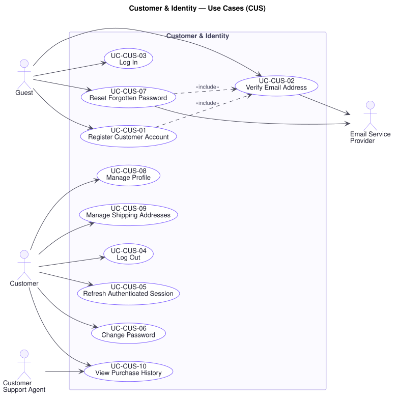

# Customer & Identity — Use Cases (`CUS`)

**Related documents:** [`README.md`](./README.md) (index and template) · [`../srs.md`](../srs.md) · [`../traceability-matrix.md`](../traceability-matrix.md)

---

## Domain Scope

Everything that establishes who a party is and what they may do: account creation, proof of email ownership, authentication and session lifetime, credential recovery, and the profile and address book an order draws on at checkout.

This domain is where **P16** (every role does exactly what its job requires) begins, and where **P5** first bites: an authentication rule enforced in a browser is not enforced at all, because the administrative interface and the future mobile application reach the same platform by other paths.

---

## UC-CUS-01 — Register Customer Account

| Field | Value |
|---|---|
| **Primary actor** | Guest |
| **Supporting actors** | Email Service Provider |
| **Stakeholders & interests** | Guest: wants an account without friction. Marketing: wants registrations to convert. Trust & Safety: wants each account to correspond to a reachable, real address. |
| **Priority** | Must |
| **Trigger** | Guest submits the registration form |
| **Preconditions** | The caller is within rate limit (`UC-AUD-04`) |
| **Success postconditions** | A customer account exists in state unverified; a verification message has been dispatched; no session is issued |
| **Failure postconditions** | No account exists; no message is dispatched; the guest is told what to correct |
| **Frequency** | Moderate; spikes with marketing campaigns |
| **Traceability** | `FR-CUS-01`, `FR-CUS-02` · `BR-CUS-01`, `BR-CUS-02`, `BR-CUS-04` · `NFR-SEC-02`, `NFR-SEC-04` · P16 |

**Main success scenario**

1. Guest supplies an email address, a password, and any profile details the form requires.
2. Platform validates every field against its expected format and the password against the configured strength policy (`NFR-SEC-04`).
3. Platform confirms no account already holds that email address (`BR-CUS-01`).
4. Platform stores the account with the password held only as a one-way salted adaptive hash (`NFR-SEC-02`), in state **unverified**.
5. Platform generates a single-use, time-limited verification token (`BR-CUS-03`) and raises a verification notification (`UC-NTF-01`).
6. Platform tells the guest the account was created and that the email address must be verified before ordering.

**Alternate flows**

- **A1 — Registration during checkout** (at step 1): The guest is registering from an abandoned checkout. On completion the platform preserves the guest cart for merging at first login (`UC-CRT-05`) rather than discarding it.
- **A2 — Optional profile details omitted** (at step 1): Only email and password are mandatory. Absent details are collected later via `UC-CUS-08` or at checkout.

**Exception flows**

- **E1 — Email address already registered** (at step 3): The platform does **not** state that the address is taken, because that discloses account existence to an unauthenticated caller (`BR-CUS-04`). It reports that if an account exists for that address, a message has been sent, and dispatches a "someone tried to register with your address" notification to the real owner. No second account is created.
- **E2 — Password fails the strength policy** (at step 2): The platform reports which criterion was not met and creates no account. The submitted password is never echoed back or logged (`NFR-SEC-07`).
- **E3 — Verification message cannot be dispatched** (at step 5): The account remains created and unverified. The notification is retried per `BR-NTF-01`. The guest is told to expect the message and offered a resend, which is itself rate-limited.
- **E4 — Rate limit exceeded** (at step 1): The request is rejected without evaluation (`UC-AUD-04`). No account is created and no message is dispatched, so that registration cannot be used to send unsolicited mail.

**Business rules applied** — `BR-CUS-01` (one account per email), `BR-CUS-02` (unverified accounts cannot order), `BR-CUS-03` (single-use time-limited token), `BR-CUS-04` (no account-existence disclosure).

**Assumptions & open questions** — Password strength policy is not specified by R1 and must be confirmed. Whether registration by a third-party identity provider is in scope is not stated by R1; this specification assumes it is not.

---

## UC-CUS-02 — Verify Email Address

| Field | Value |
|---|---|
| **Primary actor** | Guest |
| **Supporting actors** | Email Service Provider |
| **Stakeholders & interests** | Customer: wants to start ordering. Trust & Safety: wants a reachable address on file before any order or review is accepted. Customer Support: wants a verified address to correspond through. |
| **Priority** | Must |
| **Trigger** | Guest follows the verification link, or requests a new one |
| **Preconditions** | An account exists in state unverified |
| **Success postconditions** | The account is verified; the token is consumed and cannot be reused |
| **Failure postconditions** | The account remains unverified; the token is consumed if it was invalid by expiry, and the guest is offered a new one |
| **Frequency** | Once per account, plus resends |
| **Traceability** | `FR-CUS-02` · `BR-CUS-02`, `BR-CUS-03` · `NFR-SEC-03` |

**Main success scenario**

1. Guest follows the verification link.
2. Platform confirms the token exists, is unexpired, and has not been used (`BR-CUS-03`).
3. Platform marks the account verified.
4. Platform consumes the token so it cannot be presented again.
5. Platform confirms verification and invites the guest to log in.

**Alternate flows**

- **A1 — Already verified** (at step 2): The account is already verified, because the link was followed twice. The platform reports success rather than an error — the caller's goal is met — and takes no further action.
- **A2 — Resend requested** (at step 1): The guest requests a new verification message. The platform invalidates any outstanding token, issues one new token, and dispatches it. Resends are rate-limited.

**Exception flows**

- **E1 — Token expired** (at step 2): The platform reports that the link has expired, consumes it, and offers to send a new one. The account stays unverified.
- **E2 — Token unrecognised or already consumed** (at step 2): The platform reports the link is not valid, without disclosing whether it never existed or was already used. No state changes.
- **E3 — Account deleted since the message was sent** (at step 3): The platform reports the link is no longer valid and consumes the token.

**Business rules applied** — `BR-CUS-02`, `BR-CUS-03`.

---

## UC-CUS-03 — Log In

| Field | Value |
|---|---|
| **Primary actor** | Guest |
| **Stakeholders & interests** | Customer: wants their cart, addresses, and orders back. Trust & Safety: wants credential guessing to be impractical. |
| **Priority** | Must |
| **Trigger** | Guest submits credentials |
| **Preconditions** | The caller is within the authentication rate limit (`NFR-SEC-05`) |
| **Success postconditions** | An access token and a refresh token are issued; any guest cart has been merged (`UC-CRT-05`) |
| **Failure postconditions** | No token is issued; the failure is counted toward the rate limit; the response is indistinguishable from any other credential failure |
| **Frequency** | Very high |
| **Traceability** | `FR-CUS-03`, `FR-CRT-06` · `BR-CUS-03`, `BR-CUS-04` · `NFR-SEC-02`, `NFR-SEC-03`, `NFR-SEC-05` · P16 |

**Main success scenario**

1. Guest supplies email address and password.
2. Platform checks the request against the authentication rate limit, which is stricter than the general limit (`NFR-SEC-05`).
3. Platform verifies the password against the stored hash (`NFR-SEC-02`).
4. Platform issues a short-lived access token and a rotating refresh token (`NFR-SEC-03`).
5. Platform merges any guest cart into the customer's stored cart (`UC-CRT-05`).
6. Platform returns the tokens and the customer's authenticated context.

**Alternate flows**

- **A1 — Unverified account** (at step 4): The account exists and the password is correct but the address is unverified. The platform issues a session with restricted authority: the customer may browse, manage their cart, and re-request verification, but `BR-CUS-02` blocks order placement and review submission. The restriction and its remedy are stated plainly.
- **A2 — No guest cart present** (at step 5): The step is skipped; login is unaffected.

**Exception flows**

- **E1 — Credentials do not match** (at step 3): The platform reports a single generic failure, identical whether the address is unknown or the password is wrong (`BR-CUS-04`). The attempt is counted. Timing does not distinguish the two cases.
- **E2 — Authentication rate limit exceeded** (at step 2): The platform rejects the attempt without evaluating credentials, and reports when the caller may retry. Correct credentials do not bypass the limit.
- **E3 — Account suspended** (at step 3): The platform reports the account is unavailable and directs the customer to support. It does not disclose the reason for suspension, which may relate to an open fraud investigation.
- **E4 — Cart merge fails** (at step 5): Login **succeeds**. The merge is a subordinate goal and its failure never denies access. The platform preserves the guest cart for retry and tells the customer their previous cart items were not carried over. Handling this way avoids a rule that would lock a customer out because of a cart problem.

**Business rules applied** — `BR-CUS-02`, `BR-CUS-03`, `BR-CUS-04`, `BR-CRT-03`.

**Assumptions & open questions** — Whether repeated failures should lock an account, and for how long, is not specified by R1. Locking on failure count alone creates a denial-of-service against a known address; rate limiting per caller (`NFR-SEC-05`) is specified instead, and account lockout policy is referred to the Product Owner.

---

## UC-CUS-04 — Log Out

| Field | Value |
|---|---|
| **Primary actor** | Customer |
| **Stakeholders & interests** | Customer: wants the session genuinely ended, particularly on a shared device. Trust & Safety: wants a discarded token to be unusable. |
| **Priority** | Must |
| **Trigger** | Customer requests to log out |
| **Preconditions** | An authenticated session exists |
| **Success postconditions** | The refresh token is invalidated and cannot be exchanged again; the cart persists for the next session |
| **Failure postconditions** | The session is treated as ended from the customer's point of view; any token that could not be invalidated is recorded for reconciliation |
| **Frequency** | High |
| **Traceability** | `FR-CUS-04` · `BR-CUS-03` · `NFR-SEC-03` |

**Main success scenario**

1. Customer requests to log out.
2. Platform invalidates the refresh token backing the session (`BR-CUS-03`).
3. Platform confirms the session has ended.

**Alternate flows**

- **A1 — Log out of all sessions** (at step 2): The customer asks to end every session. The platform invalidates all of that customer's refresh tokens, ending sessions on every device.

**Exception flows**

- **E1 — Session already ended or token unrecognised** (at step 2): The platform reports success. The caller's goal — not being logged in — already holds, and reporting an error here only invites a retry that cannot help.
- **E2 — Invalidation cannot be completed** (at step 2): The platform still ends the session for the caller and records the token for retry, because a token whose invalidation silently failed is a security exposure that must be visible.

**Business rules applied** — `BR-CUS-03`.

---

## UC-CUS-05 — Refresh Authenticated Session

| Field | Value |
|---|---|
| **Primary actor** | Customer |
| **Stakeholders & interests** | Customer: wants to stay logged in without re-entering credentials. Trust & Safety: wants a stolen token to have a short useful life and a detectable reuse. |
| **Priority** | Must |
| **Trigger** | The access token is near expiry or has expired |
| **Preconditions** | A valid, unexpired, unconsumed refresh token is held |
| **Success postconditions** | A new access token and a new refresh token are issued; the presented refresh token is consumed |
| **Failure postconditions** | No token is issued; the customer must authenticate again |
| **Frequency** | Very high |
| **Traceability** | `FR-CUS-05` · `BR-CUS-03` · `NFR-SEC-03` |

**Main success scenario**

1. Customer presents the refresh token.
2. Platform confirms it exists, is unexpired, and has not been consumed (`BR-CUS-03`).
3. Platform issues a new access token and a new refresh token, and consumes the presented one (`NFR-SEC-03`).
4. Platform returns the new tokens.

**Alternate flows**

- **A1 — Roles changed since issue** (at step 3): The customer's roles have been amended by `UC-ADM-06` since the token was issued. The new access token carries the current roles, so that a revoked authority does not survive in an outstanding token longer than one refresh interval (`P16`).

**Exception flows**

- **E1 — Token expired** (at step 2): The platform declines and requires full authentication (`UC-CUS-03`).
- **E2 — Consumed token presented again** (at step 2): This indicates either a replay or a stolen token. The platform declines **and invalidates the entire token chain for that session**, forcing re-authentication. A legitimate customer is inconvenienced once; a thief loses the session.
- **E3 — Account suspended since issue** (at step 3): The platform declines and invalidates all tokens for the account.

**Business rules applied** — `BR-CUS-03`, `BR-AUD-02`.

---

## UC-CUS-06 — Change Password

| Field | Value |
|---|---|
| **Primary actor** | Customer |
| **Supporting actors** | Email Service Provider |
| **Stakeholders & interests** | Customer: wants to rotate a credential they believe is exposed. Trust & Safety: wants a hijacked session unable to lock the real owner out silently. |
| **Priority** | Must |
| **Trigger** | Customer submits a password change |
| **Preconditions** | An authenticated session exists |
| **Success postconditions** | The stored hash reflects the new password; other sessions are ended; the customer is notified of the change |
| **Failure postconditions** | The stored credential is unchanged; no session is ended |
| **Frequency** | Low |
| **Traceability** | `FR-CUS-06` · `BR-CUS-03` · `NFR-SEC-02`, `NFR-SEC-07` |

**Main success scenario**

1. Customer supplies the current password and the new one.
2. Platform re-verifies the current password, notwithstanding the active session.
3. Platform validates the new password against the strength policy.
4. Platform stores the new one-way hash (`NFR-SEC-02`).
5. Platform invalidates every refresh token for the account except the one in use, ending other sessions (`BR-CUS-03`).
6. Platform notifies the customer at their registered address that the password changed (`UC-NTF-01`).
7. Platform confirms the change.

**Alternate flows**

- **A1 — Ending the current session too** (at step 5): The customer elects to end every session including this one. The platform invalidates all tokens and returns them to login.

**Exception flows**

- **E1 — Current password incorrect** (at step 2): The platform declines and leaves the credential unchanged. Re-verification at step 2 exists for this case: a hijacked session should not be able to seize the account by changing its password.
- **E2 — New password fails the strength policy** (at step 3): The platform reports which criterion failed. Nothing changes.
- **E3 — New password identical to the current one** (at step 3): The platform declines, since the customer's goal in rotating a credential is not served by keeping it.
- **E4 — Notification cannot be dispatched** (at step 6): The password change **stands**. The notification is retried per `BR-NTF-01`; reversing a completed credential change because a message failed would be worse for the customer than a delayed message.

**Business rules applied** — `BR-CUS-03`.

---

## UC-CUS-07 — Reset Forgotten Password

| Field | Value |
|---|---|
| **Primary actor** | Guest |
| **Supporting actors** | Email Service Provider |
| **Stakeholders & interests** | Customer: locked out and wants back in. Trust & Safety: wants the reset path not to become the weakest way into an account. Customer Support: wants self-service recovery rather than support tickets. |
| **Priority** | Must |
| **Trigger** | Guest requests a password reset |
| **Preconditions** | The caller is within rate limit |
| **Success postconditions** | The password is replaced; the reset token is consumed; every session for the account is ended; the customer is notified |
| **Failure postconditions** | The credential is unchanged; the response discloses nothing about whether the address is registered |
| **Frequency** | Moderate |
| **Traceability** | `FR-CUS-07` · `BR-CUS-03`, `BR-CUS-04` · `NFR-SEC-02`, `NFR-SEC-05` |

**Main success scenario**

1. Guest supplies the email address of the account.
2. Platform responds identically whether or not an account exists: a message has been sent if the address is registered (`BR-CUS-04`).
3. Where an account exists, the platform invalidates any outstanding reset token, issues one single-use, time-limited token, and dispatches it (`UC-NTF-01`).
4. Guest follows the link and supplies a new password.
5. Platform confirms the token is valid and unconsumed, and validates the new password against the strength policy.
6. Platform stores the new hash, consumes the token, and invalidates every refresh token for the account (`BR-CUS-03`).
7. Platform notifies the customer that the password was reset, and confirms.

**Alternate flows**

- **A1 — Account unverified** (at step 3): Completing a reset proves control of the address, so the platform marks the account verified on success at step 6, sparing the customer a second round trip.
- **A2 — Second reset requested before the first is used** (at step 3): The platform invalidates the earlier token and issues one new token, so that at most one is live at a time.

**Exception flows**

- **E1 — Address not registered** (at step 2): The platform gives the same response as success and dispatches nothing. The reset endpoint must not become a way to enumerate registered addresses (`BR-CUS-04`).
- **E2 — Token expired or already consumed** (at step 5): The platform declines and offers a fresh request. The credential is unchanged.
- **E3 — New password fails the strength policy** (at step 5): The platform reports the failure and **does not** consume the token, so the guest can correct the password without restarting.
- **E4 — Rate limit exceeded** (at step 1): The request is rejected without evaluation, preventing the reset path being used to flood an address with mail.

**Business rules applied** — `BR-CUS-02`, `BR-CUS-03`, `BR-CUS-04`.

---

## UC-CUS-08 — Manage Profile

| Field | Value |
|---|---|
| **Primary actor** | Customer |
| **Supporting actors** | Email Service Provider |
| **Stakeholders & interests** | Customer: wants their details current. Customer Support: wants to reach the right person. Marketing: wants accurate contact data. |
| **Priority** | Must |
| **Trigger** | Customer opens or submits their profile |
| **Preconditions** | An authenticated session exists |
| **Success postconditions** | The profile reflects the submitted values; a changed email address is held pending until verified |
| **Failure postconditions** | The profile is unchanged and the customer is told what to correct |
| **Frequency** | Low |
| **Traceability** | `FR-CUS-08` · `BR-CUS-01`, `BR-CUS-03` · `NFR-SEC-04` |

**Main success scenario**

1. Customer opens their profile; the platform presents the current values.
2. Customer amends one or more fields and submits.
3. Platform validates each field (`NFR-SEC-04`).
4. Platform stores the amended profile.
5. Platform confirms the change.

**Alternate flows**

- **A1 — Email address changed** (at step 3): The platform confirms no other account holds the new address (`BR-CUS-01`), retains the **existing** address as current, records the new one as pending, and dispatches a verification message to it. The change takes effect only when that token is used (`UC-CUS-02`). The platform also notifies the **old** address that a change was requested, so that a hijacked session cannot move an account away from its owner unseen.
- **A2 — No field actually changed** (at step 4): The platform stores nothing and reports success.

**Exception flows**

- **E1 — New email address already registered** (at step 3): The platform reports the address cannot be used, without confirming an account exists on it. The current address is retained.
- **E2 — Validation fails** (at step 3): No field is stored — the submission is applied whole or not at all, so the customer is never left with a half-applied profile.

**Business rules applied** — `BR-CUS-01`, `BR-CUS-03`.

---

## UC-CUS-09 — Manage Shipping Addresses

| Field | Value |
|---|---|
| **Primary actor** | Customer |
| **Stakeholders & interests** | Customer: wants checkout to be quick and deliveries to arrive. Warehouse and Carrier: want a deliverable address. Finance: wants failed deliveries and redelivery cost minimised. |
| **Priority** | Must |
| **Trigger** | Customer opens their address book, or adds an address during checkout |
| **Preconditions** | An authenticated session exists |
| **Success postconditions** | The address book reflects the change; exactly one address is default; addresses referenced by existing orders remain intact |
| **Failure postconditions** | The address book is unchanged |
| **Frequency** | Low, concentrated around a first order |
| **Traceability** | `FR-CUS-09` · `BR-CUS-05` · `NFR-SEC-04`, `FR-DAT-04` |

**Main success scenario**

1. Customer opens the address book; the platform lists their addresses and marks the default.
2. Customer adds a new address.
3. Platform validates the address fields against the expected format for the destination.
4. Platform stores the address, marking it default if it is the customer's first (`BR-CUS-05`).
5. Platform confirms and re-lists the address book.

**Alternate flows**

- **A1 — Amend an existing address** (at step 2): The platform validates and stores the amendment. Orders already placed against that address keep the values recorded at placement and are unaffected (`FR-DAT-04`) — a delivered order's address is a historic fact, not a live reference.
- **A2 — Remove an address** (at step 2): The platform removes it from the address book. Orders that used it are unaffected, for the same reason. If the removed address was default and others remain, the platform requires the customer to nominate a new default.
- **A3 — Nominate a new default** (at step 2): The platform sets the nominated address default and clears the nomination from the previous one, so exactly one remains (`BR-CUS-05`).
- **A4 — Added mid-checkout** (at step 2): The address is stored and immediately selected for the checkout in progress, which triggers shipping fee recalculation (`BR-SHP-01`, `UC-ORD-02`).

**Exception flows**

- **E1 — Address fails validation** (at step 3): The platform reports which field is wrong and stores nothing.
- **E2 — Removing the only address** (at step 2, A2): The platform allows it. A customer may legitimately have no stored address; checkout will require one at that point rather than blocking address management now.
- **E3 — Amending an address used by an in-flight checkout** (at step 2, A1): The platform applies the amendment and recalculates the shipping fee for that checkout (`BR-SHP-01`), so the fee presented at confirmation is the fee for the address actually being shipped to.

**Business rules applied** — `BR-CUS-05`, `BR-SHP-01`.

---

## UC-CUS-10 — View Purchase History

| Field | Value |
|---|---|
| **Primary actor** | Customer |
| **Stakeholders & interests** | Customer: wants to find a past order, reorder, or start a return. Customer Support: needs the same view to resolve a query. Finance: wants the record to match what was charged. |
| **Priority** | Must |
| **Trigger** | Customer opens their order history |
| **Preconditions** | An authenticated session exists |
| **Success postconditions** | The customer's orders are presented in reverse chronological order with current states; no other customer's order is visible |
| **Failure postconditions** | Nothing is disclosed |
| **Frequency** | High |
| **Traceability** | `FR-CUS-10`, `FR-ORD-12` · `BR-AUD-02` · `NFR-PERF-01`, `FR-DAT-03`, `FR-DAT-04` |

**Main success scenario**

1. Customer opens their order history.
2. Platform authorises the request and scopes it to the acting customer (`UC-AUD-03`, `BR-AUD-02`).
3. Platform retrieves the customer's orders, most recent first, paginated.
4. Platform presents each order with its date, its line items, its total as charged, and its current state.
5. Customer opens an order for full detail (`UC-ORD-06`).

**Alternate flows**

- **A1 — Support views a customer's history** (at step 2): A Customer Support Agent or Administrator views the history of a nominated customer. Authorisation is by role rather than ownership (`BR-AUD-02`), and the access is auditable (`UC-AUD-01`).
- **A2 — No orders yet** (at step 3): The platform presents an empty history explicitly, rather than an error.
- **A3 — Filtered by state or period** (at step 3): The customer narrows the history, most often to find an order eligible for return.

**Exception flows**

- **E1 — Another customer's order requested** (at step 2): The platform declines and gives the same response as for an order that does not exist, so that order identifiers cannot be probed for existence. The attempt is recorded (`UC-AUD-01`).
- **E2 — Order references a deleted product** (at step 4): The order still presents in full, using the name and price recorded at placement (`FR-DAT-03`, `FR-DAT-04`). A catalog change never rewrites purchase history.

**Business rules applied** — `BR-AUD-02`, `BR-ORD-06`.
