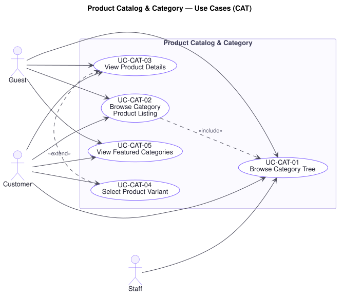

# Product Catalog & Category — Use Cases (`CAT`)

**Related documents:** [`README.md`](./README.md) (index and template) · [`../srs.md`](../srs.md) · [`../traceability-matrix.md`](../traceability-matrix.md)

---

## Domain Scope

How a shopper reaches a product through structure rather than search: the category tree, the listings hanging off it, and the product detail that decides whether an item enters a cart.

This domain is read-dominated and conversion-critical. **P11** — customers who cannot quickly find what they want leave without buying — and **P12** — browsing and transacting are different jobs — both land here. The cost of failure is invisible: it appears as a missing sale, never as a complaint.

---

## UC-CAT-01 — Browse Category Tree

| Field | Value |
|---|---|
| **Primary actor** | Guest |
| **Stakeholders & interests** | Guest and Customer: want to narrow from a broad idea to a specific product. Staff: want the merchandising structure to be navigable. Marketing: wants browse depth to convert. |
| **Priority** | Must |
| **Trigger** | Visitor opens category navigation |
| **Success postconditions** | The navigable category structure is presented; no state changes |
| **Failure postconditions** | Nothing is presented; browsing by other means (search, featured) remains available |
| **Frequency** | Very high |
| **Traceability** | `FR-CAT-05`, `FR-CAT-07` · `BR-CAT-03` · `NFR-PERF-01`, `NFR-AVAIL-02` · P11 |

**Main success scenario**

1. Visitor opens category navigation.
2. Platform retrieves the category tree with each category's name, image, and child categories.
3. Platform presents the tree, allowing descent to arbitrary depth (`FR-CAT-05`).
4. Visitor selects a category and proceeds to its listing (`UC-CAT-02`).

**Alternate flows**

- **A1 — Deep link into a subcategory** (at step 1): The visitor arrives directly at a nested category. The platform presents the ancestor path so the visitor can move back up rather than only down.
- **A2 — Category has no image** (at step 3): The category is presented with its name alone. A missing image never suppresses a category from navigation.

**Exception flows**

- **E1 — Category does not exist or has been removed** (at step 2): The platform reports the category is unavailable and presents the nearest surviving ancestor, so the visitor lands somewhere useful rather than at a dead end.
- **E2 — Category tree unavailable** (at step 2): Search and featured categories remain available (`NFR-AVAIL-02`). Navigation degrades; the purchase path does not close.

**Business rules applied** — `BR-CAT-02` (unpublished products excluded from counts), `BR-CAT-03` (no category is its own ancestor).

---

## UC-CAT-02 — Browse Category Product Listing

| Field | Value |
|---|---|
| **Primary actor** | Guest |
| **Stakeholders & interests** | Guest and Customer: want to compare candidates quickly. Marketing: wants listing performance to drive conversion. Finance: wants prices shown to be prices charged. |
| **Priority** | Must |
| **Trigger** | Visitor selects a category |
| **Preconditions** | The category exists and is reachable |
| **Success postconditions** | A paginated listing of published products in the category is presented with current price and availability |
| **Failure postconditions** | Nothing is presented; no cart or order state changes |
| **Frequency** | Very high |
| **Traceability** | `FR-CAT-03`, `FR-CAT-08`, `FR-INV-07` · `BR-CAT-02` · `NFR-PERF-01`, `NFR-SCAL-01` · P11, P12 |

**Main success scenario**

1. Visitor selects a category.
2. Platform retrieves the published products in that category and its descendants (`BR-CAT-02`).
3. Platform applies the default ordering.
4. Platform presents a page of results with each product's name, image, current price, and availability (`FR-INV-07`).
5. Visitor opens a product (`UC-CAT-03`) or moves to the next page.

**Alternate flows**

- **A1 — Re-ordered by the visitor** (at step 3): The visitor orders by price, newest, or popularity (`FR-CAT-08`). The listing is re-retrieved from the first page, since a changed ordering makes the previous page position meaningless.
- **A2 — Narrowed by filter** (at step 3): The visitor narrows by brand, price range, or attribute. The behaviour is that of `UC-SCH-03` applied to a category rather than a query.
- **A3 — Out-of-stock products included** (at step 4): Products with no available stock are shown, marked unavailable, rather than hidden. Hiding them loses the visitor a product they may still want to find and wait for.

**Exception flows**

- **E1 — Category contains no published products** (at step 2): The platform presents an empty listing explicitly and offers sibling categories, rather than presenting an error.
- **E2 — Page requested beyond the last** (at step 4): The platform presents the last available page rather than an empty one.
- **E3 — Availability cannot be determined** (at step 4): Products are presented with availability marked unknown rather than suppressing the listing. `UC-ORD-05` re-checks availability at placement and will not oversell (`BR-INV-01`), so an optimistic listing cannot cause a bad sale.

**Business rules applied** — `BR-CAT-02`, `BR-INV-01`.

---

## UC-CAT-03 — View Product Details

| Field | Value |
|---|---|
| **Primary actor** | Guest |
| **Stakeholders & interests** | Guest and Customer: want enough to decide. Staff: want merchandising content to reach the shopper intact. Finance: wants the displayed price to be the price charged. Support: wants fewer "not as described" disputes. |
| **Priority** | Must |
| **Trigger** | Visitor opens a product |
| **Preconditions** | The product exists and is published |
| **Success postconditions** | Full product detail is presented, including variants, images, attributes, aggregate rating, and per-variant availability |
| **Failure postconditions** | Nothing is presented; no state changes |
| **Frequency** | Very high |
| **Traceability** | `FR-CAT-01`, `FR-CAT-04`, `FR-INV-07`, `FR-REV-07` · `BR-CAT-01`, `BR-CAT-02` · `NFR-PERF-01`, `NFR-AVAIL-02` · P11 |

**Main success scenario**

1. Visitor opens a product.
2. Platform confirms the product is published (`BR-CAT-02`).
3. Platform retrieves its name, description, images, brand, categories, attributes, price, and variants.
4. Platform retrieves per-variant availability (`FR-INV-07`).
5. Platform retrieves the aggregate rating and recent reviews (`UC-REV-04`).
6. Platform retrieves related products (`UC-SCH-05`).
7. Platform presents the assembled detail.

**Alternate flows**

- **A1 — Product has variants** (at step 3): The platform presents the variant dimensions and their selectable values, deferring price and availability to variant selection (`UC-CAT-04`).
- **A2 — Product is on promotion** (at step 3): Both the standard and the promotional price are presented, together with the period the promotion runs, so the shopper can see what is being offered (`FR-PRM-02`).
- **A3 — Every variant is out of stock** (at step 4): The product is presented, marked unavailable, with the add-to-cart action disabled. The page is not withdrawn.

**Exception flows**

- **E1 — Product unpublished or removed** (at step 2): The platform reports the product is unavailable and offers the containing category. A customer whose existing order includes the product still sees it in full on that order (`FR-DAT-04`).
- **E2 — Reviews unavailable** (at step 5): The product is presented without the review section (`NFR-AVAIL-02`). A review outage must not close the purchase path.
- **E3 — Related products unavailable** (at step 6): The product is presented without recommendations, for the same reason.

**Business rules applied** — `BR-CAT-01`, `BR-CAT-02`.

---

## UC-CAT-04 — Select Product Variant

| Field | Value |
|---|---|
| **Primary actor** | Customer |
| **Stakeholders & interests** | Customer: wants the exact configuration they intend to buy. Warehouse: wants the order to name a single stockable unit. Finance: wants the variant's own price applied. |
| **Priority** | Must |
| **Trigger** | Customer selects variant values on a product page |
| **Preconditions** | The product is published and has variants |
| **Success postconditions** | A single variant is identified, with its own SKU, price, and availability |
| **Failure postconditions** | No variant is selected; the product cannot be added to a cart |
| **Frequency** | Very high |
| **Traceability** | `FR-CAT-02` · `BR-CAT-01` · `NFR-PERF-01` |

**Main success scenario**

1. Customer selects a value for each variant dimension.
2. Platform resolves the selection to a single variant (`BR-CAT-01`).
3. Platform retrieves that variant's price and available stock.
4. Platform presents the variant's price and availability and enables adding it to the cart (`UC-CRT-01`).

**Alternate flows**

- **A1 — Partial selection** (at step 2): Not every dimension is chosen. The platform presents the price range across the matching variants and keeps add-to-cart disabled until exactly one variant is identified — an order line must name one stockable unit.
- **A2 — Unavailable combinations shown** (at step 1): Combinations that do not exist or hold no stock are marked as such before selection, so the customer is not led into a dead end.

**Exception flows**

- **E1 — Combination does not exist** (at step 2): The platform reports it is unavailable and retains the rest of the selection so the customer can change one dimension rather than start over.
- **E2 — Variant out of stock** (at step 3): The variant is selectable and its detail presented, but add-to-cart is disabled and the customer is told it is out of stock (`BR-CRT-02`).

**Business rules applied** — `BR-CAT-01`, `BR-CRT-02`.

---

## UC-CAT-05 — View Featured Categories

| Field | Value |
|---|---|
| **Primary actor** | Guest |
| **Stakeholders & interests** | Marketing: wants a merchandising surface for campaigns. Guest and Customer: want a starting point without knowing what to search for. |
| **Priority** | Should |
| **Trigger** | Visitor opens the storefront home |
| **Success postconditions** | Categories designated as featured are presented with their images |
| **Failure postconditions** | The section is omitted; the rest of the storefront is unaffected |
| **Frequency** | Very high |
| **Traceability** | `FR-CAT-06`, `FR-CAT-07` · `NFR-PERF-01`, `NFR-AVAIL-02` · P11 |

**Main success scenario**

1. Visitor opens the storefront home.
2. Platform retrieves the categories designated as featured, in their configured order.
3. Platform presents each with its name and image.
4. Visitor selects one and proceeds to its listing (`UC-CAT-02`).

**Alternate flows**

- **A1 — None designated** (at step 2): The platform omits the section rather than presenting an empty one.

**Exception flows**

- **E1 — Featured categories unavailable** (at step 2): The section is omitted and the remainder of the home page is presented (`NFR-AVAIL-02`).
- **E2 — A featured category has been removed** (at step 2): It is omitted from the set. One removed category does not suppress the others.

**Business rules applied** — `BR-CAT-02`, `BR-CAT-03`.
