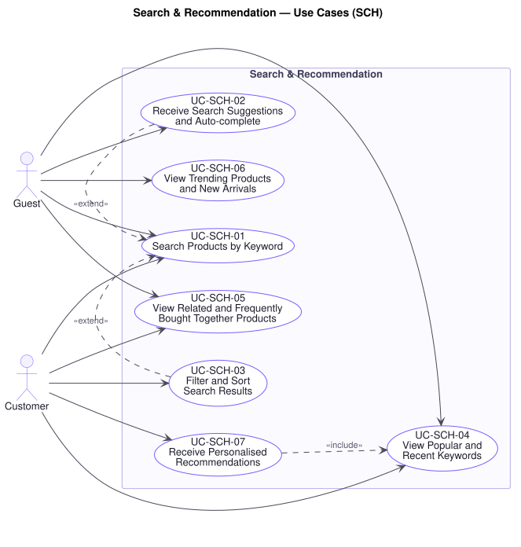

# Search & Recommendation — Use Cases (`SCH`)

**Document type:** Use Case Specification — domain
**Related documents:** [`README.md`](./README.md) (index and template) · [`../srs.md`](../srs.md) · [`../traceability-matrix.md`](../traceability-matrix.md)
**Audience:** Product Management, Engineering, Quality Assurance

---

## Domain Scope

How a shopper reaches a product by intent rather than structure: keyword search, suggestion, narrowing and ordering of results, and the recommendations that surface products the shopper did not know to ask for.

**P11** is this domain's reason for existing. A slow or irrelevant result set loses the sale before the product page is ever reached, and the loss never appears as a support ticket — only as a missing transaction. **P12** applies with equal force: search must be fast and flexible, which is a different requirement from the accuracy checkout demands, and satisfying both with one approach compromises both.

Every use case in this domain is a read. None of them changes an order, a price, or a stock level, and none may block the purchase path when it fails (`NFR-AVAIL-02`).

---

## UC-SCH-01 — Search Products by Keyword

| Field | Value |
|---|---|
| **Primary actor** | Guest |
| **Supporting actors** | — |
| **Stakeholders & interests** | Guest and Customer: want the product they have in mind, immediately. Marketing: wants search to convert. Leadership: sees the cost of failure only in the sales figures (`P11`). |
| **Priority** | Must |
| **Trigger** | Visitor submits a keyword query |
| **Preconditions** | The caller is within rate limit |
| **Success postconditions** | Matching published products are presented, ordered by relevance; the query is recorded for `UC-SCH-04` |
| **Failure postconditions** | No results are presented; browsing by category remains available |
| **Frequency** | Very high; peaks with campaigns |
| **Traceability** | `FR-SCH-01` · `BR-CAT-02`, `BR-SCH-01` · `NFR-PERF-03`, `NFR-SCAL-01`, `NFR-AVAIL-02` · P11, P12 |

**Main success scenario**

1. Visitor submits a keyword query.
2. Platform validates and normalises the query (`NFR-SEC-04`).
3. Platform matches it against product name, description, brand, and attribute values (`FR-SCH-01`).
4. Platform excludes unpublished products (`BR-CAT-02`).
5. Platform orders results by relevance to the query (`FR-SCH-04`).
6. Platform presents a paginated result set within the search latency target (`NFR-PERF-03`), each result carrying price and availability.
7. Platform records the query against the visitor's recent keywords and the platform-wide popular keywords (`UC-SCH-04`).

**Alternate flows**

- **A1 — Query matches exactly one product** (at step 6): The platform still presents a result set rather than redirecting, so the visitor can see they searched correctly and can widen if the single match is wrong.
- **A2 — Query resembles a SKU or brand** (at step 3): Exact matches on SKU or brand rank above partial text matches, since a visitor typing an identifier has already decided.
- **A3 — Narrowed or re-ordered** (at step 6): The visitor applies filters or a different ordering; behaviour is `UC-SCH-03`.

**Exception flows**

- **E1 — No results** (at step 3): The platform states plainly that nothing matched, and offers suggestions, popular keywords, and category navigation. An empty result set is a conversion risk to be recovered from, not an error to report.
- **E2 — Search unavailable** (at step 3): The platform tells the visitor search is temporarily unavailable and offers category browsing (`UC-CAT-01`). Cart and checkout remain fully operational (`NFR-AVAIL-02`) — a search outage must never close the purchase path.
- **E3 — Search index lags the catalog** (at step 3): Results may briefly omit a newly published product or include a newly unpublished one. `UC-CAT-03` re-checks publication and `UC-ORD-05` re-checks availability at placement, so a stale result cannot produce a bad sale. This lag is the deliberate trade-off recorded as **P4**.
- **E4 — Rate limit exceeded** (at step 1): The request is rejected without evaluation (`UC-AUD-04`).

**Business rules applied** — `BR-CAT-02`, `BR-SCH-01`.

**Assumptions & open questions** — R1 §4 does not state a permitted staleness for the search index. **[A-11]** applies a 5-minute bound; confirmation is required.

---

## UC-SCH-02 — Receive Search Suggestions and Auto-complete

| Field | Value |
|---|---|
| **Primary actor** | Guest |
| **Supporting actors** | — |
| **Stakeholders & interests** | Guest and Customer: want to reach the query without typing it or misspelling it. Marketing: wants suggestion to steer toward products that exist. |
| **Priority** | Should |
| **Trigger** | Visitor types into the search field |
| **Preconditions** | The caller is within rate limit |
| **Success postconditions** | Candidate completions are presented; no state changes |
| **Failure postconditions** | No suggestions appear; typing and submitting the query remains fully available |
| **Frequency** | Extremely high — several requests per search |
| **Traceability** | `FR-SCH-02` · `BR-SCH-01` · `NFR-PERF-04`, `NFR-AVAIL-02` · P11 |

**Main success scenario**

1. Visitor types a partial query.
2. Platform matches the partial term against known product terms and popular keywords.
3. Platform presents ranked completions within the auto-complete latency target (`NFR-PERF-04`).
4. Visitor selects a completion, which submits it as a query (`UC-SCH-01`).

**Alternate flows**

- **A1 — Authenticated visitor** (at step 2): The customer's own recent keywords are blended into the suggestions, scoped strictly to that customer (`BR-SCH-01`).
- **A2 — Partial term too short** (at step 2): Below the configured minimum length the platform suggests nothing, rather than returning a set too broad to help.

**Exception flows**

- **E1 — No completions match** (at step 3): The platform presents nothing and leaves the typed text untouched. It never substitutes a different query for the one being typed.
- **E2 — Suggestion service unavailable** (at step 2): Suggestions are omitted silently. The visitor can still type and submit the query — a failed convenience must not obstruct the underlying goal.
- **E3 — Latency target exceeded** (at step 3): The response is abandoned rather than presented late, since a completion that arrives after the visitor has typed past it is a distraction.

**Business rules applied** — `BR-SCH-01`, `BR-CAT-02`.

---

## UC-SCH-03 — Filter and Sort Search Results

| Field | Value |
|---|---|
| **Primary actor** | Guest |
| **Supporting actors** | — |
| **Stakeholders & interests** | Guest and Customer: want to reduce a large result set to a decidable one. Marketing: wants filtering to shorten the path to purchase rather than lengthen it. |
| **Priority** | Must |
| **Trigger** | Visitor applies a filter or changes the ordering |
| **Preconditions** | A result set or category listing is presented |
| **Success postconditions** | The result set reflects every applied filter and the chosen ordering |
| **Failure postconditions** | The previous result set stands; the visitor is told the narrowing could not be applied |
| **Frequency** | Very high |
| **Traceability** | `FR-SCH-03`, `FR-SCH-04` · `BR-CAT-02` · `NFR-PERF-03` · P11, P12 |

**Main success scenario**

1. Visitor applies one or more filters — category, brand, price range, attribute value, availability.
2. Platform validates each filter value (`NFR-SEC-04`).
3. Platform applies every filter in combination, narrowing rather than widening the set.
4. Platform applies the chosen ordering — relevance, price, newest, or rating (`FR-SCH-04`).
5. Platform presents the narrowed set from its first page, with the count of matches and the active filters shown so they can be removed individually.

**Alternate flows**

- **A1 — Filter removed** (at step 1): The platform re-retrieves with the remaining filters. Removal must be as easy as application, since a visitor who over-narrows and cannot back out abandons.
- **A2 — Applied to a category listing** (at step 1): The same behaviour applies with the category as the base set rather than a query (`UC-CAT-02`).
- **A3 — Ordering changed without filtering** (at step 4): Only the ordering is re-applied; the set is unchanged but pagination restarts, since the previous page position no longer refers to the same products.

**Exception flows**

- **E1 — Filter combination matches nothing** (at step 3): The platform states plainly that no product matches all the active filters and offers to remove the most restrictive one. It does not silently drop a filter to manufacture results — a visitor must be able to trust that what is shown satisfies what they asked for.
- **E2 — Invalid filter value** (at step 2): The offending filter is rejected and named; the remaining filters still apply.
- **E3 — Price range inverted** (at step 2): The platform interprets the bounds in the order that makes the range non-empty rather than rejecting an obvious slip.

**Business rules applied** — `BR-CAT-02`.

---

## UC-SCH-04 — View Popular and Recent Keywords

| Field | Value |
|---|---|
| **Primary actor** | Guest |
| **Supporting actors** | — |
| **Stakeholders & interests** | Guest and Customer: want a starting point, or their previous search back. Marketing: wants visibility of what shoppers are actually asking for. Legal/Compliance: wants one customer's history never visible to another. |
| **Priority** | Could |
| **Trigger** | Visitor opens the search field before typing |
| **Preconditions** | None |
| **Success postconditions** | Platform-wide popular keywords are presented; for an authenticated customer, their own recent keywords are presented alongside |
| **Failure postconditions** | The section is omitted; search remains fully usable |
| **Frequency** | Very high |
| **Traceability** | `FR-SCH-05`, `FR-SCH-06` · `BR-SCH-01` · `NFR-AVAIL-02`, `NFR-SEC-01` · P11, P16 |

**Main success scenario**

1. Visitor opens the search field.
2. Platform retrieves the most frequently searched keywords across the platform (`FR-SCH-05`).
3. Where the visitor is authenticated, the platform retrieves that customer's own recent keywords, scoped strictly to them (`FR-SCH-06`, `BR-SCH-01`).
4. Platform presents both sets, distinguishing which is which.
5. Visitor selects a keyword, submitting it as a query (`UC-SCH-01`).

**Alternate flows**

- **A1 — Guest visitor** (at step 3): No personal history exists. Only popular keywords are presented, with no placeholder implying a history is being withheld.
- **A2 — Customer clears their history** (at step 4): The customer removes an individual keyword or all of them. The platform deletes them and they do not reappear.

**Exception flows**

- **E1 — Popular keywords unavailable** (at step 2): The section is omitted (`NFR-AVAIL-02`).
- **E2 — Personal history unavailable** (at step 3): Popular keywords are still presented. The platform never falls back to another customer's history — an empty personal section is correct, a wrong one is a breach (`BR-SCH-01`, `P16`).

**Business rules applied** — `BR-SCH-01`.

**Assumptions & open questions** — How long personal search history is retained is not specified by R1 and requires confirmation, as it carries data-protection implications.

---

## UC-SCH-05 — View Related and Frequently Bought Together Products

| Field | Value |
|---|---|
| **Primary actor** | Guest |
| **Supporting actors** | — |
| **Stakeholders & interests** | Customer: wants alternatives and complements without searching again. Marketing: wants basket size to grow. Finance: wants incremental revenue per session. |
| **Priority** | Should |
| **Trigger** | Visitor opens a product or the cart |
| **Preconditions** | A product is in context |
| **Success postconditions** | Related and complementary products are presented; no state changes |
| **Failure postconditions** | The section is omitted; the product page and cart are unaffected |
| **Frequency** | Very high |
| **Traceability** | `FR-SCH-07`, `FR-SCH-08` · `BR-CAT-02` · `NFR-AVAIL-02` · P11, P2 |

**Main success scenario**

1. Visitor opens a product (`UC-CAT-03`) or the cart (`UC-CRT-04`).
2. Platform retrieves products related to the product in context (`FR-SCH-07`).
3. Platform retrieves products frequently purchased alongside it (`FR-SCH-08`).
4. Platform excludes unpublished products and products already in the visitor's cart (`BR-CAT-02`).
5. Platform presents both sets, distinguishing alternatives from complements.

**Alternate flows**

- **A1 — Insufficient purchase history for the product** (at step 3): The complements set cannot be computed for a product with too few co-purchases. The platform presents related products alone rather than filling the gap with an arbitrary selection.
- **A2 — Presented in the cart** (at step 1): The complements are computed across the cart's contents rather than one product.

**Exception flows**

- **E1 — Recommendations unavailable** (at step 2): The section is omitted and the product page is presented in full (`NFR-AVAIL-02`).
- **E2 — Every candidate is unpublished or out of stock** (at step 4): The section is omitted rather than presenting products that cannot be bought.

**Business rules applied** — `BR-CAT-02`.

---

## UC-SCH-06 — View Trending Products and New Arrivals

| Field | Value |
|---|---|
| **Primary actor** | Guest |
| **Supporting actors** | — |
| **Stakeholders & interests** | Guest and Customer: want a reason to start browsing. Marketing: wants new stock discovered quickly. Staff: want newly listed products to reach shoppers without a campaign. |
| **Priority** | Could |
| **Trigger** | Visitor opens the storefront home or a discovery surface |
| **Preconditions** | None |
| **Success postconditions** | Trending and newly listed products are presented |
| **Failure postconditions** | The sections are omitted; the rest of the storefront is unaffected |
| **Frequency** | Very high |
| **Traceability** | `FR-SCH-09`, `FR-SCH-10` · `BR-CAT-02` · `NFR-AVAIL-02`, `NFR-PERF-06` · P11 |

**Main success scenario**

1. Visitor opens the storefront home.
2. Platform retrieves products with the highest recent sales or view volume (`FR-SCH-09`).
3. Platform retrieves recently listed published products (`FR-SCH-10`).
4. Platform excludes unpublished and wholly out-of-stock products (`BR-CAT-02`).
5. Platform presents both sets with price and availability.

**Alternate flows**

- **A1 — Trending computed for a category** (at step 2): Where a category is in context, trending is computed within it, since what is trending overall may be irrelevant to what the visitor is browsing.
- **A2 — During a flash sale** (at step 2): Products in an active flash sale are marked as such (`UC-PRM-04`), because the promotion is itself the reason to look.

**Exception flows**

- **E1 — Trending data unavailable or too stale to be meaningful** (at step 2): The trending section is omitted. New arrivals, which derive from the catalog rather than from behaviour, are still presented.
- **E2 — No products listed recently enough** (at step 3): The new arrivals section is omitted rather than widened until it fills, which would misrepresent old stock as new.

**Business rules applied** — `BR-CAT-02`.

---

## UC-SCH-07 — Receive Personalised Recommendations

| Field | Value |
|---|---|
| **Primary actor** | Customer |
| **Supporting actors** | — |
| **Stakeholders & interests** | Customer: wants relevance, not noise. Marketing: wants conversion from returning customers. Legal/Compliance: wants one customer's behaviour never inferable by another (`P16`). |
| **Priority** | Could |
| **Trigger** | Authenticated customer opens the storefront or a discovery surface |
| **Preconditions** | An authenticated session exists |
| **Success postconditions** | Recommendations derived from the acting customer's own history are presented |
| **Failure postconditions** | The section is omitted, or non-personalised trending is presented in its place; nothing derived from another customer is ever shown |
| **Frequency** | High |
| **Traceability** | `FR-SCH-11` · `BR-SCH-01`, `BR-CAT-02` · `NFR-SEC-01`, `NFR-AVAIL-02` · P11, P16 |

**Main success scenario**

1. Authenticated customer opens the storefront.
2. Platform authorises the request and scopes it to the acting customer (`UC-AUD-03`, `BR-SCH-01`).
3. Platform derives recommendations from that customer's own browsing and purchase history (`FR-SCH-11`).
4. Platform excludes unpublished products, out-of-stock products, and products the customer has already bought where repeat purchase is implausible (`BR-CAT-02`).
5. Platform presents the recommendations, identified as personalised.

**Alternate flows**

- **A1 — Insufficient history** (at step 3): A new customer has too little history to personalise from. The platform presents trending products instead (`UC-SCH-06`) and does not label them personalised.
- **A2 — Customer opts out** (at step 2): The customer has declined personalisation. The platform presents non-personalised discovery and does not accumulate a profile.

**Exception flows**

- **E1 — Recommendation unavailable** (at step 3): The platform falls back to trending (`UC-SCH-06`), or omits the section. It never falls back to another customer's recommendations.
- **E2 — Recommendations derived from a suspended or deleted account** (at step 3): The section is omitted.

**Business rules applied** — `BR-SCH-01`, `BR-CAT-02`, `BR-AUD-02`.

**Assumptions & open questions** — R1 §5 does not state whether personalisation requires explicit customer consent. This specification assumes an opt-out (A2 above) rather than an opt-in; the choice has data-protection consequences and requires Product Owner and Legal confirmation.
