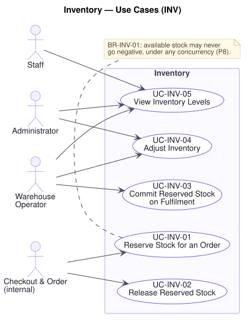

# Inventory — Use Cases (`INV`)

**Related documents:** [`README.md`](./README.md) (index and template) · [`../srs.md`](../srs.md) · [`../traceability-matrix.md`](../traceability-matrix.md)

---

## Domain Scope

The record of what the business physically holds, what it has already promised, and what it may therefore still sell — tracked per SKU and per warehouse, and moved only by reservation, commitment, release, and adjustment.

This is the domain where the platform's most expensive failures live. **P8** — selling what does not exist under concentrated demand — and **P7** — a partial failure across order, payment, and inventory — are both decided here, and both are decided in the exception flows rather than the happy paths. Two rules govern everything below:

- **`BR-INV-01`: available stock may never be negative**, under any sequence of concurrent operations. This is not a validation to perform before acting; it is a property that must hold at the moment of acting.
- **`BR-INV-02`: a reservation is resolved exactly once** — committed on fulfilment or released on cancellation, never both and never neither. A reservation that is silently lost overstates availability and eventually oversells; one that is committed twice understates stock and eventually stocks out. Both cost real money.

---

## UC-INV-01 — Reserve Stock for an Order

| Field | Value |
|---|---|
| **Primary actor** | Checkout & Order (internal), acting for a Customer |
| **Stakeholders & interests** | Customer: needs a confirmed order to mean the goods exist. Warehouse: needs to be able to fulfil what was sold. Finance: bears the refund cost of every oversell. Marketing/Brand: bears the reputational cost, at exactly the moment a campaign was meant to build goodwill (`P8`). |
| **Priority** | Must |
| **Trigger** | An order is being placed (`UC-ORD-05`) |
| **Preconditions** | Every line names an existing, published variant with a positive quantity |
| **Success postconditions** | Reserved stock has increased and available stock decreased by the ordered quantity for every line; available stock is non-negative for every line |
| **Failure postconditions** | **No line is reserved.** Any reservation taken during a partially completed attempt is released. Available stock is exactly what it was before the attempt |
| **Frequency** | High; extreme concentration during flash sales |
| **Traceability** | `FR-INV-02`, `FR-ORD-06`, `FR-ORD-08` · `BR-INV-01`, `BR-INV-02`, `BR-ORD-02` · `NFR-REL-01`, `NFR-REL-03`, `NFR-SCAL-06` · P7, P8 |

**Main success scenario**

1. Order placement requests a reservation for every line of the order.
2. Platform confirms, for each line, that available stock is at least the requested quantity (`BR-INV-01`).
3. Platform increases reserved stock by the requested quantity for every line, as one indivisible operation across all lines (`BR-ORD-02`).
4. Platform records each reservation against the order in state **held**, so it can later be committed or released exactly once (`BR-INV-02`).
5. Platform confirms the reservation to order placement.

**Alternate flows**

- **A1 — Lines drawn from more than one warehouse** (at step 2): A line may be satisfied from any warehouse with available stock, according to the configured allocation policy. The reservation records which warehouse each line drew from, so `UC-INV-03` and `UC-INV-02` act on the right one.
- **A2 — A line splits across warehouses** (at step 3): No single warehouse holds enough for the line, but the total does. The line is reserved as more than one reservation. It is still all-or-nothing: if the parts cannot all be taken, none is.

**Exception flows**

- **E1 — Insufficient available stock on one or more lines** (at step 2): **No line is reserved.** The platform reports precisely which lines are short and the quantity actually available for each, so the customer can reduce the quantity rather than abandon the order. A partial reservation is never taken, because an order the warehouse cannot fill completely is not an order the business wants to have confirmed (`BR-ORD-02`).
- **E2 — Concurrent reservations compete for the last units** (at step 3): Several placements request the same limited stock at effectively the same instant — the flash sale case (`P8`). The platform admits reservations only up to the available quantity; every further request fails as E1. **At no point may the total reserved exceed the stock held** (`BR-INV-01`, `NFR-REL-03`). Losing the race is a normal outcome, reported plainly; overselling is not an acceptable outcome under any load (`NFR-SCAL-06`).
- **E3 — Failure part-way through a multi-line reservation** (at step 3): Every reservation already taken in this attempt is released, returning available stock to its prior value. This is the case `BR-ORD-02` exists for: a half-reserved order is exactly the partial completion `P7` describes, and it must not survive.
- **E4 — Duplicate reservation request for the same order** (at step 1): The platform recognises the order already holds a reservation and returns the existing one rather than taking a second. Without this, a retried placement reserves twice and the second reservation is never resolved (`BR-ORD-03`, `BR-INV-02`).
- **E5 — Variant unpublished between checkout and placement** (at step 2): The reservation is refused for that line and the customer is told the product is no longer available.

**Business rules applied** — `BR-INV-01`, `BR-INV-02`, `BR-ORD-02`, `BR-ORD-03`, `BR-CAT-02`.

**Assumptions & open questions** — The warehouse allocation policy (nearest, cheapest, most stock) is not specified by R1 and requires confirmation. It affects shipping fee (`UC-SHP-01`) and delivery estimate (`UC-SHP-02`).

---

## UC-INV-02 — Release Reserved Stock

| Field | Value |
|---|---|
| **Primary actor** | Checkout & Order (internal), or Scheduler |
| **Stakeholders & interests** | Finance: a reservation never released is stock that can never be sold — a silent write-off. Marketing: units held by dead orders are units withheld from a live campaign. Customer: wants stock to reappear when an order is cancelled. |
| **Priority** | Must |
| **Trigger** | An order is cancelled, or a payment retry window elapses |
| **Preconditions** | A reservation exists in state held for the order |
| **Success postconditions** | Reserved stock has decreased and available stock increased by the reserved quantity; the reservation is in state released and cannot be released or committed again |
| **Failure postconditions** | The reservation remains held and the failure is recorded for retry; the units are not lost, only delayed in returning |
| **Frequency** | Moderate; rises sharply after a flash sale as unpaid orders expire |
| **Traceability** | `FR-INV-03`, `FR-ORD-14`, `FR-PAY-06` · `BR-INV-01`, `BR-INV-02`, `BR-ORD-04` · `NFR-REL-01`, `NFR-REL-04` · P7, P8 |

**Main success scenario**

1. Order cancellation, or expiry of the payment retry window, requests release of the order's reservation.
2. Platform confirms the reservation is in state **held** (`BR-INV-02`).
3. Platform decreases reserved stock by the reserved quantity, returning it to available stock.
4. Platform marks the reservation **released**, so it can never be released or committed again.
5. Platform confirms the release.

**Alternate flows**

- **A1 — Retry window elapses** (at step 1): The Scheduler releases reservations held by orders in state Payment Failed whose retry window has passed, and the order transitions to Cancelled (`UC-PAY-05`, `BR-ORD-04`). Without this, a single abandoned failed payment holds stock indefinitely.
- **A2 — Partial release** (at step 3): Only some lines are cancelled. Only those reservations are released; the remainder stay held for the surviving lines.
- **A3 — Reservation spans warehouses** (at step 3): Each constituent reservation is released against the warehouse it was taken from, so no warehouse's figures drift.

**Exception flows**

- **E1 — Reservation already released** (at step 2): The platform takes no action and reports success. Releasing twice would return units the business does not hold and inflate available stock — the mirror image of overselling (`BR-INV-02`).
- **E2 — Reservation already committed** (at step 2): The goods have shipped and the stock is genuinely gone. The platform declines the release and records the conflict for investigation. Returning committed units to availability would sell stock that has physically left the building.
- **E3 — Release fails** (at step 3): The reservation stays **held** and the release is retried (`NFR-REL-04`). Repeated failure is escalated as an operational alert, because held-but-unreleasable stock is invisible loss (`P7`) that no one will notice from the sales figures.
- **E4 — Order not found for the reservation** (at step 2): The release proceeds and the orphaned reservation is recorded for investigation. A reservation with no order can only be an error, and holding it helps nobody.

**Business rules applied** — `BR-INV-01`, `BR-INV-02`, `BR-ORD-04`.

---

## UC-INV-03 — Commit Reserved Stock on Fulfilment

| Field | Value |
|---|---|
| **Primary actor** | Warehouse Operator |
| **Stakeholders & interests** | Warehouse: needs the system to match the shelf. Finance: needs stock on hand to be a figure the business can rely on. Customer: needs availability shown to others to reflect what has actually left. |
| **Priority** | Must |
| **Trigger** | An order is packed (`UC-ORD-10` transition Processing → Packed) |
| **Preconditions** | A reservation exists in state held for the order; the order is in state Processing |
| **Success postconditions** | Stock quantity and reserved stock have both decreased by the reserved quantity; available stock is unchanged; the reservation is committed and cannot be committed or released again |
| **Failure postconditions** | The reservation remains held and the order does not advance to Packed |
| **Frequency** | High — once per order fulfilled |
| **Traceability** | `FR-INV-04`, `FR-ORD-16` · `BR-INV-02`, `BR-ORD-01` · `NFR-REL-01` · P7 |

**Main success scenario**

1. Warehouse Operator packs the order and the platform requests commitment of its reservation.
2. Platform confirms the reservation is in state **held** (`BR-INV-02`).
3. Platform decreases stock quantity and reserved stock by the same quantity, as one operation. Available stock is unchanged, because those units were never available (`BR-INV-01`).
4. Platform marks the reservation **committed**.
5. Platform allows the order to advance to Packed (`BR-ORD-01`).

**Alternate flows**

- **A1 — Commitment spans warehouses** (at step 3): Each constituent reservation is committed against the warehouse it was taken from.
- **A2 — Partial fulfilment** (at step 3): Only some lines ship now. Only those reservations are committed; the rest stay held until they ship or are released.

**Exception flows**

- **E1 — Reservation already committed** (at step 2): The platform takes no action and reports success, so that a retried pack operation cannot deduct stock twice (`BR-INV-02`, `NFR-REL-04`).
- **E2 — Reservation already released** (at step 2): The order was cancelled after picking began. The platform declines the commitment and does not advance the order, raising it for the Warehouse Operator to resolve physically. Committing a released reservation would deduct stock the platform has already promised to someone else.
- **E3 — Physical shortfall discovered at picking** (at step 1): The shelf holds fewer units than the record. The Operator records an adjustment for the discrepancy (`UC-INV-04`) and the order cannot be fulfilled as placed. It is cancelled or partially fulfilled, its reservation released accordingly (`UC-INV-02`), and the customer notified. This is the case where the platform's figure and physical reality have already diverged: the adjustment makes the divergence visible and attributable (`P17`) rather than absorbing it silently.
- **E4 — Commitment fails** (at step 3): The reservation stays held and the order does not advance (`BR-ORD-01`). Order state and stock state move together or not at all — advancing the order on a failed commitment is precisely the partial completion `P7` warns of.

**Business rules applied** — `BR-INV-01`, `BR-INV-02`, `BR-INV-03`, `BR-ORD-01`.

---

## UC-INV-04 — Adjust Inventory

| Field | Value |
|---|---|
| **Primary actor** | Warehouse Operator |
| **Supporting actors** | Administrator |
| **Stakeholders & interests** | Warehouse: needs the record to match a physical count. Finance: needs shrinkage and damage visible rather than absorbed. Legal/Compliance: needs every adjustment attributable to a person and a reason (`P17`). Customer: needs availability to reflect reality. |
| **Priority** | Must |
| **Trigger** | Goods are received, counted, damaged, written off, or returned to stock |
| **Preconditions** | The actor holds the Warehouse or Administrator role (`UC-AUD-03`); the SKU and warehouse exist |
| **Success postconditions** | Stock quantity reflects the adjustment; available stock is recalculated; an audit entry records who adjusted what, by how much, and why |
| **Failure postconditions** | Stock is unchanged; no audit entry is written |
| **Frequency** | Moderate; concentrated around deliveries and stock counts |
| **Traceability** | `FR-INV-05`, `FR-ADM-05`, `FR-AUD-01` · `BR-INV-01`, `BR-INV-03`, `BR-AUD-01` · `NFR-OBS-01` · P17, P16 |

**Main success scenario**

1. Warehouse Operator selects a SKU and warehouse and enters a quantity delta and a reason.
2. Platform authorises the request against the actor's role (`UC-AUD-03`).
3. Platform validates that a reason is supplied and the delta is a non-zero integer (`BR-INV-03`).
4. Platform confirms the resulting available stock would not be negative (`BR-INV-01`).
5. Platform applies the delta to stock quantity and recalculates available stock.
6. Platform records an audit entry capturing the actor, SKU, warehouse, delta, before and after values, reason, and time (`UC-AUD-01`).
7. Platform confirms the adjustment and presents the new levels.

**Alternate flows**

- **A1 — Goods received** (at step 1): A positive delta against a purchase or transfer, referenced in the reason. Available stock rises, which may make a previously unavailable product purchasable again.
- **A2 — Damage or write-off** (at step 1): A negative delta. Steps 4 and E1 apply, because units already reserved for orders cannot be written off without deciding what happens to those orders.
- **A3 — Stock count correction** (at step 1): The delta reconciles the record to a physical count. The reason records the count reference so the correction is defensible later (`P17`).
- **A4 — Returned goods restocked** (at step 1): A positive delta following an accepted return (`UC-ORD-09`), referencing the order.

**Exception flows**

- **E1 — Negative adjustment exceeds available stock** (at step 4): The reduction would push available stock below zero, meaning units already reserved for confirmed orders would be written off. The platform declines and reports how many units are reserved and against which orders. Those orders must be resolved first — the record must never be made to say the business holds less than it has already promised (`BR-INV-01`).
- **E2 — Reason not supplied** (at step 3): The platform declines. An adjustment without a reason cannot answer "who did this, when, and why" later, which is exactly what `P17` requires it to answer.
- **E3 — Actor lacks authority** (at step 2): The platform declines and records the attempt (`UC-AUD-01`). Inventory adjustment is a direct financial control (`P16`).
- **E4 — Audit entry cannot be written** (at step 6): **The adjustment is not applied.** An unauditable stock movement is worse than a delayed one: it is an untraceable change to a financial record, which `BR-AUD-01` and `P17` forbid. The adjustment is retried as a whole.
- **E5 — Concurrent adjustment to the same SKU** (at step 5): Both adjustments apply, each computed against the value current at the moment it is applied, so neither is lost. Both appear separately in the audit trail.

**Business rules applied** — `BR-INV-01`, `BR-INV-03`, `BR-AUD-01`, `BR-AUD-02`.

---

## UC-INV-05 — View Inventory Levels

| Field | Value |
|---|---|
| **Primary actor** | Warehouse Operator |
| **Supporting actors** | Staff, Customer Support Agent, Administrator |
| **Stakeholders & interests** | Warehouse: needs to plan picking and replenishment. Staff: need to know what can be promoted. Support: needs to explain to a customer why an order is delayed. Finance: needs stock value visible. |
| **Priority** | Must |
| **Trigger** | An authorised actor opens inventory for a SKU, warehouse, or the whole catalog |
| **Preconditions** | The actor holds a role granting inventory read (`UC-AUD-03`) |
| **Success postconditions** | Stock quantity, reserved stock, and available stock are presented per SKU and warehouse; no state changes |
| **Failure postconditions** | Nothing is disclosed |
| **Frequency** | High |
| **Traceability** | `FR-INV-01`, `FR-INV-06` · `BR-AUD-02` · `NFR-PERF-01`, `NFR-PERF-06`, `NFR-SEC-01` · P16 |

**Main success scenario**

1. Actor opens the inventory view for a SKU, a warehouse, or a filtered set.
2. Platform authorises the request against the actor's role (`UC-AUD-03`, `BR-AUD-02`).
3. Platform retrieves stock quantity, reserved stock, and available stock per SKU and warehouse.
4. Platform presents the three figures separately, so that stock held for existing orders is never mistaken for stock still sellable.
5. Actor opens a SKU's adjustment history where required (`UC-ADM-05`).

**Alternate flows**

- **A1 — Filtered to low stock** (at step 1): The actor narrows to SKUs below their configured reorder threshold, which is the common replenishment case.
- **A2 — Aggregated across warehouses** (at step 3): Totals are presented alongside the per-warehouse breakdown, since a SKU can be well stocked overall and unavailable where it is needed.
- **A3 — Customer-facing availability** (at step 3): The catalog and search show only whether a variant is available, never the quantity or the warehouse breakdown (`FR-INV-07`, `P16`).

**Exception flows**

- **E1 — Actor lacks authority** (at step 2): The platform declines. Quantities and warehouse structure are commercially sensitive and are never exposed to a Customer or Guest (`BR-AUD-02`).
- **E2 — SKU does not exist** (at step 3): The platform reports it is unknown, without disclosing whether it once existed.
- **E3 — Figures momentarily inconsistent under load** (at step 3): The view may briefly lag reservations in flight. This is acceptable for a read (`NFR-PERF-06`) because no decision here consumes stock — `UC-INV-01` re-checks availability at the moment of reserving and `BR-INV-01` holds regardless of what this view showed.

**Business rules applied** — `BR-AUD-02`, `BR-INV-01`.
