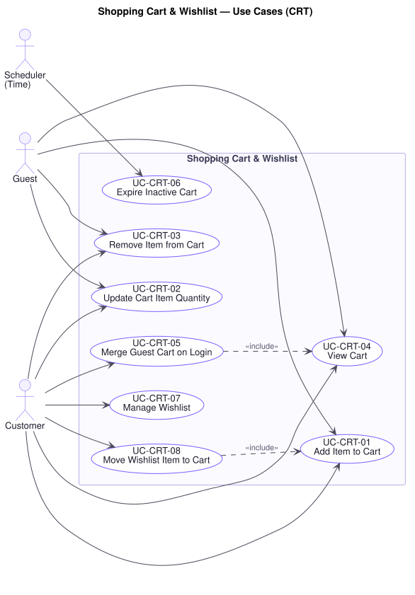

# Shopping Cart & Wishlist — Use Cases (`CRT`)

**Document type:** Use Case Specification — domain
**Related documents:** [`README.md`](./README.md) (index and template) · [`../srs.md`](../srs.md) · [`../traceability-matrix.md`](../traceability-matrix.md)
**Audience:** Product Management, Engineering, Quality Assurance

---

## Domain Scope

The shopper's working set before they commit: the cart that carries intent from browsing into checkout, and the wishlist that holds intent for later.

Two properties govern this domain. First, **a cart holds no prices of its own** (`BR-CRT-04`) — it references variants and quantities, and is priced at the moment it is displayed. A cart that remembered the price at the time of adding would let a stale price be carried into an order, which `BR-ORD-06` and `P7` forbid. Second, **a cart reserves nothing**. Availability is checked when a line is added (`BR-CRT-02`) as a courtesy to the shopper, but stock is committed only at order placement (`UC-INV-01`). An item in a cart is not an item held, and the specification below never implies otherwise.

The guest cart and its merge on login exist because of a single line in R1 §2 — "merge guest cart after login" — which presupposes the Guest actor recorded as assumption **A-01**.

---

## UC-CRT-01 — Add Item to Cart

| Field | Value |
|---|---|
| **Primary actor** | Guest |
| **Supporting actors** | Customer |
| **Stakeholders & interests** | Guest and Customer: want the decision captured without friction, and without being made to register first. Marketing: every added item is a conversion opportunity. Warehouse: needs the line to name one stockable unit. |
| **Priority** | Must |
| **Trigger** | Visitor adds a product variant to the cart |
| **Preconditions** | The variant is published and purchasable |
| **Success postconditions** | The cart contains the variant at the requested quantity, combined with any existing line for the same variant; no stock is reserved |
| **Failure postconditions** | The cart is unchanged and the visitor is told why |
| **Frequency** | Very high |
| **Traceability** | `FR-CRT-01`, `FR-CRT-05` · `BR-CRT-01`, `BR-CRT-02`, `BR-CAT-02` · `NFR-PERF-02` · P11 |

**Main success scenario**

1. Visitor adds a variant at a chosen quantity (`UC-CAT-04`).
2. Platform confirms the variant exists and is published (`BR-CAT-02`).
3. Platform confirms the requested quantity does not exceed available stock (`BR-CRT-02`).
4. Platform adds the line, combining it with any existing line for the same variant rather than creating a second.
5. Platform records cart activity, restarting the inactivity period (`BR-CRT-01`).
6. Platform confirms and presents the updated cart total, priced at current prices (`BR-CRT-04`).

**Alternate flows**

- **A1 — Guest with no cart yet** (at step 4): The platform creates a guest cart tied to the visit and adds the line. Registration is never required to add an item — requiring it here is a well-known point of abandonment (`FR-CRT-05`).
- **A2 — Variant already in the cart** (at step 4): Quantities are combined and the combined total re-checked against available stock, so that two additions cannot together exceed what a single addition would have been refused for.
- **A3 — Added from a wishlist** (at step 1): Behaviour is `UC-CRT-08`.
- **A4 — Added from a listing without opening the product** (at step 1): Permitted only where the product has a single variant; otherwise the visitor is taken to variant selection, since a line must name one stockable unit (`UC-CAT-04`).

**Exception flows**

- **E1 — Requested quantity exceeds available stock** (at step 3): The platform declines, states the quantity actually available, and offers to add that instead. It does not silently reduce the quantity — a shopper who asked for five and receives two without being told will discover it at checkout, or worse, on delivery.
- **E2 — Variant unpublished or removed since the page loaded** (at step 2): The platform reports it is no longer available and leaves the cart unchanged.
- **E3 — Variant out of stock entirely** (at step 3): The platform declines and offers the wishlist instead (`UC-CRT-07`), so the intent is captured rather than lost.
- **E4 — Cart has expired mid-session** (at step 4): The platform creates a new cart and adds the line, telling the visitor the previous cart expired. The addition is not lost to a housekeeping process.

**Business rules applied** — `BR-CRT-01`, `BR-CRT-02`, `BR-CRT-04`, `BR-CAT-02`.

---

## UC-CRT-02 — Update Cart Item Quantity

| Field | Value |
|---|---|
| **Primary actor** | Guest |
| **Supporting actors** | Customer |
| **Stakeholders & interests** | Customer: wants to adjust before committing. Finance: wants the total shown to be the total charged. Warehouse: wants the final quantity to be fulfillable. |
| **Priority** | Must |
| **Trigger** | Visitor changes the quantity of a cart line |
| **Preconditions** | The line exists in the visitor's cart |
| **Success postconditions** | The line reflects the new quantity; the cart total is re-priced |
| **Failure postconditions** | The line retains its previous quantity |
| **Frequency** | Very high |
| **Traceability** | `FR-CRT-02` · `BR-CRT-01`, `BR-CRT-02`, `BR-CRT-04` · `NFR-PERF-02` |

**Main success scenario**

1. Visitor sets a new quantity for a line.
2. Platform validates the quantity is a positive integer.
3. Platform confirms it does not exceed available stock (`BR-CRT-02`).
4. Platform updates the line and restarts the inactivity period (`BR-CRT-01`).
5. Platform re-prices the cart at current prices and presents the new total (`BR-CRT-04`).

**Alternate flows**

- **A1 — Quantity set to zero** (at step 2): Treated as removal (`UC-CRT-03`), which is what the visitor means.
- **A2 — Quantity reduced** (at step 3): The availability check is unnecessary for a reduction but is harmless; the update proceeds.
- **A3 — Adjusted during checkout** (at step 1): The change invalidates the order summary in progress. The platform recalculates the shipping fee (`BR-SHP-01`) and re-validates any applied voucher (`BR-PRM-01`), since both may depend on order value.

**Exception flows**

- **E1 — New quantity exceeds available stock** (at step 3): The platform declines, states the available quantity, and keeps the previous value. The line is never silently capped.
- **E2 — Line no longer in the cart** (at step 1): The cart was changed in another session. The platform reports the line is gone and presents the current cart rather than resurrecting it.
- **E3 — Variant unpublished since the line was added** (at step 3): The platform declines the increase, marks the line unpurchasable, and tells the visitor it must be removed before checkout (`UC-ORD-01`).

**Business rules applied** — `BR-CRT-01`, `BR-CRT-02`, `BR-CRT-04`.

---

## UC-CRT-03 — Remove Item from Cart

| Field | Value |
|---|---|
| **Primary actor** | Guest |
| **Supporting actors** | Customer |
| **Stakeholders & interests** | Customer: wants to change their mind without losing the rest of the cart. Marketing: wants the removed intent recoverable via the wishlist rather than discarded. |
| **Priority** | Must |
| **Trigger** | Visitor removes a cart line |
| **Preconditions** | The line exists in the visitor's cart |
| **Success postconditions** | The line is gone; other lines are unaffected; the total is re-priced |
| **Failure postconditions** | The cart is unchanged |
| **Frequency** | High |
| **Traceability** | `FR-CRT-03` · `BR-CRT-01`, `BR-CRT-04` · `NFR-PERF-02` |

**Main success scenario**

1. Visitor removes a line.
2. Platform removes it, leaving every other line untouched.
3. Platform restarts the inactivity period (`BR-CRT-01`).
4. Platform re-prices the remaining cart and presents the new total.

**Alternate flows**

- **A1 — Move to wishlist instead** (at step 1): An authenticated customer removes the line and saves the variant to their wishlist in one action (`UC-CRT-07`), preserving the intent.
- **A2 — Last line removed** (at step 2): The cart becomes empty. It is retained as an empty cart rather than deleted, so that the customer's cart identity survives.
- **A3 — Removed during checkout** (at step 1): The shipping fee is recalculated and any voucher re-validated, since removal may take the order below a promotion's minimum value (`BR-PRM-01`, `BR-SHP-01`).

**Exception flows**

- **E1 — Line already removed** (at step 2): The platform reports success. The visitor's goal already holds.
- **E2 — Removal empties a cart in active checkout** (at step 2): The checkout cannot proceed (`FR-ORD-01`). The platform ends the checkout and returns the visitor to the cart, rather than leaving a checkout in progress against nothing.

**Business rules applied** — `BR-CRT-01`, `BR-CRT-04`, `BR-PRM-01`.

---

## UC-CRT-04 — View Cart

| Field | Value |
|---|---|
| **Primary actor** | Guest |
| **Supporting actors** | Customer |
| **Stakeholders & interests** | Customer: wants to see exactly what they are about to buy and at what price. Finance: wants no surprise between cart and charge. Support: wants fewer disputes about price. |
| **Priority** | Must |
| **Trigger** | Visitor opens the cart |
| **Preconditions** | None |
| **Success postconditions** | Every line is presented at current prices with current availability; changes since items were added are identified |
| **Failure postconditions** | The cart is not presented; no state changes |
| **Frequency** | Very high |
| **Traceability** | `FR-CRT-04`, `FR-CRT-08` · `BR-CRT-01`, `BR-CRT-02`, `BR-CRT-04` · `NFR-PERF-01` · P11 |

**Main success scenario**

1. Visitor opens the cart.
2. Platform retrieves its lines.
3. Platform prices every line at the variant's **current** price (`BR-CRT-04`).
4. Platform retrieves current availability for every line (`BR-CRT-02`).
5. Platform identifies any line whose price has changed or whose availability has fallen since it was added (`FR-CRT-08`).
6. Platform presents the lines, the subtotal, and the changes, with any applicable promotion indicated.
7. Visitor proceeds to checkout (`UC-ORD-01`).

**Alternate flows**

- **A1 — Authenticated customer** (at step 2): The stored cart is retrieved, so it appears on any device (`FR-CRT-04`).
- **A2 — Guest** (at step 2): The visit-scoped guest cart is retrieved (`FR-CRT-05`).
- **A3 — Empty cart** (at step 6): The platform says so plainly and offers discovery surfaces (`UC-SCH-06`), rather than presenting an error.
- **A4 — Promotion applies automatically** (at step 6): An automatically applied promotion is shown with the discount it contributes, so the shopper can see the price is not arbitrary (`UC-PRM-03`).

**Exception flows**

- **E1 — A line's price has risen since it was added** (at step 5): The cart is presented at the **current, higher** price, with the change stated explicitly. The old price is never honoured silently, and the increase is never applied silently either — the shopper is told before they commit (`BR-CRT-04`, `BR-ORD-06`).
- **E2 — A line's available stock has fallen below its quantity** (at step 4): The line is marked short, the available quantity stated, and the customer offered a reduction. The quantity is not adjusted for them.
- **E3 — A line's variant is no longer published** (at step 4): The line is marked unpurchasable and must be removed before checkout (`FR-ORD-01`). It is not removed automatically, so the customer sees what was lost.
- **E4 — Cart expired** (at step 2): The platform presents an empty cart and states that the previous one expired (`UC-CRT-06`).

**Business rules applied** — `BR-CRT-01`, `BR-CRT-02`, `BR-CRT-04`, `BR-CAT-02`.

---

## UC-CRT-05 — Merge Guest Cart on Login

| Field | Value |
|---|---|
| **Primary actor** | Customer |
| **Supporting actors** | — |
| **Stakeholders & interests** | Customer: must not lose what they assembled before logging in. Marketing: this is the moment an anonymous session becomes an attributable conversion — a discarded cart here is a lost sale. Support: wants no "my items vanished" tickets. |
| **Priority** | Must |
| **Trigger** | A guest with a non-empty cart logs in or completes registration |
| **Preconditions** | The login succeeded; a guest cart exists |
| **Success postconditions** | The customer's cart contains the union of both carts, with quantities combined for shared variants; the guest cart is discarded; anything that could not be carried over is reported |
| **Failure postconditions** | **Login still succeeds.** The guest cart is preserved for a later attempt and the customer is told their previous items were not carried over |
| **Frequency** | High |
| **Traceability** | `FR-CRT-06`, `FR-CUS-03` · `BR-CRT-02`, `BR-CRT-03` · `NFR-PERF-02` · P11 |

**Main success scenario**

1. Login completes successfully (`UC-CUS-03`).
2. Platform retrieves the guest cart and the customer's stored cart.
3. For a variant present in both, the platform combines the quantities (`BR-CRT-03`).
4. For a variant present in only one, the platform carries the line over unchanged.
5. Platform re-checks every resulting line against available stock (`BR-CRT-02`).
6. Platform stores the merged cart against the customer and discards the guest cart.
7. Platform presents the merged cart, identifying any line that changed during the merge.

**Alternate flows**

- **A1 — Customer has no stored cart** (at step 2): The guest cart becomes the customer's cart in full.
- **A2 — Guest cart is empty** (at step 2): The stored cart stands unchanged and nothing is reported.
- **A3 — Merge follows registration** (at step 1): The same behaviour applies at the customer's first login after registering (`UC-CUS-01`, A1).
- **A4 — Combined quantity exceeds available stock** (at step 5): The line is carried over at the maximum available quantity and the reduction is **stated explicitly**. This is the one case where the platform adjusts a quantity without being asked, and it is preferable to discarding the line — but it is never silent (`BR-CRT-03`).

**Exception flows**

- **E1 — A guest line's variant is no longer published** (at step 5): The line is not carried over and the customer is told which product was dropped and why. Silently discarding it is exactly what `BR-CRT-03` forbids.
- **E2 — A guest line is entirely out of stock** (at step 5): The line is carried over and marked unpurchasable, so the customer can see it and choose to wishlist it, rather than discovering the loss at checkout.
- **E3 — Merge fails** (at step 6): **Login stands.** The stored cart is left untouched, the guest cart preserved for retry, and the customer told their earlier items were not carried over and will be recovered. A cart failure must never deny a customer access to their account (`UC-CUS-03`, E4).
- **E4 — Concurrent merges from two sessions** (at step 6): The merges are applied in sequence, each against the cart as it then stands, so that neither session's items are lost.

**Business rules applied** — `BR-CRT-01`, `BR-CRT-02`, `BR-CRT-03`.

---

## UC-CRT-06 — Expire Inactive Cart

| Field | Value |
|---|---|
| **Primary actor** | Scheduler (Time) |
| **Supporting actors** | — |
| **Stakeholders & interests** | Finance: wants storage and processing not to accumulate indefinitely. Customer: does not want to return to a cart of stale prices and withdrawn products. Marketing: wants the expiry period tunable against recovery campaigns. |
| **Priority** | Must |
| **Trigger** | A cart's inactivity period elapses |
| **Preconditions** | The cart has had no activity for the configured period |
| **Success postconditions** | The cart is expired and no longer presented; **no stock is released, because a cart never reserved any** |
| **Failure postconditions** | The cart remains live and expiry is retried |
| **Frequency** | Continuous, low volume |
| **Traceability** | `FR-CRT-07` · `BR-CRT-01` · `NFR-REL-04` · P10 |

**Main success scenario**

1. Scheduler identifies carts whose last activity precedes the configured inactivity period (`BR-CRT-01`).
2. Platform confirms each cart is not in an active checkout.
3. Platform expires the cart.
4. Platform records the expiry for cart-recovery reporting.

**Alternate flows**

- **A1 — Different periods for guest and authenticated carts** (at step 1): The configured period may differ between the two, since a registered customer's cart has more recovery value than an anonymous one (**[A-05]**).
- **A2 — Configured period changed** (at step 1): The new period is applied without redeployment (`FR-CRT-07`) and takes effect for subsequent evaluations. It never retroactively expires a cart that was live under the previous setting.
- **A3 — Notification before expiry** (at step 1): Where configured, the customer is notified in advance (`UC-NTF-01`), turning expiry into a recovery opportunity.

**Exception flows**

- **E1 — Cart is in an active checkout** (at step 2): Expiry is deferred. Expiring a cart mid-checkout would strand the customer at the moment of purchase.
- **E2 — Cart holds an order in Draft** (at step 2): Expiry is deferred to order cancellation (`UC-ORD-08`), which releases any reservation (`UC-INV-02`). The cart alone never releases stock, because it never took any.
- **E3 — Expiry fails** (at step 3): The cart remains live and is retried on the next run (`NFR-REL-04`). A failed expiry is harmless — it costs storage, not correctness.

**Business rules applied** — `BR-CRT-01`.

**Assumptions & open questions** — Default periods (**[A-05]**: 30 days authenticated, 7 days guest) are assumptions and require confirmation. Whether pre-expiry notification is wanted is a Marketing decision not stated in R1.

---

## UC-CRT-07 — Manage Wishlist

| Field | Value |
|---|---|
| **Primary actor** | Customer |
| **Supporting actors** | — |
| **Stakeholders & interests** | Customer: wants to hold intent without committing. Marketing: a wishlist is declared future demand and a campaign target. Staff: wishlist volume signals what to restock. |
| **Priority** | Should |
| **Trigger** | Customer saves a product to, or removes one from, their wishlist |
| **Preconditions** | An authenticated session exists |
| **Success postconditions** | The wishlist reflects the change; no stock is reserved and no price is fixed |
| **Failure postconditions** | The wishlist is unchanged |
| **Frequency** | Moderate |
| **Traceability** | `FR-CRT-09` · `BR-CAT-02`, `BR-AUD-02` · `NFR-SEC-01` · P11 |

**Main success scenario**

1. Customer saves a product or variant to their wishlist.
2. Platform authorises and scopes the request to the acting customer (`UC-AUD-03`, `BR-AUD-02`).
3. Platform confirms the product is published (`BR-CAT-02`).
4. Platform adds it, or reports it is already saved rather than duplicating it.
5. Platform confirms and presents the wishlist.

**Alternate flows**

- **A1 — Remove an item** (at step 1): The platform removes it and leaves the rest untouched.
- **A2 — View the wishlist** (at step 5): Items are presented with current price and availability, and any price fall since saving is highlighted — the reason a shopper keeps a wishlist.
- **A3 — Saved while out of stock** (at step 3): Permitted and expected. A wishlist exists precisely to hold intent the cart cannot (`UC-CRT-01`, E3).
- **A4 — Saved from the cart** (at step 1): The line is removed from the cart and saved to the wishlist in one action (`UC-CRT-03`, A1).

**Exception flows**

- **E1 — Product unpublished or removed** (at step 3): An existing wishlist entry is marked unavailable rather than deleted, so the customer sees what happened. A new save of an unpublished product is declined.
- **E2 — Guest attempts to use a wishlist** (at step 2): A wishlist requires an account. The platform explains this and offers registration or login, preserving the intended item so it can be saved immediately afterwards.
- **E3 — Another customer's wishlist requested** (at step 2): The platform declines and records the attempt (`BR-AUD-02`, `P16`).

**Business rules applied** — `BR-CAT-02`, `BR-AUD-02`.

**Assumptions & open questions** — Whether a wishlist may be shared publicly is not addressed by R1. This specification assumes it is private.

---

## UC-CRT-08 — Move Wishlist Item to Cart

| Field | Value |
|---|---|
| **Primary actor** | Customer |
| **Supporting actors** | — |
| **Stakeholders & interests** | Customer: acting on a saved intention, often prompted by a price fall or restock. Marketing: this is where held demand converts. Finance: incremental revenue from stock that would otherwise sit. |
| **Priority** | Should |
| **Trigger** | Customer moves a wishlist item into the cart |
| **Preconditions** | The item is on the acting customer's wishlist |
| **Success postconditions** | The cart contains the variant; the item is removed from the wishlist |
| **Failure postconditions** | The cart is unchanged and the item remains on the wishlist, so the intent is never lost by a failed move |
| **Frequency** | Moderate |
| **Traceability** | `FR-CRT-10`, `FR-CRT-01` · `BR-CRT-02`, `BR-CAT-02` · `NFR-PERF-02` |

**Main success scenario**

1. Customer moves a wishlist item to the cart.
2. Platform authorises and scopes the request to the acting customer (`UC-AUD-03`).
3. Platform confirms the product is published (`BR-CAT-02`).
4. Platform adds the variant to the cart at quantity one, combining with an existing line if present (`UC-CRT-01`).
5. Platform removes the item from the wishlist **only after** the addition has succeeded.
6. Platform confirms and presents the cart at current prices.

**Alternate flows**

- **A1 — Wishlist item is a product, not a variant** (at step 4): The platform takes the customer to variant selection (`UC-CAT-04`) before adding, since a cart line must name one stockable unit.
- **A2 — Copy rather than move** (at step 5): Where the customer chooses to keep the item saved, the wishlist entry is retained.
- **A3 — Move all items** (at step 1): Every purchasable item moves; items that cannot are left on the wishlist with the reason stated, rather than the whole action failing.

**Exception flows**

- **E1 — Item out of stock** (at step 4): The platform declines the move and **leaves the item on the wishlist**, which is exactly where an out-of-stock item belongs. The customer is offered a restock notification.
- **E2 — Product unpublished since it was saved** (at step 3): The move is declined and the wishlist entry marked unavailable (`UC-CRT-07`, E1).
- **E3 — Addition to the cart fails** (at step 4): The wishlist entry is **not** removed. Ordering steps 4 and 5 this way means a failure costs the customer nothing; the reverse order would lose the saved intent.
- **E4 — Price has risen since it was saved** (at step 6): The item moves and the cart shows the current price with the change stated (`UC-CRT-04`, E1). The saved price is never honoured, because a wishlist holds intent, not a quotation (`BR-CRT-04`).

**Business rules applied** — `BR-CRT-02`, `BR-CRT-04`, `BR-CAT-02`.
