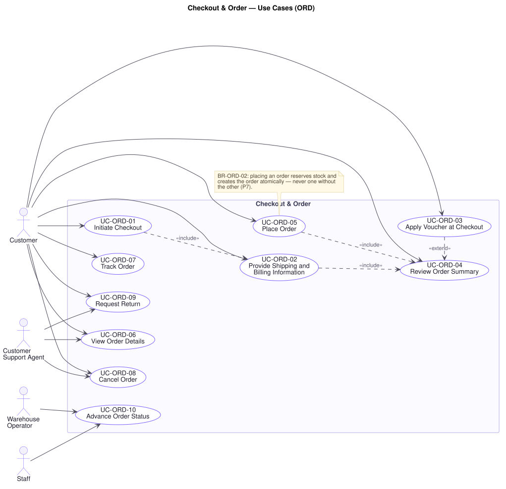

# Checkout & Order — Use Cases (`ORD`)

**Document type:** Use Case Specification — domain
**Related documents:** [`README.md`](./README.md) (index and template) · [`../srs.md`](../srs.md) · [`../traceability-matrix.md`](../traceability-matrix.md)
**Audience:** Product Management, Engineering, Quality Assurance

---

## Domain Scope

The transition from intent to obligation: the checkout that assembles an order, the placement that creates it, and the lifecycle it moves through afterwards.

This is the domain the business is actually for, and the one where the most costly problems concentrate. **P7** — a partial failure across order, payment, and inventory — is decided at `UC-ORD-05`. **P8** — overselling under concentrated demand — is decided in that use case's exception flows. **P5** — rules holding regardless of entry point — is decided at `UC-ORD-10`, because an order state machine enforced only in the customer application is a state machine the administrative interface can walk straight through.

Two rules dominate:

- **`BR-ORD-02`: creating an order and reserving its stock is one indivisible operation.** An order charged but not recorded, or recorded but not stocked, is either lost revenue or a liability someone resolves by hand.
- **`BR-ORD-01`: only the transitions in [`../srs.md`](../srs.md) §5.3 are legal**, whoever requests them and however they arrive.

---

## UC-ORD-01 — Initiate Checkout

| Field | Value |
|---|---|
| **Primary actor** | Customer |
| **Supporting actors** | — |
| **Stakeholders & interests** | Customer: wants to buy what is in the cart. Marketing: every step here is an abandonment point. Warehouse: wants only fulfillable orders to enter the flow. |
| **Priority** | Must |
| **Trigger** | Customer proceeds to checkout from the cart |
| **Preconditions** | An authenticated, email-verified session exists; the cart is non-empty |
| **Success postconditions** | A checkout is in progress against the cart's contents; an order exists in state **Draft**; no stock is reserved |
| **Failure postconditions** | No checkout begins; the cart is untouched and the customer is told what to resolve |
| **Frequency** | High |
| **Traceability** | `FR-ORD-01` · `BR-CUS-02`, `BR-CRT-02`, `BR-CAT-02`, `BR-ORD-01` · `NFR-PERF-02` · P11 |

**Main success scenario**

1. Customer proceeds to checkout.
2. Platform authorises the request and confirms the account is verified (`BR-CUS-02`, `UC-AUD-03`).
3. Platform confirms the cart is non-empty.
4. Platform confirms every line names a published variant with sufficient available stock (`BR-CAT-02`, `BR-CRT-02`).
5. Platform prices every line at current prices (`BR-CRT-04`).
6. Platform creates an order in state **Draft** and proceeds to shipping and billing capture (`UC-ORD-02`).

**Alternate flows**

- **A1 — Checkout already in progress** (at step 6): The existing Draft order is resumed rather than a second created, so that returning to checkout does not multiply orders.
- **A2 — Cart changed since it was last viewed** (at step 5): Price or availability changes are stated before the customer continues (`UC-CRT-04`, E1, E2), so nothing is discovered at the payment step.

**Exception flows**

- **E1 — Cart is empty** (at step 3): The platform declines and returns the customer to the cart. There is nothing to buy.
- **E2 — No line is currently purchasable** (at step 4): The platform declines and identifies each unpurchasable line, offering removal. Entering checkout with nothing fulfillable only defers the failure to a more expensive point.
- **E3 — Some lines unpurchasable** (at step 4): Checkout proceeds with the purchasable lines **only after** the customer explicitly removes or reduces the others. The platform never silently drops a line from an order the customer is about to pay for.
- **E4 — Account unverified** (at step 2): The platform declines, explains that email verification is required before ordering, and offers a resend (`UC-CUS-02`). The cart is preserved.
- **E5 — Guest attempts checkout** (at step 2): The platform requires login or registration, preserving the guest cart for merge (`UC-CRT-05`).

**Business rules applied** — `BR-CUS-02`, `BR-CRT-02`, `BR-CRT-04`, `BR-CAT-02`, `BR-ORD-01`.

---

## UC-ORD-02 — Provide Shipping and Billing Information

| Field | Value |
|---|---|
| **Primary actor** | Customer |
| **Supporting actors** | — |
| **Stakeholders & interests** | Customer: wants delivery to the right place at a known cost. Warehouse and Carrier: need a deliverable address. Finance: needs billing details for reconciliation, and the fee quoted to be the fee charged. |
| **Priority** | Must |
| **Trigger** | Checkout requires delivery details |
| **Preconditions** | A checkout is in progress with an order in state Draft |
| **Success postconditions** | The order carries a validated shipping address, billing information, a selected shipping option, and a calculated shipping fee |
| **Failure postconditions** | The order remains in Draft without complete delivery details and cannot be placed |
| **Frequency** | High |
| **Traceability** | `FR-ORD-02`, `FR-ORD-03`, `FR-ORD-04`, `FR-SHP-02`, `FR-SHP-03` · `BR-CUS-05`, `BR-SHP-01` · `NFR-PERF-02` |

**Main success scenario**

1. Platform presents the customer's stored addresses with the default pre-selected (`BR-CUS-05`).
2. Customer selects a shipping address.
3. Customer supplies billing information, or indicates it matches the shipping address.
4. Platform validates both against the expected format for the destination (`NFR-SEC-04`).
5. Platform calculates the shipping fee and delivery estimate for the order's contents and destination (`UC-SHP-01`, `UC-SHP-02`).
6. Platform records the details against the order and presents the fee and estimate.

**Alternate flows**

- **A1 — New address entered** (at step 2): The address is validated and stored to the address book, then selected (`UC-CUS-09`, A4).
- **A2 — Billing differs from shipping** (at step 3): Both are captured and validated independently (`FR-ORD-03`).
- **A3 — Shipping option selected** (at step 5): Where more than one option is offered, each is presented with its fee and estimate, and the fee is recalculated on selection (`BR-SHP-01`).
- **A4 — No stored address** (at step 1): The customer is taken directly to address entry.

**Exception flows**

- **E1 — Address fails validation** (at step 4): The platform reports which field is wrong and does not proceed. An undeliverable address costs a redelivery, a support contact, and often a refund.
- **E2 — Destination not served** (at step 5): No carrier serves the address. The platform states this plainly and offers a different address, rather than quoting a fee it cannot honour.
- **E3 — Shipping fee cannot be calculated** (at step 5): The order cannot be placed without a fee, since `BR-SHP-01` requires the fee presented at confirmation to be the fee charged. The platform reports the problem and allows retry; it never guesses.
- **E4 — Address changed after the fee was calculated** (at step 6): The fee and estimate are recalculated before the summary is presented (`BR-SHP-01`).
- **E5 — Some lines cannot ship to the destination** (at step 5): The platform identifies them and requires the customer to remove them or change the address, rather than placing an order that cannot be fulfilled entire.

**Business rules applied** — `BR-CUS-05`, `BR-SHP-01`.

---

## UC-ORD-03 — Apply Voucher at Checkout

| Field | Value |
|---|---|
| **Primary actor** | Customer |
| **Supporting actors** | — |
| **Stakeholders & interests** | Customer: wants the advertised saving. Marketing: wants campaigns to redeem as designed. Finance: wants discount exposure bounded and every discount attributable to a campaign (`P5`). |
| **Priority** | Must |
| **Trigger** | Customer enters a voucher code |
| **Preconditions** | A checkout is in progress |
| **Success postconditions** | The voucher is recorded against the order and the discount reflected in the total |
| **Failure postconditions** | No discount is applied and the customer is told precisely why |
| **Frequency** | High during campaigns |
| **Traceability** | `FR-ORD-05`, `FR-PRM-08`, `FR-PRM-09` · `BR-PRM-01`, `BR-PRM-02`, `BR-PRM-03` · P5 |

**Main success scenario**

1. Customer enters a voucher code.
2. Platform validates it against every configured condition — active period, customer eligibility, order eligibility, total usage limit, per-customer usage limit (`UC-PRM-02`, `BR-PRM-01`).
3. Platform calculates the discount, capped so the order total cannot go negative (`BR-PRM-02`).
4. Platform records the voucher and its contribution against the order (`FR-PRM-09`).
5. Platform presents the updated total with the discount itemised.

**Alternate flows**

- **A1 — Voucher removed** (at step 4): The customer removes it; the platform reverses the discount and restores the total.
- **A2 — Replacing an applied voucher** (at step 2): The platform validates the new code first and only replaces the existing one if it is valid, so a customer cannot lose a working discount to a typo.
- **A3 — More than one promotion eligible** (at step 3): The configured stacking policy determines which apply, deterministically (`BR-PRM-03`), and the itemisation shows the outcome.
- **A4 — Free shipping voucher** (at step 3): The discount applies to the shipping fee rather than the goods (`FR-PRM-04`).

**Exception flows**

- **E1 — Code not recognised** (at step 2): The platform says the code is not valid, without disclosing whether it never existed, expired, or is exhausted — otherwise codes can be probed.
- **E2 — Voucher expired or not yet active** (at step 2): The platform states the voucher is not currently valid, and the period where doing so is intended by the campaign.
- **E3 — Order does not meet the conditions** (at step 2): The platform states the unmet condition — a minimum value, a qualifying category — since this one is actionable and the customer may choose to meet it.
- **E4 — Usage limit reached** (at step 2): The platform reports the voucher is no longer available. Applying it beyond its limit is unbudgeted discount, which `BR-PRM-01` exists to prevent.
- **E5 — Discount exceeds the order value** (at step 3): The discount is capped at the discountable value. An order total is never negative and the platform never pays a customer to order (`BR-PRM-02`).
- **E6 — Voucher validated here but invalid at placement** (at step 5): Re-validated at `UC-ORD-05`; see that use case, E3. Validating only once leaves a window in which an exhausted campaign can still be redeemed.

**Business rules applied** — `BR-PRM-01`, `BR-PRM-02`, `BR-PRM-03`.

---

## UC-ORD-04 — Review Order Summary

| Field | Value |
|---|---|
| **Primary actor** | Customer |
| **Supporting actors** | — |
| **Stakeholders & interests** | Customer: wants to know exactly what will be charged before agreeing. Finance: wants no dispute between what was shown and what was taken. Support: wants fewer "this is not what I agreed to" contacts. |
| **Priority** | Must |
| **Trigger** | Shipping, billing, and payment method are complete |
| **Preconditions** | The order in Draft carries complete delivery and payment details |
| **Success postconditions** | The full summary is presented and every line is confirmed available; the order is ready to place |
| **Failure postconditions** | The order is not placed; the customer is returned to the step that needs correcting |
| **Frequency** | High |
| **Traceability** | `FR-ORD-06`, `FR-ORD-07` · `BR-INV-01`, `BR-ORD-06`, `BR-PRM-01`, `BR-SHP-01` · `NFR-PERF-02` |

**Main success scenario**

1. Platform re-prices every line at current prices (`BR-CRT-04`).
2. Platform re-checks availability for every line (`FR-ORD-06`, `BR-INV-01`).
3. Platform re-validates any applied voucher (`BR-PRM-01`).
4. Platform confirms the shipping fee is current for the selected address and option (`BR-SHP-01`).
5. Platform presents line items, unit and line prices, itemised discounts, shipping fee, and total payable, together with the delivery address, delivery estimate, and payment method.
6. Customer confirms, proceeding to placement (`UC-ORD-05`).

**Alternate flows**

- **A1 — Customer amends the order** (at step 6): Returning to change quantity, address, or payment method re-enters the relevant use case and returns here for a fresh summary. No amendment bypasses re-validation.
- **A2 — Cash On Delivery selected** (at step 5): The summary states that payment is collected on delivery, so the customer is not expecting a charge now (`UC-PAY-04`).

**Exception flows**

- **E1 — A line's price changed since checkout began** (at step 1): The summary shows the current price with the change stated, and requires explicit re-confirmation. The customer is never charged a price they were not shown (`BR-ORD-06`).
- **E2 — A line's stock fell below its quantity** (at step 2): The platform reports the shortfall and requires the customer to reduce or remove the line before continuing. Reserving happens at placement, so a summary can go stale — which is why this check exists here and again at `UC-ORD-05`.
- **E3 — Voucher no longer valid** (at step 3): The platform removes it, states plainly that the total has changed and why, and requires re-confirmation.
- **E4 — Shipping fee changed** (at step 4): The new fee is shown and re-confirmation required (`BR-SHP-01`).
- **E5 — Every line has become unpurchasable** (at step 2): Checkout ends and the customer is returned to the cart with an explanation.

**Business rules applied** — `BR-CRT-04`, `BR-INV-01`, `BR-ORD-06`, `BR-PRM-01`, `BR-SHP-01`.

---

## UC-ORD-05 — Place Order

| Field | Value |
|---|---|
| **Primary actor** | Customer |
| **Supporting actors** | Payment Gateway, Inventory |
| **Stakeholders & interests** | Customer: needs a confirmation to mean the goods are theirs. Finance: an order charged but not recorded, or recorded but not charged, is direct loss or liability (`P7`). Warehouse: needs every confirmed order to be fulfillable. Marketing/Brand: bears the cost of cancelling confirmed orders after a flash sale (`P8`). Support: absorbs every dispute this use case creates. |
| **Priority** | Must |
| **Trigger** | Customer confirms the order summary |
| **Preconditions** | The order is in Draft with complete details and a confirmed summary |
| **Success postconditions** | Exactly one order exists; stock is reserved for every line; the order is in **Pending Payment** or **Paid**; an `OrderCreated` event has been raised |
| **Failure postconditions** | **No order is confirmed and no stock remains reserved.** The cart is intact and the customer is told what happened and what to do |
| **Frequency** | High; extreme concentration during flash sales |
| **Traceability** | `FR-ORD-08`, `FR-ORD-09`, `FR-INV-02`, `FR-PAY-03` · `BR-ORD-01`, `BR-ORD-02`, `BR-ORD-03`, `BR-INV-01`, `BR-INV-02`, `BR-PRM-01` · `NFR-REL-01`, `NFR-REL-02`, `NFR-REL-03`, `NFR-REL-06`, `NFR-SCAL-06` · P6, P7, P8 |

**Main success scenario**

1. Customer confirms the summary.
2. Platform confirms no order has already been created from this confirmed checkout (`BR-ORD-03`).
3. Platform re-prices the order and re-validates any voucher (`BR-PRM-01`).
4. Platform reserves stock for every line and creates the order, **as one indivisible operation** (`UC-INV-01`, `BR-ORD-02`).
5. Platform transitions the order to **Pending Payment** (`BR-ORD-01`).
6. Platform raises an `OrderCreated` event for delivery to every dependent process (`NFR-REL-06`).
7. Platform requests payment authorisation (`UC-PAY-02`).
8. On authorisation, the platform transitions the order to **Paid** and raises `PaymentSucceeded`.
9. Platform confirms the order to the customer, empties the cart, and queues the confirmation notification (`UC-NTF-01`).

**Alternate flows**

- **A1 — Cash On Delivery** (at step 7): No authorisation is sought. The order stays in **Pending Payment** for settlement on delivery (`UC-PAY-04`). Steps 8 and 9 proceed without a payment result.
- **A2 — Payment requires customer action** (at step 7): The provider requires an additional step. The order remains in **Pending Payment** with its reservation held, and resolves via `UC-PAY-03` when the result arrives.
- **A3 — Fully discounted order** (at step 7): The total payable is zero. No authorisation is sought and the order moves directly to **Paid**.

**Exception flows**

- **E1 — Insufficient stock at reservation** (at step 4): **No order is created and no line is reserved** (`UC-INV-01`, E1). The platform reports which lines are short and the quantity available for each, and returns the customer to the cart with its contents intact. This is the ordinary outcome of losing a race for scarce stock, and it is a far better outcome than confirming an order the business must cancel later (`P8`).
- **E2 — Concurrent placements compete for the last units** (at step 4): Reservations are admitted only up to available stock; the rest fail as E1. **The platform never confirms more orders than there is stock to fulfil, at any load** (`BR-INV-01`, `NFR-REL-03`, `NFR-SCAL-06`).
- **E3 — Voucher invalid at placement** (at step 3): The voucher was valid when applied but its usage limit has since been reached or its period ended. The platform does **not** place the order at a total the customer has not agreed to. It removes the voucher, presents the revised total, and requires re-confirmation (`UC-ORD-04`, E3).
- **E4 — Duplicate submission** (at step 2): The customer double-submits, or a client retries after a timeout. The platform returns the **existing** order and creates no second one (`BR-ORD-03`, `NFR-REL-02`). Two orders and two charges from one intention is the duplicate-order failure `P7` names.
- **E5 — Failure between reservation and order creation** (at step 4): Neither survives. Any reservation taken is released and no order exists (`BR-ORD-02`, `NFR-REL-01`). This is the partial-failure case `P7` exists for, and the atomic boundary at step 4 is what prevents it.
- **E6 — Payment authorisation declined** (at step 7): The order transitions to **Payment Failed** and **the reservation is held** for the configured retry window (`UC-PAY-05`, **[A-07]**). The customer keeps their claim on the stock while they resolve the payment; if the window elapses the order is cancelled and the stock released (`UC-INV-02`, A1).
- **E7 — Payment provider unreachable or times out** (at step 7): The order remains in **Pending Payment** with its reservation held. The platform does not assume failure — a timeout is not a decline, and treating it as one risks cancelling an order that was in fact charged. The outcome is resolved when the provider's result arrives (`UC-PAY-03`, E2).
- **E8 — `OrderCreated` event cannot be raised** (at step 6): **The order stands.** The event is retried until delivered (`BR-NTF-01`, `NFR-REL-06`). It is never dropped: a paid order that no downstream process hears about produces no confirmation email and no revenue figure, and the business operates on an incomplete picture without knowing it (`P6`).
- **E9 — Confirmation notification cannot be dispatched** (at step 9): The order stands and the notification is retried (`UC-NTF-01`, E1). An order is never reversed because a message failed.
- **E10 — Cart cannot be emptied** (at step 9): The order stands. The cart is emptied on retry; a stale cart is a cosmetic problem, an unplaced order is not.

**Business rules applied** — `BR-ORD-01`, `BR-ORD-02`, `BR-ORD-03`, `BR-ORD-06`, `BR-INV-01`, `BR-INV-02`, `BR-PRM-01`, `BR-PRM-02`, `BR-NTF-01`.

**Assumptions & open questions** — The payment retry window (**[A-07]**: 24 hours) determines how long scarce stock is held against an unpaid order. It is a direct trade-off between customer convenience and stock availability during a flash sale, and requires Product Owner confirmation.

---

## UC-ORD-06 — View Order Details

| Field | Value |
|---|---|
| **Primary actor** | Customer |
| **Supporting actors** | Customer Support Agent, Administrator |
| **Stakeholders & interests** | Customer: wants to confirm what they bought and what was charged. Support: needs the same view to resolve a query. Finance: needs the record to match the charge. Legal/Compliance: needs historic orders to remain accurate after catalog changes. |
| **Priority** | Must |
| **Trigger** | An order is opened |
| **Preconditions** | The actor owns the order, or holds a role granting order read (`UC-AUD-03`) |
| **Success postconditions** | The order is presented in full as at placement, with its current state |
| **Failure postconditions** | Nothing is disclosed |
| **Frequency** | High |
| **Traceability** | `FR-ORD-12` · `BR-AUD-02`, `BR-ORD-06` · `FR-DAT-03`, `FR-DAT-04`, `NFR-SEC-01` · P16 |

**Main success scenario**

1. Actor opens an order.
2. Platform authorises: the acting customer owns it, or the actor's role grants order read (`BR-AUD-02`).
3. Platform retrieves the order with the line items, prices, discounts, fee, and total **recorded at placement** (`FR-DAT-03`).
4. Platform retrieves its current state, payment record, and shipment tracking.
5. Platform presents the order, together with the actions its current state permits (`BR-ORD-01`).

**Alternate flows**

- **A1 — Support views any order** (at step 2): Authorisation is by role rather than ownership, and the access is auditable (`UC-AUD-01`).
- **A2 — Order is cancellable** (at step 5): Cancellation is offered only where the state permits it (`BR-ORD-04`, `UC-ORD-08`).
- **A3 — Order is returnable** (at step 5): Return is offered only where the state and the return window permit it (`BR-ORD-05`, `UC-ORD-09`).

**Exception flows**

- **E1 — Actor does not own the order and lacks authority** (at step 2): The platform gives the same response as for an order that does not exist, so identifiers cannot be probed. The attempt is recorded (`P16`).
- **E2 — Order references a deleted product** (at step 3): The order presents in full from the values recorded at placement (`FR-DAT-04`). A catalog change never rewrites a purchase record.
- **E3 — Product price has changed since placement** (at step 3): The **placement** price is shown, not the current one (`BR-ORD-06`, `FR-DAT-03`). Anything else would misstate what the customer was charged.

**Business rules applied** — `BR-AUD-02`, `BR-ORD-01`, `BR-ORD-06`.

---

## UC-ORD-07 — Track Order

| Field | Value |
|---|---|
| **Primary actor** | Customer |
| **Supporting actors** | Shipping Carrier |
| **Stakeholders & interests** | Customer: wants to know where the goods are without contacting anyone. Support: every unanswered "where is my order" is a contact this use case prevents. Carrier: wants tracking consumed rather than queried by phone. |
| **Priority** | Must |
| **Trigger** | Customer opens tracking for an order |
| **Preconditions** | The actor owns the order or holds a role granting order read |
| **Success postconditions** | The order's current state and shipment tracking history are presented |
| **Failure postconditions** | Nothing is disclosed, or the order state is presented without carrier detail |
| **Frequency** | Very high between placement and delivery |
| **Traceability** | `FR-ORD-13`, `FR-SHP-06` · `BR-AUD-02`, `BR-SHP-02` · `NFR-AVAIL-02` |

**Main success scenario**

1. Customer opens tracking for an order.
2. Platform authorises and scopes the request (`BR-AUD-02`).
3. Platform retrieves the order state and its shipment's recorded tracking history.
4. Platform presents the lifecycle position, the tracking events in order, and the delivery estimate.

**Alternate flows**

- **A1 — Not yet shipped** (at step 3): No shipment exists. The platform presents the order state and expected dispatch, so the absence of tracking is explained rather than left blank.
- **A2 — Split across shipments** (at step 3): Each shipment is presented with its own tracking and the lines it carries (`UC-INV-01`, A2).
- **A3 — Delivered** (at step 4): The delivery date is shown together with the remaining return window (`BR-ORD-05`).

**Exception flows**

- **E1 — Carrier updates unavailable** (at step 3): The platform presents the last recorded tracking state and says when it was received. It never presents a stale state as current (`NFR-AVAIL-02`).
- **E2 — Carrier reports an out-of-order event** (at step 3): An update older than the latest recorded is not applied and does not move the shipment backwards (`BR-SHP-02`).
- **E3 — Actor lacks authority** (at step 2): As `UC-ORD-06`, E1.

**Business rules applied** — `BR-AUD-02`, `BR-SHP-02`.

---

## UC-ORD-08 — Cancel Order

| Field | Value |
|---|---|
| **Primary actor** | Customer |
| **Supporting actors** | Customer Support Agent, Payment Gateway |
| **Stakeholders & interests** | Customer: wants to withdraw before dispatch. Warehouse: needs cancellation to stop picking. Finance: needs any captured payment reversed and stock returned. Support: handles the cancellations customers cannot make themselves. |
| **Priority** | Must |
| **Trigger** | Customer or Support requests cancellation |
| **Preconditions** | The order is in a state that permits cancellation (`BR-ORD-04`) |
| **Success postconditions** | The order is **Cancelled**; its reservation is released; a refund is initiated if payment was captured; the customer is notified |
| **Failure postconditions** | The order retains its previous state and its reservation; nothing is refunded |
| **Frequency** | Moderate |
| **Traceability** | `FR-ORD-14`, `FR-INV-03`, `FR-PAY-08` · `BR-ORD-01`, `BR-ORD-04`, `BR-INV-02`, `BR-PAY-02` · `NFR-REL-01` · P7 |

**Main success scenario**

1. Actor requests cancellation.
2. Platform authorises: the acting customer owns the order, or the actor's role permits cancellation (`BR-AUD-02`).
3. Platform confirms the current state permits cancellation — Draft, Pending Payment, Payment Failed, Paid, or Processing (`BR-ORD-04`).
4. Platform transitions the order to **Cancelled** (`BR-ORD-01`).
5. Platform releases the stock reservation (`UC-INV-02`).
6. Where payment was captured, the platform initiates a refund (`UC-PAY-06`) and the order proceeds to **Refunded** on completion.
7. Platform records an audit entry and notifies the customer (`UC-AUD-01`, `UC-NTF-01`).

**Alternate flows**

- **A1 — Cancelled before payment** (at step 6): No payment was captured, so no refund arises. The order is terminal at Cancelled.
- **A2 — Cancelled by Support** (at step 2): Authorisation is by role; the audit entry records the agent and the reason given (`P17`).
- **A3 — Cancelled by stock shortfall at picking** (at step 1): The Warehouse Operator finds the stock is not there (`UC-INV-03`, E3). Cancellation follows the same path, with the reason recorded.
- **A4 — Partial cancellation** (at step 4): Some lines are cancelled. Only their reservations are released (`UC-INV-02`, A2), the order total is adjusted, and any excess captured payment is refunded (`BR-PAY-02`).

**Exception flows**

- **E1 — Order already Packed or beyond** (at step 3): The platform declines. Once packed, the goods are committed and the remedy is a return, not a cancellation (`BR-ORD-04`). The customer is directed to `UC-ORD-09`.
- **E2 — Order already Cancelled** (at step 3): The platform reports success without acting again. Releasing the reservation twice would inflate available stock (`UC-INV-02`, E1).
- **E3 — Reservation release fails** (at step 5): The order is still **Cancelled** — the customer's request is honoured — and the release is retried (`UC-INV-02`, E3). Held-but-unreleasable stock is escalated, because it is invisible loss (`P7`).
- **E4 — Refund fails** (at step 6): The order is Cancelled but **not** Refunded. It stays visibly awaiting refund and is retried; the discrepancy is never closed by marking it refunded (`BR-PAY-02`, `P7`).
- **E5 — Cancellation races a state advance** (at step 4): The order is advanced by fulfilment at the same moment. Exactly one transition is applied; if the advance wins and takes the order to Packed, cancellation fails as E1 and the customer is told to request a return (`BR-ORD-01`).

**Business rules applied** — `BR-ORD-01`, `BR-ORD-04`, `BR-INV-02`, `BR-PAY-02`, `BR-AUD-01`, `BR-AUD-02`.

---

## UC-ORD-09 — Request Return

| Field | Value |
|---|---|
| **Primary actor** | Customer |
| **Supporting actors** | Customer Support Agent, Warehouse Operator |
| **Stakeholders & interests** | Customer: wants to send back what does not suit. Finance: wants returns bounded by a window and a refund never exceeding what was taken. Warehouse: needs to know what is coming back. Support: adjudicates disputed returns. |
| **Priority** | Should |
| **Trigger** | Customer requests a return against a delivered order |
| **Preconditions** | The order is **Delivered** and within the return window (`BR-ORD-05`) |
| **Success postconditions** | A return is recorded; on receipt and acceptance the order is **Returned** and a refund initiated |
| **Failure postconditions** | No return is recorded; the order remains Delivered |
| **Frequency** | Low to moderate |
| **Traceability** | `FR-ORD-15`, `FR-PAY-08`, `FR-INV-05` · `BR-ORD-01`, `BR-ORD-05`, `BR-PAY-02`, `BR-INV-03` · P17 |

**Main success scenario**

1. Customer requests a return, selecting the lines and giving a reason.
2. Platform authorises and scopes the request (`BR-AUD-02`).
3. Platform confirms the order is Delivered and within the return window (`BR-ORD-05`).
4. Platform records the return request against the order and notifies the customer of the process (`UC-NTF-01`).
5. Warehouse Operator receives the returned goods and confirms their condition.
6. Platform transitions the order to **Returned** (`BR-ORD-01`).
7. Platform restocks accepted goods as an inventory adjustment with the order as its reason (`UC-INV-04`, A4).
8. Platform initiates a refund for the accepted lines (`UC-PAY-06`) and the order proceeds to **Refunded**.
9. Platform records an audit entry throughout (`UC-AUD-01`).

**Alternate flows**

- **A1 — Partial return** (at step 1): Only some lines are returned. Only those are restocked and refunded; the rest of the order stands (`BR-PAY-02`).
- **A2 — Support raises the return** (at step 1): An agent raises it on the customer's behalf, recorded against the agent (`P17`).
- **A3 — Goods received damaged** (at step 5): The return is accepted for refund but the goods are **not** restocked. The adjustment records the write-off with its reason, so shrinkage is visible rather than absorbed (`BR-INV-03`, `P17`).
- **A4 — Return rejected on inspection** (at step 5): The goods do not meet the return conditions. The order stays Delivered, no refund is issued, and the decision and its reason are recorded and communicated.

**Exception flows**

- **E1 — Return window has passed** (at step 3): The platform declines, stating when the window closed. A Support Agent may override with a recorded reason, which is exactly the discretion `P17` requires to be attributable.
- **E2 — Order not Delivered** (at step 3): The platform declines. An undelivered order is cancelled, not returned (`UC-ORD-08`), and the customer is directed there.
- **E3 — Return already requested for those lines** (at step 4): The platform presents the existing request rather than creating a second.
- **E4 — Goods never arrive** (at step 5): The request stays open until it lapses after the configured period, at which point it is closed with the reason recorded. No refund is issued for goods not received (`BR-PAY-02`).
- **E5 — Refund fails** (at step 8): The order is **Returned** but not Refunded, and stays visibly awaiting refund until retry succeeds (`UC-ORD-08`, E4).

**Business rules applied** — `BR-ORD-01`, `BR-ORD-05`, `BR-PAY-02`, `BR-INV-03`, `BR-AUD-01`.

**Assumptions & open questions** — The return window (**[A-06]**: 14 days) and the conditions for accepting returned goods are not specified by R1 and require confirmation. Who bears return shipping cost is likewise unstated.

---

## UC-ORD-10 — Advance Order Status

| Field | Value |
|---|---|
| **Primary actor** | Staff |
| **Supporting actors** | Warehouse Operator, Customer Support Agent, Shipping Carrier |
| **Stakeholders & interests** | Warehouse: needs the state to reflect physical progress. Customer: sees the state as the promise being kept. Finance: needs revenue recognised against the right states. Legal/Compliance: needs every transition attributable (`P17`). |
| **Priority** | Must |
| **Trigger** | An actor or an external event advances an order |
| **Preconditions** | The actor holds a role permitting the transition; the order is in a state from which it is legal |
| **Success postconditions** | The order is in the new state; side effects tied to that transition have occurred; an audit entry records who advanced it and when |
| **Failure postconditions** | The order retains its previous state; no side effect occurs |
| **Frequency** | Very high — several transitions per order |
| **Traceability** | `FR-ORD-10`, `FR-ORD-11`, `FR-ORD-16`, `FR-AUD-01` · `BR-ORD-01`, `BR-INV-02`, `BR-AUD-01`, `BR-AUD-02` · `NFR-REL-01`, `NFR-OBS-01` · P5, P7, P17 |

**Main success scenario**

1. Actor requests that an order advance to a named state.
2. Platform authorises the request against the actor's role (`UC-AUD-03`, `BR-AUD-02`).
3. Platform confirms the transition is legal from the order's current state, per the model in [`../srs.md`](../srs.md) §5.3 (`BR-ORD-01`).
4. Platform applies the transition together with its side effects as one operation — for Processing → Packed, committing the stock reservation (`UC-INV-03`, `BR-INV-02`).
5. Platform records an audit entry with the actor, the transition, and the time (`UC-AUD-01`).
6. Platform raises the corresponding business event and notifies the customer where the transition is customer-visible (`UC-NTF-01`).

**Alternate flows**

- **A1 — Advanced by an external event** (at step 1): A carrier reports dispatch or delivery (`UC-SHP-04`, `UC-SHP-06`). The transition is attributed to the carrier rather than to a person, and `BR-ORD-01` applies identically.
- **A2 — Advanced by payment** (at step 1): A payment result moves Pending Payment → Paid or → Payment Failed (`UC-PAY-03`).
- **A3 — Advanced by the Scheduler** (at step 1): The return window closes and Delivered → Completed; or a payment retry window elapses and Payment Failed → Cancelled (`UC-INV-02`, A1).
- **A4 — Bulk advance** (at step 1): Several orders are advanced together. Each is evaluated and applied independently, so one illegal transition does not fail the batch and one failure does not leave the others half-applied.

**Exception flows**

- **E1 — Transition is not legal from the current state** (at step 3): The platform declines and states the current state and the transitions available from it. **This holds whatever the actor's role and whatever entry point the request arrives through** — an Administrator cannot move an order from Draft to Delivered, because the state machine is a property of the platform, not a convention of one interface (`BR-ORD-01`, `P5`).
- **E2 — Actor lacks authority for this transition** (at step 2): The platform declines and records the attempt. Approving a refund and packing a box are different authorities (`P16`).
- **E3 — Side effect fails** (at step 4): **The transition does not occur.** A Processing → Packed that advances the order but fails to commit the reservation leaves stock the platform thinks it still holds — the partial completion `P7` names. State and side effect move together or not at all (`NFR-REL-01`).
- **E4 — Audit entry cannot be written** (at step 5): The transition is not applied. An unattributable change to an order is what `P17` exists to prevent (`BR-AUD-01`).
- **E5 — Concurrent transition requests** (at step 4): Two actors advance the same order at once. Exactly one succeeds; the other is re-evaluated against the new state and declines as E1 if it is no longer legal.
- **E6 — Business event cannot be raised** (at step 6): **The transition stands.** The event is retried until delivered (`NFR-REL-06`), never dropped, so that no downstream process silently misses a shipment or a payment (`P6`).

**Business rules applied** — `BR-ORD-01`, `BR-INV-02`, `BR-AUD-01`, `BR-AUD-02`.
