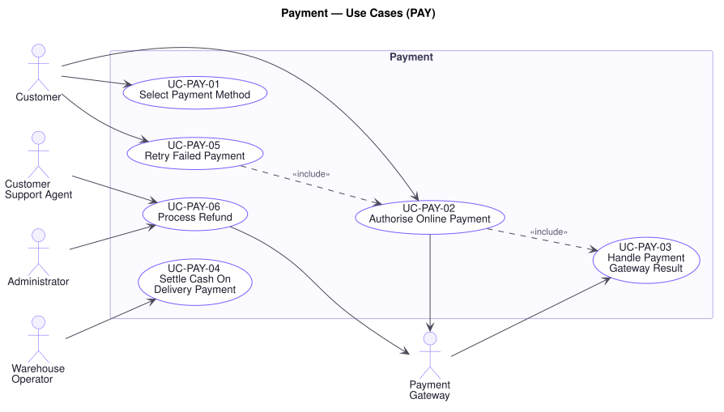

# Payment — Use Cases (`PAY`)

**Document type:** Use Case Specification — domain
**Related documents:** [`README.md`](./README.md) (index and template) · [`../srs.md`](../srs.md) · [`../traceability-matrix.md`](../traceability-matrix.md)
**Audience:** Product Management, Engineering, Quality Assurance

---

## Domain Scope

Where the platform touches real money: method selection, authorisation and capture through an external provider, settlement on delivery, retry after failure, and refund.

Every use case here is bounded by a party the platform does not control. That single fact shapes the whole domain. A provider that does not answer has not declined — it has not answered — and treating the two the same is how an order gets cancelled after the customer was charged. **`BR-PAY-01`** therefore requires every provider result to be applied at most once however many times it arrives, and **`BR-PAY-02`** caps cumulative refunds at the amount actually captured. Both exist because `P7` describes exactly what a partial failure here costs.

**P3** applies with equal weight: no use case below names a provider. `FR-PAY-09` requires payment to be expressed independently of any one of them, so that changing provider is a commercial decision rather than a project.

---

## UC-PAY-01 — Select Payment Method

| Field | Value |
|---|---|
| **Primary actor** | Customer |
| **Supporting actors** | — |
| **Stakeholders & interests** | Customer: wants to pay the way they prefer. Finance: wants Cash On Delivery confined to where it is economic, since it carries collection risk. Warehouse: needs to know which orders arrive with cash to collect. |
| **Priority** | Must |
| **Trigger** | Checkout requires a payment method |
| **Preconditions** | A checkout is in progress with delivery details captured |
| **Success postconditions** | Exactly one eligible method is recorded against the order |
| **Failure postconditions** | No method is recorded; the order cannot be placed |
| **Frequency** | High |
| **Traceability** | `FR-PAY-01`, `FR-PAY-02` · `BR-PAY-03` · `NFR-PERF-02` |

**Main success scenario**

1. Platform determines which of Cash On Delivery, credit card, digital wallet, and bank transfer are eligible for this order (`BR-PAY-03`).
2. Platform presents the eligible methods, with any that carry a fee or a delay identified.
3. Customer selects one.
4. Platform records the selection against the order and returns to the summary (`UC-ORD-04`).

**Alternate flows**

- **A1 — Cash On Delivery selected** (at step 3): No authorisation is sought at placement. The order remains in Pending Payment until delivery (`UC-PAY-04`), and the summary says so plainly.
- **A2 — Bank transfer selected** (at step 3): Settlement is asynchronous. The customer is given the transfer instructions and reference, and the order stays in Pending Payment until the transfer is confirmed (`UC-PAY-03`).
- **A3 — Method changed before placement** (at step 3): The platform records the new selection and re-evaluates eligibility, since changing method can change the total.

**Exception flows**

- **E1 — Cash On Delivery not eligible** (at step 1): The destination or the order value falls outside the configured conditions (`BR-PAY-03`). The method is not offered and, if the customer asks why, the reason is stated. Offering it and declining later wastes the customer's time at the worst moment.
- **E2 — No method is eligible** (at step 1): The platform states the order cannot be paid for as configured and directs the customer to Support. It never places an unpayable order.
- **E3 — Selected method becomes unavailable before placement** (at step 4): The platform reports this at the summary and requires a new selection (`UC-ORD-04`).

**Business rules applied** — `BR-PAY-03`.

---

## UC-PAY-02 — Authorise Online Payment

| Field | Value |
|---|---|
| **Primary actor** | Customer |
| **Supporting actors** | Payment Gateway |
| **Stakeholders & interests** | Customer: wants the purchase to complete, and not to be charged twice. Finance: needs every capture matched to exactly one order (`P7`). Support: absorbs every mismatch this use case creates. Procurement: wants the provider replaceable (`P3`). |
| **Priority** | Must |
| **Trigger** | An order in Pending Payment requires payment |
| **Preconditions** | The order exists with stock reserved and a total payable |
| **Success postconditions** | The amount is authorised and captured; the payment is recorded against the order; the order is **Paid** |
| **Failure postconditions** | The order is **Payment Failed** or remains **Pending Payment**; the reservation is held; **no amount is captured without being recorded** |
| **Frequency** | High |
| **Traceability** | `FR-PAY-03`, `FR-PAY-04`, `FR-PAY-09` · `BR-PAY-01`, `BR-ORD-01` · `NFR-REL-01`, `NFR-REL-04`, `NFR-AVAIL-03`, `NFR-SEC-07` · P3, P7 |

**Main success scenario**

1. Platform records a payment attempt against the order **before** contacting the provider, so that no capture can occur that the platform has no record of requesting (`FR-PAY-04`).
2. Platform requests authorisation and capture for the order total, quoting a reference unique to this attempt (`BR-PAY-01`).
3. Provider authorises and captures.
4. Platform records the outcome, the amount, and the provider reference against the attempt (`FR-PAY-04`).
5. Platform transitions the order to **Paid** and raises `PaymentSucceeded` (`BR-ORD-01`).
6. Platform confirms to the customer.

**Alternate flows**

- **A1 — Provider requires an additional customer step** (at step 3): The customer is directed to complete it. The order remains in Pending Payment with its reservation held, and resolves through `UC-PAY-03` when the result arrives.
- **A2 — Authorisation and capture are separate** (at step 3): Where the provider separates them, authorisation holds the funds and capture occurs on dispatch. The order moves to Paid on capture, and an authorisation not captured within the provider's window is released.
- **A3 — Retry of a previously failed attempt** (at step 1): A new attempt with a new reference is recorded, so attempts are never conflated (`UC-PAY-05`).

**Exception flows**

- **E1 — Provider declines** (at step 3): The order transitions to **Payment Failed** and **the reservation is held** for the retry window (`UC-PAY-05`, **[A-07]**). The decline reason is presented only as far as the provider permits, and the customer is offered a retry. Card details are never logged (`NFR-SEC-07`).
- **E2 — Provider does not answer, or answers after the timeout** (at step 3): **The platform does not assume failure.** The order remains in **Pending Payment** with its reservation held, and the attempt is marked unresolved. The outcome is settled when the provider's result arrives (`UC-PAY-03`) or when the attempt is reconciled against the provider. Treating a timeout as a decline is how a customer is charged for an order the platform then cancels — precisely the partial failure `P7` names.
- **E3 — Provider unreachable** (at step 2): No attempt is made. The order remains in Pending Payment and the customer is told to retry shortly. Platform state is not corrupted by a provider outage (`NFR-AVAIL-03`).
- **E4 — Provider reports success for an attempt the platform has no record of** (at step 4): The capture is recorded against the order as an unmatched payment and escalated for reconciliation. It is never discarded — an unrecorded capture is money taken from a customer that the business cannot see (`P7`).
- **E5 — Duplicate authorisation for the same attempt** (at step 3): The platform recognises the attempt reference and applies the result once (`BR-PAY-01`). The customer is charged once.
- **E6 — Amount authorised differs from the order total** (at step 4): The platform records the discrepancy and does not transition to Paid, escalating for reconciliation rather than accepting a mismatch.

**Business rules applied** — `BR-PAY-01`, `BR-ORD-01`, `BR-INV-02`.

---

## UC-PAY-03 — Handle Payment Gateway Result

| Field | Value |
|---|---|
| **Primary actor** | Payment Gateway |
| **Supporting actors** | — |
| **Stakeholders & interests** | Finance: needs every result applied exactly once. Customer: needs the order to reflect what happened to their money. Support: needs no order left in an indeterminate state. |
| **Priority** | Must |
| **Trigger** | The provider delivers a result for a payment attempt |
| **Preconditions** | The result is attributable to a recorded attempt |
| **Success postconditions** | The result is recorded against the attempt and the order transitioned accordingly — **once**, however many times the result is delivered |
| **Failure postconditions** | The result is not applied and is retained for retry; the order stays in its current state |
| **Frequency** | High |
| **Traceability** | `FR-PAY-04`, `FR-PAY-05` · `BR-PAY-01`, `BR-ORD-01` · `NFR-REL-04`, `NFR-REL-06`, `NFR-SEC-04` · P6, P7 |

**Main success scenario**

1. Provider delivers a result quoting the attempt reference.
2. Platform verifies the result genuinely originates from the provider (`NFR-SEC-04`).
3. Platform locates the recorded attempt.
4. Platform confirms the result has not already been applied (`BR-PAY-01`).
5. Platform records the outcome, amount, and provider reference against the attempt.
6. Platform transitions the order: Pending Payment → **Paid** on success, → **Payment Failed** on failure (`BR-ORD-01`).
7. Platform raises the corresponding business event and notifies the customer (`UC-NTF-01`).

**Alternate flows**

- **A1 — Result is a refund outcome** (at step 5): Recorded against the refund rather than a payment attempt, transitioning the order to **Refunded** where the refund is complete (`UC-PAY-06`).
- **A2 — Result is a bank transfer settlement** (at step 5): An asynchronous settlement against an order awaiting transfer, resolving it to Paid (`UC-PAY-01`, A2).
- **A3 — Result resolves a timed-out attempt** (at step 3): The attempt was left unresolved by `UC-PAY-02`, E2. This is the path that settles it, which is why that use case does not assume failure.

**Exception flows**

- **E1 — Result delivered more than once** (at step 4): The platform applies it once and acknowledges the duplicates. Providers retry until acknowledged, so duplicate delivery is routine, not exceptional — and applying a success twice would move an order twice or refund twice (`BR-PAY-01`, `NFR-REL-04`).
- **E2 — Result cannot be attributed to any attempt** (at step 3): It is recorded as unmatched and escalated for reconciliation. It is never discarded (`UC-PAY-02`, E4).
- **E3 — Result fails authenticity verification** (at step 2): It is rejected and recorded as a security event. An unverified result is an instruction to move money from an unknown party.
- **E4 — Result contradicts one already applied** (at step 4): The platform does not overwrite. It records the conflict and escalates, because deciding automatically which of two contradictory financial statements is true is precisely what a human reconciliation is for.
- **E5 — Order not in a state the result can apply to** (at step 6): The order was cancelled while the result was in flight. The platform records the result and escalates: a capture against a cancelled order is money to be refunded (`UC-PAY-06`), not a result to be dropped.
- **E6 — Applying the result fails** (at step 5): Nothing is applied. The result is retained and retried (`NFR-REL-04`); it is never acknowledged as processed when it was not (`P6`).

**Business rules applied** — `BR-PAY-01`, `BR-PAY-02`, `BR-ORD-01`.

---

## UC-PAY-04 — Settle Cash On Delivery Payment

| Field | Value |
|---|---|
| **Primary actor** | Warehouse Operator |
| **Supporting actors** | Shipping Carrier |
| **Stakeholders & interests** | Finance: needs collected cash reconciled against orders, since this method carries the highest collection risk. Customer: wants the order to show as paid once they have paid. Warehouse and Carrier: need to know how much to collect. |
| **Priority** | Must |
| **Trigger** | Delivery is confirmed and payment collected |
| **Preconditions** | The order is Cash On Delivery, in **Pending Payment**, and out for delivery |
| **Success postconditions** | The collected amount is recorded against the order and the order is **Paid** |
| **Failure postconditions** | The order remains in Pending Payment; the discrepancy is visible for reconciliation |
| **Frequency** | Moderate |
| **Traceability** | `FR-PAY-07`, `FR-PAY-04` · `BR-PAY-03`, `BR-ORD-01`, `BR-AUD-01` · `NFR-OBS-01` · P7, P17 |

**Main success scenario**

1. Delivery is confirmed and the amount collected (`UC-SHP-06`).
2. Platform records the collected amount against the order, attributed to the collecting party (`FR-PAY-04`).
3. Platform confirms the amount matches the order total.
4. Platform transitions the order to **Paid** and raises `PaymentSucceeded` (`BR-ORD-01`).
5. Platform records an audit entry (`UC-AUD-01`).

**Alternate flows**

- **A1 — Carrier reports collection** (at step 1): The carrier confirms both delivery and collection; attribution is to the carrier (`UC-SHP-04`).
- **A2 — Delivery and collection reported separately** (at step 2): The order reaches **Delivered** on delivery but remains unpaid until collection is recorded, so the two facts are never conflated.

**Exception flows**

- **E1 — Customer refuses delivery** (at step 1): No payment is collected. The goods return, the order is cancelled, its reservation released, and the goods restocked (`UC-ORD-08`, `UC-INV-04`). The refusal reason is recorded, as repeated refusals are a fraud signal.
- **E2 — Collected amount differs from the order total** (at step 3): The platform records what was actually collected and does **not** transition to Paid. The discrepancy is escalated. Marking an order paid for an amount that was not collected misstates revenue (`P7`).
- **E3 — Delivery confirmed but collection never recorded** (at step 2): The order stays in Pending Payment and appears on an outstanding-collection report. It is never assumed paid because it was delivered.
- **E4 — Operator lacks authority to record collection** (at step 2): The platform declines and records the attempt. Recording cash receipt is a financial control (`P16`).

**Business rules applied** — `BR-PAY-03`, `BR-ORD-01`, `BR-AUD-01`.

**Assumptions & open questions** — Whether the carrier or the business reconciles collected cash, and on what cycle, is not specified by R1 and affects how E3 is resolved operationally.

---

## UC-PAY-05 — Retry Failed Payment

| Field | Value |
|---|---|
| **Primary actor** | Customer |
| **Supporting actors** | Payment Gateway |
| **Stakeholders & interests** | Customer: wants to recover an order that failed for a fixable reason. Finance: wants recoverable revenue recovered rather than abandoned. Marketing: a failed payment during a flash sale is a sale already won and then lost. Warehouse: needs the reservation resolved either way, and not held forever. |
| **Priority** | Must |
| **Trigger** | Customer retries payment for an order in Payment Failed, or the retry window elapses |
| **Preconditions** | The order is in **Payment Failed** and within the retry window |
| **Success postconditions** | Payment is captured and the order is **Paid**; the reservation held throughout is committed in due course |
| **Failure postconditions** | The order remains in Payment Failed; when the window elapses it is **Cancelled** and its reservation released |
| **Frequency** | Moderate; higher during peak events |
| **Traceability** | `FR-PAY-06`, `FR-INV-03` · `BR-ORD-01`, `BR-ORD-04`, `BR-INV-02`, `BR-PAY-01` · `NFR-REL-01` · P7, P8 |

**Main success scenario**

1. Customer opens an order in Payment Failed and retries payment.
2. Platform confirms the order is within the retry window (**[A-07]**).
3. Platform confirms the reservation is still held (`BR-INV-02`).
4. Platform allows the customer to keep or change the payment method (`UC-PAY-01`).
5. Platform records a new payment attempt with its own reference and requests authorisation (`UC-PAY-02`).
6. On success, the platform transitions the order to **Paid** (`BR-ORD-01`).

**Alternate flows**

- **A1 — Different method chosen** (at step 4): Common and expected — the first method is often the reason it failed. Eligibility is re-evaluated (`BR-PAY-03`).
- **A2 — Retry window elapses** (at step 2): The Scheduler transitions the order to **Cancelled**, releases the reservation (`UC-INV-02`, A1), and notifies the customer. This is what stops one abandoned failed payment from holding scarce stock indefinitely (`P8`).
- **A3 — Customer abandons the order** (at step 1): The customer cancels rather than retries (`UC-ORD-08`), releasing the stock immediately rather than at window expiry.

**Exception flows**

- **E1 — Retry window has passed** (at step 2): The platform declines and explains the order was cancelled and the stock released. The customer is offered the cart contents again, subject to current availability — the platform cannot restore a claim on stock it has already returned to sale.
- **E2 — Reservation no longer held** (at step 3): Released by a race or an error. The platform re-checks availability and re-reserves (`UC-INV-01`); if stock is no longer available it declines as E1, since it cannot promise goods it does not have (`BR-INV-01`).
- **E3 — Retry also declines** (at step 5): The order stays in **Payment Failed** with the reservation held and the window running. Further retries are permitted but rate-limited, since repeated authorisation attempts against a failing instrument are themselves a fraud signal.
- **E4 — Order state has changed since the page loaded** (at step 2): It was cancelled in another session. The platform reports the current state and declines the retry (`BR-ORD-01`).
- **E5 — A price or promotion changed during the window** (at step 5): The order total is **not** recalculated. It was fixed at placement (`BR-ORD-06`) and the customer pays what they agreed to.

**Business rules applied** — `BR-ORD-01`, `BR-ORD-04`, `BR-ORD-06`, `BR-INV-01`, `BR-INV-02`, `BR-PAY-01`.

**Assumptions & open questions** — The retry window (**[A-07]**: 24 hours) trades customer convenience against stock availability during a peak event, and requires Product Owner confirmation.

---

## UC-PAY-06 — Process Refund

| Field | Value |
|---|---|
| **Primary actor** | Customer Support Agent |
| **Supporting actors** | Administrator, Payment Gateway |
| **Stakeholders & interests** | Customer: wants their money back promptly. Finance: needs every refund bounded by what was captured and attributable to a decision (`P17`). Legal/Compliance: needs refund approval traceable. Support: needs to resolve disputes without escalation. |
| **Priority** | Must |
| **Trigger** | An order is cancelled after capture, a return is accepted, or Support approves a refund |
| **Preconditions** | A captured payment exists against the order; the actor holds a role permitting refunds |
| **Success postconditions** | The refund is issued and recorded; the order is **Refunded** where the refund covers the full amount; an audit entry records who approved it and why |
| **Failure postconditions** | No refund is issued; the order stays visibly awaiting refund and the failure is retried |
| **Frequency** | Low to moderate |
| **Traceability** | `FR-PAY-08`, `FR-AUD-01` · `BR-PAY-01`, `BR-PAY-02`, `BR-ORD-01`, `BR-AUD-01` · `NFR-REL-01`, `NFR-OBS-01` · P7, P16, P17 |

**Main success scenario**

1. Actor initiates a refund for a stated amount and reason, or it is initiated automatically by cancellation (`UC-ORD-08`) or an accepted return (`UC-ORD-09`).
2. Platform authorises the request against the actor's role (`UC-AUD-03`, `P16`).
3. Platform confirms the amount, together with refunds already issued, does not exceed the amount captured (`BR-PAY-02`).
4. Platform records the refund against the order **before** contacting the provider.
5. Platform requests the refund from the provider, quoting a reference unique to it (`BR-PAY-01`).
6. Platform records the outcome on receipt (`UC-PAY-03`, A1).
7. Where the refund covers the full captured amount, the platform transitions the order to **Refunded** (`BR-ORD-01`).
8. Platform records an audit entry and notifies the customer (`UC-AUD-01`, `UC-NTF-01`).

**Alternate flows**

- **A1 — Partial refund** (at step 3): Only some lines are refunded (`UC-ORD-09`, A1). The order does not become Refunded; the remaining captured amount stands.
- **A2 — Automatic on cancellation** (at step 1): Attributed to the cancellation and its actor, not to a separate approval.
- **A3 — Cash On Delivery refund** (at step 5): No provider capture exists to reverse. The refund is recorded and settled by the business's own process, and the order still reaches Refunded once settled.
- **A4 — Refund of an unmatched capture** (at step 1): Refunding a capture that could not be attributed to an order (`UC-PAY-02`, E4), recorded against the reconciliation rather than an order.

**Exception flows**

- **E1 — Refund would exceed the captured amount** (at step 3): The platform declines and states the maximum refundable. Refunding more than was taken is an unbounded loss (`BR-PAY-02`, `P7`).
- **E2 — Actor lacks authority** (at step 2): The platform declines and records the attempt. Refund approval is one of the highest-value authorities in the platform and a standing fraud risk (`P16`, `P17`).
- **E3 — Provider rejects the refund** (at step 5): The refund stays recorded as **failed**, the order is **not** marked Refunded, and it is escalated for manual settlement. The obligation to the customer does not disappear because the provider declined.
- **E4 — Provider unreachable** (at step 5): The refund stays recorded as pending and is retried (`NFR-REL-04`). Because step 4 precedes step 5, the obligation is visible even if the request never reaches the provider (`P7`).
- **E5 — Duplicate refund request** (at step 5): The platform recognises the reference and issues it once (`BR-PAY-01`). Refunding twice is a direct loss with no counterparty to recover from.
- **E6 — Reason not supplied** (at step 1): The platform declines. A refund without a recorded reason cannot answer "who did this, when, and why" (`BR-AUD-01`, `P17`).
- **E7 — Audit entry cannot be written** (at step 8): The refund **stands** — the customer's money has already moved and reversing it would be worse — and the missing audit entry is escalated immediately as a compliance exception. This differs deliberately from `UC-INV-04`, E4, where nothing external has yet happened and the operation can safely be refused.

**Business rules applied** — `BR-PAY-01`, `BR-PAY-02`, `BR-ORD-01`, `BR-AUD-01`, `BR-AUD-02`.

**Assumptions & open questions** — Whether refunds above a threshold require a second approver is not specified by R1. Given the fraud exposure `P16` and `P17` describe, this is worth an explicit Product Owner decision.
