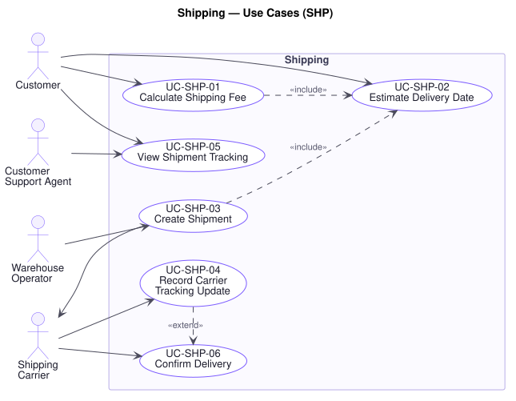

# Shipping — Use Cases (`SHP`)

**Related documents:** [`README.md`](./README.md) (index and template) · [`../srs.md`](../srs.md) · [`../traceability-matrix.md`](../traceability-matrix.md)

---

## Domain Scope

Getting the goods to the customer and keeping both sides informed: fee calculation, delivery estimation, shipment creation, carrier tracking, and delivery confirmation.

Like Payment, this domain is bounded by parties the platform does not control, and **P3** applies directly — R1 §2 requires multiple shipping providers, so no use case below names one. Two rules carry most of the weight: **`BR-SHP-01`**, which requires the fee quoted at confirmation to be the fee charged, and **`BR-SHP-02`**, which stops a late-arriving carrier update from moving a shipment backwards.

---

## UC-SHP-01 — Calculate Shipping Fee

| Field | Value |
|---|---|
| **Primary actor** | Customer |
| **Supporting actors** | Shipping Carrier |
| **Stakeholders & interests** | Customer: wants no surprise at the summary. Finance: wants delivery cost recovered, not absorbed. Marketing: shipping cost is a leading cause of abandonment. Warehouse: needs the fee to reflect what will actually be shipped. |
| **Priority** | Must |
| **Trigger** | A destination and order contents are known, or either changes |
| **Preconditions** | The order has at least one line and a destination address |
| **Success postconditions** | A fee is recorded against the order for the destination, contents, and selected option |
| **Failure postconditions** | No fee is recorded and the order cannot be placed |
| **Frequency** | Very high — recalculated on every relevant change |
| **Traceability** | `FR-SHP-02`, `FR-ORD-04` · `BR-SHP-01`, `BR-PRM-02` · `NFR-PERF-02`, `NFR-AVAIL-03` |

**Main success scenario**

1. Platform takes the destination, the order contents, and their weight and dimensions.
2. Platform determines which providers serve the destination (`FR-SHP-01`).
3. Platform calculates the fee for each eligible option.
4. Platform records the fee for the selected option against the order (`BR-SHP-01`).
5. Platform presents the fee alongside the delivery estimate (`UC-SHP-02`).

**Alternate flows**

- **A1 — Free shipping promotion applies** (at step 4): The fee is calculated as normal and the promotion waives it as an itemised discount (`FR-PRM-04`), so the cost the business bears remains visible even when the customer does not pay it.
- **A2 — Order splits across warehouses** (at step 3): A fee is calculated per shipment and the total presented as one figure, with the split explained (`UC-INV-01`, A2).
- **A3 — Destination or contents change** (at step 1): The fee is recalculated and the new figure presented before confirmation (`BR-SHP-01`).
- **A4 — Threshold reached** (at step 3): The order qualifies for a reduced or waived fee by value or weight; the qualifying condition is stated, since it is an incentive to add to the order.

**Exception flows**

- **E1 — No provider serves the destination** (at step 2): The platform states the destination cannot be delivered to and offers a different address (`UC-ORD-02`, E2). It does not quote a fee it cannot honour.
- **E2 — Some lines cannot ship to the destination** (at step 2): Restricted items are identified and must be removed or the address changed (`UC-ORD-02`, E5).
- **E3 — Fee cannot be calculated** (at step 3): The platform reports the failure and permits retry. **It never estimates.** `BR-SHP-01` requires the fee shown to be the fee charged, and a guess would either lose money or misquote the customer.
- **E4 — Provider rate lookup unavailable** (at step 3): Where a configured fallback rate exists it is used and identified as such; otherwise E3 applies (`NFR-AVAIL-03`).
- **E5 — Weight or dimensions unknown for a line** (at step 1): The platform uses the configured default for its category and flags the order for review, since an under-declared parcel is a cost the business absorbs on delivery.

**Business rules applied** — `BR-SHP-01`, `BR-PRM-02`.

---

## UC-SHP-02 — Estimate Delivery Date

| Field | Value |
|---|---|
| **Primary actor** | Customer |
| **Supporting actors** | Shipping Carrier |
| **Stakeholders & interests** | Customer: often decides on delivery speed rather than price. Support: an unmet estimate becomes a contact. Marketing: a credible estimate converts. |
| **Priority** | Should |
| **Trigger** | A destination and shipping option are known |
| **Preconditions** | A shipping option has been determined for the destination |
| **Success postconditions** | An estimated delivery date is presented and recorded against the order |
| **Failure postconditions** | No estimate is presented; the order can still be placed |
| **Frequency** | Very high |
| **Traceability** | `FR-SHP-03` · `BR-SHP-01` · `NFR-AVAIL-02` |

**Main success scenario**

1. Platform takes the destination, the selected option, and the order's dispatch readiness.
2. Platform estimates transit time for the option and destination.
3. Platform adds the expected time to dispatch, allowing for non-working days.
4. Platform presents the estimate as a range rather than a single date, so it is not read as a guarantee.
5. Platform records the estimate against the order for later comparison (`UC-ORD-07`).

**Alternate flows**

- **A1 — Options compared** (at step 4): Each option is presented with its own fee and estimate, which is how a customer trades cost against speed.
- **A2 — Backordered line** (at step 3): The estimate reflects the expected restock date, and the delay is stated before placement rather than discovered afterwards.
- **A3 — Split shipments** (at step 4): Each shipment carries its own estimate, since presenting only the latest misrepresents when the first arrives.

**Exception flows**

- **E1 — Estimate unavailable** (at step 2): The order proceeds without one (`NFR-AVAIL-02`). An estimate is useful, not essential, and its absence must never block a purchase.
- **E2 — Carrier changes the estimate after dispatch** (at step 5): The revised estimate is recorded and the customer notified (`UC-SHP-04`). The original is retained so the difference is visible.
- **E3 — Estimate falls outside the carrier's stated service** (at step 3): The platform presents the carrier's stated service rather than its own computation, and flags the discrepancy for review.

**Business rules applied** — `BR-SHP-01`, `BR-SHP-02`.

---

## UC-SHP-03 — Create Shipment

| Field | Value |
|---|---|
| **Primary actor** | Warehouse Operator |
| **Supporting actors** | Shipping Carrier |
| **Stakeholders & interests** | Warehouse: needs a label and a manifest. Customer: needs a tracking reference. Carrier: needs a correctly declared parcel. Finance: needs shipping cost attributable to an order. |
| **Priority** | Must |
| **Trigger** | An order is packed and ready for dispatch |
| **Preconditions** | The order is **Packed**; its reservation is committed (`UC-INV-03`) |
| **Success postconditions** | A shipment exists with a carrier and tracking reference; the order is **Shipping**; the customer is notified |
| **Failure postconditions** | No shipment exists and the order remains **Packed** |
| **Frequency** | High — once per order dispatched |
| **Traceability** | `FR-SHP-01`, `FR-SHP-04`, `FR-ORD-16` · `BR-ORD-01`, `BR-INV-02` · `NFR-REL-01`, `NFR-AVAIL-03` · P3, P7 |

**Main success scenario**

1. Warehouse Operator confirms the order is packed and ready.
2. Platform confirms the order is in **Packed** and its reservation committed (`BR-ORD-01`, `BR-INV-02`).
3. Platform selects the carrier for the destination and option (`FR-SHP-01`).
4. Platform creates the shipment with the carrier and receives a tracking reference.
5. Platform records the shipment, its carrier, its reference, and the lines it carries.
6. Platform transitions the order to **Shipping** (`UC-ORD-10`).
7. Platform notifies the customer with the tracking reference (`UC-NTF-01`).

**Alternate flows**

- **A1 — Split shipment** (at step 5): The order ships as more than one parcel. Each is recorded separately with its own reference and lines, and the order advances only when all are dispatched.
- **A2 — Carrier chosen manually** (at step 3): The Operator overrides the automatic selection; the override and its reason are recorded (`UC-AUD-01`).
- **A3 — Cash On Delivery** (at step 4): The amount to collect is declared to the carrier, so that collection can be recorded on delivery (`UC-PAY-04`).

**Exception flows**

- **E1 — Order not in Packed** (at step 2): The platform declines. Dispatching an order whose stock is not committed would ship goods the platform still counts as reserved (`BR-ORD-01`, `P7`).
- **E2 — Carrier rejects the shipment** (at step 4): No shipment is recorded and the order stays **Packed**. The rejection reason is presented so the Operator can correct the declaration and retry.
- **E3 — Carrier unreachable** (at step 4): No shipment is recorded and the order stays Packed. Where an alternative carrier serves the destination it is offered (`NFR-AVAIL-03`); the order is never advanced on an unconfirmed dispatch.
- **E4 — Tracking reference not returned** (at step 4): The shipment is recorded as dispatched without a reference and flagged for follow-up. The customer is notified of dispatch, and of the reference when it arrives — a missing reference does not justify withholding the fact of dispatch.
- **E5 — Shipment created but the order fails to advance** (at step 6): The shipment exists with the carrier and cannot be recalled, so the transition is retried rather than the shipment cancelled (`NFR-REL-04`). Persistent failure is escalated, since an order in Packed with goods in transit misstates both fulfilment and revenue (`P7`).

**Business rules applied** — `BR-ORD-01`, `BR-INV-02`, `BR-AUD-01`.

---

## UC-SHP-04 — Record Carrier Tracking Update

| Field | Value |
|---|---|
| **Primary actor** | Shipping Carrier |
| **Stakeholders & interests** | Customer: wants to follow the parcel without asking. Support: every visible update is a contact avoided. Warehouse: needs exceptions surfaced early. |
| **Priority** | Must |
| **Trigger** | The carrier reports a status change |
| **Preconditions** | The update is attributable to a recorded shipment |
| **Success postconditions** | The update is recorded in sequence; where it signals delivery, the order advances |
| **Failure postconditions** | The update is not recorded and is retained for retry; the last known state stands |
| **Frequency** | Very high — several per shipment |
| **Traceability** | `FR-SHP-05`, `FR-ORD-13` · `BR-SHP-02`, `BR-ORD-01` · `NFR-REL-04`, `NFR-SEC-04` · P6 |

**Main success scenario**

1. Carrier reports a status change quoting the tracking reference.
2. Platform verifies the update genuinely originates from the carrier (`NFR-SEC-04`).
3. Platform locates the shipment by its reference.
4. Platform confirms the update is not older than the latest already recorded (`BR-SHP-02`).
5. Platform appends the update to the shipment's history.
6. Where the update signals delivery, the platform confirms delivery (`UC-SHP-06`).
7. Where the update is customer-visible, the platform notifies the customer (`UC-NTF-01`).

**Alternate flows**

- **A1 — Exception reported** (at step 5): The carrier reports a failed delivery attempt, a refusal, or damage. It is recorded, the customer notified, and Support alerted, since these need action rather than observation.
- **A2 — Return to sender** (at step 5): The parcel is coming back. The order is flagged for Support to cancel or redeliver, and the goods restocked on receipt (`UC-INV-04`, A4).
- **A3 — Delivery date revised** (at step 5): The estimate is updated and the customer notified (`UC-SHP-02`, E2).

**Exception flows**

- **E1 — Update delivered more than once** (at step 4): Recorded once. Carriers retry until acknowledged, so duplicates are routine (`NFR-REL-04`).
- **E2 — Update arrives out of order** (at step 4): An update older than the latest recorded is retained in the history for completeness but **does not move the shipment backwards** (`BR-SHP-02`). A "in transit" arriving after "delivered" must not un-deliver a parcel.
- **E3 — Reference matches no shipment** (at step 3): Recorded as unmatched and escalated. It may indicate a shipment created but not recorded (`UC-SHP-03`, E5).
- **E4 — Update fails authenticity verification** (at step 2): Rejected and recorded as a security event. An unverified update could mark an undelivered order delivered, which for Cash On Delivery moves money (`UC-PAY-04`).
- **E5 — Recording fails** (at step 5): Nothing is recorded; the update is retained and retried (`P6`). It is never acknowledged as processed when it was not.

**Business rules applied** — `BR-SHP-02`, `BR-ORD-01`.

---

## UC-SHP-05 — View Shipment Tracking

| Field | Value |
|---|---|
| **Primary actor** | Customer |
| **Supporting actors** | Customer Support Agent, Administrator |
| **Stakeholders & interests** | Customer: wants to know where the parcel is. Support: needs the same view the customer has, to answer without guessing. |
| **Priority** | Must |
| **Trigger** | An actor opens tracking for a shipment |
| **Preconditions** | The actor owns the order or holds a role granting order read |
| **Success postconditions** | The tracking history is presented in order with the time of the last update |
| **Failure postconditions** | Nothing is disclosed |
| **Frequency** | Very high |
| **Traceability** | `FR-SHP-06` · `BR-AUD-02`, `BR-SHP-02` · `NFR-AVAIL-02`, `NFR-SEC-01` · P16 |

**Main success scenario**

1. Actor opens tracking for a shipment.
2. Platform authorises and scopes the request (`BR-AUD-02`).
3. Platform retrieves the shipment and its recorded update history.
4. Platform presents the updates in order, the current status, the delivery estimate, and **when the last update was received**.

**Alternate flows**

- **A1 — Several shipments** (at step 3): Each is presented separately with the lines it carries (`UC-SHP-03`, A1).
- **A2 — Support views any shipment** (at step 2): Authorisation by role rather than ownership, and auditable (`UC-AUD-01`).
- **A3 — Deep link to the carrier** (at step 4): A link to the carrier's own tracking is offered alongside, not instead of, the recorded history.

**Exception flows**

- **E1 — No updates yet received** (at step 3): The platform states the shipment is dispatched and awaiting the first carrier update. An empty history is explained rather than left blank.
- **E2 — Last update is old** (at step 4): The age is stated explicitly. A stale status presented as current is worse than no status, because the customer acts on it.
- **E3 — Actor lacks authority** (at step 2): The platform declines with the same response as for a shipment that does not exist. A tracking reference identifies a real address and must not be probeable (`P16`).

**Business rules applied** — `BR-AUD-02`, `BR-SHP-02`.

---

## UC-SHP-06 — Confirm Delivery

| Field | Value |
|---|---|
| **Primary actor** | Shipping Carrier |
| **Supporting actors** | Warehouse Operator, Customer Support Agent |
| **Stakeholders & interests** | Customer: delivery starts the return window and, for Cash On Delivery, is when they pay. Finance: delivery completes the sale. Warehouse: closes the fulfilment. Support: disputes turn on whether delivery is proven. |
| **Priority** | Must |
| **Trigger** | The carrier confirms delivery, or an operator records it |
| **Preconditions** | The order is in **Shipping** |
| **Success postconditions** | The order is **Delivered**; the return window starts; Cash On Delivery settlement is triggered; the customer is notified |
| **Failure postconditions** | The order remains in Shipping |
| **Frequency** | High — once per order |
| **Traceability** | `FR-SHP-07`, `FR-ORD-16`, `FR-PAY-07` · `BR-ORD-01`, `BR-ORD-05`, `BR-PAY-03` · `NFR-REL-01` · P7 |

**Main success scenario**

1. Carrier confirms delivery (`UC-SHP-04`) or an operator records it.
2. Platform confirms the order is in **Shipping** (`BR-ORD-01`).
3. Platform records the delivery time and any proof the carrier supplies.
4. Platform transitions the order to **Delivered** (`UC-ORD-10`).
5. Platform starts the return window from the delivery date (`BR-ORD-05`).
6. Where the order is Cash On Delivery, the platform triggers settlement (`UC-PAY-04`).
7. Platform notifies the customer and raises the delivery event (`UC-NTF-01`).

**Alternate flows**

- **A1 — Partial delivery** (at step 4): Only some shipments have arrived. Those lines are delivered; the order advances only when all have.
- **A2 — Recorded by Support** (at step 1): The carrier's feed is unavailable but delivery is confirmed by other means. Attribution is to the agent, with the basis recorded (`P17`).
- **A3 — Return window closes** (at step 5): The Scheduler later transitions Delivered → **Completed** (`UC-ORD-10`, A3).

**Exception flows**

- **E1 — Order not in Shipping** (at step 2): The platform declines and records the conflict. A delivery for an order never dispatched indicates a mismatch worth investigating rather than accepting (`BR-ORD-01`).
- **E2 — Delivery confirmed more than once** (at step 4): Applied once. The return window is not restarted by a duplicate, which would otherwise extend it silently (`BR-ORD-05`).
- **E3 — Customer disputes delivery** (at step 7): The order stays **Delivered** and the dispute is recorded for Support. The platform does not reverse a carrier's confirmation automatically; the resolution is a return or a refund (`UC-PAY-06`), each attributable (`P17`).
- **E4 — Cash On Delivery collection not recorded** (at step 6): The order is Delivered but **not** Paid, and appears on the outstanding-collection report (`UC-PAY-04`, E3). Delivery is never taken as evidence of payment.
- **E5 — Confirmation fails to apply** (at step 4): The order stays in Shipping and the confirmation is retried (`NFR-REL-04`), so that a delivered order is not left indefinitely mid-flight.

**Business rules applied** — `BR-ORD-01`, `BR-ORD-05`, `BR-PAY-03`, `BR-SHP-02`.
