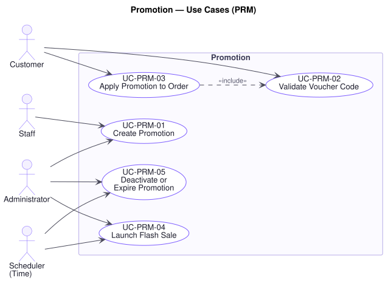

# Promotion — Use Cases (`PRM`)

**Related documents:** [`README.md`](./README.md) (index and template) · [`../srs.md`](../srs.md) · [`../traceability-matrix.md`](../traceability-matrix.md)

---

## Domain Scope

Configured, time-bounded reductions in price: coupons and voucher codes, percentage and fixed discounts, free shipping, buy-X-get-Y, and flash sales.

R1 §2 requires that "promotion rules should be configurable," which sets the design constraint for the whole domain: a new campaign must be a configuration change, not a delivery. `FR-PRM-07` states this and `BR-PRM-01` bounds it — every configured condition is evaluated both when a promotion is applied and again when the order is placed, because the gap between those two moments is where a campaign gets over-redeemed.

Promotions are also the sharpest instance of **P5**. A discount rule enforced only at the customer-facing checkout is a rule the administrative interface and any future client can bypass, and a discount is money. **P8** and **P9** meet here too: a flash sale is deliberately engineered concentrated demand against limited stock, which is exactly the condition the inventory rules must survive.

---

## UC-PRM-01 — Create Promotion

| Field | Value |
|---|---|
| **Primary actor** | Staff |
| **Supporting actors** | Administrator |
| **Stakeholders & interests** | Marketing: wants to launch a campaign without a release. Finance: wants total discount exposure bounded before the campaign runs, not discovered after. Legal/Compliance: wants the terms recorded as configured. Customer: wants advertised terms honoured. |
| **Priority** | Must |
| **Trigger** | Staff or Administrator configures a promotion |
| **Preconditions** | The actor holds a role permitting promotion management (`UC-AUD-03`) |
| **Success postconditions** | The promotion exists with its type, discount, conditions, validity period, and usage limits; an audit entry records who created it |
| **Failure postconditions** | No promotion exists and nothing is applied to any order |
| **Frequency** | Low to moderate |
| **Traceability** | `FR-PRM-01`, `FR-PRM-07`, `FR-ADM-06`, `FR-AUD-01` · `BR-PRM-01`, `BR-PRM-02`, `BR-PRM-03`, `BR-AUD-01` · `NFR-SEC-01`, `NFR-OBS-01` · P16, P17 |

**Main success scenario**

1. Actor selects a promotion type — percentage, fixed amount, free shipping, or buy X get Y (`FR-PRM-02`–`FR-PRM-05`).
2. Actor configures the discount, the eligibility conditions, the validity period, the total usage limit, and the per-customer usage limit (`FR-PRM-07`).
3. Actor configures redemption: automatic on eligible orders, or by voucher code (`FR-PRM-01`).
4. Platform authorises the request against the actor's role (`UC-AUD-03`).
5. Platform validates the configuration is internally consistent and bounded (`BR-PRM-01`, `BR-PRM-02`).
6. Platform stores the promotion, inactive until its validity period opens.
7. Platform records an audit entry with the actor, the configuration, and the time (`UC-AUD-01`).

**Alternate flows**

- **A1 — Voucher codes generated** (at step 3): The platform generates single-use or shared codes. Single-use codes are individually limited; a shared code relies on the total usage limit for its bound.
- **A2 — Scheduled for later** (at step 6): The promotion is stored with a future start; the Scheduler activates it (`UC-PRM-04`).
- **A3 — Amending an existing promotion** (at step 1): The amendment is audited with before and after values. It does not retroactively change discounts already applied to placed orders (`BR-ORD-06`).
- **A4 — Stacking policy set** (at step 2): How this promotion combines with others is configured, so the outcome is deterministic when several are eligible (`BR-PRM-03`).

**Exception flows**

- **E1 — Discount could exceed order value** (at step 5): The platform declines a configuration that could produce a negative total, or requires an explicit cap. An order total is never negative and the business never pays a customer to order (`BR-PRM-02`).
- **E2 — No usage limit set** (at step 5): The platform declines. A promotion without a bound is unbounded discount exposure, which is what `BR-PRM-01` exists to prevent — the case Finance most needs decided before launch rather than after.
- **E3 — Validity period invalid** (at step 5): An end before its start, or a period already elapsed, is declined with the problem named.
- **E4 — Conditions can never be satisfied** (at step 5): Mutually exclusive conditions are declined, since a campaign that cannot redeem will be reported as a platform fault by every customer who tries it.
- **E5 — Actor lacks authority** (at step 4): The platform declines and records the attempt. Creating a promotion is creating a licence to reduce prices (`P16`).
- **E6 — Audit entry cannot be written** (at step 7): The promotion is **not** created. A discount rule nobody can attribute is exactly what `P17` forbids (`BR-AUD-01`).

**Business rules applied** — `BR-PRM-01`, `BR-PRM-02`, `BR-PRM-03`, `BR-AUD-01`, `BR-AUD-02`.

---

## UC-PRM-02 — Validate Voucher Code

| Field | Value |
|---|---|
| **Primary actor** | Customer |
| **Stakeholders & interests** | Customer: wants a clear answer about a code they were given. Marketing: wants valid codes to work and invalid ones to fail cleanly. Finance: wants the usage limit to hold under concurrency. Trust & Safety: wants codes not to be discoverable by guessing. |
| **Priority** | Must |
| **Trigger** | A voucher code is presented at checkout or at order placement |
| **Preconditions** | An order is in progress |
| **Success postconditions** | The code is confirmed valid for this order and this customer at this moment |
| **Failure postconditions** | The code is rejected with an actionable reason where one can be given without disclosing what the code is |
| **Frequency** | High during campaigns |
| **Traceability** | `FR-PRM-08`, `FR-ORD-05` · `BR-PRM-01`, `BR-PRM-02` · `NFR-SEC-05` · P5 |

**Main success scenario**

1. Customer presents a voucher code (`UC-ORD-03`).
2. Platform locates the promotion the code belongs to.
3. Platform confirms the promotion is currently within its validity period (`BR-PRM-01`).
4. Platform confirms the customer is eligible and has not exhausted their per-customer limit.
5. Platform confirms the order satisfies the promotion's conditions.
6. Platform confirms the total usage limit is not exhausted.
7. Platform confirms the code is valid and returns the discount it would produce (`UC-PRM-03`).

**Alternate flows**

- **A1 — Re-validated at placement** (at step 1): The same validation runs again at `UC-ORD-05`, step 3, against conditions as they then stand. Validating only once leaves a window in which an exhausted campaign is still redeemable — which under a flash sale is minutes, not hours.
- **A2 — Automatic promotion** (at step 2): No code is presented. Eligibility is evaluated against the order directly; the remaining steps are identical.
- **A3 — Single-use code** (at step 6): The code's own use, rather than a shared total, is the limit.

**Exception flows**

- **E1 — Code not recognised** (at step 2): The platform reports the code is not valid, without distinguishing "never existed" from "expired" or "exhausted" — otherwise the response becomes an oracle for discovering live codes. Attempts are rate-limited (`NFR-SEC-05`).
- **E2 — Outside the validity period** (at step 3): Where the campaign intends it, the platform states when the promotion runs, since that is useful and not disclosive; otherwise E1 applies.
- **E3 — Customer not eligible** (at step 4): The platform states the customer is not eligible, without disclosing the eligibility criteria, which would otherwise be gameable.
- **E4 — Per-customer limit reached** (at step 4): The platform states the customer has already used the promotion. This is actionable and not disclosive.
- **E5 — Order does not meet the conditions** (at step 5): The platform states the unmet condition — a minimum value, a qualifying category — because the customer may choose to meet it, which is what the condition is for.
- **E6 — Total usage limit exhausted** (at step 6): The platform reports the promotion is no longer available.
- **E7 — Limit reached by a concurrent redemption** (at step 6): Two customers redeem the last available use at once. **Exactly one succeeds**; the other is told the promotion is exhausted. The limit holds under concurrency for the same reason `BR-INV-01` does — over-redemption is unbudgeted spend (`BR-PRM-01`).
- **E8 — Excessive validation attempts** (at step 1): Rejected under rate limiting (`UC-AUD-04`). Repeated failed codes from one caller is code-guessing.

**Business rules applied** — `BR-PRM-01`, `BR-PRM-02`.

---

## UC-PRM-03 — Apply Promotion to Order

| Field | Value |
|---|---|
| **Primary actor** | Customer |
| **Stakeholders & interests** | Customer: wants the saving reflected in what they pay. Finance: wants every discount attributable to a campaign and bounded (`P5`). Marketing: wants campaign performance measurable, which requires the contribution recorded. |
| **Priority** | Must |
| **Trigger** | A promotion is confirmed valid for an order |
| **Preconditions** | The promotion has passed validation (`UC-PRM-02`) |
| **Success postconditions** | The discount is calculated, recorded against the order with its promotion, and reflected in the total |
| **Failure postconditions** | No discount is applied and the total is unchanged |
| **Frequency** | High during campaigns |
| **Traceability** | `FR-PRM-02`, `FR-PRM-03`, `FR-PRM-04`, `FR-PRM-05`, `FR-PRM-09` · `BR-PRM-01`, `BR-PRM-02`, `BR-PRM-03`, `BR-ORD-06` · `FR-DAT-01` · P5 |

**Main success scenario**

1. Platform determines which promotions apply, resolving overlaps by the configured stacking policy (`BR-PRM-03`).
2. Platform calculates each promotion's contribution against the appropriate base — line value, order value, or shipping fee.
3. Platform caps the total discount at the discountable value of the order (`BR-PRM-02`).
4. Platform records against the order **every promotion applied and the amount each contributed** (`FR-PRM-09`).
5. Platform recalculates the order total at the required monetary precision (`FR-DAT-01`).
6. Platform presents the total with each discount itemised, so the customer can see the price is not arbitrary.

**Alternate flows**

- **A1 — Percentage discount** (at step 2): Applied to line or order value per configuration, rounded at the configured precision (`FR-DAT-01`) so repeated calculation does not drift.
- **A2 — Fixed amount** (at step 2): Deducted from the order value, capped by step 3.
- **A3 — Free shipping** (at step 2): Applied to the shipping fee rather than the goods. The underlying fee is still calculated and recorded, so the cost the business absorbs stays visible (`UC-SHP-01`, A1).
- **A4 — Buy X get Y** (at step 2): The qualifying lines are identified and the granted items added or discounted. The granted items reserve stock like any other line (`UC-INV-01`).
- **A5 — Several promotions apply** (at step 1): The stacking policy decides the set and the order of application. The outcome is deterministic for identical inputs (`BR-PRM-03`).

**Exception flows**

- **E1 — Discount exceeds the discountable value** (at step 3): It is capped. The total is never negative (`BR-PRM-02`).
- **E2 — Promotions conflict and no policy resolves them** (at step 1): The platform applies only the single most favourable to the customer and records that the others were not applied. A non-deterministic outcome would make the same order price differently on two attempts (`BR-PRM-03`).
- **E3 — Order changes after the discount is applied** (at step 4): Quantity, contents, or address change. Every applied promotion is re-evaluated and the discount recalculated (`UC-ORD-04`, E3), since an order may no longer meet the condition that qualified it.
- **E4 — Buy X get Y granted item out of stock** (at step 2, A4): The promotion cannot be honoured as configured. The platform states this and applies the configured fallback, or no discount, rather than confirming an order it cannot fulfil (`BR-INV-01`).
- **E5 — Promotion deactivated between application and placement** (at step 4): Re-validation at placement removes it and requires re-confirmation of the new total (`UC-ORD-05`, E3). The customer is never charged a total they have not agreed to.
- **E6 — Rounding produces a discrepancy** (at step 5): The platform applies the configured rounding rule consistently so that line amounts sum to the recorded total. An order whose parts do not add up cannot be reconciled by Finance (`FR-DAT-01`, `P7`).

**Business rules applied** — `BR-PRM-01`, `BR-PRM-02`, `BR-PRM-03`, `BR-ORD-06`.

---

## UC-PRM-04 — Launch Flash Sale

| Field | Value |
|---|---|
| **Primary actor** | Administrator |
| **Supporting actors** | Scheduler (Time), Staff |
| **Stakeholders & interests** | Marketing: the campaign's whole value is concentrated in a short window. Leadership: peak events carry a disproportionate share of annual revenue (`P9`). Finance: bears the refund cost of every oversell. Customer: judges the brand by whether the promise holds at the moment it matters most (`P8`). |
| **Priority** | Must |
| **Trigger** | A configured flash sale reaches its start time, or is launched manually |
| **Preconditions** | The flash sale is configured with its products, discount, window, and limits |
| **Success postconditions** | The sale is active; participating products show the sale price; the sale ends automatically at its configured time |
| **Failure postconditions** | The sale is not active and no product shows a sale price |
| **Frequency** | Low, high impact |
| **Traceability** | `FR-PRM-06`, `FR-PRM-07`, `FR-PRM-10` · `BR-PRM-01`, `BR-INV-01`, `BR-AUD-01` · `NFR-SCAL-06`, `NFR-REL-03`, `NFR-AVAIL-01` · P8, P9 |

**Main success scenario**

1. Scheduler reaches the configured start time, or an Administrator launches the sale manually.
2. Platform activates the promotion (`FR-PRM-06`).
3. Platform makes the sale price visible on participating products in catalog and search.
4. Platform applies the sale to qualifying orders as they are placed (`UC-PRM-03`).
5. Platform enforces the total and per-customer usage limits throughout, under concentrated concurrent demand (`BR-PRM-01`, `UC-PRM-02`, E7).
6. Scheduler reaches the configured end time and deactivates the sale (`UC-PRM-05`).
7. Platform records an audit entry for activation and deactivation (`UC-AUD-01`).

**Alternate flows**

- **A1 — Launched manually** (at step 1): An Administrator starts it early or late; the action and actor are recorded (`P17`).
- **A2 — Limited stock allocation** (at step 5): A stock quantity is set aside for the sale. The allocation is exhausted by reservation like any other stock, and `BR-INV-01` holds — the sale sells its allocation and no more.
- **A3 — Ended early** (at step 6): An Administrator ends it before its configured time (`UC-PRM-05`), recorded with a reason.
- **A4 — Announced in advance** (at step 3): A promotion notification is raised before the start (`UC-NTF-01`, `FR-NTF-03`), which is itself a driver of the concentrated demand at step 5.

**Exception flows**

- **E1 — Concurrent demand exceeds available stock** (at step 5): **This is the expected condition, not a fault.** Reservations are admitted up to available stock and no further; every later placement is told the item is gone (`UC-ORD-05`, E2). The platform confirms no order it cannot fulfil, at any load (`BR-INV-01`, `NFR-REL-03`, `NFR-SCAL-06`). Cancelling confirmed orders afterwards is the failure `P8` describes, and it damages the brand precisely during the event meant to build it.
- **E2 — Traffic exceeds the platform's peak capacity** (at step 4): Browsing and search may degrade before the purchase path does (`NFR-AVAIL-02`), but checkout and payment continue to meet their targets (`NFR-AVAIL-01`, `P9`). Availability is preserved where revenue is.
- **E3 — Sale fails to activate at its start time** (at step 2): No product shows a sale price and no order receives the discount. The failure is escalated immediately, since a campaign that has been advertised and does not start is a customer-facing failure with a fixed deadline.
- **E4 — Sale fails to deactivate at its end time** (at step 6): Discounting continues past the window — unbudgeted spend that grows every minute. The platform escalates immediately and permits manual deactivation (`UC-PRM-05`). Because `BR-PRM-01` is re-evaluated at placement, an expired promotion is rejected at the moment of ordering even if deactivation itself has not completed, which bounds the exposure.
- **E5 — Usage limit reached before the window closes** (at step 5): The sale stops applying and says so. It is not silently extended (`BR-PRM-01`).

**Business rules applied** — `BR-PRM-01`, `BR-PRM-02`, `BR-INV-01`, `BR-AUD-01`.

---

## UC-PRM-05 — Deactivate or Expire Promotion

| Field | Value |
|---|---|
| **Primary actor** | Administrator |
| **Supporting actors** | Scheduler (Time) |
| **Stakeholders & interests** | Finance: every minute a promotion runs past its bound is unbudgeted discount. Marketing: wants to stop a campaign that is misconfigured or over-performing. Customer: wants a promotion no longer offered to stop being advertised. Legal/Compliance: wants the decision attributable. |
| **Priority** | Must |
| **Trigger** | A promotion reaches its end time, exhausts its limit, or is deactivated manually |
| **Preconditions** | The promotion is currently active |
| **Success postconditions** | The promotion is inactive; it applies to no further order; orders already placed are unaffected |
| **Failure postconditions** | The promotion remains active and the failure is escalated |
| **Frequency** | Moderate |
| **Traceability** | `FR-PRM-10`, `FR-AUD-01` · `BR-PRM-01`, `BR-ORD-06`, `BR-AUD-01` · `NFR-REL-04` · P17 |

**Main success scenario**

1. The Scheduler reaches the end time, the usage limit is exhausted, or an Administrator deactivates the promotion.
2. Platform authorises the request where it originates from a person (`UC-AUD-03`).
3. Platform marks the promotion inactive.
4. Platform stops applying it to any order not yet placed (`BR-PRM-01`).
5. Platform withdraws the sale price from catalog and search.
6. Platform records an audit entry with the actor or the trigger, the time, and any reason (`UC-AUD-01`).

**Alternate flows**

- **A1 — Expired by the Scheduler** (at step 1): Attribution is to the schedule rather than a person.
- **A2 — Exhausted by usage** (at step 1): The total usage limit is reached before the end time. The promotion deactivates itself (`BR-PRM-01`).
- **A3 — Deactivated manually** (at step 1): An Administrator stops it early, most often because it is misconfigured or performing beyond budget. The reason is recorded, which is exactly the "who did this, when, and why" `P17` requires.
- **A4 — Reactivated** (at step 3): An Administrator reactivates a promotion still within its validity period. Both the deactivation and the reactivation are audited.

**Exception flows**

- **E1 — Orders in checkout carry the promotion** (at step 4): Re-validation at placement removes it and requires re-confirmation of the revised total (`UC-ORD-05`, E3). The customer is never charged a total they have not agreed to, and the platform never honours a withdrawn discount.
- **E2 — Orders already placed** (at step 4): They are **unaffected**. Their totals were fixed at placement (`BR-ORD-06`) and are not revisited when a promotion ends.
- **E3 — Deactivation fails** (at step 3): The promotion stays active and continues discounting. The failure is escalated immediately and retried (`NFR-REL-04`). Exposure is bounded by `BR-PRM-01` being re-evaluated at placement, which rejects an expired promotion even where deactivation has not completed.
- **E4 — Actor lacks authority** (at step 2): The platform declines and records the attempt (`P16`).
- **E5 — Audit entry cannot be written** (at step 6): The deactivation **stands** — leaving a promotion running to preserve an audit entry costs money every minute — and the missing entry is escalated as a compliance exception. This mirrors `UC-PAY-06`, E7: where refusing the operation is the more expensive failure, the operation proceeds and the gap is escalated rather than hidden.

**Business rules applied** — `BR-PRM-01`, `BR-ORD-06`, `BR-AUD-01`, `BR-AUD-02`.
