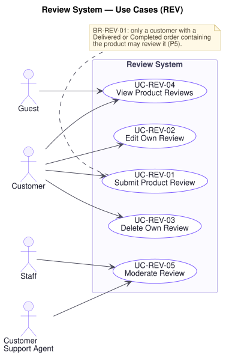

# Review System — Use Cases (`REV`)

**Document type:** Use Case Specification — domain
**Related documents:** [`README.md`](./README.md) (index and template) · [`../srs.md`](../srs.md) · [`../traceability-matrix.md`](../traceability-matrix.md)
**Audience:** Product Management, Engineering, Quality Assurance

---

## Domain Scope

Customer-authored ratings and reviews, the verified-buyer restriction that makes them worth reading, and the moderation that keeps them within policy.

R1 §2 states one rule for this domain in a single line — **"only verified buyers can review products"** — and [`../general-approach.md`](../general-approach.md) cites it as a primary instance of **P5**. It is worth being precise about why. The rule is what separates a review system from a comment box: if anyone can review, ratings become a channel for competitors and paid promotion, and the aggregate rating on every product page stops meaning anything. Enforcing it in the customer application alone leaves the administrative interface and any future client as open doors, so `BR-REV-01` places enforcement at review submission inside the platform.

---

## UC-REV-01 — Submit Product Review

| Field | Value |
|---|---|
| **Primary actor** | Customer |
| **Supporting actors** | — |
| **Stakeholders & interests** | Customer as author: wants to record an experience. Customer as reader: wants ratings that reflect real purchases. Marketing: reviews drive conversion, but only while they are trusted. Trust & Safety: wants the channel closed to non-buyers. Staff: want honest signal about products. |
| **Priority** | Must |
| **Trigger** | Customer submits a rating and review for a product |
| **Preconditions** | The customer is authenticated and email-verified; they hold an order in state **Delivered** or **Completed** containing the product |
| **Success postconditions** | The review is recorded against the customer and product and published; the product's aggregate rating is updated |
| **Failure postconditions** | No review is recorded and the aggregate rating is unchanged |
| **Frequency** | Moderate |
| **Traceability** | `FR-REV-01`, `FR-REV-02`, `FR-REV-03`, `FR-REV-06` · `BR-REV-01`, `BR-REV-02`, `BR-REV-04`, `BR-CUS-02` · `NFR-SEC-01`, `NFR-SEC-04` · P5 |

**Main success scenario**

1. Customer submits a rating, review text, and optionally images.
2. Platform authorises the request and confirms the account is verified (`UC-AUD-03`, `BR-CUS-02`).
3. Platform confirms the customer holds an order in **Delivered** or **Completed** containing the product — the verified-buyer test (`BR-REV-01`).
4. Platform confirms the customer has not already reviewed this product (`BR-REV-02`).
5. Platform validates the rating is within range and the text within the configured length (`NFR-SEC-04`).
6. Platform validates any images against the permitted formats and size limit (`BR-REV-04`).
7. Platform records the review, marks it as from a verified buyer, and publishes it (**[A-08]**).
8. Platform recalculates the product's aggregate rating.

**Alternate flows**

- **A1 — Rating without text** (at step 1): Permitted. A rating alone still contributes to the aggregate, and requiring prose suppresses response volume.
- **A2 — Review of a specific variant** (at step 3): The review is recorded against the variant purchased and shown on the parent product, so a shopper can see which configuration was reviewed.
- **A3 — Prompted after delivery** (at step 1): A notification invites the review once the order is delivered (`UC-NTF-01`), which is when the customer has something to say.
- **A4 — More than one qualifying order** (at step 3): One qualifying order is sufficient; `BR-REV-02` still limits the customer to one review of the product.

**Exception flows**

- **E1 — Customer has not purchased the product** (at step 3): The platform declines and states that only verified buyers may review. **This holds whatever entry point the request arrives through and whatever role the caller holds** — an Administrator cannot author a review for a product they did not buy, because the rule is a property of the platform rather than a convention of the storefront (`BR-REV-01`, `BR-AUD-02`, `P5`).
- **E2 — Order not yet delivered** (at step 3): The platform declines and states that review becomes available after delivery. A review written before receipt cannot be about the goods.
- **E3 — Customer has already reviewed this product** (at step 4): The platform declines and offers to amend the existing review instead (`UC-REV-02`), which is what the customer usually means (`BR-REV-02`).
- **E4 — Rating out of range or text too long** (at step 5): The platform reports the problem and records nothing.
- **E5 — Image rejected** (at step 6): The image is declined with the reason, and the customer is offered the choice of submitting the review without it rather than losing the whole submission (`BR-REV-04`).
- **E6 — Account unverified** (at step 2): The platform declines and offers a verification resend (`UC-CUS-02`, `BR-CUS-02`).
- **E7 — Product removed since purchase** (at step 3): The review is accepted and recorded against the order's product reference, since the customer's experience is real whether or not the product is still sold (`FR-DAT-04`).

**Business rules applied** — `BR-REV-01`, `BR-REV-02`, `BR-REV-04`, `BR-CUS-02`, `BR-AUD-02`.

**Assumptions & open questions** — **[A-08]** assumes reviews publish immediately and are moderated afterwards, rather than held for approval. This is a trade-off between review volume and exposure to policy breaches on the storefront, and requires Product Owner confirmation. **[A-09]** assumes one review per purchased product.

---

## UC-REV-02 — Edit Own Review

| Field | Value |
|---|---|
| **Primary actor** | Customer |
| **Supporting actors** | — |
| **Stakeholders & interests** | Customer as author: wants to revise after longer use — often the most valuable review. Customer as reader: wants to know a review was amended. Trust & Safety: wants an old positive review not silently repurposed. |
| **Priority** | Should |
| **Trigger** | Customer amends their own review |
| **Preconditions** | The review exists, was authored by the acting customer, and is within the edit window |
| **Success postconditions** | The review reflects the amendment; the aggregate rating is recalculated; the review is marked as amended |
| **Failure postconditions** | The review is unchanged |
| **Frequency** | Low |
| **Traceability** | `FR-REV-04` · `BR-REV-01`, `BR-REV-03`, `BR-REV-04`, `BR-AUD-02` · `NFR-SEC-01` |

**Main success scenario**

1. Customer amends the rating, text, or images of their review.
2. Platform authorises and confirms the acting customer is the author (`BR-AUD-02`).
3. Platform confirms the review is within the edit window (`BR-REV-03`, **[A-09]**).
4. Platform validates the amended content (`NFR-SEC-04`, `BR-REV-04`).
5. Platform stores the amendment and marks the review as amended with its amendment date.
6. Platform recalculates the product's aggregate rating where the rating changed.

**Alternate flows**

- **A1 — Rating changed** (at step 6): The aggregate is recalculated. Where it was not changed, recalculation is skipped.
- **A2 — Images added or removed** (at step 4): Validated as at submission (`BR-REV-04`).
- **A3 — Amended by a moderator** (at step 2): A moderator does not amend a customer's words. They hide or remove the review instead (`UC-REV-05`), so that no review misattributes an opinion to its author.

**Exception flows**

- **E1 — Edit window has passed** (at step 3): The platform declines and states when it closed. An unbounded edit window lets a favourable review be rewritten long after it has accrued visibility, which is a known abuse channel (`BR-REV-03`).
- **E2 — Review authored by another customer** (at step 2): The platform declines and records the attempt (`BR-AUD-02`, `P16`).
- **E3 — Review has been removed by a moderator** (at step 2): The platform declines and states the review is no longer available, so a removed review cannot be edited back into visibility.
- **E4 — Amended content fails validation** (at step 4): The original stands unchanged; a failed amendment never destroys the existing review.

**Business rules applied** — `BR-REV-01`, `BR-REV-03`, `BR-REV-04`, `BR-AUD-02`.

---

## UC-REV-03 — Delete Own Review

| Field | Value |
|---|---|
| **Primary actor** | Customer |
| **Supporting actors** | — |
| **Stakeholders & interests** | Customer as author: wants to withdraw an opinion. Customer as reader: wants the aggregate to reflect only live reviews. Legal/Compliance: wants withdrawal honoured. |
| **Priority** | Should |
| **Trigger** | Customer deletes their own review |
| **Preconditions** | The review exists and was authored by the acting customer |
| **Success postconditions** | The review is no longer displayed and no longer contributes to the aggregate rating |
| **Failure postconditions** | The review remains as it was |
| **Frequency** | Low |
| **Traceability** | `FR-REV-05` · `BR-REV-03`, `BR-AUD-02` · `NFR-SEC-01` |

**Main success scenario**

1. Customer deletes their review.
2. Platform authorises and confirms the acting customer is the author (`BR-AUD-02`).
3. Platform withdraws the review from display.
4. Platform recalculates the product's aggregate rating without it.
5. Platform confirms the deletion.

**Alternate flows**

- **A1 — Deleted then re-reviewed** (at step 5): Deleting releases the one-review-per-product limit, so the customer may submit a new review (`BR-REV-02`). This is the intended route for a customer who wants to start over rather than amend.
- **A2 — Account deleted** (at step 1): The customer's reviews are withdrawn with the account.

**Exception flows**

- **E1 — Review authored by another customer** (at step 2): The platform declines and records the attempt (`P16`).
- **E2 — Review already deleted** (at step 3): The platform reports success; the customer's goal already holds.
- **E3 — Aggregate recalculation fails** (at step 4): The review is still withdrawn from display — the customer's request is honoured — and recalculation is retried (`NFR-REL-04`). A briefly stale aggregate is preferable to a review the author has withdrawn remaining visible.

**Business rules applied** — `BR-REV-02`, `BR-REV-03`, `BR-AUD-02`.

**Assumptions & open questions** — Whether a deleted review is retained internally for moderation history is not specified by R1. This matters where a review is deleted by its author immediately after a moderation complaint, and requires a Product Owner and Legal decision.

---

## UC-REV-04 — View Product Reviews

| Field | Value |
|---|---|
| **Primary actor** | Guest |
| **Supporting actors** | Customer |
| **Stakeholders & interests** | Guest and Customer as readers: reviews are often the deciding input to a purchase. Marketing: review quality drives conversion. Staff: want product feedback visible. |
| **Priority** | Must |
| **Trigger** | Visitor opens a product's reviews |
| **Preconditions** | The product exists |
| **Success postconditions** | Published reviews and the aggregate rating are presented; no state changes |
| **Failure postconditions** | The section is omitted; the product page is presented in full |
| **Frequency** | Very high |
| **Traceability** | `FR-REV-07`, `FR-CAT-04` · `BR-REV-01` · `NFR-PERF-01`, `NFR-AVAIL-02` · P11 |

**Main success scenario**

1. Visitor opens a product (`UC-CAT-03`) or its reviews.
2. Platform retrieves the product's published reviews and its aggregate rating.
3. Platform excludes reviews hidden or removed by moderation (`UC-REV-05`).
4. Platform presents the aggregate rating, the distribution across rating values, and a paginated list of reviews.
5. Each review shows its rating, text, images, date, whether it was amended, and that its author is a verified buyer (`BR-REV-01`).

**Alternate flows**

- **A1 — Sorted or filtered** (at step 4): The visitor sorts by most recent or most helpful, or filters to a rating value — commonly the lowest, which is what a careful buyer looks for first.
- **A2 — No reviews yet** (at step 4): The platform says so plainly and, for a verified buyer, invites a review (`UC-REV-01`).
- **A3 — Reviews across variants** (at step 2): Reviews of every variant are shown on the parent product, each identifying the variant reviewed (`UC-REV-01`, A2).

**Exception flows**

- **E1 — Reviews unavailable** (at step 2): The section is omitted and the product page presented in full (`NFR-AVAIL-02`). A review outage never closes the purchase path.
- **E2 — Aggregate rating stale** (at step 4): It may briefly lag a recent submission. This is acceptable for a read; no purchasing decision the platform makes depends on it.
- **E3 — Product unpublished** (at step 1): Reviews are not presented independently of a product that is no longer sold.

**Business rules applied** — `BR-REV-01`, `BR-CAT-02`.

---

## UC-REV-05 — Moderate Review

| Field | Value |
|---|---|
| **Primary actor** | Customer Support Agent |
| **Supporting actors** | Staff, Administrator |
| **Stakeholders & interests** | Customer as reader: wants reviews free of abuse and spam. Customer as author: wants not to be silenced arbitrarily. Legal/Compliance: wants unlawful content removed and every removal attributable (`P17`). Marketing: wants the channel trusted. |
| **Priority** | Should |
| **Trigger** | A review is reported, or a moderator identifies one breaching policy |
| **Preconditions** | The actor holds a role permitting moderation (`UC-AUD-03`) |
| **Success postconditions** | The review is hidden or removed; the aggregate rating is recalculated; an audit entry records who moderated it and why |
| **Failure postconditions** | The review remains published unchanged |
| **Frequency** | Low |
| **Traceability** | `FR-REV-08`, `FR-ADM-07`, `FR-AUD-01` · `BR-REV-03`, `BR-AUD-01`, `BR-AUD-02` · `NFR-OBS-01`, `NFR-SEC-01` · P16, P17 |

**Main success scenario**

1. A review is reported by a visitor, or a moderator identifies it.
2. Platform authorises the request against the actor's role (`UC-AUD-03`).
3. Moderator reviews the content against policy.
4. Moderator hides or removes it, recording the policy breached as the reason.
5. Platform withdraws it from display and recalculates the aggregate rating without it.
6. Platform records an audit entry with the actor, the review, the action, and the reason (`UC-AUD-01`).
7. Platform notifies the author that their review was moderated and why (`UC-NTF-01`).

**Alternate flows**

- **A1 — Report dismissed** (at step 4): The review does not breach policy. It stays published and the dismissal is recorded, so that repeated reports against the same review show a pattern.
- **A2 — Review reinstated** (at step 4): A moderation decision is reversed. The review returns to display, the aggregate is recalculated, and both decisions remain in the audit trail (`BR-AUD-01`).
- **A3 — Author's other reviews examined** (at step 3): A confirmed breach prompts examination of the author's other reviews, since abuse is rarely isolated.
- **A4 — Removed for unlawful content** (at step 4): Removed rather than hidden, and escalated to Legal.

**Exception flows**

- **E1 — Actor lacks authority** (at step 2): The platform declines and records the attempt. Moderation is the authority to suppress a customer's published words and is restricted accordingly (`P16`).
- **E2 — Review already moderated** (at step 4): The platform presents the existing decision rather than applying a second, so the audit trail records one decision per action.
- **E3 — Reason not supplied** (at step 4): The platform declines. A removal without a recorded reason cannot be defended to the author, to Legal, or to an auditor (`BR-AUD-01`, `P17`).
- **E4 — Author deletes the review during moderation** (at step 4): The moderation decision is still recorded against the deleted review, so that the author's conduct remains visible even though the content is gone.
- **E5 — Audit entry cannot be written** (at step 6): **The moderation is not applied.** Nothing external has yet happened, so refusing is safe — and an unattributable suppression of a customer's words is precisely what `P17` forbids (`BR-AUD-01`). This follows `UC-INV-04`, E4 rather than `UC-PAY-06`, E7.
- **E6 — Notification to the author fails** (at step 7): The moderation **stands** and the notification is retried (`BR-NTF-01`). Content breaching policy is not restored because a message failed.

**Business rules applied** — `BR-REV-03`, `BR-AUD-01`, `BR-AUD-02`.

**Assumptions & open questions** — R1 does not define the review content policy itself. Moderation cannot be consistent without one, and drafting it is a Product Owner and Legal responsibility outside this specification. Whether an author may appeal a moderation decision is likewise unstated.
