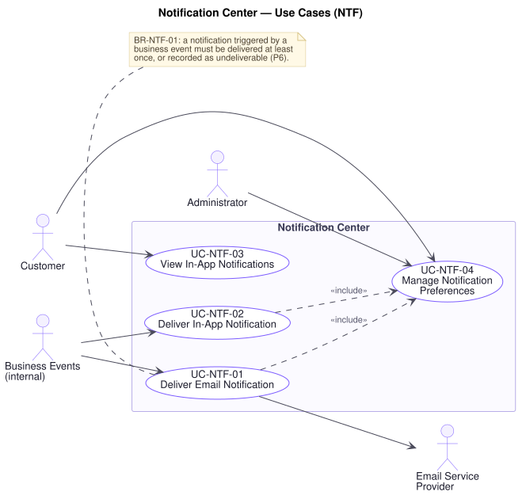

# Notification Center — Use Cases (`NTF`)

**Related documents:** [`README.md`](./README.md) (index and template) · [`../srs.md`](../srs.md) · [`../traceability-matrix.md`](../traceability-matrix.md)

---

## Domain Scope

Telling people what happened: email and in-app delivery of notifications raised by business events, the preferences that govern them, and the record of whether they arrived.

This domain exists to solve **P6** — business-critical events must never silently disappear between systems. A customer who never receives an order confirmation has no way to know whether their order exists, and the business has no way to know they did not know. `BR-NTF-01` therefore requires every notification raised by a business event to be **delivered at least once or recorded as undeliverable**. Silently dropping one is not a permitted outcome, because the failure is invisible from every direction at once.

The second principle running through this domain: **a notification failure never reverses the thing it was reporting.** An order stands whether or not its confirmation email is sent. Several exception flows elsewhere in this specification depend on that rule, and it is stated here once.

---

## UC-NTF-01 — Deliver Email Notification

| Field | Value |
|---|---|
| **Primary actor** | Business event (internal) |
| **Supporting actors** | Email Service Provider, Customer |
| **Stakeholders & interests** | Customer: needs to know their order exists, was paid for, and is on its way. Support: every notification not delivered becomes a contact. Finance: undelivered refund notices become disputes. Marketing: owns the promotional channel and its reputation. |
| **Priority** | Must |
| **Trigger** | A business event raises a notification — order created, payment succeeded, shipment updated, refund issued, promotion announced |
| **Preconditions** | The event names a recipient with a registered email address |
| **Success postconditions** | The message is accepted by the provider and the outcome recorded against the notification |
| **Failure postconditions** | The notification is recorded as **pending** and retried, or as **undeliverable** once attempts are exhausted. It is never silently dropped |
| **Frequency** | Very high |
| **Traceability** | `FR-NTF-01`, `FR-NTF-03`, `FR-NTF-06` · `BR-NTF-01`, `BR-NTF-02` · `NFR-REL-04`, `NFR-REL-06`, `NFR-SEC-07`, `NFR-AVAIL-03` · P6, P3 |

**Main success scenario**

1. A business event raises a notification for a recipient (`FR-NTF-03`).
2. Platform records the notification before attempting delivery, so that no notification exists only in flight (`BR-NTF-01`).
3. Platform confirms the recipient's preferences permit this notification on this channel (`UC-NTF-04`, `BR-NTF-02`).
4. Platform composes the message from the event, including no credential, payment instrument detail, or token (`NFR-SEC-07`).
5. Platform submits it to the email service provider.
6. Platform records the provider's acceptance against the notification (`FR-NTF-06`).

**Alternate flows**

- **A1 — Transactional notification** (at step 3): Order, payment, shipment, and refund notifications concerning the recipient's own transactions are sent regardless of promotional preferences (`BR-NTF-02`). A customer cannot opt out of being told their order exists.
- **A2 — Promotional notification** (at step 3): Sent only where the recipient has not opted out.
- **A3 — Batched** (at step 5): Several updates for one recipient within a short window are combined, so that a multi-shipment order does not generate a flurry.
- **A4 — Recipient is not a customer** (at step 1): A notification to Staff or an Administrator — an operational alert — follows the same path.

**Exception flows**

- **E1 — Provider rejects the message** (at step 5): The notification is recorded as **failed** and retried with backoff (`NFR-REL-04`). After the configured attempts it is recorded **undeliverable** and surfaced operationally. It is never marked delivered (`BR-NTF-01`).
- **E2 — Provider unreachable** (at step 5): The notification stays **pending** and is retried. Because step 2 precedes step 5, nothing is lost to a provider outage (`NFR-AVAIL-03`).
- **E3 — Address rejected as invalid or bouncing** (at step 5): Recorded undeliverable and the customer's address flagged for correction. Repeated bounces suppress further sending to that address, so provider reputation is not spent on a dead one.
- **E4 — Event raised more than once** (at step 2): The platform recognises the event and sends one notification. Duplicate confirmations for one order teach customers to distrust the channel (`NFR-REL-04`).
- **E5 — Recipient has no registered address** (at step 1): Recorded undeliverable with the reason. It is not discarded, since the absence is itself worth surfacing.
- **E6 — Notification cannot be recorded** (at step 2): No delivery is attempted. A message sent with no record of it is one nobody can later confirm was sent (`P6`).
- **E7 — Composition fails** (at step 4): Recorded as failed and escalated. **The business event it reports is unaffected** — an order is never reversed because its confirmation could not be composed (`UC-ORD-05`, E9).

**Business rules applied** — `BR-NTF-01`, `BR-NTF-02`.

**Assumptions & open questions** — The number of retry attempts and their spacing before a notification is declared undeliverable are not specified by R1 and require confirmation.

---

## UC-NTF-02 — Deliver In-App Notification

| Field | Value |
|---|---|
| **Primary actor** | Business event (internal) |
| **Supporting actors** | Customer |
| **Stakeholders & interests** | Customer: wants updates where they are already looking, without searching their inbox. Support: an in-app history answers "was I told?" definitively. Marketing: a channel that does not depend on email deliverability. |
| **Priority** | Must |
| **Trigger** | A business event raises a notification for an authenticated customer |
| **Preconditions** | The event names a recipient with an account |
| **Success postconditions** | The notification is recorded against the customer and visible in their notification list |
| **Failure postconditions** | The notification is recorded as pending and retried; it is never silently dropped |
| **Frequency** | Very high |
| **Traceability** | `FR-NTF-02`, `FR-NTF-03` · `BR-NTF-01`, `BR-NTF-02`, `BR-AUD-02` · `NFR-REL-06`, `NFR-SEC-01` · P6 |

**Main success scenario**

1. A business event raises a notification for a customer (`FR-NTF-03`).
2. Platform records it against the recipient's account, unread (`BR-NTF-01`).
3. Platform confirms preferences permit this notification on this channel (`BR-NTF-02`).
4. Platform makes it visible in the customer's notification list (`UC-NTF-03`).

**Alternate flows**

- **A1 — Both channels** (at step 1): The same event raises an email and an in-app notification. Each is recorded and delivered independently, so a failure on one does not suppress the other.
- **A2 — Customer not currently signed in** (at step 4): The notification waits in the list. In-app delivery does not depend on presence, which is why it is a reliable record where email is not.
- **A3 — Related to an order** (at step 2): The notification links to the order, so the customer can act on it directly (`UC-ORD-06`).

**Exception flows**

- **E1 — Recording fails** (at step 2): Retried (`NFR-REL-04`). The business event it reports is unaffected (`UC-ORD-05`, E9).
- **E2 — Event raised more than once** (at step 2): Recorded once (`UC-NTF-01`, E4).
- **E3 — Account suspended or deleted** (at step 2): Recorded undeliverable with the reason rather than discarded.
- **E4 — Notification requested for another customer's account** (at step 2): Refused and recorded. In-app notifications are scoped to their recipient absolutely (`BR-AUD-02`, `P16`).

**Business rules applied** — `BR-NTF-01`, `BR-NTF-02`, `BR-AUD-02`.

---

## UC-NTF-03 — View In-App Notifications

| Field | Value |
|---|---|
| **Primary actor** | Customer |
| **Stakeholders & interests** | Customer: wants a single place showing what has happened to their orders. Support: needs to confirm what a customer was told and when. |
| **Priority** | Must |
| **Trigger** | Customer opens their notifications |
| **Preconditions** | An authenticated session exists |
| **Success postconditions** | The customer's notifications are presented, most recent first, with unread ones distinguished |
| **Failure postconditions** | Nothing is disclosed |
| **Frequency** | High |
| **Traceability** | `FR-NTF-04` · `BR-AUD-02` · `NFR-PERF-01`, `NFR-SEC-01` · P16 |

**Main success scenario**

1. Customer opens their notifications.
2. Platform authorises and scopes the request to the acting customer (`UC-AUD-03`, `BR-AUD-02`).
3. Platform retrieves their notifications, most recent first, paginated.
4. Platform presents each with its subject, time, and read state, distinguishing unread.
5. Customer opens one, which marks it read and follows it to the order or product it concerns.

**Alternate flows**

- **A1 — Mark all as read** (at step 5): Every unread notification is marked read in one action.
- **A2 — Mark as unread** (at step 5): A read notification is restored to unread, so a customer can keep something to hand.
- **A3 — Filtered** (at step 3): Narrowed to unread, or to a category such as orders or promotions.
- **A4 — Dismissed** (at step 5): Removed from the list. Delivery remains recorded, so Support can still confirm the customer was told (`BR-NTF-01`).

**Exception flows**

- **E1 — No notifications** (at step 4): The platform presents an empty list explicitly rather than an error.
- **E2 — Another customer's notifications requested** (at step 2): Declined and recorded. Notifications reveal order history and are scoped absolutely (`P16`).
- **E3 — Marking as read fails** (at step 5): The notification content is still presented — the customer's goal is met — and the state change retried. A read-state failure never withholds the message.
- **E4 — Notification references a deleted order or product** (at step 5): Presented with its recorded text; following it reports that the target is no longer available (`FR-DAT-04`).

**Business rules applied** — `BR-NTF-01`, `BR-AUD-02`.

---

## UC-NTF-04 — Manage Notification Preferences

| Field | Value |
|---|---|
| **Primary actor** | Customer |
| **Supporting actors** | Administrator |
| **Stakeholders & interests** | Customer: wants control over promotional contact but not to lose transactional updates. Legal/Compliance: wants opt-out honoured promptly and demonstrably. Marketing: wants the channel preserved by not over-sending. Support: wants "I opted out and still received it" not to arise. |
| **Priority** | Should |
| **Trigger** | Customer changes their notification preferences |
| **Preconditions** | An authenticated session exists, or a valid unsubscribe link is followed |
| **Success postconditions** | Preferences reflect the change and are honoured from the next notification onward |
| **Failure postconditions** | Preferences are unchanged and the customer is told the change did not apply |
| **Frequency** | Low |
| **Traceability** | `FR-NTF-05` · `BR-NTF-02`, `BR-CUS-03`, `BR-AUD-02` · `NFR-SEC-01` · P16 |

**Main success scenario**

1. Customer opens their notification preferences.
2. Platform authorises and scopes the request (`BR-AUD-02`).
3. Platform presents the promotional categories per channel, marking transactional notifications as **not optional** and explaining why (`BR-NTF-02`).
4. Customer opts in or out per category and channel.
5. Platform stores the preferences.
6. Platform confirms, and applies them from the next notification raised (`UC-NTF-01`, step 3).

**Alternate flows**

- **A1 — Unsubscribe link followed** (at step 1): The customer unsubscribes from an email without signing in, using a single-use token identifying them and the category (`BR-CUS-03`). Requiring a login to unsubscribe is a compliance risk and a customer-experience failure.
- **A2 — Opt out of everything promotional** (at step 4): One action opting out of every promotional category on every channel.
- **A3 — Administrator disables a category** (at step 4): Suspends a promotional category platform-wide, for a campaign being withdrawn. Transactional categories cannot be disabled this way (`BR-NTF-02`).

**Exception flows**

- **E1 — Opting out of transactional notifications attempted** (at step 4): The platform declines and explains that order, payment, and shipment notifications concerning the customer's own transactions cannot be disabled (`BR-NTF-02`). A customer who does not know their order shipped will contact Support, and one who does not know they were refunded may dispute the charge.
- **E2 — Unsubscribe token expired or consumed** (at step 1, A1): The platform declines and offers signing in to manage preferences. The customer is never left with no route to opt out.
- **E3 — Storing preferences fails** (at step 5): Nothing changes and the customer is told the change did not apply. A silent failure here means unwanted mail continues while the customer believes it has stopped — a compliance exposure as much as an annoyance.
- **E4 — Notification already in flight when preferences change** (at step 6): It may still be delivered. Preferences are evaluated when a notification is raised, and the platform does not claim retrospective effect.
- **E5 — Another customer's preferences requested** (at step 2): Declined and recorded (`P16`).

**Business rules applied** — `BR-NTF-01`, `BR-NTF-02`, `BR-CUS-03`, `BR-AUD-02`.

**Assumptions & open questions** — R1 §2 lists Promotion among notification events but does not state whether promotional email requires prior consent. This specification assumes opt-out; jurisdictions requiring opt-in would change `FR-NTF-05`, and the position requires Product Owner and Legal confirmation.
