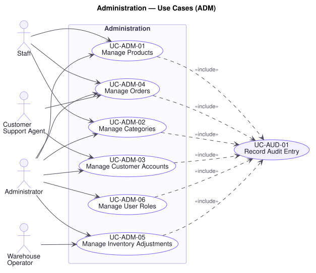

# Administration — Use Cases (`ADM`)

**Related documents:** [`README.md`](./README.md) (index and template) · [`../srs.md`](../srs.md) · [`../traceability-matrix.md`](../traceability-matrix.md)

---

## Domain Scope

The operational management of the platform by the people who run the business: catalog and category maintenance, customer account administration, order intervention, inventory administration, and role management.

This domain is where **P16** and **P17** are decided in practice. Every use case below is an authority to change something that has financial consequence — a price, an account's status, an order's state, a person's permissions — and every one of them is audited without exception. Two properties run through all of them:

- **Administration is not a bypass.** `BR-AUD-02` requires the same authorisation decision whatever entry point a request arrives through, and `BR-ORD-01` and `BR-INV-01` hold identically here. An Administrator cannot move an order through an illegal transition or drive stock negative simply because the request originates from an administrative interface. **P5** exists precisely because the second entry point is where rules get skipped.
- **Every change is attributable.** `BR-AUD-01` makes the audit entry a precondition of the change, not a by-product of it. `UC-AUD-01` is included by every use case here.

---

## UC-ADM-01 — Manage Products

| Field | Value |
|---|---|
| **Primary actor** | Staff |
| **Supporting actors** | Administrator |
| **Stakeholders & interests** | Staff: need to maintain the catalog without a release. Finance: a price change is a direct revenue lever and must be attributable (`P17`). Customer: wants the price shown to be the price charged. Warehouse: needs SKUs stable. |
| **Priority** | Must |
| **Trigger** | Staff creates, amends, publishes, unpublishes, or reprices a product or variant |
| **Preconditions** | The actor holds a role permitting product management (`UC-AUD-03`) |
| **Success postconditions** | The catalog reflects the change; an audit entry records the actor, the before and after values, and the time |
| **Failure postconditions** | The catalog is unchanged and no audit entry is written |
| **Frequency** | High |
| **Traceability** | `FR-ADM-01`, `FR-CAT-01`, `FR-CAT-02`, `FR-AUD-01`, `FR-AUD-02` · `BR-CAT-01`, `BR-CAT-02`, `BR-AUD-01`, `BR-AUD-02`, `BR-ORD-06` · `NFR-SEC-01`, `NFR-OBS-01` · P16, P17 |

**Main success scenario**

1. Actor creates or opens a product and amends its attributes, images, categories, brand, variants, or price.
2. Platform authorises the request against the actor's role (`UC-AUD-03`).
3. Platform validates the submission, including SKU uniqueness across the catalog (`BR-CAT-01`, `NFR-SEC-04`).
4. Platform applies the change.
5. Platform records an audit entry with the before and after values (`UC-AUD-01`, `FR-AUD-02`).
6. Platform propagates the change to catalog and search reads (`UC-SCH-01`, E3).

**Alternate flows**

- **A1 — Price changed** (at step 4): Audited as a **price change** specifically, since R1 §6 names it as a traceable action. Carts re-price on next display (`BR-CRT-04`); **orders already placed are unaffected** (`BR-ORD-06`).
- **A2 — Published** (at step 4): The product becomes visible to browsing and search (`BR-CAT-02`).
- **A3 — Unpublished** (at step 4): It disappears from browsing, search, and new cart additions, but remains fully visible on orders that contain it (`FR-DAT-04`). Existing cart lines are marked unpurchasable rather than removed (`UC-CRT-04`, E3).
- **A4 — Variant added or removed** (at step 4): A removed variant's SKU is not reused (`BR-CAT-01`), so historic orders remain unambiguous.
- **A5 — Bulk amendment** (at step 1): Applied per product, each audited individually. One rejection does not fail the batch.

**Exception flows**

- **E1 — SKU already in use** (at step 3): Declined and the conflict named. A duplicated SKU makes an order line ambiguous about what was actually sold (`BR-CAT-01`).
- **E2 — Actor lacks authority** (at step 2): Declined and the attempt recorded. Repricing is a direct financial control and is exactly the case `P16` describes — "a customer who can alter a product's price."
- **E3 — Product has stock or open orders and removal is attempted** (at step 4): The platform declines removal and offers unpublishing instead, which achieves the commercial intent without breaking fulfilment or history.
- **E4 — Validation fails** (at step 3): Nothing is applied. The submission is applied whole or not at all.
- **E5 — Audit entry cannot be written** (at step 5): **The change is not applied.** Nothing external has happened, so refusing is safe, and an unattributable price change is what `P17` forbids (`BR-AUD-01`).
- **E6 — Propagation to search fails** (at step 6): The change **stands** and propagation is retried. Search may briefly lag the catalog (`UC-SCH-01`, E3); this is the deliberate freshness trade-off `P4` records.

**Business rules applied** — `BR-CAT-01`, `BR-CAT-02`, `BR-ORD-06`, `BR-AUD-01`, `BR-AUD-02`.

---

## UC-ADM-02 — Manage Categories

| Field | Value |
|---|---|
| **Primary actor** | Staff |
| **Supporting actors** | Administrator |
| **Stakeholders & interests** | Staff: need to restructure merchandising as the range changes. Marketing: category structure drives discovery (`P11`). Customer: wants navigation that does not break under them. |
| **Priority** | Must |
| **Trigger** | Staff creates, amends, moves, or removes a category |
| **Preconditions** | The actor holds a role permitting category management |
| **Success postconditions** | The tree reflects the change; products remain reachable; an audit entry is recorded |
| **Failure postconditions** | The tree is unchanged |
| **Frequency** | Low |
| **Traceability** | `FR-ADM-02`, `FR-CAT-05`, `FR-CAT-06`, `FR-AUD-01` · `BR-CAT-03`, `BR-AUD-01`, `BR-AUD-02` · `NFR-SEC-01` · P11, P17 |

**Main success scenario**

1. Actor creates a category, or amends its name, image, parent, ordering, or featured status.
2. Platform authorises the request (`UC-AUD-03`).
3. Platform validates the change, confirming no category becomes its own ancestor (`BR-CAT-03`).
4. Platform applies the change.
5. Platform records an audit entry (`UC-AUD-01`).

**Alternate flows**

- **A1 — Moved to a new parent** (at step 4): Its descendants move with it. Products remain associated and reachable at their new position.
- **A2 — Marked featured** (at step 4): It appears in the featured collection (`UC-CAT-05`).
- **A3 — Removed after reassignment** (at step 4): Its products and child categories are reassigned first, then it is removed (`BR-CAT-03`).
- **A4 — Reordered** (at step 4): The presentation order changes; no product association is affected.

**Exception flows**

- **E1 — Change would create a cycle** (at step 3): Declined. A category that is its own ancestor makes the tree infinitely deep and navigation non-terminating (`BR-CAT-03`).
- **E2 — Removal attempted while it holds products or children** (at step 4): Declined, with the count of what must be reassigned. Removing it would strand those products outside navigation, where `P11` says they stop selling.
- **E3 — Actor lacks authority** (at step 2): Declined and recorded.
- **E4 — Audit entry cannot be written** (at step 5): The change is not applied (`UC-ADM-01`, E5).

**Business rules applied** — `BR-CAT-02`, `BR-CAT-03`, `BR-AUD-01`, `BR-AUD-02`.

---

## UC-ADM-03 — Manage Customer Accounts

| Field | Value |
|---|---|
| **Primary actor** | Customer Support Agent |
| **Supporting actors** | Administrator |
| **Stakeholders & interests** | Support: needs to see enough to help and no more. Customer: wants their data seen only where there is a reason. Legal/Compliance: access to customer data is a regulated exposure (`P16`). Trust & Safety: needs to suspend accounts implicated in fraud. |
| **Priority** | Must |
| **Trigger** | An agent opens, suspends, or reinstates a customer account |
| **Preconditions** | The actor holds a role permitting customer administration |
| **Success postconditions** | The account reflects the change; an audit entry records who acted and why |
| **Failure postconditions** | The account is unchanged |
| **Frequency** | Low to moderate |
| **Traceability** | `FR-ADM-03`, `FR-AUD-01`, `FR-AUD-02` · `BR-AUD-01`, `BR-AUD-02`, `BR-CUS-03` · `NFR-SEC-01`, `NFR-SEC-07` · P16, P17 |

**Main success scenario**

1. Actor locates a customer account and opens it.
2. Platform authorises the request (`UC-AUD-03`).
3. Platform presents the account's profile, addresses, and order history, **excluding credentials and payment instrument details** (`NFR-SEC-07`).
4. Actor suspends or reinstates the account, recording a reason.
5. Platform applies the change and, on suspension, invalidates every session (`BR-CUS-03`).
6. Platform records an audit entry with the actor, the account, the action, and the reason (`UC-AUD-01`).
7. Platform notifies the customer where the change affects their access (`UC-NTF-01`).

**Alternate flows**

- **A1 — Read-only inspection** (at step 3): The agent views without changing. **The access itself is audited**, because "who looked at this customer's data" is as much a compliance question as "who changed it" (`P17`).
- **A2 — Account reinstated** (at step 4): Access is restored; the customer must authenticate again (`BR-CUS-03`).
- **A3 — Profile corrected on request** (at step 4): The agent corrects a detail at the customer's request. The correction and its basis are recorded.
- **A4 — Account deleted at the customer's request** (at step 4): The account is closed. Orders are retained as financial records with the customer reference preserved (`FR-DAT-04`, `FR-DAT-05`).

**Exception flows**

- **E1 — Actor lacks authority** (at step 2): Declined and the attempt recorded. This is `P16`'s "a support agent who can access data outside their responsibility."
- **E2 — Credentials requested** (at step 3): Never disclosed to any role. Passwords exist only as one-way hashes and are not retrievable (`NFR-SEC-02`, `NFR-SEC-07`).
- **E3 — Reason not supplied for a suspension** (at step 4): Declined. A suspension without a recorded reason cannot be justified to the customer or to an auditor (`BR-AUD-01`).
- **E4 — Account has open orders** (at step 5): Suspension proceeds and access is blocked, but **open orders continue to be fulfilled or are resolved deliberately**. The platform does not abandon a paid order because an account was suspended (`P7`).
- **E5 — Audit entry cannot be written** (at step 6): The change is not applied (`UC-ADM-01`, E5).

**Business rules applied** — `BR-CUS-03`, `BR-AUD-01`, `BR-AUD-02`.

---

## UC-ADM-04 — Manage Orders

| Field | Value |
|---|---|
| **Primary actor** | Staff |
| **Supporting actors** | Customer Support Agent, Administrator |
| **Stakeholders & interests** | Staff and Warehouse: need to progress orders. Support: needs to intervene on a customer's behalf. Finance: needs every intervention attributable. Customer: needs their order handled without their agreement being rewritten. |
| **Priority** | Must |
| **Trigger** | An actor searches, inspects, or acts on orders |
| **Preconditions** | The actor holds a role permitting order administration |
| **Success postconditions** | The requested orders are presented; any action taken is applied within the limits of the actor's role and audited |
| **Failure postconditions** | No order changes |
| **Frequency** | Very high |
| **Traceability** | `FR-ADM-04`, `FR-ORD-11`, `FR-ORD-12`, `FR-ORD-16`, `FR-AUD-01` · `BR-ORD-01`, `BR-ORD-06`, `BR-AUD-01`, `BR-AUD-02` · `NFR-SEC-01` · P5, P16, P17 |

**Main success scenario**

1. Actor searches orders by customer, state, date, or reference.
2. Platform authorises the request against the actor's role (`UC-AUD-03`).
3. Platform presents matching orders with their current states.
4. Actor opens one and inspects it in full (`UC-ORD-06`).
5. Actor takes an action the order's state and their role permit — advance (`UC-ORD-10`), cancel (`UC-ORD-08`), accept a return (`UC-ORD-09`), or refund (`UC-PAY-06`).
6. Platform applies the action under the same rules that govern it anywhere else (`BR-ORD-01`).
7. Platform records an audit entry (`UC-AUD-01`).

**Alternate flows**

- **A1 — Support acts for a customer** (at step 5): The action is recorded against the **agent**, with the customer as its subject, so that "the customer cancelled" and "an agent cancelled for the customer" remain distinguishable (`P17`).
- **A2 — Bulk state advance** (at step 5): Several orders advance together, each evaluated and applied independently (`UC-ORD-10`, A4).
- **A3 — Order flagged for investigation** (at step 5): Flagged without changing its state, so that fulfilment can be paused pending review.
- **A4 — Exported for reconciliation** (at step 3): A filtered set is exported (`UC-RPT-06`), and the export itself is audited.

**Exception flows**

- **E1 — Requested transition is not legal** (at step 6): Declined, with the current state and available transitions stated. **This holds for every role including Administrator** — the state machine is a property of the platform, not a convention of the storefront. An administrative interface that could skip transitions would be exactly the loophole `P5` describes (`BR-ORD-01`).
- **E2 — Actor lacks authority for the action** (at step 5): Declined and recorded. Viewing an order, cancelling it, and refunding it are separate authorities (`P16`).
- **E3 — Amendment of a placed order's contents or total attempted** (at step 5): Declined. Once an order reaches Paid its commercial terms are fixed; the remedies are cancellation, return, and refund, each of which leaves a record (`BR-ORD-06`, `P17`).
- **E4 — Order changes while being inspected** (at step 6): The action is re-evaluated against the current state and declines as E1 if no longer legal (`UC-ORD-10`, E5).
- **E5 — Audit entry cannot be written** (at step 7): The action is not applied, except where it has already moved money externally (`UC-PAY-06`, E7).

**Business rules applied** — `BR-ORD-01`, `BR-ORD-04`, `BR-ORD-05`, `BR-ORD-06`, `BR-AUD-01`, `BR-AUD-02`.

---

## UC-ADM-05 — Manage Inventory Adjustments

| Field | Value |
|---|---|
| **Primary actor** | Warehouse Operator |
| **Supporting actors** | Administrator |
| **Stakeholders & interests** | Warehouse: needs the record to match the shelf. Finance: needs shrinkage visible rather than absorbed, and every adjustment attributable (`P17`). Customer: availability depends on it being right. |
| **Priority** | Must |
| **Trigger** | An operator records an adjustment or reviews adjustment history |
| **Preconditions** | The actor holds a role permitting inventory management |
| **Success postconditions** | The adjustment is applied and audited, or the history is presented |
| **Failure postconditions** | Stock is unchanged |
| **Frequency** | Moderate |
| **Traceability** | `FR-ADM-05`, `FR-INV-05`, `FR-INV-06`, `FR-AUD-01`, `FR-AUD-02` · `BR-INV-01`, `BR-INV-03`, `BR-AUD-01`, `BR-AUD-02` · `NFR-OBS-01` · P16, P17 |

**Main success scenario**

1. Actor opens inventory administration for a SKU or warehouse.
2. Platform authorises the request (`UC-AUD-03`).
3. Platform presents current stock, reserved, and available quantities (`UC-INV-05`).
4. Actor records an adjustment with a quantity delta and a reason (`UC-INV-04`).
5. Platform applies it and records an audit entry (`UC-AUD-01`).
6. Actor reviews the SKU's adjustment history, each entry showing who adjusted it, by how much, and why.

**Alternate flows**

- **A1 — History reviewed without adjusting** (at step 6): Read-only inspection, which is the ordinary case during a stock reconciliation.
- **A2 — Stock count reconciliation** (at step 4): Several adjustments recorded against one count reference, so the whole count can be examined as a unit afterwards.
- **A3 — Administrator overrides** (at step 4): An Administrator adjusts outside normal warehouse process; the elevated authority is recorded in the audit entry (`P17`).

**Exception flows**

- **E1 — Adjustment would make available stock negative** (at step 5): Declined, with the reserved quantity and the orders holding it stated. Those orders must be resolved first — the record must never say the business holds less than it has already promised (`BR-INV-01`, `UC-INV-04`, E1).
- **E2 — Reason not supplied** (at step 4): Declined (`BR-INV-03`).
- **E3 — Actor lacks authority** (at step 2): Declined and recorded. Inventory adjustment is a direct financial control and a standing internal-fraud risk (`P16`, `P17`).
- **E4 — Audit entry cannot be written** (at step 5): The adjustment is not applied (`UC-INV-04`, E4).

**Business rules applied** — `BR-INV-01`, `BR-INV-03`, `BR-AUD-01`, `BR-AUD-02`.

---

## UC-ADM-06 — Manage User Roles

| Field | Value |
|---|---|
| **Primary actor** | Administrator |
| **Stakeholders & interests** | Administrator: needs to grant people the authority their job requires. Legal/Compliance: role assignment is the control that makes every other control meaningful. Leadership: bears the reputational risk of privilege misuse. Staff: need enough authority to work. |
| **Priority** | Must |
| **Trigger** | Administrator assigns or revokes a role |
| **Preconditions** | The actor holds the Administrator role (`UC-AUD-03`) |
| **Success postconditions** | The user holds the amended set of roles; the change takes effect within one session refresh; an audit entry records it |
| **Failure postconditions** | Roles are unchanged |
| **Frequency** | Low, highest consequence |
| **Traceability** | `FR-ADM-09`, `FR-AUD-05`, `FR-AUD-01`, `FR-AUD-02` · `BR-AUD-01`, `BR-AUD-02`, `BR-AUD-03` · `NFR-SEC-01`, `NFR-SEC-03`, `NFR-OBS-01` · P16, P17 |

**Main success scenario**

1. Administrator locates a user and opens their roles.
2. Platform authorises the request, confirming the actor holds the Administrator role (`UC-AUD-03`).
3. Platform presents the user's current roles and the authority each confers (per [`../srs.md`](../srs.md) §2.3).
4. Administrator assigns or revokes roles, recording a reason.
5. Platform validates the change against the role-management constraints (`BR-AUD-03`).
6. Platform applies it. Revoked authority ceases at the next session refresh at the latest (`UC-CUS-05`, A1).
7. Platform records an audit entry with the actor, the subject, the roles before and after, the reason, and the time (`UC-AUD-01`).
8. Platform notifies the affected user (`UC-NTF-01`).

**Alternate flows**

- **A1 — More than one role** (at step 4): A user holds several; authority is their union.
- **A2 — Immediate revocation** (at step 6): Where the revocation is urgent, the Administrator ends the user's sessions at once rather than waiting for expiry (`BR-CUS-03`), which is the correct response to a suspected compromise.
- **A3 — Role added on a role change within the business** (at step 4): Both the addition and the removal are recorded, so authority does not silently accumulate as people move between jobs.

**Exception flows**

- **E1 — Actor attempts to grant themselves a role they do not hold** (at step 5): Declined and recorded as a security event. Self-elevation would make every other access control decorative (`BR-AUD-03`, `P16`).
- **E2 — Last Administrator role revoked** (at step 5): Declined. A platform with no Administrator cannot be administered, including to undo this change (`BR-AUD-03`).
- **E3 — Actor is not an Administrator** (at step 2): Declined and recorded. Role management is the most consequential authority in the platform.
- **E4 — Reason not supplied** (at step 4): Declined. Privilege changes are the first thing an auditor examines, and "who granted this and why" must be answerable (`BR-AUD-01`, `P17`).
- **E5 — Audit entry cannot be written** (at step 7): **The change is not applied.** An unattributable privilege change is the single most serious gap `P17` describes (`BR-AUD-01`).
- **E6 — User has outstanding work under a revoked role** (at step 6): The revocation proceeds. Authority is not extended for convenience; the outstanding work is reassigned.

**Business rules applied** — `BR-AUD-01`, `BR-AUD-02`, `BR-AUD-03`, `BR-CUS-03`.

**Assumptions & open questions** — Whether the five roles in R1 §9 are sufficient, or whether finer-grained permissions within a role are required, is not settled by R1. The role authority table in [`../srs.md`](../srs.md) §2.3 is this specification's interpretation and needs Product Owner confirmation.
