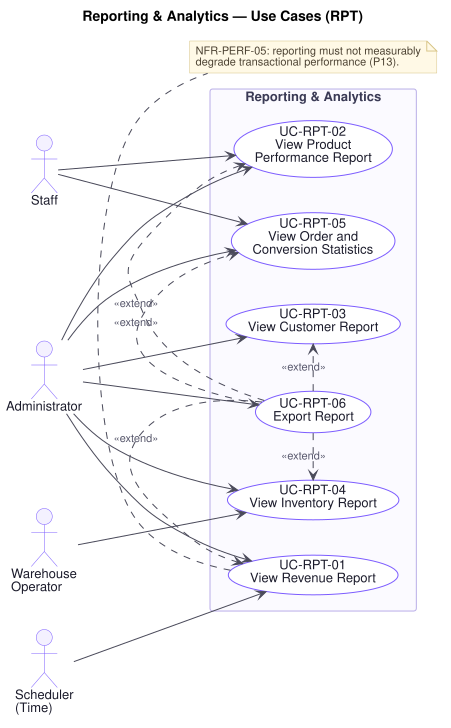

# Reporting & Analytics — Use Cases (`RPT`)

**Document type:** Use Case Specification — domain
**Related documents:** [`README.md`](./README.md) (index and template) · [`../srs.md`](../srs.md) · [`../traceability-matrix.md`](../traceability-matrix.md)
**Audience:** Product Management, Engineering, Quality Assurance

---

## Domain Scope

What the business needs to know about itself: revenue, product performance, customer behaviour, inventory position, and conversion.

R1 §3 states the governing constraint in one line — **"reports should remain responsive even during high transaction volume"** — and [`../general-approach.md`](../general-approach.md) develops it as **P13**: generating this intelligence must never come at the cost of checkout speed for paying customers. The alternative outcomes are both unacceptable. Either the business flies blind because reports were disabled to protect performance, or customers wait at checkout so a dashboard can load. `NFR-PERF-05` states the requirement, and every use case below is bound by it.

Two consequences run through this domain. First, **reporting reads may lag** — up to 5 minutes (**[A-11]**, `NFR-PERF-06`) — and every report must say how current it is, because a figure whose age is unknown cannot be acted on. Second, **`BR-RPT-01` fixes what counts**: revenue counts only orders that reached Paid or beyond, and excludes refunds and returns from the periods in which they occur. Without a single stated basis, two reports of the same period disagree and neither is trusted.

---

## UC-RPT-01 — View Revenue Report

| Field | Value |
|---|---|
| **Primary actor** | Administrator |
| **Supporting actors** | Staff, Scheduler (Time) |
| **Stakeholders & interests** | Leadership: revenue is the primary decision input. Finance: needs a figure that reconciles to what was actually captured. Customers: need checkout not to slow so this report can run (`P13`). |
| **Priority** | Must |
| **Trigger** | An authorised actor opens the revenue report, or it is generated on schedule |
| **Preconditions** | The actor holds a role permitting revenue reporting (`UC-AUD-03`) |
| **Success postconditions** | Revenue for the selected period is presented, with its basis and its currency-as-at time stated |
| **Failure postconditions** | No figure is presented; **no partial or unqualified figure is ever shown** |
| **Frequency** | High |
| **Traceability** | `FR-RPT-01`, `FR-RPT-02`, `FR-ADM-08` · `BR-RPT-01`, `BR-AUD-02` · `NFR-PERF-05`, `NFR-PERF-06`, `NFR-SCAL-05`, `NFR-SEC-01` · P4, P13 |

**Main success scenario**

1. Actor opens the revenue report and selects a period and granularity — daily or monthly (`FR-RPT-01`, `FR-RPT-02`).
2. Platform authorises the request against the actor's role (`UC-AUD-03`, `BR-AUD-02`).
3. Platform computes revenue over the period, counting only orders that reached **Paid** or beyond (`BR-RPT-01`).
4. Platform deducts refunds and returns from the periods in which they occurred, not from the periods of the original orders (`BR-RPT-01`).
5. Platform presents the figures with **the time the underlying data was current** (`NFR-PERF-06`).
6. Platform serves the report without degrading transactional latency (`NFR-PERF-05`, `P13`).

**Alternate flows**

- **A1 — Compared against a prior period** (at step 5): The same period a year or month earlier is presented alongside, computed on the identical basis so the comparison is meaningful.
- **A2 — Broken down** (at step 3): Split by category, payment method, or shipping destination, each subtotal on the same basis and summing to the total.
- **A3 — Generated on schedule** (at step 1): The Scheduler produces the report and distributes it (`UC-NTF-01`); the same basis applies.
- **A4 — Exported** (at step 5): Exported for offline analysis (`UC-RPT-06`), carrying its basis and as-at time with it.

**Exception flows**

- **E1 — Period includes today** (at step 5): The figure is **explicitly marked incomplete** and its as-at time stated. A partial day presented as a whole one produces a false decline every morning.
- **E2 — Reporting data lags** (at step 5): The as-at time is stated. Where the lag exceeds the permitted bound (**[A-11]**), the platform says the figure is stale rather than presenting it as current. A figure of unknown age is worse than an acknowledged gap, because it will be acted on.
- **E3 — Reporting unavailable** (at step 3): The platform reports the failure. **Transactional operations are unaffected** — the separation `P13` requires runs in both directions, so a reporting outage never touches checkout (`NFR-SCAL-05`).
- **E4 — Actor lacks authority** (at step 2): Declined and recorded. Revenue figures are commercially sensitive (`P16`).
- **E5 — Period contains no qualifying orders** (at step 3): Zero is presented explicitly, distinguished from a computation failure. "No revenue" and "we could not compute revenue" are different facts and must never look alike.
- **E6 — Report demand rises during a peak event** (at step 6): Transactional latency targets continue to hold (`NFR-PERF-01`, `NFR-PERF-02`). Under contention **the report waits, not the checkout** — the priority `P13` establishes.

**Business rules applied** — `BR-RPT-01`, `BR-AUD-02`, `BR-ORD-06`.

---

## UC-RPT-02 — View Product Performance Report

| Field | Value |
|---|---|
| **Primary actor** | Staff |
| **Supporting actors** | Administrator |
| **Stakeholders & interests** | Staff: decide what to promote, reprice, or discontinue. Marketing: needs to see which products convert. Finance: needs margin visibility. Warehouse: needs demand signal for replenishment. |
| **Priority** | Must |
| **Trigger** | An authorised actor opens product performance |
| **Preconditions** | The actor holds a role permitting commercial reporting |
| **Success postconditions** | Product-level performance is presented for the period on a stated basis |
| **Failure postconditions** | No figures are presented |
| **Frequency** | High |
| **Traceability** | `FR-RPT-03`, `FR-RPT-05`, `FR-ADM-08` · `BR-RPT-01`, `BR-AUD-02` · `NFR-PERF-05`, `NFR-PERF-06`, `NFR-SCAL-01` · P13 |

**Main success scenario**

1. Actor opens the report and selects a period.
2. Platform authorises the request (`UC-AUD-03`).
3. Platform computes per-product views, orders, units sold, revenue, returns, and average rating (`FR-RPT-05`).
4. Platform ranks by units or revenue to produce best-sellers (`FR-RPT-03`).
5. Platform presents the results with the as-at time and the counting basis stated.

**Alternate flows**

- **A1 — Ranked by revenue rather than units** (at step 4): Both orderings are offered, since a high-volume low-margin product and a low-volume high-value one are different commercial cases.
- **A2 — Filtered by category or brand** (at step 3): Narrowed for a buyer responsible for part of the range.
- **A3 — Return rate included** (at step 3): Returns as a proportion of units sold, which identifies products selling well and disappointing on arrival — the case a sales ranking alone conceals.
- **A4 — Variant-level detail** (at step 3): Broken down by variant, since a product can sell well overall while one size never moves.

**Exception flows**

- **E1 — Product removed during the period** (at step 3): Its performance is still reported from the orders that reference it (`FR-DAT-04`). Dropping it would understate the period's totals.
- **E2 — View counts unavailable** (at step 3): Order and revenue figures are presented and the view-derived columns marked unavailable. A partial report is useful; a silently incomplete one is not.
- **E3 — Reporting unavailable** (at step 3): As `UC-RPT-01`, E3.
- **E4 — Actor lacks authority** (at step 2): Declined and recorded.
- **E5 — Period spans a price change** (at step 3): Revenue is computed from the prices **recorded on the orders**, not the product's current price (`FR-DAT-03`, `BR-ORD-06`). Anything else would restate history every time a price moved.

**Business rules applied** — `BR-RPT-01`, `BR-ORD-06`, `BR-AUD-02`.

---

## UC-RPT-03 — View Customer Report

| Field | Value |
|---|---|
| **Primary actor** | Administrator |
| **Supporting actors** | Staff |
| **Stakeholders & interests** | Leadership: customer growth is a primary health measure. Marketing: needs to identify high-value customers and retention trends. Legal/Compliance: customer-level reporting is personal data and access is a regulated exposure (`P16`). |
| **Priority** | Should |
| **Trigger** | An authorised actor opens customer reporting |
| **Preconditions** | The actor holds a role permitting customer reporting |
| **Success postconditions** | Customer growth and value figures are presented for the period |
| **Failure postconditions** | Nothing is disclosed |
| **Frequency** | Moderate |
| **Traceability** | `FR-RPT-04`, `FR-RPT-07`, `FR-ADM-08` · `BR-RPT-01`, `BR-AUD-02` · `NFR-SEC-01`, `NFR-SEC-07`, `NFR-PERF-05` · P13, P16 |

**Main success scenario**

1. Actor opens the report and selects a period.
2. Platform authorises the request (`UC-AUD-03`, `BR-AUD-02`).
3. Platform computes registrations and first purchases over the period (`FR-RPT-07`).
4. Platform computes customers ranked by purchase value on the same basis as revenue (`FR-RPT-04`, `BR-RPT-01`).
5. Platform presents both, with the as-at time stated, and **without credentials or payment instrument details** (`NFR-SEC-07`).
6. Platform records the access, since customer-level reporting is personal data (`UC-AUD-01`).

**Alternate flows**

- **A1 — Aggregate only** (at step 4): Counts and totals without naming individuals, which is sufficient for most reporting and carries a lower data-protection exposure.
- **A2 — Retention view** (at step 3): Repeat purchase rate by registration cohort, which distinguishes real growth from churn masked by acquisition.
- **A3 — Filtered by segment** (at step 4): Narrowed by registration period, region, or value band.

**Exception flows**

- **E1 — Actor lacks authority** (at step 2): Declined and recorded. Named customer value data is among the most sensitive the platform holds (`P16`).
- **E2 — Suspended or deleted accounts in the period** (at step 3): Their orders still count toward revenue and their registrations toward growth (`FR-DAT-04`), but the accounts are not presented as live customers.
- **E3 — Reporting unavailable** (at step 3): As `UC-RPT-01`, E3.
- **E4 — Export of customer-level data requested** (at step 5): Permitted only where the role allows it, and the export is audited (`UC-RPT-06`). Personal data leaving the platform is precisely the exposure `P16` and `P17` require to be traceable.

**Business rules applied** — `BR-RPT-01`, `BR-AUD-01`, `BR-AUD-02`.

---

## UC-RPT-04 — View Inventory Report

| Field | Value |
|---|---|
| **Primary actor** | Warehouse Operator |
| **Supporting actors** | Staff, Administrator |
| **Stakeholders & interests** | Warehouse: needs to plan replenishment. Finance: needs stock value and shrinkage visible. Staff: need to know what can be promoted. Customer: stockouts are lost sales they never report. |
| **Priority** | Must |
| **Trigger** | An authorised actor opens inventory reporting |
| **Preconditions** | The actor holds a role permitting inventory reporting |
| **Success postconditions** | Stock position, movement, and low-stock exposure are presented by SKU and warehouse |
| **Failure postconditions** | Nothing is presented |
| **Frequency** | High |
| **Traceability** | `FR-RPT-06`, `FR-INV-01`, `FR-INV-06` · `BR-AUD-02`, `BR-INV-03` · `NFR-PERF-05`, `NFR-PERF-06` · P13 |

**Main success scenario**

1. Actor opens inventory reporting and selects a scope and period.
2. Platform authorises the request (`UC-AUD-03`).
3. Platform presents stock quantity, reserved stock, and available stock by SKU and warehouse (`UC-INV-05`).
4. Platform presents movement over the period — receipts, sales, returns, and adjustments with their reasons (`BR-INV-03`).
5. Platform identifies SKUs below their reorder threshold and those with no movement.
6. Platform presents the results with the as-at time stated.

**Alternate flows**

- **A1 — Low stock only** (at step 5): Narrowed to SKUs needing replenishment, the ordinary daily use.
- **A2 — Slow-moving stock** (at step 5): SKUs with no sales over the period — capital tied up, and Finance's counterpart to the stockout question.
- **A3 — Shrinkage view** (at step 4): Negative adjustments grouped by reason, which makes loss visible rather than absorbed (`P17`).
- **A4 — Valued at cost** (at step 3): Stock value presented where cost data is available.

**Exception flows**

- **E1 — Figures lag reservations in flight** (at step 3): The as-at time is stated. No decision made from this report consumes stock; `UC-INV-01` re-checks at the moment of reserving and `BR-INV-01` holds regardless of what this report showed (`UC-INV-05`, E3).
- **E2 — Reorder threshold not configured** (at step 5): The SKU appears in the position report but not in low-stock exposure, and is listed as unconfigured rather than silently omitted.
- **E3 — Actor lacks authority** (at step 2): Declined. Stock levels and warehouse structure are commercially sensitive (`P16`).
- **E4 — Reporting unavailable** (at step 3): The operational inventory view remains available (`UC-INV-05`), since warehouse work cannot stop for a reporting outage (`NFR-AVAIL-02`).

**Business rules applied** — `BR-INV-01`, `BR-INV-03`, `BR-AUD-02`.

---

## UC-RPT-05 — View Order and Conversion Statistics

| Field | Value |
|---|---|
| **Primary actor** | Staff |
| **Supporting actors** | Administrator |
| **Stakeholders & interests** | Leadership: conversion is the clearest measure of whether the platform is working. Marketing: needs campaign effect measurable. Support: cancellation and return rates show where the experience is failing. Operations: needs order flow visible. |
| **Priority** | Must |
| **Trigger** | An authorised actor opens order statistics |
| **Preconditions** | The actor holds a role permitting commercial reporting |
| **Success postconditions** | Order counts by state, average order value, cancellation and return rates, and conversion rate are presented on a stated basis |
| **Failure postconditions** | No figures are presented |
| **Frequency** | High |
| **Traceability** | `FR-RPT-08`, `FR-RPT-09`, `FR-ADM-08` · `BR-RPT-01`, `BR-ORD-01`, `BR-AUD-02` · `NFR-PERF-05`, `NFR-PERF-06` · P11, P13 |

**Main success scenario**

1. Actor opens the report and selects a period.
2. Platform authorises the request (`UC-AUD-03`).
3. Platform counts orders by state over the period (`FR-RPT-08`, `BR-ORD-01`).
4. Platform computes average order value on the revenue basis (`BR-RPT-01`).
5. Platform computes cancellation and return rates as proportions of orders placed.
6. Platform computes conversion as the proportion of sessions resulting in a placed order (`FR-RPT-09`).
7. Platform presents the figures with the as-at time and the definition of each stated.

**Alternate flows**

- **A1 — Conversion by funnel stage** (at step 6): Sessions reaching search, product view, cart, checkout, and placement, which locates **where** conversion is lost rather than only that it was (`P11`).
- **A2 — Segmented by campaign or channel** (at step 6): Conversion by traffic source, which is how campaign return is judged.
- **A3 — Cancellation reasons** (at step 5): Grouped by reason, which distinguishes customer changes of mind from stock shortfalls the business caused (`UC-INV-03`, E3).
- **A4 — During a flash sale** (at step 3): Narrowed to the sale window, which is when these figures matter most and load is highest (`P9`).

**Exception flows**

- **E1 — Session data unavailable** (at step 6): Order statistics are presented and conversion marked unavailable. A conversion rate computed from an unknown denominator is not a number worth showing.
- **E2 — Period includes orders still in flight** (at step 3): Orders not yet terminal are counted in their current state and identified as in flight, since counting them as completed overstates fulfilment.
- **E3 — Reporting unavailable** (at step 3): As `UC-RPT-01`, E3.
- **E4 — Demand for statistics peaks during a sale** (at step 7): Transactional latency targets hold; the report waits (`UC-RPT-01`, E6). This is the case where the temptation to trade checkout speed for a live dashboard is strongest, and `P13` answers it.
- **E5 — Actor lacks authority** (at step 2): Declined and recorded.

**Business rules applied** — `BR-RPT-01`, `BR-ORD-01`, `BR-AUD-02`.

---

## UC-RPT-06 — Export Report

| Field | Value |
|---|---|
| **Primary actor** | Administrator |
| **Supporting actors** | Staff |
| **Stakeholders & interests** | Finance: needs figures in a spreadsheet to reconcile against accounts. Leadership: needs to combine platform data with other sources. Legal/Compliance: data leaving the platform must be traceable (`P17`). |
| **Priority** | Could |
| **Trigger** | An authorised actor exports a report |
| **Preconditions** | The actor is authorised for the report being exported |
| **Success postconditions** | The report is produced in a machine-readable form carrying its parameters, basis, and as-at time; the export is audited |
| **Failure postconditions** | No export is produced |
| **Frequency** | Low to moderate |
| **Traceability** | `FR-RPT-10`, `FR-AUD-01` · `BR-RPT-01`, `BR-AUD-01`, `BR-AUD-02` · `NFR-SEC-01`, `NFR-SEC-07`, `NFR-PERF-05` · P13, P16, P17 |

**Main success scenario**

1. Actor exports a report currently being viewed.
2. Platform authorises the export against the same role required to view it (`UC-AUD-03`).
3. Platform produces the data in a machine-readable form.
4. Platform includes the report parameters, the counting basis, and the as-at time **within the export itself**, so a file separated from its context remains interpretable (`BR-RPT-01`).
5. Platform excludes credentials and payment instrument details from every export (`NFR-SEC-07`).
6. Platform records an audit entry with the actor, the report, its parameters, and the time (`UC-AUD-01`).
7. Platform delivers the export to the actor.

**Alternate flows**

- **A1 — Large export produced asynchronously** (at step 3): A large export is produced in the background and the actor notified when ready (`UC-NTF-01`), so a long-running export does not contend with transactional work (`NFR-PERF-05`).
- **A2 — Scheduled export** (at step 1): Produced and distributed on a schedule, audited against the schedule rather than a person.
- **A3 — Filtered export** (at step 3): Only the currently applied filters are exported, and those filters are recorded in the export and in the audit entry.

**Exception flows**

- **E1 — Actor lacks authority for the underlying report** (at step 2): Declined and recorded. Export must never be a route to data the actor could not view — that would make export a privilege-escalation path around every control in this specification (`BR-AUD-02`, `P16`).
- **E2 — Export exceeds the permitted size** (at step 3): Declined, with the actor asked to narrow the period or filters. An unbounded export is both an operational risk and a data-exfiltration risk.
- **E3 — Export contains personal data** (at step 5): Permitted only where the role allows it; the audit entry records that personal data left the platform (`UC-RPT-03`, E4, `P17`).
- **E4 — Production fails** (at step 3): No partial file is delivered. A truncated export presented as complete would be reconciled against and produce a wrong conclusion.
- **E5 — Audit entry cannot be written** (at step 6): **The export is not delivered.** Nothing has yet left the platform, so refusing is safe, and an untraceable data export is exactly what `P17` exists to prevent (`BR-AUD-01`).

**Business rules applied** — `BR-RPT-01`, `BR-AUD-01`, `BR-AUD-02`.

**Assumptions & open questions** — R1 §3 does not require export explicitly; `FR-RPT-10` derives it from the need to use reports outside the platform, and it is prioritised **Could** accordingly. Retention of produced export files is not specified and carries a data-protection implication.
