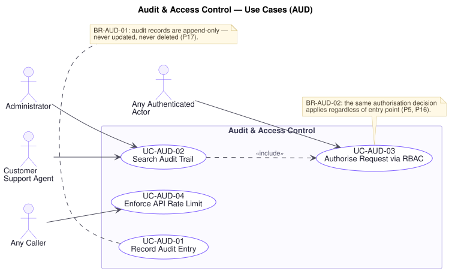

# Audit & Access Control — Use Cases (`AUD`)

**Related documents:** [`README.md`](./README.md) (index and template) · [`../srs.md`](../srs.md) · [`../traceability-matrix.md`](../traceability-matrix.md)

---

## Domain Scope

The two cross-cutting controls every other domain depends on: the record of who did what, and the decision about who may do it — together with the rate limiting that keeps the platform reachable at all.

These four use cases are unusual in that almost every other use case in this specification includes one of them. They are collected here so the behaviour is specified once and cited everywhere, rather than restated with drift.

- **`UC-AUD-03`** is included by every use case with a human primary actor. Where a use case's preconditions read "the actor holds role X," this is what establishes it.
- **`UC-AUD-01`** is included by every use case that changes a price, an inventory level, an order state, a refund, a promotion, a review's visibility, an account's status, or a role.
- **`UC-AUD-04`** precedes every externally originated request.

Two problems are answered here directly. **P16** — every role does exactly what its job requires, no more and no less — is `UC-AUD-03`. **P17** — the business must be able to answer "who did this, when, and why" — is `UC-AUD-01` and `UC-AUD-02`. **P5** binds them both: `BR-AUD-02` requires the same authorisation decision whatever entry point a request arrives through, because a rule enforced at one door is not enforced at all.

---

## UC-AUD-01 — Record Audit Entry

| Field | Value |
|---|---|
| **Primary actor** | Any authorised actor (internal, on their behalf) |
| **Stakeholders & interests** | Legal/Compliance: must be able to demonstrate a reliable record on request. Finance: needs internal fraud and error investigable. Support: needs to resolve disputes with evidence rather than recollection. Leadership: bears the consequence of an unanswerable audit request. |
| **Priority** | Must |
| **Trigger** | A significant business action is performed |
| **Preconditions** | The action has an identifiable actor and target |
| **Success postconditions** | An append-only entry records the actor, action, entity, before and after values, time, and any stated reason |
| **Failure postconditions** | **In general, the action it would have recorded is not applied.** Where the action has already had irreversible external effect, it stands and the missing entry is escalated immediately as a compliance exception |
| **Frequency** | Very high |
| **Traceability** | `FR-AUD-01`, `FR-AUD-02`, `FR-AUD-03` · `BR-AUD-01` · `NFR-OBS-01`, `NFR-OBS-02`, `NFR-SEC-07`, `FR-DAT-02`, `FR-DAT-05` · P17 |

**Main success scenario**

1. A significant action is performed — a product updated, a price changed, inventory adjusted, an order cancelled or advanced, a refund approved, a promotion created or amended, a review moderated, an account suspended, or a role assigned or revoked (`FR-AUD-02`).
2. Platform captures the acting user, the action, the entity affected, the values before and after, the time with an unambiguous time zone (`FR-DAT-02`), and any reason supplied.
3. Platform excludes credentials, payment instrument details, and tokens from the captured values (`NFR-SEC-07`).
4. Platform writes the entry **append-only**: once written it can be neither amended nor deleted through any interface the platform exposes (`BR-AUD-01`, `FR-AUD-03`).
5. Platform confirms the write, allowing the action to complete.

**Alternate flows**

- **A1 — Attributed to a system actor** (at step 2): The action originates from the Scheduler, a carrier, or a payment provider rather than a person. Attribution is to that actor, so an automatic transition is never indistinguishable from a human one (`UC-ORD-10`, A1).
- **A2 — Action taken on another party's behalf** (at step 2): A Support Agent acts for a customer. **Both the agent and the customer are recorded**, so "the customer cancelled" and "an agent cancelled for them" stay distinguishable (`UC-ADM-04`, A1).
- **A3 — Read access audited** (at step 1): Access to customer data or the audit trail is itself recorded, because "who looked at this" is as much a compliance question as "who changed it" (`UC-ADM-03`, A1).
- **A4 — Elevated authority used** (at step 2): Where an Administrator acts outside a normal role's remit, the entry records that the elevated authority was exercised (`UC-ADM-05`, A3).

**Exception flows**

- **E1 — Entry cannot be written and the action is still reversible** (at step 4): **The action is not applied.** This is the default and covers most cases — an inventory adjustment (`UC-INV-04`, E4), a price change (`UC-ADM-01`, E5), a role change (`UC-ADM-06`, E5), a moderation (`UC-REV-05`, E5). Nothing external has happened, so refusing is safe, and an unattributable change to a financial or access-control record is what `P17` exists to prevent.
- **E2 — Entry cannot be written and the action has irreversible external effect** (at step 4): **The action stands** and the missing entry is escalated immediately. A refund whose money has already moved (`UC-PAY-06`, E7) or a promotion deactivation that is stopping unbudgeted spend (`UC-PRM-05`, E5) must not be reversed to preserve an audit entry, because doing so causes the greater harm. The gap is surfaced, never hidden — this distinction is deliberate and is the reason both patterns appear in this specification.
- **E3 — Amendment or deletion of an entry attempted** (at any point): Refused for **every role including Administrator**, and the attempt is itself recorded as a security event. An audit trail that a sufficiently privileged actor can edit provides no assurance at all, which is why `BR-AUD-01` admits no exception (`NFR-OBS-02`).
- **E4 — Action has no identifiable actor** (at step 2): The entry is written attributed to the originating process and flagged for investigation. An unattributable action is recorded as unattributable rather than not recorded.
- **E5 — Retention period reached** (at step 4): Entries are retained for the configured period (**[A-13]**, `FR-DAT-05`). Expiry is by policy and is itself recorded; it is never an ad-hoc deletion.

**Business rules applied** — `BR-AUD-01`, `BR-AUD-02`.

**Assumptions & open questions** — **[A-13]** assumes a 7-year retention. The actual period is a Legal and regulatory determination, not a platform decision, and requires confirmation.

---

## UC-AUD-02 — Search Audit Trail

| Field | Value |
|---|---|
| **Primary actor** | Administrator |
| **Supporting actors** | Customer Support Agent |
| **Stakeholders & interests** | Legal/Compliance: needs to produce a record on demand. Finance: needs to investigate a suspected internal fraud or error. Support: needs to establish what happened to a disputed order. Leadership: audit readiness is a governance obligation. |
| **Priority** | Must |
| **Trigger** | An authorised actor investigates a past action |
| **Preconditions** | The actor holds a role permitting audit access (`UC-AUD-03`) |
| **Success postconditions** | Matching entries are presented in time order; **the search itself is recorded** |
| **Failure postconditions** | Nothing is disclosed |
| **Frequency** | Low, high consequence |
| **Traceability** | `FR-AUD-04`, `FR-AUD-01` · `BR-AUD-01`, `BR-AUD-02` · `NFR-OBS-01`, `NFR-SEC-01`, `NFR-SEC-07` · P16, P17 |

**Main success scenario**

1. Actor searches the audit trail by actor, entity, action type, or time range.
2. Platform authorises the request (`UC-AUD-03`, `BR-AUD-02`).
3. Platform retrieves matching entries.
4. Platform presents them in time order with actor, action, entity, before and after values, time, and reason.
5. Platform records the search itself as an audit entry (`UC-AUD-01`, A3).

**Alternate flows**

- **A1 — Investigating one entity** (at step 1): Every action against one order, product, or account, which is the ordinary dispute-resolution case.
- **A2 — Investigating one actor** (at step 1): Every action by one user over a period — the internal-fraud and error-investigation case `P17` names.
- **A3 — Correlated across domains** (at step 3): Entries relating to one business transaction across order, payment, inventory, and shipping are presented together (`NFR-OBS-03`), which is how a partial failure (`P7`) is actually diagnosed.
- **A4 — Exported for an investigation** (at step 4): Exported under `UC-RPT-06`, and the export is itself audited.

**Exception flows**

- **E1 — Actor lacks authority** (at step 2): Declined and the attempt recorded. The audit trail describes who exercised which authority and is itself sensitive (`P16`).
- **E2 — No matching entries** (at step 3): An empty result is presented explicitly, distinguished from a failed search. "No such action was recorded" and "the search did not run" are very different findings in an investigation.
- **E3 — Query spans an impractically large range** (at step 3): The actor is asked to narrow it. The platform does not return a truncated set that could be mistaken for a complete one.
- **E4 — Entries fall outside the retention period** (at step 3): The platform states that entries before the retention horizon are not available, rather than silently returning a partial record and letting it be read as complete.
- **E5 — Amendment of an entry attempted from this view** (at step 4): Refused for every role and recorded (`UC-AUD-01`, E3). The trail is readable here, never writable.

**Business rules applied** — `BR-AUD-01`, `BR-AUD-02`.

---

## UC-AUD-03 — Authorise Request via RBAC

| Field | Value |
|---|---|
| **Primary actor** | Any authenticated actor |
| **Stakeholders & interests** | Finance: pricing and inventory integrity depend on this decision. Legal/Compliance: data access risk is bounded by it. Customer: their data is protected by it. Leadership: bears the reputational risk if it fails publicly (`P16`). |
| **Priority** | Must |
| **Trigger** | Any operation requiring authority is requested |
| **Preconditions** | The request carries an authenticated identity, or is explicitly permitted to an unauthenticated caller |
| **Success postconditions** | The request proceeds, having been confirmed within the acting user's authority |
| **Failure postconditions** | The request does not proceed; nothing is disclosed about the target's existence; the refusal is recorded where it is significant |
| **Frequency** | Extremely high — every operation |
| **Traceability** | `FR-AUD-05`, `FR-AUD-06`, `FR-AUD-08` · `BR-AUD-02`, `BR-AUD-03` · `NFR-SEC-01`, `NFR-SEC-04`, `NFR-MAINT-03` · P5, P16 |

**Main success scenario**

1. A request arrives for an operation requiring authority.
2. Platform establishes the acting identity and its current roles (`UC-CUS-05`, A1).
3. Platform validates the request's inputs before any business processing (`FR-AUD-08`, `NFR-SEC-04`).
4. Platform determines the authority the operation requires, per the role authority table in [`../srs.md`](../srs.md) §2.3.
5. Platform confirms the acting roles confer it, and that ownership-scoped data belongs to the acting party.
6. Platform permits the operation to proceed.

**Alternate flows**

- **A1 — Ownership-scoped rather than role-scoped** (at step 5): A Customer may act on their own cart, order, review, or notifications. Authority derives from ownership, and every scoped read is filtered to the acting party (`UC-CUS-10`, `UC-NTF-03`).
- **A2 — Role-scoped across all records** (at step 5): Support and Administrators act on records they do not own. Authority derives from role, and the access is audited (`UC-AUD-01`, A3).
- **A3 — Unauthenticated request** (at step 2): Browsing, search, and product reviews are open to a Guest. The set of operations available without authentication is explicit, not a default.
- **A4 — Several roles held** (at step 5): Authority is the union of the roles held.

**Exception flows**

- **E1 — Acting roles do not confer the authority** (at step 5): The request is refused. **The same decision is reached whatever entry point the request arrived through** — the customer application, the administrative interface, or a future mobile client. This is the whole content of `BR-AUD-02` and the direct answer to `P5`: a rule living in one entry point makes every other entry point a loophole.
- **E2 — Ownership-scoped data belonging to another party requested** (at step 5): Refused with **the same response as for data that does not exist**, so identifiers cannot be probed for existence. The attempt is recorded (`UC-ORD-06`, E1).
- **E3 — Identity cannot be established** (at step 2): Refused as unauthenticated. An expired session is directed to refresh or re-authenticate (`UC-CUS-05`).
- **E4 — Input fails validation** (at step 3): Refused **before any business processing occurs** (`FR-AUD-08`). Validating after processing has begun means invalid input has already had effect.
- **E5 — Roles changed since the session's token was issued** (at step 2): The current roles govern. Revoked authority does not survive in an outstanding token beyond one refresh interval (`UC-CUS-05`, A1), and an urgent revocation ends sessions at once (`UC-ADM-06`, A2).
- **E6 — Self-elevation attempted** (at step 5): Refused and recorded as a security event (`BR-AUD-03`, `UC-ADM-06`, E1).
- **E7 — Authorisation cannot be determined** (at step 4): The request is **refused**. An indeterminate authorisation is never resolved as permitted; the safe default is denial.

**Business rules applied** — `BR-AUD-02`, `BR-AUD-03`.

---

## UC-AUD-04 — Enforce API Rate Limit

| Field | Value |
|---|---|
| **Primary actor** | Any caller |
| **Stakeholders & interests** | Customer: needs the platform responsive during peak events (`P9`). Leadership: peak availability is peak revenue. Trust & Safety: rate limiting is the primary defence against credential guessing and code enumeration. Finance: bounded load is bounded infrastructure cost (`P10`). |
| **Priority** | Must |
| **Trigger** | Any externally originated request |
| **Success postconditions** | The request proceeds and is counted against the caller's allowance |
| **Failure postconditions** | The request is rejected **without being processed**, and the caller is told when they may retry |
| **Frequency** | Extremely high — every request |
| **Traceability** | `FR-AUD-07` · `NFR-SEC-05`, `NFR-SCAL-06`, `NFR-AVAIL-01` · P9, P10, P16 |

**Main success scenario**

1. An externally originated request arrives.
2. Platform identifies the caller by authenticated identity or by origin.
3. Platform determines the applicable limit for the caller and the endpoint.
4. Platform confirms the caller is within it.
5. Platform counts the request and allows it to proceed.

**Alternate flows**

- **A1 — Stricter limit on authentication** (at step 3): Login, registration, password reset, and voucher validation carry stricter limits than general endpoints (`NFR-SEC-05`), because each is a guessing surface (`UC-CUS-03`, E2; `UC-PRM-02`, E8).
- **A2 — Higher allowance for authenticated callers** (at step 3): An authenticated customer is allowed more than an anonymous caller, since they are identifiable and accountable.
- **A3 — Limits raised for a planned peak** (at step 3): Adjusted ahead of a flash sale, which is legitimate concentrated demand rather than abuse (`UC-PRM-04`).
- **A4 — Approaching the limit** (at step 5): The caller is told how much allowance remains, so a well-behaved client can slow down rather than be cut off.

**Exception flows**

- **E1 — Limit exceeded** (at step 4): The request is rejected **without being processed** and the caller told when to retry. Rejecting after processing would defeat the purpose, since the cost has already been paid.
- **E2 — Correct credentials presented beyond the limit** (at step 4): Still rejected. A valid credential does not exempt a caller, or the limit would not constrain the credential-stuffing attack it exists to stop (`UC-CUS-03`, E2).
- **E3 — Sustained excess from one caller** (at step 4): Repeated breach is recorded as a security event and may attract a longer block. Persistent excess is abuse, not enthusiasm.
- **E4 — Legitimate traffic surge during a peak event** (at step 4): Limits are applied per caller, not to aggregate traffic, so a flash sale's many distinct customers are not throttled as one (`NFR-SCAL-06`, `P9`). Aggregate load is a capacity concern, addressed by `NFR-AVAIL-02` degrading discovery before the purchase path.
- **E5 — Caller cannot be identified** (at step 2): The most restrictive applicable limit is applied. An unidentifiable caller receives the least allowance, not the most.
- **E6 — Rate limiting itself unavailable** (at step 3): Requests proceed rather than the platform closing entirely, and the loss of the control is escalated immediately. Failing closed here would turn a protective control into a total outage; the exposure is accepted knowingly and surfaced rather than silently absorbed.

**Business rules applied** — `BR-CUS-04`, `BR-AUD-02`.

**Assumptions & open questions** — R1 §9 requires rate limiting but states no limits. The specific allowances per endpoint are an operational parameter to be set from observed traffic and confirmed with the Product Owner, particularly the peak allowance implied by **[A-04]**.
