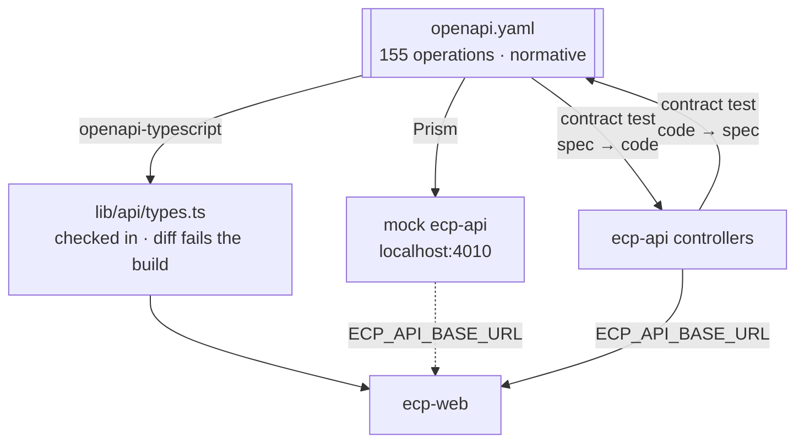

# Integration Plan — Enterprise Commerce Platform (ECP)

**Document type:** Development Protocol (normative for both lanes)
**Audience:** Engineering, Quality Assurance, Product Management
**Version:** 1.0
**Status:** Draft for stakeholder review
**Related documents:** [`release-plan.md`](./release-plan.md) · [`definition-of-done.md`](./definition-of-done.md) · [`product-backlog.md`](./product-backlog.md) · [`../SA-docs/04-shared/Integration Contract.md`](../SA-docs/04-shared/Integration%20Contract.md) · [`../SA-docs/04-shared/OpenAPI/README.md`](../SA-docs/04-shared/OpenAPI/README.md) · [`../SA-docs/01-system/ADR/ADR-0031-contract-first-openapi.md`](../SA-docs/01-system/ADR/ADR-0031-contract-first-openapi.md)

---

## 1. The Problem This Solves

Two developers, two runtimes, one system. The default outcome of that arrangement is well known: the frontend waits for endpoints, the backend guesses at what the screens need, and the two meet for the first time near the end, at which point every disagreement about a field name is a schedule problem.

This document is the protocol that prevents it. It has exactly three parts:

1. **How the lanes stay independent** (§2) — so neither ever waits for the other.
2. **The Contract Sync gate** (§3) — a one-day verification at the end of every second sprint.
3. **The Integration Hardening sprints** (§4) — three full sprints where the only work is proving the halves connect.

---

## 2. How the Lanes Stay Independent

### 2.1 The contract already exists, and that is unusual

Most projects cannot work this way because their API contract is a consequence of the backend rather than an input to it. Here it is an input: [`04-shared/OpenAPI/openapi.yaml`](../SA-docs/04-shared/OpenAPI/README.md) describes **121 paths and 155 operations across all fourteen domains**, hand-authored and made **normative** by [`ADR-0031`](../SA-docs/01-system/ADR/ADR-0031-contract-first-openapi.md).

That single fact is what the whole plan rests on. The frontend does not need the backend to exist in order to know what the backend will return.



### 2.2 The four mechanisms

| # | Mechanism | What it guarantees | Source |
|---|---|---|---|
| **M1** | **Prism mock.** `npm run mock:api` serves `openapi.yaml` on `localhost:4010`. The frontend points at it via `ECP_API_BASE_URL` | The frontend never waits for an endpoint. Every screen in [`Routing.md`](../SA-docs/03-frontend/Routing.md) §4–§7 is buildable on day one | `EN-MOCK-1`, S01 |
| **M2** | **Generated types.** `openapi-typescript` emits types only — no client, no runtime. Output is checked in, regenerated in CI, and **a diff fails the build** | The frontend cannot compile against a shape the contract does not describe, and a stale generation cannot survive a commit | [`Frontend Architecture.md`](../SA-docs/03-frontend/Frontend%20Architecture.md) §6.3 |
| **M3** | **Contract tests, both directions.** Spec→code: every operation has a controller at that path and verb. Code→spec: every controller mapping appears in the spec | The backend cannot ship an endpoint the frontend has not been told about, nor silently omit one it has | [`Testing and Benchmark Strategy.md`](../SA-docs/01-system/Testing%20and%20Benchmark%20Strategy.md) §6.6 |
| **M4** | **Runtime parsing.** Zod schemas at the API boundary, hand-written and reviewed — deliberately *not* generated from the same document that produced the types | A generated type is a compile-time claim; the network delivers whatever it delivers. Generating both from one document would make both wrong in the same way | [`Frontend Architecture.md`](../SA-docs/03-frontend/Frontend%20Architecture.md) §6.3 |

### 2.3 The switch is one environment variable

```bash
# Frontend lane, working independently — Prism serving the contract
ECP_API_BASE_URL=http://localhost:4010

# Contract Sync, or any day the developer wants the real thing
ECP_API_BASE_URL=http://localhost:8080/api/v1
```

There is no mock adapter, no `if (isMock)` branch, and no second code path. [`ADR-0036`](../SA-docs/01-system/ADR/ADR-0036-nextjs-server-sole-api-caller.md) makes `ecp-web`'s server the sole API caller through one fetch client, so there is exactly one place the base URL is read. **A conditional on mock-versus-real anywhere in `ecp-web` is a defect**, because it means the integrated path is not the path that was developed.

### 2.4 The rule that makes it hold

> **Neither lane may block on the other for anything the contract already answers.**

If a developer finds themselves waiting, exactly one of three things is true, and each has a defined response:

| Situation | Response |
|---|---|
| The contract answers it, and the developer had not looked | Read `openapi.yaml`. Not a blocker |
| The contract is **wrong or silent** | Raise it immediately as a **contract amendment** (§5). Do not work around it locally in either lane |
| The work genuinely needs the other lane's running code | It is integration work. It belongs at the next gate or in an Integration Hardening sprint, not in the middle of a sprint |

---

## 3. The Contract Sync Gate

**When.** End of every odd-numbered sprint — fifteen times across the plan (`G0`–`G15` in [`release-plan.md`](./release-plan.md) §5).
**Duration.** One day, both developers, together.
**Scope.** Only the domains delivered in the two sprints just closed. It is not a full regression pass; that is what the Integration Hardening sprints are for.

### 3.1 The checklist

| # | Check | Source |
|---|---|---|
| 1 | `openapi-typescript` regenerated against `openapi.yaml`; **the diff is empty** | [`Frontend Architecture.md`](../SA-docs/03-frontend/Frontend%20Architecture.md) §6.3 |
| 2 | Contract test **spec→code** passes for every operation in the increment | [Testing Strategy](../SA-docs/01-system/Testing%20and%20Benchmark%20Strategy.md) §6.6 |
| 3 | Contract test **code→spec** passes — no undocumented endpoint exists | §6.6 |
| 4 | `ecp-web` repointed at the real `ecp-api`; **every route in the increment renders with real data** | [`Routing.md`](../SA-docs/03-frontend/Routing.md) §4–§7 |
| 5 | The pagination envelope and cursor shape match on every list operation in the increment | [`Integration Contract.md`](../SA-docs/04-shared/Integration%20Contract.md) §3 |
| 6 | Every error code the increment can return renders as its **designed screen** — not as a generic error boundary | [`Error Codes.md`](../SA-docs/04-shared/Error%20Codes.md) |
| 7 | Permission-matrix cells behave: each role sees what the matrix grants, and a caller without the role is refused **by the server** | [`Permission Matrix.md`](../SA-docs/04-shared/Permission%20Matrix.md) |
| 8 | `Money` arrives as `{"amount": "129.99", "currency": "VND"}` with `amount` a **string**, and the frontend performs no arithmetic on it | [`Frontend Architecture.md`](../SA-docs/03-frontend/Frontend%20Architecture.md) §6.2 |
| 9 | One correlation id is visible across the browser request, the API log, and any event the increment publishes | [`Integration Contract.md`](../SA-docs/04-shared/Integration%20Contract.md) §6.2 |
| 10 | Any drift found is logged as a backlog item **and** `openapi.yaml` is amended in the same session | [`ADR-0031`](../SA-docs/01-system/ADR/ADR-0031-contract-first-openapi.md) |

### 3.2 Two checks that catch the mistakes people actually make

**Check 6 is not "errors are handled."** It is that the *designed* outcome renders as designed. The specific case the plan exists to protect:

> `ECP-INV-4091` renders as **"sold out"**, not as an error. It is an expected outcome under peak load, and "sold out" and "try again" must be visibly different to the customer.
> — [`Routing.md`](../SA-docs/03-frontend/Routing.md) §4.3

Likewise `ECP-PRM-4090` fails the voucher **field**, never the checkout.

**Check 7 is not a UI check.** Hiding a control is a courtesy; the server decides. A `CUSTOMER` who reaches `/admin` must see an admin shell with empty sections and `403`s behind every read — that is *correct behaviour*, and "fixing" it in middleware is threat `T9` of [`Security.md`](../SA-docs/01-system/Security.md) §13, because a redirect then looks like a permission check.

### 3.3 Exit criterion

> Every route delivered in the increment renders against the real API — **or** the drift is a logged, sized, prioritised backlog item with a named sprint.

Never a silent local patch, and never a `TODO`. A gate that can be passed by working around the finding is not a gate.

---

## 4. The Integration Hardening Sprints

Three full sprints, both developers, **no new stories and no story points**. Their content is specified sprint by sprint in [`release-plan.md`](./release-plan.md) §4; what follows is why each sits where it does.

| | Placed after | Because |
|---|---|---|
| **IH-1** | S09 — identity and catalog complete | Session custody is the contract that is hardest to retrofit and most expensive to get wrong. The `ecp_session` cookie, signed double-submit CSRF, serialised refresh, and the per-group CSP are all decided in S02–S05; IH-1 is the first moment they can be proved across a real boundary rather than against a mock that cannot forge a cookie. It also proves the event-driven revalidation loop, which is the first place the backend's event backbone becomes visible in a browser |
| **IH-2** | S20 — ordering, shipping and payment complete | The money path. `P6` (partial failure in money-critical flows) and `P8` (overselling under concentrated demand) are business problems until someone induces them; this is where they are induced. Concurrency, idempotency, fault injection at each placement step, and the sold-out-versus-error distinction all land together because they are the same failure surface seen from two sides |
| **IH-3** | S29 — all 71 `Must` stories complete | The whole system, before anyone claims it is finished. Its most important output is not a pass — it is the honest recording of `AC-05` and `AC-06` as **unverified**, because the load rig they depend on is deferred by [Testing Strategy](../SA-docs/01-system/Testing%20and%20Benchmark%20Strategy.md) §7.9 |

**They are not buffer sprints.** If either lane treats an Integration Hardening sprint as a place to finish late story work, the plan has lost the only three sprints in which whole-system properties are verified — and those properties are exactly the ones `AC-01`–`AC-06` are claimed on.

---

## 5. Amending the Contract

`openapi.yaml` is normative. When it turns out to be wrong, the sequence is fixed:

1. **Stop.** Neither lane implements around it.
2. **Both developers agree the amendment**, at the gate or in a short session called for the purpose.
3. **Amend `openapi.yaml` first.** Run `npm run docs:openapi:lint` from `util/`.
4. **Regenerate types**; the diff is now expected and is reviewed as part of the change.
5. **Both lanes implement against the amended contract.**
6. **Both contract-test directions pass** before the change merges.

**Never step 5 before step 3.** A backend that changes a field name and tells the frontend afterwards has made the specification stale, and [`ADR-0031`](../SA-docs/01-system/ADR/ADR-0031-contract-first-openapi.md)'s entire drift-control mechanism is that the specification is never stale.

**Schema evolution rules still apply.** [`Integration Contract.md`](../SA-docs/04-shared/Integration%20Contract.md) §8 distinguishes non-breaking changes that ship freely from breaking ones that need a version. An amendment discovered at a gate is usually additive; if it is not, it is a decision with a cost, and naming that cost is the point of routing it through this procedure.

---

## 6. What Runs Where, Locally

Per [`Deployment Diagram.md`](../SA-docs/01-system/Deployment%20Diagram.md) §7 the developer runs both applications directly and only the data tier in Compose.

| Process | Command | Port |
|---|---|---|
| Data tier — PostgreSQL, Kafka, Redis, Elasticsearch, MongoDB | `docker compose up -d` (after `colima start --memory 4`) | as `compose.yaml` |
| `ecp-api` | `./gradlew bootRun` | 8080 |
| `ecp-web` | `npm run dev` | 3000 |
| Prism mock (frontend lane, instead of `ecp-api`) | `npm run mock:api` | 4010 |

Three differences from production are deliberate and are worth knowing before debugging something that is not a bug: **no `nginx`**, so there is nothing terminating TLS; **one `ecp-api`**, so the scheduler and outbox-relay contention of §6 of that document is invisible locally and must be tested in staging; and **stub provider adapters**, because no developer holds a live payment credential.

**Integration tests never use this stack.** They use Testcontainers, so a test run never depends on developer-local data and never leaves any behind.

---

## 7. What This Protocol Does Not Cover

| Not covered | Where it lives |
|---|---|
| Event schema drift between publisher and consumer | [`Module Dependency Diagram.md`](../SA-docs/02-backend/Module%20Dependency%20Diagram.md) §5 trades compile-time safety for extraction freedom, and §11 records the contract-testing tool for event schemas as **unresolved**. This is a real gap and it is a backend-internal one — it does not cross the frontend boundary |
| Security verification | [`Security.md`](../SA-docs/01-system/Security.md) §12 is authoritative. `NFR-SEC-01` is a backend property verified by its matrix, **never** by driving a browser |
| Performance budgets | Frontend route budgets ([`Performance.md`](../SA-docs/03-frontend/Performance.md) §2) and the k6 smoke benchmark are separate apparatus and are not gate checks |
| The provider callbacks | `receivePaymentProviderNotification` and `receiveCarrierEvent` terminate at `nginx` and route to `ecp-api`. **A frontend route for either would be a security defect, not a missing feature** ([`Routing.md`](../SA-docs/03-frontend/Routing.md) §10.1) |
