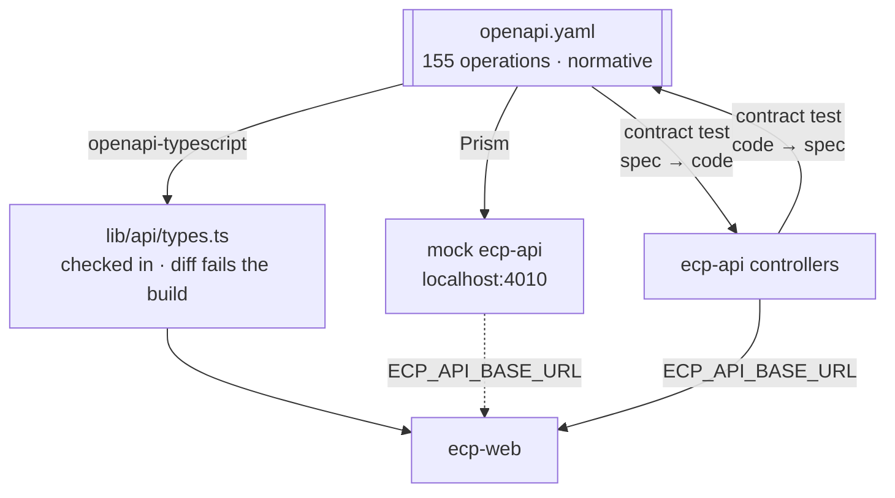

# Integration Plan — Enterprise Commerce Platform (ECP)

**Document type:** Development Protocol (normative for both lanes)
**Audience:** Engineering, Quality Assurance, Product Management
**Version:** 1.0
**Status:** Draft for stakeholder review
**Related documents:** [`release-plan.md`](./release-plan.md) · [`definition-of-done.md`](./definition-of-done.md) · [`product-backlog.md`](./product-backlog.md) · [`../SA-docs/04-shared/Integration Contract.md`](../SA-docs/04-shared/Integration%20Contract.md) · [`../SA-docs/04-shared/OpenAPI/README.md`](../SA-docs/04-shared/OpenAPI/README.md) · [`../SA-docs/01-system/ADR/ADR-0031-contract-first-openapi.md`](../SA-docs/01-system/ADR/ADR-0031-contract-first-openapi.md)

## 1. Scope

This protocol lets the frontend and backend lanes work independently and verifies them together. It defines the shared contract, Contract Sync gates, Integration Hardening sprints, and contract amendment process.

## 2. Independent lanes

### 2.1 Contract

[`openapi.yaml`](../SA-docs/04-shared/OpenAPI/README.md) is normative under [`ADR-0031`](../SA-docs/01-system/ADR/ADR-0031-contract-first-openapi.md). It defines 121 paths and 155 operations across 14 domains. Both lanes use it before the backend endpoints exist.


```mermaid
flowchart TB
    SPEC[["openapi.yaml<br/>155 operations · normative"]]
    SPEC -->|"openapi-typescript"| TYPES["lib/api/types.ts<br/>checked in · diff fails the build"]
    SPEC -->|"Prism"| MOCK["mock ecp-api<br/>localhost:4010"]
    SPEC -->|"contract test<br/>spec → code"| API["ecp-api controllers"]
    API -->|"contract test<br/>code → spec"| SPEC
    TYPES --> WEB["ecp-web"]
    MOCK -.->|"ECP_API_BASE_URL"| WEB
    API -->|"ECP_API_BASE_URL"| WEB
```

### 2.2 Mechanisms

| # | Mechanism | What it guarantees | Source |
|---|---|---|---|
| **M1** | Prism serves `openapi.yaml` on `localhost:4010`; `ECP_API_BASE_URL` selects it | Frontend work does not wait for endpoints | `EN-MOCK-1`, S01 |
| **M2** | `openapi-typescript` generates checked-in types; CI fails on a diff | Stale or unknown response shapes fail the build | [`Frontend Architecture.md`](../SA-docs/03-frontend/Frontend%20Architecture.md) §6.3 |
| **M3** | Contract tests verify spec→code and code→spec | Missing and undocumented endpoints fail the build | [`Testing and Benchmark Strategy.md`](../SA-docs/01-system/Testing%20and%20Benchmark%20Strategy.md) §6.6 |
| **M4** | Reviewed Zod schemas parse responses at runtime | Runtime data is checked independently of generated types | [`Frontend Architecture.md`](../SA-docs/03-frontend/Frontend%20Architecture.md) §6.3 |

### 2.3 API switch

```bash
# Prism
ECP_API_BASE_URL=http://localhost:4010

# Real API
ECP_API_BASE_URL=http://localhost:8080/api/v1
```

[`ADR-0036`](../SA-docs/01-system/ADR/ADR-0036-nextjs-server-sole-api-caller.md) requires one server-side fetch client. Mock and real APIs use the same code path. A mock-specific branch in `ecp-web` is a defect.

### 2.4 Blocking rule

> **Neither lane may block on the other for anything the contract already answers.**

| Situation | Response |
|---|---|
| The contract answers it, and the developer had not looked | Read `openapi.yaml`. Not a blocker |
| The contract is **wrong or silent** | Raise it immediately as a **contract amendment** (§5). Do not work around it locally in either lane |
| The work genuinely needs the other lane's running code | It is integration work. It belongs at the next gate or in an Integration Hardening sprint, not in the middle of a sprint |

## 3. Contract Sync gate

Run one day with both developers at the end of each odd sprint. The 15 gates are `G0`–`G15` in [`release-plan.md`](./release-plan.md) §5. A gate covers domains delivered in the last two sprints, not full regression.

### 3.1 Checklist

| # | Check | Source |
|---|---|---|
| 1 | `openapi-typescript` regenerated against `openapi.yaml`; **the diff is empty** | [`Frontend Architecture.md`](../SA-docs/03-frontend/Frontend%20Architecture.md) §6.3 |
| 2 | Contract test **spec→code** passes for every operation in the increment | [Testing Strategy](../SA-docs/01-system/Testing%20and%20Benchmark%20Strategy.md) §6.6 |
| 3 | Contract test **code→spec** passes — no undocumented endpoint exists | §6.6 |
| 4 | `ecp-web` repointed at the real `ecp-api`; **every route in the increment renders with real data** | [`Routing.md`](../SA-docs/03-frontend/Routing.md) §4–§7 |
| 5 | The pagination envelope and cursor shape match on every list operation in the increment | [`Integration Contract.md`](../SA-docs/04-shared/Integration%20Contract.md) §3 |
| 6 | Every error code the increment can return renders as its **designed screen** — not as a generic error boundary | [`Error Codes.md`](../SA-docs/04-shared/Error%20Codes.md) |
| 7 | Permission-matrix cells behave: each role sees what the matrix grants, and a caller without the role is refused **by the server** | [`Permission Matrix.md`](../SA-docs/04-shared/Permission%20Matrix.md) |
| 8 | `Money` arrives as `{"amount": "129.99", "currency": "VND"}` with `amount` a **string**, and the frontend performs no arithmetic on it | [`Frontend Architecture.md`](../SA-docs/03-frontend/Frontend%20Architecture.md) §6.2 |
| 9 | One correlation id is visible across the browser request, the API log, and any event the increment publishes | [`Integration Contract.md`](../SA-docs/04-shared/Integration%20Contract.md) §6.2 |
| 10 | Any drift found is logged as a backlog item **and** `openapi.yaml` is amended in the same session | [`ADR-0031`](../SA-docs/01-system/ADR/ADR-0031-contract-first-openapi.md) |

### 3.2 Required interpretations

Check 6 verifies the designed outcome, not a generic error state:

> `ECP-INV-4091` renders as **"sold out"**, not as an error. It is an expected outcome under peak load, and "sold out" and "try again" must be visibly different to the customer.
> — [`Routing.md`](../SA-docs/03-frontend/Routing.md) §4.3

`ECP-PRM-4090` fails the voucher field, not checkout.

Check 7 verifies server authorization. UI visibility is not evidence. A `CUSTOMER` at `/admin` may see the shell, but each protected read must return `403`. Middleware redirects can hide threat `T9` from [`Security.md`](../SA-docs/01-system/Security.md) §13.

### 3.3 Exit criterion

> Every route delivered in the increment renders against the real API — **or** the drift is a logged, sized, prioritised backlog item with a named sprint.

Do not pass a gate with a local workaround or `TODO`.

## 4. Integration Hardening sprints

Both developers work on each full sprint. No new stories or story points enter these sprints.

| | Placed after | Because |
|---|---|---|
| **IH-1** | S09 — identity and catalog complete | Verify session custody and event-driven web revalidation across the real boundary |
| **IH-2** | S20 — ordering, shipping and payment complete | Verify `P6` and `P8` through concurrency, idempotency, and fault injection |
| **IH-3** | S29 — all 71 `Must` stories complete | Verify the full system and record `AC-05` and `AC-06` as unverified until load evidence exists |

Integration Hardening sprints cannot absorb late story work.

## 5. Contract amendments

`openapi.yaml` is normative. When it turns out to be wrong, the sequence is fixed:

1. Stop implementation in both lanes.
2. Both developers agree on the amendment.
3. Update `openapi.yaml` and run `npm run docs:openapi:lint` from `util/`.
4. Regenerate and review types.
5. Implement both lanes against the amended contract.
6. Pass both contract-test directions before merge.

Update the contract before implementation. Apply the schema evolution rules in [`Integration Contract.md`](../SA-docs/04-shared/Integration%20Contract.md) §8.

## 6. Local runtime

Per [`Deployment Diagram.md`](../SA-docs/01-system/Deployment%20Diagram.md) §7 the developer runs both applications directly and only the data tier in Compose.

| Process | Command | Port |
|---|---|---|
| Data tier — PostgreSQL, Kafka, Redis, Elasticsearch, MongoDB | `docker compose up -d` (after `colima start --memory 4`) | as `compose.yaml` |
| `ecp-api` | `./gradlew bootRun` | 8080 |
| `ecp-web` | `npm run dev` | 3000 |
| Prism mock (frontend lane, instead of `ecp-api`) | `npm run mock:api` | 4010 |

Local development has no `nginx`, runs one `ecp-api`, and uses stub provider adapters. Test scheduler and outbox-relay contention in staging. Integration tests use Testcontainers, not this local stack.

## 7. Exclusions

| Not covered | Where it lives |
|---|---|
| Event schema drift | Backend-internal gap; the tool remains unresolved in [`Module Dependency Diagram.md`](../SA-docs/02-backend/Module%20Dependency%20Diagram.md) §11 |
| Security verification | [`Security.md`](../SA-docs/01-system/Security.md) §12 is authoritative; browser tests do not verify `NFR-SEC-01` |
| Performance budgets | [`Performance.md`](../SA-docs/03-frontend/Performance.md) §2 and the k6 smoke benchmark own them |
| Provider callbacks | They terminate at `nginx` and route to `ecp-api`; a frontend route is a security defect under [`Routing.md`](../SA-docs/03-frontend/Routing.md) §10.1 |
