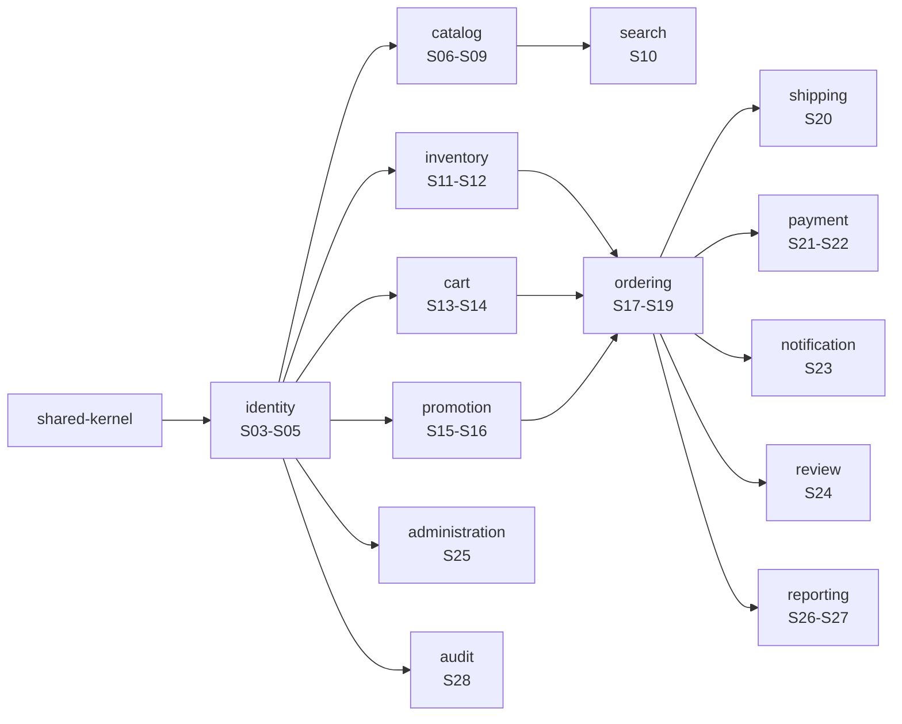

# Release Plan — Enterprise Commerce Platform (ECP)

**Document type:** Release Plan
**Audience:** Product Management, Engineering, Quality Assurance
**Version:** 1.0
**Status:** Draft for stakeholder review
**Related documents:** [`product-backlog.md`](./product-backlog.md) · [`integration-plan.md`](./integration-plan.md) · [`definition-of-done.md`](./definition-of-done.md) · [`scrum-framework.md`](./scrum-framework.md)

---

## 1. Shape of the Plan

**36 two-week sprints across three releases — 33 delivery sprints plus 3 Integration Hardening sprints.** At the velocity assumed in [`scrum-framework.md`](./scrum-framework.md) §4 that is approximately **17 months** for one backend developer and one frontend developer.

That number is stated plainly rather than compressed to look better. Two levers change it, and only two:

| Lever | Effect |
|---|---|
| A second backend developer | The backend lane is the critical path by roughly ten sprints. A second backend developer is worth far more than a second frontend developer, and moves the release in |
| Cutting Release 3 | The 12 `Should` and 4 `Could` stories are three sprints. Dropping them ships the `Must` set — which SRS §1.5 defines as the viable release — around Sprint 29 |

Adding a frontend developer does **not** move the date. The frontend lane already carries reserve (§6).

---

## 2. Releases

| Release | Sprints | Delivers | Ends with |
|---|---|---|---|
| **R1 — Transactable Storefront** | S00 – S23 + IH-1, IH-2 | A customer registers, browses, searches, carts, checks out, pays, and tracks a delivery. Operators manage catalog, inventory, promotions, orders, payments and shipments | The purchase path works end to end against the real API |
| **R2 — Operations Console** | S24 – S29 + IH-3 | Reviews, account and role administration, reporting read models and screens, the audit trail, and full contract verification across all 155 operations | All 71 `Must` stories delivered — the viable release of SRS §1.5 |
| **R3 — Discovery, Depth & Launch** | S30 – S32 | The 12 `Should` and 4 `Could` stories, then launch readiness | An honest statement of what is verified and what is not |

**The `Must` cut line is the end of Sprint 29.** Everything after it is capability the release can ship without, by the Product Owner's own MoSCoW assignment.

---

## 3. Sequencing — Why This Order and Not Another

### 3.1 The backend order is forced

This is [`Module Dependency Diagram.md`](../SA-docs/02-backend/Module%20Dependency%20Diagram.md) §3's graph read as a topological order. `identity` is first because all twelve other modules call its `AuthorizationService`. `ordering` is late because it is the only module with three cross-context edges, and every one of them must exist first.

**`audit` is split, deliberately.** `UC-AUD-03` (RBAC) and `UC-AUD-04` (rate limiting) are cross-cutting and land in **S04**, with `identity`, because `BR-AUD-02` requires the same authorisation decision whatever entry point a request arrives through — that is not something added per controller later. `UC-AUD-01` (record an audit entry) lands in **S12**, once there are commands worth auditing. Only the trail *search* waits for S28.

### 3.2 The frontend order is forced too, by a different rule

[`Feature Structure.md`](../SA-docs/03-frontend/Feature%20Structure.md) §2 points dependencies `app/` → `features/` → `lib/` → `components/`. So `lib/api`, `lib/session` and the design-system primitives precede every screen, and the route groups precede the routes inside them.

**But the frontend is not bound to the backend's order**, and the plan exploits that repeatedly:

| Screen | Frontend builds it | Backend delivers it | Gap |
|---|---|---|---|
| Admin products & categories | S08 | S09 | 1 sprint ahead |
| Checkout funnel | S14–S15 | S17 | 2–3 sprints ahead |
| Order detail & tracking | S17–S18 | S19 | 1–2 sprints ahead |
| Shipping quotes & tracking | S19 | S20 | 1 sprint ahead |
| Admin accounts, roles, orders | S22 | S25 | 3 sprints ahead |
| Reporting screens | S23–S24 | S26–S27 | 3 sprints ahead |
| Audit trail | S25 | S28 | 3 sprints ahead |

Every one of those is built against the Prism mock and integrated at the next gate. This is the contract-first dividend, and it is the reason the plan does not need the two lanes to move in lockstep.

---

## 4. The Sprint Map

Each sprint below lists both lanes with their point loads. `▸ G<n>` marks a Contract Sync gate at the sprint's end; `IH` sprints carry no story points at all.

---

### Sprint 00 — Foundation — Build & Toolchain

**Release 1 · Backend 14 pts · Frontend 14 pts**

**Sprint goal.** Both lanes have a build that enforces its own rules.

| Backend lane | Pts |
|---|---:|
| `EN-BUILD-1` Gradle multi-project: 14 subprojects, version catalog, `app` composition root, `bootJar` | 14 |
| **Total** | **14** |

The Gradle multi-project layout of [`Module Dependency Diagram.md`](../SA-docs/02-backend/Module%20Dependency%20Diagram.md) §2 exists with all fourteen subprojects and an empty, compiling `app`.

| Frontend lane | Pts |
|---|---:|
| `EN-FE-TOOL-1` Tailwind + Ma tokens, shadcn/ui vendored, strict `tsc`, ESLint (boundaries + dependency-cruiser), Prettier, Vitest + Testing Library + axe, Playwright skeleton | 14 |
| *Lane reserve — see §6* | *4* |
| **Total** | **14** |

The frontend toolchain is complete and every gate is wired before a single screen exists — because a boundary rule added after the code is a refactor, not a gate.

---

### Sprint 01 — Foundation — Architecture Gate & Contract Harness  ▸ **G0**

**Release 1 · Backend 20 pts · Frontend 20 pts**

**Sprint goal.** The architecture gate is real and the contract harness runs.

| Backend lane | Pts |
|---|---:|
| `EN-GATE-1` ArchUnit + JMolecules + `ApplicationModules.verify()`; `package-info.java` allow-lists; planted-violation demo | 13 |
| `EN-DATA-1` PostgreSQL + Kafka in `compose.yaml`; Testcontainers PostgreSQL + JDBC driver | 7 |
| **Total** | **20** |

ArchUnit fails on a deliberately planted violation, then passes when it is removed. That demonstration is the deliverable, not the passing build.

| Frontend lane | Pts |
|---|---:|
| `EN-FE-API-1` The one fetch client; `openapi-typescript` codegen + build-failing diff; Zod boundary parsing; error-code→screen map; cursor pagination | 14 |
| `EN-MOCK-1` Prism mock harness — `npm run mock:api` off `openapi.yaml`, seeded examples | 6 |
| **Total** | **20** |

`npm run mock:api` serves `openapi.yaml` through Prism and the fetch client returns typed, Zod-parsed data from it.

**▸ G0 — Contract Sync.** The checklist in [`integration-plan.md`](./integration-plan.md) §3, applied to the domains delivered in this increment.

---

### Sprint 02 — Wire Format & Application Shell

**Release 1 · Backend 20 pts · Frontend 20 pts**

**Sprint goal.** Every response shape a controller will ever return is decided once.

| Backend lane | Pts |
|---|---:|
| `EN-DATA-2` Flyway baseline, per-module table-prefix conventions, migration map | 8 |
| `EN-WIRE-1` Problem+JSON `@RestControllerAdvice`, error-code registry enums, pagination envelope, correlation-id filter | 12 |
| **Total** | **20** |

Problem+JSON, the pagination envelope, the error registry, and the correlation filter land before the first domain controller, so no wire format is decided one controller at a time.

| Frontend lane | Pts |
|---|---:|
| `EN-FE-SHELL-1` Root layout, CSP nonce, middleware, four route-group layouts, header/footer/account sidebar/admin shell | 14 |
| `EN-FE-DS-1` Design system: Button, Input, Card | 6 |
| **Total** | **20** |

The four route groups and their layouts exist as empty shells with the right cookie posture and CSP nonce.

---

### Sprint 03 — Identity — Registration & Sign-in  ▸ **G1**

**Release 1 · Backend 20 pts · Frontend 20 pts**

**Sprint goal.** A customer can register, verify, sign in, and sign out.

| Backend lane | Pts |
|---|---:|
| `US-CUS-01` Register Customer Account | 5 |
| `US-CUS-02` Verify Email Address | 3 |
| `US-CUS-03` Log In | 5 |
| `US-CUS-04` Log Out | 2 |
| `EN-WIRE-2` Redis two-instance topology; cache-aside and rate-limiter infrastructure | 5 |
| **Total** | **20** |

First real controllers. `identity` is first because all twelve other modules depend on it.

| Frontend lane | Pts |
|---|---:|
| `US-CUS-01` Register Customer Account | 3 |
| `US-CUS-02` Verify Email Address | 2 |
| `US-CUS-03` Log In | 3 |
| `US-CUS-04` Log Out | 1 |
| `EN-FE-DS-2` Design system: Form, EmptyState, Skeleton, Badge, motion + reduced-motion baseline | 11 |
| **Total** | **20** |

The `(auth)` group is complete against the mock, including the non-disclosure rule that sign-in and reset failures read identically.

**▸ G1 — Contract Sync.** The checklist in [`integration-plan.md`](./integration-plan.md) §3, applied to the domains delivered in this increment.

---

### Sprint 04 — Identity — Session, RBAC & Rate Limit

**Release 1 · Backend 20 pts · Frontend 19 pts**

**Sprint goal.** Authorisation and rate limiting hold on every path.

| Backend lane | Pts |
|---|---:|
| `US-CUS-05` Refresh Authenticated Session | 5 |
| `US-AUD-03` Authorise Request via RBAC | 8 |
| `US-AUD-04` Enforce API Rate Limit | 5 |
| `EN-OBS-1` Structured JSON logging to stdout; management port; liveness/readiness | 2 |
| **Total** | **20** |

`AuthorizationService`, RBAC, and the Redis limiter — `BR-AUD-02` requires the same decision whatever entry point a request arrives through, so this cannot be retrofitted per controller.

| Frontend lane | Pts |
|---|---:|
| `US-CUS-05` Refresh Authenticated Session | 5 |
| `US-AUD-03` Authorise Request via RBAC | 2 |
| `US-AUD-04` Enforce API Rate Limit | 2 |
| `EN-FE-API-2` Session custody: `ecp_session` cookie, `/api/csrf` signed double-submit, serialised refresh, `/api/auth/*` | 10 |
| **Total** | **19** |

Session custody: the `ecp_session` cookie, signed double-submit CSRF, and serialised refresh.

---

### Sprint 05 — Identity — Account, Addresses & Recovery  ▸ **G2**

**Release 1 · Backend 19 pts · Frontend 19 pts**

**Sprint goal.** A customer owns their account.

| Backend lane | Pts |
|---|---:|
| `US-CUS-06` Change Password | 3 |
| `US-CUS-07` Reset Forgotten Password | 5 |
| `US-CUS-08` Manage Profile | 3 |
| `US-CUS-09` Manage Shipping Addresses | 5 |
| `US-CUS-10` View Purchase History | 3 |
| **Total** | **19** |

Profile, addresses, password change and reset, purchase-history read.

| Frontend lane | Pts |
|---|---:|
| `US-CUS-06` Change Password | 2 |
| `US-CUS-07` Reset Forgotten Password | 3 |
| `US-CUS-08` Manage Profile | 3 |
| `US-CUS-09` Manage Shipping Addresses | 5 |
| `US-CUS-10` View Purchase History | 3 |
| `EN-FE-DS-3` Design system: Table, Modal, Tooltip, pagination control | 3 |
| **Total** | **19** |

The `(account)` group, and the ownership `404` that must never say "you don't have permission".

**▸ G2 — Contract Sync.** The checklist in [`integration-plan.md`](./integration-plan.md) §3, applied to the domains delivered in this increment.

---

### Sprint 06 — Catalog — Categories, Listings & Variants

**Release 1 · Backend 21 pts · Frontend 17 pts**

**Sprint goal.** The catalog is browsable.

| Backend lane | Pts |
|---|---:|
| `US-CAT-01` Browse Category Tree | 5 |
| `US-CAT-02` Browse Category Product Listing | 5 |
| `US-CAT-04` Select Product Variant | 3 |
| `EN-WIRE-3` Catalog read cache-aside + invalidation keys | 8 |
| **Total** | **21** |

Category tree, category listings, variants, and the Redis cache-aside path `NFR-PERF-01` depends on.

| Frontend lane | Pts |
|---|---:|
| `US-CAT-01` Browse Category Tree | 5 |
| `US-CAT-02` Browse Category Product Listing | 5 |
| `EN-FE-PERF-1` R1 static generation + tag-based cache; web-vitals reporter | 7 |
| *Lane reserve — see §6* | *1* |
| **Total** | **17** |

`/` and `/c/[...slug]` as `R1` static routes with the product grid streaming.

---

### Sprint 07 — Catalog — Product Detail & Read Cache  ▸ **G3**

**Release 1 · Backend 18 pts · Frontend 20 pts**

**Sprint goal.** The product page is the reference implementation of `NFR-AVAIL-02`.

**Approved pull-forward and scope boundary.** Sprint 07 includes variant
selection only: `?variant=<id>` is a shareable read-state and there is no cart
mutation or add-to-cart control. Cart writes, guest-cart identity, and cart
error handling remain exclusively Sprint 13 work. The active-promotion period
and unavailable-product category recovery are G3 contract-amendment
dependencies; estimates, `S07`, `G3`, and milestone dates are unchanged.

| Backend lane | Pts |
|---|---:|
| `US-CAT-03` View Product Details | 5 |
| `EN-DATA-3` Catalog schema, indexes, and cursor-pagination query design | 8 |
| `EN-OBS-2` Micrometer meters named in Deployment §8 | 5 |
| **Total** | **18** |

Product detail, its indexes, and the cursor-pagination query design.

| Frontend lane | Pts |
|---|---:|
| `US-CAT-03` View Product Details | 8 |
| `US-CAT-04` Select Product Variant | 3 |
| `EN-FE-SHELL-2` `loading.tsx` / `error.tsx` / `not-found.tsx` placement and `<Suspense>` discipline per Routing §8 | 9 |
| **Total** | **20** |

Four independent boundaries on one page — a reviews failure must not take down the page.

**▸ G3 — Contract Sync.** The checklist in [`integration-plan.md`](./integration-plan.md) §3, applied to the domains delivered in this increment.

---

### Sprint 08 — Event Backbone — Outbox & Kafka

**Release 1 · Backend 21 pts · Frontend 13 pts**

**Sprint goal.** No accepted business event can be silently lost.

| Backend lane | Pts |
|---|---:|
| `EN-EVENT-1` Transactional outbox table + polling relay + event envelope + topic catalogue | 21 |
| **Total** | **21** |

The transactional outbox, the polling relay, the envelope, and the topic catalogue. The single largest enabler in the plan and the one everything downstream assumes.

| Frontend lane | Pts |
|---|---:|
| `US-ADM-01` Manage Products | 8 |
| `US-ADM-02` Manage Categories | 5 |
| *Lane reserve — see §6* | *5* |
| **Total** | **13** |

The admin console leads the backend by a sprint, built entirely against the mock.

---

### Sprint 09 — Catalog Administration  ▸ **G4**

**Release 1 · Backend 21 pts · Frontend 15 pts**

**Sprint goal.** An operator can manage the catalog, and the storefront notices.

| Backend lane | Pts |
|---|---:|
| `US-ADM-01` Manage Products | 8 |
| `US-ADM-02` Manage Categories | 5 |
| `EN-EVENT-2` Catalog events published; consumer idempotency and ordering guards | 8 |
| **Total** | **21** |

Catalog writes publish events; consumers are idempotent and ordering-guarded.

| Frontend lane | Pts |
|---|---:|
| `US-ADM-05` Manage Inventory Adjustments | 3 |
| `EN-FE-API-3` `/api/internal/revalidate` signed callback; event-driven ISR invalidation | 8 |
| `EN-FE-DS-4` Admin console shell: dense navigation, filtered-list→detail→action pattern | 4 |
| *Lane reserve — see §6* | *3* |
| **Total** | **15** |

Event-driven ISR revalidation through `/api/internal/revalidate` — one invalidation path, not two.

**▸ G4 — Contract Sync.** The checklist in [`integration-plan.md`](./integration-plan.md) §3, applied to the domains delivered in this increment.

---

### ⛓ IH-1 — Session & Catalog

**Release 1 · both lanes · no new stories · no story points.**

**Goal.** Session and catalog, end to end.

| # | Must be demonstrated | Source |
|---:|---|---|
| 1 | No access token reaches the browser | `Frontend Architecture.md` §8 |
| 2 | CSRF required on every cookie-authenticated write | `Frontend Architecture.md` §4.3 |
| 3 | Refresh is serialised under concurrent requests | `Frontend Architecture.md` §4.2 |
| 4 | CSP served unwidened per route group; `(admin)` is `SameSite=Strict` | `Routing.md` §2, §11 |
| 5 | A `CUSTOMER` reaching `/admin` sees an empty shell and `403`s — not a middleware permission check | `Routing.md` §11, `Security.md` T9 |
| 6 | Catalog write → event → `/api/internal/revalidate` → storefront updates within seconds | `ADR-0038` |
| 7 | `R1` routes are genuinely static; `(account)`/`(admin)` carry `noindex` and are absent from the sitemap | `Routing.md` §3 |
| 8 | One correlation id traced REST → outbox → Kafka → projection | `NFR-OBS-03` |
| 9 | Permission-matrix cells for every identity and catalog operation | `Permission Matrix.md` |

**Exit criterion.** Every row above passes, or the failure is a logged, sized backlog item with a named sprint. A row is never marked passed on a local workaround.

---

### Sprint 10 — Search — Keyword, Facets & Projection

**Release 1 · Backend 21 pts · Frontend 20 pts**

**Sprint goal.** Search answers from its own read store.

| Backend lane | Pts |
|---|---:|
| `US-SCH-01` Search Products by Keyword | 8 |
| `US-SCH-03` Filter and Sort Search Results | 5 |
| `EN-EVENT-3` Elasticsearch search read model, projected from catalog events | 8 |
| **Total** | **21** |

Elasticsearch projected from catalog events; keyword, facets, and sort.

| Frontend lane | Pts |
|---|---:|
| `US-SCH-01` Search Products by Keyword | 5 |
| `US-SCH-03` Filter and Sort Search Results | 5 |
| `EN-FE-API-4` URL search-param encoding contract (ADR-0037); R2 streamed sections | 10 |
| **Total** | **20** |

`/search` as `R2` with streamed results and the URL search-param encoding contract.

---

### Sprint 11 — Inventory — The Reservation Model  ▸ **G5**

**Release 1 · Backend 18 pts · Frontend 9 pts**

**Sprint goal.** The oversell guarantee is proved, not asserted.

| Backend lane | Pts |
|---|---:|
| `US-INV-01` Reserve Stock for an Order | 8 |
| `US-INV-02` Release Reserved Stock | 5 |
| `US-INV-03` Commit Reserved Stock on Fulfilment | 5 |
| **Total** | **18** |

The reservation model under real PostgreSQL: N threads racing one SKU. `NFR-REL-03` is verifiable in exactly one way and this is it.

| Frontend lane | Pts |
|---|---:|
| `US-INV-03` Commit Reserved Stock on Fulfilment | 2 |
| `EN-FE-DS-5` Availability display — advisory and labelled — across catalog, cart and checkout | 7 |
| *Lane reserve — see §6* | *9* |
| **Total** | **9** |

Availability displayed as advisory and labelled — it never blocks add-to-cart.

**▸ G5 — Contract Sync.** The checklist in [`integration-plan.md`](./integration-plan.md) §3, applied to the domains delivered in this increment.

---

### Sprint 12 — Inventory — Adjustments, Levels & Audit Entries

**Release 1 · Backend 21 pts · Frontend 13 pts**

**Sprint goal.** Stock is adjustable and every command is audited.

| Backend lane | Pts |
|---|---:|
| `US-INV-04` Adjust Inventory | 5 |
| `US-INV-05` View Inventory Levels | 5 |
| `US-ADM-05` Manage Inventory Adjustments | 3 |
| `US-AUD-01` Record Audit Entry | 8 |
| **Total** | **21** |

Adjustments, levels, and `UC-AUD-01` on every command path.

| Frontend lane | Pts |
|---|---:|
| `US-INV-04` Adjust Inventory | 3 |
| `US-INV-05` View Inventory Levels | 5 |
| `EN-FE-DS-6` Order-status discriminated union; exhaustive transition rendering | 5 |
| *Lane reserve — see §6* | *5* |
| **Total** | **13** |

The order-status discriminated union — an unhandled state is a build failure, not a blank action bar.

---

### Sprint 13 — Cart — Lines & Guest Cart  ▸ **G6**

**Release 1 · Backend 20 pts · Frontend 13 pts**

**Sprint goal.** A guest can build a cart.

| Backend lane | Pts |
|---|---:|
| `US-CRT-01` Add Item to Cart | 5 |
| `US-CRT-02` Update Cart Item Quantity | 3 |
| `US-CRT-03` Remove Item from Cart | 2 |
| `US-CRT-04` View Cart | 5 |
| `EN-WIRE-4` Guest-cart cookie handling and cart identity resolution | 5 |
| **Total** | **20** |

Cart lines and the guest-cart cookie identity resolution.

| Frontend lane | Pts |
|---|---:|
| `US-CRT-01` Add Item to Cart | 3 |
| `US-CRT-02` Update Cart Item Quantity | 3 |
| `US-CRT-03` Remove Item from Cart | 2 |
| `US-CRT-04` View Cart | 5 |
| *Lane reserve — see §6* | *5* |
| **Total** | **13** |

`/cart` with optimistic quantity edits that revert visibly on failure.

**▸ G6 — Contract Sync.** The checklist in [`integration-plan.md`](./integration-plan.md) §3, applied to the domains delivered in this increment.

---

### Sprint 14 — Cart — Merge, Expiry & Checkout Funnel (FE)

**Release 1 · Backend 21 pts · Frontend 11 pts**

**Sprint goal.** A guest cart survives sign-in, and an abandoned one expires.

| Backend lane | Pts |
|---|---:|
| `US-CRT-05` Merge Guest Cart on Login | 5 |
| `US-CRT-06` Expire Inactive Cart | 3 |
| `EN-EVENT-4` Consumer obligations: retry, dead-lettering, replay from outbox | 8 |
| `EN-DATA-4` L5 persistence & concurrency suite scaffolding (schema-per-test-class) | 5 |
| **Total** | **21** |

Merge on login, the expiry scheduler, and consumer retry/dead-lettering.

| Frontend lane | Pts |
|---|---:|
| `US-CRT-05` Merge Guest Cart on Login | 3 |
| `US-ORD-01` Initiate Checkout | 3 |
| `US-ORD-02` Provide Shipping and Billing Information | 5 |
| *Lane reserve — see §6* | *7* |
| **Total** | **11** |

The checkout funnel is built against the mock, three sprints ahead of its endpoints.

---

### Sprint 15 — Promotion — Vouchers & Redemption  ▸ **G7**

**Release 1 · Backend 21 pts · Frontend 13 pts**

**Sprint goal.** A voucher is validated and redeemed without over-redemption.

| Backend lane | Pts |
|---|---:|
| `US-PRM-01` Create Promotion | 8 |
| `US-PRM-02` Validate Voucher Code | 5 |
| `US-PRM-03` Apply Promotion to Order | 8 |
| **Total** | **21** |

`UC-PRM-02` E7 is structurally the same oversell problem as `BR-INV-01` and gets the same treatment.

| Frontend lane | Pts |
|---|---:|
| `US-ORD-03` Apply Voucher at Checkout | 3 |
| `US-ORD-04` Review Order Summary | 5 |
| `US-PRM-02` Validate Voucher Code | 2 |
| `US-PRM-03` Apply Promotion to Order | 3 |
| *Lane reserve — see §6* | *5* |
| **Total** | **13** |

The voucher field fails on `ECP-PRM-4090` — the field, never the checkout.

**▸ G7 — Contract Sync.** The checklist in [`integration-plan.md`](./integration-plan.md) §3, applied to the domains delivered in this increment.

---

### Sprint 16 — Promotion — Flash Sale & Lifecycle

**Release 1 · Backend 21 pts · Frontend 10 pts**

**Sprint goal.** Promotions have a lifecycle.

| Backend lane | Pts |
|---|---:|
| `US-PRM-04` Launch Flash Sale | 5 |
| `US-PRM-05` Deactivate or Expire Promotion | 3 |
| `EN-CONTRACT-1` Contract test spec→code across delivered operations | 13 |
| **Total** | **21** |

Flash sale launch, deactivation, expiry, and the first contract test direction.

| Frontend lane | Pts |
|---|---:|
| `US-PRM-01` Create Promotion | 5 |
| `US-PRM-04` Launch Flash Sale | 3 |
| `US-PRM-05` Deactivate or Expire Promotion | 2 |
| *Lane reserve — see §6* | *8* |
| **Total** | **10** |

`/admin/promotions` list → detail → action.

---

### Sprint 17 — Ordering — Checkout Funnel  ▸ **G8**

**Release 1 · Backend 18 pts · Frontend 10 pts**

**Sprint goal.** Checkout collects everything an order needs.

| Backend lane | Pts |
|---|---:|
| `US-ORD-01` Initiate Checkout | 5 |
| `US-ORD-02` Provide Shipping and Billing Information | 5 |
| `US-ORD-03` Apply Voucher at Checkout | 3 |
| `US-ORD-04` Review Order Summary | 5 |
| **Total** | **18** |

Initiate, shipping and billing, voucher application, order summary.

| Frontend lane | Pts |
|---|---:|
| `US-ORD-05` Place Order | 5 |
| `US-ORD-06` View Order Details | 5 |
| *Lane reserve — see §6* | *8* |
| **Total** | **10** |

Frontend reserve absorbs any backend slip from the preceding four sprints.

**▸ G8 — Contract Sync.** The checklist in [`integration-plan.md`](./integration-plan.md) §3, applied to the domains delivered in this increment.

---

### Sprint 18 — Ordering — Place Order (the Partnership)

**Release 1 · Backend 18 pts · Frontend 10 pts**

**Sprint goal.** Placing an order is atomic across three modules.

| Backend lane | Pts |
|---|---:|
| `US-ORD-05` Place Order | 13 |
| `EN-EVENT-5` Order lifecycle events on the outbox; ordering topic partitioning | 5 |
| **Total** | **18** |

The Order-Placement Partnership — the one deliberately porous boundary in the system. `StockReservationPort` and `PromotionRedemptionPort` inside one transaction, plus fault injection at each step.

| Frontend lane | Pts |
|---|---:|
| `US-ORD-07` Track Order | 3 |
| `US-ORD-08` Cancel Order | 2 |
| `US-ORD-10` Advance Order Status | 5 |
| *Lane reserve — see §6* | *8* |
| **Total** | **10** |

`placeOrder` with an `Idempotency-Key` minted once per attempt and never regenerated.

---

### Sprint 19 — Ordering — Lifecycle & Admin Orders  ▸ **G9**

**Release 1 · Backend 19 pts · Frontend 7 pts**

**Sprint goal.** An order has a life after placement.

| Backend lane | Pts |
|---|---:|
| `US-ORD-06` View Order Details | 3 |
| `US-ORD-07` Track Order | 3 |
| `US-ORD-08` Cancel Order | 5 |
| `US-ORD-10` Advance Order Status | 8 |
| **Total** | **19** |

View, track, cancel, and the operator's status transitions.

| Frontend lane | Pts |
|---|---:|
| `US-SHP-01` Calculate Shipping Fee | 2 |
| `US-SHP-05` View Shipment Tracking | 5 |
| *Lane reserve — see §6* | *11* |
| **Total** | **7** |

Frontend CI stages join the pipeline.

**▸ G9 — Contract Sync.** The checklist in [`integration-plan.md`](./integration-plan.md) §3, applied to the domains delivered in this increment.

---

### Sprint 20 — Shipping — Quotes, Shipments & Delivery

**Release 1 · Backend 21 pts · Frontend 8 pts**

**Sprint goal.** Goods move and the customer can see it.

| Backend lane | Pts |
|---|---:|
| `US-SHP-01` Calculate Shipping Fee | 5 |
| `US-SHP-03` Create Shipment | 5 |
| `US-SHP-04` Record Carrier Tracking Update | 5 |
| `US-SHP-05` View Shipment Tracking | 3 |
| `US-SHP-06` Confirm Delivery | 3 |
| **Total** | **21** |

Quotes, shipments, carrier events, delivery confirmation.

| Frontend lane | Pts |
|---|---:|
| `US-PAY-01` Select Payment Method | 3 |
| `US-SHP-03` Create Shipment | 3 |
| `US-SHP-06` Confirm Delivery | 2 |
| *Lane reserve — see §6* | *10* |
| **Total** | **8** |

The Playwright purchase path — the whole thin suite, and deliberately no larger.

---

### ⛓ IH-2 — The Money Path

**Release 1 · both lanes · no new stories · no story points.**

**Goal.** The money path — the sprint that decides whether `P6`, `P7` and `P8` are solved.

| # | Must be demonstrated | Source |
|---:|---|---|
| 1 | Concurrent submission of one `Idempotency-Key` yields one order | `NFR-REL-02`, `Integration Contract.md` §2.2 |
| 2 | N threads racing one SKU: successes equal stock, every loser sees a clean rejection | `NFR-REL-03`, `ADR-0011` |
| 3 | Fault injected after reservation, after redemption, after order insert, after outbox write — fully applied or fully absent, never partial | `NFR-REL-01` |
| 4 | `ECP-INV-4091` renders as "sold out", visibly different from "try again" | `Error Codes.md`, `Routing.md` §4.3 |
| 5 | A timeout is never retried automatically; the customer is told the outcome is unknown and offered one explicit retry | `ADR-0023` §4 |
| 6 | Nothing in the checkout funnel is cached and nothing is optimistic | `NFR-PERF-06` |
| 7 | Another customer's order returns `404`, and the screen never explains why | `Integration Contract.md` §2.1, `Routing.md` §6 |
| 8 | Provider callback signature verified; a forged callback changes nothing | `Security.md` |
| 9 | Retained-outbox replay reconstructs the payment read model | `Backend Architecture.md` §3.4.5 |

**Exit criterion.** Every row above passes, or the failure is a logged, sized backlog item with a named sprint. A row is never marked passed on a local workaround.

---

### Sprint 21 — Payment — Authorise & Provider Callback  ▸ **G10**

**Release 1 · Backend 19 pts · Frontend 23 pts**

**Sprint goal.** Money can be taken.

| Backend lane | Pts |
|---|---:|
| `US-PAY-01` Select Payment Method | 3 |
| `US-PAY-02` Authorise Online Payment | 8 |
| `US-PAY-03` Handle Payment Gateway Result | 8 |
| **Total** | **19** |

Provider ACL, authorisation, and the signed provider callback. The callback terminates at `nginx` and never passes through `ecp-web`.

| Frontend lane | Pts |
|---|---:|
| `US-PAY-02` Authorise Online Payment | 5 |
| `US-PAY-03` Handle Payment Gateway Result | 3 |
| `US-REV-01` Submit Product Review | 5 |
| `US-REV-04` View Product Reviews | 5 |
| `US-NTF-03` View In-App Notifications | 5 |
| **Total** | **23** |

`/checkout/payment/processing` polls; the provider return is a route handler, not a page.

**▸ G10 — Contract Sync.** The checklist in [`integration-plan.md`](./integration-plan.md) §3, applied to the domains delivered in this increment.

---

### Sprint 22 — Payment — Settle, Retry & Refund

**Release 1 · Backend 20 pts · Frontend 21 pts**

**Sprint goal.** Money can be settled, retried, and given back.

| Backend lane | Pts |
|---|---:|
| `US-PAY-04` Settle Cash On Delivery Payment | 5 |
| `US-PAY-05` Retry Failed Payment | 5 |
| `US-PAY-06` Process Refund | 5 |
| `EN-OBS-3` Correlation id traced REST → outbox → Kafka → projection | 5 |
| **Total** | **20** |

Cash on delivery, retry, refund, and the unmatched-payment reconciliation queue.

| Frontend lane | Pts |
|---|---:|
| `US-PAY-04` Settle Cash On Delivery Payment | 2 |
| `US-PAY-05` Retry Failed Payment | 3 |
| `US-PAY-06` Process Refund | 3 |
| `US-ADM-03` Manage Customer Accounts | 5 |
| `US-ADM-04` Manage Orders | 5 |
| `US-ADM-06` Manage User Roles | 3 |
| **Total** | **21** |

`/admin/payments` — the one admin list that should be empty in normal operation.

---

### Sprint 23 — Notification  ▸ **G11**

**Release 1 · Backend 21 pts · Frontend 13 pts**

**Sprint goal.** The platform tells people what happened.

| Backend lane | Pts |
|---|---:|
| `US-NTF-01` Deliver Email Notification | 8 |
| `US-NTF-02` Deliver In-App Notification | 5 |
| `US-NTF-03` View In-App Notifications | 3 |
| `EN-BENCH-1` `bench/smoke.js` — k6 scenarios S1–S5 reconciled against `openapi.yaml` | 5 |
| **Total** | **21** |

Email and in-app delivery as Kafka consumers, plus the k6 smoke script reconciled against the real endpoints.

| Frontend lane | Pts |
|---|---:|
| `US-RPT-01` View Revenue Report | 5 |
| `US-RPT-02` View Product Performance Report | 3 |
| `US-RPT-05` View Order and Conversion Statistics | 5 |
| *Lane reserve — see §6* | *5* |
| **Total** | **13** |

The notification centre and the bell.

**▸ G11 — Contract Sync.** The checklist in [`integration-plan.md`](./integration-plan.md) §3, applied to the domains delivered in this increment.

---

### Sprint 24 — Review

**Release 2 · Backend 18 pts · Frontend 11 pts**

**Sprint goal.** Customers can review what they bought.

| Backend lane | Pts |
|---|---:|
| `US-REV-01` Submit Product Review | 5 |
| `US-REV-04` View Product Reviews | 5 |
| `EN-EVENT-6` Review rating-summary projection; MongoDB read-model idempotency tests | 8 |
| **Total** | **18** |

The verified-buyer rule and the rating-summary projection.

| Frontend lane | Pts |
|---|---:|
| `US-RPT-04` View Inventory Report | 3 |
| `EN-CI-3` Frontend CI stages: type check, lint, boundary + cycle check, codegen drift | 8 |
| *Lane reserve — see §6* | *7* |
| **Total** | **11** |

Reviews are an advisory section — a failure is a section empty state, never a page error.

---

### Sprint 25 — Administration — Accounts, Roles & Bulk Actions  ▸ **G12**

**Release 2 · Backend 20 pts · Frontend 13 pts**

**Sprint goal.** Operators can run the business.

| Backend lane | Pts |
|---|---:|
| `US-ADM-03` Manage Customer Accounts | 5 |
| `US-ADM-04` Manage Orders | 5 |
| `US-ADM-06` Manage User Roles | 5 |
| `EN-CONTRACT-2` Contract test code→spec; undocumented endpoint fails the build | 5 |
| **Total** | **20** |

Account management, role grants, session termination, bulk actions, and the code→spec contract direction.

| Frontend lane | Pts |
|---|---:|
| `US-AUD-02` Search Audit Trail | 5 |
| `EN-FE-E2E-1` Playwright purchase path — the whole thin suite | 8 |
| *Lane reserve — see §6* | *5* |
| **Total** | **13** |

Frontend runs its e2e suite against real endpoints for the first time.

**▸ G12 — Contract Sync.** The checklist in [`integration-plan.md`](./integration-plan.md) §3, applied to the domains delivered in this increment.

---

### Sprint 26 — Reporting — Read Models & Core Reports

**Release 2 · Backend 18 pts · Frontend 0 pts**

**Sprint goal.** Reporting answers from MongoDB, never from the write model.

| Backend lane | Pts |
|---|---:|
| `US-RPT-01` View Revenue Report | 8 |
| `US-RPT-02` View Product Performance Report | 5 |
| `US-RPT-05` View Order and Conversion Statistics | 5 |
| **Total** | **18** |

`CON-06` holds at the process level: reporting queries must not compete with transactions.

| Frontend lane | Pts |
|---|---:|
| *Lane reserve — see §6* | *18* |
| **Total** | **0** |

The accessibility sweep — axe, token contrast, and a manual screen-reader pass.

---

### Sprint 27 — Reporting — Inventory Report, Lag & CI  ▸ **G13**

**Release 2 · Backend 21 pts · Frontend 13 pts**

**Sprint goal.** Every reporting screen shows its own lag.

| Backend lane | Pts |
|---|---:|
| `US-RPT-04` View Inventory Report | 5 |
| `EN-DATA-5` MongoDB reporting read models; projection lag measurement against NFR-PERF-06 | 8 |
| `EN-CI-1` CI stages 1–4 of Testing Strategy §9 | 8 |
| **Total** | **21** |

`NFR-PERF-06` permits five minutes; an operator deciding on a five-minute-old figure must know that is what they are doing.

| Frontend lane | Pts |
|---|---:|
| `EN-FE-E2E-2` Accessibility sweep: axe in component tests, token-contrast assertions, manual screen-reader pass | 13 |
| *Lane reserve — see §6* | *5* |
| **Total** | **13** |

The per-route-class budget gate.

**▸ G13 — Contract Sync.** The checklist in [`integration-plan.md`](./integration-plan.md) §3, applied to the domains delivered in this increment.

---

### Sprint 28 — Audit Trail & Contract Completeness

**Release 2 · Backend 18 pts · Frontend 6 pts**

**Sprint goal.** The audit trail is searchable and append-only.

| Backend lane | Pts |
|---|---:|
| `US-AUD-02` Search Audit Trail | 5 |
| `EN-CONTRACT-3` Permission-matrix test generated from spec × matrix, all 155 operations | 13 |
| **Total** | **18** |

No edit or delete control exists to draw, in the UI or the data model. Plus the permission-matrix test generated from spec × matrix, all 155 operations.

| Frontend lane | Pts |
|---|---:|
| `EN-FE-PERF-2` Per-route-class budget gate (ADR-0039) + Lighthouse CI | 6 |
| *Lane reserve — see §6* | *12* |
| **Total** | **6** |

Frontend reserve.

---

### Sprint 29 — Release 2 Stabilisation  ▸ **G14**

**Release 2 · Backend 21 pts · Frontend 8 pts**

**Sprint goal.** Release 2 is stabilised and the event backbone is proved under failure.

| Backend lane | Pts |
|---|---:|
| `EN-CI-2` CI stages 5–7; security, dependency and image scanning | 8 |
| `EN-BENCH-2` L6 event-delivery suite; broker killed mid-relay; read-model rebuild drill | 8 |
| `EN-OBS-4` NFR-AVAIL-02 dependency-failure harness (stop ES/Mongo, assert purchase path) | 5 |
| **Total** | **21** |

Broker killed mid-relay; the outbox drains on recovery without manual repair; read-model rebuild drill.

| Frontend lane | Pts |
|---|---:|
| `EN-FE-E2E-3` Release 2 regression walk — every `(admin)` route driven against the real API | 8 |
| *Lane reserve — see §6* | *10* |
| **Total** | **8** |

Regression walk over every `(admin)` route against the real API.

**▸ G14 — Contract Sync.** The checklist in [`integration-plan.md`](./integration-plan.md) §3, applied to the domains delivered in this increment.

---

### ⛓ IH-3 — Whole System

**Release 2 · both lanes · no new stories · no story points.**

**Goal.** The whole system, and an honest statement of what is still unverified.

| # | Must be demonstrated | Source |
|---:|---|---|
| 1 | The full security verification matrix, every row | `Security.md` §12.1 |
| 2 | Elasticsearch and MongoDB stopped; browse, cart, checkout and payment continue | `NFR-AVAIL-02` |
| 3 | Provider stub adapters fail and time out on demand; the platform degrades rather than breaks | `NFR-AVAIL-03` |
| 4 | Projection lag asserted under an event burst against the five-minute bound | `NFR-PERF-06` |
| 5 | k6 smoke run against the **`bootJar`**, not a Gradle `bootRun` | Testing Strategy §7.2 rule 4 |
| 6 | Every Micrometer meter named in `Deployment Diagram.md` §8 exists | `NFR-OBS-04` |
| 7 | Every business rule in SRS §4 has an L1 test naming its `BR-` id | Testing Strategy §10 |
| 8 | Every `Must` use case's exception flows are covered, not only its main flow | Testing Strategy §10 |
| 9 | `AC-05` and `AC-06` recorded as **unverified**, not as in progress | Testing Strategy §11 |

**Exit criterion.** Every row above passes, or the failure is a logged, sized backlog item with a named sprint. A row is never marked passed on a local workaround.

---

### Sprint 30 — Release 3 — Discovery Should/Could Stories

**Release 3 · Backend 18 pts · Frontend 17 pts**

**Sprint goal.** Discovery gets its `Should` and `Could` capability.

| Backend lane | Pts |
|---|---:|
| `US-CAT-05` View Featured Categories | 2 |
| `US-SCH-02` Search Suggestions and Auto-complete | 5 |
| `US-SCH-04` View Popular and Recent Keywords | 3 |
| `US-SCH-05` View Related and Frequently-Bought-Together | 5 |
| `US-SCH-06` View Trending Products and New Arrivals | 3 |
| **Total** | **18** |

Suggestions, related products, frequently-bought-together, trending, new arrivals, featured categories.

| Frontend lane | Pts |
|---|---:|
| `US-CAT-05` View Featured Categories | 3 |
| `US-SCH-02` Search Suggestions and Auto-complete | 5 |
| `US-SCH-04` View Popular and Recent Keywords | 3 |
| `US-SCH-05` View Related and Frequently-Bought-Together | 3 |
| `US-SCH-06` View Trending Products and New Arrivals | 3 |
| *Lane reserve — see §6* | *1* |
| **Total** | **17** |

Recommendation rails degrade silently — an outage is not an event a customer should be told about.

---

### Sprint 31 — Release 3 — Cart, Orders & Personalisation  ▸ **G15**

**Release 3 · Backend 21 pts · Frontend 15 pts**

**Sprint goal.** Wishlist, returns, delivery estimates, and personalisation.

| Backend lane | Pts |
|---|---:|
| `US-SCH-07` Receive Personalised Recommendations | 5 |
| `US-CRT-07` Manage Wishlist | 5 |
| `US-CRT-08` Move Wishlist Item to Cart | 3 |
| `US-ORD-09` Request Return | 5 |
| `US-SHP-02` Estimate Delivery Date | 3 |
| **Total** | **21** |

The remaining `Should` stories plus personalised recommendations.

| Frontend lane | Pts |
|---|---:|
| `US-SCH-07` Receive Personalised Recommendations | 3 |
| `US-CRT-07` Manage Wishlist | 5 |
| `US-CRT-08` Move Wishlist Item to Cart | 2 |
| `US-ORD-09` Request Return | 3 |
| `US-SHP-02` Estimate Delivery Date | 2 |
| *Lane reserve — see §6* | *3* |
| **Total** | **15** |

The personalised rail is the one dynamic section inside a static page, and it streams into its own boundary.

**▸ G15 — Contract Sync.** The checklist in [`integration-plan.md`](./integration-plan.md) §3, applied to the domains delivered in this increment.

---

### Sprint 32 — Release 3 — Reviews, Reporting & Launch Readiness  ▸ **RR**

**Release 3 · Backend 23 pts · Frontend 19 pts**

**Sprint goal.** The release is ready and its unverified claims are stated as unverified.

| Backend lane | Pts |
|---|---:|
| `US-REV-02` Edit Own Review | 3 |
| `US-REV-03` Delete Own Review | 2 |
| `US-REV-05` Moderate Review | 5 |
| `US-NTF-04` Manage Notification Preferences | 3 |
| `US-RPT-03` View Customer Report | 5 |
| `US-RPT-06` Export Report | 5 |
| **Total** | **23** |

Review moderation, notification preferences, customer report, report export — then the launch-readiness review.

| Frontend lane | Pts |
|---|---:|
| `US-REV-02` Edit Own Review | 3 |
| `US-REV-03` Delete Own Review | 2 |
| `US-REV-05` Moderate Review | 3 |
| `US-NTF-04` Manage Notification Preferences | 3 |
| `US-RPT-03` View Customer Report | 3 |
| `US-RPT-06` Export Report | 5 |
| **Total** | **19** |

`AC-05` and `AC-06` are recorded as unverified pending the load rig, per Testing Strategy §11.

**▸ Release Readiness Review** — the `AC-01`–`AC-06` table of [`definition-of-done.md`](./definition-of-done.md) §6, completed honestly.

---

## 5. Gates at a Glance

| Gate | End of | Domains verified against the real API |
|---|---|---|
| `G0` | S01 | The walking skeleton — Prism mock, typed fetch client, ArchUnit gate |
| `G1` | S03 | Registration, verification, sign-in, sign-out |
| `G2` | S05 | Session, RBAC, rate limiting, account, addresses |
| `G3` | S07 | Category tree, listings, variants, product detail |
| **IH-1** | after S09 | **Session and catalog, end to end** |
| `G4` | S09 | Catalog administration, event-driven revalidation |
| `G5` | S11 | Search, inventory reservation |
| `G6` | S13 | Inventory adjustments, cart lines |
| `G7` | S15 | Cart merge and expiry, voucher validation |
| `G8` | S17 | Promotion lifecycle, checkout funnel |
| `G9` | S19 | Order placement, order lifecycle |
| **IH-2** | after S20 | **The money path** |
| `G10` | S21 | Shipping, payment authorisation |
| `G11` | S23 | Payment settlement and refunds, notification |
| `G12` | S25 | Review, administration |
| `G13` | S27 | Reporting read models and screens |
| **IH-3** | after S29 | **The whole system** |
| `G14` | S29 | Audit trail, contract completeness |
| `G15` | S31 | Release 3 `Should` stories |
| **RR** | S32 | Release Readiness Review |

Fifteen Contract Syncs and three Integration Hardening sprints. The cadence is deliberate: `G0`–`G4` are close together because that is where the session and caching contracts are decided and where drift is cheapest to fix.

---

## 6. The Frontend Lane's Reserve

The frontend lane carries **452 points against 660 sprint-capacity points** — roughly 4–6 points of reserve in most sprints, and considerably more between S24 and S29. This is visible in every sprint table above as a `Lane reserve` row rather than being padded out of sight.

It is an asset and it has a defined order of use:

1. **Absorb backend slip.** The backend lane is the critical path. When a backend story misses its sprint, the frontend slice of that story is already built against the mock and simply integrates at the next gate instead of this one. Nothing stalls.
2. **Prepare the next increment against the mock.** The table in §3.2 is this reserve already spent — every "sprints ahead" entry is reserve converted into schedule risk removed.
3. **Deepen the design system.** [`UI Design System.md`](../SA-docs/03-frontend/UI%20Design%20System.md) specifies a *Ma*-inspired system whose quality is not achievable in the 38 points `EN-FE-DS` budgets. The reserve is where the remainder goes.
4. **Manual accessibility work.** [`ADR-0026`](../SA-docs/01-system/ADR/ADR-0026-motion-and-accessibility-baseline.md) is explicit that automated `axe` coverage is *"a floor, not all of them"*. Periodic screen-reader testing has no other home.

**What the reserve is not for.** It is not spare capacity for the frontend developer to implement backend stories. The module allow-lists, the ArchUnit rules, and the `NFR-REL-01`/`-03` suites make `ecp-api` work that rewards continuity, and splitting it across two people who each hold half the context is how the Partnership boundary of [`Module Dependency Diagram.md`](../SA-docs/02-backend/Module%20Dependency%20Diagram.md) §8 gets eroded.

---

## 7. Risks to the Schedule

| # | Risk | Effect | Response |
|---|---|---|---|
| R1 | **S08 is a single 21-point enabler with nothing else in the sprint.** The outbox and relay are assumed by every sprint after it | A slip here slips everything downstream | It is scheduled alone on purpose so it cannot be quietly descoped by competing story work. If it slips, IH-1 absorbs the overflow before the search projection starts |
| R2 | **S18 — order placement — is the single largest story in the backlog at 13 points** and spans three modules in one transaction | The plan's highest-variance item | The three ports it needs exist from S11, S14 and S16. Fault injection is in the same sprint, not deferred to IH-2, so the failure modes surface while the code is fresh |
| R3 | **The two-person team has no dedicated Scrum Master and no separate QA.** Testing Strategy §6.7's suites are written by the same people who write the code | Quality gates get negotiated away under delivery pressure | The gates are build-failing rather than review-failing, per [`ADR-0018`](../SA-docs/01-system/ADR/ADR-0018-architecture-governance-ci-gate.md). A build-failing gate cannot be negotiated with, which is the entire reason it is build-failing |
| R4 | **Velocity of 20 points/lane/sprint is an assumption**, not an observation. Nobody has completed a sprint on this codebase | Every date in this document derives from it | Re-baseline after S03 against actuals (§8). The sprint *order* does not change under re-baselining; only the dates do |
| R5 | **Several architecture decisions are still `Proposed`** — the event-type placement rule, the contract-test tool, the CI provider, k6 | A late reversal invalidates completed work | Each is scheduled to be settled before the sprint that depends on it: the contract tool before S16, the CI provider before S27, k6 before S23 |
| R6 | **External provider stubs stand in for payment and carrier throughout.** No developer holds a live credential ([`Deployment Diagram.md`](../SA-docs/01-system/Deployment%20Diagram.md) §7) | Real provider behaviour is unverified until staging | The ports make swapping a configuration change, not a code change. IH-2 verifies the stub's *failure* modes, which is the half usually skipped |
| R7 | **The load rig is deferred**, so `NFR-SCAL-01`–`06`, `NFR-PERF-05`, `AC-05` and `AC-06` stay unverified | The release cannot claim its scalability targets | This is a decision, not an omission — Testing Strategy §7.9 lists five dated triggers that end the deferral. §32's readiness review states it as unverified rather than passing |

---

## 8. Re-baselining

**After Sprint 03**, replace the assumed velocity with the measured one and reissue this document. Sprint 03 is the first sprint containing real user stories rather than enablers, so it is the first honest measurement.

Two rules keep the re-baseline meaningful:

- **The sprint order does not change.** It is derived from the module graph and the layer model, neither of which is affected by how fast the team turns out to be. Only the dates move.
- **The `Must` cut line moves with the dates, not through them.** If velocity is 15 rather than 20, Release 2 ends later — it does not end with fewer `Must` stories. Cutting scope is a Product Owner decision taken explicitly, not a consequence absorbed silently by the schedule.
