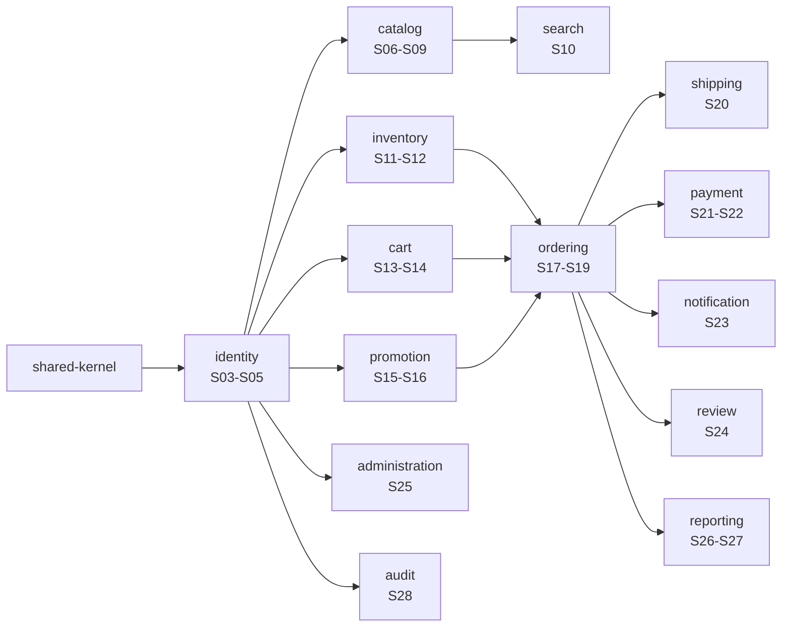

# Release Plan — Enterprise Commerce Platform (ECP)

**Document type:** Release Plan
**Audience:** Product Management, Engineering, Quality Assurance
**Version:** 1.0
**Status:** Draft for stakeholder review
**Related documents:** [`product-backlog.md`](./product-backlog.md) · [`integration-plan.md`](./integration-plan.md) · [`definition-of-done.md`](./definition-of-done.md) · [`scrum-framework.md`](./scrum-framework.md)

---

## 1. Plan

**36 two-week sprints across three releases:** 33 delivery sprints and 3 Integration Hardening sprints. At the assumed velocity in [`scrum-framework.md`](./scrum-framework.md) §4, one backend developer and one frontend developer need about **17 months**.

Two changes can move the date:

| Lever | Effect |
|---|---|
| A second backend developer | The backend lane is the critical path by about ten sprints |
| Cut Release 3 | Ship the viable `Must` set at about Sprint 29; omit 12 `Should` and 4 `Could` stories |

A second frontend developer does **not** move the date because the frontend lane has reserve (§6).

---

## 2. Releases

| Release | Sprints | Delivers | Ends with |
|---|---|---|---|
| **R1 — Transactable Storefront** | S00 – S23 + IH-1, IH-2 | A customer registers, browses, searches, carts, checks out, pays, and tracks a delivery. Operators manage catalog, inventory, promotions, orders, payments and shipments | The purchase path works end to end against the real API |
| **R2 — Operations Console** | S24 – S29 + IH-3 | Reviews, account and role administration, reporting read models and screens, the audit trail, and full contract verification across all 155 operations | All 71 `Must` stories delivered — the viable release of SRS §1.5 |
| **R3 — Discovery, Depth & Launch** | S30 – S32 | The 12 `Should` and 4 `Could` stories, then launch readiness | Verified and unverified claims recorded |

**The `Must` cut line is the end of Sprint 29.** Later work is optional under the Product Owner's MoSCoW assignment.

---

## 3. Sequencing

### 3.1 Backend

```mermaid
flowchart LR
  K["shared-kernel"] --> ID["identity<br/>S03-S05"]
  ID --> CAT["catalog<br/>S06-S09"]
  CAT --> SCH["search<br/>S10"]
  ID --> INV["inventory<br/>S11-S12"]
  ID --> CRT["cart<br/>S13-S14"]
  ID --> PRM["promotion<br/>S15-S16"]
  INV --> ORD["ordering<br/>S17-S19"]
  CRT --> ORD
  PRM --> ORD
  ORD --> SHP["shipping<br/>S20"]
  ORD --> PAY["payment<br/>S21-S22"]
  ORD --> NTF["notification<br/>S23"]
  ORD --> REV["review<br/>S24"]
  ID --> ADM["administration<br/>S25"]
  ORD --> RPT["reporting<br/>S26-S27"]
  ID --> AUD["audit<br/>S28"]
```

The order follows [`Module Dependency Diagram.md`](../SA-docs/02-backend/Module%20Dependency%20Diagram.md) §3. `identity` is first because all twelve other modules call its `AuthorizationService`. `ordering` follows its three dependencies.

`audit` is split. `UC-AUD-03` and `UC-AUD-04` land with `identity` in **S04** because `BR-AUD-02` applies to every entry point. `UC-AUD-01` lands in **S12**. Audit search waits for **S28**.

### 3.2 Frontend

The order follows `app/` → `features/` → `lib/` → `components/` ([`Feature Structure.md`](../SA-docs/03-frontend/Feature%20Structure.md) §2). `lib/api`, `lib/session`, design-system primitives, and route groups come before their consumers.

The frontend can build against the Prism mock before the backend endpoint exists:

| Screen | Frontend builds it | Backend delivers it | Gap |
|---|---|---|---|
| Admin products & categories | S08 | S09 | 1 sprint ahead |
| Checkout funnel | S14–S15 | S17 | 2–3 sprints ahead |
| Order detail & tracking | S17–S18 | S19 | 1–2 sprints ahead |
| Shipping quotes & tracking | S19 | S20 | 1 sprint ahead |
| Admin accounts, roles, orders | S22 | S25 | 3 sprints ahead |
| Reporting screens | S23–S24 | S26–S27 | 3 sprints ahead |
| Audit trail | S25 | S28 | 3 sprints ahead |

Each screen integrates with the real API at the next gate.

---

## 4. The Sprint Map

Each sprint lists both lane loads. `▸ G<n>` marks an end-of-sprint Contract Sync. `IH` sprints carry no story points.

---

### Sprint 00 — Foundation — Build & Toolchain

**Release 1 · Backend 14 pts · Frontend 14 pts**

**Sprint goal.** Both lanes have a build that enforces its own rules.

| Backend lane | Pts |
|---|---:|
| `EN-BUILD-1` Gradle multi-project: 14 subprojects, version catalog, `app` composition root, `bootJar` | 14 |
| **Total** | **14** |

Exit: all fourteen backend subprojects and the empty `app` compile.

| Frontend lane | Pts |
|---|---:|
| `EN-FE-TOOL-1` Tailwind + Ma tokens, shadcn/ui vendored, strict `tsc`, ESLint (boundaries + dependency-cruiser), Prettier, Vitest + Testing Library + axe, Playwright skeleton | 14 |
| *Lane reserve — see §6* | *4* |
| **Total** | **14** |

Exit: every frontend gate runs before screen work starts.

---

### Sprint 01 — Foundation — Architecture Gate & Contract Harness  ▸ **G0**

**Release 1 · Backend 20 pts · Frontend 20 pts**

**Sprint goal.** The architecture gate is real and the contract harness runs.

| Backend lane | Pts |
|---|---:|
| `EN-GATE-1` ArchUnit + JMolecules + `ApplicationModules.verify()`; `package-info.java` allow-lists; planted-violation demo | 13 |
| `EN-DATA-1` PostgreSQL + Kafka in `compose.yaml`; Testcontainers PostgreSQL + JDBC driver | 7 |
| **Total** | **20** |

Exit: ArchUnit fails on a planted violation and passes after its removal.

| Frontend lane | Pts |
|---|---:|
| `EN-FE-API-1` The one fetch client; `openapi-typescript` codegen + build-failing diff; Zod boundary parsing; error-code→screen map; cursor pagination | 14 |
| `EN-MOCK-1` Prism mock harness — `npm run mock:api` off `openapi.yaml`, seeded examples | 6 |
| **Total** | **20** |

Exit: Prism serves `openapi.yaml`; the fetch client returns typed, Zod-parsed data.

**▸ G0 — Contract Sync.** The checklist in [`integration-plan.md`](./integration-plan.md) §3, applied to the domains delivered in this increment.

---

### Sprint 02 — Wire Format & Application Shell

**Release 1 · Backend 20 pts · Frontend 20 pts**

**Sprint goal.** Every response shape a controller will ever return is decided once.

| Backend lane | Pts |
|---|---:|
| `EN-DATA-2` Flyway baseline, per-module table-prefix conventions, migration map | 8 |
| `EN-WIRE-1` Problem+JSON `@RestControllerAdvice`, error-code registry enums, pagination envelope, correlation-id filter | 12 |
| **Total** | **20** |

| Frontend lane | Pts |
|---|---:|
| `EN-FE-SHELL-1` Root layout, CSP nonce, middleware, four route-group layouts, header/footer/account sidebar/admin shell | 14 |
| `EN-FE-DS-1` Design system: Button, Input, Card | 6 |
| **Total** | **20** |

---

### Sprint 03 — Identity — Registration & Sign-in  ▸ **G1**

**Release 1 · Backend 20 pts · Frontend 20 pts**

**Sprint goal.** A customer can register, verify, sign in, and sign out.

| Backend lane | Pts |
|---|---:|
| `US-CUS-01` Register Customer Account | 5 |
| `US-CUS-02` Verify Email Address | 3 |
| `US-CUS-03` Log In | 5 |
| `US-CUS-04` Log Out | 2 |
| `EN-WIRE-2` Redis two-instance topology; cache-aside and rate-limiter infrastructure | 5 |
| **Total** | **20** |

| Frontend lane | Pts |
|---|---:|
| `US-CUS-01` Register Customer Account | 3 |
| `US-CUS-02` Verify Email Address | 2 |
| `US-CUS-03` Log In | 3 |
| `US-CUS-04` Log Out | 1 |
| `EN-FE-DS-2` Design system: Form, EmptyState, Skeleton, Badge, motion + reduced-motion baseline | 11 |
| **Total** | **20** |

Exit: the `(auth)` group applies the same response text to sign-in and reset failures.

**▸ G1 — Contract Sync.** The checklist in [`integration-plan.md`](./integration-plan.md) §3, applied to the domains delivered in this increment.

---

### Sprint 04 — Identity — Session, RBAC & Rate Limit

**Release 1 · Backend 20 pts · Frontend 19 pts**

**Sprint goal.** Authorisation and rate limiting hold on every path.

| Backend lane | Pts |
|---|---:|
| `US-CUS-05` Refresh Authenticated Session | 5 |
| `US-AUD-03` Authorise Request via RBAC | 8 |
| `US-AUD-04` Enforce API Rate Limit | 5 |
| `EN-OBS-1` Structured JSON logging to stdout; management port; liveness/readiness | 2 |
| **Total** | **20** |

`BR-AUD-02` requires one authorisation decision across all entry points.

| Frontend lane | Pts |
|---|---:|
| `US-CUS-05` Refresh Authenticated Session | 5 |
| `US-AUD-03` Authorise Request via RBAC | 2 |
| `US-AUD-04` Enforce API Rate Limit | 2 |
| `EN-FE-API-2` Session custody: `ecp_session` cookie, `/api/csrf` signed double-submit, serialised refresh, `/api/auth/*` | 10 |
| **Total** | **19** |

---

### Sprint 05 — Identity — Account, Addresses & Recovery  ▸ **G2**

**Release 1 · Backend 19 pts · Frontend 19 pts**

**Sprint goal.** A customer owns their account.

| Backend lane | Pts |
|---|---:|
| `US-CUS-06` Change Password | 3 |
| `US-CUS-07` Reset Forgotten Password | 5 |
| `US-CUS-08` Manage Profile | 3 |
| `US-CUS-09` Manage Shipping Addresses | 5 |
| `US-CUS-10` View Purchase History | 3 |
| **Total** | **19** |

| Frontend lane | Pts |
|---|---:|
| `US-CUS-06` Change Password | 2 |
| `US-CUS-07` Reset Forgotten Password | 3 |
| `US-CUS-08` Manage Profile | 3 |
| `US-CUS-09` Manage Shipping Addresses | 5 |
| `US-CUS-10` View Purchase History | 3 |
| `EN-FE-DS-3` Design system: Table, Modal, Tooltip, pagination control | 3 |
| **Total** | **19** |

Ownership failures return `404` and do not reveal the permission check.

**▸ G2 — Contract Sync.** The checklist in [`integration-plan.md`](./integration-plan.md) §3, applied to the domains delivered in this increment.

---

### Sprint 06 — Catalog — Categories, Listings & Variants

**Release 1 · Backend 21 pts · Frontend 17 pts**

**Sprint goal.** The catalog is browsable.

| Backend lane | Pts |
|---|---:|
| `US-CAT-01` Browse Category Tree | 5 |
| `US-CAT-02` Browse Category Product Listing | 5 |
| `US-CAT-04` Select Product Variant | 3 |
| `EN-WIRE-3` Catalog read cache-aside + invalidation keys | 8 |
| **Total** | **21** |

| Frontend lane | Pts |
|---|---:|
| `US-CAT-01` Browse Category Tree | 5 |
| `US-CAT-02` Browse Category Product Listing | 5 |
| `EN-FE-PERF-1` R1 static generation + tag-based cache; web-vitals reporter | 7 |
| *Lane reserve — see §6* | *1* |
| **Total** | **17** |

`/` and `/c/[...slug]` are `R1` static routes; the product grid streams.

---

### Sprint 07 — Catalog — Product Detail & Read Cache  ▸ **G3**

**Release 1 · Backend 18 pts · Frontend 20 pts**

**Sprint goal.** The product page is the reference implementation of `NFR-AVAIL-02`.

**Approved pull-forward and scope boundary.** Sprint 07 includes variant
selection only: `?variant=<id>` is a shareable read-state and there is no cart
mutation or add-to-cart control. Cart writes, guest-cart identity, and cart
error handling remain exclusively Sprint 13 work. The active-promotion period
and unavailable-product category recovery are G3 contract-amendment
dependencies; estimates, `S07`, `G3`, and milestone dates are unchanged.

| Backend lane | Pts |
|---|---:|
| `US-CAT-03` View Product Details | 5 |
| `EN-DATA-3` Catalog schema, indexes, and cursor-pagination query design | 8 |
| `EN-OBS-2` Micrometer meters named in Deployment §8 | 5 |
| **Total** | **18** |

| Frontend lane | Pts |
|---|---:|
| `US-CAT-03` View Product Details | 8 |
| `US-CAT-04` Select Product Variant | 3 |
| `EN-FE-SHELL-2` `loading.tsx` / `error.tsx` / `not-found.tsx` placement and `<Suspense>` discipline per Routing §8 | 9 |
| **Total** | **20** |

The page has four independent boundaries. A reviews failure does not fail the page.

**▸ G3 — Contract Sync.** The checklist in [`integration-plan.md`](./integration-plan.md) §3, applied to the domains delivered in this increment.

---

### Sprint 08 — Event Backbone — Outbox & Kafka

**Release 1 · Backend 21 pts · Frontend 13 pts**

**Sprint goal.** No accepted business event can be silently lost.

| Backend lane | Pts |
|---|---:|
| `EN-EVENT-1` Transactional outbox table + polling relay + event envelope + topic catalogue | 21 |
| **Total** | **21** |

All later event work depends on `EN-EVENT-1`.

| Frontend lane | Pts |
|---|---:|
| `US-ADM-01` Manage Products | 8 |
| `US-ADM-02` Manage Categories | 5 |
| *Lane reserve — see §6* | *5* |
| **Total** | **13** |

The admin console is built against the mock one sprint before the backend.

---

### Sprint 09 — Catalog Administration  ▸ **G4**

**Release 1 · Backend 21 pts · Frontend 15 pts**

**Sprint goal.** An operator can manage the catalog, and the storefront notices.

| Backend lane | Pts |
|---|---:|
| `US-ADM-01` Manage Products | 8 |
| `US-ADM-02` Manage Categories | 5 |
| `EN-EVENT-2` Catalog events published; consumer idempotency and ordering guards | 8 |
| **Total** | **21** |

| Frontend lane | Pts |
|---|---:|
| `US-ADM-05` Manage Inventory Adjustments | 3 |
| `EN-FE-API-3` `/api/internal/revalidate` signed callback; event-driven ISR invalidation | 8 |
| `EN-FE-DS-4` Admin console shell: dense navigation, filtered-list→detail→action pattern | 4 |
| *Lane reserve — see §6* | *3* |
| **Total** | **15** |

`/api/internal/revalidate` is the only ISR invalidation path.

**▸ G4 — Contract Sync.** The checklist in [`integration-plan.md`](./integration-plan.md) §3, applied to the domains delivered in this increment.

---

### ⛓ IH-1 — Session & Catalog

**Release 1 · both lanes · no new stories · no story points.**

**Goal.** Session and catalog, end to end.

| # | Must be demonstrated | Source |
|---:|---|---|
| 1 | No access token reaches the browser | `Frontend Architecture.md` §8 |
| 2 | CSRF required on every cookie-authenticated write | `Frontend Architecture.md` §4.3 |
| 3 | Refresh is serialised under concurrent requests | `Frontend Architecture.md` §4.2 |
| 4 | CSP served unwidened per route group; `(admin)` is `SameSite=Strict` | `Routing.md` §2, §11 |
| 5 | A `CUSTOMER` reaching `/admin` sees an empty shell and `403`s — not a middleware permission check | `Routing.md` §11, `Security.md` T9 |
| 6 | Catalog write → event → `/api/internal/revalidate` → storefront updates within seconds | `ADR-0038` |
| 7 | `R1` routes are genuinely static; `(account)`/`(admin)` carry `noindex` and are absent from the sitemap | `Routing.md` §3 |
| 8 | One correlation id traced REST → outbox → Kafka → projection | `NFR-OBS-03` |
| 9 | Permission-matrix cells for every identity and catalog operation | `Permission Matrix.md` |

**Exit criterion.** Every row above passes, or the failure is a logged, sized backlog item with a named sprint. A row is never marked passed on a local workaround.

---

### Sprint 10 — Search — Keyword, Facets & Projection

**Release 1 · Backend 21 pts · Frontend 20 pts**

**Sprint goal.** Search answers from its own read store.

| Backend lane | Pts |
|---|---:|
| `US-SCH-01` Search Products by Keyword | 8 |
| `US-SCH-03` Filter and Sort Search Results | 5 |
| `EN-EVENT-3` Elasticsearch search read model, projected from catalog events | 8 |
| **Total** | **21** |

| Frontend lane | Pts |
|---|---:|
| `US-SCH-01` Search Products by Keyword | 5 |
| `US-SCH-03` Filter and Sort Search Results | 5 |
| `EN-FE-API-4` URL search-param encoding contract (ADR-0037); R2 streamed sections | 10 |
| **Total** | **20** |

`/search` uses `R2`, streamed results, and the URL search-param contract.

---

### Sprint 11 — Inventory — The Reservation Model  ▸ **G5**

**Release 1 · Backend 18 pts · Frontend 9 pts**

**Sprint goal.** The oversell guarantee is proved, not asserted.

| Backend lane | Pts |
|---|---:|
| `US-INV-01` Reserve Stock for an Order | 8 |
| `US-INV-02` Release Reserved Stock | 5 |
| `US-INV-03` Commit Reserved Stock on Fulfilment | 5 |
| **Total** | **18** |

Exit for `NFR-REL-03`: N threads race one SKU against PostgreSQL without oversell.

| Frontend lane | Pts |
|---|---:|
| `US-INV-03` Commit Reserved Stock on Fulfilment | 2 |
| `EN-FE-DS-5` Availability display — advisory and labelled — across catalog, cart and checkout | 7 |
| *Lane reserve — see §6* | *9* |
| **Total** | **9** |

Availability is advisory and labelled. It never blocks add-to-cart.

**▸ G5 — Contract Sync.** The checklist in [`integration-plan.md`](./integration-plan.md) §3, applied to the domains delivered in this increment.

---

### Sprint 12 — Inventory — Adjustments, Levels & Audit Entries

**Release 1 · Backend 21 pts · Frontend 13 pts**

**Sprint goal.** Stock is adjustable and every command is audited.

| Backend lane | Pts |
|---|---:|
| `US-INV-04` Adjust Inventory | 5 |
| `US-INV-05` View Inventory Levels | 5 |
| `US-ADM-05` Manage Inventory Adjustments | 3 |
| `US-AUD-01` Record Audit Entry | 8 |
| **Total** | **21** |

`UC-AUD-01` applies to every command path.

| Frontend lane | Pts |
|---|---:|
| `US-INV-04` Adjust Inventory | 3 |
| `US-INV-05` View Inventory Levels | 5 |
| `EN-FE-DS-6` Order-status discriminated union; exhaustive transition rendering | 5 |
| *Lane reserve — see §6* | *5* |
| **Total** | **13** |

An unhandled order status fails the build.

---

### Sprint 13 — Cart — Lines & Guest Cart  ▸ **G6**

**Release 1 · Backend 20 pts · Frontend 13 pts**

**Sprint goal.** A guest can build a cart.

| Backend lane | Pts |
|---|---:|
| `US-CRT-01` Add Item to Cart | 5 |
| `US-CRT-02` Update Cart Item Quantity | 3 |
| `US-CRT-03` Remove Item from Cart | 2 |
| `US-CRT-04` View Cart | 5 |
| `EN-WIRE-4` Guest-cart cookie handling and cart identity resolution | 5 |
| **Total** | **20** |

| Frontend lane | Pts |
|---|---:|
| `US-CRT-01` Add Item to Cart | 3 |
| `US-CRT-02` Update Cart Item Quantity | 3 |
| `US-CRT-03` Remove Item from Cart | 2 |
| `US-CRT-04` View Cart | 5 |
| *Lane reserve — see §6* | *5* |
| **Total** | **13** |

Optimistic quantity edits revert visibly on failure.

**▸ G6 — Contract Sync.** The checklist in [`integration-plan.md`](./integration-plan.md) §3, applied to the domains delivered in this increment.

---

### Sprint 14 — Cart — Merge, Expiry & Checkout Funnel (FE)

**Release 1 · Backend 21 pts · Frontend 11 pts**

**Sprint goal.** A guest cart survives sign-in, and an abandoned one expires.

| Backend lane | Pts |
|---|---:|
| `US-CRT-05` Merge Guest Cart on Login | 5 |
| `US-CRT-06` Expire Inactive Cart | 3 |
| `EN-EVENT-4` Consumer obligations: retry, dead-lettering, replay from outbox | 8 |
| `EN-DATA-4` L5 persistence & concurrency suite scaffolding (schema-per-test-class) | 5 |
| **Total** | **21** |

| Frontend lane | Pts |
|---|---:|
| `US-CRT-05` Merge Guest Cart on Login | 3 |
| `US-ORD-01` Initiate Checkout | 3 |
| `US-ORD-02` Provide Shipping and Billing Information | 5 |
| *Lane reserve — see §6* | *7* |
| **Total** | **11** |

The checkout funnel uses the mock three sprints before its endpoints.

---

### Sprint 15 — Promotion — Vouchers & Redemption  ▸ **G7**

**Release 1 · Backend 21 pts · Frontend 13 pts**

**Sprint goal.** A voucher is validated and redeemed without over-redemption.

| Backend lane | Pts |
|---|---:|
| `US-PRM-01` Create Promotion | 8 |
| `US-PRM-02` Validate Voucher Code | 5 |
| `US-PRM-03` Apply Promotion to Order | 8 |
| **Total** | **21** |

`UC-PRM-02` E7 uses the same concurrency control as `BR-INV-01`.

| Frontend lane | Pts |
|---|---:|
| `US-ORD-03` Apply Voucher at Checkout | 3 |
| `US-ORD-04` Review Order Summary | 5 |
| `US-PRM-02` Validate Voucher Code | 2 |
| `US-PRM-03` Apply Promotion to Order | 3 |
| *Lane reserve — see §6* | *5* |
| **Total** | **13** |

`ECP-PRM-4090` fails the voucher field, not checkout.

**▸ G7 — Contract Sync.** The checklist in [`integration-plan.md`](./integration-plan.md) §3, applied to the domains delivered in this increment.

---

### Sprint 16 — Promotion — Flash Sale & Lifecycle

**Release 1 · Backend 21 pts · Frontend 10 pts**

**Sprint goal.** Promotions have a lifecycle.

| Backend lane | Pts |
|---|---:|
| `US-PRM-04` Launch Flash Sale | 5 |
| `US-PRM-05` Deactivate or Expire Promotion | 3 |
| `EN-CONTRACT-1` Contract test spec→code across delivered operations | 13 |
| **Total** | **21** |

| Frontend lane | Pts |
|---|---:|
| `US-PRM-01` Create Promotion | 5 |
| `US-PRM-04` Launch Flash Sale | 3 |
| `US-PRM-05` Deactivate or Expire Promotion | 2 |
| *Lane reserve — see §6* | *8* |
| **Total** | **10** |

---

### Sprint 17 — Ordering — Checkout Funnel  ▸ **G8**

**Release 1 · Backend 18 pts · Frontend 10 pts**

**Sprint goal.** Checkout collects everything an order needs.

| Backend lane | Pts |
|---|---:|
| `US-ORD-01` Initiate Checkout | 5 |
| `US-ORD-02` Provide Shipping and Billing Information | 5 |
| `US-ORD-03` Apply Voucher at Checkout | 3 |
| `US-ORD-04` Review Order Summary | 5 |
| **Total** | **18** |

| Frontend lane | Pts |
|---|---:|
| `US-ORD-05` Place Order | 5 |
| `US-ORD-06` View Order Details | 5 |
| *Lane reserve — see §6* | *8* |
| **Total** | **10** |

**▸ G8 — Contract Sync.** The checklist in [`integration-plan.md`](./integration-plan.md) §3, applied to the domains delivered in this increment.

---

### Sprint 18 — Ordering — Place Order (the Partnership)

**Release 1 · Backend 18 pts · Frontend 10 pts**

**Sprint goal.** Placing an order is atomic across three modules.

| Backend lane | Pts |
|---|---:|
| `US-ORD-05` Place Order | 13 |
| `EN-EVENT-5` Order lifecycle events on the outbox; ordering topic partitioning | 5 |
| **Total** | **18** |

`StockReservationPort` and `PromotionRedemptionPort` run in one transaction. Tests inject faults at each step.

| Frontend lane | Pts |
|---|---:|
| `US-ORD-07` Track Order | 3 |
| `US-ORD-08` Cancel Order | 2 |
| `US-ORD-10` Advance Order Status | 5 |
| *Lane reserve — see §6* | *8* |
| **Total** | **10** |

`placeOrder` creates one `Idempotency-Key` per attempt and never regenerates it.

---

### Sprint 19 — Ordering — Lifecycle & Admin Orders  ▸ **G9**

**Release 1 · Backend 19 pts · Frontend 7 pts**

**Sprint goal.** An order has a life after placement.

| Backend lane | Pts |
|---|---:|
| `US-ORD-06` View Order Details | 3 |
| `US-ORD-07` Track Order | 3 |
| `US-ORD-08` Cancel Order | 5 |
| `US-ORD-10` Advance Order Status | 8 |
| **Total** | **19** |

| Frontend lane | Pts |
|---|---:|
| `US-SHP-01` Calculate Shipping Fee | 2 |
| `US-SHP-05` View Shipment Tracking | 5 |
| *Lane reserve — see §6* | *11* |
| **Total** | **7** |

**▸ G9 — Contract Sync.** The checklist in [`integration-plan.md`](./integration-plan.md) §3, applied to the domains delivered in this increment.

---

### Sprint 20 — Shipping — Quotes, Shipments & Delivery

**Release 1 · Backend 21 pts · Frontend 8 pts**

**Sprint goal.** Goods move and the customer can see it.

| Backend lane | Pts |
|---|---:|
| `US-SHP-01` Calculate Shipping Fee | 5 |
| `US-SHP-03` Create Shipment | 5 |
| `US-SHP-04` Record Carrier Tracking Update | 5 |
| `US-SHP-05` View Shipment Tracking | 3 |
| `US-SHP-06` Confirm Delivery | 3 |
| **Total** | **21** |

| Frontend lane | Pts |
|---|---:|
| `US-PAY-01` Select Payment Method | 3 |
| `US-SHP-03` Create Shipment | 3 |
| `US-SHP-06` Confirm Delivery | 2 |
| *Lane reserve — see §6* | *10* |
| **Total** | **8** |

---

### ⛓ IH-2 — The Money Path

**Release 1 · both lanes · no new stories · no story points.**

**Goal.** The money path — the sprint that decides whether `P6`, `P7` and `P8` are solved.

| # | Must be demonstrated | Source |
|---:|---|---|
| 1 | Concurrent submission of one `Idempotency-Key` yields one order | `NFR-REL-02`, `Integration Contract.md` §2.2 |
| 2 | N threads racing one SKU: successes equal stock, every loser sees a clean rejection | `NFR-REL-03`, `ADR-0011` |
| 3 | Fault injected after reservation, after redemption, after order insert, after outbox write — fully applied or fully absent, never partial | `NFR-REL-01` |
| 4 | `ECP-INV-4091` renders as "sold out", visibly different from "try again" | `Error Codes.md`, `Routing.md` §4.3 |
| 5 | A timeout is never retried automatically; the customer is told the outcome is unknown and offered one explicit retry | `ADR-0023` §4 |
| 6 | Nothing in the checkout funnel is cached and nothing is optimistic | `NFR-PERF-06` |
| 7 | Another customer's order returns `404`, and the screen never explains why | `Integration Contract.md` §2.1, `Routing.md` §6 |
| 8 | Provider callback signature verified; a forged callback changes nothing | `Security.md` |
| 9 | Retained-outbox replay reconstructs the payment read model | `Backend Architecture.md` §3.4.5 |

**Exit criterion.** Every row above passes, or the failure is a logged, sized backlog item with a named sprint. A row is never marked passed on a local workaround.

---

### Sprint 21 — Payment — Authorise & Provider Callback  ▸ **G10**

**Release 1 · Backend 19 pts · Frontend 23 pts**

**Sprint goal.** Money can be taken.

| Backend lane | Pts |
|---|---:|
| `US-PAY-01` Select Payment Method | 3 |
| `US-PAY-02` Authorise Online Payment | 8 |
| `US-PAY-03` Handle Payment Gateway Result | 8 |
| **Total** | **19** |

The signed provider callback terminates at `nginx` and never passes through `ecp-web`.

| Frontend lane | Pts |
|---|---:|
| `US-PAY-02` Authorise Online Payment | 5 |
| `US-PAY-03` Handle Payment Gateway Result | 3 |
| `US-REV-01` Submit Product Review | 5 |
| `US-REV-04` View Product Reviews | 5 |
| `US-NTF-03` View In-App Notifications | 5 |
| **Total** | **23** |

`/checkout/payment/processing` polls. The provider return is a route handler, not a page.

**▸ G10 — Contract Sync.** The checklist in [`integration-plan.md`](./integration-plan.md) §3, applied to the domains delivered in this increment.

---

### Sprint 22 — Payment — Settle, Retry & Refund

**Release 1 · Backend 20 pts · Frontend 21 pts**

**Sprint goal.** Money can be settled, retried, and given back.

| Backend lane | Pts |
|---|---:|
| `US-PAY-04` Settle Cash On Delivery Payment | 5 |
| `US-PAY-05` Retry Failed Payment | 5 |
| `US-PAY-06` Process Refund | 5 |
| `EN-OBS-3` Correlation id traced REST → outbox → Kafka → projection | 5 |
| **Total** | **20** |

The payment flow includes the unmatched-payment reconciliation queue.

| Frontend lane | Pts |
|---|---:|
| `US-PAY-04` Settle Cash On Delivery Payment | 2 |
| `US-PAY-05` Retry Failed Payment | 3 |
| `US-PAY-06` Process Refund | 3 |
| `US-ADM-03` Manage Customer Accounts | 5 |
| `US-ADM-04` Manage Orders | 5 |
| `US-ADM-06` Manage User Roles | 3 |
| **Total** | **21** |

`/admin/payments` — the one admin list that should be empty in normal operation.

---

### Sprint 23 — Notification  ▸ **G11**

**Release 1 · Backend 21 pts · Frontend 13 pts**

**Sprint goal.** The platform tells people what happened.

| Backend lane | Pts |
|---|---:|
| `US-NTF-01` Deliver Email Notification | 8 |
| `US-NTF-02` Deliver In-App Notification | 5 |
| `US-NTF-03` View In-App Notifications | 3 |
| `EN-BENCH-1` `bench/smoke.js` — k6 scenarios S1–S5 reconciled against `openapi.yaml` | 5 |
| **Total** | **21** |

Email and in-app delivery are Kafka consumers. The k6 script uses the delivered endpoints.

| Frontend lane | Pts |
|---|---:|
| `US-RPT-01` View Revenue Report | 5 |
| `US-RPT-02` View Product Performance Report | 3 |
| `US-RPT-05` View Order and Conversion Statistics | 5 |
| *Lane reserve — see §6* | *5* |
| **Total** | **13** |

**▸ G11 — Contract Sync.** The checklist in [`integration-plan.md`](./integration-plan.md) §3, applied to the domains delivered in this increment.

---

### Sprint 24 — Review

**Release 2 · Backend 18 pts · Frontend 11 pts**

**Sprint goal.** Customers can review what they bought.

| Backend lane | Pts |
|---|---:|
| `US-REV-01` Submit Product Review | 5 |
| `US-REV-04` View Product Reviews | 5 |
| `EN-EVENT-6` Review rating-summary projection; MongoDB read-model idempotency tests | 8 |
| **Total** | **18** |

| Frontend lane | Pts |
|---|---:|
| `US-RPT-04` View Inventory Report | 3 |
| `EN-CI-3` Frontend CI stages: type check, lint, boundary + cycle check, codegen drift | 8 |
| *Lane reserve — see §6* | *7* |
| **Total** | **11** |

---

### Sprint 25 — Administration — Accounts, Roles & Bulk Actions  ▸ **G12**

**Release 2 · Backend 20 pts · Frontend 13 pts**

**Sprint goal.** Operators can run the business.

| Backend lane | Pts |
|---|---:|
| `US-ADM-03` Manage Customer Accounts | 5 |
| `US-ADM-04` Manage Orders | 5 |
| `US-ADM-06` Manage User Roles | 5 |
| `EN-CONTRACT-2` Contract test code→spec; undocumented endpoint fails the build | 5 |
| **Total** | **20** |

| Frontend lane | Pts |
|---|---:|
| `US-AUD-02` Search Audit Trail | 5 |
| `EN-FE-E2E-1` Playwright purchase path — the whole thin suite | 8 |
| *Lane reserve — see §6* | *5* |
| **Total** | **13** |

The frontend e2e suite runs against the real API.

**▸ G12 — Contract Sync.** The checklist in [`integration-plan.md`](./integration-plan.md) §3, applied to the domains delivered in this increment.

---

### Sprint 26 — Reporting — Read Models & Core Reports

**Release 2 · Backend 18 pts · Frontend 0 pts**

**Sprint goal.** Reporting answers from MongoDB, never from the write model.

| Backend lane | Pts |
|---|---:|
| `US-RPT-01` View Revenue Report | 8 |
| `US-RPT-02` View Product Performance Report | 5 |
| `US-RPT-05` View Order and Conversion Statistics | 5 |
| **Total** | **18** |

`CON-06`: reporting queries must not compete with transactions.

| Frontend lane | Pts |
|---|---:|
| *Lane reserve — see §6* | *18* |
| **Total** | **0** |

---

### Sprint 27 — Reporting — Inventory Report, Lag & CI  ▸ **G13**

**Release 2 · Backend 21 pts · Frontend 13 pts**

**Sprint goal.** Every reporting screen shows its own lag.

| Backend lane | Pts |
|---|---:|
| `US-RPT-04` View Inventory Report | 5 |
| `EN-DATA-5` MongoDB reporting read models; projection lag measurement against NFR-PERF-06 | 8 |
| `EN-CI-1` CI stages 1–4 of Testing Strategy §9 | 8 |
| **Total** | **21** |

Each reporting screen shows projection age. `NFR-PERF-06` allows up to five minutes.

| Frontend lane | Pts |
|---|---:|
| `EN-FE-E2E-2` Accessibility sweep: axe in component tests, token-contrast assertions, manual screen-reader pass | 13 |
| *Lane reserve — see §6* | *5* |
| **Total** | **13** |

**▸ G13 — Contract Sync.** The checklist in [`integration-plan.md`](./integration-plan.md) §3, applied to the domains delivered in this increment.

---

### Sprint 28 — Audit Trail & Contract Completeness

**Release 2 · Backend 18 pts · Frontend 6 pts**

**Sprint goal.** The audit trail is searchable and append-only.

| Backend lane | Pts |
|---|---:|
| `US-AUD-02` Search Audit Trail | 5 |
| `EN-CONTRACT-3` Permission-matrix test generated from spec × matrix, all 155 operations | 13 |
| **Total** | **18** |

The UI and data model have no audit edit or delete operation. The permission-matrix test covers all 155 operations.

| Frontend lane | Pts |
|---|---:|
| `EN-FE-PERF-2` Per-route-class budget gate (ADR-0039) + Lighthouse CI | 6 |
| *Lane reserve — see §6* | *12* |
| **Total** | **6** |

Frontend reserve.

---

### Sprint 29 — Release 2 Stabilisation  ▸ **G14**

**Release 2 · Backend 21 pts · Frontend 8 pts**

**Sprint goal.** Release 2 is stabilised and the event backbone is proved under failure.

| Backend lane | Pts |
|---|---:|
| `EN-CI-2` CI stages 5–7; security, dependency and image scanning | 8 |
| `EN-BENCH-2` L6 event-delivery suite; broker killed mid-relay; read-model rebuild drill | 8 |
| `EN-OBS-4` NFR-AVAIL-02 dependency-failure harness (stop ES/Mongo, assert purchase path) | 5 |
| **Total** | **21** |

Exit: after a broker failure mid-relay, the outbox drains without manual repair and the read model can be rebuilt.

| Frontend lane | Pts |
|---|---:|
| `EN-FE-E2E-3` Release 2 regression walk — every `(admin)` route driven against the real API | 8 |
| *Lane reserve — see §6* | *10* |
| **Total** | **8** |

**▸ G14 — Contract Sync.** The checklist in [`integration-plan.md`](./integration-plan.md) §3, applied to the domains delivered in this increment.

---

### ⛓ IH-3 — Whole System

**Release 2 · both lanes · no new stories · no story points.**

**Goal.** Verify the whole system and record every unverified claim.

| # | Must be demonstrated | Source |
|---:|---|---|
| 1 | The full security verification matrix, every row | `Security.md` §12.1 |
| 2 | Elasticsearch and MongoDB stopped; browse, cart, checkout and payment continue | `NFR-AVAIL-02` |
| 3 | Provider stub adapters fail and time out on demand; the platform degrades rather than breaks | `NFR-AVAIL-03` |
| 4 | Projection lag asserted under an event burst against the five-minute bound | `NFR-PERF-06` |
| 5 | k6 smoke run against the **`bootJar`**, not a Gradle `bootRun` | Testing Strategy §7.2 rule 4 |
| 6 | Every Micrometer meter named in `Deployment Diagram.md` §8 exists | `NFR-OBS-04` |
| 7 | Every business rule in SRS §4 has an L1 test naming its `BR-` id | Testing Strategy §10 |
| 8 | Every `Must` use case's exception flows are covered, not only its main flow | Testing Strategy §10 |
| 9 | `AC-05` and `AC-06` recorded as **unverified**, not as in progress | Testing Strategy §11 |

**Exit criterion.** Every row above passes, or the failure is a logged, sized backlog item with a named sprint. A row is never marked passed on a local workaround.

---

### Sprint 30 — Release 3 — Discovery Should/Could Stories

**Release 3 · Backend 18 pts · Frontend 17 pts**

**Sprint goal.** Discovery gets its `Should` and `Could` capability.

| Backend lane | Pts |
|---|---:|
| `US-CAT-05` View Featured Categories | 2 |
| `US-SCH-02` Search Suggestions and Auto-complete | 5 |
| `US-SCH-04` View Popular and Recent Keywords | 3 |
| `US-SCH-05` View Related and Frequently-Bought-Together | 5 |
| `US-SCH-06` View Trending Products and New Arrivals | 3 |
| **Total** | **18** |

| Frontend lane | Pts |
|---|---:|
| `US-CAT-05` View Featured Categories | 3 |
| `US-SCH-02` Search Suggestions and Auto-complete | 5 |
| `US-SCH-04` View Popular and Recent Keywords | 3 |
| `US-SCH-05` View Related and Frequently-Bought-Together | 3 |
| `US-SCH-06` View Trending Products and New Arrivals | 3 |
| *Lane reserve — see §6* | *1* |
| **Total** | **17** |

Recommendation rail failures do not surface a customer error.

---

### Sprint 31 — Release 3 — Cart, Orders & Personalisation  ▸ **G15**

**Release 3 · Backend 21 pts · Frontend 15 pts**

**Sprint goal.** Wishlist, returns, delivery estimates, and personalisation.

| Backend lane | Pts |
|---|---:|
| `US-SCH-07` Receive Personalised Recommendations | 5 |
| `US-CRT-07` Manage Wishlist | 5 |
| `US-CRT-08` Move Wishlist Item to Cart | 3 |
| `US-ORD-09` Request Return | 5 |
| `US-SHP-02` Estimate Delivery Date | 3 |
| **Total** | **21** |

| Frontend lane | Pts |
|---|---:|
| `US-SCH-07` Receive Personalised Recommendations | 3 |
| `US-CRT-07` Manage Wishlist | 5 |
| `US-CRT-08` Move Wishlist Item to Cart | 2 |
| `US-ORD-09` Request Return | 3 |
| `US-SHP-02` Estimate Delivery Date | 2 |
| *Lane reserve — see §6* | *3* |
| **Total** | **15** |

The personalised rail streams as the only dynamic section in its static page.

**▸ G15 — Contract Sync.** The checklist in [`integration-plan.md`](./integration-plan.md) §3, applied to the domains delivered in this increment.

---

### Sprint 32 — Release 3 — Reviews, Reporting & Launch Readiness  ▸ **RR**

**Release 3 · Backend 23 pts · Frontend 19 pts**

**Sprint goal.** The release is ready and its unverified claims are stated as unverified.

| Backend lane | Pts |
|---|---:|
| `US-REV-02` Edit Own Review | 3 |
| `US-REV-03` Delete Own Review | 2 |
| `US-REV-05` Moderate Review | 5 |
| `US-NTF-04` Manage Notification Preferences | 3 |
| `US-RPT-03` View Customer Report | 5 |
| `US-RPT-06` Export Report | 5 |
| **Total** | **23** |

| Frontend lane | Pts |
|---|---:|
| `US-REV-02` Edit Own Review | 3 |
| `US-REV-03` Delete Own Review | 2 |
| `US-REV-05` Moderate Review | 3 |
| `US-NTF-04` Manage Notification Preferences | 3 |
| `US-RPT-03` View Customer Report | 3 |
| `US-RPT-06` Export Report | 5 |
| **Total** | **19** |

`AC-05` and `AC-06` remain unverified pending the load rig (Testing Strategy §11).

**▸ Release Readiness Review** — the `AC-01`–`AC-06` table of [`definition-of-done.md`](./definition-of-done.md) §6, completed honestly.

---

## 5. Gates at a Glance

| Gate | End of | Domains verified against the real API |
|---|---|---|
| `G0` | S01 | The walking skeleton — Prism mock, typed fetch client, ArchUnit gate |
| `G1` | S03 | Registration, verification, sign-in, sign-out |
| `G2` | S05 | Session, RBAC, rate limiting, account, addresses |
| `G3` | S07 | Category tree, listings, variants, product detail |
| **IH-1** | after S09 | **Session and catalog, end to end** |
| `G4` | S09 | Catalog administration, event-driven revalidation |
| `G5` | S11 | Search, inventory reservation |
| `G6` | S13 | Inventory adjustments, cart lines |
| `G7` | S15 | Cart merge and expiry, voucher validation |
| `G8` | S17 | Promotion lifecycle, checkout funnel |
| `G9` | S19 | Order placement, order lifecycle |
| **IH-2** | after S20 | **The money path** |
| `G10` | S21 | Shipping, payment authorisation |
| `G11` | S23 | Payment settlement and refunds, notification |
| `G12` | S25 | Review, administration |
| `G13` | S27 | Reporting read models and screens |
| **IH-3** | after S29 | **The whole system** |
| `G14` | S29 | Audit trail, contract completeness |
| `G15` | S31 | Release 3 `Should` stories |
| **RR** | S32 | Release Readiness Review |

There are fifteen Contract Syncs and three Integration Hardening sprints. `G0`–`G4` have shorter intervals because they set session and caching contracts.

---

## 6. Frontend reserve

The frontend lane has **452 points against 660 sprint-capacity points**. Most sprints have 4–6 reserve points; S24–S29 have more. Use reserve in this order:

1. Integrate mocked frontend work when a backend story slips.
2. Prepare the next increment against the mock (§3.2).
3. Extend the design system beyond the 38 `EN-FE-DS` points ([`UI Design System.md`](../SA-docs/03-frontend/UI%20Design%20System.md)).
4. Run manual screen-reader tests required by [`ADR-0026`](../SA-docs/01-system/ADR/ADR-0026-motion-and-accessibility-baseline.md).

The frontend developer does not use reserve for backend stories. The module allow-lists, ArchUnit rules, `NFR-REL-01`/`-03` suites, and Partnership boundary require backend ownership ([`Module Dependency Diagram.md`](../SA-docs/02-backend/Module%20Dependency%20Diagram.md) §8).

---

## 7. Schedule risks

| # | Risk | Effect | Response |
|---|---|---|---|
| R1 | S08 is one 21-point outbox enabler required by later sprints | A slip delays downstream work | Schedule it alone; IH-1 absorbs overflow before search projection starts |
| R2 | S18 order placement is a 13-point story across three modules | Highest estimate variance | Build its ports in S11, S14, and S16; run fault injection in S18 |
| R3 | The team has no dedicated Scrum Master or QA | Delivery pressure may weaken gates | Make gates build-failing under [`ADR-0018`](../SA-docs/01-system/ADR/ADR-0018-architecture-governance-ci-gate.md) |
| R4 | 20 points/lane/sprint is assumed, not measured | Every date depends on it | Re-baseline after S03 (§8); keep sprint order |
| R5 | Event placement, contract-test tool, CI provider, and k6 remain `Proposed` | Late changes may invalidate work | Decide before S16, S27, and S23 as applicable |
| R6 | Payment and carrier use stubs; developers have no live credentials ([`Deployment Diagram.md`](../SA-docs/01-system/Deployment%20Diagram.md) §7) | Real provider behavior stays unverified until staging | Keep provider ports; test stub failure modes in IH-2 |
| R7 | The load rig is deferred | `NFR-SCAL-01`–`06`, `NFR-PERF-05`, `AC-05`, and `AC-06` stay unverified | Use the five triggers in Testing Strategy §7.9; keep the claims unverified at S32 |

---

## 8. Re-baselining

**After Sprint 03**, replace assumed velocity with measured velocity and reissue this document. Apply two rules:

- Keep the sprint order. It follows the module graph and layer model; only dates move.
- Keep all `Must` stories. A lower velocity moves the Release 2 date. Only the Product Owner can cut scope.
