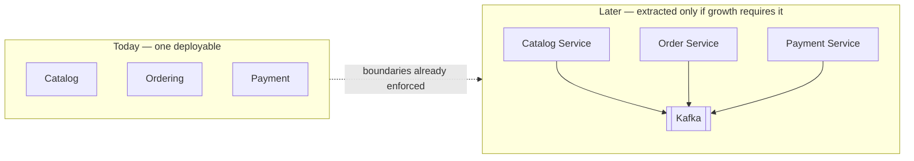

# ADR-0002 — Modular Monolith as the Deployment Unit

**Document type:** Architecture Decision Record
**Status:** Accepted
**Date:** 2026-09-06
**Deciders:** Solution Architecture
**Traces to:** `P1` · `P14` · `CON-08` · `CON-09` · `NFR-MAINT-06`
**Related documents:** [Solution Architecture](../Solution%20Architecture.md) · [Domain Model](../../02-backend/Domain%20Model.md) · [SRS](../../../BA-docs/srs.md)

---

## 1. Context and Problem Statement

The platform spans twelve bounded contexts ([`Domain Model.md`](../../02-backend/Domain%20Model.md) §4) and must let new business capabilities — loyalty, recommendation, chat support, marketplace — be added without deep changes to Ordering, Payment, or Inventory (`P1`). It must also let delivery teams working in different domains avoid blocking each other (`P14`). Both are classically cited as reasons to build microservices.

Against that, `CON-09` is unambiguous: *"The platform remains a modular monolith in this release; microservice extraction is a later option, not a deliverable."* And `CON-08` requires the architecture to *support* gradual migration toward distributed services without mandating it now.

The question is therefore not "monolith or microservices" in the abstract. It is: **what deployment topology delivers `P1` and `P14` at today's scale while leaving `CON-08`'s door open?**

The scale this is sized against is concrete (SRS §6): ≥ 10,000 products (`NFR-SCAL-01`), ≥ 100,000 customers (`NFR-SCAL-02`), thousands of orders per day (`NFR-SCAL-03`), thousands of concurrent customers (`NFR-SCAL-04`), and 10× median throughput at peak (`NFR-SCAL-06`, assumption **[A-04]**).

## 2. Decision Drivers

- `CON-09` fixes the release-scope answer; the architecture must comply, not relitigate.
- `P7` and `BR-ORD-02` require order creation and stock reservation to be indivisible. `Domain Model.md` §5.1 satisfies this with **one local database transaction across three aggregates in three contexts** — which is available in a single deployable and is not available across service boundaries without a saga.
- `NFR-MAINT-06` (Should) — domain boundaries must be drawn so a domain *could* later be deployed separately without redrawing them.
- `NFR-AVAIL-01` requires 99.9% monthly on the purchase path (assumption **[A-12]**). Distributed systems add failure modes — partial failure, network partition, version skew — that a single deployable does not have.

## 3. Considered Options

**Option 1 — Modular monolith: one deployable, enforced internal module boundaries.** *(chosen)*

- **Pros:** The Order-Placement Partnership works as a plain local transaction, so `BR-ORD-02` needs no compensating-action machinery today. One build, one deploy, one log stream, one transaction manager. Module boundaries can still be enforced structurally rather than by convention. Satisfies `CON-09` directly.
- **Cons:** Modules cannot scale independently at the process level — a hot Catalog scales the whole application with it. A single deployment failure affects every context. Boundary erosion is possible unless mechanically prevented (addressed by [ADR-0006](./ADR-0006-spring-modulith-module-boundaries.md) and [ADR-0018](./ADR-0018-architecture-governance-ci-gate.md)).

**Option 2 — Microservices from day one, one service per bounded context.**

- **Pros:** True independent deployment and scaling; team autonomy enforced by the network; the end state `CON-08` contemplates, reached without a migration.
- **Cons:** Directly violates `CON-09`. Turns `BR-ORD-02`'s three-aggregate atomicity into a distributed saga with compensating actions, on the platform's most business-critical path, before there is any operational evidence the complexity is warranted. Twelve deployment pipelines, twelve failure domains, and distributed tracing all become prerequisites rather than improvements — a large upfront cost against `NFR-AVAIL-01` at a scale (`NFR-SCAL-03`: thousands of orders per day) a single instance handles comfortably.

**Option 3 — Layered monolith without enforced module boundaries (controller / service / repository).**

- **Pros:** Lowest ceremony; the default Spring MVC shape most developers already know.
- **Cons:** Fails `P1` and `CON-01` outright. With package structure organised by technical layer, nothing prevents `OrderService` from reaching into `ProductRepository`, and the coupling that results is exactly what makes `NFR-MAINT-02` ("a change confined to one domain's rules does not require change in another") untestable. This is the failure mode `P15` describes and the reason `Technology Stack.md` explicitly warns against "using only `@Service`, `@Repository` as simple WebMVC."

**Option 4 — Monolith now, with a service extracted for the one context that needs it (e.g. Search).**

- **Pros:** Targets the read path most likely to need independent scaling.
- **Cons:** Premature. Search is already isolated as an event-fed read model ([ADR-0014](./ADR-0014-elasticsearch-search-read-model.md)); running it in-process costs nothing today, and Elasticsearch itself is already a separate scalable tier. Extraction would buy operational overhead and no capability.

## 4. Decision Outcome

**Chosen: Option 1.** The platform ships as a **single deployable Spring Boot application** whose internal module boundaries are enforced structurally rather than by convention.

The governing style, stated verbatim in [`Solution Architecture.md`](../Solution%20Architecture.md) §3, is *Modular Monolith + Domain-Driven Design + Clean Architecture + CQRS + Event-Driven Architecture*.

Extraction is kept cheap by three commitments made in other records, not by intent alone: enforced module boundaries ([ADR-0006](./ADR-0006-spring-modulith-module-boundaries.md)), events rather than direct calls wherever durability matters ([ADR-0012](./ADR-0012-transactional-outbox-and-kafka.md)), and outbound ports for internal cross-context calls — `StockReservationPort` and `PromotionRedemptionPort` — whose in-process adapters can be swapped for saga-capable ones without touching Ordering's domain layer (`Domain Model.md` §5.1).

## 5. Consequences

### Positive

- `BR-ORD-02` is satisfied by transaction rollback rather than by compensating actions. A mid-placement failure releases every held reservation for free (`Domain Model.md` §5.1).
- One deployment, one runtime, one transaction manager — the cheapest possible baseline for `NFR-AVAIL-01`.
- `NFR-MAINT-06` is satisfiable by review, because boundaries drawn today are the boundaries a future service would inherit.

### Negative

- **Scaling is all-or-nothing at the process level.** Absorbing `NFR-SCAL-06`'s 10× peak means scaling the whole application. This is why the read path leans on Redis ([ADR-0015](./ADR-0015-redis-cache-and-rate-limiting.md)) and Elasticsearch ([ADR-0014](./ADR-0014-elasticsearch-search-read-model.md)) — tiers that *can* scale independently — rather than on more application instances alone.
- **One failure domain.** A memory leak in Reporting can take down checkout. `NFR-AVAIL-02` (a non-essential capability failing must not block the purchase path) is therefore satisfied by CQRS read-model isolation, not by process isolation, and must be tested that way.
- **Boundary erosion is a live risk**, and the whole value of this decision depends on preventing it mechanically ([ADR-0018](./ADR-0018-architecture-governance-ci-gate.md)).

### Neutral / follow-on

- The Order-Placement Partnership's dependence on a shared local transaction is a **documented, scoped departure** from "one aggregate per transaction" — not a general licence. It is also the single largest item of work in any future extraction of Inventory or Promotion.
- Deployment topology, containerisation, and CI provider remain undecided; SRS §1.2 explicitly leaves them open and no record covers them yet.

## 6. Related Decisions

[ADR-0006](./ADR-0006-spring-modulith-module-boundaries.md) · [ADR-0012](./ADR-0012-transactional-outbox-and-kafka.md) · [ADR-0011](./ADR-0011-optimistic-locking-reservation-model.md) · [ADR-0018](./ADR-0018-architecture-governance-ci-gate.md)
