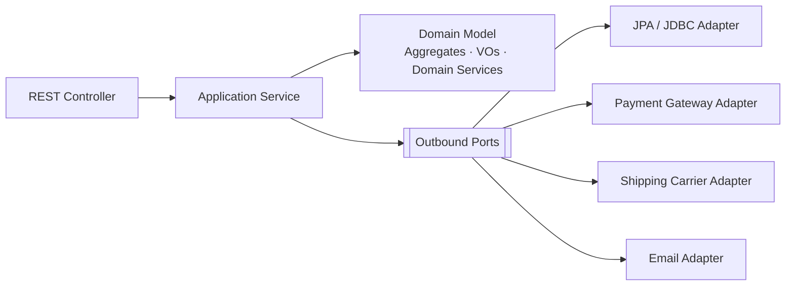

# ADR-0005 — Clean Architecture: Ports, Adapters, and a Framework-Free Domain

**Status:** Accepted
**Date:** 2026-09-06
**Traces to:** `P3` · `CON-03` · `NFR-MAINT-03` · `NFR-AVAIL-03`

---

## 1. Context and Problem Statement

`P3` states that dependence on a single provider raises switching cost and risk. The platform integrates three external providers today — a payment gateway, a shipping carrier, and an email service — and SRS §8 anticipates ERP and CRM integrations later. `CON-03` requires business logic to be independent of frameworks and infrastructure, and `NFR-MAINT-03` makes that testable: *"any of them can be replaced without restating a rule."*

The failure mode this guards against is concrete. If `Order` holds a JPA `@Entity` annotation, a payment provider's SDK type, or a Jackson annotation, then replacing the ORM, the provider, or the serialiser means editing the class that enforces `BR-ORD-01`, `BR-ORD-02`, and `BR-ORD-06` — putting business invariants at risk for an infrastructure change. `NFR-AVAIL-03` compounds this: provider unavailability must fail cleanly and never corrupt platform state, which requires the failure to be handled at a boundary rather than deep inside a domain method.

## 2. Decision Drivers

- `NFR-MAINT-03` — a rule must be expressible without naming a framework, a store, or a provider.
- `NFR-AVAIL-03` — provider failure must be containable at a boundary and retryable.
- [`Domain Model.md`](../../02-backend/Domain%20Model.md) §7 already names outbound ports (`PaymentProcessor`, `ShippingProvider`, `NotificationSender`, `StockReservationPort`, `PromotionRedemptionPort`) and expects a layering rule to make them meaningful.
- `P15` requires the rule be enforced automatically rather than remembered ([ADR-0018](./ADR-0018-architecture-governance-ci-gate.md)).

## 3. Considered Options

**Option 1 — Clean Architecture / hexagonal: domain at the centre, dependencies point inward.** *(chosen)*

- **Pros:** The domain layer compiles with no Spring, JPA, Jackson, or provider dependency on its classpath, so `NFR-MAINT-03` is verifiable by a dependency test rather than by review. A new provider is a new adapter class. Ports are the natural place for `NFR-AVAIL-03`'s clean-failure contract. Extends unchanged to internal cross-context calls (`Domain Model.md` §5.1), which is what makes future service extraction a swap rather than a rewrite.
- **Cons:** Requires explicit mapping between domain, persistence, and API representations — three shapes of the same concept, and the mapping code is real work. More types and more indirection than a service-and-entity design.

**Option 2 — Traditional layered architecture (controller → service → repository) with JPA entities as the domain model.**

- **Pros:** Far less code; no mapping layer; the shape most Spring developers reach for by default.
- **Cons:** The domain model becomes the persistence model, so `NFR-MAINT-03` fails immediately — every rule is restated in terms of an ORM. Lazy-loading and persistence-context lifetime leak into business methods. Provider SDK types spread into services. This is precisely the "simple WebMVC" pattern [`Technology Stack.md`](../Technology%20Stack.md) warns against.

**Option 3 — Anticorruption layers around external providers only, layered architecture internally.**

- **Pros:** Captures most of `P3`'s benefit — provider swaps are contained — at a fraction of the cost.
- **Cons:** Leaves `CON-03` unmet for the framework and persistence dimensions, which is where erosion actually starts. Also leaves internal cross-context calls unported, so `Domain Model.md` §5.1's extraction story loses its seam and `NFR-MAINT-06` weakens.

## 4. Decision Outcome

**Chosen: Option 1.** Domain and application logic depend only on abstractions describing *what* is needed; concrete providers, stores, and frameworks are adapters behind those abstractions.

The layering rule, enforced by ArchUnit ([ADR-0018](./ADR-0018-architecture-governance-ci-gate.md)):

| Layer | May depend on | May **not** depend on |
|---|---|---|
| Domain | the shared kernel only | application, infrastructure, web, Spring, JPA, Jackson, any provider SDK |
| Application | domain, ports | infrastructure, web, concrete adapters |
| Infrastructure | domain, application, ports | web |
| Web | application | domain internals, infrastructure |

Two supporting commitments:

- **MapStruct performs the mapping** between domain, persistence, and API representations. This is what `Solution Architecture.md` §7 means by MapStruct addressing `P3` — the mapping is generated at build time, so the cost of Option 1's main drawback is paid by a code generator rather than by hand.
- **Ports are owned by the layer that needs them, not by the adapter that satisfies them.** `Ordering` owns `StockReservationPort` even though Inventory implements it — the dependency points inward, which is the whole property being bought.

## 5. Consequences

### Positive

- `NFR-MAINT-03` becomes an executable test: the domain package's imports are checkable.
- Provider replacement (`P3`) and provider failure (`NFR-AVAIL-03`) are both boundary concerns, so neither reaches an aggregate.
- Internal ports give `Domain Model.md` §5.1's future saga adapters a place to land without touching Ordering's domain layer.

### Negative

- **Three representations of the same concept** — domain object, persistence row, API DTO — plus mapping between them. MapStruct generates it, but the shapes must still be designed and kept in step, and a field added to `Order` touches three places.
- **The persistence model can no longer be inferred from the domain model.** JPA mapping becomes deliberate work rather than annotation placement, which is a real cost paid on every aggregate ([ADR-0010](./ADR-0010-jpa-write-model-jdbc-read-models.md)).
- **Indirection has a floor.** For a genuinely trivial CRUD capability, a port plus adapter plus mapper is more machinery than the feature deserves. Accepted rather than exempted, because a per-case exemption is how layering erodes.

### Neutral / follow-on

- Lombok stays out of the domain layer wherever a Java record fits ([ADR-0027](./ADR-0027-java-21-spring-boot-4-gradle.md)); its `P15` boilerplate role is real but is not a licence to annotate aggregates.

## 6. Related Decisions

[ADR-0006](./ADR-0006-spring-modulith-module-boundaries.md) · [ADR-0007](./ADR-0007-jmolecules-tactical-ddd.md) · [ADR-0010](./ADR-0010-jpa-write-model-jdbc-read-models.md) · [ADR-0018](./ADR-0018-architecture-governance-ci-gate.md)
