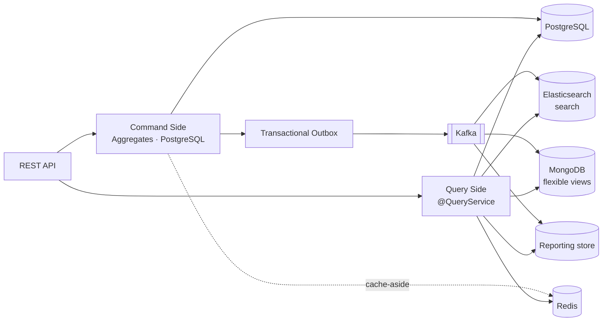

# ADR-0008 — CQRS: Separate the Command and Query Paths

**Document type:** Architecture Decision Record
**Status:** Accepted
**Date:** 2026-09-06
**Deciders:** Solution Architecture
**Traces to:** `P12` · `P13` · `CON-04` · `CON-06` · `NFR-SCAL-05` · `NFR-PERF-05` · `NFR-PERF-06` · `NFR-AVAIL-02`
**Related documents:** [Solution Architecture](../Solution%20Architecture.md) · [Domain Model](../../02-backend/Domain%20Model.md)

---

## 1. Context and Problem Statement

`P12` names two jobs the platform must do equally well: precise transaction handling, and fast flexible browsing. A single data model serving both does each badly — the normalised schema that protects `BR-ORD-02` and `BR-INV-01` is the wrong shape for a product listing with facets, and the denormalised shape that serves the listing cannot hold a transactional invariant.

`P13` adds a second pressure from the other side: an admin dashboard running `JOIN`/`SUM`/`GROUP BY` against the same tables checkout depends on creates direct resource contention. `CON-06` forbids it outright — *"transactional and analytical workloads do not compete for the same resources"* — and `NFR-PERF-05` makes it measurable: with reporting under sustained load, `NFR-PERF-01` (300 ms p95 catalog reads) and `NFR-PERF-02` (800 ms p95 writes) must continue to hold.

`CON-04` and `NFR-SCAL-05` require read and write capacity to scale independently, which a shared model cannot offer.

## 2. Decision Drivers

- `NFR-PERF-05` — reporting must not measurably degrade transactional latency, verified by concurrent load test.
- `NFR-PERF-06` — reporting may lag by at most 5 minutes; **inventory availability and payment state carry no permitted lag**. This is the line that decides what may be projected and what may not.
- `NFR-AVAIL-02` — failure of search, recommendations, reviews, or reporting must not prevent browsing, checkout, or payment.
- `NFR-SCAL-05` / `CON-04` — independent read and write scaling.
- Four different read shapes are already required: search facets (`P11`), hot key-value reads (`P9`), flexible documents (`P4`), and aggregates (`P13`).

## 3. Considered Options

**Option 1 — CQRS: commands against PostgreSQL, queries against purpose-built read models fed by events.** *(chosen)*

- **Pros:** Each side is optimised for its actual job. Read models are independent consumers, so one being down or stale does not block the command side — which is how `NFR-AVAIL-02` is satisfied in a single deployable that has no process isolation ([ADR-0002](./ADR-0002-modular-monolith-deployment-unit.md)). Read stores scale separately from the transactional store, satisfying `NFR-SCAL-05`. Reporting queries never touch checkout's tables, satisfying `CON-06` and `NFR-PERF-05` structurally rather than by tuning.
- **Cons:** Read models are eventually consistent, so a write is not instantly visible in every view. Each projection is code that must be built, monitored, and rebuildable. Two models of the same concept can drift.

**Option 2 — Single model, read replicas for reporting.**

- **Pros:** Much simpler; one schema; strong consistency everywhere; a familiar operational pattern.
- **Cons:** A replica is still the transactional *shape*. Reporting aggregates remain expensive `JOIN`/`GROUP BY` queries, just executed elsewhere, and replication lag under write load is exactly when reporting is most wanted. Does nothing for `P11` — relational `LIKE` search does not become fast on a replica — so Elasticsearch would be needed anyway, meaning the projection machinery gets built regardless while `CON-04` stays unmet for the primary read path.

**Option 3 — Single model, materialised views inside PostgreSQL.**

- **Pros:** No new infrastructure; refresh is scheduled and understood; consistent backup story.
- **Cons:** Refreshing a materialised view competes for the very resources `CON-06` protects, so the contention is deferred rather than removed. Cannot serve full-text relevance ranking (`NFR-PERF-03`) or sub-150 ms autocomplete (`NFR-PERF-04`).

**Option 4 — Full CQRS with event sourcing as the write model.**

- **Pros:** Perfect audit trail by construction; read models rebuildable from first principles; temporal queries free.
- **Cons:** Far more than `P17` requires — `Domain Model.md` §5.2 already satisfies audit as a Conformist subscriber to domain events, without event-sourcing the aggregates. Event sourcing also makes the `BR-INV-01` "available stock never negative" check materially harder than the optimistic-locked counter of [ADR-0011](./ADR-0011-optimistic-locking-reservation-model.md). Cost with no traced business problem behind it.

## 4. Decision Outcome

**Chosen: Option 1.** Commands are handled by aggregates against PostgreSQL; queries are served from read models projected off domain events.

**CQRS here means separated models, not separate databases everywhere.** A query with no special shape requirement is served directly from PostgreSQL through a read-optimised projection — `@QueryService` with `readOnly = true` and Spring Data JDBC ([ADR-0010](./ADR-0010-jpa-write-model-jdbc-read-models.md)) — not routed through a projection for the sake of symmetry.

**The consistency classification is set by `NFR-PERF-06`, and it is not negotiable per feature:**

| Data | Guarantee | Served from |
|---|---|---|
| Order state, payment state, stock availability | **Strong — no permitted lag** | PostgreSQL, command side |
| Cart contents | Strong | PostgreSQL, with Redis as cache-aside |
| Catalog browse, product detail | Near-real-time | PostgreSQL projection + Redis |
| Search, facets, autocomplete | Eventual (seconds) | Elasticsearch ([ADR-0014](./ADR-0014-elasticsearch-search-read-model.md)) |
| Flexible/denormalised views | Eventual (seconds) | MongoDB, scoped by [ADR-0013](./ADR-0013-mongodb-scoped-to-read-models.md) |
| Reporting and analytics | Eventual, ≤ 5 minutes | Reporting store ([ADR-0013](./ADR-0013-mongodb-scoped-to-read-models.md)) |

Checkout reads stock availability from the **command side**, never from a projection. `Domain Model.md` §5.2 already fixes this: Catalog's availability display is explicitly *advisory and non-authoritative*, and the binding check happens inside the Order-Placement Partnership.

**Every projection must be rebuildable** from Kafka without a coordinated outage. A projection that cannot be rebuilt is a second source of truth by accident.

## 5. Consequences

### Positive

- `CON-06` and `NFR-PERF-05` are satisfied structurally — reporting queries are physically incapable of contending with checkout, so the load test verifies a property rather than a tuning.
- `NFR-AVAIL-02` holds without process isolation: read models are independent consumers, so Elasticsearch being down degrades search only.
- `NFR-SCAL-05` and `CON-04` are met by construction; read stores scale on their own axes.

### Negative

- **Eventual consistency is now visible to users.** A staff member who edits a product price sees it in the catalog immediately (PostgreSQL) but in search a few seconds later. This must be designed for in the UI ([ADR-0023](./ADR-0023-server-first-data-fetching.md)), not discovered in testing.
- **Every projection is code plus operations** — build, monitor lag, alert on it, rebuild after a schema change. Projection lag is a first-class production signal, which `NFR-OBS-04` covers only partially.
- **Two models of the same concept can drift.** The mitigation is that projections are derived from events rather than hand-maintained, and rebuildable on demand.
- **Read-side proliferation.** Four read technologies is a real operational surface for one team. [ADR-0013](./ADR-0013-mongodb-scoped-to-read-models.md) exists specifically to keep the least-justified of them scoped.

### Neutral / follow-on

- Read models never publish events. `Domain Model.md` §5.2 fixes Reporting as having *zero upstream influence*; the same applies to every projection.

## 6. Related Decisions

[ADR-0009](./ADR-0009-postgresql-source-of-truth.md) · [ADR-0010](./ADR-0010-jpa-write-model-jdbc-read-models.md) · [ADR-0012](./ADR-0012-transactional-outbox-and-kafka.md) · [ADR-0013](./ADR-0013-mongodb-scoped-to-read-models.md) · [ADR-0014](./ADR-0014-elasticsearch-search-read-model.md) · [ADR-0015](./ADR-0015-redis-cache-and-rate-limiting.md)
