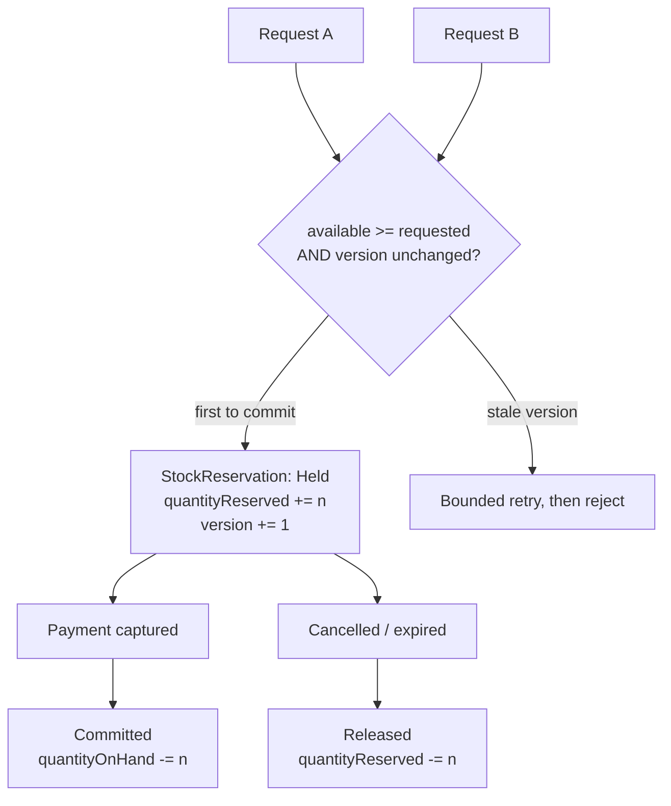

# ADR-0011 — Optimistic Locking and an Explicit Reservation Model to Prevent Overselling

**Document type:** Architecture Decision Record
**Status:** Accepted
**Date:** 2026-09-06
**Deciders:** Solution Architecture
**Traces to:** `P8` · `P7` · `BR-INV-01` · `BR-INV-02` · `BR-ORD-02` · `BR-ORD-03` · `NFR-REL-02` · `NFR-REL-03` · `NFR-SCAL-06` · `NFR-PERF-02`
**Related documents:** [Domain Model](../../02-backend/Domain%20Model.md) · [Solution Architecture](../Solution%20Architecture.md) · [Inventory Use Cases](../../../BA-docs/use-cases/04-inventory.md)

---

## 1. Context and Problem Statement

`P8` states the platform must never sell what it does not have, and `NFR-REL-03` makes it a testable absolute: *"Concurrent purchase attempts against the same limited stock never confirm more orders than there is stock to fulfil"* — verified at `NFR-SCAL-06`'s 10× peak. `BR-INV-01` is the business rule behind it.

The naive sequence — read available stock, subtract, write — fails under exactly the conditions that matter most. Two concurrent flash-sale requests both read `available = 1`, both find it sufficient, and both write `0`. One unit sold twice.

[`Domain Model.md`](../../02-backend/Domain%20Model.md) §8.3 has already made the modelling decisions this record must implement:

- `StockItem` is the aggregate root, identified by `Sku` + `WarehouseId`. It is the single-aggregate consistency boundary.
- `quantityOnHand` and `quantityReserved` are counters on the root; **`availableQuantity` is derived** (`quantityOnHand − quantityReserved`) and never stored, so it cannot drift from its inputs.
- `StockReservation` is a **child entity**, not a separate aggregate, because `UC-INV-03` step 3 requires decrementing stock and marking the reservation committed to happen "as one operation."
- A reservation has a terminal lifecycle: `Held → Committed` or `Held → Released` (`BR-INV-02`), never both and never neither.
- An order line spanning multiple warehouses is **multiple independent reservations**, each against its own `StockItem`, each committed or released independently (`UC-INV-02` A3, `UC-INV-03` A1/A2).

§5.1 adds the transactional frame: order placement commits `Order`, `StockItem`, and `Promotion` in one local transaction, because promotion usage-cap consumption is structurally the same oversell problem (`UC-PRM-02` E7).

What remains open is the concurrency-control mechanism itself, and how it behaves at flash-sale volume.

## 2. Decision Drivers

- `NFR-REL-03` — no oversell under concurrency, tested at `NFR-SCAL-06` peak (assumption **[A-04]**).
- `NFR-PERF-02` — transactional writes ≤ 800 ms p95, so the mechanism must not serialise the checkout path.
- `NFR-REL-02` / `BR-ORD-03` — a repeated confirmed checkout must never produce a second order, including under concurrent submission.
- `BR-INV-02` — a reservation resolves exactly once.
- `UC-INV-01` E3 — a failure part-way through a multi-line reservation must leave nothing held.

## 3. Considered Options

**Option 1 — Optimistic locking (`@Version` conditional update) on `StockItem`, with the Held/Committed/Released reservation model.** *(chosen)*

- **Pros:** No lock is held across the user's think-time, so the checkout path is not serialised and `NFR-PERF-02` stays reachable. The conditional `UPDATE … WHERE version = ?` makes a stale-read write impossible — the second writer's update matches zero rows and fails, which is precisely the `BR-INV-01` guarantee. The reservation state gives the business the intermediate state it actually has: stock committed to an in-flight order but not yet sold. Rollback of the shared transaction releases every hold for free, answering `UC-INV-01` E3 with no compensating code.
- **Cons:** Under high contention on one SKU, retries multiply and throughput degrades — the failure mode is at exactly the flash-sale moment `P9` cares about. Retry logic must be idempotent and bounded.

**Option 2 — Pessimistic row locks (`SELECT … FOR UPDATE`) on `StockItem`.**

- **Pros:** No retries; the first writer wins and others wait; conceptually simple.
- **Cons:** Serialises every purchase of a popular SKU behind one lock, which is the direct opposite of what `NFR-SCAL-06` requires. Lock waits during the order-placement transaction — which also touches `Order` and `Promotion` — invite deadlocks across three tables, and lock-wait time lands squarely in the `NFR-PERF-02` budget. Rejected because its cost peaks exactly when the platform's revenue does.

**Option 3 — Redis counters as the authoritative stock record.**

- **Pros:** Atomic `DECR` at sub-millisecond latency; effortlessly absorbs flash-sale volume.
- **Cons:** Makes a cache the source of truth for money-adjacent state. A Redis failure or eviction loses or corrupts stock with no transactional recovery, and the decrement cannot participate in the `BR-ORD-02` transaction with `Order` and `Promotion` — so `NFR-REL-01`'s "fully applied or fully absent" is lost. `Solution Architecture.md` §5 P8 positions Redis as a front for extreme concurrency, not as the record.

**Option 4 — Serializable isolation for the whole order-placement transaction.**

- **Pros:** The database guarantees correctness with no explicit version handling.
- **Cons:** Serialisation failures and retries anyway, but now on the *entire* three-aggregate transaction rather than on one contended row — a much larger unit of work to redo. Broad throughput cost across all writes to protect one specific invariant.

## 4. Decision Outcome

**Chosen: Option 1**, with **Option 3 as a scoped front-line filter, never as the record.**

**Core mechanism.** `StockItem` carries a `@Version` column ([ADR-0010](./ADR-0010-jpa-write-model-jdbc-read-models.md)). Every reservation and commit is a conditional update; a version mismatch fails the transaction, and the caller retries a bounded number of times with jitter. Because `availableQuantity` is derived rather than stored, no code path can write an inconsistent pair of counters.

**Reservation lifecycle** (`BR-INV-02`, `Domain Model.md` §8.3): `Held` on order placement; `Committed` when payment succeeds and stock physically leaves; `Released` on cancellation, payment failure, or expiry. A Scheduler-driven sweep publishes `StockReservationExpired` for holds that outlive their window — and per `Solution Architecture.md` §4, the Scheduler is a first-class trigger the domain model accepts exactly as it accepts an API call, so expiry is not a rule that lives only behind a human action (`P5`).

**Multi-warehouse lines are multiple independent reservations.** There is no cross-warehouse aggregate; the `Order` side holds a plain set of `(StockItemId, StockReservationId)` references (`Domain Model.md` §8.3, §8.5), and partial commit or release is a legal outcome.

**Promotion redemption uses the identical mechanism.** The usage-cap counter on `Promotion` is optimistically locked the same way, via `PromotionRedemptionPort`, inside the same transaction (`UC-PRM-02` E7).

**Idempotency is a separate, additional mechanism.** Optimistic locking prevents overselling; it does not prevent a duplicate order from a double-submitted checkout. `BR-ORD-03` and `NFR-REL-02` are satisfied by an `Idempotency-Key` on order placement ([ADR-0003](./ADR-0003-rest-api-style.md)) backed by a unique constraint, so a replay returns the original order rather than creating a second one.

**Redis is a scoped pre-filter for flash sales only.** For a designated flash-sale SKU, a Redis counter rejects obviously-hopeless requests before they reach PostgreSQL, so the database sees contention proportional to remaining stock rather than to traffic. It is advisory in one direction only: it may reject early, it may **never** authorise a sale. Every accepted request still passes the versioned check ([ADR-0015](./ADR-0015-redis-cache-and-rate-limiting.md)).

## 5. Consequences

### Positive

- `BR-INV-01` and `NFR-REL-03` hold by construction: a stale-read write matches zero rows and cannot commit.
- `UC-INV-01` E3 needs no compensating logic — transaction rollback releases every hold ([ADR-0002](./ADR-0002-modular-monolith-deployment-unit.md)).
- The reservation state models something the business genuinely has, so `UC-INV-02`/`UC-INV-03`'s partial-commit flows are expressible rather than approximated.
- Promotion over-redemption — unbudgeted spend — is prevented by the same mechanism as overselling, rather than by a second, weaker one.

### Negative

- **Retry storms under single-SKU contention.** This is the mechanism's worst case and it coincides with peak revenue. The Redis pre-filter mitigates it for *designated* flash-sale SKUs; an unanticipated viral product gets no such protection and will see elevated retry-exhaustion rejections. Retry exhaustion must be a monitored signal, not a silent 500.
- **A rejected customer at checkout is a real conversion loss**, and it happens after they have committed intent. The UI must distinguish "sold out" from "try again" ([ADR-0023](./ADR-0023-server-first-data-fetching.md)).
- **Held stock is unsellable while held.** Too long a window strands inventory; too short cancels legitimate slow checkouts. The value is a business setting, and `BR-CRT-01` already establishes that expiry windows are configurable — the number is not an architectural constant.
- **The Redis pre-filter is a second place stock is represented.** Its one-directional advisory contract is what keeps it from becoming a source of truth, and that contract is enforced by review, not by a type.

### Neutral / follow-on

- Retry bounds, backoff, and hold duration are configuration, tuned against `NFR-SCAL-06` load tests rather than fixed here.
- `StockItem` carries a reserved `ownerId`/`sellerId` field for future multi-vendor use (`Domain Model.md` §7).

## 6. Related Decisions

[ADR-0009](./ADR-0009-postgresql-source-of-truth.md) · [ADR-0010](./ADR-0010-jpa-write-model-jdbc-read-models.md) · [ADR-0002](./ADR-0002-modular-monolith-deployment-unit.md) · [ADR-0015](./ADR-0015-redis-cache-and-rate-limiting.md) · [ADR-0003](./ADR-0003-rest-api-style.md)
