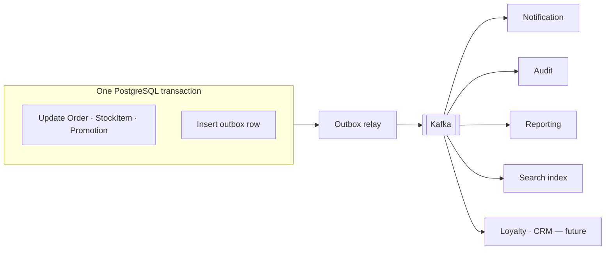

# ADR-0012 — Transactional Outbox with Kafka; In-Process Domain Events by Default

**Status:** Accepted
**Date:** 2026-09-06
**Traces to:** `P2` · `P6` · `CON-07` · `NFR-REL-05` · `NFR-REL-06` · `NFR-MAINT-04` · `AC-03`

---

## 1. Context and Problem Statement

`P6` states that business-critical events must never silently disappear between systems. `NFR-REL-06` makes it a guarantee — *"A business event accepted by the platform is delivered to every dependent process at least once"* — and `NFR-REL-05` extends it across infrastructure failure, without manual data repair.

The problem is that writing to a database and publishing to a broker are two systems, and there is no atomic operation spanning them. Publish first and the transaction may roll back, leaving consumers acting on an order that does not exist. Commit first and the publish may fail, leaving an order that no downstream capability ever hears about — no confirmation email, no analytics row, no audit entry.

`P2` adds the other half. New capabilities must plug into existing business moments without destabilising the core: `NFR-MAINT-04` requires that a new capability be addable *"by reacting to existing business events, without modifying the checkout or payment flow,"* and `AC-03` restates it as acceptance.

But `Solution Architecture.md` §2 also warns against the obvious over-application: *"Kafka is not required for every inter-module interaction. Within the modular monolith, in-process domain events are sufficient for same-deployment communication."* [`Domain Model.md`](../../02-backend/Domain%20Model.md) §9 already classifies delivery per event — some in-process, some Kafka, some both.

## 2. Decision Drivers

- `NFR-REL-06` — at-least-once delivery to every dependent process, tested under induced failure.
- `NFR-REL-05` — recovery without losing an accepted event and without manual repair.
- `CON-07` — inter-module communication favours business events *where appropriate*; the qualifier is doing work.
- `NFR-MAINT-04` / `AC-03` — a new capability must not require editing checkout.
- The Order-Placement Partnership commits three aggregates in one transaction ([ADR-0011](./ADR-0011-optimistic-locking-reservation-model.md)); its participants must be reached synchronously inside that transaction, not asynchronously.

## 3. Considered Options

### Guaranteeing publication

**Option 1 — Transactional Outbox: the event row is inserted in the same local transaction as the business write, and a relay publishes it.** *(chosen)*

- **Pros:** Reduces a two-system atomicity problem to a single local transaction, which PostgreSQL already guarantees ([ADR-0009](./ADR-0009-postgresql-source-of-truth.md)). If the business change committed, the event *will* be published — exactly `NFR-REL-05`. The relay is restartable and needs no coordination. No dependency on broker availability at commit time, so Kafka being down slows delivery instead of failing checkout.
- **Cons:** At-least-once, so consumers must be idempotent. Adds a table, a relay process, and publication lag. The outbox table is write-heavy and needs pruning.

**Option 2 — Publish directly to Kafka inside the transaction.**

- **Pros:** No extra table, no relay, lowest latency.
- **Cons:** The dual-write problem in its pure form. A broker failure after commit loses the event permanently, and a rollback after publish emits an event for something that never happened. Fails `NFR-REL-05` and `NFR-REL-06` outright.

**Option 3 — Change Data Capture (Debezium reading the WAL).**

- **Pros:** No outbox table; nothing for application code to remember; captures every change by construction.
- **Cons:** Events become *row diffs*, not domain events. `OrderPaid` carries business meaning that a diff on `ordering_order.status` does not, and reconstructing intent from a diff couples every consumer to the write schema — the opposite of `P2`. Adds a connector and its operational surface. CDC is the right tool for replication, not for a business event contract.

**Option 4 — Two-phase commit across PostgreSQL and Kafka.**

- **Cons:** XA transactions block on coordinator failure, are poorly supported by Kafka, and put a distributed protocol on the checkout path to solve a problem the outbox solves locally. Rejected.

### Choosing the transport

**Option A — Kafka for everything.** Uniform, but pays broker latency, serialisation, and eventual consistency for calls that are a method invocation away in the same process — and would make the Partnership's synchronous, same-transaction participants unreachable. Rejected.

**Option B — In-process only.** No durability across restart, no replay, no fan-out to a future extracted service. Fails `NFR-REL-06`. Rejected.

**Option C — In-process by default; Kafka where the interaction crosses a durability or distribution boundary.** *(chosen)* Matches `Solution Architecture.md` §2 and the per-event classification already in `Domain Model.md` §9.

## 4. Decision Outcome

**Chosen: Option 1 + Option C.**

The runtime picture of this decision is [`Sequence/00-Overview.md`](../../02-backend/Sequence/00-Overview.md) §3, and [`Sequence/01-Ordering.md`](../../02-backend/Sequence/01-Ordering.md) §6 shows the outbox row being written inside the same transaction frame as the business change — which is the whole of what this record decides.

**The transport rule.** An interaction uses Kafka when it must survive a process restart, fan out to multiple asynchronous consumers, or eventually cross a service boundary. Otherwise it is an in-process Spring Modulith event. Applying `Domain Model.md` §9:

| Interaction | Transport | Why |
|---|---|---|
| Order-Placement Partnership — `StockReservationPort`, `PromotionRedemptionPort` | **Synchronous port call, same transaction** | Not an event at all. `BR-ORD-02` requires atomicity; an asynchronous handoff would break it. |
| `CartCheckedOut` → Ordering | In-process | One-time translation within the deployable (`Domain Model.md` §5.2). |
| `AccountRegistered`, `AccountRoleChanged` | In-process | Local subscribers only. |
| `OrderCreated` … `OrderRefunded` | **Outbox + Kafka** | Durable, multi-consumer: Payment, Shipping, Review, Catalog, Notification, Audit, Reporting. |
| `PaymentCaptured`, `PaymentFailed`, `PaymentRefunded` | **Outbox + Kafka** | Money-adjacent; loss is unacceptable. |
| `ShipmentCreated`, `ShipmentDispatched`, `ShipmentDelivered` | **Outbox + Kafka** | Multi-consumer, crosses an external-provider boundary. |
| `ProductPriceChanged`, `VariantAdded`, `CategoryChanged` | Kafka | Feeds the search index ([ADR-0014](./ADR-0014-elasticsearch-search-read-model.md)). |
| `StockReserved`, `StockAdjusted`, … | In-process **and** Kafka | In-process for the Partnership participants; Kafka for Catalog's availability read model. |
| `PromotionRedeemed` | In-process (Partnership) + Kafka (Reporting) | Same split. |

**Consumers are idempotent, without exception.** At-least-once means redelivery, so every handler is keyed on the event id or on a natural business key. This is not optional per consumer.

**Events are contracts.** A published event's schema is owned jointly by publisher and consumers, versioned additively, and destined for `04-shared/Event Contract` ([`SA-docs/README.md`](../../README.md#folder-layout) §1.1). Event payloads carry business fields only — never raw request payloads, credentials, or tokens (`NFR-SEC-07`).

**A failed consumer never blocks the publisher.** Retry with backoff, then a dead-letter topic and an alert. `NFR-AVAIL-02` requires that a failing non-essential capability leaves checkout alone.

## 5. Consequences

### Positive

- `NFR-REL-05` and `NFR-REL-06` hold end to end: if it committed, it publishes; if the relay restarts, it resumes.
- Kafka being unavailable delays delivery rather than failing checkout — a meaningful contribution to `NFR-AVAIL-01`.
- `P2`, `NFR-MAINT-04`, and `AC-03` are satisfied by adding a consumer. Loyalty, CRM, and recommendation subscribe to `OrderPaid` without checkout changing by a line.
- Scoping keeps the operational cost proportional: the Partnership stays a local transaction, and only interactions that need durability pay for it.

### Negative

- **At-least-once pushes idempotency onto every consumer.** A single non-idempotent handler produces duplicate emails, double-counted analytics, or duplicate audit entries. This is the standing correctness cost of the decision.
- **Publication lag is real and visible.** A confirmation email arrives after the outbox relay runs. `NFR-PERF-06` permits reporting lag of 5 minutes but permits none for inventory and payment state, so nothing on those paths may depend on event delivery for correctness — the Partnership's synchronous ports are what keep that true.
- **The outbox table is write-heavy** and shares the transactional database with checkout. It needs a partial index on unpublished rows and a pruning policy, or it becomes a `P10` problem of its own.
- **Kafka is significant operational surface** — brokers, topics, partitions, consumer groups, DLQs, schema evolution — for a team also running PostgreSQL, Redis, Elasticsearch, and MongoDB.
- **Event ordering holds only within a partition.** Order lifecycle events must be partitioned by order id, or a consumer can observe `OrderPaid` before `OrderCreated`.

### Neutral / follow-on

- Relay implementation (Spring Modulith's event publication registry versus a bespoke poller), topic naming, partition counts, and retention are for [`Backend Architecture.md`](../../02-backend/Backend%20Architecture.md). **Now settled:** the relay is a polling relay over the per-module outbox tables, single-runner per module via a PostgreSQL advisory lock ([ADR-0033](./ADR-0033-polling-outbox-relay.md)); topics, partitions, and a 30-day retention are [`Backend Architecture.md`](../../02-backend/Backend%20Architecture.md) §4.2–§4.3.
- Schema registry and serialisation format are undecided. **Now settled:** UTF-8 JSON on the wire with JSON Schema held in `04-shared/Event Contract/` and no registry ([ADR-0032](./ADR-0032-json-event-serialisation-and-schema-contract.md)).

## 6. Related Decisions

[ADR-0009](./ADR-0009-postgresql-source-of-truth.md) · [ADR-0011](./ADR-0011-optimistic-locking-reservation-model.md) · [ADR-0006](./ADR-0006-spring-modulith-module-boundaries.md) · [ADR-0014](./ADR-0014-elasticsearch-search-read-model.md) · [ADR-0017](./ADR-0017-append-only-audit-log.md)
