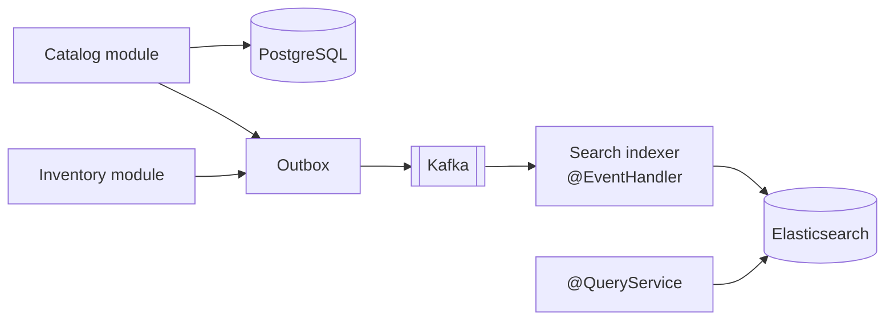

# ADR-0014 — Elasticsearch as the Event-Fed Search Read Model

**Document type:** Architecture Decision Record
**Status:** Accepted
**Date:** 2026-09-06
**Deciders:** Solution Architecture
**Traces to:** `P11` · `P12` · `NFR-PERF-03` · `NFR-PERF-04` · `NFR-SCAL-01` · `NFR-AVAIL-02`
**Related documents:** [Solution Architecture](../Solution%20Architecture.md) · [Search Use Cases](../../../BA-docs/use-cases/03-search-recommendation.md) · [Domain Model](../../02-backend/Domain%20Model.md)

---

## 1. Context and Problem Statement

`P11` states the business problem plainly: customers who cannot quickly find what they want leave without buying. The SRS turns it into two hard numbers — keyword search must return first results within **500 ms at p95** against the full catalog (`NFR-PERF-03`), and autocomplete within **150 ms at p95** (`NFR-PERF-04`) — measured at `NFR-SCAL-01`'s catalog of at least 10,000 products, with `NFR-SCAL-04`'s thousands of concurrent customers.

Relational pattern matching does not reach those numbers. A leading-wildcard `LIKE '%keyword%'` cannot use a B-tree index and degrades linearly with catalog size. More importantly, `LIKE` has no notion of relevance — no term weighting, no fuzzy matching for typos, no faceting, no ranking. `P11`'s problem is not "find rows containing a string"; it is "show the customer the product they meant, first."

[`Domain Model.md`](../../02-backend/Domain%20Model.md) §3 has already settled the modelling half: the `SCH` business domain is **not** a bounded context of its own — it folds into Catalog as a CQRS read model. This record decides the technology and the synchronisation contract.

## 2. Decision Drivers

- `NFR-PERF-03` — 500 ms p95 first results at `NFR-SCAL-01` volume.
- `NFR-PERF-04` — 150 ms p95 autocomplete (Should).
- `NFR-AVAIL-02` — search failing must not prevent browsing, checkout, or payment.
- `P12` — the read path must scale independently of the write path.
- The search index must reflect availability, since `Domain Model.md` §5.2 has Catalog's read model consuming Inventory's stock events — but that availability is explicitly **advisory, non-authoritative**.

## 3. Considered Options

**Option 1 — Elasticsearch as a dedicated read model, populated via Kafka.** *(chosen)*

- **Pros:** Inverted indexes give sub-second relevance ranking at catalog scale; edge n-grams and completion suggesters are built for the 150 ms autocomplete case. Faceting and filtering are native, which is what `UC-SCH-*` actually asks for. Scales independently of PostgreSQL, satisfying `P12`. As a Kafka consumer it is rebuildable from the event stream, so it is never authoritative. Being a separate tier means search load never touches the transactional store.
- **Cons:** A fifth datastore. Eventual consistency between a catalog edit and its appearance in search. Relevance tuning is ongoing work, not a one-time setup. Index mapping changes usually mean a reindex.

**Option 2 — PostgreSQL full-text search (`tsvector` + GIN).**

- **Pros:** No new datastore; transactionally consistent with the catalog — an edit is searchable immediately; one backup story; genuinely capable for moderate catalogs.
- **Cons:** Search load lands on the transactional instance, competing with checkout for the same resources at exactly peak time — the contention `CON-06` and `P9` exist to prevent. Faceted counts across multiple attributes require expensive aggregate queries. Autocomplete at 150 ms p95 under `NFR-SCAL-04` concurrency is a stretch. Relevance tuning is far more limited. Reasonable at 10,000 products; the concern is that `NFR-SCAL-01` is a floor, not a ceiling.

**Option 3 — Elasticsearch synchronised by dual-write from the Catalog application service.**

- **Pros:** Lower latency to index than going through Kafka; no consumer to operate.
- **Cons:** The dual-write problem [ADR-0012](./ADR-0012-transactional-outbox-and-kafka.md) exists to eliminate. A failed index write after a committed catalog change leaves search permanently stale with nothing to replay. Also couples Catalog's write path to Elasticsearch availability, so an index outage degrades product editing — the opposite of `NFR-AVAIL-02`.

**Option 4 — A managed third-party search service.**

- **Pros:** No cluster to operate; excellent relevance and autocomplete out of the box.
- **Cons:** Catalog data leaves the platform's boundary; per-operation pricing scales with traffic; `P3` reappears as vendor lock-in on a conversion-critical path. Named nowhere upstream.

## 4. Decision Outcome

**Chosen: Option 1.** Elasticsearch is Catalog's search read model, populated exclusively by Kafka consumers, never written to directly by an application service.

| Commitment | Detail |
|---|---|
| **Serves** | keyword search, faceted filtering, relevance ranking, autocomplete |
| **Fed by** | `ProductCreated`, `ProductPublished`, `ProductPriceChanged`, `ProductDiscontinued`, `VariantAdded`, `CategoryChanged` from Catalog; `StockReserved`, `StockReservationCommitted`, `StockAdjusted` from Inventory (`Domain Model.md` §9) |
| **Never authoritative** | A price or availability shown in search results is display data. The binding price is frozen at order placement (`BR-ORD-06`) and the binding availability is the versioned check inside the Partnership ([ADR-0011](./ADR-0011-optimistic-locking-reservation-model.md)). |
| **Rebuildable** | The full index can be rebuilt from Kafka with no coordinated outage. A projection that cannot be rebuilt is a second source of truth by accident ([ADR-0008](./ADR-0008-cqrs-command-query-separation.md)). |
| **Degrades, never blocks** | If Elasticsearch is unavailable, search returns a clear degraded state and browse/cart/checkout continue unaffected — `NFR-AVAIL-02` verified by dependency-failure test, not assumed. |
| **Owned by Catalog** | Per `Domain Model.md` §3, `SCH` is a read model inside Catalog, not a thirteenth bounded context. No other module writes to the index. |

**Recommendation is explicitly out of scope here.** SRS §8 defers AI recommendation, and `Domain Model.md` §5.2 notes Catalog's read model additionally consumes order-line events for "frequently bought together" and trending. That is a separate projection off the same event stream, added later as a consumer — not a reason to widen this record.

## 5. Consequences

### Positive

- `NFR-PERF-03` and `NFR-PERF-04` become achievable rather than aspirational, and stay achievable as the catalog grows past `NFR-SCAL-01`.
- Search traffic — the highest-volume read on the platform — never touches PostgreSQL, which is a direct contribution to `NFR-SCAL-06` peak absorption.
- `NFR-AVAIL-02` is satisfied by construction: an independent consumer failing degrades one capability.
- Event-fed and rebuildable, so a mapping change is a reindex rather than a data-loss event.

### Negative

- **Catalog edits are not instantly searchable.** A staff member changing a price sees it on the product page immediately and in search seconds later. This is a UX design requirement, not a defect ([ADR-0023](./ADR-0023-server-first-data-fetching.md)), and staff-facing screens should read from the command side where the difference matters.
- **Availability shown in search can be wrong**, particularly during a flash sale. Deliberate — `Domain Model.md` §5.2 already marks it advisory — but it means a customer can click a product shown as available and be rejected at checkout, and the checkout copy must handle that ([ADR-0011](./ADR-0011-optimistic-locking-reservation-model.md)).
- **A fifth datastore**, with cluster sizing, shard strategy, snapshots, and version upgrades. Unlike MongoDB ([ADR-0013](./ADR-0013-mongodb-scoped-to-read-models.md)) its business justification is direct and revenue-linked, but the operational cost is the same kind.
- **Relevance tuning is permanent work.** Analyzers, synonyms, boosting, and language handling are product decisions that arrive continuously.

### Neutral / follow-on

- Index topology, analyzer chain, and multi-language handling (SRS §8 defers multi-language) are for [`Backend Architecture.md`](../../02-backend/Backend%20Architecture.md).
- Autocomplete may additionally be fronted by Redis for the most common prefixes if `NFR-PERF-04` proves tight ([ADR-0015](./ADR-0015-redis-cache-and-rate-limiting.md)).

## 6. Related Decisions

[ADR-0008](./ADR-0008-cqrs-command-query-separation.md) · [ADR-0012](./ADR-0012-transactional-outbox-and-kafka.md) · [ADR-0013](./ADR-0013-mongodb-scoped-to-read-models.md) · [ADR-0015](./ADR-0015-redis-cache-and-rate-limiting.md)
