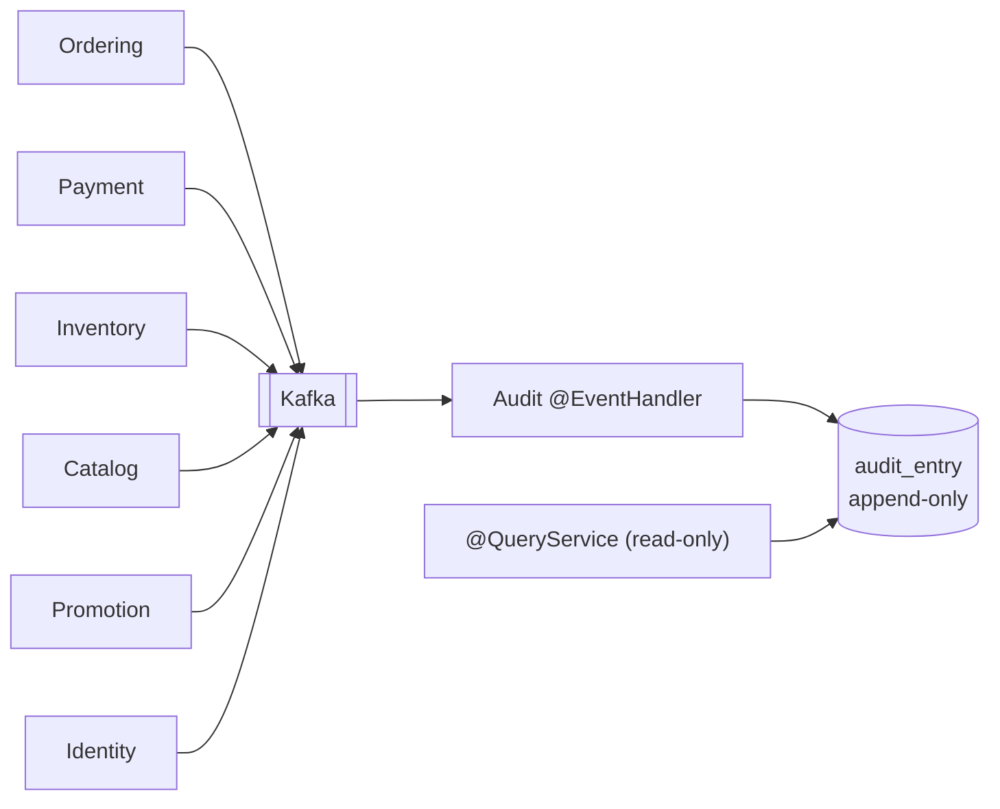

# ADR-0017 — Append-Only Audit Log Projected from Domain Events

**Status:** Accepted
**Date:** 2026-09-06
**Traces to:** `P17` · `P2` · `BR-AUD-01` · `BR-AUD-02` · `BR-AUD-03` · `NFR-OBS-01` · `NFR-OBS-02` · `NFR-SEC-07`

---

## 1. Context and Problem Statement

`P17` requires the business to answer "who did this, when, and why" for every significant action — price changes, inventory adjustments, order cancellations, refund approvals, promotion creation. `NFR-OBS-01` makes attribution a requirement, and `NFR-OBS-02` makes immutability an absolute one: *"The audit trail cannot be amended or deleted through any interface the platform exposes, by any role"* — verified by an attempted-modification test **per role**, including Administrator.

That last clause is the hard part. Immutability enforced by a permission check is immutability that a permission misconfiguration removes. `BR-AUD-01` is the business rule behind it, and [`Domain Model.md`](../../02-backend/Domain%20Model.md) §5.2 already states the intended answer: Audit is a Conformist downstream subscriber to domain events from all eleven other contexts that **"exposes no mutation API at all — `BR-AUD-01` is enforced by construction, not by a runtime check."**

A second requirement pulls in the same direction. `NFR-SEC-07` forbids credentials, payment instrument details, and tokens from ever appearing in logs, error messages, or audit entries.

## 2. Decision Drivers

- `NFR-OBS-02` — unamendable through **any** interface, by **any** role, tested per role.
- `NFR-OBS-01` — every significant action attributable to an actor and a time.
- `BR-AUD-02` — the same authorisation decision regardless of entry point ([ADR-0016](./ADR-0016-jwt-refresh-rotation-rbac.md)).
- `BR-AUD-03` — a user may not revoke the last remaining Administrator; per `Domain Model.md` §7 this is a database constraint, not an aggregate invariant.
- `NFR-SEC-07` — no credentials, payment details, or tokens in audit entries.
- `P2` — the events needed for audit already exist for other purposes.

## 3. Considered Options

**Option 1 — Audit as a Conformist event consumer with no mutation API, writing append-only rows.** *(chosen)*

- **Pros:** `P2`'s dividend — every significant action is already a domain event ([ADR-0012](./ADR-0012-transactional-outbox-and-kafka.md)), so audit adds a consumer rather than duplicating business logic across eleven contexts. `NFR-OBS-02` is satisfied *by construction*: the module offers no update or delete operation, so there is no interface to attack and the per-role test passes for the same reason at every role. Audit failure cannot block a business transaction, because it consumes an already-committed event.
- **Cons:** Eventually consistent — an action is auditable shortly after it happens, not synchronously with it. Audit completeness now depends on event coverage: an action that publishes no event is invisible to audit. Database-level protection is still required, since the module having no delete API does not stop a direct SQL statement.

**Option 2 — Explicit audit-write calls inside each application service.**

- **Pros:** Synchronous — the audit row commits in the same transaction as the action, so it cannot be missed or lag.
- **Cons:** Duplicates audit logic across every context and makes a forgotten call a silent, permanent gap. Couples every business operation to the audit schema. Discards the `P2` dividend entirely: the events are already there.

**Option 3 — Event sourcing the aggregates, using the event store as the audit trail.**

- **Pros:** The most complete possible history; immutable by definition.
- **Cons:** Rejected in [ADR-0008](./ADR-0008-cqrs-command-query-separation.md) for cost against traced need. Also mismatched in content: an event store records *state transitions*, while `P17` asks for actor, timestamp, before/after state, and reason — an audit concern, not a persistence one.

**Option 4 — Database triggers writing audit rows on every table change.**

- **Pros:** Cannot be bypassed by application code; captures direct SQL too.
- **Cons:** Records row diffs without business meaning or actor context — the acting user is not available to a trigger without threading it through as session state. `P17` needs "who and why," which a trigger cannot supply. Also puts business semantics in the database, defeating `CON-03`.

## 4. Decision Outcome

**Chosen: Option 1**, hardened with database-level protection.

| Commitment | Detail |
|---|---|
| **No mutation API** | The Audit module publishes no update or delete operation at any layer. `NFR-OBS-02` holds because there is nothing to call — the per-role test passes identically for Administrator. |
| **Database-level enforcement** | The application's database role holds `INSERT` and `SELECT` on `audit_entry` and **not** `UPDATE` or `DELETE`. Immutability does not rest on the application alone. |
| **Entry content** | Actor identity, timestamp, action type, affected entity reference, before/after business state, and reason where the use case supplies one (`P17`, `NFR-OBS-01`). |
| **Never in an entry** | Credentials, payment instrument details, tokens, raw request payloads (`NFR-SEC-07`). Entries carry business fields only — which is a property of projecting from *domain events* rather than from HTTP requests. |
| **Sources** | All eleven other contexts (`Domain Model.md` §5.2), including `AccountRegistered` / `AccountRoleChanged` / `AccountSuspended` from Identity & Access. |
| **Idempotent** | Keyed on event id, since delivery is at-least-once ([ADR-0012](./ADR-0012-transactional-outbox-and-kafka.md)). |
| **Retention** | Append-only for the retention period; expiry is an operational archival process outside the application's reach, never a delete the platform can perform. |

**`BR-AUD-03` is not an audit-module rule.** "A user may not revoke the last remaining Administrator" is a global cross-aggregate constraint enforced by a database constraint in Identity & Access, per `Domain Model.md` §7. Audit records the attempt and the outcome; it does not enforce the rule.

## 5. Consequences

### Positive

- `NFR-OBS-02` is satisfied structurally rather than by a permission check, so a misconfigured role cannot create a hole.
- `P17` costs one consumer instead of eleven scattered call sites — the `P2` architecture paying off exactly as intended.
- Audit failure degrades auditing only; it can never block or slow a business transaction.
- Because entries derive from domain events, `NFR-SEC-07` compliance is a property of the event contracts rather than a filter that must be maintained.

### Negative

- **Audit is only as complete as the event catalog.** An action that publishes no domain event produces no audit entry, silently. `Domain Model.md` §9 must stay in step with `FR-AUD-*`, and event coverage becomes a review checklist item on every new use case — the main ongoing cost of this decision.
- **Audit entries lag the action.** An action is auditable seconds later, not synchronously. Acceptable for `NFR-OBS-01`'s "after the fact" wording, but it means the audit log is not a real-time monitor.
- **Append-only tables grow without bound** and become a `P10` problem. Partitioning by time and an archival policy are needed, and neither is decided yet.
- **Database-level protection must survive migrations and operational access.** A migration run as a superuser can still alter the table; the guarantee is against the *platform's* interfaces, which is exactly what `NFR-OBS-02` asks for, but operational access is outside its scope and should be said plainly rather than implied.

### Neutral / follow-on

- Retention period, partitioning, and archival are for [`Backend Architecture.md`](../../02-backend/Backend%20Architecture.md).
- `NFR-OBS-03` (following one business transaction across every domain it touches) needs a correlation id propagated through events; related, but distribution tracing is not decided by any record yet.

## 6. Related Decisions

[ADR-0012](./ADR-0012-transactional-outbox-and-kafka.md) · [ADR-0016](./ADR-0016-jwt-refresh-rotation-rbac.md) · [ADR-0008](./ADR-0008-cqrs-command-query-separation.md) · [ADR-0009](./ADR-0009-postgresql-source-of-truth.md)
