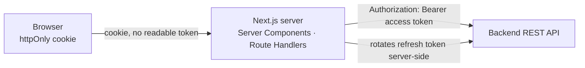

# ADR-0025 — Browser Session Held in an httpOnly Cookie, Never in `localStorage`

**Status:** Proposed
**Date:** 2026-09-06
**Traces to:** `P16` · `P5` · `NFR-SEC-01` · `NFR-SEC-03` · `NFR-SEC-06` · `NFR-SEC-07` · `BR-CUS-03`

---

## 1. Context and Problem Statement

[ADR-0016](./ADR-0016-jwt-refresh-rotation-rbac.md) settles the backend half of authentication: short-lived JWT access tokens, server-side refresh tokens rotated on every use, and reuse of a consumed refresh token invalidating the whole session (`NFR-SEC-03`, `BR-CUS-03`).

It does not say where the browser keeps those tokens, and that is where the guarantee is most easily lost. The common pattern — access token in `localStorage`, attached as an `Authorization` header by a client-side interceptor — makes both tokens readable by any JavaScript running on the page. A single cross-site scripting flaw, in application code or in any dependency, then yields both the access token and the refresh token. Rotation and reuse detection are defeated: the attacker holds the current refresh token and can rotate it themselves.

Two further constraints come from the rest of this set:

- [ADR-0019](./ADR-0019-nextjs-app-router-rendering-strategy.md) makes Server Components the default. A Server Component cannot read `localStorage`, so a token stored there is unavailable to exactly the layer that does most of the fetching.
- [ADR-0023](./ADR-0023-server-first-data-fetching.md) routes all writes through Server Actions or route handlers, so there is already a server-side place for a credential to live.

## 2. Decision Drivers

- `NFR-SEC-03` / `BR-CUS-03` — refresh rotation and reuse detection must not be defeatable by reading client storage.
- `NFR-SEC-07` — tokens must never appear in logs or error messages; a token in a header attached by client code is far more likely to end up in a client error report.
- `NFR-SEC-06` — all client-platform traffic encrypted in transit.
- `P5` / `NFR-SEC-01` — the client enforces nothing; it must not be trusted with a decision, only with a request.
- [ADR-0019](./ADR-0019-nextjs-app-router-rendering-strategy.md) — server-side rendering needs server-readable credentials.

## 3. Considered Options

**Option 1 — Session held in an httpOnly, Secure, SameSite cookie; the Next.js server attaches the access token to backend calls.** *(chosen)*

- **Pros:** JavaScript cannot read an httpOnly cookie, so an XSS flaw cannot exfiltrate the session — which is what makes `NFR-SEC-03`'s reuse detection meaningful rather than theoretical. Server Components and route handlers read the cookie naturally, matching [ADR-0019](./ADR-0019-nextjs-app-router-rendering-strategy.md). Refresh rotation happens entirely server-side, so the race that logs users out cannot be triggered by two browser tabs. Tokens never enter client memory, so they cannot reach a client-side error reporter (`NFR-SEC-07`).
- **Cons:** Cookies are sent automatically, so CSRF protection becomes mandatory. Requires the Next.js server to sit in the request path as a trusted intermediary — an architectural commitment, not just a storage choice. A native mobile client (SRS §8) cannot use this and will need a different, token-based flow.

**Option 2 — Access token in `localStorage`, attached by a client interceptor.**

- **Pros:** Simple; framework-agnostic; the same code works for a future mobile client; no CSRF concern.
- **Cons:** Any script on the page can read it. XSS yields the full session including the refresh token, which defeats `NFR-SEC-03`'s rotation and reuse detection — the platform's main compromise-detection mechanism. Invisible to Server Components, so [ADR-0019](./ADR-0019-nextjs-app-router-rendering-strategy.md)'s server-first model cannot use it. Rejected.

**Option 3 — Access token in memory only, refresh token in an httpOnly cookie.**

- **Pros:** The access token is not persisted anywhere, so it dies with the tab; the refresh token is protected. A genuinely reasonable pattern for a client-rendered SPA.
- **Cons:** The access token is still readable by any script while in memory. A page refresh requires a refresh round trip before anything can render, which is a real cost on a server-rendered storefront. And with Server Components doing most of the fetching, an in-memory client token is available to the wrong layer.

**Option 4 — Browser calls the backend API directly with a cookie set by the backend.**

- **Pros:** Removes the Next.js server from the credential path; one fewer hop.
- **Cons:** Requires the API and the frontend to share a cookie domain, plus CORS configuration for credentialed cross-origin requests. Server Components would then have to forward cookies manually anyway. More configuration surface for less benefit than Option 1.

## 4. Decision Outcome

**Chosen: Option 1.** The browser holds an httpOnly session cookie; the Next.js server is the only party that sees a token.

| Commitment | Detail |
|---|---|
| Cookie attributes | `httpOnly`, `Secure`, `SameSite=Lax` (`Strict` for admin routes), scoped path, explicit expiry |
| Token custody | Access and refresh tokens are held server-side and attached to backend calls by the Next.js server. **No token is ever present in client JavaScript.** |
| Refresh | Performed server-side on expiry, rotating per [ADR-0016](./ADR-0016-jwt-refresh-rotation-rbac.md), and **serialised** so concurrent requests cannot present the same refresh token twice and trip reuse detection |
| CSRF | Mandatory, because cookies are sent automatically: `SameSite` plus a token on state-changing requests. Not optional and not deferred. |
| Transport | HTTPS only (`NFR-SEC-06`); the cookie is never sent over plain HTTP |
| Logout | Clears the cookie **and** invalidates the refresh token server-side. Clearing the cookie alone leaves a valid session behind. |
| Role display | The server may pass a role hint for rendering. It is display data — `NFR-SEC-01` keeps every authorisation decision server-side ([ADR-0016](./ADR-0016-jwt-refresh-rotation-rbac.md)), and hiding a control is courtesy, not enforcement. |
| Guest carts | A guest cart is identified by its own cookie, merged into the customer's cart on login (`P1`, SA §4). Not part of the authenticated session. |

**Auth controls meet the design baseline.** Login, logout, and account-menu targets are at least 44×44px per [`UI Design System.md`](../../03-frontend/UI%20Design%20System.md) §14, with visible keyboard focus. Sign-in failures use the §13 empty-state pattern — concise explanation plus a clear primary action — and never disclose whether an account exists.

## 5. Consequences

### Positive

- An XSS flaw cannot exfiltrate the session, which is what makes `NFR-SEC-03`'s rotation and reuse detection a real defence rather than a formality.
- Server-side refresh eliminates the multi-tab race that [ADR-0016](./ADR-0016-jwt-refresh-rotation-rbac.md) identifies as a false-positive logout risk.
- Tokens never enter client memory, so they cannot leak into a client error reporter (`NFR-SEC-07`).
- Server Components authenticate naturally, so [ADR-0019](./ADR-0019-nextjs-app-router-rendering-strategy.md)'s server-first model works without a workaround.

### Negative

- **CSRF protection is now mandatory.** Cookie-based auth trades XSS token theft for CSRF exposure, and the mitigation must be implemented and tested — a real obligation this decision creates.
- **The Next.js server becomes part of the trusted computing base.** It holds live tokens, so its logging, error reporting, and memory handling are now security-relevant. Compromising it compromises sessions.
- **A native mobile client cannot use this flow.** SRS §8 defers mobile, and when it arrives it needs a token-based flow against the same backend. That is additive — `P5` guarantees the rules are server-side — but it means two authentication flows eventually coexist.
- **Serialising refresh adds a coordination point** in the server. Done wrong under concurrency it either logs users out (the race this record avoids) or holds requests longer than necessary.

### Neutral / follow-on

- Cookie lifetime, "remember me", and idle-timeout behaviour are product decisions, not recorded here.
- CSRF token mechanism and the mobile flow are for [`Frontend Architecture.md`](../../03-frontend/Frontend%20Architecture.md).

## 6. Related Decisions

[ADR-0016](./ADR-0016-jwt-refresh-rotation-rbac.md) · [ADR-0019](./ADR-0019-nextjs-app-router-rendering-strategy.md) · [ADR-0023](./ADR-0023-server-first-data-fetching.md) · [ADR-0024](./ADR-0024-frontend-state-management.md)
