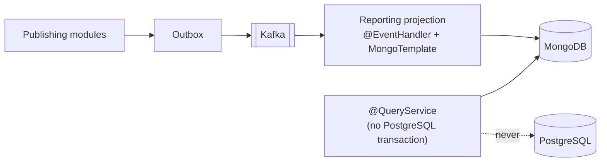

# ADR-0030 — Spring Data MongoDB as the Read-Model Access Technology

**Document type:** Architecture Decision Record
**Status:** Proposed
**Date:** 2026-09-08
**Deciders:** Solution Architecture
**Traces to:** `P13` · `CON-06` · `NFR-PERF-01` · `NFR-PERF-05` · `NFR-PERF-06` · `NFR-REL-05` · `NFR-MAINT-03`
**Related documents:** [Technology Stack](../Technology%20Stack.md) · [Database](../../02-backend/Database.md) · [Integration Contract](../../04-shared/Integration%20Contract.md) · [ADR-0013](./ADR-0013-mongodb-scoped-to-read-models.md)

---

## 1. Context and Problem Statement

[ADR-0013](./ADR-0013-mongodb-scoped-to-read-models.md) decides *whether* MongoDB is used and *for what*: pre-aggregated reporting documents and flexible denormalised views, Kafka-fed, eventually consistent, never authoritative. [`Database.md`](../../02-backend/Database.md) §7.2 decides *what shape* the four collections have. Neither decides **how the application reaches them**, and no other record does either.

[ADR-0010](./ADR-0010-jpa-write-model-jdbc-read-models.md) §5 hands the question off in one line and closes:

> MongoDB read models use Spring Data MongoDB, and Elasticsearch its own client; **this record governs PostgreSQL access only.**

That leaves the third Spring Data module in exactly the position ADR-0010 §1 described for the first two before it drew a boundary: *"'both' means each developer chooses per repository, and the persistence strategy becomes an accident of who wrote the class."* [`Technology Stack.md`](../Technology%20Stack.md) compounds it by naming only JPA and JDBC.

Four questions have no answer anywhere in the repository, and each has a wrong answer that looks reasonable:

1. **How does a projection write?** `MongoRepository.save()` is the obvious reach, and it is the one call that breaks §7.2's design.
2. **Where does consumer idempotency live?** `Database.md` §5.2 requires a `*_processed_event` row *"inserted in the same transaction as the handler's own write"* and lists `reporting_` among the modules that need one. **A reporting handler's write goes to MongoDB, so that shared transaction does not exist.** The rule is correct for every PostgreSQL consumer and silently unimplementable for this one. This record is where that is resolved rather than discovered.
3. **Where are indexes declared?** [ADR-0029](./ADR-0029-flyway-versioned-schema-migrations.md) governs PostgreSQL only. MongoDB's default — infer an index from an annotation at startup — is precisely the inferred-schema behaviour ADR-0029 restricted Hibernate to `validate` to prevent.
4. **What transaction does a Mongo-backed query run in?** [ADR-0007](./ADR-0007-jmolecules-tactical-ddd.md) meta-annotates `@QueryService` with `@Transactional(readOnly = true)`, which binds the ADR-0009 PostgreSQL transaction manager. Applied unchanged to a dashboard query, it opens a PostgreSQL connection to serve a read that never touches PostgreSQL.

The last one is worth stating plainly, because it inverts the point of the store: `CON-06` and `NFR-PERF-05` put reporting on MongoDB so that a dashboard query is *physically incapable* of contending with checkout. A `@QueryService` that holds an idle transactional connection for the duration of every dashboard request reintroduces the contention at the connection pool, which is the one resource both paths still share.

## 2. Decision Drivers

- `Integration Contract.md` §6.4 — *"Idempotent, without exception"* — is a correctness requirement under at-least-once delivery, and `Database.md` §7.2 already designs the composite `_id` values (`day|currency`, `sku|warehouseId|day`) *"so that an at-least-once redelivery upserts rather than double-counts."* The access pattern must be the one that honours that design.
- `Integration Contract.md` §6.3/§6.4 — ordering holds within a partition and nowhere else; a reporting projection consumes from *every* context, so it is by definition a cross-aggregate consumer that must tolerate reordering.
- `NFR-PERF-05` / `CON-06` — reporting must not contend with transactional work, at any layer including the connection pool.
- `NFR-PERF-06` — dashboards may lag 5 minutes and no more, which makes projection lag a measured and alerted quantity rather than an accepted unknown.
- `NFR-REL-05` — recovery without manual data repair. A projection that cannot be replayed is repaired by hand.
- `CON-03` / `NFR-MAINT-03` — no persistence type on a domain object, the same rule ADR-0010 applies to JPA entities.
- `Database.md` §7.2's admission test already keeps *what* goes in Mongo narrow. Nothing yet keeps *how it is accessed* narrow.

## 3. Considered Options

**Option 1 — `MongoTemplate` for the projection write path; repository interfaces for keyed reads; named aggregation pipelines for everything else.** *(chosen)*

- **Pros:** `MongoTemplate` is the only one of these that can express a criteria-guarded `$inc` with `upsert(true)` — which is exactly what §7.2's composite `_id` scheme was designed around, and therefore the only option that implements the design already committed to. Repository interfaces still serve `_id` and single-field lookups, where a derived method is genuinely less code than a hand-written query. An aggregation pipeline written out in the query service is inspectable against `NFR-PERF-01` at the statement level, which is the same property ADR-0010 §4 requires of read SQL: *"Read queries name their SQL."*
- **Cons:** Two access styles inside one module, and the boundary between them is a judgement call rather than a compiler error. `MongoTemplate` is untyped enough that a field-name typo is a silent no-op rather than a failure.

**Option 2 — `MongoRepository` everywhere.**

- **Pros:** One access style. Derived query methods. The smallest amount of code, and the shape most Spring developers reach for first.
- **Cons:** `save()` is a whole-document replace. On redelivery it re-writes the document from the handler's in-memory view, which either double-counts (if the handler read-modify-writes) or discards a concurrent projection's field (if it does not) — and the read-modify-write variant is the same read-check-write race [ADR-0011](./ADR-0011-optimistic-locking-reservation-model.md) §1 rejects on the transactional path, for the same reason. A derived method cannot express `$inc`, cannot express `upsert`, and cannot express a criteria guard, so the three mechanisms this record depends on are all unavailable. It is not that this option is harder; it is that it cannot implement `Database.md` §7.2 as written.

**Option 3 — Plain `MongoClient` and the driver's `Document` API, no Spring Data.**

- **Pros:** Nothing hidden; every command is the command that runs; one fewer Spring module.
- **Cons:** A hand-written document mapper per projection and per query result. This is the boilerplate ADR-0010 §3 rejected `JdbcTemplate` for, and `P15` names as a maintenance cost. Spring Data MongoDB gives the same command-level explicitness through `MongoTemplate` with mapping included, so the trade is cost for nothing.

**Option 4 — `ReactiveMongoTemplate` and the reactive driver.**

- **Pros:** Non-blocking I/O on a read path that fans out across four collections; the natural fit if the platform were reactive.
- **Cons:** [ADR-0027](./ADR-0027-java-21-spring-boot-4-gradle.md) chose Spring MVC on virtual threads over WebFlux for the whole platform. A reactive island in one module means two concurrency models, two error-propagation styles, and a `block()` at every boundary where the two meet. Virtual threads already remove the blocking-I/O cost this would buy.

## 4. Decision Outcome

**Chosen: Option 1.** The access technology follows the same principle ADR-0010 established — the tool is chosen by the path, not by preference — extended to the projected read stores.

| Commitment | Detail |
|---|---|
| **Only an `@EventHandler` writes** | Kafka consumers project into MongoDB. No `@ApplicationService`, no controller, no scheduled job writes a document — the same exclusivity [ADR-0014](./ADR-0014-elasticsearch-search-read-model.md) §4 sets for the search index, for the same reason: a store with two writers has two shapes. |
| **No new stereotype** | ADR-0007's existing vocabulary covers it: `@EventHandler` writes, `@QueryService` reads. A sixth stereotype for one datastore would add vocabulary without adding a rule that ArchUnit can check. |
| **Every write is one criteria-guarded upsert** | A single `updateOne` with `upsert(true)`, keyed on the `_id` §7.2 already designs. Never a `find` followed by a `save`. Single-document updates are atomic in MongoDB, and that atomicity is the whole of the concurrency story here — which is why the guard must live in the update's criteria, not in the handler's control flow. |
| **Counter documents dedupe by an in-document applied-event ring** | `$inc` is not idempotent, so `report_sales_daily` and `report_inventory_movement` guard on `appliedEvents` not containing the envelope's `eventId` (`Integration Contract.md` §6.1) and `$push` it with `$slice` to a bounded ring in the same update. Zero documents modified means already applied. **On a first-write race the upsert surfaces a duplicate-key error rather than a no-op; the handler treats that as already-applied and acknowledges.** Stated because it looks like a failure in a log and is not. |
| **Snapshot documents dedupe by a high-water mark** | `report_product_performance` and `report_customer_activity` are `$set`-only, which is naturally idempotent, so they need no ring — but they do need ordering. The criteria admits the update only when the envelope's `occurredAt` is newer than the document's `lastEventAt`. This is what makes `Integration Contract.md` §6.4's *"tolerate reordering across aggregates"* a mechanism rather than a hope: a reporting projection consumes every context, so it is never partition-ordered. |
| **`reporting_processed_event` is not created** | `Database.md` §5.2 requires the processed-event row in the same transaction as the handler's write, and there is no transaction spanning PostgreSQL and MongoDB. A row in PostgreSQL and a document in MongoDB written separately give at-most-once on one side and at-least-once on the other, with a crash window between them. The two guards above put the dedupe **inside the document being updated**, so it is the same atomic write, which is what §5.2's rule was actually asking for. §5.2 governs PostgreSQL consumers; this row governs MongoDB ones. |
| **No `MongoTransactionManager` is registered** | Multi-document transactions are not used. Per-document atomicity is the mechanism; a projection that needs two documents to change together has failed [ADR-0013](./ADR-0013-mongodb-scoped-to-read-models.md) §4's admission test and belongs in PostgreSQL. Not registering the manager makes that unavailable rather than discouraged. |
| **A Mongo-backed `@QueryService` carries no PostgreSQL transaction** | `@Transactional` is suppressed on these classes. ADR-0007's meta-annotation binds the ADR-0009 transaction manager, and a dashboard read that holds a transactional connection contends with checkout at the pool — the one resource `CON-06`'s physical separation does not otherwise separate. The stereotype stays for its architectural meaning; the transaction does not. |
| **Money is `Decimal128`, never a floating-point type** | A `MongoCustomConversions` pair maps `BigDecimal` both ways. Same rule and same reason as §7.1's `scaled_float` for Elasticsearch: *"a rounding artefact in a search result is a support ticket"* — in a revenue figure it is a reconciliation dispute. |
| **Indexes are declared, never inferred** | `auto-index-creation` is off. One startup component creates every index in `Database.md` §7.2 and nothing else. Inferring an index from an annotation at startup is the same class of behaviour ADR-0029 restricted Hibernate to `validate` to prevent: the schema stated in the document must be the schema that exists. A dedicated migration tool (Mongock or equivalent) is **rejected** — a sixth tool to version four collections that are rebuilt rather than migrated is not earned. |
| **A `@Document` class is an infrastructure type** | It lives in the owning module's `infrastructure` package and is never referenced from `domain` or `application`, exactly as ADR-0010 §4 requires of JPA entities. `NFR-MAINT-03` does not distinguish between ORMs. |
| **Collections are versioned; a shape change is a replay** | `report_sales_daily_v1` behind the name the query side uses, rebuilt from Kafka into the new collection and swapped, as [ADR-0014](./ADR-0014-elasticsearch-search-read-model.md) does for `ecp-products-v1`. This is what `NFR-REL-05`'s *"without manual data repair"* means for a derived store: there is no migration to write, because there is no data to preserve. |
| **Projection lag is alerted, not merely observable** | Per collection, the age of the newest applied event's `occurredAt`. Alert threshold below `NFR-PERF-06`'s 5 minutes. [ADR-0013](./ADR-0013-mongodb-scoped-to-read-models.md) §5 names lag monitoring as a cost with *"lag must be alerted on, not merely observable"* and assigns it to nobody; it is assigned here. |

**What this record does not reopen.** [ADR-0013](./ADR-0013-mongodb-scoped-to-read-models.md) §4's admission test and its list of what MongoDB is never used for stand unchanged, as does [ADR-0009](./ADR-0009-postgresql-source-of-truth.md). This record governs access to a scope already decided; it does not widen it. In particular, the mechanisms above are deliberately incapable of supporting a write path — there is no transaction manager, no application-service write, and no document a business invariant is checked against.

## 5. Consequences

### Positive

- `Database.md` §7.2's composite `_id` design becomes implemented rather than aspirational — the upsert it was designed for is the upsert the code issues.
- The §5.2 gap is closed before it is hit. Discovering at implementation time that the platform's stated idempotency mechanism does not apply to one consumer is the expensive version of this.
- `CON-06`'s physical separation now holds at the connection pool too, which is the only layer where it previously leaked.
- Out-of-order delivery is handled by a criteria guard rather than by partition-ordering assumptions that a cross-context consumer cannot make.

### Negative

- **Two idempotency models in one codebase.** `@Version` optimistic locking on the transactional path ([ADR-0011](./ADR-0011-optimistic-locking-reservation-model.md)), criteria-guarded upserts on the projection path. Both are "check and claim in one statement," which is the saving grace, but a developer must know which path they are on — the same cognitive load ADR-0010 §5 accepted for JPA-versus-JDBC, now paid a second time.
- **The suppressed transaction is a footgun.** Nothing about the name `@QueryService` signals that this one carries no transaction, and the failure it prevents is a slow pool leak under load, not an exception in a test. It has to be an ArchUnit rule ([ADR-0018](./ADR-0018-architecture-governance-ci-gate.md)) or it will be undone by the first developer who adds a Mongo query service by copying a PostgreSQL one.
- **A hand-rolled index initializer is code that drifts.** It duplicates §7.2, and nothing fails if a new collection's index is added to the document and not to the initializer. Rejecting Mongock is what buys this; the mitigation is that four collections is small enough to review, and that mitigation expires if the count grows.
- **The applied-event ring is bounded, so dedupe is bounded.** A redelivery arriving after the ring has rotated past its `eventId` will double-count. The window must exceed Kafka's maximum redelivery horizon — **now fixed** in [`Backend Architecture.md`](../../02-backend/Backend%20Architecture.md) §4.3, and smaller than this record assumed: redelivery follows an uncommitted offset after a crash or rebalance, bounding it at `max.poll.interval.ms` plus the retry budget — minutes, not topic retention. The inherited dependency is discharged.
- **`MongoTemplate` field names are strings.** A typo is a no-op, not a compile error. Constants or a property-path helper reduce it; nothing removes it.

### Neutral / follow-on

- Projection class structure, replay tooling, and the connection/pool settings are for [`Backend Architecture.md`](../../02-backend/Backend%20Architecture.md) — the same deferral [ADR-0013](./ADR-0013-mongodb-scoped-to-read-models.md) §5 and [ADR-0014](./ADR-0014-elasticsearch-search-read-model.md) §5 make.
- The ring size follows from Kafka retention and redelivery, both deferred above. Until they are fixed, the ring is sized against the deferred value's stated upper bound, not against a guess.
- If [ADR-0013](./ADR-0013-mongodb-scoped-to-read-models.md) §5's Option 2 is ever revisited and MongoDB is dropped for a PostgreSQL reporting instance, this record is superseded rather than amended — its rules are all MongoDB-specific.

## 6. Related Decisions

[ADR-0005](./ADR-0005-clean-architecture-ports-and-adapters.md) · [ADR-0007](./ADR-0007-jmolecules-tactical-ddd.md) · [ADR-0008](./ADR-0008-cqrs-command-query-separation.md) · [ADR-0010](./ADR-0010-jpa-write-model-jdbc-read-models.md) · [ADR-0012](./ADR-0012-transactional-outbox-and-kafka.md) · [ADR-0013](./ADR-0013-mongodb-scoped-to-read-models.md) · [ADR-0014](./ADR-0014-elasticsearch-search-read-model.md) · [ADR-0018](./ADR-0018-architecture-governance-ci-gate.md) · [ADR-0029](./ADR-0029-flyway-versioned-schema-migrations.md)
