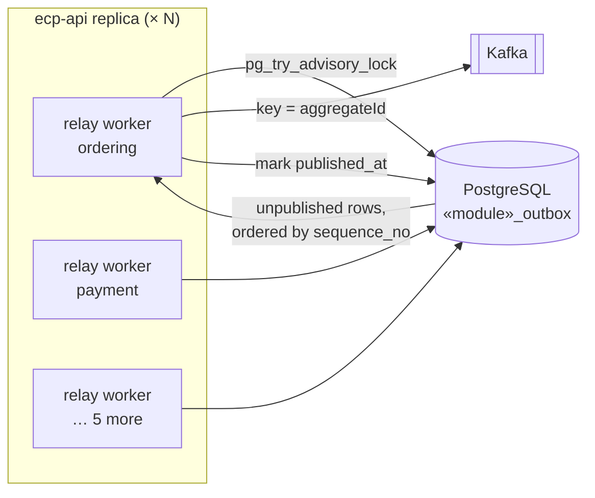

# ADR-0033 — A Polling Outbox Relay over Per-Module Outbox Tables, Not Spring Modulith Externalisation

**Status:** **Proposed**
**Date:** 2026-09-09
**Traces to:** `P2` · `P6` · `P10` · `CON-07` · `NFR-REL-05` · `NFR-REL-06` · `NFR-AVAIL-01` · `NFR-OBS-04` · `AC-03`

---

## 1. Context and Problem Statement

[ADR-0012](./ADR-0012-transactional-outbox-and-kafka.md) §5 defers *"relay implementation (Spring Modulith's event publication registry versus a bespoke poller)"* to `Backend Architecture.md`. Two things have happened since that sentence was written, and together they change what the choice actually is.

First, [`Database.md`](../../02-backend/Database.md) §5.1 gave the outbox a physical shape: **one `<module>_outbox` table per publishing module**, its columns matching the [`Integration Contract.md`](../../04-shared/Integration%20Contract.md) §6.1 envelope one for one, with `published_at IS NULL` marking an unpublished row and a partial index over exactly those rows. It rejected a single shared table explicitly, on [ADR-0009](./ADR-0009-postgresql-source-of-truth.md) §4's rule that a module's tables are written only by that module's adapters: *"A single table written by seven modules is a table owned by none."* And it closed by scoping the framework's own registry: Spring Modulith's event-publication table *"exists to complete an in-process handler after a restart, not to publish to a broker."*

Second, [`Deployment Diagram.md`](../Deployment%20Diagram.md) §4 placed the relay in-process inside `ecp-api` rather than in its own container, and then left the hard part open: *"Because the relay must not publish the same row from N replicas, it is subject to the same single-runner constraint as the scheduler"* — where §6 offers a dedicated single-replica container or a database-backed lock and states plainly that **neither is chosen**.

So there are really two questions, and the second is the one nobody has answered. **Which mechanism moves an outbox row to Kafka**, and **what stops N replicas from all doing it at once** — while preserving the per-aggregate ordering that [`Integration Contract.md`](../../04-shared/Integration%20Contract.md) §6.3 makes a contract rather than a tuning preference: *"Any other key makes the order lifecycle unobservable in order."*

The ordering requirement is what makes this harder than it looks. The obvious concurrency primitive for a work queue in PostgreSQL is `FOR UPDATE SKIP LOCKED`, and it is wrong here for a reason that will not show up in any test that is not concurrent.

## 2. Decision Drivers

- `NFR-REL-06` — at-least-once delivery to every dependent process, *tested under induced failure* ([`Testing and Benchmark Strategy.md`](../Testing%20and%20Benchmark%20Strategy.md) §6.5, L6).
- `NFR-REL-05` — recovery without manual data repair. A relay that can lose its place, or that needs a human to unstick it, fails this.
- [`Integration Contract.md`](../../04-shared/Integration%20Contract.md) §6.3 — ordering within a partition is a **contract**. Any relay design that can publish an aggregate's events out of order breaks it.
- [`Database.md`](../../02-backend/Database.md) §5.1 — the outbox already exists, per module, with a defined shape. A relay that ignores it makes that section dead.
- [`Deployment Diagram.md`](../Deployment%20Diagram.md) §4, §6 — in-process, `N` replicas, single-runner constraint unresolved.
- [ADR-0028](./ADR-0028-deployment-topology-containerisation.md) — one `data-01` VM. Each additional moving part is charged to the same failure domain.
- `NFR-OBS-04` and [`CQRS.md`](../../02-backend/CQRS.md) §9 — outbox lag is an alerted signal at 30 s, which requires the relay to expose progress rather than merely make it.

## 3. Considered Options

### What publishes

**Option 1 — A bespoke JDBC relay polling the `<module>_outbox` tables.** *(chosen)*

- **Pros:** Publishes exactly what [`Database.md`](../../02-backend/Database.md) §5.1 designed, with no second representation of an event anywhere in the system. The wire form is the stored form ([ADR-0032](./ADR-0032-json-event-serialisation-and-schema-contract.md)), so replay reproduces the original publication rather than re-deriving it. Every operational parameter — poll interval, batch size, ordering, backoff, quarantine — is ours to set and to observe, which is what `NFR-OBS-04`'s lag metric needs. Per-module tables give per-module parallelism for free.
- **Cons:** Code we write and maintain, in a category where frameworks exist. Polling has a latency floor and a steady-state query cost even when idle. Getting the concurrency right is our problem, and getting it wrong is the ordering bug in §3's second half.

**Option 2 — Spring Modulith `@Externalized` with `spring-modulith-events-kafka` over the framework's event-publication registry.**

This is the strongest competitor and it is already on the classpath, so it deserves a straight answer rather than a dismissal.

- **Pros:** No relay code at all. The registry row is written in the same transaction as the business change, so the atomicity argument of [ADR-0012](./ADR-0012-transactional-outbox-and-kafka.md) §4 holds identically. Incomplete publications are resubmitted on startup by the framework. Routing and partition key are expressible declaratively as `@Externalized("ecp.ordering.order.v1::#{aggregateId}")`. It is maintained by the same project that supplies the module boundaries.
- **Cons:** Four, and each is independently sufficient.
  1. **The registry is one shared table**, written by every module. That is precisely the arrangement [`Database.md`](../../02-backend/Database.md) §5.1 rejected on [ADR-0009](./ADR-0009-postgresql-source-of-truth.md) §4 grounds, and adopting it would make §5.1's seven tables dead text rather than a design.
  2. **It stores a serialised Java event type.** The durable artefact then carries the publisher's class identity, which [`Module Dependency Diagram.md`](../../02-backend/Module%20Dependency%20Diagram.md) §5 and [ADR-0032](./ADR-0032-json-event-serialisation-and-schema-contract.md) both exist to keep out of the contract, and which makes a publisher-side rename a deserialisation failure over history already written.
  3. **Completion is per listener, not per topic.** A registry row is complete when its listener finished; there is no column that means "acknowledged by the broker for this topic." The envelope fields [`Database.md`](../../02-backend/Database.md) §5.1 stores as columns — `topic`, `correlation_id`, `aggregate_id`, `attempt_count`, `last_error` — have nowhere to live, and outbox lag becomes a metric with no field to read.
  4. **No ordering guarantee on resubmission.** Startup republication of incomplete publications is not ordered per aggregate, so a crash mid-batch can emit `OrderPaid` before `OrderCreated` — the exact hazard [ADR-0012](./ADR-0012-transactional-outbox-and-kafka.md) §5 names.

  Rejected for the Kafka path. **Retained, unchanged, for what [`Database.md`](../../02-backend/Database.md) §5.1 already scopes it to:** completing in-process `@ApplicationModuleListener` handlers after a restart. The two mechanisms coexist and must not be confused, which is why this record says so twice.

**Option 3 — Debezium with the outbox event router, reading the PostgreSQL WAL.**

- **Pros:** The canonical outbox implementation at scale. No polling, no relay code, near-zero publication latency, and correct ordering by construction — the WAL *is* the total order. [ADR-0012](./ADR-0012-transactional-outbox-and-kafka.md) §3's rejection of CDC does not apply, because the outbox router publishes the domain event that the application wrote, not a row diff; that objection was about using CDC as the event contract, which this is not.
- **Cons:** A Kafka Connect worker is a further JVM process and a further stateful thing (its own offsets, its own status topics) on the one `data-01` VM that [`Deployment Diagram.md`](../Deployment%20Diagram.md) §8 already names as *"one failure domain with no replica."* It requires `wal_level=logical` and a replication slot, and an unconsumed slot pins WAL until the disk fills — a way to lose the transactional database that does not currently exist. It also moves the publication logic out of the deployable and into infrastructure configuration, which for a `P15`-driven design means a reviewer reads a connector JSON instead of code. Rejected on operational surface for **this** topology, not on merit — §5 records it as the migration to make if the data tier is ever replicated.

**Option 4 — `LISTEN`/`NOTIFY` to wake a relay on insert, with no polling.**

- **Pros:** Removes the latency floor and the idle query cost.
- **Cons:** `NOTIFY` is fire-and-forget and is not delivered to a listener that is not connected, so a relay restart silently misses everything published during the gap. It is therefore a latency optimisation over a poller, never a replacement for one — and a system that needs the poller anyway gains a second code path for the same job. Deferred to §5 as an optional refinement.

### What stops N replicas from double-publishing

**Option A — `SELECT … FOR UPDATE SKIP LOCKED`, every replica relaying concurrently.**

- **Pros:** The standard answer. No leader, no lock table, and throughput rises with replica count.
- **Cons:** **It breaks per-aggregate ordering.** Replica 1 claims and locks the rows for order `X` up to sequence 3; order `X`'s sequence 4 is inserted a moment later and replica 2 claims it, because `SKIP LOCKED` skips only *locked rows*, not *the aggregate those rows belong to*. Replica 2 can reach the broker first. A consumer then observes `OrderPaid` before `OrderCreated`, which [`Integration Contract.md`](../../04-shared/Integration%20Contract.md) §6.3 forbids as a contract. The failure is invisible at any concurrency of one and intermittent above it — the worst discovery profile there is. Rejected, and recorded here so it is not reintroduced as an optimisation.

**Option B — ShedLock, or another database-backed scheduled-task lock.**

- **Pros:** [`Deployment Diagram.md`](../Deployment%20Diagram.md) §6 already names it as a candidate for the scheduler; using one mechanism for both is coherent.
- **Cons:** A new dependency and a new lock table for a component that needs neither. Its failure mode is the one §6 already writes down: *"a job whose runtime exceeds its lock duration can still double-fire"* — and a relay is a continuous loop, not a job with a predictable runtime, so choosing a lock duration means choosing between double-publishing and a stalled relay. Both are worse than the alternative below.

**Option C — A dedicated single-replica relay container.**

- **Pros:** Trivially correct: one process, therefore one publisher.
- **Cons:** Contradicts [`Deployment Diagram.md`](../Deployment%20Diagram.md) §4's in-process placement, adds a deployable, and makes the relay a single point of failure with no automatic recovery — if it stops, publication stops silently and `NFR-REL-05` depends on someone noticing. §6 already names silent stoppage as this option's cost.

**Option D — A PostgreSQL advisory lock per publishing module, taken by whichever replica gets it.** *(chosen)*

- **Pros:** No table, no new dependency, and no lock duration to guess: an advisory lock is held by a session and released automatically when that session ends, including when the JVM dies — so a crashed replica frees the lock without a timeout and another replica picks the module up on its next attempt. Per module rather than globally, so seven modules' relays distribute across replicas and the work parallelises while each module's stream stays strictly ordered under one publisher. The relay stays in-process, exactly where [`Deployment Diagram.md`](../Deployment%20Diagram.md) §4 put it.
- **Cons:** Holds a dedicated connection per module-relay for the lifetime of the lock, which must be sized into the pool. A replica holding the lock but making no progress — a paused JVM, an unresponsive broker — blocks that module's publication for as long as its connection survives, which is a liveness dependency on a metric alarm rather than on a timeout. Advisory locks are also invisible in ordinary schema tooling, so they are easy to forget about during a production investigation.

## 4. Decision Outcome

**Chosen: Option 1 + Option D.** A bespoke JDBC relay, in-process in `ecp-api`, one worker per publishing module, each claiming its module with a PostgreSQL advisory lock.

Each worker loops: try the lock for its module; if it is held elsewhere, sleep and retry; if acquired, poll that module's outbox, publish in order, mark published, repeat. The full loop, its configuration table, and its failure handling are [`Backend Architecture.md`](../../02-backend/Backend%20Architecture.md) §3.4; the decisions that shape it are here.

| Decision | Value | Why this and not otherwise |
|---|---|---|
| Claim | `pg_try_advisory_lock(hashtext('ecp.outbox.' || module))` | Non-blocking, session-scoped, auto-released on disconnect. No lock table, no lease duration to tune |
| Granularity | **Per publishing module**, seven locks | Ordering is only required within an aggregate, and an aggregate belongs to exactly one module. A global lock would serialise seven independent streams for no correctness gain |
| Ordering | `ORDER BY sequence_no`, a new monotonic column | `occurred_at` is not a total order — two events emitted in one transaction can share a timestamp, and a tie there reorders an aggregate's lifecycle. See §5 |
| Batch | Read `N` rows, publish **sequentially**, then one `UPDATE … WHERE event_id = ANY(…)` | Sequential publication inside the batch is what preserves order; the producer's in-flight window would otherwise reorder retries |
| Marking | `published_at = now()`, row retained | [`Database.md`](../../02-backend/Database.md) §5.1 — published rows are the evidence behind `NFR-REL-06` and the source for replay |
| Failure | `attempt_count` increments, `last_error` records, exponential backoff, **quarantine** after a threshold | A row that cannot be published must not block the rows behind it forever, and must not be forgotten either |
| Replay | The same worker, a `--replay` mode reading published rows in `sequence_no` order | Resolves [`CQRS.md`](../../02-backend/CQRS.md) §7.4 / §13 item 1 — see below |

**A redelivery is not a defect.** The relay publishes, then marks. A crash between the two republishes on restart, which is `NFR-REL-06`'s at-least-once by construction and is exactly what [`Integration Contract.md`](../../04-shared/Integration%20Contract.md) §6.4 obligation 1 requires every consumer to absorb. Marking before publishing would trade an at-least-once system for an at-most-once one, which is the failure mode [ADR-0012](./ADR-0012-transactional-outbox-and-kafka.md) exists to prevent.

**The outbox becomes the replay source of record.** [`CQRS.md`](../../02-backend/CQRS.md) §7.4 calls the retention question *"the most consequential open item in this document"* and offers two resolutions. Its resolution 1, log compaction keyed on `aggregateId`, is insufficient — compaction keeps the latest event per key and discards history, which serves snapshot-shaped projections and silently destroys the counter-shaped ones (R8, R11) that need every event. Its resolution 2 is chosen: Kafka retention is finite, the retained outbox rows are the durable history, and the relay's replay mode is *"the relay mode that republishes from the outbox"* that §7.4 anticipated. The retention figure itself is [`Backend Architecture.md`](../../02-backend/Backend%20Architecture.md) §4.3.

**Why the relay is not also the scheduler's answer.** [`Deployment Diagram.md`](../Deployment%20Diagram.md) §6 asks the same single-runner question of both. It is answered here only for the relay, because an advisory lock suits a continuous loop and suits a periodic job badly: a job that runs for two seconds every minute would hold or re-take a lock on a cadence that makes "who is the leader" meaningless, and ShedLock's lease model fits it better. The scheduler's half stays open.

## 5. Consequences

### Positive

- [`Deployment Diagram.md`](../Deployment%20Diagram.md) §4's single-runner constraint is satisfied without a new container, a new dependency, or a lease duration — and a crashed replica releases its claim without a timeout, so `NFR-REL-05`'s "no manual repair" holds through the recovery path as well as the happy one.
- Per-aggregate ordering is preserved by construction rather than by configuration, which is what [`Integration Contract.md`](../../04-shared/Integration%20Contract.md) §6.3 requires and what Option A quietly would not have delivered.
- [`Database.md`](../../02-backend/Database.md) §5.1's seven tables become the operative design instead of a description of something the framework would have replaced.
- [`CQRS.md`](../../02-backend/CQRS.md) §7.4's open item gains a resolution that covers counter-shaped projections, which compaction could not.
- Outbox lag is directly measurable — `now() − occurred_at` over rows where `published_at IS NULL` — which is the metric [`CQRS.md`](../../02-backend/CQRS.md) §9 alerts on at 30 s and which Option 2 had no field to compute.
- Kafka being unavailable leaves rows unpublished and the backlog growing. Checkout is unaffected, which is [ADR-0012](./ADR-0012-transactional-outbox-and-kafka.md)'s contribution to `NFR-AVAIL-01` still holding under the concrete implementation.

### Negative

- **This is code we own in a category where a framework was available.** Option 2 required none. The four objections to it are each sufficient, but the maintenance is real and it is paid every time Spring Modulith improves its externalisation.
- **Relay throughput is tied to application scaling** and, worse, is *not* improved by it for a single hot module: seven locks across `N` replicas means `ordering` is relayed by exactly one worker no matter how many replicas run. Under `NFR-SCAL-06`'s 10× peak the ordering module's publication rate is a single worker's rate, and that ceiling should be measured before it is trusted.
- **A stalled lock holder stalls a module.** A paused JVM that keeps its connection alive holds the lock and publishes nothing. Nothing detects this except the outbox-lag alarm, which makes that alarm load-bearing rather than merely informative.
- **A new column on seven tables.** `sequence_no BIGSERIAL` and a changed partial index are a follow-on edit to [`Database.md`](../../02-backend/Database.md) §5.1, required because `occurred_at` cannot order two events written in one transaction. Cheap now, because no migration has been applied; not cheap later.
- **Polling has a latency floor**, and a busy-poll interval short enough to hide it is a steady-state query cost against the transactional database that `P10` cares about. The partial index keeps each poll `O(backlog)`, which is what makes the cost bounded rather than absent.
- **Advisory locks are invisible to ordinary tooling.** Nothing in the schema shows them, and an operator debugging a stalled module will not find them unless they know to query `pg_locks`. This is written into [`Backend Architecture.md`](../../02-backend/Backend%20Architecture.md) §7 as a runbook item precisely because the mechanism does not announce itself.

### Neutral / follow-on

- Spring Modulith's event-publication registry stays, scoped exactly as [`Database.md`](../../02-backend/Database.md) §5.1 already scopes it: completing in-process handlers after a restart. `spring-modulith-events-kafka` is on the classpath and is **not** used for the Kafka path; removing it from the build would make that unambiguous.
- `LISTEN`/`NOTIFY` as a wake-up hint layered over the poller is a latency refinement available at any time, and does not change this record.
- **Debezium is the migration to make if the data tier is ever replicated.** Its objection here is `data-01`'s single failure domain and the WAL-slot risk, not the pattern. The relay's interface — read unpublished rows in order, publish, mark — is deliberately the same shape the outbox router implements, so the swap would not disturb the outbox schema or any consumer.
- Poll interval, batch size, backoff curve, quarantine threshold, and the connection-pool allowance for seven lock-holding sessions are all in [`Backend Architecture.md`](../../02-backend/Backend%20Architecture.md) §3.4 as configuration, not here.

## 6. Related Decisions

[ADR-0012](./ADR-0012-transactional-outbox-and-kafka.md) · [ADR-0032](./ADR-0032-json-event-serialisation-and-schema-contract.md) · [ADR-0009](./ADR-0009-postgresql-source-of-truth.md) · [ADR-0006](./ADR-0006-spring-modulith-module-boundaries.md) · [ADR-0028](./ADR-0028-deployment-topology-containerisation.md) · [ADR-0029](./ADR-0029-flyway-versioned-schema-migrations.md)
