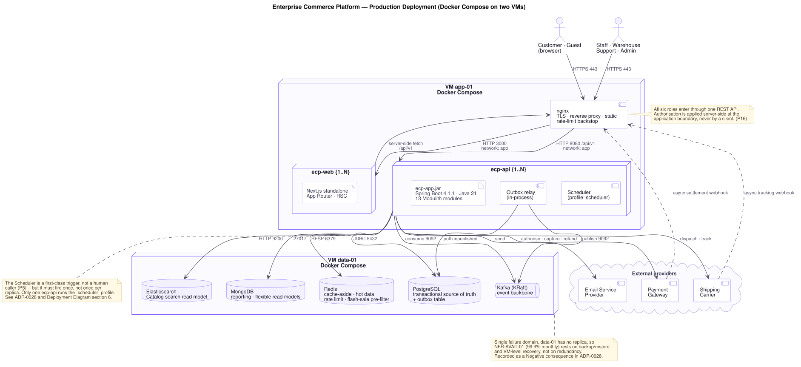
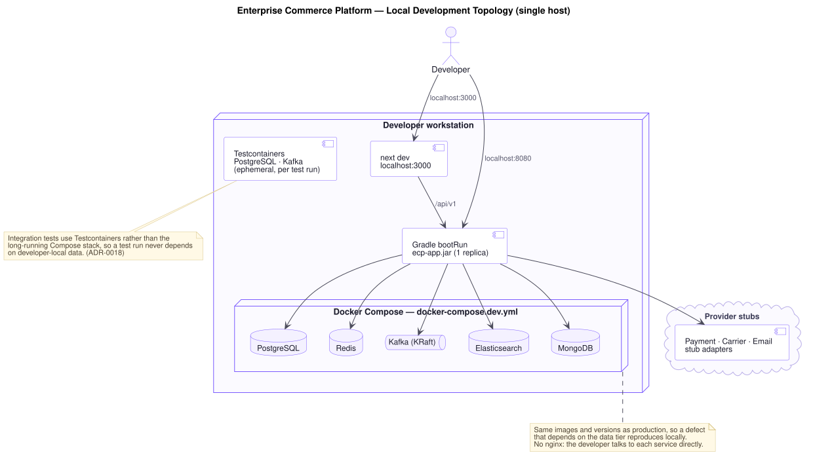

# Deployment Diagram — Enterprise Commerce Platform (ECP)

**Document type:** System architecture specification
**Status:** **Proposed** — awaiting ratification alongside [ADR-0028](./ADR/ADR-0028-deployment-topology-containerisation.md)
**Audience:** Engineering, Operations, Architecture Review
**Related documents:** [Solution Architecture](./Solution%20Architecture.md) · [ADR-0002](./ADR/ADR-0002-modular-monolith-deployment-unit.md) · [ADR-0028](./ADR/ADR-0028-deployment-topology-containerisation.md) · [Module Dependency Diagram](../02-backend/Module%20Dependency%20Diagram.md) · [Integration Contract](../04-shared/Integration%20Contract.md)

---

## 1. Purpose and Status

[`Solution Architecture.md`](./Solution%20Architecture.md) §3 is explicit that its diagram is a **logical** architecture. [`ADR-0002`](./ADR/ADR-0002-modular-monolith-deployment-unit.md) §5 is equally explicit about what was left out:

> *"Deployment topology, containerisation, and CI provider remain undecided; SRS §1.2 explicitly leaves them open and no record covers them yet."*

This document closes the first two. It states where the platform physically runs, what runs on each node, and — in §6 — which quality targets that topology genuinely meets and which it does not. [`ADR-0028`](./ADR/ADR-0028-deployment-topology-containerisation.md) records *why this topology and not another*; this document records *what it is*.

Everything here carries `Proposed` status. No upstream document states a deployment topology, so per [ADR/README](./ADR/README.md) §2 this is a first-time decision, and it is not quietly promoted.

**Still undecided, deliberately:** the CI provider, the image registry, and the cloud or datacentre the two VMs are provisioned in. None is an architecture decision — each is an operations choice this topology is compatible with in any form.

---

## 2. Production Topology



Two virtual machines, each running a Docker Compose project. The split is not arbitrary: it separates the tier that scales by adding replicas from the tier that scales by growing the machine, and it means a redeploy of the application never restarts a database.

| Node | Runs | Artefact / image | Why here |
|---|---|---|---|
| **VM `app-01`** | `nginx` | `nginx:stable-alpine` | TLS termination, reverse proxy, static assets, and a rate-limit backstop in front of the application's own Redis-backed limiter (`NFR-SEC-05`) |
| | `ecp-web` `{1..N}` | Next.js standalone output | Storefront and admin console ([ADR-0019](./ADR/ADR-0019-nextjs-app-router-rendering-strategy.md)) |
| | `ecp-api` `{1..N}` | `ecp-app.jar` on a JRE 21 base | The entire modular monolith — all thirteen modules, one process ([ADR-0002](./ADR/ADR-0002-modular-monolith-deployment-unit.md), [ADR-0027](./ADR/ADR-0027-java-21-spring-boot-4-gradle.md)) |
| **VM `data-01`** | PostgreSQL | `postgres:16` | Transactional source of truth **and** the outbox table — they must share one transaction ([ADR-0009](./ADR/ADR-0009-postgresql-source-of-truth.md), [ADR-0012](./ADR/ADR-0012-transactional-outbox-and-kafka.md)) |
| | Redis | `redis:7` | Cache-aside, hot data, rate limiting, flash-sale pre-filter ([ADR-0015](./ADR/ADR-0015-redis-cache-and-rate-limiting.md)) |
| | Kafka (KRaft) | `confluentinc/cp-kafka` | Event backbone. KRaft mode — no ZooKeeper node to operate ([ADR-0012](./ADR/ADR-0012-transactional-outbox-and-kafka.md)) |
| | Elasticsearch | `elasticsearch:8` | Catalog's event-fed search read model ([ADR-0014](./ADR/ADR-0014-elasticsearch-search-read-model.md)) |
| | MongoDB | `mongo:7` | Reporting and flexible read models only ([ADR-0013](./ADR/ADR-0013-mongodb-scoped-to-read-models.md)) |
| **External** | Payment Gateway · Shipping Carrier · Email Service Provider | — | Reached through the `PaymentProcessor`, `ShippingProvider`, and `NotificationSender` ports (Solution Architecture §4) |

**Inbound webhooks terminate at `nginx`, not at a container.** The payment settlement callback and the carrier tracking callback are asynchronous and arrive from the public internet, so they enter through the same TLS boundary as user traffic and are routed to `ecp-api`. They are idempotent and correlate to an order by a stable reference — the property Solution Architecture §4 requires so that a redelivered callback never produces a second effect.

---

## 3. Runtime Artefacts

The modular monolith becomes visible here as exactly what it claims to be: **one artefact.**

```nano
  ecp-app.jar                    a single Spring Boot bootJar from the `app` subproject
  │
  ├── shared-kernel              Money · typed IDs · Address
  ├── identity      ├── ordering        ├── notification
  ├── catalog       ├── payment         ├── audit
  ├── inventory     ├── shipping        └── reporting
  ├── cart          ├── promotion
  │                 ├── review
  └── app                        composition root — configuration and wiring only
```

Thirteen Spring Modulith modules whose boundaries are verified at build time ([`Module Dependency Diagram.md`](../02-backend/Module%20Dependency%20Diagram.md)) ship inside one file and start as one process. That is the trade [`ADR-0002`](./ADR/ADR-0002-modular-monolith-deployment-unit.md) makes deliberately: boundaries enforced by the build rather than by the network.

| Artefact | Produced by | Deployed as |
|---|---|---|
| `ecp-app.jar` | `./gradlew :app:bootJar` — `app` is the only subproject applying `org.springframework.boot` | Layered container image, JRE 21 base |
| Next.js standalone bundle | `next build` with `output: "standalone"` | Node 22 container image |
| Schema migrations | Flyway versioned SQL scripts in the `app` subproject ([ADR-0029](./ADR/ADR-0029-flyway-versioned-schema-migrations.md)) | Run on `ecp-api` startup, before the application context is ready — see §8 |

**The outbox relay runs in-process inside `ecp-api`, not as a separate container.** [`ADR-0012`](./ADR/ADR-0012-transactional-outbox-and-kafka.md) §5 leaves the relay's implementation to `Backend Architecture.md`; this topology only requires that wherever it runs, it can reach both PostgreSQL and Kafka. Keeping it in-process means one fewer deployable, at the cost of tying relay throughput to application scaling. Because the relay must not publish the same row from N replicas, it is subject to the same single-runner constraint as the scheduler (§6).

---

## 4. Networks, Ports, and Volumes

Three Compose networks, so that a container can only reach what it is meant to reach.

| Network | Members | Purpose |
|---|---|---|
| `edge` | `nginx` | The only network with a host-published port |
| `app` | `nginx`, `ecp-web`, `ecp-api` | Reverse-proxy traffic and server-side rendering fetches |
| `data` | `ecp-api`, and every service on `data-01` | Private VM-to-VM link; not routable from the public internet |

| Service | Port | Published to host? |
|---|---|---|
| `nginx` | 443, 80 (redirect only) | **Yes** — the sole ingress |
| `ecp-web` | 3000 | No |
| `ecp-api` | 8080; 8081 management/actuator | No |
| PostgreSQL · Redis · Kafka · Elasticsearch · MongoDB | 5432 · 6379 · 9092 · 9200 · 27017 | No — reachable only over `data` |

Every stateful service gets a named volume on `data-01` (`pgdata`, `redisdata`, `kafkadata`, `esdata`, `mongodata`). `app-01` holds no persistent state at all, which is what makes replacing an `ecp-api` container a safe, routine operation.

**`ecp-api` is stateless by construction.** Session state lives in a rotating refresh token held server-side and an httpOnly cookie held by the browser ([ADR-0016](./ADR/ADR-0016-jwt-refresh-rotation-rbac.md), [ADR-0025](./ADR/ADR-0025-httponly-cookie-session.md)), and hot data lives in Redis — so no replica owns anything another replica would miss, and `nginx` needs no sticky sessions.

---

## 5. Configuration and Secrets

| Concern | Rule |
|---|---|
| Configuration | Environment variables per Spring profile; a `.env` file per environment, never committed |
| Secrets | Injected at runtime as environment variables or Compose secrets. **No credential, key, or connection string is ever baked into an image or committed to the repository.** |
| Image identity | Images are tagged with the build's commit SHA, never `latest`, so a running container is traceable to a source revision |
| Environments | `dev` (§7), `staging`, `prod` — same images, different `.env` and different replica counts. An image promoted between environments is byte-identical. |
| Provider credentials | Payment, carrier, and email credentials are scoped per environment; staging never holds a production provider key |

This satisfies `NFR-SEC-07`'s spirit at the deployment layer: credentials never appear in an image, a log, or an audit entry.

---

## 6. What This Topology Delivers — and Where It Falls Short

The honest section. Two VMs running Compose is a proportionate choice for the scale in SRS §6, and it is not a substitute for redundancy. Both halves of that sentence matter.

### Targets this topology meets

| Target | How |
|---|---|
| `NFR-PERF-01` catalog reads ≤ 300 ms p95 | Redis cache-aside absorbs the read volume before it reaches PostgreSQL; `nginx` serves static assets directly |
| `NFR-PERF-03`/`04` search and autocomplete | Elasticsearch answers on its own tier, never touching the transactional store |
| `NFR-PERF-05`/`06` reporting must not degrade transactions | Reporting queries hit MongoDB, a physically separate service from PostgreSQL — `CON-06` ("transactional and analytical workloads do not compete for the same resources") holds at the process level, not just logically |
| `NFR-REL-01`/`02` no partial completion | One PostgreSQL instance, one transaction manager. The Order-Placement Partnership's three-aggregate atomicity is a plain local transaction |
| `NFR-REL-05`/`06` no event silently lost | The outbox table lives in the same PostgreSQL instance as the business tables, so the insert is part of the business transaction. Kafka being down delays publication; it does not fail checkout |
| `NFR-AVAIL-02` non-essential failure degrades gracefully | Elasticsearch, MongoDB, and the Reporting read model are separate containers. Each can be down while browse, cart, checkout, and payment continue |
| `NFR-SEC-05` per-caller rate limits | Redis-backed limiter in `ecp-api`, with an `nginx` connection-rate backstop in front of it |

### Where it falls short — and what that costs

**`NFR-AVAIL-01` (99.9% monthly on the purchase path) is not structurally guaranteed.** 99.9% monthly permits roughly 43 minutes of downtime. This topology has two single points of failure that consume that budget directly:

- **`data-01` is one failure domain with no replica.** Losing the VM loses PostgreSQL, Redis, Kafka, Elasticsearch, and MongoDB simultaneously, and recovery time is restore-from-backup time. Mitigation is a stated RPO/RTO backed by tested restores — continuous PostgreSQL WAL archiving off-VM plus a nightly full backup, and a restore drill on a schedule, not on an incident. Redis, Elasticsearch, and MongoDB hold only derived state and are rebuildable: every read model is replayable from Kafka by design ([ADR-0008](./ADR/ADR-0008-cqrs-command-query-separation.md)), so the recovery that matters is PostgreSQL's.
- **`app-01` is one host.** Running `ecp-api` at `N > 1` gives rolling restarts and survives a container crash, but not a host failure.

Stating this plainly is the point. `NFR-AVAIL-01` rests on assumption **[A-12]** and is met here operationally — by backup, monitoring, and fast recovery — not architecturally. If the business ratifies 99.9% as a hard commitment rather than an assumption, this topology is the wrong one and [`ADR-0028`](./ADR/ADR-0028-deployment-topology-containerisation.md)'s Option 2 becomes the right one.

**`NFR-SCAL-06` (10× median throughput at peak) is bounded by one VM.** Absorption comes from three places that all work here: Redis takes the read spike, Elasticsearch takes search off the transactional path, and `ecp-api` scales to N replicas behind `nginx`. But N is capped by `app-01`'s cores and memory, and PostgreSQL's write capacity is capped by `data-01`. This is [`ADR-0002`](./ADR/ADR-0002-modular-monolith-deployment-unit.md) §5's "scaling is all-or-nothing at the process level" made concrete: scaling is vertical first, and the ceiling is a machine size, not a cluster size. `NFR-SCAL-06` should be validated by an actual peak-load test against this topology before it is claimed.

**`NFR-AVAIL-02` is satisfied by CQRS isolation, not process isolation.** `ecp-api` runs every module in one JVM, so a memory leak in Reporting can still take down checkout — `ADR-0002` §5 concedes this. What the topology does guarantee is that a *data-tier* failure in Elasticsearch or MongoDB is isolated. Both halves need testing, and the second one is the one usually forgotten.

**Scheduled work must not fire once per replica.** The Scheduler actor (Solution Architecture §4) drives cart expiry, flash-sale start and end, promotion expiry, and scheduled reports. At `N > 1` every replica would fire each job, expiring carts N times and starting a flash sale N times. Two mitigations are available and neither is chosen here:

| Option | Trade-off |
|---|---|
| A dedicated `scheduler` Spring profile enabled on exactly one `ecp-api` container | Simple and explicit; that container becomes special, and losing it silently stops all time-based behaviour until it is replaced |
| A database-backed lock (e.g. ShedLock) so any replica may run a job but only one wins | No special container and no silent stoppage; adds a dependency and a lock table, and a job whose runtime exceeds its lock duration can still double-fire |

The same constraint applies to the in-process outbox relay (§3): it must publish each row once. This is a real operational property of running `N > 1`, and it is recorded as a Negative consequence in [`ADR-0028`](./ADR/ADR-0028-deployment-topology-containerisation.md) rather than presented as solved. `Backend Architecture.md` chooses between the two options.

---

## 7. Local Development Topology



The developer runs `ecp-api` and `ecp-web` directly from Gradle and `next dev`, against a Compose stack that provides only the data tier. Three deliberate differences from production:

| Difference | Why |
|---|---|
| No `nginx` | The developer talks to each service on `localhost`; there is nothing to terminate TLS for |
| One `ecp-api`, no `scheduler` profile question | `N = 1` makes §6's contention problem invisible locally — which is exactly why it must be tested in staging, not discovered in production |
| External providers are stub adapters | No developer holds a live payment credential. The ports from Solution Architecture §4 are what make stubbing a configuration change rather than a code change |

**Same images and versions as production.** A defect that depends on a PostgreSQL or Kafka version reproduces locally rather than appearing for the first time in staging.

Integration tests do not use this long-running stack. They use Testcontainers for PostgreSQL and Kafka ([ADR-0018](./ADR/ADR-0018-architecture-governance-ci-gate.md)), so a test run never depends on developer-local data and never leaves any behind.

---

## 8. Operational Concerns

| Concern | Approach | Traces to |
|---|---|---|
| **Health checks** | Compose healthchecks on every container. `ecp-api` exposes liveness and readiness on the management port; readiness fails while migrations run, so `nginx` does not route to a starting instance | `NFR-AVAIL-01` |
| **Schema migrations** | Flyway runs on `ecp-api` startup, before the context is ready. At `N > 1` Flyway's own lock ensures one runner. Migrations must be backward-compatible for the duration of a rolling restart — during it, two versions of the application run against one schema | [ADR-0029](./ADR/ADR-0029-flyway-versioned-schema-migrations.md), `NFR-REL-01` |
| **Logs** | Structured JSON to stdout, collected by the Docker logging driver. One log stream per container | `NFR-OBS-01` |
| **Tracing** | A correlation id is issued at `nginx`, carried through the REST call, and propagated onto the Kafka event envelope ([Integration Contract](../04-shared/Integration%20Contract.md) §6) so one business transaction is followable across every module it touches | `NFR-OBS-03` |
| **Metrics** | Actuator/Micrometer on the management port: throughput, latency, error rate, and business event volume, all without a code change | `NFR-OBS-04` |
| **Backup** | PostgreSQL: continuous WAL archiving off-VM plus a nightly full backup, with a scheduled restore drill. Redis, Elasticsearch, MongoDB: not backed up — all are derived state, rebuildable from Kafka | `NFR-REL-01`, §6 |
| **Deployment** | Rolling restart of `ecp-api` replicas one at a time. At `N = 1` this is user-visible downtime; at `N > 1` it is not | `NFR-AVAIL-01` |
| **Outbox pruning** | The outbox table is write-heavy and shares the transactional database. It needs a partial index on unpublished rows and a pruning policy, or it becomes a performance problem of its own | [ADR-0012](./ADR/ADR-0012-transactional-outbox-and-kafka.md) §5, `P10` |

---

## 9. Path Beyond This Topology

[`ADR-0028`](./ADR/ADR-0028-deployment-topology-containerisation.md) chooses this topology for today's scale, not forever. Three signals mean it has been outgrown, and each has a different answer:

| Signal | Response |
|---|---|
| `NFR-AVAIL-01` is ratified as a hard commitment rather than assumption **[A-12]** | Replicate the data tier and add a second application host. This is a topology change, not an architecture change — nothing in `Solution Architecture.md` or the module graph moves |
| A peak-load test shows `NFR-SCAL-06`'s 10× cannot be absorbed within one VM's ceiling | Container orchestration with horizontal autoscaling — [`ADR-0028`](./ADR/ADR-0028-deployment-topology-containerisation.md)'s Option 2, revisited with the evidence it was rejected for lacking |
| One context's load profile diverges sharply from the rest | Module extraction, per [`Solution Architecture.md`](./Solution%20Architecture.md) §11. [`Module Dependency Diagram.md`](../02-backend/Module%20Dependency%20Diagram.md) §10 ranks what each extraction actually costs |

Because containerisation is already in place, the first two are re-provisioning exercises rather than rewrites. That is the main thing this topology buys over installing services directly on a VM, and it is why [`ADR-0028`](./ADR/ADR-0028-deployment-topology-containerisation.md) rejects that option even though it is simpler today.

---

## 10. Next Step

[`ADR-0028`](./ADR/ADR-0028-deployment-topology-containerisation.md) records the reasoning behind this topology and the alternatives weighed against it. `Backend Architecture.md` resolves the two implementation choices this document deliberately leaves open: the scheduler-contention mitigation (§6) and the outbox relay's implementation (§3). The contracts crossing the boundary drawn here — REST, events, errors, and permissions — are specified in [`04-shared/Integration Contract.md`](../04-shared/Integration%20Contract.md).
