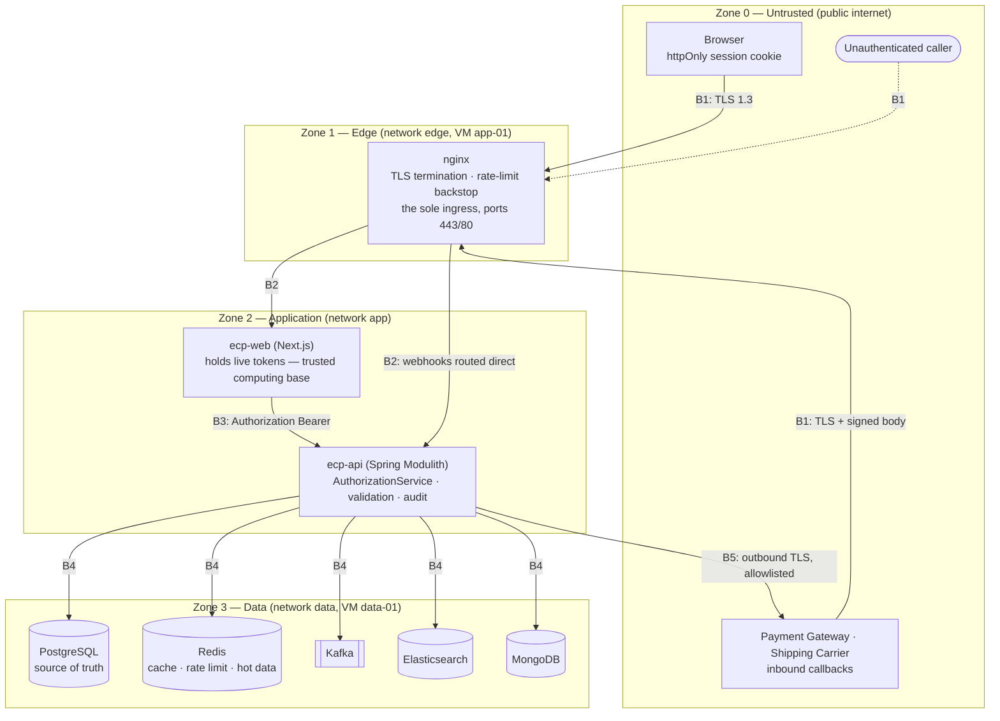
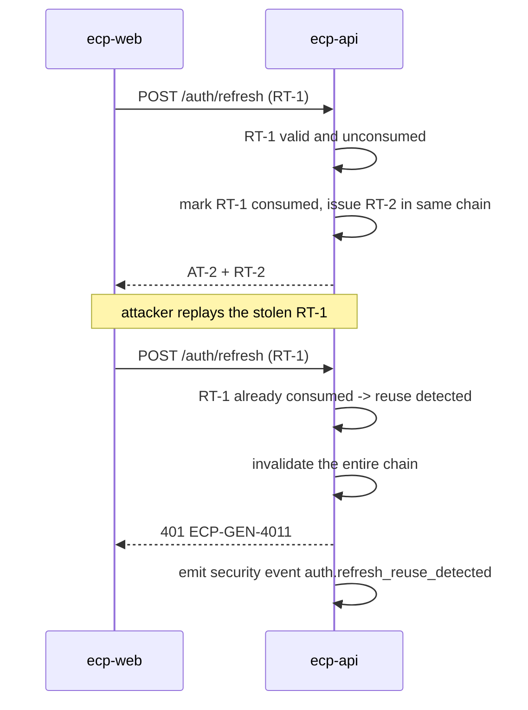
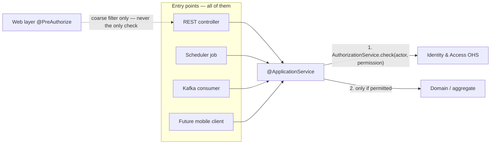

# Security — Enterprise Commerce Platform (ECP)

**Document type:** System architecture specification
**Status:** Mixed — see §1.2. Consolidating sections are `Accepted`; first-time decisions are `Proposed`
**Audience:** Engineering, Operations, Security Review, Architecture Review
**Traces to:** `P5` · `P16` · `P17` · `NFR-SEC-01`–`NFR-SEC-07` · `NFR-OBS-01` · `NFR-OBS-02` · `FR-AUD-05`–`FR-AUD-08` · `FR-DAT-04` · `FR-DAT-05` · `BR-CUS-03` · `BR-AUD-01`–`BR-AUD-03` · `BR-REV-04` · `AC-02` · `AC-06`
**Related documents:** [Solution Architecture](./Solution%20Architecture.md) · [Deployment Diagram](./Deployment%20Diagram.md) · [Integration Contract](../04-shared/Integration%20Contract.md) · [ADR-0016](./ADR/ADR-0016-jwt-refresh-rotation-rbac.md) · [ADR-0017](./ADR/ADR-0017-append-only-audit-log.md) · [ADR-0025](./ADR/ADR-0025-httponly-cookie-session.md) · [SRS](../../BA-docs/srs.md)

---

## 1. Purpose, Scope, and Status

### 1.1 What this document is

Security in this repository is currently distributed: [`ADR-0016`](./ADR/ADR-0016-jwt-refresh-rotation-rbac.md) settles the token model and where authorisation is enforced, [`ADR-0025`](./ADR/ADR-0025-httponly-cookie-session.md) settles browser custody, [`ADR-0015`](./ADR/ADR-0015-redis-cache-and-rate-limiting.md) settles rate limiting, [`ADR-0017`](./ADR/ADR-0017-append-only-audit-log.md) settles audit immutability, [`Integration Contract.md`](../04-shared/Integration%20Contract.md) §5 and §9 state the boundary rules, and [`Deployment Diagram.md`](./Deployment%20Diagram.md) §4–§5 draws the network and secrets model.

Each of those answers one question well. **None of them answers "is the platform secure," because that question is about the seams between them** — the input that is validated by no module because each assumes the other did it, the PII that leaves PostgreSQL correctly and lands in an Elasticsearch index nobody classified, the provider callback that is authorised by a signature no document names.

This document is the consolidated view. It states the trust boundaries, the controls at each one, the classification of the data crossing them, and — in §13 — the threats that remain after all of it. Where an upstream record already decided something, this document **restates and locates** it and does not re-decide it. Where nothing decided it, this document decides it here for the first time and says so.

**Scope.** The platform as specified in SRS §2.2 and deployed per [`Deployment Diagram.md`](./Deployment%20Diagram.md): the REST API, the Next.js server, the data tier, and the three external provider integrations. Out of scope: the security of the provider organisations themselves, corporate IT, and the future mobile client (SRS §8), which is noted where it changes a decision but not specified.

### 1.2 Section status

Per [ADR/README](./ADR/README.md) §2, a statement is `Accepted` when an upstream document already records the outcome and this document only relocates it; it is `Proposed` when this is the first place the decision is made. Promotion is its own commit.

| § | Section | Status | Why |
|---|---|---|---|
| 2 | Requirement baseline | Accepted | Verbatim from SRS §6.4, §6.7 |
| 3 | Trust boundaries | Accepted | Reads out [`Deployment Diagram.md`](./Deployment%20Diagram.md) §2–§4 as zones |
| 4 | Identity and session | Accepted (model) · **Proposed** (algorithms, lifetimes, revocation) | [ADR-0016](./ADR/ADR-0016-jwt-refresh-rotation-rbac.md), [ADR-0025](./ADR/ADR-0025-httponly-cookie-session.md) fixed the model and explicitly deferred the parameters |
| 5 | Authorisation | Accepted | [ADR-0016](./ADR/ADR-0016-jwt-refresh-rotation-rbac.md) §4, [`Integration Contract.md`](../04-shared/Integration%20Contract.md) §9, SRS §2.3 |
| 6 | Input validation and output safety | **Proposed** | `NFR-SEC-04` states the requirement; no record states the mechanism |
| 7 | Rate limiting and abuse | Accepted (policy) · **Proposed** (keys, buckets) | [ADR-0015](./ADR/ADR-0015-redis-cache-and-rate-limiting.md) §4 |
| 8 | Data protection and classification | **Proposed** | `NFR-SEC-06`, `NFR-SEC-07`, `FR-DAT-04`, `FR-DAT-05` state the requirements; the classification is made here |
| 9 | External provider integration | **Proposed** | `UC-PAY-03` E3 and `UC-SHP-04` E4 require authenticity verification; no document names a mechanism |
| 10 | Secrets and configuration | Accepted | [`Deployment Diagram.md`](./Deployment%20Diagram.md) §5 |
| 11 | Audit and security observability | Accepted (audit) · **Proposed** (security event set) | [ADR-0017](./ADR/ADR-0017-append-only-audit-log.md) §4 |
| 12 | Verification and the CI gate | Accepted (mechanism) · **Proposed** (the security rules themselves) | [ADR-0018](./ADR/ADR-0018-architecture-governance-ci-gate.md) §4 |
| 13–14 | Threat model and residual risk | **Proposed** | First-time analysis |

Everything marked `Proposed` is a candidate for its own ADR; §16 names the three that most deserve one.

---

## 2. Requirement Baseline

The seven security requirements are not this document's opinion. They are SRS §6.4, and each carries a verification method the SRS itself names — which is why §12 can be a matrix rather than an aspiration.

| ID | Requirement | SRS verification method | Where satisfied |
|---|---|---|---|
| `NFR-SEC-01` | Every operation authorised server-side against the acting user's roles. No operation relies on a client withholding it. | Authorisation test per role per operation | §5 |
| `NFR-SEC-02` | Passwords stored only as a one-way, salted, computationally adaptive hash. Never plaintext, never reversible. | Code and storage review | §4.5 |
| `NFR-SEC-03` | Access tokens short-lived; refresh tokens rotate on use; reuse of a consumed refresh token invalidates the session. | Token lifecycle test | §4.2–§4.3 |
| `NFR-SEC-04` | All externally supplied input validated before business processing. | Input-validation test suite | §6, §9 |
| `NFR-SEC-05` | Request rates limited per caller; authentication endpoints stricter than general endpoints. | Rate-limit test | §7 |
| `NFR-SEC-06` | All traffic client↔platform and platform↔provider encrypted in transit. | Configuration review | §8.3 |
| `NFR-SEC-07` | Credentials, payment instrument details, and tokens never appear in logs, error messages, or audit entries. | Log inspection | §8.4 |

Two observability requirements are security requirements in everything but their section number:

| ID | Requirement | SRS verification method | Where satisfied |
|---|---|---|---|
| `NFR-OBS-01` | Every significant business action attributable to an actor and a time. | Audit trail inspection | §11 |
| `NFR-OBS-02` | The audit trail cannot be amended or deleted through any interface the platform exposes, **by any role**. | Attempted-modification test per role | §11 |

And the business rules that constrain the mechanism directly: `BR-CUS-03` (single-use, expiring verification, reset, and refresh tokens), `BR-AUD-01` (audit immutability), `BR-AUD-02` (same authorisation decision regardless of entry point), `BR-AUD-03` (the last Administrator cannot be revoked), `BR-REV-04` (review images accepted only in permitted formats within a size limit).

**One principle sits above all of them.** `P5`, restated in SRS §2.4: because the platform is reached through more than one entry point, *no requirement may be satisfied by enforcement in a client*. Every control in this document is a platform control. A client-side check is a courtesy to the user, never a security boundary — and this document does not count any of them.

---

## 3. Trust Boundaries and Attack Surface

[`Deployment Diagram.md`](./Deployment%20Diagram.md) §4 defines three Compose networks so that a container can only reach what it is meant to reach. Read as trust zones, they are the boundaries every control in this document sits on.

| # | Boundary | What crosses | Control | Traces to |
|---|---|---|---|---|
| **B1** | Internet → edge | All client traffic; all inbound provider callbacks | TLS termination; HSTS; nginx rate-limit backstop; request size caps; the only host-published port in the topology | `NFR-SEC-06`, `NFR-SEC-05` |
| **B2** | Edge → application | Proxied HTTP; webhook routing to `ecp-api` | `nginx` is the only member of both `edge` and `app`; it normalises and sets the trusted client-address header, discarding any client-supplied one (§7.2) | [Deployment §4](./Deployment%20Diagram.md) |
| **B3** | Next.js → API | `Authorization: Bearer <jwt>` on every call | The **only** place a token exists outside `ecp-api`. Session cookie never reaches `ecp-api` from the browser in the chosen flow ([ADR-0025](./ADR/ADR-0025-httponly-cookie-session.md) Option 1) | `NFR-SEC-03`, `NFR-SEC-07` |
| **B4** | API → data tier | SQL, Redis commands, Kafka produce/consume, ES and Mongo queries | Private VM-to-VM link, not routable from the internet; no data-tier port published to any host; least-privilege database roles (§11.2) | [Deployment §4](./Deployment%20Diagram.md), `NFR-OBS-02` |
| **B5** | API → providers | Authorise/capture/refund, dispatch, email | Outbound TLS; per-environment credentials; egress restricted to the provider hosts each adapter needs (§9.3) | `NFR-SEC-06`, [Deployment §5](./Deployment%20Diagram.md) |

**Three properties of this picture are load-bearing.**

**`ecp-web` is inside the trusted computing base, and that is a cost, not an accident.** [ADR-0025](./ADR/ADR-0025-httponly-cookie-session.md) §5 says it plainly: the Next.js server holds live tokens, so its logging, error reporting, and memory handling are security-relevant, and compromising it compromises sessions. The compensation is that the browser holds nothing readable — an XSS flaw in the storefront yields no token — but the risk has moved rather than vanished. §14 carries it as a named residual risk.

**Webhooks arrive in Zone 0 and are routed to `ecp-api` without passing an authenticated session.** They cross B1 and B2 with no user credential at all, which makes §9's signature verification the *only* thing standing between a stranger on the internet and an instruction to move money (`UC-PAY-03` E3). It is the highest-value control in this document that no upstream record specifies.

**Zone 3 has no boundary of its own.** Everything in `ecp-api` can reach everything in the data tier, because it is one process with one set of connection pools. Module boundaries inside the JVM are enforced by the build ([ADR-0018](./ADR/ADR-0018-architecture-governance-ci-gate.md)), not by the network — which means a code-execution flaw in any module has the data-tier reach of all of them. This is the accepted consequence of [ADR-0002](./ADR/ADR-0002-modular-monolith-deployment-unit.md), stated here so it is visible rather than implied.

---

## 4. Identity, Authentication, and Session Management

### 4.1 The model (Accepted)

Settled by [ADR-0016](./ADR/ADR-0016-jwt-refresh-rotation-rbac.md) and [ADR-0025](./ADR/ADR-0025-httponly-cookie-session.md); restated here in one place.

| Element | Commitment | Source |
|---|---|---|
| Access token | Short-lived JWT carrying subject, roles, expiry. Verified without a datastore lookup | [ADR-0016](./ADR/ADR-0016-jwt-refresh-rotation-rbac.md) §4 |
| Refresh token | Server-side record, **rotated on every use**. Presenting a consumed token invalidates the whole session chain and returns `ECP-GEN-4011` | [ADR-0016](./ADR/ADR-0016-jwt-refresh-rotation-rbac.md) §4, [IC §4.4](../04-shared/Integration%20Contract.md) |
| Browser custody | `httpOnly` + `Secure` + `SameSite=Lax` cookie (`Strict` for admin routes), scoped path, explicit expiry. **No token is readable by client JavaScript; nothing in `localStorage`**. This is entirely `ecp-web`'s doing, on its own response to the browser — `ecp-api` never sets or reads a cookie and has no "is this caller a browser" branch at all (Sprint 03 backend implementation decision; see `sprint-03-identity-core.md` Review Notes) | [ADR-0025](./ADR/ADR-0025-httponly-cookie-session.md) §4 |
| Refresh execution | Server-side, in `ecp-web`, and **serialised** so concurrent requests cannot present the same refresh token twice and trip reuse detection | [ADR-0025](./ADR/ADR-0025-httponly-cookie-session.md) §4 |
| `ecp-api`'s callers | Always `Authorization: Bearer <jwt>` plus the refresh token in the JSON body, `ecp-web` included — there is no separate "browser caller" contract at this API; only `ecp-web` stands between it and an actual browser | [IC §5](../04-shared/Integration%20Contract.md) |
| CSRF | **Mandatory** on every cookie-authenticated state-changing request. `SameSite` plus a token. Not optional, not deferred | [ADR-0025](./ADR/ADR-0025-httponly-cookie-session.md) §4 |
| Logout | Clears the cookie **and** invalidates the refresh token server-side. Clearing the cookie alone leaves a valid session behind | [ADR-0025](./ADR/ADR-0025-httponly-cookie-session.md) §4, `FR-CUS-04` |
| Guest sessions | A guest cart is identified by its own cookie and is not part of the authenticated session; it merges into the customer's cart on login | `FR-CRT-06`, `BR-CRT-03` |

### 4.2 Token parameters (Proposed)

[ADR-0016](./ADR/ADR-0016-jwt-refresh-rotation-rbac.md) §5 defers "signing algorithm, key rotation, and token lifetimes" to `Backend Architecture.md`, which does not yet exist. Rather than leave the gap open, this section states the **property each parameter must satisfy** as normative, and a concrete starting value as an assumption for `Backend Architecture.md` to ratify or replace.

| Parameter | Normative property | Starting value |
|---|---|---|
| Access token lifetime | Short enough that the revocation lag in [ADR-0016](./ADR/ADR-0016-jwt-refresh-rotation-rbac.md) §5 is tolerable for a suspended account; long enough that refresh traffic does not become a load problem in its own right | **[ASSUMPTION]** 15 minutes |
| Refresh token lifetime | Bounded absolutely, not only by inactivity, so a stolen chain cannot be renewed forever | **[ASSUMPTION]** 14 days idle, 30 days absolute |
| Signing algorithm | Asymmetric, so a verifier never holds the signing key. `CON-08` anticipates extraction into services; symmetric signing would make every extracted service a custodian of the secret | **Decided (Sprint 03, `ecp-api`)**: `RS256` (2048-bit RSA), via Spring Security's Nimbus-backed `JwtEncoder`/`JwtDecoder`. This row's `EdDSA` starting value is superseded — RS256 is what this document already named as the fallback "where library support requires it," and Spring Security's OAuth2 resource-server support handles it without additional key-format handling. The asymmetric property this row exists to protect is unchanged |
| Key distribution | Public keys published at a JWKS endpoint; `kid` in every token header | — |
| Key rotation | Overlapping validity — a new key is published and trusted before it signs, and the old key stays trusted for at least one access-token lifetime after it stops signing | **[ASSUMPTION]** 90-day signing key rotation |
| Claims | `sub`, `roles`, `iat`, `exp`, `jti`, `iss`, `aud`. **Nothing else.** No email, no name, no order data — a JWT is readable by anyone holding it | `NFR-SEC-07` |
| Validation | Signature, `exp`, `iss`, `aud`, and algorithm **from the server's allowlist, never from the token header** | §13 T4 |

**The algorithm allowlist is not a detail.** Accepting the `alg` a token declares is how `alg: none` and RS256→HS256 confusion work. The verifier is configured with the algorithms it accepts and rejects everything else before reading a claim.

### 4.3 Refresh rotation and reuse detection (Accepted, with one addition)

Rotation is the platform's primary compromise-detection mechanism, and its value is entirely conditional on the browser not holding a readable token — which is the whole argument of [ADR-0025](./ADR/ADR-0025-httponly-cookie-session.md) §1.

Three obligations follow, and each is a place this can be got wrong:

1. **The invalidation is chain-wide, not token-wide.** Invalidating only the replayed token leaves the attacker's rotated token live. The stored record must carry a chain identifier and the whole chain dies.
2. **Reuse detection is a security event, not just a `401`.** §11.3 makes it one. It is the only signal the platform gets that a session was stolen, and a `401` in an access log is not a signal anyone reads.
3. **Refresh must be serialised in `ecp-web`.** [ADR-0016](./ADR/ADR-0016-jwt-refresh-rotation-rbac.md) §5 names the false-positive logout this prevents; [ADR-0025](./ADR/ADR-0025-httponly-cookie-session.md) §5 names the coordination cost it creates. Both are real; the serialisation is still required.

**Addition (Proposed): a bounded deny-list for high-severity revocation.** [ADR-0016](./ADR/ADR-0016-jwt-refresh-rotation-rbac.md) §5 records the gap honestly — a suspended account or a revoked role stays effective until the access token expires — and notes a deny-list is possible but "reintroduces a lookup on the hot path." This document proposes the narrow form: on `AccountSuspended` and on `AccountRoleChanged` **only**, the affected `sub` is written to a Redis deny-list with a TTL equal to one access-token lifetime, and the token filter checks it. The cost is one Redis lookup per request; the benefit is that suspension takes effect in seconds rather than in up-to-a-lifetime. Because this modifies a consequence [ADR-0016](./ADR/ADR-0016-jwt-refresh-rotation-rbac.md) explicitly accepted, **it is not in force until an ADR ratifies it** (§16). Until then, the revocation lag stands as written and §14 carries it.

### 4.4 Cookie and CSRF specifics (Proposed)

[ADR-0025](./ADR/ADR-0025-httponly-cookie-session.md) §5 defers the CSRF mechanism and cookie naming to `Frontend Architecture.md`, which was a stub when this section was written. [`securitySchemes.yaml`](../04-shared/OpenAPI/components/securitySchemes.yaml) has already had to choose names to be a valid contract (`ecp_session`, `X-CSRF-Token`), marking both as assumptions. This document adopts those names so the OpenAPI document and the specification do not disagree, and adds the mechanism:

**[`Frontend Architecture.md`](../03-frontend/Frontend%20Architecture.md) §4 now ratifies all of it** and adds what this section leaves open: the three cookies and their `SameSite` postures (§4.1), the opaque session reference rather than a browser-held JWT (§4.1), the serialised refresh sequence (§4.2), and CSRF coverage of Server Actions (§4.3). Assumptions `O-03` and `O-04` of [`OpenAPI/README.md`](../04-shared/OpenAPI/README.md) §6 are retired by it.

| Aspect | Rule |
|---|---|
| Cookie name | `ecp_session`, matching [`securitySchemes.yaml`](../04-shared/OpenAPI/components/securitySchemes.yaml) |
| Attributes | `httpOnly`, `Secure`, `SameSite=Lax` (`Strict` on `/admin/*`), `Path=/`, explicit `Max-Age` |
| CSRF mechanism | Signed double-submit: a random token in a non-`httpOnly` companion cookie **and** in the `X-CSRF-Token` header, compared server-side in constant time. `SameSite` is the first layer, not the only one — it is a defence against cross-site requests, not against a same-site subdomain |
| Scope | Required on every cookie-authenticated `POST`/`PUT`/`PATCH`/`DELETE`. **Never** required alongside `bearerAuth`, which is not ambiently attached |
| Failure | `403` with `ECP-GEN-4030` and a security event; never a silent redirect |

### 4.5 Credentials and account lifecycle

| Concern | Rule | Traces to |
|---|---|---|
| Password storage | One-way, salted, computationally adaptive. **[ASSUMPTION]** Argon2id (memory-hard, resists GPU attack); bcrypt at cost ≥ 12 is the acceptable fallback where Argon2 is unavailable. Parameters are configuration, re-tunable without a schema change; a hash records the parameters it was produced with so a re-hash on next successful login is possible | `NFR-SEC-02` |
| Password in transit and at rest | Never logged in any form, including truncated or hashed, at any log level. Not present in any DTO that is serialised into an error response | `NFR-SEC-02`, `NFR-SEC-07` |
| Verification / reset tokens | Single-use, expiring, invalidated on use — the same rule as refresh tokens. Stored as a hash, so a database read does not yield a usable token | `BR-CUS-03` |
| Reset flow response | Identical response whether or not the account exists. [ADR-0025](./ADR/ADR-0025-httponly-cookie-session.md) §4 already requires sign-in failures not to disclose account existence; the reset flow is the same disclosure by a different route | `NFR-SEC-01` |
| Login failure response | Generic. `ECP-GEN-4010` with no distinction between unknown account, wrong password, and unverified account | — |
| Account suspension | `AccountSuspended` ends the ability to authenticate immediately and invalidates all refresh chains for that subject. Access-token effect is per §4.3 | `FR-AUD-02` |
| Role change | `AccountRoleChanged` invalidates all refresh chains, so the next access token carries the new roles | `FR-AUD-05` |
| Last Administrator | Revocation of the final Administrator is refused by a **database constraint**, not an application check — `Domain Model.md` §7 classifies `BR-AUD-03` as a global cross-aggregate constraint | `BR-AUD-03` |
| MFA | **Out of scope for this release.** No requirement in SRS §6.4 asks for it, and inventing one here would be scope this document does not own. Recorded in §14 as a residual risk for privileged roles |

---

## 5. Authorisation Model

### 5.1 Where the decision is made (Accepted)

[ADR-0016](./ADR/ADR-0016-jwt-refresh-rotation-rbac.md) §4 chose the application layer, via Identity & Access's `AuthorizationService` Open Host Service, and the reasoning is the single most important structural claim in this document:

> Because every entry point — REST controller, scheduled job, admin tooling, Kafka consumer, future mobile client — reaches business logic through an `@ApplicationService`, and every `@ApplicationService` calls `AuthorizationService` before executing, **there is exactly one place a rule can be enforced and no way to add an entry point that skips it.**

That is what makes `BR-AUD-02` and `AC-02` structural rather than conventional. Two rejected placements matter as much as the chosen one: the web layer alone ([ADR-0016](./ADR/ADR-0016-jwt-refresh-rotation-rbac.md) Option B) is bypassed by any non-HTTP entry point, and the domain layer (Option C) couples business invariants to identity and violates [ADR-0005](./ADR/ADR-0005-clean-architecture-ports-and-adapters.md).

### 5.2 The policy

The grid is SRS §2.3's role authority summary, reproduced in [`Integration Contract.md`](../04-shared/Integration%20Contract.md) §9. It is not repeated a third time here, because a third copy is a third thing to drift. **If the grid and SRS §2.3 disagree, SRS §2.3 is right** ([IC §10](../04-shared/Integration%20Contract.md)).

Three rules govern how the grid is read:

1. **Role grants the capability; ownership grants the instance.** "own" is a runtime check on the resource, not a role check. A Customer may read *their* order.
2. **A caller requesting a resource they do not own receives `404` (`ECP-GEN-4040`), not `403`.** Existence is itself information — a `403` on `/orders/{id}` confirms the order exists. The two outcomes are deliberately indistinguishable.
3. **No role has `manage` on the audit trail**, and the blank cell is the visible half of a structural guarantee, not an omission (§11.2).

### 5.3 Defence in depth, and what each layer is worth

| Layer | Control | Security value |
|---|---|---|
| nginx | Path routing, request caps | None as authorisation. Availability control only |
| Web layer | `@PreAuthorize` coarse filter | **Additional only.** [ADR-0016](./ADR/ADR-0016-jwt-refresh-rotation-rbac.md) §4: "never the only check for any operation" |
| Application layer | `AuthorizationService` before the command | **The decision.** Everything else is commentary |
| Domain layer | Business invariants | Not authorisation, deliberately ([ADR-0005](./ADR/ADR-0005-clean-architecture-ports-and-adapters.md)) |
| Database | Least-privilege roles; constraints for `BR-AUD-03`, `BR-CAT-01`, `BR-CUS-01` | Backstop against application defects, and the enforcement point for cross-aggregate uniqueness |
| Frontend | Hiding controls | **Zero.** [IC §5](../04-shared/Integration%20Contract.md): "The frontend enforces nothing" |

**The most dangerous defect in this codebase is an `@ApplicationService` that forgets to call `AuthorizationService`.** [ADR-0016](./ADR/ADR-0016-jwt-refresh-rotation-rbac.md) §5 says so directly: it is a silent authorisation bypass, and it is the one omission no other mechanism catches. It is an ArchUnit rule (§12.2), not a code-review habit — with the limitation [ADR-0018](./ADR/ADR-0018-architecture-governance-ci-gate.md) §5 concedes: *calling* the service is structurally checkable, calling it with the *right* permission is not, and that remains a test concern (§12.1).

---

## 6. Input Validation and Output Safety

`NFR-SEC-04` and `FR-AUD-08` require every externally supplied input to be validated **before any business processing occurs**. No record states how. This section decides it.

### 6.1 Where validation happens

Validation is layered, and the layers validate different things — which is why none of them is redundant:

| Layer | Validates | Failure |
|---|---|---|
| nginx | Request size, header size, URI length, content type | `413` / `400` at the edge, never reaching the JVM |
| Deserialisation | Structural: JSON well-formedness, type conformance, unknown-field policy | `400` `ECP-GEN-4000` |
| DTO constraints | Syntactic: required, type, range, format, length, enum membership | `400` `ECP-GEN-4000` with **every** failing field in `errors` ([IC §4.3](../04-shared/Integration%20Contract.md)) |
| Application service | Semantic: does this reference exist, is this transition legal, is this actor permitted | Domain-specific `4xx` code |
| Aggregate | Invariants | Never a validation error — an aggregate that receives invalid input is a defect upstream |

**Report every failing field at once.** [IC §4.3](../04-shared/Integration%20Contract.md) requires it, and the reason is usability rather than security: first-failure-only turns form completion into a round trip per mistake.

**Unknown fields are rejected on the REST surface and tolerated on the event surface.** This looks inconsistent and is not. A REST request with an unrecognised field is a client that believes it is setting something; failing tells it the truth. An event with an unrecognised field is a publisher that added one additively, and [IC §6.4](../04-shared/Integration%20Contract.md) makes tolerating it a correctness requirement — a consumer that fails there converts every additive change into a breaking one.

### 6.2 Injection

The platform holds five data stores and every one of them has an injection class. Parameterisation is required in all five; string concatenation of caller-supplied values into a query is a defect regardless of store.

| Store | Class | Rule |
|---|---|---|
| PostgreSQL (write) | SQL injection | JPA/HQL with bound parameters only ([ADR-0010](./ADR/ADR-0010-jpa-write-model-jdbc-read-models.md)) |
| PostgreSQL (read) | SQL injection | JDBC with bound parameters. **Sort and filter fields are validated against an allowlist**, never interpolated — [IC §3.3](../04-shared/Integration%20Contract.md) enumerates the sortable fields, and that enumeration is the allowlist |
| MongoDB | Operator injection | Typed queries via Spring Data ([ADR-0030](./ADR/ADR-0030-spring-data-mongodb-read-model-access.md)); a caller-supplied map is never used as a query document, because a `$where` or `$ne` arriving as a value is a query, not data |
| Elasticsearch | Query-DSL injection | Caller input reaches the query builder as a **term or match value**, never as raw DSL. No `query_string` over user input |
| Redis | Key injection / key confusion | Keys composed from validated components with a fixed namespace prefix per role ([ADR-0015](./ADR/ADR-0015-redis-cache-and-rate-limiting.md) §4). A caller-controlled segment is encoded, so a caller cannot address another caller's bucket |

Two non-store classes complete the set. **Log injection**: a newline in a caller-supplied value that is written unescaped forges a log line, and the audit trail's credibility (§11) depends on this not being possible — values are escaped at the logging boundary. **Header injection**: CR/LF in any value echoed into a response header.

### 6.3 Output safety

| Surface | Rule |
|---|---|
| API responses | JSON only. `problem+json` for errors. Encoding is the serialiser's job; no string-built responses |
| `detail` field | **Never** a credential, token, payment detail, or raw request payload; `5xx` never leaks an exception type, stack frame, or SQL fragment ([IC §4.1, §4.5](../04-shared/Integration%20Contract.md)) |
| Storefront rendering | React escapes by default. `dangerouslySetInnerHTML` on any caller-supplied value — review text above all — is forbidden, and is a lint rule rather than a review habit |
| Content-Security-Policy | **[ASSUMPTION]** `default-src 'self'`; no `unsafe-inline` for scripts; nonce-based where Next.js requires inline. CSP is a second line — the first is that no token is readable by script at all ([ADR-0025](./ADR/ADR-0025-httponly-cookie-session.md)) |
| Other headers | `Strict-Transport-Security` (long max-age, `includeSubDomains`), `X-Content-Type-Options: nosniff`, `Referrer-Policy: strict-origin-when-cross-origin`, `X-Frame-Options: DENY` / `frame-ancestors 'none'` |
| CORS | The browser reaches `ecp-web`, not `ecp-api` ([ADR-0025](./ADR/ADR-0025-httponly-cookie-session.md) Option 4 rejected). `ecp-api` therefore needs **no** permissive CORS policy, and adding one would undo that decision quietly |

### 6.4 Review image upload

`FR-REV-03` accepts images on reviews and `BR-REV-04` restricts them to permitted formats within a configured size limit. It is the only place an untrusted **file** enters the platform, which makes it worth stating in full:

1. Size capped at the edge and again on receipt.
2. Format determined from **content**, not from the filename or the declared `Content-Type`.
3. Accepted formats limited to raster image types, re-encoded on receipt so that whatever metadata or trailing payload arrived does not survive.
4. Stored under a generated identifier. A caller-supplied filename is never a path component — that is path traversal by another name.
5. Served from a path that sets `Content-Type` explicitly with `nosniff`, and never executes.
6. EXIF stripped: a customer's review photo can carry GPS coordinates, which makes it PII the platform did not intend to hold (§8.1).

**[ASSUMPTION]** Object storage for review images is not decided by any record; the rules above hold for any backing store.

---

## 7. Rate Limiting and Abuse Controls

### 7.1 Policy (Accepted)

From [ADR-0015](./ADR/ADR-0015-redis-cache-and-rate-limiting.md) §4 and [IC §5](../04-shared/Integration%20Contract.md), satisfying `NFR-SEC-05` and `FR-AUD-07`:

| Aspect | Rule |
|---|---|
| Mechanism | Redis atomic counters, sliding window, keyed per caller. Shared state is exactly why in-process caching cannot do this |
| Auth endpoints | Stricter bucket, and **fail closed** — losing the limiter must not become a way to bypass `NFR-SEC-05` |
| Other endpoints | Fail open — a Redis outage degrades, it does not fail |
| Response | `429` with `ECP-GEN-4290` and `Retry-After` |
| Backstop | nginx carries an independent limit in front of the application's limiter ([Deployment §2](./Deployment%20Diagram.md)) |

**The fail-closed/fail-open split is itself a thing that can be got wrong**, and [ADR-0015](./ADR/ADR-0015-redis-cache-and-rate-limiting.md) §4 requires it to be tested rather than assumed. §12.1 makes it a test.

### 7.2 Keys and buckets (Proposed)

| Caller class | Key | Reasoning |
|---|---|---|
| Authenticated | `sub` from the verified token | Survives IP change; cannot be forged |
| Unauthenticated | Client address, **taken from the header nginx sets, with any client-supplied `X-Forwarded-For` discarded at B2** | A trusted proxy chain is the only thing that makes an IP-derived key meaningful |
| Provider callback | Provider identity, after signature verification (§9) | Never rate-limited on IP alone; a carrier's egress addresses change without notice |

| Bucket | Endpoints | Failure mode it addresses |
|---|---|---|
| **Auth-strict** | login, refresh, password reset request, verification resend | Credential stuffing, reset-token grinding |
| **Payment-retry** | payment retry within the `A-07` window | `UC-PAY-03` E3 states it directly: repeated authorisation attempts against a failing instrument are themselves a fraud signal |
| **Write** | all state-changing endpoints | Automated abuse: review flooding, promotion-code guessing |
| **Read** | catalog, search | Scraping and cost control, not security |

**[ASSUMPTION]** Concrete limits are operational tuning and belong with the rest of the Redis parameters in `Backend Architecture.md`. The *bucket separation* above is the architectural decision; the numbers are not.

### 7.3 Enumeration and business-logic abuse

Rate limits address volume. Three abuses here are not primarily volume problems, and each is answered by a rule stated elsewhere in this document:

- **Account enumeration** — answered by identical responses on login, registration, and reset (§4.5).
- **Order and resource enumeration** — answered by `404`-not-`403` for unowned resources (§5.2), which makes an enumeration attempt return nothing distinguishable.
- **Promotion-code guessing** — answered by the write bucket plus `BR-PRM-01`'s validity rules; `ECP-PRM-4220` is returned identically for an invalid code and an inapplicable one, so a guesser learns nothing from the difference.

---

## 8. Data Protection

### 8.1 Classification

Nothing in the repository classifies data, so controls have had nothing to attach to. This is the classification.

| Class | Examples | Storage | Logs | Events | Read models |
|---|---|---|---|---|---|
| **C1 — Secret** | Provider API keys, JWT signing keys, DB credentials | Injected at runtime only ([Deployment §5](./Deployment%20Diagram.md)) | **Never** | **Never** | **Never** |
| **C2 — Credential** | Password hashes, refresh tokens, verification/reset tokens, access tokens, CSRF tokens | Hashed at rest (§4.5); refresh tokens server-side | **Never** (`NFR-SEC-07`) | **Never** ([IC §7](../04-shared/Integration%20Contract.md): `Account*` events carry no credential hash or token) | **Never** |
| **C3 — Payment instrument** | Card numbers, wallet identifiers, bank details | **Not stored.** The platform holds a provider *reference*, never an instrument ([IC §7](../04-shared/Integration%20Contract.md)) | **Never** (`UC-PAY-02` E1) | Reference only | Reference only |
| **C4 — Personal data** | Email, name, phone, shipping and billing addresses, order history, review authorship, review image EXIF | PostgreSQL; addresses frozen onto orders (`FR-DAT-03`) | Identifiers only, never contents | Only fields the consumer needs | §8.2 |
| **C5 — Business data** | Products, categories, prices, inventory, promotions, review text | PostgreSQL, projected freely | Free | Free | Free |

**C3 is the class that most changes the platform's risk.** Because the platform never holds an instrument, the largest breach a payment compromise can produce is a set of provider references — which is a decision already made by [IC §7](../04-shared/Integration%20Contract.md) ("`NFR-SEC-07` is a constraint on payloads, not only on logs") and is worth naming as the security property it is.

### 8.2 Personal data in read models

This is the seam §1.1 warns about. Data leaves PostgreSQL correctly and arrives somewhere with different access controls, and no document currently governs what may land there.

| Store | May contain | May **not** contain |
|---|---|---|
| Elasticsearch ([ADR-0014](./ADR/ADR-0014-elasticsearch-search-read-model.md)) | Catalog data (C5) | **Any C4.** The search index is fed by `catalog` events and exists to serve product search; a customer identifier in it serves no query and creates a second copy of personal data with no access control of its own |
| MongoDB ([ADR-0013](./ADR/ADR-0013-mongodb-scoped-to-read-models.md)) | Reporting aggregates and flexible read models; C4 only where the read model is inherently customer-scoped, and then the same fields the source holds — never more | Credentials, payment instruments, review body text to Reporting ([IC §7](../04-shared/Integration%20Contract.md)) |
| Redis ([ADR-0015](./ADR/ADR-0015-redis-cache-and-rate-limiting.md)) | Cached C5; cart hot data; rate-limit counters | C2 in any form. Redis is never a source of truth and every key is reconstructible; a token there would be a token in a store designed to be flushable |

**The rule that makes this maintainable: a projection binds only the fields it uses** ([IC §6.4](../04-shared/Integration%20Contract.md)). A projection that binds the whole payload inherits every field a publisher ever adds, including personal ones added for a different consumer.

### 8.3 In transit (`NFR-SEC-06`)

| Segment | Requirement |
|---|---|
| Browser ↔ nginx | TLS 1.3 preferred, **TLS 1.2 minimum**; modern cipher suites only; HTTP on :80 redirects and serves nothing. HSTS with a long max-age |
| nginx ↔ `ecp-web` / `ecp-api` | Plain HTTP inside the `app` network is **acceptable and is a stated limitation**, not an oversight: it is unrouted from the internet, and the topology has no mutual-TLS layer. §14 carries it |
| `ecp-api` ↔ data tier | TLS where the client library supports it without operational cost; the `data` network is a private VM-to-VM link and is the primary control |
| `ecp-api` ↔ providers | TLS with certificate validation **on**. Disabling verification "temporarily" is the single most common way this requirement is lost |
| Provider → nginx | TLS, plus a signature over the body (§9) — transport authenticates the channel, the signature authenticates the sender |

### 8.4 In logs and errors (`NFR-SEC-07`)

`NFR-SEC-07` is verified by log inspection, which only works if there is something specific to inspect for.

- C1, C2, and C3 never appear at any log level, including `DEBUG`, including truncated, including hashed.
- Request and response bodies are not logged wholesale on any path that carries C2, C3, or C4. "Log the payload on error" is how credentials reach logs.
- Exceptions are logged with type and message, never with a bound parameter set that may contain a password.
- The `detail` field of a `problem+json` response is subject to the same rule as a log line ([IC §4.1](../04-shared/Integration%20Contract.md)).
- `ecp-web` is in scope for all of the above: [ADR-0025](./ADR/ADR-0025-httponly-cookie-session.md) §5 makes its logging and error reporting security-relevant because it holds live tokens. A client-side error reporter must never receive a server-side exception object.
- **[ASSUMPTION]** A denylist of field names is applied at the serialisation boundary as a backstop. It is a backstop and not the control — a field it does not know about is still logged.

### 8.5 Retention and erasure

| Data | Retention | Basis |
|---|---|---|
| Audit entries | **[A-13]** 7 years, append-only. Expiry is an operational archival process outside the application's reach, never a delete the platform can perform | `FR-DAT-05`, [ADR-0017](./ADR/ADR-0017-append-only-audit-log.md) §4 |
| Refresh tokens | Purged after absolute expiry. The store needs its own retention and cleanup ([ADR-0016](./ADR/ADR-0016-jwt-refresh-rotation-rbac.md) §5) | `BR-CUS-03` |
| Carts | **[A-05]** 30 days authenticated, 7 days guest, both configurable | `BR-CRT-01` |
| Orders and payments | Retained for the audit and dispute period; order line prices frozen at placement | `FR-DAT-03`, `FR-DAT-05` |
| Application logs | **[ASSUMPTION]** 90 days; not decided by any record | — |

**Customer erasure is pseudonymisation, not deletion, and that is a requirement rather than a shortcut.** `FR-DAT-04` states that deleting a customer never invalidates an order that references it and that historic orders remain readable in full. An erasure request therefore clears or replaces the C4 fields on the customer record and on the order's frozen address snapshot, and leaves the order, its lines, its prices, and its audit entries intact. Audit entries are not amendable by anyone (`NFR-OBS-02`), so an actor identifier in the audit trail survives erasure by construction — which is a deliberate conflict between two requirements, resolved in favour of `NFR-OBS-02`, and named again in §14.

---

## 9. External Provider Integration Security

### 9.1 Inbound callbacks — the highest-value control here

`UC-PAY-03` E3 and `UC-SHP-04` E4 both require the platform to verify that a callback genuinely originates from the provider, and both state the consequence of not doing so: *"An unverified result is an instruction to move money from an unknown party,"* and *"An unverified update could mark an undelivered order delivered, which for Cash On Delivery moves money."* Neither names a mechanism. [`securitySchemes.yaml`](../04-shared/OpenAPI/components/securitySchemes.yaml) had to invent one to publish a contract (`X-ECP-Signature`, provider-neutral because `NFR-MAINT-03` forbids naming a provider). This is that mechanism, stated properly.

| Step | Rule |
|---|---|
| 1. Preserve the raw body | The signature covers **bytes**, not a re-serialised object. The raw body is captured before parsing; verifying against re-serialised JSON fails on whitespace and key order, and "fixing" that by relaxing the comparison removes the control |
| 2. Verify the signature | Provider-specific algorithm behind the adapter, per [ADR-0005](./ADR/ADR-0005-clean-architecture-ports-and-adapters.md) — the *port* requires verification, the *adapter* knows how. Comparison is constant-time |
| 3. Check freshness | Reject a callback whose signed timestamp is outside a bounded window, so a captured callback cannot be replayed indefinitely |
| 4. Reject or record | An unverifiable callback is **recorded and rejected, never applied** ([`securitySchemes.yaml`](../04-shared/OpenAPI/components/securitySchemes.yaml)), and raises a security event (§11.3). It is a signal, not noise |
| 5. Apply idempotently | At most once per attempt however many times the provider delivers it, correlated by a stable reference ([IC §6.4](../04-shared/Integration%20Contract.md), `BR-PAY-01`) |
| 6. Handle the unmatched case | A verified result attributable to no attempt is recorded as unmatched and escalated for reconciliation. **Never discarded** — `UC-PAY-02` E4: an unrecorded capture is money taken from a customer the business cannot see |

**Verification precedes authorisation, not the reverse.** A callback carries no user session; the signature *is* the authentication, and step 5's idempotency is what stops a valid-but-replayed callback from having a second effect.

### 9.2 Outbound calls

| Rule | Reasoning |
|---|---|
| Every provider call goes through a port and a provider-specific adapter | [ADR-0005](./ADR/ADR-0005-clean-architecture-ports-and-adapters.md), Solution Architecture §4. Swapping a provider is an adapter change; so is swapping its authentication scheme |
| Credentials are per-environment; staging never holds a production provider key | [Deployment §5](./Deployment%20Diagram.md) |
| Provider errors are never passed through | `503` + `ECP-GEN-5030`; the platform's contract does not change when a provider is swapped ([IC §4.5](../04-shared/Integration%20Contract.md)). A passthrough also leaks provider-side detail to a caller |
| Timeouts and circuit breaking on every call | Availability, and a slow provider must not become a way to exhaust the request pool |
| Local development uses stub adapters | [Deployment §7](./Deployment%20Diagram.md): "No developer holds a live payment credential" |

### 9.3 SSRF

The platform makes outbound HTTP calls, so it is a candidate SSRF pivot into the `data` network.

- **No endpoint fetches a caller-supplied URL.** No requirement asks for one; if one is ever added it is a security decision, not a feature detail.
- Provider endpoints come from configuration, never from a request or a callback body. A callback that says "fetch your result from here" is not followed.
- **[ASSUMPTION]** Egress from `ecp-api` is restricted to the provider hosts the adapters need. The `data` network is unroutable from the internet, but nothing currently stops `ecp-api` from originating a request to it on behalf of an attacker.

---

## 10. Secrets and Configuration Management

[`Deployment Diagram.md`](./Deployment%20Diagram.md) §5 states the rules — secrets injected at runtime and never baked into an image or committed, configuration by Spring profile with an uncommitted `.env` per environment, images tagged by commit SHA, environment parity, provider credentials scoped per environment — and already satisfies `NFR-SEC-07`'s spirit at the deployment layer. They are not restated here.

Three additions this document makes (**Proposed**):

1. **Rotation is a procedure, not an intention.** Every C1 secret has a documented rotation path that does not require downtime — for JWT signing keys that is the overlapping-validity scheme in §4.2; for provider and database credentials it is dual-credential support during the swap.
2. **Secret scanning is a CI gate**, not a convention. The rule "never committed" is only true if something checks (§12.3).
3. **A committed secret is rotated, not deleted.** Removing it from the working tree leaves it in history and in every clone.

---

## 11. Audit and Security Observability

### 11.1 The audit trail (Accepted)

[ADR-0017](./ADR/ADR-0017-append-only-audit-log.md) makes audit a Conformist consumer of domain events with **no mutation API at any layer**, which is what makes `NFR-OBS-02` — unamendable through any interface, by any role, tested per role — pass identically for Administrator. `FR-AUD-01` and `FR-AUD-02` define the content and the minimum action set; `FR-AUD-04` requires it to be searchable by actor, entity, action, and time range, since an unsearchable trail cannot satisfy `P17`.

### 11.2 Why immutability holds

Two independent mechanisms, and the second exists because the first is an application-level property:

1. **No mutation API.** There is nothing to call, so the per-role test passes for the same reason at every role.
2. **Database grants.** The application's database role holds `INSERT` and `SELECT` on `audit_entry` and **not** `UPDATE` or `DELETE` ([ADR-0017](./ADR/ADR-0017-append-only-audit-log.md) §4).

[ADR-0017](./ADR/ADR-0017-append-only-audit-log.md) §5 states the limit honestly and this document does not soften it: a migration run as a superuser can still alter the table. The guarantee is against the platform's interfaces — exactly what `NFR-OBS-02` asks — and operational database access is outside its scope. §14 carries it.

**What is never in an entry:** credentials, payment instrument details, tokens, raw request payloads. This holds as a property of projecting from *domain events* rather than from HTTP requests, rather than as a filter someone must maintain.

**Audit completeness is bounded by event coverage.** An action that publishes no domain event produces no audit entry, silently. `Domain Model.md` §9 must stay in step with `FR-AUD-*`, and event coverage is a review item on every new use case — the main ongoing cost of [ADR-0017](./ADR/ADR-0017-append-only-audit-log.md), and a security cost as much as an audit one.

### 11.3 Security events (Proposed)

The audit trail records *business* actions. Security events are a different set: things that indicate an attack rather than a transaction. They are not audit entries, they are not suppressible, and each has a defined response.

| Event | Raised when | Why it matters |
|---|---|---|
| `auth.refresh_reuse_detected` | §4.3 | **The highest-signal event the platform produces.** It means a refresh token was held by two parties. Near-zero false-positive rate once refresh is serialised server-side ([ADR-0025](./ADR/ADR-0025-httponly-cookie-session.md)) |
| `auth.login_failure_burst` | Auth-strict bucket exhausted for one key | Credential stuffing |
| `authz.denied` | `AuthorizationService` refuses | A single denial is normal. A pattern from one subject across many resources is enumeration |
| `callback.signature_invalid` | §9.1 step 4 | `UC-PAY-03` E3, `UC-SHP-04` E4 require it to be recorded. Someone is forging money movement |
| `csrf.token_invalid` | §4.4 | Cross-site request attempt, or a broken client. Both are worth knowing |
| `admin.last_admin_revocation_attempted` | `BR-AUD-03` constraint fires | Either a lockout mistake or a privilege attack |
| `ratelimit.exceeded` | Any bucket | Volume signal; feeds the others |
| `validation.rejected_burst` | Sustained `ECP-GEN-4000` from one key | Fuzzing |

Every one carries the `correlationId` ([IC §6.2](../04-shared/Integration%20Contract.md)), so a security event is followable into the same trace as the request that produced it — which is `NFR-OBS-03` doing security work it was not written for.

**[ASSUMPTION]** Alert routing and thresholds are operational and not decided here. What *is* decided: these events exist, they are distinct from the audit trail, and `auth.refresh_reuse_detected` and `callback.signature_invalid` are the two that warrant a response rather than a dashboard.

---

## 12. Verification

[ADR-0018](./ADR/ADR-0018-architecture-governance-ci-gate.md) establishes the mechanism: architecture rules are executable tests that fail the build, mandatory on every build and every pull request, changeable by a commit that says why but never suppressible to unblock a merge. This section adds the security rules to it.

### 12.1 Requirement → test

The SRS names a verification method for every requirement; this maps each to the artefact that performs it.

| Requirement | SRS method | Artefact |
|---|---|---|
| `NFR-SEC-01` | Authorisation test per role per operation | Parameterised integration test over the [permission matrix](../04-shared/Integration%20Contract.md) × the [OpenAPI](../04-shared/OpenAPI/README.md) operation list — 6 roles × 155 operations, generated from the two documents rather than hand-written, so a new operation with no matrix cell fails the build |
| `NFR-SEC-02` | Code and storage review | ArchUnit: no field named for a password is persisted unhashed; integration test asserting a stored value is not the input and carries the expected hash parameters |
| `NFR-SEC-03` | Token lifecycle test | Rotation, expiry, chain-wide invalidation on reuse, and logout-invalidates-server-side. Testcontainers, because it is a stateful guarantee |
| `NFR-SEC-04` | Input-validation test suite | Per-endpoint boundary cases; injection payloads against all five stores (§6.2); the malformed-upload set for `BR-REV-04` |
| `NFR-SEC-05` | Rate-limit test | Bucket limits; **and the fail-closed-on-auth / fail-open-elsewhere split with Redis unavailable** — [ADR-0015](./ADR/ADR-0015-redis-cache-and-rate-limiting.md) §4 requires this to be tested, not assumed |
| `NFR-SEC-06` | Configuration review | TLS configuration assertion in CI; certificate-validation-enabled assertion on every provider adapter |
| `NFR-SEC-07` | Log inspection | Test that captures log output across auth, payment, and error paths and asserts no C1/C2/C3 value appears |
| `NFR-OBS-01` | Audit trail inspection | Per `FR-AUD-02` action: perform it, assert an entry with actor, time, entity, before/after |
| `NFR-OBS-02` | Attempted-modification test **per role** | For each of the six roles, attempt amend and delete through every exposed interface; assert refusal. Plus a grant assertion: the application role has no `UPDATE`/`DELETE` on `audit_entry` |
| `AC-02` | Every rule through every entry point | Each rule in SRS §4 exercised through REST, scheduler, and Kafka consumer paths, asserting identical outcomes |

### 12.2 ArchUnit security rules

Added to the table in [ADR-0018](./ADR/ADR-0018-architecture-governance-ci-gate.md) §4:

| Rule | Enforces | Note |
|---|---|---|
| Every `@ApplicationService` public command method calls `AuthorizationService` | `NFR-SEC-01`, `BR-AUD-02` | **The single highest-value rule in the build.** [ADR-0018](./ADR/ADR-0018-architecture-governance-ci-gate.md) §4 already names it as the entry no other mechanism catches |
| No domain class references an authorisation or security type | [ADR-0005](./ADR/ADR-0005-clean-architecture-ports-and-adapters.md), [ADR-0016](./ADR/ADR-0016-jwt-refresh-rotation-rbac.md) Option C | Keeps identity out of the domain |
| The Audit module exposes no update or delete operation at any layer | `NFR-OBS-02`, [ADR-0017](./ADR/ADR-0017-append-only-audit-log.md) | Makes "by construction" checkable |
| No JPA/JDBC query is built by string concatenation of a non-constant | `NFR-SEC-04` | Catches the SQL-injection shape structurally |
| No logging call takes a type classified C1/C2/C3 as an argument | `NFR-SEC-07` | Structural half of the log-inspection test |
| `dangerouslySetInnerHTML` is not used on the storefront | §6.3 | Frontend lint rule, same gate |

**[ADR-0018](./ADR/ADR-0018-architecture-governance-ci-gate.md) §5's caveat applies to the first rule and is repeated here so it is not forgotten:** "calls `AuthorizationService`" is structurally checkable; "calls it with the *right* permission" is not. That gap is closed by the `NFR-SEC-01` matrix test in §12.1, not by ArchUnit — which is why both exist.

### 12.3 Supply chain and pipeline

| Gate | Rule |
|---|---|
| Dependency vulnerability scan | On every build. A known-exploited or critical advisory fails it; lower severities are tracked, not ignored |
| Dependency currency | [ADR-0027](./ADR/ADR-0027-java-21-spring-boot-4-gradle.md) already carries tooling currency as a risk; an unpatchable dependency is an architecture problem, not a ticket |
| Secret scanning | On every commit and in history (§10) |
| Container image scan | Base images and the built image |
| Build provenance | Image tagged with the commit SHA ([Deployment §5](./Deployment%20Diagram.md)), so a running container traces to a source revision |
| Static analysis | Complementary to ArchUnit, per [ADR-0018](./ADR/ADR-0018-architecture-governance-ci-gate.md) §3 — good at common defects, poor at architectural relationships. Not a substitute for either rules or tests |

---

## 13. Threat Model

Per boundary from §3, with the mitigation and where it is specified. Only threats with a real path are listed; the value of the table is that each row names something that could actually happen.

| # | Boundary | Threat | Mitigation | Residual |
|---|---|---|---|---|
| **T1** | B1 | Credential stuffing against login | Auth-strict bucket failing closed (§7); adaptive password hashing (§4.5); generic failure response | No MFA — §14 R4 |
| **T2** | B1 | Session theft via XSS in the storefront | `httpOnly` cookie: nothing readable by script ([ADR-0025](./ADR/ADR-0025-httponly-cookie-session.md)); CSP; React escaping (§6.3) | An XSS flaw can still *act as* the user in-session |
| **T3** | B1 | CSRF against cookie-authenticated writes | `SameSite` + signed double-submit token, mandatory (§4.4) | A same-site subdomain compromise defeats `SameSite`; the token layer is why it is not the only control |
| **T4** | B1/B3 | Token forgery — `alg: none`, algorithm confusion, `kid` injection | Server-side algorithm allowlist; asymmetric signing; `iss`/`aud` validation (§4.2) | — |
| **T5** | B1 | Refresh token replay after theft | Rotation + chain-wide invalidation + security event (§4.3) | Detection is at the attacker's *next* use, not at theft |
| **T6** | B1 | **Forged provider callback moving money** | Signature over raw body, freshness window, idempotency, reject-and-record (§9.1) | Provider signing-key compromise is undetectable by the platform |
| **T7** | B1 | Callback replay | Freshness window + idempotency by stable reference (§9.1) | — |
| **T8** | B1 | Enumeration of accounts, orders, promotion codes | Identical responses; `404`-not-`403`; buckets (§5.2, §7.3) | — |
| **T9** | B2/B3 | Privilege escalation by calling an endpoint the UI hides | Authorisation in the application layer; the frontend enforces nothing (§5) | A missing `AuthorizationService` call — the reason §12.2 rule 1 exists |
| **T10** | B3 | Horizontal access: reading another customer's order | Ownership is a runtime check, not a role check (§5.2) | Per-endpoint correctness; covered by the §12.1 matrix test |
| **T11** | B2 | Compromise of `ecp-web` yielding live tokens | Minimised surface; no token to a client error reporter (§8.4) | **Accepted and named** — [ADR-0025](./ADR/ADR-0025-httponly-cookie-session.md) §5 |
| **T12** | B4 | Injection into any of the five stores | Parameterisation everywhere; allowlisted sort/filter fields (§6.2) | — |
| **T13** | B4 | Audit tampering to hide an action | No mutation API + database grants (§11.2) | Superuser/migration access — [ADR-0017](./ADR/ADR-0017-append-only-audit-log.md) §5 |
| **T14** | B4 | PII leaking into Elasticsearch or MongoDB | Classification + per-store rules; bind only the fields you use (§8.2) | Enforced by review, not by a type |
| **T15** | B5 | SSRF pivot from `ecp-api` into the `data` network | No caller-supplied URL is fetched; egress restriction (§9.3) | Egress restriction is an assumption, not yet a topology fact |
| **T16** | B1 | Malicious review image | Content-sniffed format, re-encode, generated filename, `nosniff` (§6.4) | — |
| **T17** | B1 | Rate-limiter bypass by losing Redis | **Fail closed on auth** ([ADR-0015](./ADR/ADR-0015-redis-cache-and-rate-limiting.md)); nginx backstop | Fail-open elsewhere is a deliberate availability trade |
| **T18** | Zone 2 | Code execution in any module reaching all data | Module boundaries are build-enforced, not network-enforced | **Accepted** — [ADR-0002](./ADR/ADR-0002-modular-monolith-deployment-unit.md); §3 |

**T6 is the one to read twice.** It is the only threat where a single missing control — a signature check no upstream record specified — lets an unauthenticated stranger instruct the platform to move money, and both use cases that describe it say so in those words.

---

## 14. Residual Risk

The honest section, in the manner of [`Deployment Diagram.md`](./Deployment%20Diagram.md) §6. Each of these is a known gap that the controls above do not close.

| # | Risk | Why it stands | What would close it |
|---|---|---|---|
| **R1** | **Revocation is not immediate.** A suspended account or a revoked role stays effective until the access token expires | Accepted consequence of [ADR-0016](./ADR/ADR-0016-jwt-refresh-rotation-rbac.md) §5 — a deny-list reintroduces a hot-path lookup | The bounded deny-list in §4.3, once ratified |
| **R2** | **`ecp-web` is in the trusted computing base.** Compromising it compromises sessions | Structural to [ADR-0025](./ADR/ADR-0025-httponly-cookie-session.md) Option 1; the alternative moves the risk to the browser, which is worse | Nothing, within this architecture. It is the price of `httpOnly` custody |
| **R3** | **Audit immutability does not hold against operational database access.** A migration run as a superuser can alter the table | [ADR-0017](./ADR/ADR-0017-append-only-audit-log.md) §5 states it; `NFR-OBS-02` scopes the guarantee to platform interfaces | External append-only storage, or database-level audit of the audit table |
| **R4** | **No MFA, including for Administrator** | No SRS requirement asks for it | A requirement, then an ADR. Privileged roles first |
| **R5** | **Internal traffic in the `app` network is unencrypted** | No mutual-TLS layer in the [topology](./Deployment%20Diagram.md); the network is unrouted from the internet | Service mesh or mTLS — disproportionate at this scale, per [ADR-0028](./ADR/ADR-0028-deployment-topology-containerisation.md) |
| **R6** | **A missing `AuthorizationService` call is a silent bypass** | [ADR-0016](./ADR/ADR-0016-jwt-refresh-rotation-rbac.md) §5; the ArchUnit rule catches the omission, not a wrong permission | The §12.1 matrix test, which is why it is generated from the permission matrix rather than hand-written |
| **R7** | **Audit completeness is bounded by event coverage.** An action that publishes no event is invisible, silently | [ADR-0017](./ADR/ADR-0017-append-only-audit-log.md) §5 | A review checklist item per use case; no mechanism catches it |
| **R8** | **Erasure and audit retention conflict.** An actor identifier survives erasure in the audit trail | `NFR-OBS-02` forbids amendment by anyone; `FR-DAT-04` requires orders to survive customer deletion. Resolved in favour of `NFR-OBS-02` (§8.5) | A legal-basis decision, not an architectural one |
| **R9** | **PII classification is enforced by review, not by a type** | Same weakness [ADR-0015](./ADR/ADR-0015-redis-cache-and-rate-limiting.md) §5 concedes for the flash-sale pre-filter | Typed classification on shared-kernel value objects, checked by ArchUnit |
| **R10** | **No penetration test, and no runtime WAF** | Neither is specified anywhere; §12 verifies the controls this document names and cannot find the ones it failed to name | An independent assessment before production |

**R6 and R10 are the two that a reader should weigh together.** Everything in §12 verifies that the controls *specified here* work. Nothing in it finds a control that should exist and does not — and this document was written by reading the repository, which is the same source every control in it came from.

---

## 15. Traceability

| Requirement | Section | Upstream record |
|---|---|---|
| `P5` — rules hold regardless of entry point | §5.1 | [ADR-0016](./ADR/ADR-0016-jwt-refresh-rotation-rbac.md) |
| `P16` — least privilege per role | §5.2 | SRS §2.3, [IC §9](../04-shared/Integration%20Contract.md) |
| `P17` — who did this, when, why | §11 | [ADR-0017](./ADR/ADR-0017-append-only-audit-log.md) |
| `NFR-SEC-01` | §5, §12.1 | [ADR-0016](./ADR/ADR-0016-jwt-refresh-rotation-rbac.md) |
| `NFR-SEC-02` | §4.5 | *this document* |
| `NFR-SEC-03` | §4.1–§4.3 | [ADR-0016](./ADR/ADR-0016-jwt-refresh-rotation-rbac.md), [ADR-0025](./ADR/ADR-0025-httponly-cookie-session.md) |
| `NFR-SEC-04` | §6, §9.1 | *this document* |
| `NFR-SEC-05` | §7 | [ADR-0015](./ADR/ADR-0015-redis-cache-and-rate-limiting.md) |
| `NFR-SEC-06` | §8.3 | *this document* |
| `NFR-SEC-07` | §8.1, §8.4 | [ADR-0016](./ADR/ADR-0016-jwt-refresh-rotation-rbac.md), [ADR-0017](./ADR/ADR-0017-append-only-audit-log.md), [IC §7](../04-shared/Integration%20Contract.md) |
| `NFR-OBS-01`, `NFR-OBS-02` | §11 | [ADR-0017](./ADR/ADR-0017-append-only-audit-log.md) |
| `FR-AUD-05`–`FR-AUD-08` | §5.2, §6, §7 | SRS §3, [IC §9](../04-shared/Integration%20Contract.md) |
| `FR-DAT-04`, `FR-DAT-05` | §8.5 | SRS §3 |
| `BR-CUS-03` | §4.3, §4.5 | [ADR-0016](./ADR/ADR-0016-jwt-refresh-rotation-rbac.md) |
| `BR-AUD-01`–`BR-AUD-03` | §5.2, §11.2, §4.5 | [ADR-0017](./ADR/ADR-0017-append-only-audit-log.md), `Domain Model.md` §7 |
| `BR-REV-04` | §6.4 | *this document* |
| `AC-02`, `AC-06` | §5.1, §12 | [ADR-0018](./ADR/ADR-0018-architecture-governance-ci-gate.md) |

---

## 16. Next Step

Three sections here are first-time decisions weighty enough to deserve their own record rather than living only in a specification. The next number in the sequence is **`ADR-0032`** ([ADR/README](./ADR/README.md) §5):

| Candidate | Why it warrants a record |
|---|---|
| **Provider callback authenticity** (§9.1) | It is the mitigation for T6, the only threat where a missing control lets a stranger move money, and no record covers it. The strongest candidate of the three |
| **Cryptographic parameters and key rotation** (§4.2, §4.5) | Signing algorithm, key rotation, and password hashing each have genuinely rejected alternatives — symmetric signing, bcrypt-only — and [ADR-0016](./ADR/ADR-0016-jwt-refresh-rotation-rbac.md) §5 deferred them explicitly |
| **The bounded revocation deny-list** (§4.3) | It modifies a consequence [ADR-0016](./ADR/ADR-0016-jwt-refresh-rotation-rbac.md) accepted on the record. **It is not in force until an ADR says so** |

Two documents inherit obligations from this one. [`Backend Architecture.md`](../02-backend/Backend%20Architecture.md) ratifies or replaces the token lifetimes (§4.2), rate-limit values (§7.2), log retention (§8.5), and implements the ArchUnit rules in §12.2. [`Frontend Architecture.md`](../03-frontend/Frontend%20Architecture.md) implements the CSRF mechanism and cookie parameters (§4.4) and the CSP (§6.3) — the decisions [ADR-0025](./ADR/ADR-0025-httponly-cookie-session.md) §5 deferred to it. **Both are now discharged**, in its §4 and §5 respectively; §5 also converts this document's `[ASSUMPTION]`-marked policy into a directive-by-directive specification, and §5.3 carries the two lint bans of §12.2. What it does not settle is named as `F-01`–`F-05` in its §10 — session lifetime, and the fact that `ecp-web` is stateful in a topology that assumes it is not.

And one gap this document cannot close itself: **R10**. Everything in §12 verifies the controls named here. Finding the ones that should have been named and were not requires an assessment this repository cannot perform on itself.
