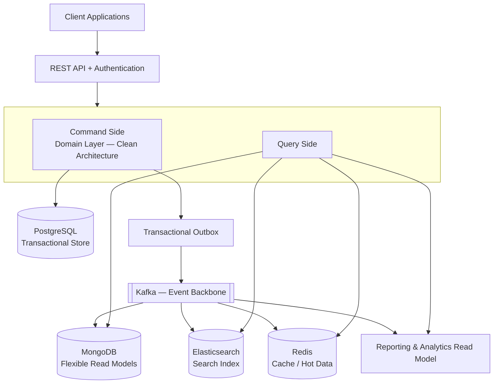
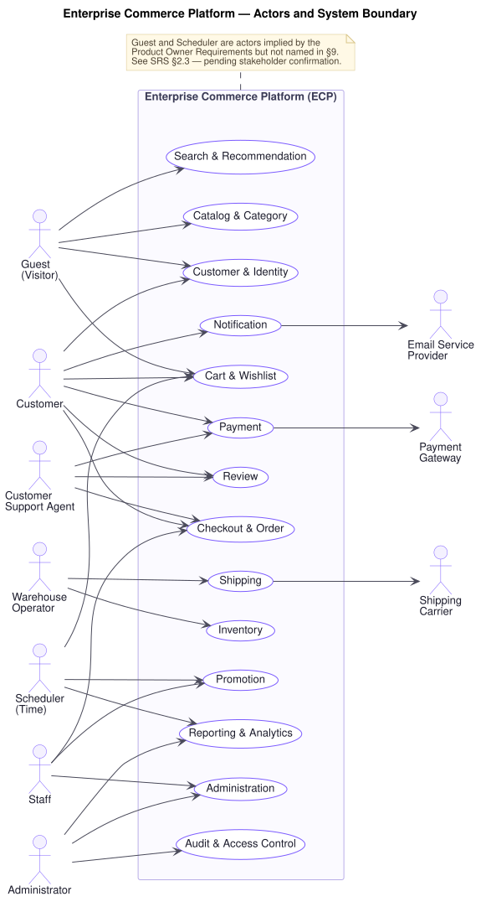
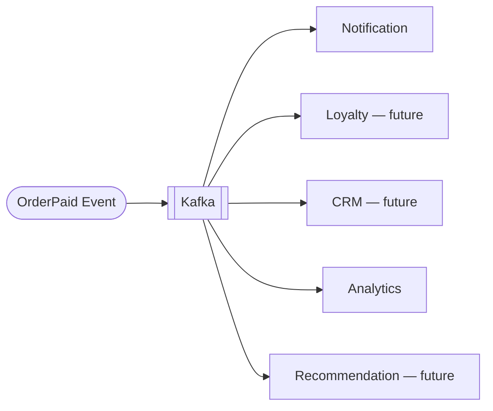
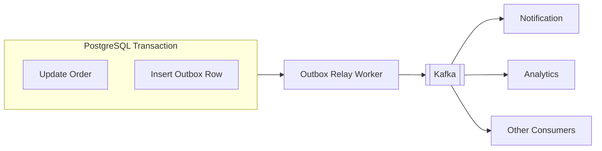
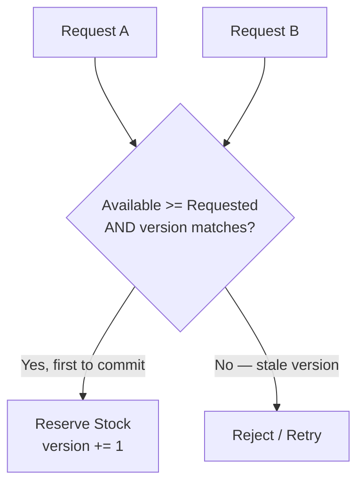
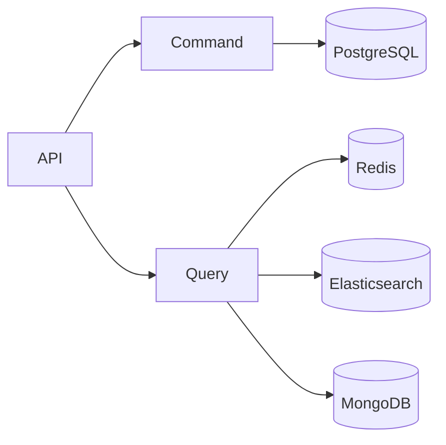
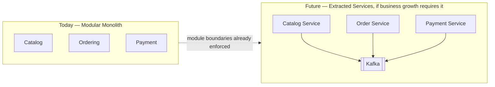
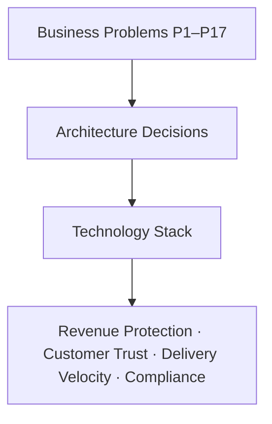

# Solution Architecture — Enterprise Commerce Platform (ECP)

**Document type:** Solution Architecture
**Related documents:** [Business Problem Analysis](../../BA-docs/general-approach.md) · [Software Requirements Specification](../../BA-docs/srs.md) · [Traceability Matrix](../../BA-docs/traceability-matrix.md) · [Technology Stack](./Technology%20Stack.md) · [Architecture Decision Records](./ADR/README.md)
**Audience:** Engineering, Product Management, Architecture Review

## 1. Purpose

This document maps business problems `P1`–`P17` to architecture decisions, technology, quality targets, and acceptance criteria. The linked ADRs record alternatives and trade-offs.

## 2. Decision principle

Every decision follows this chain:

Two technologies have a limited scope:

- PostgreSQL is the transactional source of truth. MongoDB is used only for flexible read models that do not need relational transactions.
- In-process events handle same-deployment communication. Kafka is used when delivery must survive restarts, fan out to several consumers, or cross a deployment boundary.

## 3. High-level architecture

The system is one deployable modular monolith with enforced internal boundaries. The main styles are DDD, Clean Architecture, CQRS, and event-driven delivery. [Technology Stack](./Technology%20Stack.md) owns the detailed shortlist.

## 4. System context

### 4.1 Actors

| Actor | Entry point | Architectural consequence |
|---|---|---|
| Guest | Unauthenticated REST API | Browse and cart state cannot depend on a Customer aggregate; login merges the guest cart. |
| Customer | JWT-authenticated REST API | Calls Catalog, Cart, Order, Payment, Review, and Notification. |
| Staff | REST API with `Staff` role | Manages catalog, promotions, and commercial order states. |
| Warehouse Operator | REST API with `Warehouse` role | Manages inventory and shipments under the reservation rules. |
| Customer Support Agent | REST API with `Support` role | Inspects orders and shipments; handles cancellation, refund, and moderation. |
| Administrator | REST API with `Admin` role | Manages roles, reporting, and audit access. |
| Scheduler | Scheduled job or delayed event | Starts expiry and time-based flows through the same domain rules as API calls. |
| Payment Gateway | Adapter call and webhook | Uses the payment port and idempotent callback handling. |
| Shipping Carrier | Adapter call and webhook | Uses the shipping port and idempotent callback handling. |
| Email Service Provider | Outbound adapter | Consumes committed business events; delivery does not block the source transaction. |

The role table in SRS §2.3 is normative for `FR-AUD-05`. Authorization is enforced at the API or application boundary, not by clients.

### 4.2 External interfaces

| Interface | Direction | Port | Adapter | Failure handling |
|---|---|---|---|---|
| Payment Gateway | Authorize, capture, refund; settlement callback | `PaymentProcessor` | Provider adapter | Idempotent callback, stable order reference, retryable provider failure, no ambiguous order state |
| Shipping Carrier | Dispatch; tracking and delivery callbacks | `ShippingProvider` | Provider adapter | Idempotent callback and clean provider failure |
| Email Service Provider | Outbound | `NotificationSender` | Kafka consumer and provider adapter | Delivery failure does not roll back the source transaction |
| Web, admin, future mobile clients | Inbound | REST API | RBAC-scoped API layer | Server enforces every business and permission rule |

Provider changes add or replace adapters. They do not change domain logic or ports.

## 5. Business problem to decision mapping

The [Business Problem Analysis](../../BA-docs/general-approach.md) owns the problem statements. This table records the architecture response.

| Problem | Architecture decision | Technology | Effect |
|---|---|---|---|
| `P1` | Give each business module its own model, services, infrastructure, and public API. | Strategic DDD, Spring Modulith | Build checks prevent access to module internals. |
| `P2` | Publish significant domain events instead of calling every downstream capability. | In-process events, Kafka | New consumers do not change the source workflow. |
| `P3` | Domain and application code depend on provider-neutral ports. | Clean Architecture | A provider change is an adapter change. |
| `P4` | Assign consistency by business need. | PostgreSQL for transactions; event-fed read models elsewhere | Money and stock stay current; search and reporting may lag within their limits. |
| `P5` | Enforce invariants in aggregates and domain services. | Tactical DDD, JMolecules | REST, jobs, and future clients use the same rules. |
| `P6` | Commit event intent with the business update. | PostgreSQL transactional outbox, Kafka | A committed change is eventually published. |
| `P7` | Commit related local state changes as one transaction. | PostgreSQL ACID transactions | The local unit succeeds or fails as a whole. |
| `P8` | Use versioned stock updates and explicit reservation state. | PostgreSQL optimistic locking; Redis for extreme contention | Concurrent requests cannot confirm more stock than is available. |
| `P9` | Keep repeated reads away from the transactional store. | Redis cache-aside and rate limiting | Read spikes leave PostgreSQL capacity for writes. |
| `P10` | Index known query paths. | PostgreSQL composite indexes | Query cost does not grow linearly with table size. |
| `P11` | Serve discovery from an event-fed search model. | Elasticsearch, Kafka | Search, filters, ranking, and autocomplete do not query transactional tables. |
| `P12` | Separate command and query paths. | CQRS with purpose-built read stores | Each path can use its own model and scale. |
| `P13` | Run reports on an event-fed reporting model. | CQRS, Kafka, reporting store | Reporting does not query checkout tables. |
| `P14` | Use module boundaries as team ownership boundaries. | Spring Modulith | Teams work through public APIs and events. |
| `P15` | Enforce architecture rules in CI. | ArchUnit, JMolecules, Spring Modulith verification | Boundary and layer drift fails the build. |
| `P16` | Authorize every operation against business roles. | RBAC, JWT access tokens, rotating refresh tokens | Server-side policy limits each role. |
| `P17` | Create immutable audit records for significant actions. | Append-only event-fed audit log | Records include actor, time, before/after state, and reason where required. |

### 5.1 Event extension (`P2`)

### 5.2 Transactional outbox (`P6`)

### 5.3 Stock reservation (`P8`)

### 5.4 Command and query paths (`P12`)

## 6. Quality attribute targets

### 6.1 Performance and scalability

| Target | Requirement | Mechanism |
|---|---|---|
| Catalog/category reads ≤ 300 ms p95 | `NFR-PERF-01` | Redis cache-aside and database indexes |
| Search first results ≤ 500 ms p95 | `NFR-PERF-03` | Elasticsearch |
| Autocomplete ≤ 150 ms p95 | `NFR-PERF-04` | Elasticsearch |
| Transactional writes ≤ 800 ms p95 | `NFR-PERF-02` | PostgreSQL and reservation model |
| ≥ 10,000 products, ≥ 100,000 customers, thousands of orders/day, thousands of concurrent customers | `NFR-SCAL-01`–`NFR-SCAL-04` | Indexes, CQRS, and Redis |
| 10× median throughput during a peak event | `NFR-SCAL-06` | Redis and reservation control |
| Reporting does not measurably degrade transaction targets | `NFR-PERF-05` | Separate reporting store |
| Reporting lag ≤ 5 minutes; no allowed inventory or payment lag | `NFR-PERF-06` | Event-fed projections with separate consistency rules |

### 6.2 Availability and reliability

| Target | Requirement | Mechanism |
|---|---|---|
| Purchase path available 99.9% monthly | `NFR-AVAIL-01` | Read-path isolation and caching |
| Search, recommendations, reviews, or reporting failure does not block purchase flows | `NFR-AVAIL-02` | Independent CQRS read models |
| Provider failure is clean, retryable, and does not corrupt state | `NFR-AVAIL-03` | Ports, adapters, and transaction boundaries |
| Order, payment, and inventory operations do not complete partially | `NFR-REL-01`, `NFR-REL-02` | PostgreSQL transactions |
| Concurrent purchases do not oversell | `NFR-REL-03` | Optimistic locking and reservations |
| Accepted events reach all dependent processes at least once | `NFR-REL-05`, `NFR-REL-06` | Transactional outbox and Kafka |

### 6.3 Security

| Target | Requirement | Mechanism |
|---|---|---|
| Server authorizes every operation | `NFR-SEC-01` | RBAC at the API or application boundary |
| Short-lived access tokens; refresh rotation; reuse invalidates the session | `NFR-SEC-03` | JWT and refresh-token rotation |
| Per-caller rate limits; stricter authentication limits | `NFR-SEC-05` | Redis-backed rate limiting |
| No credentials, payment details, or tokens in logs or audit records | `NFR-SEC-07` | Business-only event and audit payloads |

The architecture currently uses assumptions `[A-03]` for latency, `[A-04]` for peak load, and `[A-12]` for availability. Revalidate capacity when any assumption changes.

## 7. Technology summary

| Technology | Problems | Use | ADR |
|---|---|---|---|
| Strategic and Tactical DDD | `P1`, `P5` | Module boundaries and domain invariants | [0006](./ADR/ADR-0006-spring-modulith-module-boundaries.md), [0007](./ADR/ADR-0007-jmolecules-tactical-ddd.md) |
| Spring Modulith | `P1`, `P14` | Verified module boundaries | [0006](./ADR/ADR-0006-spring-modulith-module-boundaries.md) |
| Clean Architecture | `P3` | Provider and framework boundaries | [0005](./ADR/ADR-0005-clean-architecture-ports-and-adapters.md) |
| CQRS | `P12`, `P13` | Separate command and query models | [0008](./ADR/ADR-0008-cqrs-command-query-separation.md) |
| PostgreSQL | `P4`, `P7`, `P8` | Transactional source of truth | [0009](./ADR/ADR-0009-postgresql-source-of-truth.md), [0010](./ADR/ADR-0010-jpa-write-model-jdbc-read-models.md) |
| Optimistic locking and reservations | `P8` | Concurrent stock control | [0011](./ADR/ADR-0011-optimistic-locking-reservation-model.md) |
| Transactional outbox | `P6` | Reliable event intent | [0012](./ADR/ADR-0012-transactional-outbox-and-kafka.md) |
| Kafka | `P2`, `P6`, `P9`, `P11`, `P13` | Durable event distribution | [0012](./ADR/ADR-0012-transactional-outbox-and-kafka.md) |
| Elasticsearch | `P11` | Product search model | [0014](./ADR/ADR-0014-elasticsearch-search-read-model.md) |
| Redis | `P9` | Cache, hot data, and rate limits | [0015](./ADR/ADR-0015-redis-cache-and-rate-limiting.md) |
| MongoDB | `P4` | Flexible read models only | [0013](./ADR/ADR-0013-mongodb-scoped-to-read-models.md) |
| Database indexes | `P10` | Stable query cost | [0009](./ADR/ADR-0009-postgresql-source-of-truth.md) |
| Reporting projection | `P13` | Reporting without transaction-table queries | [0008](./ADR/ADR-0008-cqrs-command-query-separation.md), [0013](./ADR/ADR-0013-mongodb-scoped-to-read-models.md) |
| ArchUnit | `P15` | CI architecture rules | [0018](./ADR/ADR-0018-architecture-governance-ci-gate.md) |
| JMolecules | `P5`, `P15` | Explicit DDD types and rules | [0007](./ADR/ADR-0007-jmolecules-tactical-ddd.md) |
| RBAC and JWT | `P16` | Authentication and authorization | [0016](./ADR/ADR-0016-jwt-refresh-rotation-rbac.md), [0025](./ADR/ADR-0025-httponly-cookie-session.md) |
| Audit log | `P17` | Immutable action history | [0017](./ADR/ADR-0017-append-only-audit-log.md) |
| MapStruct | `P3` | Mapping across domain, persistence, and API models | [0005](./ADR/ADR-0005-clean-architecture-ports-and-adapters.md) |
| Lombok | `P15` | Reduce repetitive Java declarations | [0027](./ADR/ADR-0027-java-21-spring-boot-4-gradle.md) |

The [ADR index](./ADR/README.md) also covers the deployment unit, REST style, and frontend stack.

## 8. Architecture governance

[ADR-0018](./ADR/ADR-0018-architecture-governance-ci-gate.md) defines the CI rules for module boundaries, layers, and DDD types. This document does not repeat them.

## 9. Delivery roadmap

| Phase | Focus | Problems | Technology |
|---|---|---|---|
| 1 | Modular foundation | `P1`, `P14` | Strategic DDD, Spring Modulith |
| 2 | Domain invariants | `P5` | Tactical DDD, Clean Architecture |
| 3 | Concurrency-safe inventory | `P7`, `P8` | PostgreSQL transactions, optimistic locking |
| 4 | Read/write separation | `P12` | CQRS |
| 5 | Reliable events | `P2`, `P6` | Domain events, outbox, Kafka |
| 6 | Traffic absorption | `P9` | Redis |
| 7 | Product search | `P11` | Elasticsearch |
| 8 | Operational reporting | `P13` | Reporting projection |
| 9 | Query scale | `P10` | Database indexes |
| 10 | Architecture governance | `P15` | ArchUnit, JMolecules |

Implement security (`P16`) and audit (`P17`) with every phase.

## 10. Extensibility roadmap

| Deferred capability | Extension path |
|---|---|
| Loyalty, membership, reward points | New consumer of `OrderPaid` or `PaymentSettled` |
| AI recommendation | New read-model consumer of catalog and order events |
| Chat support, live shopping | New bounded module |
| Multi-language | Add translatable catalog values |
| Multi-currency | Extend the existing Money value object under `[A-10]` |
| Multi-region | Change deployment topology while keeping domain boundaries |
| Multi-vendor marketplace | Add explicit seller ownership to affected aggregates |
| Mobile application | Call the same REST API and server-side RBAC policy |
| External ERP | Add an adapter behind a port |
| External CRM | Add an adapter and event consumer |

These capabilities remain deferred under SRS §8. The current release must keep the listed extension paths open; it does not implement them.

## 11. Path to microservices

ECP is a modular monolith. Service extraction is optional and requires business or operational evidence.

Enforced module APIs and durable event boundaries reduce extraction work. They do not justify early service deployment.

## 12. Acceptance criteria traceability

| ID | Criterion | Primary architecture evidence |
|---|---|---|
| `AC-01` | Core workflows function correctly | Domain invariants and PostgreSQL transactions |
| `AC-02` | Rules hold at every entry point | Domain enforcement and server-side RBAC |
| `AC-03` | New modules need minimal changes to existing code | Module boundaries and domain events |
| `AC-04` | Maintainability holds as complexity grows | CI architecture gates |
| `AC-05` | Reporting does not affect transactions | Separate reporting store |
| `AC-06` | Production-quality architecture | Reliability, security, availability, and observability mechanisms in §6 |

An acceptance criterion is met only after implementation and verification against §6. Architecture design alone is not evidence of completion.

## 13. Summary

Use technology only within the scope defined by its business problem and ADR.
