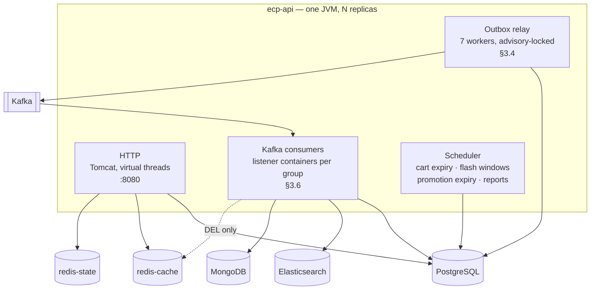

# Backend Architecture — Enterprise Commerce Platform (ECP)

**Document type:** Backend architecture specification — runtime structure, the event backbone, Kafka, and Redis
**Status:** Accepted where it renders an existing ADR; **Proposed** for §2 (the runtime shape), §3.4 (the relay), §3.5 (serialisation and the schema contract), §3.6 (consumer configuration, retry, and dead-lettering), §4 (the whole of Kafka's physical configuration), §5 (the whole of Redis's), §6 (the request pipeline and the error-code registry), and §9 (the rules this document adds to the CI gate) — each decided here for the first time, and each carried by [ADR-0032](../01-system/ADR/ADR-0032-json-event-serialisation-and-schema-contract.md), [ADR-0033](../01-system/ADR/ADR-0033-polling-outbox-relay.md), or [ADR-0034](../01-system/ADR/ADR-0034-redis-two-instance-topology.md) where the decision needed alternatives weighed
**Audience:** Backend Engineering, Architecture Review, Platform Operations, QA
**Related documents:** [Domain Model](./Domain%20Model.md) · [Module Dependency Diagram](./Module%20Dependency%20Diagram.md) · [CQRS](./CQRS.md) · [Database](./Database.md) · [Sequence](./Sequence/README.md) · [Integration Contract](../04-shared/Integration%20Contract.md) · [Deployment Diagram](../01-system/Deployment%20Diagram.md) · [Security](../01-system/Security.md) · [Testing and Benchmark Strategy](../01-system/Testing%20and%20Benchmark%20Strategy.md) · [ADR-0012](../01-system/ADR/ADR-0012-transactional-outbox-and-kafka.md) · [ADR-0015](../01-system/ADR/ADR-0015-redis-cache-and-rate-limiting.md) · [ADR-0027](../01-system/ADR/ADR-0027-java-21-spring-boot-4-gradle.md) · [ADR-0032](../01-system/ADR/ADR-0032-json-event-serialisation-and-schema-contract.md) · [ADR-0033](../01-system/ADR/ADR-0033-polling-outbox-relay.md) · [ADR-0034](../01-system/ADR/ADR-0034-redis-two-instance-topology.md)

---

## 1. Purpose of This Document

This is the document the rest of the repository has been deferring to. Seven places send an unresolved decision here, and until now every one of them has arrived at a single heading and nothing else:

| Source | What was deferred |
|---|---|
| [ADR-0012](../01-system/ADR/ADR-0012-transactional-outbox-and-kafka.md) §5 | Relay implementation, topic naming's operational half, partition counts, retention. And, flatly: *"Schema registry and serialisation format are undecided."* |
| [ADR-0015](../01-system/ADR/ADR-0015-redis-cache-and-rate-limiting.md) §5 | *"Redis topology (standalone, sentinel, cluster), eviction policy, and memory sizing"* |
| [`Integration Contract.md`](../04-shared/Integration%20Contract.md) §6.3 | Retention, partition count, replication factor |
| [`Integration Contract.md`](../04-shared/Integration%20Contract.md) §11 | The controller layer, the outbox relay and topic configuration, the error-code registry |
| [`CQRS.md`](./CQRS.md) §7.4, §13 item 1 | Kafka retention — *"the most consequential open item in this document"*, because ADR-0008's rebuildability rule rests on it |
| [`Deployment Diagram.md`](../01-system/Deployment%20Diagram.md) §4, §6 | The relay's single-runner mechanism. §6 offers two candidates and says *"neither is chosen here"* |
| [`Security.md`](../01-system/Security.md) §7.2 | *"Concrete limits are operational tuning and belong with the rest of the Redis parameters in `Backend Architecture.md`"* |

An unset number that four documents depend on is not a gap in a specification — it is a specification that cannot be built from. [`CQRS.md`](./CQRS.md) §7.4 puts it exactly: *"the rebuildability rule currently rests on an unset number."* This document sets the numbers.

**It is a gap-filling document, and it reopens nothing above it.** [ADR-0012](../01-system/ADR/ADR-0012-transactional-outbox-and-kafka.md) §4's transport rule stands. [`Integration Contract.md`](../04-shared/Integration%20Contract.md) §6.1's envelope, §6.3's topic naming and `aggregateId` partition key, §6.4's five consumer obligations, and §8's evolution rule are consumed here, never restated as decisions. [`Database.md`](./Database.md) §5.1's per-module outbox tables, §5.2's consumer-idempotency tables, and §7.3's Redis key schema are the physical shapes this document animates. [`CQRS.md`](./CQRS.md) §6.2's projection guards, §6.3's *"Redis is invalidated, not projected"*, and §7's rebuild procedure are the read side's contract with the backbone drawn here. [`Sequence/00-Overview.md`](./Sequence/00-Overview.md) §3 is the picture; this is the parameters.

Where a decision needed alternatives weighed rather than merely stated, it went into an ADR: [ADR-0032](../01-system/ADR/ADR-0032-json-event-serialisation-and-schema-contract.md) for serialisation and the schema contract, [ADR-0033](../01-system/ADR/ADR-0033-polling-outbox-relay.md) for the relay, [ADR-0034](../01-system/ADR/ADR-0034-redis-two-instance-topology.md) for Redis's topology. This document is where those decisions become configuration.

### 1.1 What this document does not decide

| Deferred to | Concern |
|---|---|
| [`Integration Contract.md`](../04-shared/Integration%20Contract.md) §6–§8 | The envelope, topic naming, the partition key, consumer obligations, and schema evolution. **Contract, not configuration.** This document supplies the operational half of §6.3 and nothing else in that range |
| [`Database.md`](./Database.md) | Every store's physical shape. §3.4 requires one new column on seven tables and §5.2 requires one new column on a table there; both are listed in §12 as follow-on edits, not silently assumed |
| [`CQRS.md`](./CQRS.md) | Which read models exist, how each projection dedupes and orders itself, and the rebuild procedure. This document supplies the retention figure §7.4 depends on and the replay mechanism §7.4 anticipated — not the procedure itself |
| [`Deployment Diagram.md`](../01-system/Deployment%20Diagram.md) | Where each container physically runs, on which network, with which volume. §5.1's second Redis instance is a follow-on edit there |
| [`Security.md`](../01-system/Security.md) | Trust boundaries, the authorisation model, provider-callback authenticity, and the threat model. This document supplies §7.2's deferred rate-limit **numbers** and the limiter's implementation; the bucket separation and the fail-closed policy remain that document's |
| [ADR-0018](../01-system/ADR/ADR-0018-architecture-governance-ci-gate.md) | The CI gate itself. §9's rules are written for it in the same relationship [`CQRS.md`](./CQRS.md) §11.1 has with §4.1 there |
| **Still open, and named rather than dropped** | [ADR-0016](../01-system/ADR/ADR-0016-jwt-refresh-rotation-rbac.md) §5 also defers the JWT algorithm, token lifetimes, issuer, and JWKS handling to this document. They belong with the rest of the token model in [`Security.md`](../01-system/Security.md), not with the event backbone, and are carried in §12 as an open item rather than answered badly here |

One further boundary, because it is the one most likely to be crossed by accident. **This document specifies a target that the current scaffold does not implement.** `ecommerce-backend-spring/` is a single-module Gradle build with five Java files, no PostgreSQL driver, and a `compose.yaml` carrying neither PostgreSQL nor Kafka. §11 states that gap in full. Nothing here should be read as describing running code.

---

## 2. The Runtime

**Status: Proposed.** [ADR-0002](../01-system/ADR/ADR-0002-modular-monolith-deployment-unit.md) fixes one deployable, [ADR-0027](../01-system/ADR/ADR-0027-java-21-spring-boot-4-gradle.md) fixes Java 21 on Spring Boot 4.1.1 with a multi-module Gradle build, and [`Deployment Diagram.md`](../01-system/Deployment%20Diagram.md) §2 fixes the containers. What none of them states is how the four different kinds of work inside `ecp-api` coexist in one JVM — which matters here because three of the four are introduced by this document.

### 2.1 One deployable, four kinds of work



| Work | Runs on | Scales with replicas? | Single-runner constraint |
|---|---|---|---|
| **HTTP** | Tomcat's request executor | Yes, linearly behind `nginx` | None — `ecp-api` is stateless by construction ([`Deployment Diagram.md`](../01-system/Deployment%20Diagram.md) §5) |
| **Outbox relay** | A dedicated executor, one worker per publishing module | **No** — per module. Seven modules distribute across replicas; one module is relayed by one worker | Yes, per module. Resolved: a PostgreSQL advisory lock ([ADR-0033](../01-system/ADR/ADR-0033-polling-outbox-relay.md) §4) |
| **Kafka consumers** | Spring Kafka listener containers | Yes, up to the partition count (§4.2) — beyond that, replicas idle | None. Kafka's group protocol is the coordination |
| **Scheduler** | Spring's task scheduler | **No**, and unresolved | Yes. [`Deployment Diagram.md`](../01-system/Deployment%20Diagram.md) §6 remains open — see §12 |

**The relay's scaling behaviour is the surprising row and deserves stating plainly.** Adding replicas does not increase the rate at which the `ordering` module publishes, because exactly one worker holds that module's lock. Publication throughput for the busiest module is a single worker's throughput, and under `NFR-SCAL-06`'s 10× peak that ceiling is a measured quantity, not an assumed one (§8).

### 2.2 Where the new code lives

[`Module Dependency Diagram.md`](./Module%20Dependency%20Diagram.md) §2 fixes fourteen Gradle subprojects and §6 fixes the inward layer rule. This document introduces four kinds of component; each has exactly one legal home.

| Component | Package | Why not elsewhere |
|---|---|---|
| Outbox **writer** | `<module>.infrastructure` — the same persistence adapter that writes the aggregate | It writes a table. [ADR-0009](../01-system/ADR/ADR-0009-postgresql-source-of-truth.md) §4: a module's tables are written only by that module's adapters |
| Relay **worker** | `app` | It is not a domain concern and it touches seven modules' tables read-only. Placing it in any one module would give that module a reason to know about the other six |
| Kafka **consumer** | `<consumer>.infrastructure`, with its **own** local record type | [`Module Dependency Diagram.md`](./Module%20Dependency%20Diagram.md) §5. The consumer never imports the publisher's type; that is what keeps the graph acyclic and extraction free |
| Cache **adapter** and **invalidator** | `<module>.infrastructure` | [`CQRS.md`](./CQRS.md) §6.3 and §11.1 rule G9: no cache client type in `application` or `domain` |

The relay in `app` is the one placement that needs defending, because `app` is otherwise only a composition root. The alternative — a relay per module, inside each module's `infrastructure` — would duplicate the same loop seven times and put an advisory-lock protocol into seven places. The relay reads `<module>_outbox` and writes `published_at`; it interprets no payload and calls no module's code, so it borrows nothing from the boundary it sits outside of. §9 rule B7 makes that read-only, payload-blind character checkable rather than merely intended.

### 2.3 Threading

| Pool | Sizing | Notes |
|---|---|---|
| Tomcat request threads | **Virtual threads** (`spring.threads.virtual.enabled=true`) | [ADR-0027](../01-system/ADR/ADR-0027-java-21-spring-boot-4-gradle.md)'s `NFR-SCAL-04` argument. Its named risk — pinning inside `synchronized` blocks — is a review item for every blocking call added to a request path, and JDBC drivers are the usual offender |
| Relay workers | 7 **platform** threads, one per publishing module | Not virtual. Each holds a database connection for the lifetime of its advisory lock, and a pinned carrier thread is exactly what a long-lived lock-holding session would produce |
| Kafka listener containers | Platform threads; concurrency per group as §4.6 | The listener container model expects a thread per consumer, and a consumer is a long-lived blocking poll |
| Scheduler | 2 platform threads | Small; the jobs are short |

**Connection-pool arithmetic is the thing this table exists to force.** Seven relay workers hold seven connections continuously, whether or not they are publishing. Add the consumer groups' handler transactions and the request path's demand, and the pool minimum is *not* the request concurrency — it is request concurrency plus seven plus the consumer concurrency total from §4.6. A pool sized only for HTTP traffic will deadlock the relay under load, and it will do so intermittently.

### 2.4 Configuration and profiles

| Profile | Used by | Differences from the base |
|---|---|---|
| *(base)* | — | Every structural setting in §4 and §5. Not runnable alone: no host, no credential |
| `local` | `docker-compose.dev.yml` ([`Deployment Diagram.md`](../01-system/Deployment%20Diagram.md) §7) | Localhost endpoints, one Redis instance permitted (§5.1), `RF=1`, single partition per topic, debug logging |
| `test` | Testcontainers | Endpoints injected by `@ServiceConnection`; relay poll interval reduced to 50 ms so an `await` in an L4 `Scenario` is not dominated by it |
| `prod` | `app-01` | Hosts and credentials from the environment; nothing else differs from base |

Two rules, both because the alternative fails quietly:

1. **Topic names, partition counts, retention, consumer-group ids, and Redis key prefixes are base configuration, never per-profile.** A topic that is `ecp.ordering.order.v1` in production and something else in test is a contract that testing does not exercise.
2. **No credential appears in any committed file.** [`Deployment Diagram.md`](../01-system/Deployment%20Diagram.md) §5 owns the secrets model; the application reads them from the environment and fails to start if one is absent, rather than defaulting.

### 2.5 Startup, readiness, and shutdown

| Phase | Behaviour |
|---|---|
| Startup, in order | Flyway migrate ([ADR-0029](../01-system/ADR/ADR-0029-flyway-versioned-schema-migrations.md)) → Hibernate `validate` → `ApplicationModules.verify()` in the test scope only → topic provisioning (§4.7) → listener containers start → relay workers start |
| **Liveness** (`:8081/actuator/health/liveness`) | The JVM is up. Does not depend on Kafka, Redis, Elasticsearch, or MongoDB — a liveness probe that fails on a dependency outage restarts a healthy process and turns a degradation into an outage |
| **Readiness** (`:8081/actuator/health/readiness`) | PostgreSQL reachable **only**. `nginx` may route traffic to a replica whose Kafka connection is down: the outbox absorbs it (§3.4) and `NFR-AVAIL-02` requires the rest of the platform to keep working |
| Shutdown | Graceful, in order: stop accepting HTTP → drain in-flight requests → stop listener containers after their current handler transaction commits → let each relay worker finish its batch and release its advisory lock → close pools |

**Releasing the advisory lock on shutdown is a courtesy, not a correctness requirement.** The lock is session-scoped and PostgreSQL drops it when the connection dies, so a `SIGKILL` costs at most one poll interval before another replica takes the module. That property is why [ADR-0033](../01-system/ADR/ADR-0033-polling-outbox-relay.md) chose an advisory lock over a lease.

---

## 3. The Event Backbone

[`Sequence/00-Overview.md`](./Sequence/00-Overview.md) §3 draws this. [ADR-0012](../01-system/ADR/ADR-0012-transactional-outbox-and-kafka.md) decides it. This section is what a developer needs in order to build it.

### 3.1 Three transports, one rule

[ADR-0012](../01-system/ADR/ADR-0012-transactional-outbox-and-kafka.md) §4 fixes which transport each interaction uses, and [`Module Dependency Diagram.md`](./Module%20Dependency%20Diagram.md) §4 fixes what each costs in the module graph. Neither states the runtime mechanism, which is here:

| Transport | Mechanism | Transaction | Failure of the receiver |
|---|---|---|---|
| **Synchronous port call** | A Java interface call across a declared Gradle edge — `StockReservationPort`, `PromotionRedemptionPort` | The caller's. One transaction, three aggregates ([`Database.md`](./Database.md) §6.1) | Rolls the caller back. That is the point — `BR-ORD-02` requires atomicity |
| **In-process event** | `@ApplicationModuleListener`, backed by Spring Modulith's event-publication registry (§3.2) | A **new** transaction after the publisher's commits | Does not affect the publisher. The registry row stays incomplete and is retried on restart |
| **Outbox + Kafka** | An outbox row written in the business transaction, relayed to a topic (§3.3, §3.4) | The publisher's, for the row. The consumer's own, for the handler | Never reaches the publisher. Retry, then dead-letter and alert (§3.6.3) |

**The rule for choosing is [ADR-0012](../01-system/ADR/ADR-0012-transactional-outbox-and-kafka.md) §4's, unchanged, and it is not a preference.** Kafka when the interaction must survive a restart, fan out to multiple asynchronous consumers, or eventually cross a service boundary. In-process otherwise. A port call when it is not an event at all.

### 3.2 In-process events — Spring Modulith

An `@ApplicationModuleListener` is `@Async` plus `@Transactional(REQUIRES_NEW)` plus `@TransactionalEventListener(AFTER_COMMIT)`, and each of those three matters:

| Property | Consequence |
|---|---|
| Runs **after** the publisher's commit | The listener cannot roll the publisher back. `CartCheckedOut` reaching Ordering does not endanger the cart write |
| Runs in a **new** transaction | The listener's own writes commit or fail independently |
| The publication is **recorded** in the registry before the listener runs, and marked complete after | A crash between the two leaves an incomplete publication, which is republished at the next startup. This is at-least-once for in-process events, so an in-process listener is idempotent for the same reason a Kafka consumer is |

**The registry is not the outbox, and the distinction is load-bearing.** [`Database.md`](./Database.md) §5.1 already says so — the framework's table *"exists to complete an in-process handler after a restart, not to publish to a broker."* [ADR-0033](../01-system/ADR/ADR-0033-polling-outbox-relay.md) §3 sets out the four reasons it cannot serve as the Kafka path: it is one shared table across all modules, it stores a serialised Java type, its completion is per-listener rather than per-topic, and its startup republication is not ordered per aggregate.

Consequently: **`@Externalized` is not used anywhere in this platform, and `spring-modulith-events-kafka` is not on the runtime path.** §9 rule B1 makes that checkable, because the annotation is one import away and would silently create a second, unordered publication path alongside the relay.

Three interactions use this transport, per [ADR-0012](../01-system/ADR/ADR-0012-transactional-outbox-and-kafka.md) §4: `CartCheckedOut` → Ordering, the `Account*` events, and the in-process half of the `Stock*` and `Promotion*` events that the Order-Placement Partnership needs.

### 3.3 Writing the outbox row

The insert happens in the module's persistence adapter, in the same transaction as the aggregate write. [`Database.md`](./Database.md) §5.1 defines the columns; this is where each value comes from.

| Column | Source |
|---|---|
| `event_id` | A fresh UUIDv7 at emission. It is the consumer's idempotency key ([`Integration Contract.md`](../04-shared/Integration%20Contract.md) §6.1) and the outbox's primary key — the same identifier at both ends of the pipe |
| `event_type` | The domain event's name exactly as in [`Domain Model.md`](./Domain%20Model.md) §9. Never a class name, never a package-qualified string |
| `event_version` | `1`, until [`Integration Contract.md`](../04-shared/Integration%20Contract.md) §8.2 forces otherwise |
| `occurred_at` | When the **business fact** happened — not `now()` at insert if those differ, and never the publication time |
| `aggregate_type` / `aggregate_id` | The aggregate the fact is about. `aggregate_id` becomes the Kafka message key (§3.5.1) |
| `correlation_id` | From the request-scoped context populated by the correlation filter (§6.1). For Scheduler-triggered work, a fresh id generated at job start and reused for every event that job emits |
| `actor_user_id` / `actor_role` | From the authenticated principal. **Null** for Scheduler-triggered events, as [`Integration Contract.md`](../04-shared/Integration%20Contract.md) §6.1 permits |
| `payload` | Business fields only. `NFR-SEC-07`, enforced by the schema denylist of [ADR-0032](../01-system/ADR/ADR-0032-json-event-serialisation-and-schema-contract.md) §4 |
| `topic` | Computed at insert from `ecp.<context>.<aggregate>.v<eventVersion>` (§4.2). Stored rather than derived at publish so a topic rename does not silently redirect history |
| `sequence_no` | `BIGSERIAL`. The relay's total order — see §3.4.3 and §12 |
| `published_at` | `NULL`. The relay sets it |
| `attempt_count`, `last_error` | `0` and `NULL`. The relay maintains them |

**Two failure modes this table is designed against.** Writing `occurred_at = now()` at *publish* time destroys the outbox-lag metric ([`CQRS.md`](./CQRS.md) §9) and makes every consumer's duration arithmetic wrong. And computing `topic` at publish time rather than storing it means a future topic rename republishes old rows to the new name during a replay, which is not what a replay is for.

### 3.4 The relay

**Status: Proposed.** Decided in [ADR-0033](../01-system/ADR/ADR-0033-polling-outbox-relay.md); configured here.

Seven workers, one per publishing module (`ordering`, `payment`, `shipping`, `catalog`, `inventory`, `promotion`, `review`), running in `ecp-api` on platform threads (§2.3).

#### 3.4.1 The claim

```sql
-- Non-blocking, session-scoped. Released automatically when the connection dies,
-- so a killed replica frees its module without a lease timeout to guess at.
SELECT pg_try_advisory_lock( hashtext('ecp.outbox.' || :module) );
```

A worker that does not get the lock sleeps for the idle interval and tries again — it does not queue, and it does not read the outbox. One module is relayed by exactly one worker across the whole cluster; seven modules distribute across replicas.

#### 3.4.2 The loop

```text
loop forever:
    if not holding lock:
        if not pg_try_advisory_lock(module): sleep(idleInterval); continue

    rows := SELECT * FROM <module>_outbox
            WHERE published_at IS NULL AND attempt_count < quarantineThreshold
            ORDER BY sequence_no
            LIMIT batchSize

    if rows is empty: sleep(idleInterval); continue

    published := []
    for row in rows:                     -- sequential: this is what preserves order
        try:
            producer.send(row.topic, key = row.aggregate_id,
                          value = envelope(row), headers = headers(row)).get(sendTimeout)
            published.append(row.event_id)
        except:
            UPDATE <module>_outbox
               SET attempt_count = attempt_count + 1, last_error = :message
             WHERE event_id = row.event_id
            break                        -- stop the batch; the rows behind it keep their order

    UPDATE <module>_outbox SET published_at = now()
     WHERE event_id = ANY(published)

    if rows was a full batch: continue immediately    -- drain a backlog without sleeping
    else: sleep(busyInterval)
```

| Parameter | Value | Reasoning |
|---|---|---|
| `batchSize` | 100 | Bounded by how much reordering a crash mid-batch can cause on republish — none, because the order is `sequence_no` both times — and by the `UPDATE`'s statement size |
| `busyInterval` | 200 ms | The publication-latency floor. Under [`CQRS.md`](./CQRS.md) §9's 30 s outbox-lag alarm this is three orders of magnitude of headroom |
| `idleInterval` | 2 s | The steady-state cost against PostgreSQL when nothing is publishing. Seven workers × one indexed query per 2 s is negligible against `P10` |
| `sendTimeout` | 10 s | Longer than the producer's `delivery.timeout.ms` would defeat the producer's own retry; shorter would abandon a send the producer is still retrying |
| `quarantineThreshold` | 10 attempts | §3.4.4 |
| `test` profile | `busyInterval` 50 ms, `idleInterval` 50 ms | So an L4 `Scenario`'s `await` measures the projection, not the poll |

**Publish, then mark.** A crash between them republishes on restart, which is `NFR-REL-06`'s at-least-once by construction and is what [`Integration Contract.md`](../04-shared/Integration%20Contract.md) §6.4 obligation 1 requires every consumer to absorb. Marking first would produce at-most-once — the loss [ADR-0012](../01-system/ADR/ADR-0012-transactional-outbox-and-kafka.md) exists to prevent.

**A failed send breaks the batch rather than skipping the row.** Continuing past a failure would publish `sequence_no` 5 while 4 is unpublished, and if 4 and 5 belong to the same aggregate a consumer sees them inverted — the hazard [`Integration Contract.md`](../04-shared/Integration%20Contract.md) §6.3 forbids. Stopping costs latency for the rows behind; skipping costs correctness.

#### 3.4.3 Ordering

`ORDER BY sequence_no`, and it must not be `occurred_at`.

`occurred_at` is when the business fact happened, and two events emitted inside one transaction can carry the same timestamp — an `OrderCreated` and the `StockReservationCommitted` alongside it, or two lifecycle transitions applied in one command. A tie in the sort is resolved arbitrarily by PostgreSQL, which means an aggregate's lifecycle can be published inverted on one poll and correctly on the next. That is an intermittent, load-dependent, environment-specific reordering: the worst possible defect to diagnose, and invisible to every test that publishes one event at a time.

`sequence_no BIGSERIAL` gives a total order per table. It is a new column on all seven outbox tables and a change to their partial index — a follow-on edit to [`Database.md`](./Database.md) §5.1, recorded in §12 and cheap only because no migration has been applied yet.

**Why not `FOR UPDATE SKIP LOCKED`.** It is the standard answer for a work queue and it is wrong here. `SKIP LOCKED` skips *locked rows*, not *the aggregate those rows belong to*: replica 1 can hold rows 1–3 for order `X` while replica 2 claims a newly inserted row 4 for the same order and reaches the broker first. [ADR-0033](../01-system/ADR/ADR-0033-polling-outbox-relay.md) §3 records the rejection so it is not reintroduced later as a throughput improvement — which is exactly how it would be proposed.

#### 3.4.4 Failure and quarantine

| Condition | Behaviour |
|---|---|
| Broker unreachable | The send fails, `attempt_count` increments, the batch stops. The backlog grows; **checkout is unaffected** — [ADR-0012](../01-system/ADR/ADR-0012-transactional-outbox-and-kafka.md)'s contribution to `NFR-AVAIL-01` |
| Backoff | Exponential on consecutive failed polls: 200 ms → 30 s cap. Not per row — the failure is almost always the broker, not the message |
| `attempt_count` reaches 10 | The row is **quarantined**: excluded from the poll predicate so it stops blocking the rows behind it, and alarmed (§7). It is not deleted and not dead-lettered |
| A quarantined row is released | By an operator, after the cause is fixed: `UPDATE … SET attempt_count = 0`. Deliberately manual — an automatic release re-enters the same loop |

**Quarantine is the one place the relay chooses availability over ordering, and it is chosen consciously.** Ten failed attempts on a single row while every other row for that module waits behind it means the module has stopped publishing. Setting the row aside lets the rest proceed at the cost of that aggregate's stream being incomplete until an operator intervenes — which is why it alarms rather than logs. There is no correct silent answer here; there is only a stated one.

#### 3.4.5 Replay — resolving [`CQRS.md`](./CQRS.md) §7.4

[`CQRS.md`](./CQRS.md) §7.4 names this *"the most consequential open item"* in that document and offers two resolutions. **Resolution 2 is chosen**, for the reason §7.4 itself gives: log compaction (its resolution 1) retains the latest event per key and discards history, which serves the snapshot-shaped projections R1–R4, R9, and R10 and **silently destroys** the counter-shaped R8 and R11, which need every event. A rebuild that quietly produces wrong counters is worse than one that cannot run.

So: **Kafka retention is finite (§4.3), and the retained outbox rows are the replay source of record.** [`Database.md`](./Database.md) §5.1 already keeps published rows rather than deleting them, *"precisely so that replay remains possible"* — this is the mechanism that cashes that in.

```text
relay --replay --module=catalog --from-sequence=0 --to-topic=ecp.replay.<rebuildId>.catalog.product.v1
```

| Property | Detail |
|---|---|
| Reads | Published rows, `ORDER BY sequence_no`, from the same tables. The live relay keeps running |
| Writes to | A **dedicated replay topic**, short retention, subscribed only by the rebuilding consumer group |
| Envelope | Byte-identical to the original publication, `event_id` included. [ADR-0032](../01-system/ADR/ADR-0032-json-event-serialisation-and-schema-contract.md)'s choice to store the wire form is what makes this true rather than approximate |
| Does not | Set `published_at` again, or touch `attempt_count` |
| Rate | Throttled, so a replay of the platform's history does not starve live publication of its shared broker and connection pool |

**Why a dedicated topic rather than republishing to the live one.** Republishing to `ecp.catalog.product.v1` would be *safe* — [`Integration Contract.md`](../04-shared/Integration%20Contract.md) §6.4 makes every consumer idempotent without exception, so notification would not resend and audit would not double-write. But it would re-run every consumer's dedupe check over the entire history for the benefit of one rebuild, and it would permanently inflate the live topic. The replay topic keeps the cost proportional to the thing being rebuilt.

**This does not weaken [`CQRS.md`](./CQRS.md) §7.1.** The procedure there is unchanged — new version, replay, catch up, swap, retire. Step 2's *"a new consumer group from the earliest retained offset"* becomes *"a new consumer group on the replay topic"* when the rebuild reaches further back than §4.3's retention, and stays exactly as written when it does not. §7.1's rule that a rebuild's dedupe scope is per-projection-version is unchanged and still the easiest way to produce an empty rebuild.

#### 3.4.6 Outbox growth — partitioned, not pruned

§3.4.5 creates a conflict with two documents, and it has to be resolved rather than left for someone to discover.

[ADR-0012](../01-system/ADR/ADR-0012-transactional-outbox-and-kafka.md) §5 requires a pruning policy — *"the outbox table is write-heavy and shares the transactional database. It needs a partial index on unpublished rows and a pruning policy, or it becomes a `P10` problem of its own."* [`Deployment Diagram.md`](../01-system/Deployment%20Diagram.md) §8 repeats it as an operational obligation. But §3.4.5 has just made those rows **the permanent event history**, and [`Database.md`](./Database.md) §5.1 already retains them *"precisely so that replay remains possible."*

**You cannot prune a table you have made the source of record.** So the two concerns are separated, and only one of them is about deleting anything.

| Concern | Answer |
|---|---|
| What `P10` actually needs | The **working set** small enough that the partial index on unpublished rows stays cached — the property [`Database.md`](./Database.md) §5.1 names as *"the difference between a relay that keeps up and one that falls behind"*. That is a property of the *unpublished* rows, and there are never many of them |
| What history needs | Every row, forever, readable in `sequence_no` order |
| Mechanism | **Declarative range partitioning on `created_at`, monthly** — [`Database.md`](./Database.md) §11 item 4 already names partitioning as the obvious answer for this table. The active partition stays small; detached partitions stay attached to the same schema and are read only by a replay |
| Deletion | **None.** A partition is detached and may later be moved to a cheaper tablespace or dumped to cold storage, but a replay must be able to reach it. Detaching is not deleting |
| `<module>_processed_event` **is** pruned | It is a dedupe window, not history. **24 hours**, derived in §4.3: the maximum redelivery horizon is `max.poll.interval.ms` (5 min) plus the retry budget (7 s), so a day is generous by three orders of magnitude |

**The honest residue: the outbox grows without bound, on the transactional volume.** Partitioning bounds the *query cost*, not the *disk*. This platform's event volume makes that a multi-year problem rather than a current one, but it is a real cost of choosing the outbox as the replay source, and a genuine archival tier — detached partitions moved off `data-01` with a documented restore path — remains open (§12). Saying "pruning is solved" would be false; what is solved is the performance problem [ADR-0012](../01-system/ADR/ADR-0012-transactional-outbox-and-kafka.md) §5 actually described.

### 3.5 Serialisation and the schema contract

**Status: Proposed.** Decided in [ADR-0032](../01-system/ADR/ADR-0032-json-event-serialisation-and-schema-contract.md); this is the wire form and the artefact.

#### 3.5.1 The wire form

| Element | Value |
|---|---|
| Value | The [`Integration Contract.md`](../04-shared/Integration%20Contract.md) §6.1 envelope, UTF-8 JSON, assembled from the outbox row's columns with `payload` inlined from the `JSONB` |
| Key | `aggregate_id`, canonical string form. `StringSerializer` |
| Headers | `ecp-event-id`, `ecp-event-type`, `ecp-event-version`, `ecp-correlation-id`, `ecp-occurred-at` |
| Timestamps | ISO-8601 with an explicit offset, `Z`-normalised. `occurredAt` is the business time, never the publish time |
| Money | `{"amount": "129.99", "currency": "VND"}` — amount as a **string**, matching the OpenAPI convention. A JSON number would introduce a float somewhere in some consumer, and money does not survive that |
| Nulls | Omitted, not serialised as `null`. An absent optional field and an explicitly-null one must not be two states |

**Headers mirror the body; the body wins.** They exist for DLT triage, log correlation, and header-based filtering without a parse. If they disagree, the body is authoritative — it is what the outbox produced and what replay reproduces. No consumer binds business logic to a header.

#### 3.5.2 `04-shared/Event Contract/`

```
04-shared/Event Contract/
├── README.md
├── envelope.v1.json          # the §6.1 envelope; every event schema $refs it
├── payload-denylist.json     # the NFR-SEC-07 forbidden-property-name check
├── ordering/OrderCreated.v1.json · OrderPaid.v1.json · …
├── payment/  ·  shipping/  ·  catalog/  ·  inventory/  ·  promotion/  ·  review/
```

JSON Schema 2020-12. One file per event type per **major** version; `additionalProperties: true` on `payload`, which is [`Integration Contract.md`](../04-shared/Integration%20Contract.md) §6.4 obligation 2 made mechanical. The full rules, including why the denylist is a name check and not a content check, are [ADR-0032](../01-system/ADR/ADR-0032-json-event-serialisation-and-schema-contract.md) §4.

**The directory does not exist yet.** It is reserved in [`SA-docs/README.md`](../README.md#folder-layout) §1.1 and created by the change that implements this section.

#### 3.5.3 The two contract tests

These close the gap [`Integration Contract.md`](../04-shared/Integration%20Contract.md) §8.4 names: *"nothing in the compiler catches a consumer that misreads a field."*

| # | Side | What it does | What it catches |
|---|---|---|---|
| 1 | Publisher | Exercise the command, read the resulting **outbox row**, validate its envelope against the schema | A publisher emitting a field the contract does not describe, or omitting one it promises. Reading the real row rather than a fixture is what keeps the schema honest about the code |
| 2 | **Consumer** | Validate the consumer's own local record against the publisher's schema: every field it binds must exist there and be `required` | A consumer binding a field the publisher never promised, or one the publisher may legally drop. **This is the §8.4 failure mode by name** |

Test 2 is the one that matters. Test 1 protects a publisher against itself; test 2 pays for the compile-time edge [`Module Dependency Diagram.md`](./Module%20Dependency%20Diagram.md) §5 deliberately removed. Both run at L3 ([`Testing and Benchmark Strategy.md`](../01-system/Testing%20and%20Benchmark%20Strategy.md) §6.6) and are build-failing, and §9 rule B9 makes a *missing* test a gate failure — because a contract test nobody wrote protects nothing and its absence is invisible unless something looks for it.

### 3.6 Consuming

#### 3.6.1 Groups and concurrency

**One consumer group per consuming module**, named `ecp.<module>`: `ecp.notification`, `ecp.audit`, `ecp.reporting`, `ecp.catalog`, `ecp.ordering`, `ecp.payment`, `ecp.shipping`, `ecp.review`.

| Rule | Why |
|---|---|
| One group per module, not per topic or per handler | A group is the unit of offset tracking and of replica coordination. Per-handler groups would multiply partition assignments for no benefit and make lag unattributable to a module |
| A rebuild uses a **new** group id, `ecp.<module>.rebuild.<n>` | [`CQRS.md`](./CQRS.md) §7.1 — the rebuild reads independently and the live projection keeps serving |
| Container concurrency ≤ the topic's partition count (§4.2) | Consumers beyond the partition count idle. This is a ceiling, not a target |
| Concurrency is per replica, and `replicas × concurrency ≤ partitions` | Exceeding it wastes assignment slots and makes a rebalance more disruptive than it needs to be |
| `auto.offset.reset=earliest` | A new group must see history, not join at the tip. `latest` would give a new read model a silently incomplete first build |

#### 3.6.2 The handler transaction

```text
poll → for each record:
    begin transaction
        INSERT INTO <module>_processed_event (event_id, event_type)   -- Database.md §5.2
        -- a duplicate key here IS the duplicate detection: rollback, ack, done
        apply the handler's own write, under its ordering guard        -- CQRS.md §6.2
    commit
    acknowledge the offset
```

| Rule | Why |
|---|---|
| `enable.auto.commit=false`, offsets committed **after** the handler's transaction | Auto-commit acknowledges on poll, so a crash mid-handler loses the event. That is at-most-once, and it fails `NFR-REL-06` |
| The idempotency insert is **inside** the handler's transaction | [`Database.md`](./Database.md) §5.2 — *"The insert failing on the primary key **is** the duplicate detection"*. A preceding `SELECT` leaves a race window |
| The handler is idempotent even so | Consumers whose handler has a natural key use it instead of a `processed_event` row ([`Database.md`](./Database.md) §5.2). Either way, obligation 1 of [`Integration Contract.md`](../04-shared/Integration%20Contract.md) §6.4 has no exceptions |
| A handler never publishes an event or calls another module's application service | [`CQRS.md`](./CQRS.md) §6.5, enforced by rule G8 |

**Commit after, not before, is the whole of at-least-once on the consumer side** — the mirror of "publish, then mark" on the relay side (§3.4.2). Both choose redelivery over loss, and both are why every consumer is idempotent.

#### 3.6.3 Retry, backoff, and the dead-letter topic

| Setting | Value |
|---|---|
| Handler | Spring Kafka `DefaultErrorHandler` with `ExponentialBackOff` |
| Attempts | 3, at 1 s → 2 s → 4 s |
| Then | `DeadLetterPublishingRecoverer` → `<topic>.dlt`, same partition count and key, plus the failure cause in headers |
| Alarm | DLT depth **> 0** ([`CQRS.md`](./CQRS.md) §9 — *"There is no acceptable steady-state depth"*) |
| Offset | Committed after the DLT publish, so the partition advances |

**Blocking retry, not `@RetryableTopic`.** Non-blocking retry topics are the modern default and they are rejected here for one reason: they move a failed record onto a separate topic and let the original partition advance, which **destroys per-aggregate ordering**. A retried `OrderPaid` would land after an `OrderShipped` that was never retried. [`Integration Contract.md`](../04-shared/Integration%20Contract.md) §6.3 makes ordering a contract, so the mechanism that breaks it is unavailable regardless of its ergonomics.

**The cost is head-of-line blocking, stated rather than hidden.** A failing record holds its partition for up to seven seconds before dead-lettering. Every other aggregate hashing to that partition waits. That is the price of ordering, it is bounded by design at three attempts, and it is why the retry budget is small: a longer one would trade a bounded stall for an unbounded one.

#### 3.6.4 Poison messages

[`CQRS.md`](./CQRS.md) §6.4 already fixes the policy — *"Dead-letter immediately; do not retry. Retrying a deterministic failure stalls the partition."* The mechanism is a classifier on the error handler:

| Failure | Retried? |
|---|---|
| Deserialisation failure, schema-validation failure, a payload violating the handler's own assumptions | **No.** Straight to the DLT |
| Store unavailable, timeout, deadlock, optimistic-lock conflict | Yes, as §3.6.3 |
| Anything unclassified | Yes — an unknown failure is assumed transient, because retrying a permanent failure costs seven seconds and dead-lettering a transient one costs an unprojected fact |

**DLT replay** is an operator action, not a scheduled job: fix the handler, deploy, then republish the DLT records to the source topic. They carry their original `event_id`, so the idempotency guard of §3.6.2 makes replaying a record that actually succeeded a no-op. There is no automatic DLT drain — a queue that empties itself is a queue nobody is paged for.

#### 3.6.5 Rebalance

A rebalance happens on every deploy, since `ecp-api` replicas restart one at a time ([`Deployment Diagram.md`](../01-system/Deployment%20Diagram.md) §7).

| Setting | Value | Why |
|---|---|---|
| `partition.assignment.strategy` | `CooperativeStickyAssignor` | Incremental rebalance: only the moving partitions stop. Eager assignment stops every consumer in the group for every restart |
| `group.instance.id` | Set, from the replica's stable identity | Static membership. A rolling restart within `session.timeout.ms` does not trigger a rebalance at all |
| `max.poll.interval.ms` | 5 min | Must exceed the worst-case handler time including the §3.6.3 retry budget. Exceeding it ejects the consumer mid-handler and the work is redone by another |
| `max.poll.records` | 50 | Bounds the time between polls, which is what keeps the interval above realistic |

**A rebalance is not a correctness event.** Uncommitted offsets are redelivered, and §3.6.2's idempotency absorbs them. It is a latency event, which is why the two settings above exist.

### 3.7 Inbound provider callbacks are not events

`POST /payment-provider-notifications` and `POST /carrier-events` ([`04-shared/OpenAPI/`](../04-shared/OpenAPI/README.md)) look like inbound events and must not be modelled as them.

| Property | Rule |
|---|---|
| Path | HTTP → signature verification ([`Security.md`](../01-system/Security.md) §9) → **the command path**, exactly like any other write |
| Authenticity | The provider signature, before anything else. `x-ecp-roles: []` means unauthenticated, not unverified |
| Idempotency | Applied at most once per attempt however many times the provider delivers it, correlated by a stable provider reference ([`Integration Contract.md`](../04-shared/Integration%20Contract.md) §6.4, `BR-PAY-01`, `FR-PAY-05`) |
| What it produces | A domain event of the platform's own — `PaymentCaptured`, `ShipmentDelivered` — written to the outbox in the same transaction as the state change |
| Response | Acknowledge as soon as the command commits. A provider that does not get a prompt `2xx` retries, and its retry policy is not ours to control |

**The distinction is the trust boundary.** A Kafka event has already crossed the platform's own outbox and carries its own envelope; a provider callback is untrusted input from outside `B1` that happens to be shaped like a notification. Treating one as the other would put an external party's payload directly into the event backbone with no validation, no authorisation, and no idempotency key of ours.

---

## 4. Kafka — Physical Configuration

**Status: Proposed.** [`Integration Contract.md`](../04-shared/Integration%20Contract.md) §6.3 decides the parts that are a contract — topic naming, one topic per aggregate type, `aggregateId` as the partition key — and defers *"retention, partition count, replication"* here. This section is that deferral, discharged.

### 4.1 The cluster

[`Deployment Diagram.md`](../01-system/Deployment%20Diagram.md) §2: one `confluentinc/cp-kafka` container on `data-01`, **KRaft mode** — no ZooKeeper node to operate.

| Property | Value | Consequence |
|---|---|---|
| Brokers | 1 | `replication.factor` cannot exceed 1 |
| `default.replication.factor` | 1 | |
| `min.insync.replicas` | 1 | |
| `auto.create.topics.enable` | **`false`** | §4.7 |
| `log.dirs` | The `kafkadata` volume | |
| `num.partitions` (broker default) | 3 | A backstop only; every topic declares its own (§4.2) |

**What `acks=all` buys on a single broker, and what it does not.** §4.5 sets `acks=all` and `enable.idempotence=true`, and both are worth having: idempotence prevents a producer retry from duplicating a record, and ordered delivery within a partition depends on it. But with `RF=1`, `acks=all` means *acknowledged by the only replica there is*. **It provides no durability against the loss of that broker's disk.** A reader who sees `acks=all` and infers replicated durability has read it wrong.

The actual durability guarantee is elsewhere, and it is stronger: the outbox row committed in the business transaction ([ADR-0012](../01-system/ADR/ADR-0012-transactional-outbox-and-kafka.md)) and retained after publication ([`Database.md`](./Database.md) §5.1). Losing the Kafka volume loses undelivered messages and every consumer's offsets; it does not lose a single business event, because every one of them is still a row in PostgreSQL. Recovery is a replay (§3.4.5), which is why §3.4.5 exists as a mode of the relay rather than as an emergency script.

This is [`Deployment Diagram.md`](../01-system/Deployment%20Diagram.md) §8's *"one failure domain with no replica"* stated for the broker specifically. It is a known, accepted, single-VM property — not something this document can fix.

### 4.2 The topic catalogue

Nine event topics, from [`Integration Contract.md`](../04-shared/Integration%20Contract.md) §7's catalogue filtered to the Kafka rows. Naming is `ecp.<context>.<aggregate>.v<major>`, fixed by §6.3 and not revisited.

| Topic | Partitions | RF | `min.insync` | `retention.ms` | `cleanup.policy` | Publisher | Consumer groups |
|---|---|---|---|---|---|---|---|
| `ecp.ordering.order.v1` | **12** | 1 | 1 | 30 d | `delete` | `ordering` | `ecp.payment`, `ecp.shipping`, `ecp.review`, `ecp.catalog`, `ecp.notification`, `ecp.audit`, `ecp.reporting` |
| `ecp.payment.payment.v1` | **6** | 1 | 1 | 30 d | `delete` | `payment` | `ecp.ordering`, `ecp.notification`, `ecp.audit`, `ecp.reporting` |
| `ecp.inventory.stockitem.v1` | **6** | 1 | 1 | 30 d | `delete` | `inventory` | `ecp.catalog`, `ecp.audit`, `ecp.reporting` |
| `ecp.catalog.product.v1` | **6** | 1 | 1 | 30 d | `delete` | `catalog` | `ecp.catalog` (search index), `ecp.audit`, `ecp.reporting` |
| `ecp.catalog.category.v1` | 3 | 1 | 1 | 30 d | `delete` | `catalog` | `ecp.catalog`, `ecp.audit`, `ecp.reporting` |
| `ecp.shipping.shipment.v1` | 3 | 1 | 1 | 30 d | `delete` | `shipping` | `ecp.ordering`, `ecp.notification`, `ecp.reporting` |
| `ecp.promotion.promotion.v1` | 3 | 1 | 1 | 30 d | `delete` | `promotion` | `ecp.audit`, `ecp.reporting` |
| `ecp.review.review.v1` | 3 | 1 | 1 | 30 d | `delete` | `review` | `ecp.catalog`, `ecp.notification`, `ecp.audit` |
| `ecp.identity.account.v1` | 3 | 1 | 1 | 30 d | `delete` | *(none today)* | `ecp.audit` |

Plus one `.dlt` per topic (§4.4), and ephemeral `ecp.replay.<rebuildId>.<topic>` topics created and dropped by a rebuild (§3.4.5).

**Partition counts are derived, not chosen aesthetically.** The count is a ceiling on a group's parallelism — `replicas × concurrency ≤ partitions` (§3.6.1) — and it is expensive to raise later, because raising it changes which partition an `aggregateId` hashes to and **an aggregate's existing history stays in the old partition while its future lands in a new one**. That is a permanent ordering break for every aggregate in flight at the moment of the change. So: 12 for `ordering`, the flagship path with seven consumer groups and the highest `NFR-SCAL-06` exposure; 6 for the money-adjacent and high-churn contexts; 3 for the rest. Over-provisioning costs open file handles and a little memory. Under-provisioning costs an ordering break to fix.

**`ecp.identity.account.v1` has no publisher today**, because [ADR-0012](../01-system/ADR/ADR-0012-transactional-outbox-and-kafka.md) §4 classifies `Account*` as in-process. It is declared because [`Integration Contract.md`](../04-shared/Integration%20Contract.md) §7 lists `audit` as a universal consumer subscribing to every Kafka topic, and a universal consumer needs the topic to exist to subscribe to it. Its being empty is correct, not an oversight.

### 4.3 Retention — the figure [`CQRS.md`](./CQRS.md) §7.4 depends on

**`retention.ms = 30 days`, `cleanup.policy = delete`, uniformly.**

[`CQRS.md`](./CQRS.md) §7.4 makes rebuildability contingent on this number and warns that *"with finite time-based retention, a full rebuild of R1 reconstructs only products whose events are still retained. Everything older is silently missing."* That warning is correct, and it is answered by moving the rebuild's source rather than by extending the number:

| Question | Answer |
|---|---|
| What is Kafka's retention for? | Live delivery, consumer catch-up after an outage, and a rebuild that only needs recent history. Not permanent storage |
| What is the permanent history? | The retained outbox rows ([`Database.md`](./Database.md) §5.1), replayed by §3.4.5 |
| Why not compaction, [`CQRS.md`](./CQRS.md) §7.4's other resolution? | It keeps the latest event per key and discards the rest. Fine for snapshot-shaped projections; **silently wrong** for the counter-shaped R8 and R11, which need every event. A rebuild producing plausible-but-wrong counters is the worst available outcome |
| Why 30 days and not 7, or 365? | Long enough that an ordinary consumer outage, a long weekend, or a delayed fix never needs a replay; short enough that the broker's disk is bounded by a month of traffic. The exact figure is operational and revisable; **the fact that it is finite is architectural**, because it is what makes the outbox the source of record rather than a redundant copy |

Two derived figures follow, and both are smaller than intuition suggests:

- **The maximum redelivery horizon is minutes, not days.** [`Database.md`](./Database.md) §5.2 prunes `processed_event` on *"a retention window longer than the maximum Kafka redelivery horizon"*, and §7.2.2 sizes MongoDB's `RING` against the same figure. Redelivery arises from an uncommitted offset after a crash or rebalance — bounded by `max.poll.interval.ms` (5 min) plus the retry budget (7 s), not by topic retention. A 24-hour window for both is generous by three orders of magnitude.
- **A replay's dedupe scope is a rebuild's own**, per [`CQRS.md`](./CQRS.md) §7.1, so a replay reaching back further than 24 hours does not interact with these figures at all.

These two figures discharge a dependency three documents carry: [`Database.md`](./Database.md) §7.2.2's `RING` size, [`Database.md`](./Database.md) §11 item 3's pruning window, and [ADR-0030](../01-system/ADR/ADR-0030-spring-data-mongodb-read-model-access.md) §5's *"open dependency rather than resolving one"*. All three were waiting on a redelivery horizon they assumed was retention-derived and therefore large. It is not.

**[`CQRS.md`](./CQRS.md) §13 item 1 is resolved by this section**, and marked so there (§12). The outbox's own growth, which this section's choice of a permanent history creates, is §3.4.6.

### 4.4 Dead-letter topics

| Property | Value |
|---|---|
| Name | `<source-topic>.dlt` — e.g. `ecp.ordering.order.v1.dlt` |
| Partitions | Same as the source, so the key still determines the partition |
| Retention | **90 days**, longer than the source. A dead-lettered event is an unprojected business fact and must outlive the incident that produced it |
| `cleanup.policy` | `delete` |
| Shared across consumer groups? | **No — one DLT per source topic per consuming module**: `ecp.ordering.order.v1.dlt.notification`. Seven groups consume the ordering topic, and a single shared DLT would make "which consumer failed" a header lookup and a replay a fan-out to groups that succeeded |
| Alarm | Depth > 0 (§7) |

### 4.5 Producer configuration

One producer, used only by the relay (§3.4). Nothing else in the platform publishes to Kafka.

```yaml
spring:
  kafka:
    producer:
      key-serializer: org.apache.kafka.common.serialization.StringSerializer
      value-serializer: org.apache.kafka.common.serialization.StringSerializer
      acks: all
      properties:
        enable.idempotence: true
        max.in.flight.requests.per.connection: 5
        retries: 2147483647
        delivery.timeout.ms: 120000
        request.timeout.ms: 30000
        compression.type: lz4
        linger.ms: 5
        batch.size: 65536
        max.block.ms: 10000
```

| Property | Why this value |
|---|---|
| `enable.idempotence: true` | A producer retry must not duplicate a record. It also enforces the ordering guarantee below |
| `max.in.flight: 5` | Safe **only** with idempotence enabled — the idempotent producer re-sequences retries. Without it, 5 in flight reorders on retry, breaking §6.3's contract. The two settings are a pair and neither may be changed alone |
| `acks: all` | With `RF=1` this is acknowledgement by the only replica. §4.1 says what that is and is not worth |
| `retries` + `delivery.timeout.ms: 120000` | The producer retries for two minutes before surrendering to the relay's own `attempt_count` (§3.4.4). Two layers of retry, deliberately: the producer handles a blip, the relay handles an outage |
| `compression.type: lz4` | Recovers most of what JSON costs over a binary format ([ADR-0032](../01-system/ADR/ADR-0032-json-event-serialisation-and-schema-contract.md) §5) at negligible CPU |
| `linger.ms: 5` | Batches a burst without adding meaningful latency to a lone event |
| `max.block.ms: 10000` | Bounds how long a send blocks when the broker is unreachable. Unbounded, a relay worker would hang holding its advisory lock — stalling its module with no timeout to recover from |
| **`transactional.id`: unset** | Kafka transactions are deliberately not used. Atomicity is PostgreSQL's, via the outbox; a Kafka transaction would add a second commit protocol that guarantees nothing the outbox does not already guarantee |

**Value serialiser is `String`, not `Json`.** The relay already holds the assembled envelope as text, having read `payload` from `JSONB`. Deserialising it into an object graph so a serialiser can re-serialise it would waste work and, worse, would let Jackson's configuration silently alter the bytes that [ADR-0032](../01-system/ADR/ADR-0032-json-event-serialisation-and-schema-contract.md) §5 relies on being reproducible for replay.

### 4.6 Consumer configuration

```yaml
spring:
  kafka:
    consumer:
      key-deserializer: org.apache.kafka.common.serialization.StringDeserializer
      value-deserializer: org.apache.kafka.common.serialization.StringDeserializer
      auto-offset-reset: earliest
      enable-auto-commit: false
      max-poll-records: 50
      properties:
        isolation.level: read_committed
        max.poll.interval.ms: 300000
        session.timeout.ms: 45000
        heartbeat.interval.ms: 3000
        partition.assignment.strategy: >-
          org.apache.kafka.clients.consumer.CooperativeStickyAssignor
    listener:
      ack-mode: manual_immediate
      type: single
      observation-enabled: true
```

| Group | Concurrency per replica | Bound by | Consistency class ([`CQRS.md`](./CQRS.md) §2.1) |
|---|---|---|---|
| `ecp.catalog` | 3 | Search index and availability projections; `ecp.catalog.product.v1` has 6 partitions | C2 |
| `ecp.notification` | 3 | Outbound I/O-bound; the provider is the bottleneck, not the consumer | — |
| `ecp.audit` | 2 | Append-only inserts, cheap | — |
| `ecp.reporting` | 2 | C3, 5-minute budget; no reason to spend threads | C3 |
| `ecp.ordering`, `ecp.payment`, `ecp.shipping`, `ecp.review` | 2 | Targeted consumers on specific event types | C1 |

**`type: single`, not `batch`.** Batch listeners are faster and would break §3.6.2's transaction-per-record model: one transaction spanning a batch means one poison record rolls back the whole batch, and the retry re-applies records that already succeeded. Idempotency makes that survivable, not free.

**`isolation.level: read_committed` with no transactional producer** is a deliberate no-op, kept because it costs nothing and because a future producer change that did introduce transactions would otherwise need every consumer edited to notice.

**Deserialisation is to `String`, then validated, then bound.** No `JsonDeserializer` with a target type, because a deserialiser configured with a class is a shared type in a configuration file ([`Module Dependency Diagram.md`](./Module%20Dependency%20Diagram.md) §5). Each consumer parses the envelope, validates against the schema in the test path (§3.5.3), and binds its **own** local record — only the fields it uses.

### 4.7 Topic provisioning

**`auto.create.topics.enable=false`, and every topic is declared.** An auto-created topic takes the broker default of 3 partitions, `RF=1`, and 7-day retention — silently wrong for `ecp.ordering.order.v1` in all three respects, and undetectable until a rebuild comes up short or a consumer group cannot scale.

| Rule | Detail |
|---|---|
| Declaration | `NewTopic` beans in `app`, one per row of §4.2 plus its DLTs, with partitions, RF, and per-topic configs |
| Applied by | Spring's `KafkaAdmin` at startup |
| Partition **increase** | Applied by `KafkaAdmin`. Requires a conscious decision: it rehashes keys and **breaks ordering for every aggregate in flight** (§4.2) |
| Partition **decrease**, or a config narrowing | Kafka does not support it. It is a new topic and a `v2` migration under [`Integration Contract.md`](../04-shared/Integration%20Contract.md) §8.3 |
| Replay topics | Created and deleted by the rebuild that owns them, never declared |
| Verification | A startup check compares each declared topic's actual partition count and retention against §4.2 and **logs a warning on divergence** — it does not fail startup, because refusing to boot over a topic misconfiguration would convert a degradation into an outage |

### 4.8 Local and test topologies

| Environment | Kafka | Differences that matter |
|---|---|---|
| `local` (`docker-compose.dev.yml`) | One KRaft broker, same image and version as `prod` ([`Deployment Diagram.md`](../01-system/Deployment%20Diagram.md) §7) | 1 partition per topic, 1-hour retention. **Single-partition topics hide every ordering bug**, so the ordering tests of §8 run against a multi-partition Testcontainers broker, never against this |
| `test` (L4/L6) | `KafkaContainer`, already present in `TestcontainersConfiguration` | Partition counts matching §4.2 for the topics under test. Relay intervals at 50 ms (§3.4.2) |

**The single-partition local broker is a deliberate convenience with a stated cost**, and the cost is that the property most likely to be got wrong is the one local development cannot observe. §8 assigns it to a layer that can.

---

## 5. Redis — Physical Configuration

**Status: Proposed.** [ADR-0015](../01-system/ADR/ADR-0015-redis-cache-and-rate-limiting.md) fixes the four roles and the three rules that bound them. [`Database.md`](./Database.md) §7.3 fixes the key schema. [ADR-0034](../01-system/ADR/ADR-0034-redis-two-instance-topology.md) fixes the topology. This is the configuration.

### 5.1 Two instances

[ADR-0034](../01-system/ADR/ADR-0034-redis-two-instance-topology.md) in one paragraph, because the reasoning is easy to lose and expensive to rediscover: **`maxmemory-policy` is instance-wide.** [`Database.md`](./Database.md) §7.3 mixes pure cache (`cat:*`, `cart:*`) with correctness-bearing state (`rl:*`, `flash:*`, `sess:*`) in one key space. Under `allkeys-lru` the rate-limit counters are evicted by catalog traffic — during `NFR-SCAL-06`'s 10× peak, which is exactly when `NFR-SEC-05` matters most and when `flash:{sku}` is protecting [ADR-0011](../01-system/ADR/ADR-0011-optimistic-locking-reservation-model.md)'s versioned check from a retry storm. `volatile-lru` evicts the same keys, because every key in §7.3 has a TTL. `noeviction` turns cache pressure into refused writes. One instance has no correct setting.

| | `redis-cache` | `redis-state` |
|---|---|---|
| `maxmemory-policy` | `allkeys-lru` | `noeviction` |
| Persistence | none | `appendonly yes` |
| Flushable on demand | **Yes** | No |
| Loss costs | Latency | Reset rate-limit budgets, re-seeded flash counters, re-authentication |

The admission test for a new key is one question: **if this vanished, would the platform be slower, or would it behave differently?** Slower is cache. Differently is state.

### 5.2 Key allocation

Extends [`Database.md`](./Database.md) §7.3, which gains an **Instance** column as a follow-on edit (§12).

| Key pattern | Instance | TTL | Why this instance |
|---|---|---|---|
| `cat:product:{productId}` | `cache` | 15 min | Reconstructible from PostgreSQL |
| `cat:category:{slug}:page:{n}` | `cache` | 5 min | Reconstructible |
| `cat:variant:price:{sku}` | `cache` | 15 min | Reconstructible; a miss is a database read |
| `cart:{cartId}` | `cache` | 30 min | `cart_cart` is the record ([ADR-0009](../01-system/ADR/ADR-0009-postgresql-source-of-truth.md)). Eviction costs a read — **it must not expire a cart**, which is the scheduled domain action's job ([`Database.md`](./Database.md) §7.3) |
| `rl:{callerId}:{bucket}` | **`state`** | = window | Eviction silently restores a caller's budget. `NFR-SEC-05` |
| `rl:auth:{callerId}` | **`state`** | = window | Same, and this bucket **fails closed** (§5.8) |
| `flash:{sku}` | **`state`** | = sale window | Eviction removes the pre-filter at peak, sending full `P8` volume at PostgreSQL |
| `sess:{sessionId}` | **`state`** | sliding | The closest call. `identity_token` is authoritative ([ADR-0016](../01-system/ADR/ADR-0016-jwt-refresh-rotation-rbac.md)), so an evicted hash is recoverable — but recovering it means re-authenticating a large fraction of active users simultaneously, at peak |
| `lock:cachefill:{key}` | `cache` | 5 s | The stampede mutex (§5.6). Losing it causes a duplicate fill, nothing worse |

[`Database.md`](./Database.md) §7.3's three rules are unchanged and restated once, because the split is a new way to break the third: **every key is reconstructible; `flash:{sku}` may reject but may never authorise; nothing with a zero-lag requirement is cached** — there is no `inv:available:{sku}` and no `pay:status:{orderId}` in either instance, and their absence is the design (`NFR-PERF-06`).

### 5.3 Instance configuration

```conf
# redis-cache
maxmemory 1gb
maxmemory-policy allkeys-lru
maxmemory-samples 10
save ""
appendonly no
timeout 300
tcp-keepalive 60
lazyfree-lazy-eviction yes
```

```conf
# redis-state
maxmemory 256mb
maxmemory-policy noeviction
appendonly yes
appendfsync everysec
save 900 1
timeout 300
tcp-keepalive 60
```

| Choice | Reasoning |
|---|---|
| `save ""` on the cache | Persisting a cache costs fork latency on a hot path to preserve data that is reconstructible by definition. A cold start after restart is the correct behaviour |
| `appendonly yes` on the state store | Without it, a restart hands every caller a fresh rate-limit budget at once, and every flash counter resets to its seeded value — a restart would become a way to bypass both controls |
| `appendfsync everysec` | Losing up to a second of counter increments is acceptable; `always` would put an fsync on the rate-limiter path |
| `lazyfree-lazy-eviction` on the cache | Eviction under 10× peak must not block the event loop, which is when it would matter |
| `maxmemory-samples 10` | Better LRU approximation for a mixed-size cache, at a cost that only applies while evicting |

### 5.4 Memory sizing

**[ASSUMPTION]** These figures rest on catalog and concurrency numbers that no load test has yet produced. They are a starting point sized to be re-measured (§8), not a measurement.

`redis-cache`, **1 GB**:

| Content | Estimate |
|---|---|
| `cat:product:*` — 20,000 products × ~4 KB JSON | 80 MB |
| `cat:category:*` — 500 categories × 20 pages × ~8 KB | 80 MB |
| `cat:variant:price:*` — 60,000 SKUs × ~64 B | 4 MB |
| `cart:*` — 20,000 concurrently active carts × ~2 KB | 40 MB |
| Subtotal | ~205 MB |
| Redis overhead, fragmentation, and headroom for a catalog several times larger | the rest |

1 GB is deliberately several times the estimate. This is the instance that is *allowed* to evict, so over-provisioning costs memory and under-provisioning costs `NFR-PERF-01` — an asymmetry that favours generosity.

`redis-state`, **256 MB**:

| Content | Estimate |
|---|---|
| `rl:*` — 50,000 distinct callers × 4 buckets × ~100 B | 20 MB |
| `sess:*` — 20,000 active sessions × ~1 KB | 20 MB |
| `flash:*` — hundreds of SKUs at most | negligible |
| Subtotal | ~40 MB |

**256 MB against a 40 MB estimate is the point, not slack.** `noeviction` means exhaustion refuses writes, and §5.10 shows what a refused write does to the auth limiter. The 80% alarm (§7) must fire long before the ceiling, and the headroom is what makes that alarm actionable rather than a notification of something already happening.

### 5.5 The client

| Aspect | Value |
|---|---|
| Driver | Lettuce (Spring Boot's default), Netty-based, thread-safe connection sharing |
| Connection factories | **Two beans**, `cacheConnectionFactory` and `stateConnectionFactory`. Neither is `@Primary` — an unqualified injection must be a compile error, not a coin toss |
| Templates | `cacheRedisTemplate` (JSON value serialiser) and `stateRedisTemplate` (String) |
| Command timeout | **150 ms** on the cache, **250 ms** on the state store |
| Connect timeout | 1 s, both |
| Pool | Enabled on both; max-active sized with the connection arithmetic of §2.3 in mind |
| Key serialiser | `StringRedisSerializer` on both, so keys are readable in `redis-cli` during an incident |

**The 150 ms cache timeout is a design decision, not a default.** `NFR-PERF-01` allows 300 ms p95 for the whole catalog read. A cache lookup that takes longer than half the budget has already lost to the PostgreSQL fallback, so it should be abandoned rather than waited on. The state store gets 250 ms because a rate-limit check has no fallback that preserves the control — abandoning it early means deciding fail-open or fail-closed early (§5.8), which is a heavier consequence than a slow request.

### 5.6 Cache-aside

[`CQRS.md`](./CQRS.md) §6.3: a `@QueryService` fills the cache on a miss; an `@EventHandler` only ever `DEL`s. Never the reverse.

```text
read(key):
    v := cache.get(key)                      -- 150 ms timeout; on error, treat as a miss
    if v is HIT:      return v
    if v is NEGATIVE: return empty           -- a cached miss, §below
    if not acquire(lock:cachefill:{key}, ttl 5s):
        sleep(50ms); v := cache.get(key)
        if v is HIT: return v                -- another thread filled it
        return loadFromPostgres(key)         -- do not queue behind the lock
    try:
        v := loadFromPostgres(key)
        cache.set(key, v, baseTtl ± jitter)  -- or NEGATIVE, ttl 30s, if absent
        return v
    finally: release(lock)
```

| Mechanism | Why |
|---|---|
| **TTL jitter, ±10%** | Entries populated together — a deploy, a cache flush, a catalog import — expire together without it, producing a synchronised stampede at exactly the wrong moment. [ADR-0015](../01-system/ADR/ADR-0015-redis-cache-and-rate-limiting.md) §3 names the rolling-deploy case specifically |
| **Fill lock, 5 s TTL** | One filler per key. The TTL is what stops a crashed filler wedging the key |
| **Losers do not wait** | They retry the cache once, then go to PostgreSQL. Queueing behind the lock converts a cache miss into a latency spike proportional to fill time |
| **Negative caching, 30 s** | A repeatedly requested absent product would otherwise reach PostgreSQL every time — the enumeration-scan pattern [`Security.md`](../01-system/Security.md) §7.3 describes, made cheap for the attacker |
| **A cache error is a miss** | Timeout, connection failure, anything: fall through to PostgreSQL. [ADR-0015](../01-system/ADR/ADR-0015-redis-cache-and-rate-limiting.md) §4 rule 3 |

### 5.7 Invalidation

[`CQRS.md`](./CQRS.md) §6.3 fixes the rule — an event handler `DEL`s, never writes — and §6.3 explains why: a handler that wrote a value would give one key two lifetime mechanisms and a guaranteed disagreement between them. This is the wiring.

| Event | Keys deleted | Consumer |
|---|---|---|
| `ProductPriceChanged`, `ProductDiscontinued`, `ProductPublished` | `cat:product:{id}`, `cat:variant:price:{sku}` for each variant | `ecp.catalog` |
| `CategoryChanged`, `ProductPublished` | `cat:category:{slug}:page:*` for affected slugs | `ecp.catalog` |
| Any `cart_` write | `cart:{cartId}` | The cart module's **own persistence adapter**, synchronously — not a consumer |
| `AccountSuspended`, logout | `sess:{sessionId}` for that account | `ecp.identity` / the identity module's adapter |

Three rules:

1. **`DEL`, never `SET`.** Rule G9 and [`CQRS.md`](./CQRS.md) §6.3.
2. **Invalidation from a module's own write path is synchronous, in its adapter; invalidation from another module's event is a consumer.** Cart invalidates its own key on write because it owns that write; catalog invalidates on the Kafka event because the search index and the cache are fed by the same stream ([ADR-0015](../01-system/ADR/ADR-0015-redis-cache-and-rate-limiting.md) §4).
3. **A wildcard delete is `SCAN` + `UNLINK`, never `KEYS`.** `KEYS cat:category:x:page:*` blocks the single-threaded server for the duration of a full key-space scan — at 10× peak, that is an outage caused by a cache invalidation.

**TTL is a backstop, not the mechanism** ([ADR-0015](../01-system/ADR/ADR-0015-redis-cache-and-rate-limiting.md) §4). Which means an invalidation consumer that silently stops working looks exactly like a working cache with a slightly longer TTL — the failure [ADR-0015](../01-system/ADR/ADR-0015-redis-cache-and-rate-limiting.md) §5 calls out as *"subtle and hard to reproduce"*. §7 alarms on invalidation-consumer lag for that reason, and it is the only thing that would notice.

### 5.8 Rate limiting

[`Security.md`](../01-system/Security.md) §7.1 fixes the policy and §7.2 fixes the four buckets and the key derivation, deferring *"concrete limits"* here. [`Database.md`](./Database.md) §7.3 fixes the key shapes.

**Algorithm: a sliding window over a sorted set**, evaluated in one Lua script so the read-decide-write is atomic. A fixed window allows a caller to spend two full budgets across a boundary, which for the auth-strict bucket is the difference between a limit and a suggestion.

```lua
-- KEYS[1] = rl:{callerId}:{bucket}   ARGV = now_ms, window_ms, limit, member
redis.call('ZREMRANGEBYSCORE', KEYS[1], 0, ARGV[1] - ARGV[2])
local used = redis.call('ZCARD', KEYS[1])
if used >= tonumber(ARGV[3]) then
  local oldest = redis.call('ZRANGE', KEYS[1], 0, 0, 'WITHSCORES')
  return { 0, math.ceil((oldest[2] + ARGV[2] - ARGV[1]) / 1000) }   -- denied, Retry-After
end
redis.call('ZADD', KEYS[1], ARGV[1], ARGV[4])
redis.call('PEXPIRE', KEYS[1], ARGV[2])
return { 1, 0 }
```

| Bucket | Limit | Window | Failure mode it addresses | On limiter unavailable |
|---|---|---|---|---|
| **Auth-strict** | 10 | 5 min | Credential stuffing, reset-token grinding | **Fail CLOSED** — `503`, `ECP-GEN-5030` |
| **Payment-retry** | 5 | 15 min | `UC-PAY-03` E3 — repeated authorisation attempts against a failing instrument are a fraud signal | **Fail CLOSED** |
| **Write** | 120 | 1 min | Review flooding, promotion-code guessing | Fail open |
| **Read** | 600 | 1 min | Scraping, cost control — not security | Fail open |

**[ASSUMPTION]** The numbers are a starting point. [`Security.md`](../01-system/Security.md) §7.2 is right that *"the bucket separation is the architectural decision; the numbers are not"* — these are chosen to be adjusted against real traffic, and §8 makes the *split* the tested property rather than the values.

**Payment-retry fails closed, and that extends [`Security.md`](../01-system/Security.md) §7.1.** That document names only the auth endpoints. The same reasoning applies here for the same reason: losing the limiter must not become a way to grind authorisation attempts against a card, and `BR-PAY-01` treats repeated failures as a fraud signal rather than a UX inconvenience. Recorded as an extension in §12 rather than slipped in.

**Fail-closed is a `503`, never a `429`.** A `429` tells a client its own behaviour was the problem and invites a retry after a delay; the truth is that the platform cannot currently evaluate the limit. `ECP-GEN-5030` is the honest answer, and `nginx`'s independent limit ([`Deployment Diagram.md`](../01-system/Deployment%20Diagram.md) §2) still stands in front of both.

**This split is a test, not a comment** ([ADR-0015](../01-system/ADR/ADR-0015-redis-cache-and-rate-limiting.md) §4: *"must be tested, not assumed"*). §8 assigns it to L6.

### 5.9 The flash-sale pre-filter

`P8`, `NFR-SCAL-06`. [ADR-0015](../01-system/ADR/ADR-0015-redis-cache-and-rate-limiting.md) §4 states the contract in six words: **may reject early; may never authorise.**

```lua
-- KEYS[1] = flash:{sku}   ARGV[1] = quantity
local remaining = tonumber(redis.call('GET', KEYS[1]))
if remaining == nil then return -1 end          -- not a flash SKU, or seeded state lost: DEFER
if remaining < tonumber(ARGV[1]) then return 0 end   -- reject early
return redis.call('DECRBY', KEYS[1], ARGV[1])   -- provisional; NOT an authorisation
```

| Outcome | Meaning | What the caller does |
|---|---|---|
| `-1` | Key absent | **Proceed to the database.** Not a flash SKU, or the counter is gone — either way the versioned check decides |
| `0` | Allowance exhausted | Reject with `ECP-INV-4091`. The database is never touched |
| `> 0` | Provisionally decremented | **Proceed to the database.** [ADR-0011](../01-system/ADR/ADR-0011-optimistic-locking-reservation-model.md)'s versioned `UPDATE` is the only thing that authorises a sale |

| Operation | When |
|---|---|
| Seed — `SET flash:{sku} <allowance> EX <window>` | At sale start, by the Scheduler, from the allowance the sale declares — **never** from live `inventory_stock_item` |
| Teardown — `DEL` | At sale end |
| Reconciliation | None. The counter drifts from real stock as reservations expire, and **that is correct**: it is a rate limiter shaped like a stock counter, not a stock counter |

**A `-1` result must fail open, and this is the subtle part.** If `redis-state` is unavailable or the key was lost, the pre-filter must let the request through to the versioned check — which is slower but correct. Failing closed here would reject legitimate purchases because a cache was down, and `BR-INV-01` is enforced by [ADR-0011](../01-system/ADR/ADR-0011-optimistic-locking-reservation-model.md) regardless. This is the opposite of the auth limiter's default, for the opposite reason: the auth limiter is the *only* control, and this one is an optimisation in front of a control that still works.

[ADR-0011](../01-system/ADR/ADR-0011-optimistic-locking-reservation-model.md) §5 calls the one-directional contract *"enforced by review rather than by a type — the weakest enforcement in this record."* §9 rule B5 makes it structurally checkable: no code path may treat a positive return from this script as a reservation.

### 5.10 Degradation matrix

[ADR-0015](../01-system/ADR/ADR-0015-redis-cache-and-rate-limiting.md) §4 rule 3: *"A Redis outage degrades, it does not fail."* Except in one place, and the exception is the reason this matrix is written out rather than summarised.

| Failure | Catalog cache | Cart cache | Auth limiter | Other limiters | Flash pre-filter | Session |
|---|---|---|---|---|---|---|
| `redis-cache` unreachable | Miss → PostgreSQL. Latency up, `NFR-PERF-01` at risk | Miss → PostgreSQL | — | — | — | — |
| `redis-state` unreachable | — | — | **`503` `ECP-GEN-5030` — fail closed** | Allow — fail open | Defer to the versioned check | Re-authenticate against `identity_token` |
| `redis-state` at `maxmemory` (`noeviction`) | — | — | `INCR` refused → **fail closed** | Allow | Defer | Existing keys read fine; new ones refused |
| Command timeout (150 / 250 ms) | Treated as a miss | Treated as a miss | Treated as unavailable → **fail closed** | Allow | Defer | Re-authenticate |
| Both flushed | Cold, refills | Cold, refills | Budgets reset once | Budgets reset once | **Counters gone — every request defers to the database.** [ADR-0011](../01-system/ADR/ADR-0011-optimistic-locking-reservation-model.md)'s retry-storm risk returns in full at peak | All sessions re-authenticate |

**The `redis-state` exhaustion row is the one to read twice.** `noeviction` converts a sizing failure into refused writes, and a refused write in the auth limiter is indistinguishable from the limiter being unavailable — which means it fails closed, which means **running `redis-state` out of memory produces an authentication outage.** That is a defensible failure mode (the alternative is silently unlimited login attempts) but it is not an obvious one, and it is why §5.4's headroom and §7's 80% alarm are load-bearing rather than good practice.

---

## 6. The Request Pipeline and the Controller Layer

**Status: Proposed.** [`Integration Contract.md`](../04-shared/Integration%20Contract.md) §11 sends four things here; §3–§5 answered the outbox relay and the topic configuration. This section answers the other two.

### 6.1 Filter order

`nginx` terminates TLS and applies its own connection-rate backstop ([`Deployment Diagram.md`](../01-system/Deployment%20Diagram.md) §2). Inside `ecp-api`:

| # | Filter | Responsibility |
|---|---|---|
| 1 | **Correlation** | Read the id `nginx` issued, or mint one. Put it in the MDC and in a request-scoped bean, and echo it on the response. Everything downstream — the outbox row's `correlation_id` (§3.3), every log line, every error body — reads it from here |
| 2 | **Security headers** | Per [`Security.md`](../01-system/Security.md) |
| 3 | **Authentication** | JWT verification, or the session cookie ([ADR-0016](../01-system/ADR/ADR-0016-jwt-refresh-rotation-rbac.md), [ADR-0025](../01-system/ADR/ADR-0025-httponly-cookie-session.md)). Establishes the principal the next filter keys on |
| 4 | **Rate limiting** | §5.8. **After** authentication, because [`Security.md`](../01-system/Security.md) §7.2 keys an authenticated caller on `sub` and only falls back to the client address otherwise |
| 5 | **Authorisation** | The permission matrix ([`Integration Contract.md`](../04-shared/Integration%20Contract.md) §9), at the application boundary |
| 6 | Controller | §6.2 |

**Rate limiting sits after authentication and that ordering is load-bearing.** Before it, every authenticated caller behind one NAT shares a bucket, and the auth-strict bucket — which must key on the *attempted* identity — cannot be built at all.

### 6.2 What a controller may do

| Rule | Why |
|---|---|
| Map HTTP to a command or a `@QueryService` call, and back | [`CQRS.md`](./CQRS.md) §3.1, §4.1 |
| Never contain a business decision, never touch a repository, never open a transaction | [`Module Dependency Diagram.md`](./Module%20Dependency%20Diagram.md) §6 |
| Never name a cache client | [`CQRS.md`](./CQRS.md) §11.1 rule G9 |
| Return a view record or a command result, never a domain type | Rules G3, G4 |
| Match the hand-authored OpenAPI operation exactly | [ADR-0031](../01-system/ADR/ADR-0031-contract-first-openapi.md) — CI diffs the generated description against `04-shared/OpenAPI/` and fails on divergence |

### 6.3 The error-code registry

[`Integration Contract.md`](../04-shared/Integration%20Contract.md) §4.2 fixes the scheme `ECP-<DOMAIN>-<NNNN>`, §4.4 seeds the catalogue, and §4.5 rule 1 requires that a published code is never reused for a different meaning. A prose table cannot enforce that.

| Rule | Mechanism |
|---|---|
| Every code is a constant in **one** enum per domain, in `<module>.api` | A code used from a string literal is a code nobody can find or retire |
| `GEN` codes live in `shared-kernel` | The only cross-cutting family |
| A code is never reused, never renamed, never removed within a major version | A CI check compares the enum set against the committed registry and fails on a **removal or a redefinition**; an addition passes |
| The registry file | `04-shared/Error Codes` — generated from the enums, committed, and diffed. Generated here rather than hand-written because a registry is an enumeration, not a rule ([`Integration Contract.md`](../04-shared/Integration%20Contract.md) §10 rule 1) |
| Every `4xx`/`5xx` carries a code | An exception handler with no mapping produces `ECP-GEN-5000` **and a warning-level log**, so a missing mapping is discoverable rather than merely tidy |

**The direction is deliberate and it is the opposite of the OpenAPI relationship.** [ADR-0031](../01-system/ADR/ADR-0031-contract-first-openapi.md) makes the hand-authored OpenAPI document normative and the code verified against it. Error codes go the other way: the enum is the source and the registry is generated, because a code's meaning is defined by the branch that throws it, and a hand-maintained registry would drift from that branch with nothing to notice.

### 6.4 `Idempotency-Key`

Required on exactly two operations — `placeOrder` and `initiatePayment` ([`04-shared/OpenAPI/`](../04-shared/OpenAPI/README.md), `BR-ORD-03`).

| Step | Behaviour |
|---|---|
| Absent | `400`, `ECP-ORD-4001` |
| Present, unseen | Insert into `ordering_idempotency_key` ([`Database.md`](./Database.md) §4.5) with a hash of the request body, **in the command's transaction**. The insert failing is the duplicate detection, exactly as §3.6.2's consumer guard |
| Present, seen, **same** body hash | Return the stored response. Not a re-execution |
| Present, seen, **different** body hash | `409`, `ECP-ORD-4090` |

**This is the third appearance of the same pattern**, and naming that is the point: `ordering_idempotency_key` on the command path, `<module>_processed_event` on the consumer path (§3.6.2), and `<module>_outbox`'s `event_id` primary key on the publish path. All three make a unique-constraint violation the detection rather than a preceding `SELECT`, because a `SELECT` leaves a race window that only appears under concurrency.

---

## 7. Observability

[`CQRS.md`](./CQRS.md) §9 defines projection lag and its thresholds and is not restated. These are the signals this document's components add.

| Signal | Per | Threshold | Why that number |
|---|---|---|---|
| `ecp.outbox.lag.seconds` — `now() − min(occurred_at)` over unpublished rows | module | **30 s** | [`CQRS.md`](./CQRS.md) §9's figure. Distinguishes "the relay is behind" from "the consumer is behind"; without both, every lag alarm is ambiguous |
| `ecp.outbox.backlog` — count of unpublished rows | module | Trend | Rising backlog with flat lag means a rate problem; rising both means a stall |
| `ecp.outbox.quarantined` | module | **> 0** | §3.4.4. A quarantined row is a business event that will never publish until someone acts |
| `ecp.relay.lock.held` — 0 or 1 | module × replica | **Sum ≠ 1 for > 60 s** | Sum 0 means nobody is relaying that module; sum > 1 is impossible and therefore means the metric is wrong. Both need to be visible |
| `kafka.consumer.lag` | group × topic | By consistency class ([`CQRS.md`](./CQRS.md) §9) | Catches a stalled partition that a store-side high-water mark cannot see, because a stalled partition stops updating the mark |
| `ecp.dlt.depth` | topic × group | **> 0** | [`CQRS.md`](./CQRS.md) §9 — *"There is no acceptable steady-state depth"* |
| `ecp.cache.hit.ratio` | key family | **< 0.8 sustained** | A collapsed hit ratio is the first symptom of over-eager invalidation, and it precedes the `NFR-PERF-01` breach it causes |
| `ecp.cache.invalidation.lag` | consumer | **5 s** | §5.7's silent-failure mode. **An invalidation consumer that stops working looks exactly like a working cache**, and nothing else would notice |
| `redis.memory.used / maxmemory` | instance | **80%** | On `redis-state` this is the alarm that stands between a sizing problem and the authentication outage of §5.10 |
| `redis.evicted_keys` | instance | **> 0 on `redis-state`** | It must be zero by configuration. A non-zero value means `maxmemory-policy` is wrong, which reintroduces the whole problem [ADR-0034](../01-system/ADR/ADR-0034-redis-two-instance-topology.md) exists to remove |
| `ecp.ratelimit.rejections` | bucket | Trend | Feeds `auth.login_failure_burst` ([`Security.md`](../01-system/Security.md) §11) |
| `ecp.ratelimit.failclosed` | — | **> 0** | The auth limiter is refusing traffic because it cannot evaluate. Distinct from a caller hitting a limit, and far more serious |

**Correlation propagation is the thread that makes all of this diagnosable.** The filter of §6.1 puts `correlationId` in the MDC; the outbox row carries it (§3.3); the relay copies it to the `ecp-correlation-id` header (§3.5.1); each consumer restores it to its own MDC before the handler runs. That last hop is the one that gets forgotten, and without it *"this order's reporting row is missing"* stops being traceable at the topic — which is precisely where the trace is needed.

**Two runbook items, recorded because the mechanisms do not announce themselves.** Advisory locks are invisible to ordinary schema tooling: a stalled module is diagnosed with `SELECT * FROM pg_locks WHERE locktype = 'advisory'`, and nothing will suggest that. And a quarantined outbox row is released by hand (§3.4.4), so the alarm must name the table and the predicate.

---

## 8. Testing

Mapped onto [`Testing and Benchmark Strategy.md`](../01-system/Testing%20and%20Benchmark%20Strategy.md) §3's seven layers. Nothing new is invented; each claim is assigned to the layer that can falsify it.

| Claim | Layer | Test |
|---|---|---|
| The outbox row and the business write are atomic | L5 | Fault injection after each step; assert fully applied or fully absent |
| The relay publishes an aggregate's events **in order** | **L6** | Emit an interleaved multi-aggregate stream, consume, assert per-key order. **Against a multi-partition broker** — §4.8's single-partition local broker cannot fail this test |
| A relay crash mid-batch republishes rather than skips | L6 | Kill between send and mark; assert redelivery and that the consumer's guard absorbs it |
| Two replicas do not double-publish | L6 | Two relay instances against one database; assert exactly one publication per row |
| A quarantined row stops blocking the ones behind it | L6 | Force 10 failures on one row; assert later rows publish |
| **Replay reproduces the original envelope** | L6 | Publish, replay from the outbox, assert byte-identical envelopes including `event_id`. This is what [`CQRS.md`](./CQRS.md) §7.3's rebuild test rests on |
| A publisher's envelope matches its schema | L3 | [ADR-0032](../01-system/ADR/ADR-0032-json-event-serialisation-and-schema-contract.md) §4 test 1, from the real outbox row |
| **A consumer binds only fields the schema promises** | L3 | [ADR-0032](../01-system/ADR/ADR-0032-json-event-serialisation-and-schema-contract.md) §4 test 2 — the [`Integration Contract.md`](../04-shared/Integration%20Contract.md) §8.4 gap, closed |
| A redelivered event changes nothing | L4 | [`CQRS.md`](./CQRS.md) §10, unchanged |
| A failing consumer never blocks the publisher | L6 | Break one consumer; assert checkout latency and the other consumers are unaffected (`NFR-AVAIL-02`) |
| Kafka unavailable does not fail checkout | **L6** | Stop the broker; assert checkout succeeds, the backlog grows, and publication resumes on recovery. `NFR-REL-05`, `NFR-REL-06` |
| **The auth limiter fails closed and the read limiter fails open** | **L6** | Stop `redis-state`; assert `503` on login and `200` on catalog. [ADR-0015](../01-system/ADR/ADR-0015-redis-cache-and-rate-limiting.md) §4 requires this *"tested, not assumed"* |
| **`redis-state` never evicts** | L6 | Fill past `maxmemory`; assert `evicted_keys = 0` and that writes are refused rather than keys dropped. The whole of [ADR-0034](../01-system/ADR/ADR-0034-redis-two-instance-topology.md) in one assertion |
| A cache flush costs latency and nothing else | L6 | `FLUSHALL` on `redis-cache` under load; assert correctness holds. [ADR-0015](../01-system/ADR/ADR-0015-redis-cache-and-rate-limiting.md) §4 rule 1 |
| Invalidation actually invalidates | L4 | Change a price, await, assert the cached value is gone — not merely that it eventually differs |
| The flash pre-filter never authorises | L5 | Seed a counter above real stock; assert no oversell. `BR-INV-01` holds through the versioned check alone |
| A stampede produces one fill | L6 | 100 concurrent misses on one key; assert one PostgreSQL load |
| Layer and placement rules hold | **L2** | §9's ArchUnit rules — build-failing, never skippable |
| **The relay's single-module throughput at 10× peak** | **L7** | §2.1's ceiling. `NFR-SCAL-06` is *"bounded by one VM"* ([`Deployment Diagram.md`](../01-system/Deployment%20Diagram.md) §8) and now also by one relay worker per module — measured, not assumed |

Two of these deserve a note. **The ordering test is the highest-value test in this document**, because §3.4.3's failure mode is intermittent, load-dependent, and invisible on a single-partition broker — which is what local development runs. And **the relay throughput measurement is the one entry that can invalidate a design decision here** rather than a defect: if one worker cannot keep pace with the `ordering` module at peak, [ADR-0033](../01-system/ADR/ADR-0033-polling-outbox-relay.md)'s per-module granularity needs revisiting, and it is better to learn that from L7 than from an outbox-lag alarm.

**Testcontainers PostgreSQL is a prerequisite for most of this and does not exist** ([`Testing and Benchmark Strategy.md`](../01-system/Testing%20and%20Benchmark%20Strategy.md) §8 calls it *"the most consequential gap"*). §11.

---

## 9. Governance — Rules This Document Adds to the CI Gate

**Status: Proposed.** In the same relationship to [ADR-0018](../01-system/ADR/ADR-0018-architecture-governance-ci-gate.md) §4 that [`CQRS.md`](./CQRS.md) §11.1's G1–G11 have. Each is build-failing, and each exists because the failure it catches is otherwise invisible until production.

| # | Rule | Enforces | Catches |
|---|---|---|---|
| **B1** | No type is annotated `@Externalized`, and `spring-modulith-events-kafka` is absent from the runtime classpath | §3.2 | A second, unordered publication path alongside the relay. One import away, and silent |
| **B2** | Only `app` contains a Kafka `Producer`/`KafkaTemplate` reference | §2.2, §3.4 | A module publishing directly, bypassing the outbox — the dual write [ADR-0012](../01-system/ADR/ADR-0012-transactional-outbox-and-kafka.md) exists to remove |
| **B3** | A `@KafkaListener` exists only in `<module>.infrastructure`, and its payload type is declared in that same package | [`Module Dependency Diagram.md`](./Module%20Dependency%20Diagram.md) §5 | A consumer importing the publisher's event type, which makes the graph cyclic and extraction expensive |
| **B4** | A Redis key literal in code matches a prefix declared in §5.2, and is used through **that prefix's declared connection factory** | [ADR-0034](../01-system/ADR/ADR-0034-redis-two-instance-topology.md) | `rl:` written through the cache template — the eviction bug [ADR-0034](../01-system/ADR/ADR-0034-redis-two-instance-topology.md) exists to prevent, reintroduced silently |
| **B5** | No branch treats a positive return from the flash-sale script as a reservation; every path reaching it also reaches the versioned `UPDATE` | [ADR-0011](../01-system/ADR/ADR-0011-optimistic-locking-reservation-model.md) §5, §5.9 | The pre-filter becoming a source of truth. [ADR-0011](../01-system/ADR/ADR-0011-optimistic-locking-reservation-model.md) §5 calls this *"the weakest enforcement in this record"* |
| **B6** | No `KEYS` command anywhere; wildcard deletes use `SCAN` + `UNLINK` | §5.7 | A cache invalidation that blocks the single-threaded server at peak |
| **B7** | The relay reads only `<module>_outbox` tables and calls no module's application service | §2.2 | The relay growing business logic and, with it, a reason to know about a module's internals |
| **B8** | Every event type in [`Integration Contract.md`](../04-shared/Integration%20Contract.md) §7's Kafka rows has a schema file in `04-shared/Event Contract/` | [ADR-0032](../01-system/ADR/ADR-0032-json-event-serialisation-and-schema-contract.md) | A published event with no contract |
| **B9** | Every schema file has both a publisher-side and a consumer-side contract test | [ADR-0032](../01-system/ADR/ADR-0032-json-event-serialisation-and-schema-contract.md) §4 | **A missing test.** A contract test nobody wrote protects nothing, and its absence is invisible unless something looks for it |
| **B10** | Every topic in §4.2 has a declared `NewTopic` bean; no topic is referenced that is not declared | §4.7 | An auto-created topic with 3 partitions and 7-day retention where 12 and 30 days were specified |
| **B11** | Every error code returned is a constant from a domain enum; no string literal `ECP-` outside those enums | §6.3 | A code nobody can find, retire, or diff against the registry |

B4 and B9 are the two worth arguing for. **B4** is the only mechanical defence of [ADR-0034](../01-system/ADR/ADR-0034-redis-two-instance-topology.md)'s split, which is otherwise a convention — and [ADR-0034](../01-system/ADR/ADR-0034-redis-two-instance-topology.md) §5 says so. **B9** enforces the *existence* of a test rather than its outcome, which is unusual and is the point: every other rule here catches something someone wrote, and B9 catches something nobody wrote.

---

## 10. Traceability

| Requirement | How this document satisfies it | Section |
|---|---|---|
| `P2` / `NFR-MAINT-04` / `AC-03` — a new capability without editing checkout | A new consumer group on an existing topic; no publisher change, no compile-time edge | §3.6.1, §4.2 |
| `P6` / `NFR-REL-05` / `NFR-REL-06` — no event silently lost | Publish-then-mark, at-least-once by construction; the outbox as permanent history; replay as the recovery path | §3.4.2, §3.4.5, §4.3 |
| `P8` / `NFR-SCAL-06` — flash-sale absorption | The pre-filter, on a non-evictable instance so it survives the peak it exists for | §5.9, §5.1 |
| `P9` / `NFR-PERF-01` — hot reads | Cache-aside with jittered TTL, stampede control, negative caching, and a 150 ms budget | §5.6, §5.5 |
| `P10` — query cost | A partial index on unpublished rows; a 2 s idle poll; no `KEYS` | §3.4.2, §9 B6 |
| `P15` — reviewability | Schemas and topic declarations in the repository rather than in a running service | §3.5.2, §4.7 |
| `CON-05` — hot data optimised for latency | Two Redis instances, each with the policy its contents need | §5.1 |
| `CON-07` — events where appropriate | [ADR-0012](../01-system/ADR/ADR-0012-transactional-outbox-and-kafka.md) §4's transport rule, given a runtime mechanism per transport | §3.1 |
| `NFR-AVAIL-01` — 99.9% on the purchase path | Kafka down delays publication; readiness does not depend on it; cache failure degrades | §2.5, §3.4.4, §5.10 |
| `NFR-AVAIL-02` — a failing capability leaves checkout alone | Bounded retry then DLT; the publisher is never blocked | §3.6.3 |
| `NFR-PERF-06` — no lag for inventory or payment state | Nothing with a zero-lag requirement is cached; the absence of those keys is the design | §5.2 |
| `NFR-SEC-05` — per-caller limits, stricter on auth | Sliding-window Lua, four buckets, fail-closed on auth and payment-retry, on a non-evictable instance | §5.8 |
| `NFR-SEC-07` — payloads carry business fields only | The schema denylist — a check where there was a review instruction | §3.5.2, [ADR-0032](../01-system/ADR/ADR-0032-json-event-serialisation-and-schema-contract.md) §4 |
| `NFR-OBS-03` — one identifier across every hop | Filter → outbox row → Kafka header → consumer MDC | §6.1, §7 |
| `NFR-OBS-04` — lag as a production signal | Outbox lag, consumer lag, DLT depth, invalidation lag, all with thresholds | §7 |
| `NFR-SCAL-05` — independent read/write scaling | Each read model is an independent consumer group with its own concurrency | §3.6.1, §4.6 |
| `BR-INV-01` — no overselling | The pre-filter may reject, never authorise; the versioned `UPDATE` is the only authorisation | §5.9, §9 B5 |
| `BR-ORD-03` — idempotent order placement | `Idempotency-Key`, unique constraint as the detection | §6.4 |
| `BR-PAY-01` — a payment applied at most once | Provider callbacks through the command path with a stable reference | §3.7 |
| `BR-AUD-01` — an unamendable trail | Audit consumes every topic and writes append-only; a redelivery is deduped by `event_id` | §3.6.2, §4.2 |

---

## 11. The Gap Between This Specification and the Scaffold

`ecommerce-backend-spring/` implements none of this. Stating that plainly is part of the specification, because a reader who assumes otherwise will look for code that is not there.

| Item | Current state | Needed for |
|---|---|---|
| Gradle structure | **Single project.** `settings.gradle.kts` is one line; none of [`Module Dependency Diagram.md`](./Module%20Dependency%20Diagram.md) §2's fourteen subprojects exist | §2.2's placement rules, and every ArchUnit rule in §9 |
| PostgreSQL | **No driver on the classpath, and no service in `compose.yaml`** | The outbox, the relay, the idempotency tables — all of §3 |
| Kafka | Dependency present, **no broker in `compose.yaml`**, no configuration | All of §3.4 onward and all of §4 |
| Redis | One `redis:latest` container, **no configuration at all** | §5 needs two configured instances |
| Migrations | `db/migration/` does not exist; [`Database.md`](./Database.md) §8's 34 scripts are unwritten | Everything |
| Testcontainers PostgreSQL | Absent. [`Testing and Benchmark Strategy.md`](../01-system/Testing%20and%20Benchmark%20Strategy.md) §8 calls it *"the most consequential gap"* | L5 and most of §8's L6 |
| ArchUnit, JMolecules, MapStruct | None on the classpath | §9, and [ADR-0007](../01-system/ADR/ADR-0007-jmolecules-tactical-ddd.md)'s stereotypes that §9's rules match on |
| `04-shared/Event Contract/` | Does not exist | §3.5.2 |
| `spring-modulith-events-kafka` | **On the runtime classpath** | Must be **removed** — §9 rule B1 |

The last row is the only one where the scaffold is actively wrong rather than merely incomplete, and it is worth acting on early: leaving the externalisation library on the classpath makes `@Externalized` a working annotation, and a working annotation that must never be used is a defect waiting for someone helpful.

**A workable order**, since several of these block the rest: PostgreSQL driver and container → Gradle multi-module → Flyway migrations including §12's `sequence_no` → Kafka container and topic declarations → the relay → consumers → Redis's two instances. ArchUnit can be added at any point and is cheapest early, when there is nothing to fix.

---

## 12. Open Items and Applied Follow-Ons

| # | Item | Status |
|---|---|---|
| 1 | **Kafka retention sufficient for a rebuild** — [`CQRS.md`](./CQRS.md) §13 item 1, *"the most consequential open item"* there | **Resolved.** §4.3: 30 days, `delete`, with the retained outbox rows as the replay source of record — [`CQRS.md`](./CQRS.md) §7.4's resolution 2, chosen because resolution 1 (compaction) silently breaks counter-shaped projections. Applied to [`CQRS.md`](./CQRS.md) §13 |
| 2 | `sequence_no BIGSERIAL` on all seven `<module>_outbox` tables, and the partial index changed to `(sequence_no) WHERE published_at IS NULL` | **Applied** to [`Database.md`](./Database.md) §5.1. Required by §3.4.3 — `occurred_at` cannot order two events written in one transaction. No new Flyway script: the tables are not yet created, so it belongs in their initial definition ([`Database.md`](./Database.md) §8's immutability rule binds *applied* scripts) |
| 3 | An **Instance** column on [`Database.md`](./Database.md) §7.3's Redis key table | **Applied.** [ADR-0034](../01-system/ADR/ADR-0034-redis-two-instance-topology.md)'s split has to be visible where the keys are defined, or §9 rule B4 is checking something the schema does not state |
| 4 | A second Redis container and volume on `data-01`; the relay's single-runner mechanism | **Applied** to [`Deployment Diagram.md`](../01-system/Deployment%20Diagram.md) §2 and §4. §4 previously left the mechanism unchosen |
| 5 | [`Integration Contract.md`](../04-shared/Integration%20Contract.md) §6.3's *"Deferred to `Backend Architecture.md`"* row, and §8.4's *"no tool has been named"* | **Applied** — both now point at §4.2 and [ADR-0032](../01-system/ADR/ADR-0032-json-event-serialisation-and-schema-contract.md) |
| 6 | [ADR-0012](../01-system/ADR/ADR-0012-transactional-outbox-and-kafka.md) §5 and [ADR-0015](../01-system/ADR/ADR-0015-redis-cache-and-rate-limiting.md) §5's *Neutral / follow-on* deferrals | **Applied** — each notes the record that discharges it |
| 7 | §9's eleven rules in [ADR-0018](../01-system/ADR/ADR-0018-architecture-governance-ci-gate.md) §4's rule table | **Open.** They stay `Proposed` for as long as this document is, and become `Accepted` in the commit that ratifies it — [ADR/README](../01-system/ADR/README.md) §2 forbids quiet promotion |
| 8 | **Payment-retry added to the fail-closed set.** [`Security.md`](../01-system/Security.md) §7.1 names only the auth endpoints | **Open — an extension, flagged rather than slipped in.** §5.8's reasoning: losing the limiter must not become a way to grind authorisation attempts against a card (`BR-PAY-01`). Wants ratification with the rest of §5.8's numbers |
| 9 | **The scheduler's single-runner mechanism.** [`Deployment Diagram.md`](../01-system/Deployment%20Diagram.md) §6 asks it of the relay and the scheduler together | **Open for the scheduler.** The relay's half is [ADR-0033](../01-system/ADR/ADR-0033-polling-outbox-relay.md). An advisory lock suits a continuous loop and suits a periodic job badly; ShedLock's lease model fits the scheduler better, and choosing it is a separate decision |
| 10 | **JWT algorithm, token lifetimes, issuer, and JWKS handling.** [ADR-0016](../01-system/ADR/ADR-0016-jwt-refresh-rotation-rbac.md) §5 defers them to this document | **Open, and deliberately not answered here.** They belong with the token model in [`Security.md`](../01-system/Security.md), not with the event backbone. Named so the deferral does not dangle |
| 11 | **§5.4's memory figures rest on unmeasured catalog and concurrency assumptions**, and §5.8's rate limits are a starting point | Open. Both are marked `[ASSUMPTION]` and both are revised from L7, not from review |
| 12 | **Relay throughput per module at 10× peak** (§8, L7). If one worker cannot keep pace with `ordering`, [ADR-0033](../01-system/ADR/ADR-0033-polling-outbox-relay.md)'s per-module granularity needs revisiting | Open — the one measurement here that could invalidate a decision rather than reveal a defect |
| 13a | **A true archival tier for detached outbox partitions** (§3.4.6). Partitioning bounds query cost, not disk, and the outbox now grows without bound on the transactional volume | Open. A multi-year problem at this platform's volume, and a real cost of choosing the outbox as the replay source rather than Kafka |
| 13 | HA and backup for the data tier | Open, unchanged. [`Deployment Diagram.md`](../01-system/Deployment%20Diagram.md) §8's single failure domain is untouched by anything here. Kafka and Redis hold only derived or replayable state; **PostgreSQL's recovery is the one that matters**, and it is now more true than before, because the outbox is the permanent event history |

---

## 13. Summary

The event backbone is **one transaction, one relay, one topic per aggregate type, and consumers that assume they will see everything twice.**

A business change and the row that announces it commit together, because they are the same transaction ([ADR-0012](../01-system/ADR/ADR-0012-transactional-outbox-and-kafka.md)). A relay per module, holding an advisory lock, publishes those rows in `sequence_no` order to a topic partitioned by `aggregateId`, and marks them after the broker acknowledges. Consumers read as a group per module, apply each event in a transaction that also inserts its idempotency row, and commit the offset afterwards. Redis sits beside all of this as two instances — one that may be evicted and one that may not — and is invalidated by events, never written by them.

Three rules carry the rest:

1. **Publish, then mark; handle, then commit.** Both choose redelivery over loss, which is why [`Integration Contract.md`](../04-shared/Integration%20Contract.md) §6.4's idempotency obligation has no exceptions and why every guard in this document is a unique constraint rather than a preceding `SELECT`.
2. **Ordering is a contract, and every mechanism that would break it is unavailable.** Not `SKIP LOCKED` (§3.4.3), not non-blocking retry topics (§3.6.3), not a partition-count increase taken lightly (§4.2). Each is the ergonomic choice, and each is rejected for the same reason.
3. **What may be evicted, and what may not, is the Redis decision** (§5.1). A cache that can lose the rate limiter is not a cache with a tuning problem; it is a security control with an availability schedule.

Everything else here is one of those three, made configurable and then measured.
