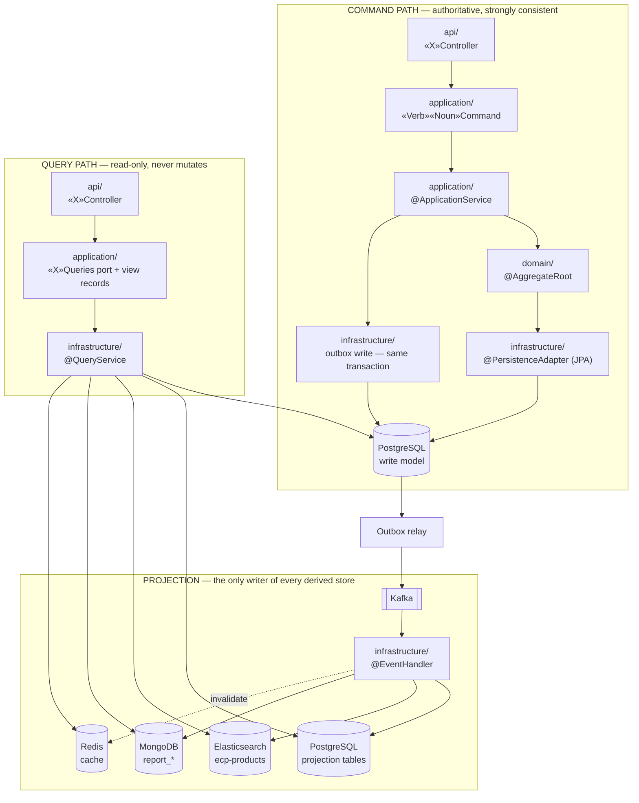
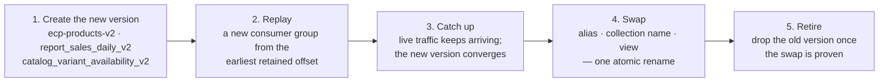

# CQRS — Enterprise Commerce Platform (ECP)

**Document type:** Backend architecture specification — command model, query model, and projections
**Status:** Accepted where it renders an existing ADR; **Proposed** for §4 (the code-level command/query contract), §5 (the read-model catalogue, two rows of which exist nowhere else), §6.2 (Elasticsearch idempotency and ordering), §7 (the rebuild procedure), §8 (the read-your-writes contract), §9 (lag budgets), and §11.1 (the rules added to the CI gate) — each decided here for the first time
**Audience:** Backend Engineering, Architecture Review, QA
**Related documents:** [Domain Model](./Domain%20Model.md) · [Database](./Database.md) · [Module Dependency Diagram](./Module%20Dependency%20Diagram.md) · [Sequence](./Sequence/README.md) · [Integration Contract](../04-shared/Integration%20Contract.md) · [ADR-0008](../01-system/ADR/ADR-0008-cqrs-command-query-separation.md) · [ADR-0010](../01-system/ADR/ADR-0010-jpa-write-model-jdbc-read-models.md) · [ADR-0012](../01-system/ADR/ADR-0012-transactional-outbox-and-kafka.md) · [ADR-0013](../01-system/ADR/ADR-0013-mongodb-scoped-to-read-models.md) · [ADR-0014](../01-system/ADR/ADR-0014-elasticsearch-search-read-model.md) · [ADR-0030](../01-system/ADR/ADR-0030-spring-data-mongodb-read-model-access.md)

---

## 1. Purpose of This Document

[ADR-0008](../01-system/ADR/ADR-0008-cqrs-command-query-separation.md) decides *that* the command and query paths are separated, and fixes the consistency classification that decides what may be projected. [ADR-0010](../01-system/ADR/ADR-0010-jpa-write-model-jdbc-read-models.md) decides the persistence technology per side. [ADR-0013](../01-system/ADR/ADR-0013-mongodb-scoped-to-read-models.md), [ADR-0014](../01-system/ADR/ADR-0014-elasticsearch-search-read-model.md), and [ADR-0030](../01-system/ADR/ADR-0030-spring-data-mongodb-read-model-access.md) scope the projected stores and how they are written. [`Database.md`](./Database.md) gives three of them a physical shape.

Six questions remain, and every one of them is load-bearing:

1. **What is a command, as a code artefact?** Where the type lives, what it carries, what it returns, and which of the four layers owns each step (§3).
2. **Where does a query live in the layer graph?** [`Module Dependency Diagram.md`](./Module%20Dependency%20Diagram.md) §6 forbids `infrastructure → api`, and a `@QueryService` that runs SQL is infrastructure. That makes the obvious arrangement — a query interface in `api` — illegal, and nothing says what replaces it (§4).
3. **Which read models exist, in total?** `AvailabilityReadModel` and `RatingSummaryReadModel` appear as participants in [`Sequence/05-Cart-Catalog-Search.md`](./Sequence/05-Cart-Catalog-Search.md) §6 and have no store anywhere in [`Database.md`](./Database.md). A read model with no named store is a read model nobody can rebuild (§5).
4. **How does each projection dedupe and order itself?** [ADR-0030](../01-system/ADR/ADR-0030-spring-data-mongodb-read-model-access.md) §4 answers this completely for MongoDB. [ADR-0014](../01-system/ADR/ADR-0014-elasticsearch-search-read-model.md) requires idempotency for Elasticsearch without naming a mechanism, and `dynamic: strict` means the mechanism needs mapped fields that do not exist yet (§6.2).
5. **How is a projection rebuilt?** ADR-0008 §4 states that *"every projection must be rebuildable from Kafka without a coordinated outage"* and that *"a projection that cannot be rebuilt is a second source of truth by accident."* No document states the procedure, and the procedure has a hard dependency on a Kafka retention figure that is still deferred (§7).
6. **What does the platform promise a user who just wrote something?** ADR-0008 §5 names visible eventual consistency as the headline cost and assigns it to the UI. A UI cannot solve it alone; the read path has to offer a strongly consistent route for the moment after a write (§8).

This document settles all six. It does not reopen anything above it: the classification table in §2.1 is ADR-0008's, reproduced because everything here depends on it, and the admission test for a new MongoDB collection remains [ADR-0013](../01-system/ADR/ADR-0013-mongodb-scoped-to-read-models.md) §4's.

### 1.1 What this document does not decide

| Deferred to | Concern |
|---|---|
| [`Backend Architecture.md`](./Backend%20Architecture.md) | Kafka topic retention, partition counts, replication factor, serialisation format, and the relay implementation ([ADR-0012](../01-system/ADR/ADR-0012-transactional-outbox-and-kafka.md) §5). §7.4 records retention as a **dependency of rebuildability**, not merely an operational parameter. |
| [`Database.md`](./Database.md) | The physical shape of every store. §5 names two projection tables and three Elasticsearch fields that `Database.md` must carry; they are listed in §13 as follow-on edits, not silently assumed. |
| [`Integration Contract.md`](../04-shared/Integration%20Contract.md) §6–§8 | The event envelope, topic naming, partition key, consumer obligations, and schema evolution. This document consumes that contract; it does not restate it. |
| [`Deployment Diagram.md`](../01-system/Deployment%20Diagram.md) | Where each read store physically runs, and with what resources. |
| Nowhere yet — a **real, open gap** | High availability and backup for the MongoDB reporting store. `Database.md` §11 names the equivalent gap for PostgreSQL; the reporting store is rebuildable, which makes backup optional *only* if §7.4's retention dependency is satisfied. |

---

## 2. The Two Paths



Three properties of that picture are the whole of this document, and each is a rule rather than an observation:

- **The command path writes exactly one store.** PostgreSQL, through JPA, inside one transaction that also carries the outbox row. Nothing on the command path writes Elasticsearch, MongoDB, or Redis — a dual write has no transaction spanning both halves, and [`Sequence/05-Cart-Catalog-Search.md`](./Sequence/05-Cart-Catalog-Search.md) §8 states the consequence: *"any failure between them leaves the two permanently disagreeing with no record of which is right."*
- **The query path reads any store and writes none** — with exactly one exception, Redis cache population on a miss, which §6.2 separates from projection on purpose.
- **The two paths meet only at PostgreSQL and only through Kafka.** There is no in-memory handoff, no shared service, and no type shared between a command and a view.

### 2.1 The classification of every read

[ADR-0008](../01-system/ADR/ADR-0008-cqrs-command-query-separation.md) §4's table, with the consistency class named so the rest of this document can refer to it, and with the store that actually answers the query:

| Class | Data | Guarantee | Served from | Lag budget (§9) |
|---|---|---|---|---|
| **C0** | Order state, payment state, stock availability **on a binding path** | **Strong — no permitted lag** | PostgreSQL write model, command side | none, by construction |
| **C0** | Cart contents | Strong | PostgreSQL write model; Redis as cache-aside over it | none (cache is invalidated, not projected) |
| **C1** | Catalog browse, product detail, order history, admin lists | Near-real-time | PostgreSQL projection + Redis | < 1 s, invalidation-driven |
| **C2** | Search, facets, autocomplete, advisory availability, rating summary | Eventual (seconds) | Elasticsearch; PostgreSQL projection tables | 30 s alert threshold |
| **C3** | Reporting and analytics | Eventual, ≤ 5 minutes (`NFR-PERF-06`) | MongoDB `report_*` | 3 min alert threshold |

`NFR-PERF-06` sets this table and **it is not negotiable per feature.** A feature that wants C0 semantics from a C2 store has a design defect, not a configuration problem.

**Ordinary catalog category and listing reads are C1 PostgreSQL JDBC seek queries** over catalog-owned tables, with Redis only as cache-aside. Elasticsearch is not a fallback or alternative source for those pages: it is limited to full-text search, relevance ordering, facets, and autocomplete. This preserves exact filter-bound keyset pagination and the C1 visibility contract while keeping C2 search behaviour explicit.

### 2.2 The rule that makes the separation safe

> **A command never decides against a read model.**

Every invariant in [`Domain Model.md`](./Domain%20Model.md) §10 is checked against state loaded on the command path — an aggregate through its repository, or a versioned `UPDATE … WHERE` predicate ([`Database.md`](./Database.md) §6.1). A projection may inform a decision a *human* makes; it may never be the state a `BR-*` rule is evaluated against.

This is what ADR-0008 §4 means by *"checkout reads stock availability from the command side, never from a projection"*, and it generalises:

| Tempting read | Why it is forbidden | What replaces it |
|---|---|---|
| Reserve stock after checking the Elasticsearch `inStock` flag | C2 lag means the flag is stale by construction; `BR-INV-01` would be enforced against a guess | The versioned `UPDATE` of [`Database.md`](./Database.md) §6.1 — the predicate *is* the check |
| Reject a promotion by reading a usage count from the reporting store | C3 permits five minutes of lag; `UC-PRM-02` E7 is an oversell problem in the same shape as `BR-INV-01` | The versioned `UPDATE` on `promotion_promotion` |
| Decide an order transition from an order-list projection | A projection cannot carry `@Version`, so two concurrent transitions would both believe they held the invariant | `Order.transition()` on the aggregate loaded in the transaction |
| Authorise from a cached role set | `BR-AUD-02` requires one decision point regardless of entry point | `AuthorizationService`, called from the application layer ([`Sequence/00-Overview.md`](./Sequence/00-Overview.md) §2) |

The flash-sale counter of [`Database.md`](./Database.md) §7.3 is the one case that looks like a violation and is not: `flash:{sku}` **may reject and may never authorise.** A request the counter permits still passes the versioned update. The asymmetry is the whole contract.

---

## 3. The Command Path

### 3.1 Anatomy

One command, from the wire to the outbox row. The gates before the controller are [`Sequence/00-Overview.md`](./Sequence/00-Overview.md) §2 and are not repeated.

| # | Step | Layer | Rule |
|---|---|---|---|
| 1 | Validate the request body against the OpenAPI contract | `api` | Shape validation only. A business rule checked here would be checked twice and drift ([ADR-0031](../01-system/ADR/ADR-0031-contract-first-openapi.md)) |
| 2 | Map the request DTO to a command | `api` | MapStruct. The controller's last act; it holds no business logic |
| 3 | Open the transaction | `application` | `@ApplicationService` is the **only** transaction owner ([ADR-0007](../01-system/ADR/ADR-0007-jmolecules-tactical-ddd.md)) |
| 4 | Authorise | `application` | `AuthorizationService.authorise(actor, operation, ownership)` — first call in every command method, enforced by the CI gate ([ADR-0018](../01-system/ADR/ADR-0018-architecture-governance-ci-gate.md) §4) |
| 5 | Claim the idempotency key where the endpoint requires one | `application` | `INSERT` into `<module>_idempotency_key`; **the insert is the check** (§3.5) |
| 6 | Load aggregates through their repositories | `application` → `infrastructure` | One repository per aggregate root; eager within the boundary, never lazy across it ([ADR-0010](../01-system/ADR/ADR-0010-jpa-write-model-jdbc-read-models.md)) |
| 7 | Execute the business change on the aggregate | `domain` | The invariant lives here. No Spring, no JPA, no port, no transaction |
| 8 | Call ports where the use case spans aggregates | `application` → `infrastructure` | The Order-Placement Partnership only ([`Module Dependency Diagram.md`](./Module%20Dependency%20Diagram.md) §8) |
| 9 | Save, and write the outbox row for every Kafka-transported event | `infrastructure` | Same transaction ([ADR-0012](../01-system/ADR/ADR-0012-transactional-outbox-and-kafka.md)); `Database.md` §5.1 is the row |
| 10 | Commit, then return a command result | `application` → `api` | §3.4 fixes what the result may contain |

**Nothing in steps 1–10 touches a projected store.** The projection happens after the relay publishes, in an `@EventHandler`, and the command is already complete and acknowledged by then.

### 3.2 The command object

| Rule | Detail |
|---|---|
| **Placement** | `<module>/application/` — never `api`. The Scheduler (`BR-CRT-01` cart expiry, `BR-INV-02` reservation expiry) and event handlers issue commands without passing a controller, and `BR-AUD-02` requires the same decision for all three entry points. A command declared in `api` would make the HTTP path the privileged one. |
| **Shape** | A Java `record`. Immutable, no behaviour beyond self-validating construction of its own field constraints. |
| **Naming** | `«Verb»«Noun»Command`, imperative present tense — `PlaceOrderCommand`, `ReserveStockCommand`, `ChangeProductPriceCommand`. The inverse of a domain event's past tense ([ADR-0007](../01-system/ADR/ADR-0007-jmolecules-tactical-ddd.md)). |
| **Carries** | The actor, the correlation id, the idempotency key where required, typed ids, and business values. |
| **Never carries** | A domain object, a JPA entity, a view record, an `HttpServletRequest`, a `Principal`, or a credential. A command that carries an aggregate has moved the load out of the transaction that protects it. |
| **One command, one use case, one transaction** | A command method that needs two transactions is two commands, and the sequencing between them belongs to an event, not to a loop. |

### 3.3 Representative commands

Derived from the use cases already specified in [`BA-docs/use-cases/`](../../BA-docs/use-cases/README.md) and the aggregates of [`Domain Model.md`](./Domain%20Model.md) §8. Nothing here is new business behaviour; the table exists so that the naming rule above has a worked set and so that §11's "every mutating OpenAPI operation resolves to one command" check has a baseline.

| Module | Commands | Enforces |
|---|---|---|
| `identity` | `RegisterAccountCommand`, `VerifyAccountCommand`, `AuthenticateCommand`, `RotateRefreshTokenCommand`, `ChangeAccountRoleCommand`, `SuspendAccountCommand`, `ResetPasswordCommand` | `BR-CUS-01`…`-05`, `BR-AUD-03` |
| `catalog` | `CreateProductCommand`, `PublishProductCommand`, `ChangeProductPriceCommand`, `DiscontinueProductCommand`, `AddVariantCommand`, `ChangeCategoryCommand` | `BR-CAT-01`…`-03` |
| `inventory` | `ReserveStockCommand`, `CommitReservationCommand`, `ReleaseReservationCommand`, `ExpireReservationsCommand`, `AdjustStockCommand` | `BR-INV-01`…`-03` |
| `cart` | `AddCartLineCommand`, `ChangeCartLineQuantityCommand`, `RemoveCartLineCommand`, `MergeGuestCartCommand`, `CheckOutCartCommand`, `ExpireCartsCommand` | `BR-CRT-01`…`-04` |
| `ordering` | `PlaceOrderCommand`, `CancelOrderCommand`, `AdvanceOrderStatusCommand`, `ApplyPaymentOutcomeCommand`, `RecordReturnCommand` | `BR-ORD-01`…`-06` |
| `payment` | `InitiatePaymentCommand`, `ApplyProviderCallbackCommand`, `SettleCodPaymentCommand`, `RefundPaymentCommand` | `BR-PAY-01`…`-03` |
| `shipping` | `CreateShipmentCommand`, `DispatchShipmentCommand`, `ApplyTrackingUpdateCommand`, `ConfirmDeliveryCommand` | `BR-SHP-01`, `BR-SHP-02` |
| `promotion` | `ActivatePromotionCommand`, `RedeemPromotionCommand`, `ExpirePromotionCommand` | `BR-PRM-01`…`-03` |
| `review` | `SubmitReviewCommand`, `ModerateReviewCommand` | `BR-REV-01`…`-04` |
| `notification` | `DispatchNotificationCommand` | `BR-NTF-01`, `BR-NTF-02` |
| `reporting` | **none** | A pure read side ([`Domain Model.md`](./Domain%20Model.md) §8.12). A command in `reporting` is a design error, and §11.1 asserts its absence |
| `audit` | **none** | Append-only, event-driven; no mutation API at all ([ADR-0017](../01-system/ADR/ADR-0017-append-only-audit-log.md)) |

### 3.4 What a command returns

| Rule | Why |
|---|---|
| **A command returns identifiers and status, never a projection.** `OrderPlacedResult(orderId, orderNumber, status, total)` — not an order-detail view. | A result assembled from a projection would have to wait for the projection to converge, which converts an asynchronous path into a synchronous one and puts C2 lag on a C0 response. |
| **The result may carry authoritative fields read from the aggregate just written.** | This is the read-your-writes mechanism of §8, and it costs nothing: the aggregate is already in the persistence context. |
| **A command never returns a list.** | A list is a query. A command returning one has become a read endpoint that also mutates, which breaks `GET`-safety reasoning at the boundary ([`Integration Contract.md`](../04-shared/Integration%20Contract.md) §2.1). |
| **`202 Accepted` is returned only where the use case is genuinely asynchronous**, and then the response carries the resource the client polls. | `202` on a synchronous command trains clients to poll a projection for confirmation, which §8.3 forbids. |

### 3.5 Idempotency and retry on the command path

Two different mechanisms, often confused, and they protect against different things:

| Mechanism | Protects against | Where |
|---|---|---|
| `Idempotency-Key` header → `<module>_idempotency_key` insert | A **client** retrying a request, or two concurrent submissions of the same intent | `POST /api/v1/orders` and payment initiation ([`Integration Contract.md`](../04-shared/Integration%20Contract.md) §2.2); `BR-ORD-03`, `NFR-REL-02` |
| Bounded retry with jitter on an optimistic-lock miss | **Concurrency** — a stale `@Version` read, meaning someone else committed first | Inside the command, per [ADR-0011](../01-system/ADR/ADR-0011-optimistic-locking-reservation-model.md) §4 |
| `<module>_processed_event` insert | **Kafka** redelivering an event, at-least-once | The projection path, not the command path (§6.2) |

Rules that keep them distinct:

- **The insert is the check.** A `SELECT` before the `INSERT` leaves exactly the race window the key exists to close ([`Database.md`](./Database.md) §6.1).
- **A retry re-reads.** An optimistic-lock retry re-enters the command from step 6 with a fresh load. Retrying a stale aggregate is the defect, not the fix.
- **Retries are bounded, and exhaustion is a `409`** with a code from [`Integration Contract.md`](../04-shared/Integration%20Contract.md) §4.4 — a conflict that may succeed later, never a `500`.
- **An idempotent replay returns the original response verbatim**, including its status. It does not re-execute and it does not re-publish an event; the outbox row from the first execution is the one that was published.

---

## 4. The Query Path

### 4.1 Where a query lives

[`Module Dependency Diagram.md`](./Module%20Dependency%20Diagram.md) §6 fixes four layer rules, and two of them together determine the answer: `infrastructure` may not depend on `api`, and `application` may not depend on `api`. A `@QueryService` that runs SQL, a Mongo criteria, or an Elasticsearch request is infrastructure by [ADR-0018](../01-system/ADR/ADR-0018-architecture-governance-ci-gate.md) §4's store-type rule. Therefore:

| Artefact | Layer | Naming | Note |
|---|---|---|---|
| **Query port** — the interface the controller calls | `application` | `«Aggregate»Queries` — `ProductQueries`, `OrderQueries` | One port per aggregate or per screen family, not one per method |
| **View record** — the query model | `application` | `«Noun»View`, `«Noun»Summary`, `«Noun»Row` | `ProductDetailView`, `OrderSummary`, `SalesDailyRow` |
| **Query service** — the implementation | `infrastructure` | `«Noun»QueryService` | `@QueryService`; carries the statement it runs ([ADR-0010](../01-system/ADR/ADR-0010-jpa-write-model-jdbc-read-models.md) §4) |
| **Controller** | `api` | `«Aggregate»Controller` | Depends on the port, never on the query service |
| **Read facade for other modules** | `api` | `«Module»ReadApi` | A thin class over the port; the only read surface another module may reach ([ADR-0006](../01-system/ADR/ADR-0006-spring-modulith-module-boundaries.md)) |

**A view record is the response body.** The controller returns it directly, named field-for-field after its OpenAPI schema ([ADR-0031](../01-system/ADR/ADR-0031-contract-first-openapi.md)). There is no second mapping from view record to api DTO: the read side has one shape per query by design, which is the part of [ADR-0010](../01-system/ADR/ADR-0010-jpa-write-model-jdbc-read-models.md) §5's *"three shapes for `Order`"* cost that CQRS is entitled to avoid. The price is that `application` carries wire-shaped types; it is paid once, visibly, rather than spread across a mapper per endpoint.

A view record therefore carries primitives, `BigDecimal`, `String` currency codes, and other view records. **Never a domain type** — not an aggregate, not an entity, not a `Money` value object. The kernel is behaviour-only and framework-free ([`Domain Model.md`](./Domain%20Model.md) §5.3); putting it on the wire would invite a serialisation annotation into it.

### 4.2 Rules for every `@QueryService`

| Rule | Mechanism / why |
|---|---|
| **Read-only, always** | `@QueryService` is meta-annotated `@Transactional(readOnly = true)` ([ADR-0007](../01-system/ADR/ADR-0007-jmolecules-tactical-ddd.md)). A query service that mutates is the single fastest way to lose the separation. |
| **No aggregate, no repository, no domain service** | It reaches a store directly. Loading an aggregate to render a list is the N+1 path [ADR-0010](../01-system/ADR/ADR-0010-jpa-write-model-jdbc-read-models.md) §3 rejects, and it returns a type the wire must not see. |
| **One statement per view** | Explicit SQL / criteria / query DSL, one round trip per view where the store allows it. The statement is reviewable against its `NFR-PERF-*` budget and against the index that supports it (`P10`). |
| **Every sortable and filterable field is backed by an index** | [`Integration Contract.md`](../04-shared/Integration%20Contract.md) §3.3 — an endpoint documents what is sortable, and each one costs an index. An undocumented parameter is `400`, never silently ignored. |
| **Cursor pagination, no unpaginated collection** | [`Integration Contract.md`](../04-shared/Integration%20Contract.md) §3.1–§3.2. `page.total` is omitted on every Elasticsearch-backed collection. |
| **Visibility is part of the query** | `BR-CAT-02` — an unpublished product is not served, and `BR-SCH-01` scopes the search read model the same way. Filtering after the fact in the client is not enforcement ([`Sequence/05-Cart-Catalog-Search.md`](./Sequence/05-Cart-Catalog-Search.md) §6). |
| **Ownership scoping is server-side** | A customer's order list is scoped by the authenticated subject inside the statement. Another customer's resource is `404`, never `403` ([`Integration Contract.md`](../04-shared/Integration%20Contract.md) §2.1). |
| **A non-PostgreSQL query service carries no PostgreSQL transaction** | [ADR-0030](../01-system/ADR/ADR-0030-spring-data-mongodb-read-model-access.md) §4, extended here to Elasticsearch for the identical reason: a dashboard or search request holding a transactional connection contends with checkout at the pool — the one resource `CON-06`'s physical separation does not separate. |
| **Degrade, never block** | A C2/C3 store being unavailable returns a documented degraded state for that view only (`NFR-AVAIL-02`). A query service does not fall back to the write model to cover a missing projection: a silent fallback turns a 10× search load into transactional load at exactly the wrong moment. |

### 4.3 Cross-module reads

| Case | Route | Example |
|---|---|---|
| A module reads its own data | Controller → its own port → its own query service | `ProductController` → `ProductQueries` |
| A module reads another module's data for display | The other module's `api` read facade, called from the **application** layer | Cart's advisory price and availability check (`BR-CRT-02`) via `catalog.api.CatalogReadApi` |
| A module needs another module's data for a **decision** | Not a read — a port call inside the transaction, or it is not a decision this module may make | The Partnership's `StockReservationPort` ([`Module Dependency Diagram.md`](./Module%20Dependency%20Diagram.md) §8) |
| A module needs another module's data continuously | A local projection off that module's events | Review's projection of `OrderDelivered`/`OrderCompleted` for `BR-REV-01` |

**No query service issues SQL across a module's table prefix.** The one sanctioned exception in the whole schema is the `reporting_order_summary` view of [`Database.md`](./Database.md) §4.12 — read-only, non-authoritative, zero upstream influence, and explicitly *not* the dashboard path.

---

## 5. The Read-Model Catalogue

**Status: Proposed.** Every read model in the platform, with its store, its feed, its class, and its owner. This is the list §7's rebuild procedure applies to, and a projection absent from it does not exist.

| # | Read model | Owner | Store | Fed by | Class | Serves |
|---|---|---|---|---|---|---|
| R1 | **Product search index** | `catalog` | Elasticsearch `ecp-products-v1` behind alias `ecp-products` | `ProductCreated`, `ProductPublished`, `ProductPriceChanged`, `ProductDiscontinued`, `VariantAdded`, `CategoryChanged`; order-line events for `popularityScore` | C2 | Keyword search, facets, relevance ranking, autocomplete (`UC-SCH-01`, `NFR-PERF-03`, `NFR-PERF-04`) |
| R2 | **Advisory availability** | `catalog` | Elasticsearch `variants.inStock` | `StockReserved`, `StockReservationCommitted`, `StockReservationReleased`, `StockReservationExpired`, `StockAdjusted` | C2 | The "in stock" facet and filter. The product page's per-variant badge is **not** served from here — §5.1 |
| R3 | **Rating summary** | `catalog` | PostgreSQL `catalog_product.average_rating`/`review_count` ([`Database.md`](./Database.md) §4.2) **and** Elasticsearch `averageRating`/`reviewCount` | `ReviewPublished`, `ReviewModerated` | C2 | Product page, product lists, and search sort-by-rating. Catalog displays ratings without owning them |
| R4 | **Product detail / category listing** | `catalog` | PostgreSQL write tables, read through JDBC + Redis `cat:*` | Not projected — read directly; Redis is invalidated by `ProductPriceChanged`, `ProductPublished`, `ProductDiscontinued`, `CategoryChanged` | C1 | `GET /products/{id}`, `GET /categories/{slug}/products` (`NFR-PERF-01`) |
| R5 | **Cart view** | `cart` | PostgreSQL write tables + Redis `cart:{cartId}` | Not projected — PostgreSQL is the record | C0 | Cart screen; the hot copy makes reads cheap and holds no fact that exists nowhere else |
| R6 | **Order summary / order history** | `ordering` | PostgreSQL write tables, read through JDBC | Not projected | C1 | Customer order list, order detail, admin order search |
| R7 | **Verified-purchase projection** | `review` | PostgreSQL `review_verified_purchase` | `OrderDelivered`, `OrderCompleted` | C2 | `BR-REV-01` — only a delivered purchase may be reviewed. Its composite primary key is its own idempotency guard ([`Database.md`](./Database.md) §5.2) |
| R8 | **Sales daily** | `reporting` | MongoDB `report_sales_daily` | `OrderPaid`, `OrderRefunded`, `OrderReturned`, `PaymentCaptured`, `PaymentRefunded` | C3 | Revenue dashboard (`P13`, `BR-RPT-01`) |
| R9 | **Product performance** | `reporting` | MongoDB `report_product_performance` | Order-line events, `ProductPublished`, catalog view events | C3 | Top products in period |
| R10 | **Customer activity** | `reporting` | MongoDB `report_customer_activity` | `OrderPaid`, `OrderCompleted` | C3 | Recency and lifetime-value segments |
| R11 | **Inventory movement** | `reporting` | MongoDB `report_inventory_movement` | `StockReserved`, `StockReservationCommitted`, `StockReservationReleased`, `StockAdjusted` | C3 | Stock movement dashboard (`UC-INV-05`) |
| R12 | **Ad-hoc order summary view** | `reporting` | PostgreSQL view `reporting_order_summary` | Live query over `ordering_order` | C0 (live) | Low-volume ad-hoc queries **only** — never a dashboard, per `NFR-PERF-05` ([`Database.md`](./Database.md) §4.12) |
| R13 | **Audit trail** | `audit` | PostgreSQL `audit_entry` | Every Kafka topic | C2 | `UC-AUD-01`. Append-only; a log, not a projection — it is never rebuilt, because a rebuild would rewrite evidence ([ADR-0017](../01-system/ADR/ADR-0017-append-only-audit-log.md)) |

R13 is the one row that is **not** rebuildable, and that is deliberate: ADR-0008 §4's rebuildability rule exists so that no projection becomes a second source of truth, and the audit log's whole purpose is to be a first source of truth about what happened. It is exempt by design, not by oversight.

### 5.1 The two read models with no store — resolved

`AvailabilityReadModel` (R2) and `RatingSummaryReadModel` (R3) appear as participants in [`Sequence/05-Cart-Catalog-Search.md`](./Sequence/05-Cart-Catalog-Search.md) §6 with no store named there or anywhere in [`Database.md`](./Database.md). Neither needs a new one, and the reason is [ADR-0008](../01-system/ADR/ADR-0008-cqrs-command-query-separation.md) §4's own warning: a query with no special shape requirement is *"not routed through a projection for the sake of symmetry."*

**R3 already has its store, under a different name.** [`Database.md`](./Database.md) §4.2 carries `catalog_product.average_rating` and `catalog_product.review_count`, written by Catalog's own `ReviewPublished`/`ReviewModerated` handler and described there as *"the one place in this schema where a module stores data another module owns"* — non-authoritative, rebuildable from Kafka, justified by `NFR-PERF-01`. That is R3.

What it lacks is §6.2's **ordering** guard. `catalog_processed_event` excludes a redelivered envelope, but nothing stops an *older* `ReviewModerated` from overwriting a newer average, and a rating that silently goes backwards is invisible in the data — the failure mode [`Database.md`](./Database.md) §7.2.3 rejects for the same reason. One column and a guarded statement close it:

```sql
-- Added to catalog_product (Database.md §4.2). The high-water mark of §6.2,
-- carrying the envelope's occurredAt -- never the write time.
rating_last_event_at  TIMESTAMPTZ,

-- The projection's write is then guarded in its own criteria, never a bare UPDATE:
UPDATE catalog_product
   SET average_rating       = :avg,
       review_count         = :count,
       rating_last_event_at = :occurredAt,
       updated_at           = now()
 WHERE id = :productId
   AND (rating_last_event_at IS NULL OR rating_last_event_at < :occurredAt);
```

Zero rows updated means already applied or superseded: acknowledge the message, do not retry. The `catalog_processed_event` insert stays in the same transaction (§6.2) — the two guards answer different questions, and a projection consuming one aggregate's topic still needs both because Review's events and Catalog's own arrive on different partitions.

**R2 needs no Catalog-side table either.** [`Database.md`](./Database.md) §4.3 already declares `ix_inventory_stock_item_sku` as serving *"cross-warehouse availability for one SKU (product page, cart advisory check)"*. The product page's badge is therefore a **live advisory read of Inventory's own table** through `inventory.api` — §4.3's sanctioned cross-module read route, the same one Cart's `BR-CRT-02` check uses, and one indexed lookup away. The only *projected* availability is Elasticsearch's `variants.inStock`, which exists because a search filter has to evaluate the predicate locally; a product page has no such constraint.

Two properties follow, and both are better than a projection would have given:

- **It survives Elasticsearch being down** (`NFR-AVAIL-02`) — and so would a Catalog-side projection, but this also survives *the projector* being down, because there is no projector.
- **It is as fresh as the command side.** Availability carries no permitted lag on the binding path (`NFR-PERF-06`), and while the badge is display data either way, a live read narrows the window in which it is wrong rather than widening it by a projection hop.

It remains display data regardless: `BR-INV-01` is enforced only by the versioned check of [`Database.md`](./Database.md) §6.1, and §2.2 forbids a command reading either source to decide anything.

**This corrects one note rather than the design.** [`Sequence/05-Cart-Catalog-Search.md`](./Sequence/05-Cart-Catalog-Search.md) §6 labels its `AvailabilityReadModel` participant *"a read model projected from Inventory's Kafka events"*, which is accurate for the search index and overstated for the product page. The note's substantive claim is untouched and is the one that matters — showing "in stock" for a unit someone else takes a second later is *expected behaviour, not a defect*. §13 records the participant rename as applied.

---

## 6. The Projection Contract

### 6.1 Single writer, always

| Store | Only writer | Source |
|---|---|---|
| Elasticsearch `ecp-products-*` | an `@EventHandler` | [ADR-0014](../01-system/ADR/ADR-0014-elasticsearch-search-read-model.md) §4 |
| MongoDB `report_*` | an `@EventHandler` using `MongoTemplate` | [ADR-0030](../01-system/ADR/ADR-0030-spring-data-mongodb-read-model-access.md) §4 |
| PostgreSQL projection columns and tables — R3 on `catalog_product`, R7 `review_verified_purchase` | an `@EventHandler` in the owning module | this document |
| Redis | **not projected at all** — see §6.3 | [ADR-0015](../01-system/ADR/ADR-0015-redis-cache-and-rate-limiting.md), [`Database.md`](./Database.md) §7.3 |

No `@ApplicationService`, controller, scheduled job, migration, or admin tool writes a derived store. A store with two writers has two shapes, and the second one is always discovered in production.

### 6.2 Idempotency and ordering, per store

At-least-once delivery makes redelivery normal ([`Integration Contract.md`](../04-shared/Integration%20Contract.md) §6.4), and ordering holds only within a partition. Every projection therefore needs a dedupe guard, and every projection that consumes more than one aggregate's topic also needs an ordering guard. **Both guards live in the write statement's own criteria, never in the handler's control flow** — a check-then-act leaves exactly the race window that [`Database.md`](./Database.md) §6.1 rejects on the transactional path, for the same reason.

| Store | Dedupe | Ordering | Mechanism |
|---|---|---|---|
| PostgreSQL projection | `INSERT` into `<module>_processed_event` in the **same transaction** as the projection write | `AND (<mark> IS NULL OR <mark> < :occurredAt)` in the `UPDATE`'s own `WHERE` | [`Database.md`](./Database.md) §5.2; the worked statement is §5.1 |
| MongoDB counters (`$inc`) | `appliedEvents: { $ne: eventId }` ring, bounded by `$slice` | not required — counters commute | [`Database.md`](./Database.md) §7.2.2 |
| MongoDB snapshots (`$set`) | naturally idempotent | `lastEventAt < occurredAt` high-water mark in the criteria | [`Database.md`](./Database.md) §7.2.3 |
| Elasticsearch | **decided here** — §6.2.1 | **decided here** — §6.2.1 | |
| Redis | not applicable — invalidation is a `DEL`, which is idempotent by nature | not applicable | §6.3 |

A PostgreSQL projection handler's write and its `processed_event` insert **must share one transaction.** That is available here and is not available for MongoDB, which is why [ADR-0030](../01-system/ADR/ADR-0030-spring-data-mongodb-read-model-access.md) §4 had to move the guard inside the document and why there is no `reporting_processed_event` table ([`Database.md`](./Database.md) §7.2.5).

#### 6.2.1 Elasticsearch — field-group high-water marks

[ADR-0014](../01-system/ADR/ADR-0014-elasticsearch-search-read-model.md) §4 requires the indexer to be idempotent and names no mechanism; [`Sequence/05-Cart-Catalog-Search.md`](./Sequence/05-Cart-Catalog-Search.md) §8 shows the projector asking *"has this eventId been applied?"* without saying where the answer is kept. The complication is that **one document has three writers** — `SearchProjector` from Catalog's events, `AvailabilityProjector` from Inventory's, and `RatingProjector` from Review's — each owning a disjoint field group, each consuming a different topic, and therefore with no comparable ordering between them.

The decision, which is [`Database.md`](./Database.md) §7.2.3's pattern applied per field group:

| Rule | Detail |
|---|---|
| **The document `_id` is the `productId`** | Already implied by the mapping; stated so the upsert key is unambiguous |
| **Each field group carries its own high-water mark** | `catalogEventAt` (R1), `availabilityEventAt` (R2), `ratingEventAt` (R3) — each holding the envelope's `occurredAt`, never the write time. `indexedAt` remains the write time and is not a guard |
| **Every write is one `_update` with an upsert and a guarded script** | The script compares the event's `occurredAt` against that group's mark and makes the update a no-op when it is not newer. A no-op is the success case for a redelivered or out-of-order event: acknowledge, do not retry |
| **A projector writes only its own field group and its own mark** | Disjoint field sets mean the three writers never contend for the same field, so per-document atomicity is sufficient and no cross-stream ordering is needed |
| **`retry_on_conflict` is set, not relied on** | It resolves concurrent writers to the same document; it does not substitute for the guard, because a retried apply of an *older* event would otherwise win |
| **The mapping must declare the three mark fields** | `dynamic: strict` makes an unmapped field a rejected document ([`Database.md`](./Database.md) §7.1), so the guard cannot be added by a handler alone. §13 records the mapping edit |

```js
// AvailabilityProjector — one _update per consumed Inventory event.
POST /ecp-products/_update/{productId}?retry_on_conflict=5
{
  "scripted_upsert": true,
  "script": {
    "source": "if (ctx._source.availabilityEventAt == null || ctx._source.availabilityEventAt < params.occurredAt) { /* write this group's fields, then */ ctx._source.availabilityEventAt = params.occurredAt } else { ctx.op = 'noop' }",
    "params": { "occurredAt": "2026-09-07T14:03:11.482Z", "variants": [ ] }
  },
  "upsert": { }
}
```

**Why not external versioning.** `version_type=external` with `occurredAt` as the version is the obvious alternative and it fails here for a concrete reason: it is one version counter per document, and three independent streams writing disjoint field groups do not share a monotonic clock. Inventory's event from 14:03:11 would permanently block Review's event from 14:03:10, and the rating would silently never arrive — a failure invisible in the data, which is the class of failure [`Database.md`](./Database.md) §7.2.3 rejects.

### 6.3 Redis is invalidated, not projected

The contrast with §6.1 is deliberate and worth stating plainly, because it looks like an inconsistency and is not:

| | Projected store | Redis |
|---|---|---|
| Written by | an `@EventHandler`, exclusively | a `@QueryService`, on a cache miss |
| An `@EventHandler`'s role | write the new state | **`DEL` the affected keys** — never write a value |
| Why | the store answers queries the write model cannot shape | every key is reconstructible; flushing Redis entirely costs latency and nothing else ([ADR-0015](../01-system/ADR/ADR-0015-redis-cache-and-rate-limiting.md) §4) |

An event handler that *wrote* a cache value would be projecting into a store with a TTL, giving two mechanisms for the same key's lifetime and a guaranteed disagreement between them. Invalidation keys and their triggering events are [`Database.md`](./Database.md) §7.3's "Invalidated by" column. Invalidation issued by the owning module's own write path lives in its persistence adapter or its event handler — **never in the application layer**, which must not name a cache client at all (§11.1).

### 6.4 When a projection fails

| Stage | Behaviour |
|---|---|
| Transient failure (store unavailable, timeout) | Retry with backoff inside the consumer. The publisher is never blocked ([ADR-0012](../01-system/ADR/ADR-0012-transactional-outbox-and-kafka.md) §4) |
| Retries exhausted | Dead-letter topic, **and an alert**. A DLQ nobody is paged for is a silent data-loss channel |
| Poison message (unparseable, or a payload that violates the projection's own assumptions) | Dead-letter immediately; do not retry. Retrying a deterministic failure stalls the partition, and a stalled partition turns one bad message into unbounded lag for every aggregate that hashes to it |
| Consumer lag beyond the class budget (§9) | Alert. Lag is a first-class production signal, not a metric someone checks after a complaint |
| A projection is structurally wrong (a bug, not a message) | Fix the handler, then **rebuild** (§7). Never hand-patch a document or a row — a hand-patched projection is no longer derived, and the next rebuild silently reverts the repair |

### 6.5 What a projection must never do

| Forbidden | Why |
|---|---|
| Publish a domain event | Read models have **zero upstream influence** ([`Domain Model.md`](./Domain%20Model.md) §5.2, ADR-0008 §5). A projection that publishes makes the read side a participant in the write side |
| Call another module's application service | It would make a read-side failure a write-side failure, and create a runtime edge the module graph does not show ([`Module Dependency Diagram.md`](./Module%20Dependency%20Diagram.md) §4) |
| Enforce a business invariant | It has no transaction over the aggregate and no `@Version`. §2.2 is the rule; this is its mirror image |
| Be read by a command | §2.2 |
| Write outside its owning module's store | Single writer (§6.1), and `ADR-0009` §4's rule that a module's tables are written only by that module's adapters |
| Hold a fact that exists in no event | That fact would be unrecoverable on rebuild, which makes the projection authoritative by accident |

---

## 7. Rebuild and Versioning

ADR-0008 §4: *"Every projection must be rebuildable from Kafka without a coordinated outage."* This is the procedure, and it is the same four steps for every store.

### 7.1 The procedure



| Store | Versioned object | Swap mechanism |
|---|---|---|
| Elasticsearch | Index `ecp-products-v{n}` | Alias `ecp-products` repointed — atomic, and the read path never names a version ([ADR-0014](../01-system/ADR/ADR-0014-elasticsearch-search-read-model.md) §4) |
| MongoDB | Collection `report_*_v{n}` | The query side names a stable logical name; the swap is a rename ([ADR-0030](../01-system/ADR/ADR-0030-spring-data-mongodb-read-model-access.md) §4) |
| PostgreSQL projection table | Table `<name>_v{n}` | A Flyway-versioned view or rename under the stable name the `@QueryService` selects from ([ADR-0029](../01-system/ADR/ADR-0029-flyway-versioned-schema-migrations.md)) |
| PostgreSQL projection **columns** (R3 only) | none — rebuilt in place | The one projection whose rebuild is not a swap, because its two columns live on an aggregate's own table. Accepted: the alternative is a separate table that [`Database.md`](./Database.md) §4.2 rejected for `NFR-PERF-01`, and an in-place recompute of two columns under the `rating_last_event_at` guard is cheap and idempotent. A rebuild resets the guard to `NULL` first, or every event is skipped as superseded |

**The old version keeps serving throughout.** That is what "without a coordinated outage" means: the replay writes the new version, reads continue against the old one, and the only observable moment is the swap. A rebuild that requires the read path to be stopped has failed this requirement.

**A rebuild resets the dedupe state with the store it belongs to.** A replay into `catalog_variant_availability_v2` must not consult the `catalog_processed_event` rows that recorded the *first* build, or every event will be skipped as already applied. The rebuild's consumer group is new, and its dedupe scope is per-projection-version — recorded here because it is the single easiest way to produce an empty rebuild and conclude the events are gone.

### 7.2 When a rebuild is the answer

| Trigger | Why a rebuild rather than a migration |
|---|---|
| A shape change (new field, new mapping, new index) | There is no data to preserve — every fact is in Kafka. [ADR-0030](../01-system/ADR/ADR-0030-spring-data-mongodb-read-model-access.md) §4: *"there is no migration to write"* |
| A projection bug that produced wrong state | Fixing forward leaves the historical error in place; the wrong rows are the bug's output, not data |
| A store lost (disk, container, accidental drop) | `NFR-REL-05` requires recovery *"without manual data repair"* — for a derived store, replay **is** the recovery path |
| A new read model added | It is a new consumer group from the earliest retained offset; no existing module changes ([ADR-0012](../01-system/ADR/ADR-0012-transactional-outbox-and-kafka.md), `AC-03`) |

### 7.3 Rebuild is a tested property, not a documented intention

A rebuild claim that has never been executed is a claim. The L4 suite ([`Testing and Benchmark Strategy.md`](../01-system/Testing%20and%20Benchmark%20Strategy.md) §6.3) therefore carries, per projection: publish a known event set, assert the projection's state, **drop the store**, replay, assert the state is byte-identical. That test is what makes ADR-0008 §4's rule enforceable (§10).

### 7.4 The retention dependency — an open issue, not a detail

A projection is rebuildable **only as far back as Kafka retains its events.** Topic retention is deferred to [`Backend Architecture.md`](./Backend%20Architecture.md) ([ADR-0012](../01-system/ADR/ADR-0012-transactional-outbox-and-kafka.md) §5), which means the rebuildability rule currently rests on an unset number. The consequences are concrete:

- With finite time-based retention, a full rebuild of R1 (the search index) reconstructs only products whose events are still retained. Everything older is silently missing — and a missing product in a search index looks like a relevance problem, not a data-loss problem.
- The `RING` size of [`Database.md`](./Database.md) §7.2.2 must exceed the maximum redelivery horizon, which is also a retention-derived figure.

Two viable resolutions, recorded so the decision is made rather than discovered:

1. **Log compaction keyed on `aggregateId`** for the topics that feed a full-state projection (`ecp.catalog.product.v1` above all), so the latest state of every aggregate is retained indefinitely while history is compacted away. Sufficient for snapshot-shaped projections (R1–R4, R9, R10); **not** sufficient for counter-shaped ones (R8, R11), which need every event.
2. **A replay source of record** — the retained outbox rows of [`Database.md`](./Database.md) §5.1, which are kept rather than deleted on publish precisely so that replay remains possible. This covers counters too, at the cost of a relay mode that republishes from the outbox.

Until one is chosen, §7.1 is correct in procedure and bounded in reach. This is the most consequential open item in this document, and §13 carries it.

---

## 8. Consistency, Staleness, and the User-Visible Contract

ADR-0008 §5 names this as the headline cost: *"Eventual consistency is now visible to users … This must be designed for in the UI, not discovered in testing."* A UI cannot design for it unless the API tells it which class each response belongs to and offers a strongly consistent route for the moment after a write. That is this section.

### 8.1 Read-your-writes

| Situation | Route | Mechanism |
|---|---|---|
| The response to the write itself | C0 | The command result carries the authoritative fields, read from the aggregate just written (§3.4) |
| The screen rendered immediately after a write | C0 or C1 — **never C2/C3** | The post-write read of an entity the caller just changed goes to the write model through a JDBC query service, not to a projection |
| Any later read of the same entity | Its normal class | Convergence has had time to happen; the normal path is correct and cheaper |
| A list that should now include the new entity | C1 | Order history, cart, and admin lists are C1 precisely so that this case needs no special handling ([§5](#5-the-read-model-catalogue) R5, R6) |
| Search results that should now include a changed product | C2 — **and the UI says so** | A staff member who edits a price sees it on the product page immediately and in search a few seconds later. This is ADR-0008 §5's example, and the answer is to state the lag in the admin UI, not to make search synchronous |

**The rule in one line:** *a caller is never asked to wait for a projection to observe the effect of their own command.*

### 8.2 What the API exposes about staleness

| Rule | Detail |
|---|---|
| A C2/C3 response may carry `Last-Modified` or an `asOf` field | The projection's own high-water mark (§6.2), so a client can render "as of 14:03" rather than implying live data |
| A C2/C3 response **never** carries `ETag` with a revalidation contract the projection cannot honour | An `ETag` on a view that converges asynchronously promises a freshness the store does not have |
| A C0 response carries no staleness metadata | There is nothing to disclose |
| A degraded projection returns a documented degraded state | Not an empty success. `NFR-AVAIL-02` is verified by a dependency-failure test ([ADR-0014](../01-system/ADR/ADR-0014-elasticsearch-search-read-model.md) §4), and a degraded search that returns `200 []` passes that test while failing the user |

### 8.3 Three anti-patterns, each of which has a specific cost

| Anti-pattern | What it costs |
|---|---|
| **Polling a projection to confirm a write** | Converts C0 into C2 at the client, and makes every projection's lag a user-facing latency. If a client needs confirmation, the command response is the confirmation (§3.4) |
| **Serving a binding value from a projection "because it is usually fresh"** | `BR-INV-01` and `BR-ORD-06` are not probabilistic. [`Sequence/05-Cart-Catalog-Search.md`](./Sequence/05-Cart-Catalog-Search.md) §1: showing "in stock" for a unit someone else takes a second later is *expected behaviour*; **reserving** against that display is a defect |
| **A synchronous projection write to "avoid the lag"** | Restores the dual write the whole design removes, and removes the rebuild path with it ([`Sequence/05-Cart-Catalog-Search.md`](./Sequence/05-Cart-Catalog-Search.md) §8) |

---

## 9. Observability

ADR-0008 §5 states that projection lag is a first-class production signal *"which `NFR-OBS-04` covers only partially."* [ADR-0030](../01-system/ADR/ADR-0030-spring-data-mongodb-read-model-access.md) §4 assigns lag alerting for MongoDB. This section assigns it for every projection, with a single definition.

**Projection lag** = `now() − max(occurredAt)` over the events applied to that projection. The envelope's `occurredAt`, never the write time — the two differ by outbox lag, and conflating them under-reports ([`Integration Contract.md`](../04-shared/Integration%20Contract.md) §6.1). Each store already holds the mark the metric reads: `last_event_at`, `lastEventAt`, `catalogEventAt`/`availabilityEventAt`/`ratingEventAt`.

| Signal | Per | Alert threshold | Why that number |
|---|---|---|---|
| Projection lag, C1 | read model | 5 s | Invalidation-driven; seconds of lag means invalidation is not arriving |
| Projection lag, C2 | read model | 30 s | `NFR-PERF-03`/`-04` say nothing about freshness, but a search index half a minute behind is a visible product defect |
| Projection lag, C3 | collection | 3 min | Below `NFR-PERF-06`'s 5-minute ceiling, so the alert precedes the breach ([ADR-0030](../01-system/ADR/ADR-0030-spring-data-mongodb-read-model-access.md) §4) |
| Outbox lag | publishing module | 30 s | `published_at − occurred_at` over unpublished rows ([`Database.md`](./Database.md) §5.1). Distinguishes "the relay is behind" from "the consumer is behind" — without both, every lag alarm is ambiguous |
| Consumer-group lag | topic × group | by class, as above | Kafka-side view of the same condition; catches a stalled partition that a store-side mark cannot see, because a stalled partition stops updating the mark |
| DLQ depth | topic | **> 0** | A dead-lettered business event is an unprojected fact. There is no acceptable steady-state depth |
| Rebuild progress | rebuild run | — | Replay position versus the target offset, so a rebuild is observable rather than hopeful |

`correlationId` threads through the command, the outbox row, the Kafka envelope, and every projection's log line ([`Integration Contract.md`](../04-shared/Integration%20Contract.md) §6.2), which is what makes *"this order's reporting row is missing"* a traceable question rather than a search.

---

## 10. Testing

Mapped onto the seven layers of [`Testing and Benchmark Strategy.md`](../01-system/Testing%20and%20Benchmark%20Strategy.md) §3. Nothing new is invented; each CQRS claim is assigned to the layer that can falsify it.

| Claim | Layer | Test |
|---|---|---|
| A command's invariant holds | L1 | Aggregate unit tests, no Spring context (§2.2's decisions are all aggregate-side) |
| The separation rules hold structurally | **L2** | §11.1's ArchUnit rules — build-failing, never skippable |
| A view record matches its OpenAPI schema | L3 | `@WebMvcTest` against the operation's schema ([ADR-0031](../01-system/ADR/ADR-0031-contract-first-openapi.md)) |
| Every `GET` operation resolves to exactly one `@QueryService` method, and every mutating operation to exactly one command | L3 contract test | The code→spec direction of [`Testing and Benchmark Strategy.md`](../01-system/Testing%20and%20Benchmark%20Strategy.md) §6.6, extended to the CQRS side |
| A projection converges | L4 | Modulith `Scenario`: publish, await, assert the read model |
| **A redelivered event changes nothing** | L4 | Consume the same envelope twice; assert the row/document is byte-identical (§6.2) |
| **An out-of-order event does not overwrite newer state** | L4 | Apply `occurredAt = T+1`, then `T`; assert `T` was a no-op |
| **A projection is rebuildable** | L4 | §7.3 — drop the store, replay, assert byte-identical state |
| A command never reads a projection | L2 + L5 | The ArchUnit rule, plus a concurrency test proving the binding check is the versioned `UPDATE` ([`Testing and Benchmark Strategy.md`](../01-system/Testing%20and%20Benchmark%20Strategy.md) §6.4) |
| The outbox row and the business write are atomic | L5/L6 | Fault injection after each step; assert fully applied or fully absent |
| A failing read store degrades only its own view | L6 | Stop Elasticsearch; assert browse, cart, and checkout are unaffected and search returns its documented degraded state (`NFR-AVAIL-02`) |
| **Reporting does not contend with checkout** | L7 | `NFR-PERF-05` — dashboard load concurrent with the checkout scenario; assert `NFR-PERF-01`/`-02` still hold. This is the measurement that decides whether `CON-06` was actually achieved structurally or only claimed |

---

## 11. Governance

### 11.1 Rules this document adds to the CI gate

**Status: Proposed.** [ADR-0018](../01-system/ADR/ADR-0018-architecture-governance-ci-gate.md) §4 already carries the CQRS rules it could state from ADR-0008 and ADR-0030 alone. These are the ones this document's decisions make checkable. Each is build-failing, and each exists because the failure it catches is otherwise invisible until production.

| # | Rule | Enforces | From |
|---|---|---|---|
| G1 | An `@ApplicationService` must not reference a `@QueryService`, nor any read-store client (`MongoTemplate`, an Elasticsearch client, a Redis template) | §2.2 — a command never decides against a read model | this document |
| G2 | A `@QueryService` must not reference a JMolecules `@Repository`, `@AggregateRoot`, `@Entity`, or `@DomainService` type | §4.2 | this document |
| G3 | A `@QueryService` method's return type must not be annotated `@AggregateRoot` or `@Entity` | §4.1 — a domain type never reaches the wire | this document |
| G4 | A view record must not reference a domain or JPA type | §4.1 | this document |
| G5 | A write to Elasticsearch occurs only inside an `@EventHandler` | §6.1 — the mirror of ADR-0018's MongoDB rule | [ADR-0014](../01-system/ADR/ADR-0014-elasticsearch-search-read-model.md) §4 |
| G6 | No Elasticsearch client type outside a module's `infrastructure` package | `CON-03`, `NFR-MAINT-03` — the mirror of ADR-0018's `spring-data-mongodb` rule | [ADR-0030](../01-system/ADR/ADR-0030-spring-data-mongodb-read-model-access.md) §4 |
| G7 | A `@QueryService` reaching Elasticsearch or MongoDB carries no PostgreSQL transaction | `NFR-PERF-05`, `CON-06` — pool contention that appears only under load | [ADR-0030](../01-system/ADR/ADR-0030-spring-data-mongodb-read-model-access.md) §4, extended |
| G8 | An `@EventHandler` that writes a read store must not publish an event nor call another module's application service | §6.5 — read models have zero upstream influence | [`Domain Model.md`](./Domain%20Model.md) §5.2 |
| G9 | No cache client type in a module's `application` or `domain` package | §6.3 — invalidation is an infrastructure concern | this document |
| G10 | The `reporting` and `audit` modules declare no `@ApplicationService` with a mutating command method | §3.3 — a pure read side, and an append-only log | [`Domain Model.md`](./Domain%20Model.md) §8.12, [ADR-0017](../01-system/ADR/ADR-0017-append-only-audit-log.md) |
| G11 | A command type is declared in `application`, never in `api` | §3.2 — every entry point is equal (`BR-AUD-02`) | this document |

G1 is the highest-value rule here, for the same reason ADR-0018 §4 gives for the authorisation rule: a command that reads a projection produces a wrong decision under load and a correct one in every test that is not concurrent.

### 11.2 Review checklist for a new read model

Before a projection is added, all six must be answerable. A *no* anywhere means it is not a read model yet.

1. Which **class** (§2.1) is it, and which lag budget does that bind it to?
2. Which **events** feed it, and are they all already published on a Kafka topic — or does a publisher have to change?
3. What is its **dedupe guard**, and is it inside the write statement's criteria (§6.2)?
4. Does it consume more than one aggregate's topic, and if so what is its **ordering guard**?
5. How is it **rebuilt** (§7.1), and does its feed survive §7.4's retention question?
6. Does any **command** read it? If yes, the design is wrong (§2.2), not the rule.

For a MongoDB collection specifically, [ADR-0013](../01-system/ADR/ADR-0013-mongodb-scoped-to-read-models.md) §4's two-question admission test applies first and is unchanged. *"It would be easier in Mongo"* is still not a yes.

---

## 12. Traceability

| Requirement | How this document satisfies it | Section |
|---|---|---|
| `P4` — flexible data shapes | Read models per shape, scoped by the admission test | §5 |
| `P9` — hot reads | Redis as cache-aside over C0/C1, invalidated not projected | §6.3 |
| `P10` — query cost | One statement per view, every sortable field indexed | §4.2 |
| `P11` — search | R1/R2/R3 with a named idempotency and ordering mechanism | §5, §6.2.1 |
| `P12` — transactions and browsing both done well | The two paths, and the rule that keeps them apart | §2, §3, §4 |
| `P13` — reporting without contention | C3 off the transactional store; verified at L7 | §5, §10 |
| `CON-04` / `NFR-SCAL-05` — independent read/write scaling | Each read store is an independent consumer with its own store | §5, §6 |
| `CON-06` / `NFR-PERF-05` — no analytical/transactional contention | C3 in MongoDB; G7 keeps a dashboard off the transactional pool | §5, §11.1 |
| `NFR-PERF-01`/`-02` | C0/C1 routes with explicit SQL per view | §4.2 |
| `NFR-PERF-03`/`-04` | R1 serves search and autocomplete; no `page.total` on ES collections | §5, §4.2 |
| `NFR-PERF-06` — ≤ 5 min reporting lag, none for inventory/payment | The class table, the C3 alert threshold below the ceiling, and §2.2 | §2.1, §9 |
| `NFR-AVAIL-02` — a failing read model never blocks checkout | Degrade-never-block, no fallback to the write model, L6 test | §4.2, §10 |
| `NFR-REL-05`/`-06` | Replay as the recovery path; dedupe guards make redelivery harmless | §6.2, §7.2 |
| `NFR-OBS-03`/`-04` | Correlation through every projection; the lag definition and thresholds | §9 |
| `NFR-MAINT-04` / `AC-03` — a new capability without editing checkout | A new read model is a new consumer group | §7.2 |
| `BR-INV-01`, `BR-ORD-06`, `UC-PRM-02` E7 | §2.2 — binding checks are command-side, versioned | §2.2 |
| `BR-CAT-02`, `BR-SCH-01` | Visibility is part of the query, not a client filter | §4.2 |
| `BR-REV-01` | R7, with its composite key as the dedupe guard | §5 |
| `BR-RPT-01` | R8's computation rule, as fields rather than adjustments | §5 |

---

## 13. Open Items and Applied Follow-Ons

| # | Item | Status |
|---|---|---|
| 1 | **Kafka retention or compaction sufficient for a full rebuild** (§7.4). Rebuildability is an ADR-0008 §4 requirement resting on a figure still deferred to [`Backend Architecture.md`](./Backend%20Architecture.md). The same figure fixes the `RING` size of [`Database.md`](./Database.md) §7.2.2 | **Resolved** by [`Backend Architecture.md`](./Backend%20Architecture.md) §4.3, which takes §7.4's **resolution 2**: Kafka retention is finite (30 days, `cleanup.policy=delete`) and the retained outbox rows of [`Database.md`](./Database.md) §5.1 are the replay source of record, republished by the relay's replay mode ([ADR-0033](../01-system/ADR/ADR-0033-polling-outbox-relay.md) §4). Resolution 1 was rejected for the reason §7.4 already gives — compaction keeps the latest event per key and **silently breaks R8 and R11**, the counter-shaped projections that need every event. The `RING` size is derived there too, and is smaller than this item assumed: the maximum redelivery horizon is `max.poll.interval.ms` plus the retry budget, minutes rather than days |
| 2 | `catalog_product.rating_last_event_at` — R3's ordering guard | **Applied** to [`Database.md`](./Database.md) §4.2. Supersedes this document's first draft, which proposed two new tables; §5.1 records why neither was needed. No new Flyway script: `catalog_product` has not been created yet, so the column belongs in its initial definition ([`Database.md`](./Database.md) §8's immutability rule binds *applied* scripts) |
| 3 | `catalogEventAt`, `availabilityEventAt`, `ratingEventAt` in the Elasticsearch mapping — `dynamic: strict` makes §6.2.1's guard impossible without them | **Applied** to [`Database.md`](./Database.md) §7.1 |
| 4 | §11.1's eleven rules in [ADR-0018](../01-system/ADR/ADR-0018-architecture-governance-ci-gate.md) §4's rule table | **Applied** as [ADR-0018](../01-system/ADR/ADR-0018-architecture-governance-ci-gate.md) §4.1, marked `Proposed` and sourced to this document. The ADR index forbids quiet promotion — the rules become `Accepted` in the commit that ratifies this document, not in the one that wrote them |
| 4a | [`Sequence/05-Cart-Catalog-Search.md`](./Sequence/05-Cart-Catalog-Search.md) §6's `AvailabilityReadModel` participant and note | **Applied** — renamed to Inventory's query service and the note corrected to a live advisory read, per §5.1. Its display-data claim is unchanged |
| 5 | HA and backup for the MongoDB reporting store. Rebuildability makes backup optional **only** once item 1 is resolved | Open |
| 6 | Whether R12's `reporting_order_summary` view survives review at all, given §4.3 forbids cross-prefix SQL everywhere else | Open; [`Database.md`](./Database.md) §4.12 waives it consciously for a read-only object with zero upstream influence |

---

## 14. Summary

CQRS here is **separated models, not separate databases everywhere** ([ADR-0008](../01-system/ADR/ADR-0008-cqrs-command-query-separation.md) §4). The command path writes one store in one transaction and emits one outbox row. The query path reads whichever store answers its question, at the consistency class `NFR-PERF-06` assigns it. Between them sits Kafka and a projection that is the single writer of its store, deduped and ordered by guards that live inside its write statement, and rebuildable from the log.

Three rules carry the rest:

1. **A command never decides against a read model** (§2.2) — the line between "stale display" and "wrong business outcome".
2. **A derived store has exactly one writer, and it is an `@EventHandler`** (§6.1) — what makes the store derivable rather than authored.
3. **A caller never waits for a projection to see the effect of their own command** (§8.1) — what makes visible eventual consistency acceptable rather than a defect.

Everything else in this document is one of those three made checkable.
