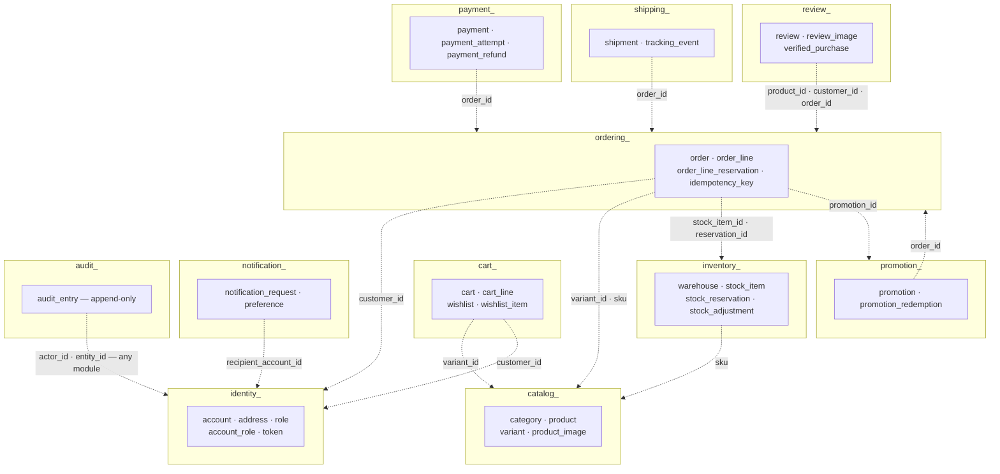
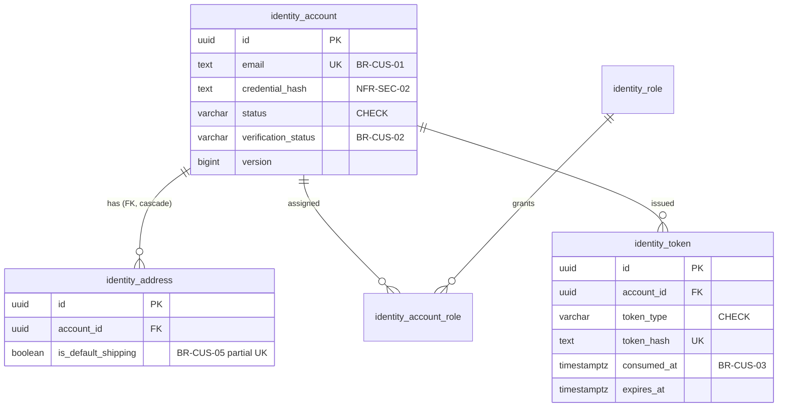
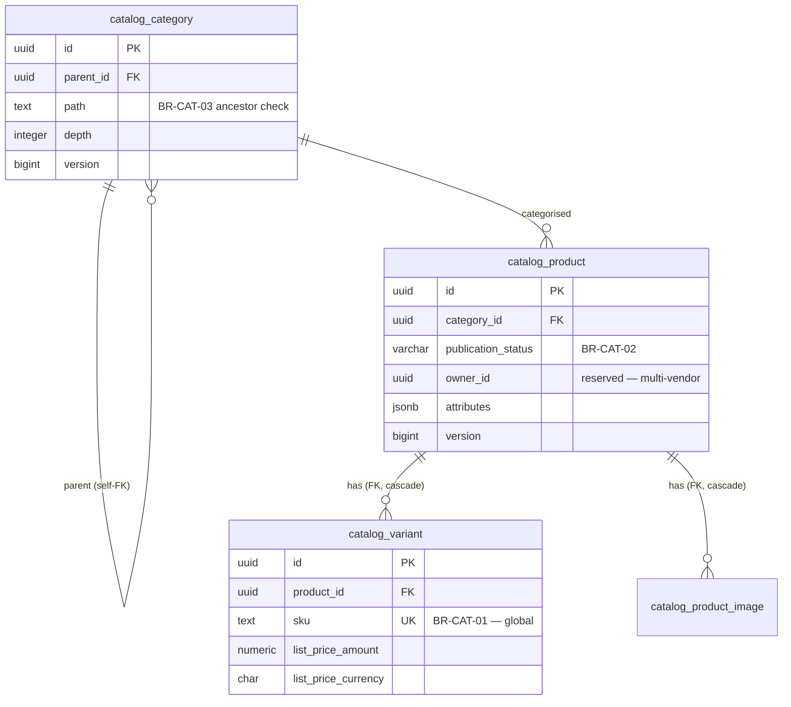
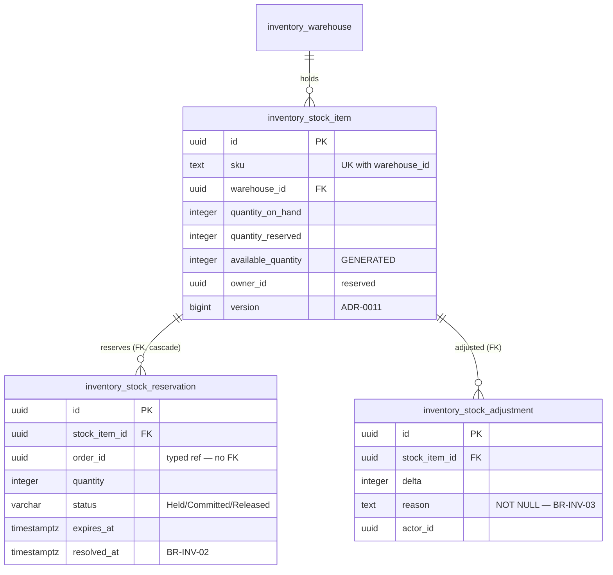
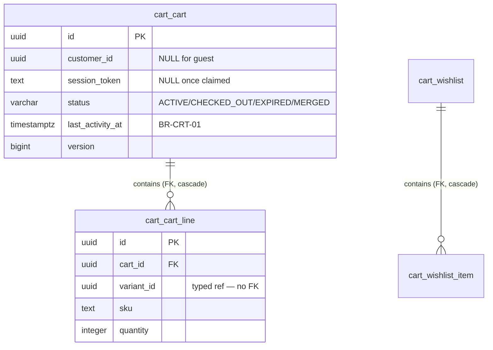
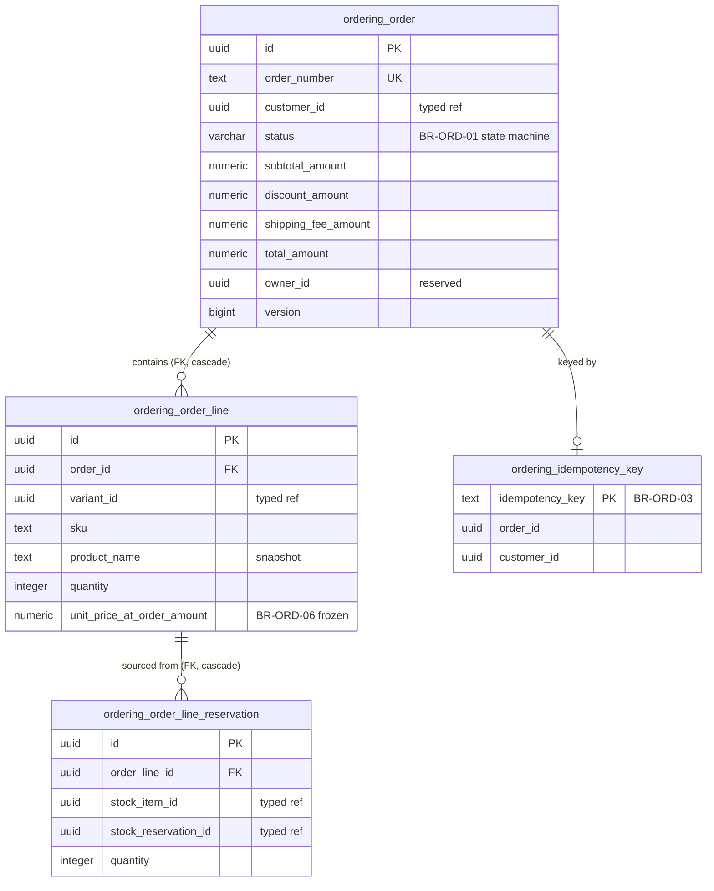
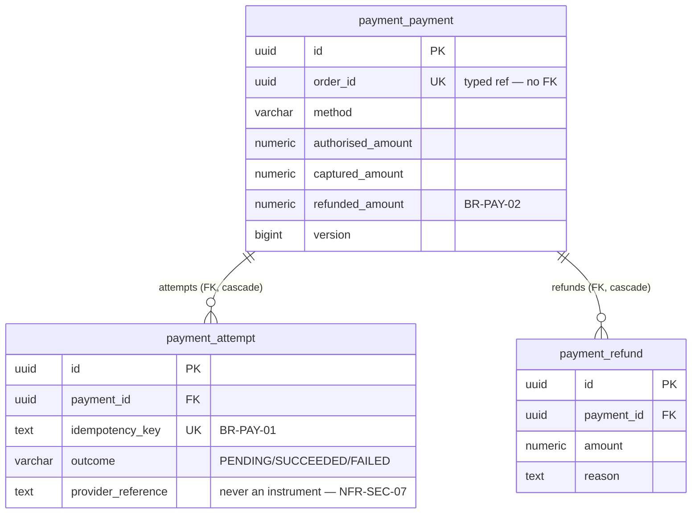
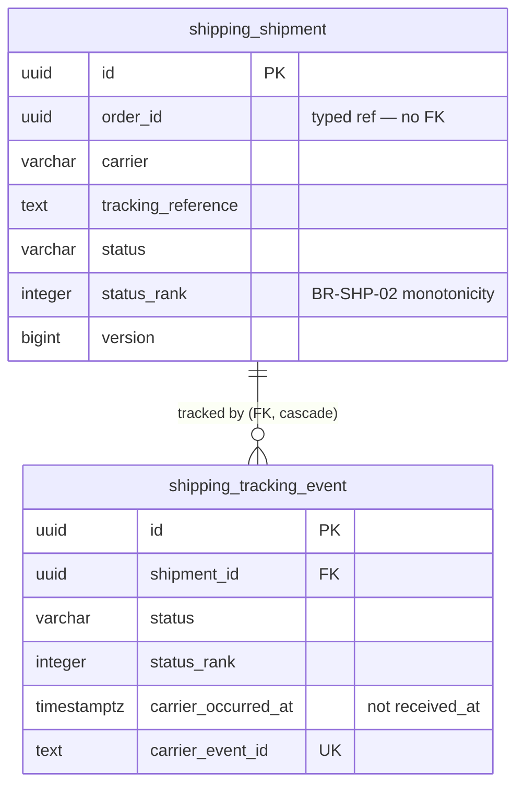
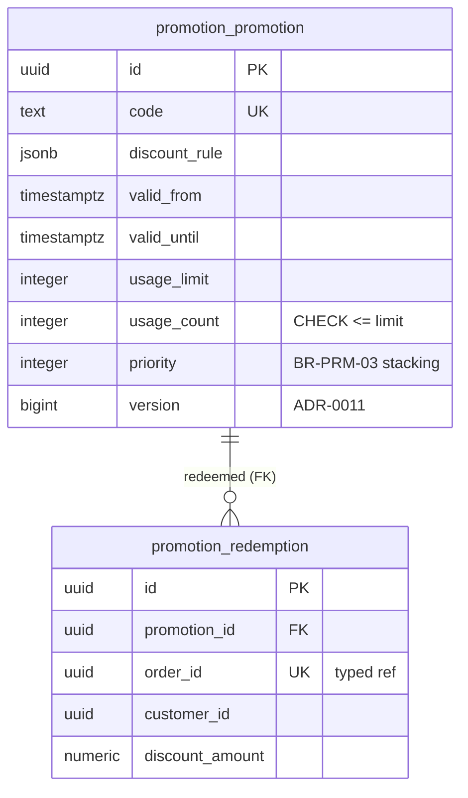
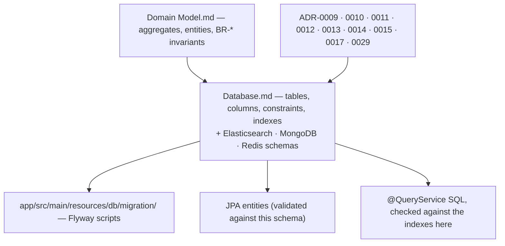

# Database — Enterprise Commerce Platform (ECP)

**Document type:** Backend architecture specification — data model & physical schema
**Status:** Accepted where it renders an existing ADR; **Proposed** for §5 (outbox and consumer-idempotency tables) and §7.3 (Redis key schema), which are decided here for the first time
**Audience:** Backend Engineering, Architecture Review, Database Review
**Related documents:** [Domain Model](./Domain%20Model.md) · [Module Dependency Diagram](./Module%20Dependency%20Diagram.md) · [Integration Contract](../04-shared/Integration%20Contract.md) · [Solution Architecture](../01-system/Solution%20Architecture.md) · [ADR-0009](../01-system/ADR/ADR-0009-postgresql-source-of-truth.md) · [ADR-0010](../01-system/ADR/ADR-0010-jpa-write-model-jdbc-read-models.md) · [ADR-0011](../01-system/ADR/ADR-0011-optimistic-locking-reservation-model.md) · [ADR-0029](../01-system/ADR/ADR-0029-flyway-versioned-schema-migrations.md)

---

## 1. Purpose of This Document

[`Domain Model.md`](./Domain%20Model.md) defines the *logical* model — 12 bounded contexts, their aggregates, entities, value objects, and the `BR-*` invariants each one enforces. The persistence ADRs define the *policies* — one PostgreSQL source of truth ([ADR-0009](../01-system/ADR/ADR-0009-postgresql-source-of-truth.md)), JPA on the write side and JDBC on the read side ([ADR-0010](../01-system/ADR/ADR-0010-jpa-write-model-jdbc-read-models.md)), optimistic locking with an explicit reservation model ([ADR-0011](../01-system/ADR/ADR-0011-optimistic-locking-reservation-model.md)), a transactional outbox ([ADR-0012](../01-system/ADR/ADR-0012-transactional-outbox-and-kafka.md)), Flyway-owned migrations ([ADR-0029](../01-system/ADR/ADR-0029-flyway-versioned-schema-migrations.md)), and Redis/Elasticsearch/MongoDB as strictly derived stores ([ADR-0013](../01-system/ADR/ADR-0013-mongodb-scoped-to-read-models.md)–[ADR-0015](../01-system/ADR/ADR-0015-redis-cache-and-rate-limiting.md)).

Neither defines the **physical shape**. That is this document: which tables exist, with which columns, types, keys, constraints, and indexes; where each global constraint that `Domain Model.md` §7 delegates to "a database unique/check constraint" is actually declared; and what the three derived stores hold.

This matters more here than in a typical system. `Domain Model.md` §7 makes the database — not the application — the enforcement point for five business rules (`BR-CAT-01`, `BR-CUS-01`, `BR-CAT-03`, `BR-REV-02`, `BR-AUD-03`), [ADR-0011](../01-system/ADR/ADR-0011-optimistic-locking-reservation-model.md) makes a version column the mechanism preventing oversell (`BR-INV-01`), [ADR-0017](../01-system/ADR/ADR-0017-append-only-audit-log.md) makes a revoked grant the mechanism guaranteeing audit immutability (`NFR-OBS-02`), and [ADR-0029](../01-system/ADR/ADR-0029-flyway-versioned-schema-migrations.md) states the schema is defined by migration scripts *and nothing else*. Those scripts are written from this document. An omission here is not a documentation gap — it is an unenforced business rule.

### 1.1 What this document does not decide

| Deferred to | Concern |
|---|---|
| Nowhere yet — a **real, open gap** | High availability, backup, and restore for the single PostgreSQL instance. [ADR-0009](../01-system/ADR/ADR-0009-postgresql-source-of-truth.md) §5 names this explicitly: `NFR-AVAIL-01` rests on an instance no record covers. |
| `Backend Architecture.md` | Kafka topic retention, partition counts, replication factor, serialisation format ([ADR-0012](../01-system/ADR/ADR-0012-transactional-outbox-and-kafka.md) §5). |
| [`Deployment Diagram`](../01-system/Deployment%20Diagram.md) §8 | Whether migrations run at application startup or as a pre-start job. |
| Operations | Archival and retention execution for `audit_entry` — [ADR-0017](../01-system/ADR/ADR-0017-append-only-audit-log.md) is explicit that expiry is an operational process, never a delete the platform can perform. |

§11 restates these as open questions rather than letting omission read as settlement.

---

## 2. Schema-Wide Conventions

Stated once here, applied without exception in §4–§5. Each is a rendering of an existing decision, not a new one.

### 2.1 Ownership and boundaries

| Rule | Source | Detail |
|---|---|---|
| **Table prefix is the owning module** | [ADR-0009](../01-system/ADR/ADR-0009-postgresql-source-of-truth.md) §4 | `identity_`, `catalog_`, `inventory_`, `cart_`, `ordering_`, `payment_`, `shipping_`, `promotion_`, `review_`, `notification_`, `audit_`, `reporting_` — exactly the prefixes in [`Module Dependency Diagram.md`](./Module%20Dependency%20Diagram.md) §2. A table's owner is legible from its name, and extraction of a context later is mechanical. |
| **No cross-module foreign keys** | [ADR-0009](../01-system/ADR/ADR-0009-postgresql-source-of-truth.md) §4 | A `REFERENCES` clause never crosses a prefix. Cross-context references are bare typed-ID columns (`customer_id`, `variant_id`, `order_id`) carrying no constraint. This is the storage-layer counterpart of the module boundary [ADR-0006](../01-system/ADR/ADR-0006-spring-modulith-module-boundaries.md) enforces in code. |
| **FKs exist only inside a module, root → child** | [ADR-0010](../01-system/ADR/ADR-0010-jpa-write-model-jdbc-read-models.md) §4 | `ON DELETE CASCADE` from an aggregate root to its child entity tables — this is what makes JPA cascading and "one repository per aggregate root" true in the store as well as in the code. |
| **One database, one schema (`public`), one connection pool** | [ADR-0009](../01-system/ADR/ADR-0009-postgresql-source-of-truth.md) §4 | Option 4 (schema-per-context) was considered and rejected there. The prefix carries ownership instead. |

### 2.2 Types

| Concern | Convention | Why |
|---|---|---|
| Surrogate key | `id UUID PRIMARY KEY` — UUIDv7, generated by the application, time-ordered | Time-ordered UUIDs keep B-tree inserts local, avoiding the index fragmentation random UUIDv4 causes on the highest-insert tables (`ordering_order`, `audit_entry`). Application-generated means an aggregate has its identity before it is persisted, which the domain layer requires and a `SERIAL` cannot give. |
| Business reference | A separate `TEXT` column with a unique index — `order_number`, `sku`, `tracking_reference` | Never overload the primary key with a human-facing meaning. The Integration Contract §6.1 envelope's `aggregateId` is the UUID. |
| Money | **Two columns per amount**: `<name>_amount NUMERIC(19,4) NOT NULL` + `<name>_currency CHAR(3) NOT NULL` | `Solution Architecture.md` §10 requires that a monetary value is never a bare number; the shared-kernel `Money` value object maps to exactly this pair. `NUMERIC`, never `FLOAT`/`DOUBLE` — binary floating point cannot represent a decimal currency amount exactly, and `BR-PAY-02`'s "cumulative refund never exceeds captured" is a comparison that must be exact. |
| Quantity | `INTEGER NOT NULL` with an explicit `CHECK (… >= 0)` | `BR-INV-01`'s non-negativity is a declared constraint, not an assumption. |
| Timestamp | `TIMESTAMPTZ` everywhere, never `TIMESTAMP` | A naive timestamp silently adopts the session time zone. `occurred_at` (when the business fact happened) and `created_at` (when the row was written) are separate columns wherever both matter — Integration Contract §6.1 warns that conflating them computes wrong durations. |
| Enumeration | `VARCHAR(n)` + `CHECK (col IN (…))`, **not** a PostgreSQL `ENUM` type | Adding a value to a PG enum is a DDL change with its own lock and ordering semantics; a `CHECK` is dropped and recreated by an ordinary migration, which is what [ADR-0029](../01-system/ADR/ADR-0029-flyway-versioned-schema-migrations.md)'s expand→migrate→contract rule needs. The constraint is also readable in `\d`, so the legal state set is visible in the store. |
| Open-shaped data | `JSONB` — permitted **only** for `catalog_product.attributes`, `promotion_promotion.discount_rule`, `audit_entry.before_value`/`after_value`, and outbox `payload` | Everywhere else, a column. JSONB is never used for anything a constraint enforces or an index-driven query filters on — that would move an invariant out of the schema's reach, which is the one thing §1 says this document exists to prevent. |
| Free text | `TEXT`, not `VARCHAR(n)`, where there is no business length rule | PostgreSQL stores them identically; an arbitrary length cap is a migration waiting to happen. `VARCHAR(n)` is used only where `n` is a real business or protocol limit (currency code, status value, ISO country). |
| Boolean | `BOOLEAN NOT NULL DEFAULT false` | Never a nullable boolean — three states where the domain has two. |

### 2.3 Columns present on every table

```sql
id           UUID        PRIMARY KEY,
-- … business columns …
created_at   TIMESTAMPTZ NOT NULL DEFAULT now(),
created_by   UUID,                                  -- actor; NULL for Scheduler-triggered rows
updated_at   TIMESTAMPTZ NOT NULL DEFAULT now(),
updated_by   UUID
```

`created_by`/`updated_by` are nullable and hold no FK: the actor is an `identity_account.id`, and a foreign key to it would cross a module prefix (§2.1). Nullability is deliberate — [ADR-0011](../01-system/ADR/ADR-0011-optimistic-locking-reservation-model.md) §4 establishes the Scheduler as a first-class trigger with no human actor, and Integration Contract §6.1 says `actor` is absent for Scheduler-triggered events.

**`version BIGINT NOT NULL DEFAULT 0` is present on aggregate-root tables only** — never on child-entity tables. This is not a stylistic choice: the aggregate root is the concurrency unit ([ADR-0011](../01-system/ADR/ADR-0011-optimistic-locking-reservation-model.md)), and a version on a child would allow two writers to change different children of the same aggregate concurrently, each believing it held the aggregate's invariant. §6.2 lists exactly which tables carry it.

Immutable, append-only tables (`audit_entry`, `shipping_tracking_event`, `inventory_stock_adjustment`, every `*_outbox`) carry `created_at`/`created_by` and **no** `updated_at`/`updated_by` — a row that can never change has no update metadata, and its absence documents the intent.

### 2.4 Naming

| Object | Pattern | Example |
|---|---|---|
| Primary key | `pk_<table>` | `pk_ordering_order` |
| Foreign key | `fk_<table>_<column>` | `fk_ordering_order_line_order_id` |
| Unique constraint / index | `ux_<table>_<columns>` | `ux_catalog_variant_sku` |
| Non-unique index | `ix_<table>_<columns>` | `ix_ordering_order_customer_id_created_at` |
| Check constraint | `ck_<table>_<rule>` | `ck_inventory_stock_item_reserved_le_on_hand` |

Constraint names are explicit rather than generated, because a constraint-violation error is surfaced to the application as a name, and the code that translates `ux_catalog_variant_sku` into the `BR-CAT-01` error code in [`Integration Contract.md`](../04-shared/Integration%20Contract.md) §4 needs that name to be stable.

---

## 3. Schema Overview

The whole schema, at module granularity. Solid arrows are real foreign keys; dashed arrows are typed-ID references carrying no database constraint (§2.1).



Two observations this diagram is drawn to make:

1. **Every cross-module edge is dashed.** There is not one solid arrow crossing a subgraph boundary, which is [ADR-0009](../01-system/ADR/ADR-0009-postgresql-source-of-truth.md) §4's no-cross-module-FK rule made visible. The cost is real and accepted there: an `ordering_order_line` can reference a `catalog_variant` row that has been deleted. `BR-ORD-06` freezes the price and product description onto the order line precisely so that this does not matter.
2. **The dependency directions here do not match [`Module Dependency Diagram.md`](./Module%20Dependency%20Diagram.md) §3.** `payment` has no compile-time dependency on `ordering` at all — it learns about orders only through Kafka — yet `payment_payment.order_id` exists. A stored identifier is not a dependency: it is a value the module received in an event payload. Conflating the two is how a schema quietly re-couples modules the build has decoupled.

---

## 4. Per-Context Physical Schema

One subsection per bounded context, in [`Domain Model.md`](./Domain%20Model.md) §4's order. Each carries the same four blocks: an ER diagram, the DDL, an index table where every index is justified by a named query ([ADR-0009](../01-system/ADR/ADR-0009-postgresql-source-of-truth.md) §4 — *"unused indexes are removed; they are write-path cost"*), and a `BR-*` enforcement table.

Detail in the *prose* is proportional to [`Domain Model.md`](./Domain%20Model.md) §7's subdomain classification; the *DDL* is complete for all twelve, because a Generic subdomain still needs a schema that exists.

### 4.1 Identity & Access — `identity_`

Aggregate: `Account` (root), with `Address` as a child entity ([`Domain Model.md`](./Domain%20Model.md) §8.1).



```sql
CREATE TABLE identity_account (
    id                   UUID        NOT NULL,
    email                TEXT        NOT NULL,
    credential_hash      TEXT        NOT NULL,
    display_name         TEXT,
    status               VARCHAR(16) NOT NULL DEFAULT 'ACTIVE',
    verification_status  VARCHAR(16) NOT NULL DEFAULT 'UNVERIFIED',
    verified_at          TIMESTAMPTZ,
    last_login_at        TIMESTAMPTZ,
    failed_login_count   INTEGER     NOT NULL DEFAULT 0,
    version              BIGINT      NOT NULL DEFAULT 0,
    created_at           TIMESTAMPTZ NOT NULL DEFAULT now(),
    created_by           UUID,
    updated_at           TIMESTAMPTZ NOT NULL DEFAULT now(),
    updated_by           UUID,
    CONSTRAINT pk_identity_account PRIMARY KEY (id),
    CONSTRAINT ck_identity_account_status
        CHECK (status IN ('ACTIVE', 'SUSPENDED', 'CLOSED')),
    CONSTRAINT ck_identity_account_verification_status
        CHECK (verification_status IN ('UNVERIFIED', 'VERIFIED')),
    CONSTRAINT ck_identity_account_failed_login_count
        CHECK (failed_login_count >= 0)
);

-- BR-CUS-01: email identifies at most one account.
-- Expression index, not a plain UNIQUE: email equality is case-insensitive in
-- every use case that compares one, so uniqueness must be too, or two accounts
-- differing only in case defeat the rule the constraint exists to enforce.
CREATE UNIQUE INDEX ux_identity_account_email ON identity_account (lower(email));

CREATE TABLE identity_address (
    id                   UUID        NOT NULL,
    account_id           UUID        NOT NULL,
    label                TEXT,
    recipient_name       TEXT        NOT NULL,
    line1                TEXT        NOT NULL,
    line2                TEXT,
    city                 TEXT        NOT NULL,
    region               TEXT,
    postal_code          TEXT        NOT NULL,
    country_code         CHAR(2)     NOT NULL,
    phone                TEXT,
    is_default_shipping  BOOLEAN     NOT NULL DEFAULT false,
    is_default_billing   BOOLEAN     NOT NULL DEFAULT false,
    created_at           TIMESTAMPTZ NOT NULL DEFAULT now(),
    created_by           UUID,
    updated_at           TIMESTAMPTZ NOT NULL DEFAULT now(),
    updated_by           UUID,
    CONSTRAINT pk_identity_address PRIMARY KEY (id),
    CONSTRAINT fk_identity_address_account_id
        FOREIGN KEY (account_id) REFERENCES identity_account (id) ON DELETE CASCADE
);

-- BR-CUS-05: at most one default shipping address per account.
-- A partial unique index expresses "at most one true per account" directly;
-- a plain UNIQUE (account_id, is_default_shipping) would instead forbid a
-- second *non*-default address, which is not the rule.
CREATE UNIQUE INDEX ux_identity_address_default_shipping
    ON identity_address (account_id) WHERE is_default_shipping;
CREATE UNIQUE INDEX ux_identity_address_default_billing
    ON identity_address (account_id) WHERE is_default_billing;
CREATE INDEX ix_identity_address_account_id ON identity_address (account_id);

CREATE TABLE identity_role (
    id          UUID        NOT NULL,
    code        VARCHAR(32) NOT NULL,
    description TEXT,
    created_at  TIMESTAMPTZ NOT NULL DEFAULT now(),
    created_by  UUID,
    updated_at  TIMESTAMPTZ NOT NULL DEFAULT now(),
    updated_by  UUID,
    CONSTRAINT pk_identity_role PRIMARY KEY (id),
    CONSTRAINT ux_identity_role_code UNIQUE (code),
    CONSTRAINT ck_identity_role_code CHECK (code IN
        ('GUEST', 'CUSTOMER', 'STAFF', 'WAREHOUSE_OPERATOR',
         'CUSTOMER_SUPPORT', 'ADMINISTRATOR'))
);

CREATE TABLE identity_account_role (
    account_id  UUID        NOT NULL,
    role_id     UUID        NOT NULL,
    granted_at  TIMESTAMPTZ NOT NULL DEFAULT now(),
    granted_by  UUID,
    CONSTRAINT pk_identity_account_role PRIMARY KEY (account_id, role_id),
    CONSTRAINT fk_identity_account_role_account_id
        FOREIGN KEY (account_id) REFERENCES identity_account (id) ON DELETE CASCADE,
    CONSTRAINT fk_identity_account_role_role_id
        FOREIGN KEY (role_id) REFERENCES identity_role (id)
);
CREATE INDEX ix_identity_account_role_role_id ON identity_account_role (role_id);

CREATE TABLE identity_token (
    id           UUID        NOT NULL,
    account_id   UUID        NOT NULL,
    token_type   VARCHAR(24) NOT NULL,
    token_hash   TEXT        NOT NULL,
    issued_at    TIMESTAMPTZ NOT NULL DEFAULT now(),
    expires_at   TIMESTAMPTZ NOT NULL,
    consumed_at  TIMESTAMPTZ,
    replaced_by  UUID,
    created_at   TIMESTAMPTZ NOT NULL DEFAULT now(),
    created_by   UUID,
    CONSTRAINT pk_identity_token PRIMARY KEY (id),
    CONSTRAINT fk_identity_token_account_id
        FOREIGN KEY (account_id) REFERENCES identity_account (id) ON DELETE CASCADE,
    CONSTRAINT fk_identity_token_replaced_by
        FOREIGN KEY (replaced_by) REFERENCES identity_token (id),
    CONSTRAINT ck_identity_token_type
        CHECK (token_type IN ('EMAIL_VERIFICATION', 'PASSWORD_RESET', 'REFRESH')),
    CONSTRAINT ck_identity_token_expiry CHECK (expires_at > issued_at)
);
CREATE UNIQUE INDEX ux_identity_token_hash ON identity_token (token_hash);
CREATE INDEX ix_identity_token_account_id_type
    ON identity_token (account_id, token_type) WHERE consumed_at IS NULL;
```

**Two columns that are deliberately hashes, not values.** `credential_hash` holds the output of a salted, adaptive one-way function and nothing else (`NFR-SEC-02`). `identity_token.token_hash` holds a hash of the token, not the token — a leaked database backup must not yield usable refresh tokens. Both are `TEXT` because the algorithm's output length is a function of the algorithm, and pinning a `VARCHAR(60)` to today's bcrypt makes tomorrow's argon2 a schema migration.

**`replaced_by` is what makes refresh rotation detectable.** `NFR-SEC-03` requires that reuse of a consumed refresh token invalidates the session. A consumed token that points at its successor lets the application distinguish "this token was rotated normally" from "this consumed token is being presented again," which a boolean `consumed` flag cannot.

| Index | Query it serves | Target |
|---|---|---|
| `ux_identity_account_email` | Login and registration lookup by email | `BR-CUS-01` enforcement + login latency |
| `ux_identity_address_default_shipping` | Constraint only, never queried | `BR-CUS-05` |
| `ix_identity_address_account_id` | "My addresses" on the account page | `NFR-PERF-01` |
| `ix_identity_account_role_role_id` | Administrator count for `BR-AUD-03`; role-scoped admin listings | `BR-AUD-03` |
| `ux_identity_token_hash` | Token presentation on verify / reset / refresh — every authenticated request path | `NFR-PERF-02` |
| `ix_identity_token_account_id_type` | Active-token lookup and revoke-all-on-reuse; partial, because consumed tokens are never queried by this path | `NFR-SEC-03` |

| Rule | Enforcement point |
|---|---|
| `BR-CUS-01` | `ux_identity_account_email` — the constraint, not an application pre-check ([`Domain Model.md`](./Domain%20Model.md) §7) |
| `BR-CUS-02` | `identity_account.verification_status`, read by Ordering's and Review's application services through Identity's public API |
| `BR-CUS-03` | `identity_token.consumed_at` + `expires_at` + `ck_identity_token_expiry`; single-use is the `consumed_at` write inside the consuming transaction |
| `BR-CUS-04` | Application service — no schema surface; the constant-shape failure response is deliberately not derivable from a query |
| `BR-CUS-05` | `ux_identity_address_default_shipping` |
| `BR-AUD-03` | See §6.3 — a count over `identity_account_role`, held under the transaction, not a declarative constraint. The one global rule of the five that a `CHECK` cannot express. |

### 4.2 Catalog — `catalog_`

Aggregates: `Product` (root) with `Variant` as a child entity, and `Category` as its own root ([`Domain Model.md`](./Domain%20Model.md) §8.2).



```sql
CREATE TABLE catalog_category (
    id          UUID        NOT NULL,
    parent_id   UUID,
    name        TEXT        NOT NULL,
    slug        TEXT        NOT NULL,
    path        TEXT        NOT NULL,
    depth       INTEGER     NOT NULL DEFAULT 0,
    sort_order  INTEGER     NOT NULL DEFAULT 0,
    version     BIGINT      NOT NULL DEFAULT 0,
    created_at  TIMESTAMPTZ NOT NULL DEFAULT now(),
    created_by  UUID,
    updated_at  TIMESTAMPTZ NOT NULL DEFAULT now(),
    updated_by  UUID,
    CONSTRAINT pk_catalog_category PRIMARY KEY (id),
    CONSTRAINT fk_catalog_category_parent_id
        FOREIGN KEY (parent_id) REFERENCES catalog_category (id),
    CONSTRAINT ux_catalog_category_slug UNIQUE (slug),
    CONSTRAINT ck_catalog_category_not_own_parent CHECK (parent_id IS NULL OR parent_id <> id),
    CONSTRAINT ck_catalog_category_depth CHECK (depth >= 0)
);
CREATE INDEX ix_catalog_category_parent_id ON catalog_category (parent_id);
-- BR-CAT-03: a category may not be its own ancestor. `path` is the materialised
-- ancestor chain ('/root/apparel/shirts/'); the pre-check is
-- `NOT new_path LIKE old_path || '%'`, and the index makes both that check and
-- subtree reads a prefix scan rather than a recursive walk.
CREATE INDEX ix_catalog_category_path ON catalog_category (path text_pattern_ops);

CREATE TABLE catalog_product (
    id                  UUID        NOT NULL,
    category_id         UUID        NOT NULL,
    owner_id            UUID,
    name                TEXT        NOT NULL,
    slug                TEXT        NOT NULL,
    description         TEXT,
    brand               TEXT,
    publication_status  VARCHAR(16) NOT NULL DEFAULT 'DRAFT',
    published_at        TIMESTAMPTZ,
    attributes          JSONB       NOT NULL DEFAULT '{}'::jsonb,
    average_rating      NUMERIC(3,2),
    review_count        INTEGER     NOT NULL DEFAULT 0,
    version             BIGINT      NOT NULL DEFAULT 0,
    created_at          TIMESTAMPTZ NOT NULL DEFAULT now(),
    created_by          UUID,
    updated_at          TIMESTAMPTZ NOT NULL DEFAULT now(),
    updated_by          UUID,
    CONSTRAINT pk_catalog_product PRIMARY KEY (id),
    CONSTRAINT fk_catalog_product_category_id
        FOREIGN KEY (category_id) REFERENCES catalog_category (id),
    CONSTRAINT ux_catalog_product_slug UNIQUE (slug),
    CONSTRAINT ck_catalog_product_publication_status
        CHECK (publication_status IN ('DRAFT', 'PUBLISHED', 'UNPUBLISHED', 'DISCONTINUED')),
    CONSTRAINT ck_catalog_product_review_count CHECK (review_count >= 0),
    CONSTRAINT ck_catalog_product_average_rating
        CHECK (average_rating IS NULL OR (average_rating >= 1 AND average_rating <= 5))
);
CREATE INDEX ix_catalog_product_category_id ON catalog_product (category_id)
    WHERE publication_status = 'PUBLISHED';

CREATE TABLE catalog_variant (
    id                   UUID        NOT NULL,
    product_id           UUID        NOT NULL,
    sku                  TEXT        NOT NULL,
    name                 TEXT        NOT NULL,
    list_price_amount    NUMERIC(19,4) NOT NULL,
    list_price_currency  CHAR(3)     NOT NULL,
    options              JSONB       NOT NULL DEFAULT '{}'::jsonb,
    weight_grams         INTEGER,
    is_active            BOOLEAN     NOT NULL DEFAULT true,
    created_at           TIMESTAMPTZ NOT NULL DEFAULT now(),
    created_by           UUID,
    updated_at           TIMESTAMPTZ NOT NULL DEFAULT now(),
    updated_by           UUID,
    CONSTRAINT pk_catalog_variant PRIMARY KEY (id),
    CONSTRAINT fk_catalog_variant_product_id
        FOREIGN KEY (product_id) REFERENCES catalog_product (id) ON DELETE CASCADE,
    -- BR-CAT-01: a SKU identifies at most one purchasable unit across the
    -- entire catalog. Table-wide, not scoped to product_id — scoping it to the
    -- product would permit the same SKU under two products, which is the exact
    -- collision the rule forbids.
    CONSTRAINT ux_catalog_variant_sku UNIQUE (sku),
    CONSTRAINT ck_catalog_variant_list_price CHECK (list_price_amount >= 0),
    CONSTRAINT ck_catalog_variant_weight CHECK (weight_grams IS NULL OR weight_grams >= 0)
);
CREATE INDEX ix_catalog_variant_product_id ON catalog_variant (product_id);

CREATE TABLE catalog_product_image (
    id          UUID        NOT NULL,
    product_id  UUID        NOT NULL,
    url         TEXT        NOT NULL,
    alt_text    TEXT,
    sort_order  INTEGER     NOT NULL DEFAULT 0,
    created_at  TIMESTAMPTZ NOT NULL DEFAULT now(),
    created_by  UUID,
    updated_at  TIMESTAMPTZ NOT NULL DEFAULT now(),
    updated_by  UUID,
    CONSTRAINT pk_catalog_product_image PRIMARY KEY (id),
    CONSTRAINT fk_catalog_product_image_product_id
        FOREIGN KEY (product_id) REFERENCES catalog_product (id) ON DELETE CASCADE
);
CREATE INDEX ix_catalog_product_image_product_id ON catalog_product_image (product_id);
```

**`average_rating` and `review_count` are a denormalisation, and they are the one place in this schema where a module stores data another module owns.** They are written by Catalog's own `ReviewPublished`/`ReviewModerated` event handler ([`Integration Contract.md`](../04-shared/Integration%20Contract.md) §7), never by Review, and they are non-authoritative — the authoritative rating data is `review_review`. Their justification is `NFR-PERF-01`: a product list page showing ratings for 24 products cannot issue a cross-module aggregate per product. Both columns are fully rebuildable from Kafka, which is [ADR-0008](../01-system/ADR/ADR-0008-cqrs-command-query-separation.md)'s test for whether a projection is a projection or an accidental second source of truth.

**`owner_id` is reserved and unused.** [`Domain Model.md`](./Domain%20Model.md) §7's multi-vendor forward-compatibility commitment, stated in the schema so it is not silently forgotten. Nullable, no FK, no index until there is a query.

**Search is not here.** Keyword search, faceting, ranking, and autocomplete are served by Elasticsearch (§7.1), never by a `LIKE` scan on these tables. No full-text index is defined on `catalog_product` deliberately — two search implementations is one too many, and [ADR-0014](../01-system/ADR/ADR-0014-elasticsearch-search-read-model.md) already chose which one.

| Index | Query it serves | Target |
|---|---|---|
| `ix_catalog_category_path` | Subtree reads; `BR-CAT-03` ancestor pre-check | `BR-CAT-03`, `NFR-PERF-01` |
| `ix_catalog_product_category_id` | Category browse; **partial on `PUBLISHED`**, because browse never returns anything else (`BR-CAT-02`) and the index stays small as drafts and discontinued rows accumulate | `NFR-PERF-01` (300 ms p95 at `NFR-SCAL-01`'s 10,000 products) |
| `ux_catalog_variant_sku` | `BR-CAT-01` enforcement; SKU lookup from Inventory and order lines | `BR-CAT-01` |
| `ix_catalog_variant_product_id` | Product detail page — variants of a product | `NFR-PERF-01` |

| Rule | Enforcement point |
|---|---|
| `BR-CAT-01` | `ux_catalog_variant_sku` — table-wide unique constraint |
| `BR-CAT-02` | `catalog_product.publication_status` + the partial browse index; orders never re-read this table (`BR-ORD-06`), so an unpublished product stays visible on existing orders by construction |
| `BR-CAT-03` | `ck_catalog_category_not_own_parent` (direct self-reference) + a `path`-prefix pre-check in a domain service for the transitive case; non-empty-category deletion is blocked by `fk_catalog_product_category_id` having **no** `ON DELETE` action — the delete fails |
| `BR-SCH-01` | Query scoping in the Elasticsearch read model (§7.1), not a table constraint |

### 4.3 Inventory — `inventory_` (Core)

Aggregate: `StockItem` (root, identified by SKU + warehouse) with `StockReservation` as a child entity ([`Domain Model.md`](./Domain%20Model.md) §8.3). This is the schema the platform's highest-emphasized business risk rests on.



```sql
CREATE TABLE inventory_warehouse (
    id           UUID        NOT NULL,
    code         VARCHAR(32) NOT NULL,
    name         TEXT        NOT NULL,
    country_code CHAR(2)     NOT NULL,
    is_active    BOOLEAN     NOT NULL DEFAULT true,
    created_at   TIMESTAMPTZ NOT NULL DEFAULT now(),
    created_by   UUID,
    updated_at   TIMESTAMPTZ NOT NULL DEFAULT now(),
    updated_by   UUID,
    CONSTRAINT pk_inventory_warehouse PRIMARY KEY (id),
    CONSTRAINT ux_inventory_warehouse_code UNIQUE (code)
);

CREATE TABLE inventory_stock_item (
    id                  UUID        NOT NULL,
    sku                 TEXT        NOT NULL,
    warehouse_id        UUID        NOT NULL,
    owner_id            UUID,
    quantity_on_hand    INTEGER     NOT NULL DEFAULT 0,
    quantity_reserved   INTEGER     NOT NULL DEFAULT 0,
    -- Derived, never stored independently (Domain Model §6, §8.3). A GENERATED
    -- column cannot be written by any statement, so no code path — present or
    -- future, application or manual — can put availability out of step with the
    -- two counters it is defined from. This is BR-INV-01 held by construction
    -- rather than by discipline.
    available_quantity  INTEGER     GENERATED ALWAYS AS (quantity_on_hand - quantity_reserved) STORED,
    reorder_threshold   INTEGER,
    version             BIGINT      NOT NULL DEFAULT 0,
    created_at          TIMESTAMPTZ NOT NULL DEFAULT now(),
    created_by          UUID,
    updated_at          TIMESTAMPTZ NOT NULL DEFAULT now(),
    updated_by          UUID,
    CONSTRAINT pk_inventory_stock_item PRIMARY KEY (id),
    CONSTRAINT fk_inventory_stock_item_warehouse_id
        FOREIGN KEY (warehouse_id) REFERENCES inventory_warehouse (id),
    -- Aggregate identity is (Sku, WarehouseId) — Domain Model §8.3.
    CONSTRAINT ux_inventory_stock_item_sku_warehouse UNIQUE (sku, warehouse_id),
    CONSTRAINT ck_inventory_stock_item_on_hand CHECK (quantity_on_hand >= 0),
    CONSTRAINT ck_inventory_stock_item_reserved CHECK (quantity_reserved >= 0),
    -- BR-INV-01: available stock is never negative. The last line of defence
    -- behind the version check — if optimistic locking were ever bypassed, this
    -- constraint still refuses the oversold row.
    CONSTRAINT ck_inventory_stock_item_reserved_le_on_hand
        CHECK (quantity_reserved <= quantity_on_hand)
);
CREATE INDEX ix_inventory_stock_item_sku ON inventory_stock_item (sku);
CREATE INDEX ix_inventory_stock_item_low_stock
    ON inventory_stock_item (warehouse_id, available_quantity)
    WHERE reorder_threshold IS NOT NULL;

CREATE TABLE inventory_stock_reservation (
    id             UUID        NOT NULL,
    stock_item_id  UUID        NOT NULL,
    order_id       UUID        NOT NULL,
    order_line_id  UUID        NOT NULL,
    quantity       INTEGER     NOT NULL,
    status         VARCHAR(16) NOT NULL DEFAULT 'HELD',
    expires_at     TIMESTAMPTZ NOT NULL,
    resolved_at    TIMESTAMPTZ,
    created_at     TIMESTAMPTZ NOT NULL DEFAULT now(),
    created_by     UUID,
    updated_at     TIMESTAMPTZ NOT NULL DEFAULT now(),
    updated_by     UUID,
    CONSTRAINT pk_inventory_stock_reservation PRIMARY KEY (id),
    CONSTRAINT fk_inventory_stock_reservation_stock_item_id
        FOREIGN KEY (stock_item_id) REFERENCES inventory_stock_item (id) ON DELETE CASCADE,
    CONSTRAINT ck_inventory_stock_reservation_quantity CHECK (quantity > 0),
    CONSTRAINT ck_inventory_stock_reservation_status
        CHECK (status IN ('HELD', 'COMMITTED', 'RELEASED')),
    -- BR-INV-02: a reservation resolves exactly once — committed or released,
    -- never both and never neither. Terminal status and resolution timestamp
    -- are forced to agree, so a half-applied transition cannot be persisted.
    CONSTRAINT ck_inventory_stock_reservation_resolution
        CHECK ((status = 'HELD' AND resolved_at IS NULL)
            OR (status <> 'HELD' AND resolved_at IS NOT NULL))
);
CREATE INDEX ix_inventory_stock_reservation_order_id
    ON inventory_stock_reservation (order_id);
CREATE INDEX ix_inventory_stock_reservation_expiry
    ON inventory_stock_reservation (expires_at) WHERE status = 'HELD';

CREATE TABLE inventory_stock_adjustment (
    id             UUID        NOT NULL,
    stock_item_id  UUID        NOT NULL,
    delta          INTEGER     NOT NULL,
    reason_code    VARCHAR(32) NOT NULL,
    reason         TEXT        NOT NULL,
    actor_id       UUID        NOT NULL,
    occurred_at    TIMESTAMPTZ NOT NULL DEFAULT now(),
    created_at     TIMESTAMPTZ NOT NULL DEFAULT now(),
    created_by     UUID,
    CONSTRAINT pk_inventory_stock_adjustment PRIMARY KEY (id),
    CONSTRAINT fk_inventory_stock_adjustment_stock_item_id
        FOREIGN KEY (stock_item_id) REFERENCES inventory_stock_item (id),
    CONSTRAINT ck_inventory_stock_adjustment_delta CHECK (delta <> 0)
);
CREATE INDEX ix_inventory_stock_adjustment_stock_item_id
    ON inventory_stock_adjustment (stock_item_id, occurred_at DESC);
```

**Why `available_quantity` is a `GENERATED … STORED` column and not a view or an application-computed value.** [`Domain Model.md`](./Domain%20Model.md) §6 says availability is "a derived value, never stored independently, so it cannot drift out of sync with its inputs." A stored generated column is the only option that satisfies both halves: it is physically present, so `ix_inventory_stock_item_low_stock` can index it and a JDBC read model can select it without recomputation, and it is unwritable, so the drift the rule forbids is impossible rather than merely discouraged.

**Reservations are per `(SKU, Warehouse)`, and that is the whole multi-warehouse design.** An order line drawing from three warehouses produces three `inventory_stock_reservation` rows against three different `inventory_stock_item` rows, each with its own independent `status`. Partial commit and partial release are ordinary outcomes ([`Domain Model.md`](./Domain%20Model.md) §8.3, `UC-INV-02` A3). There is no table representing "the reservation for this order line as a whole" — that concept lives on the Ordering side as a set of references (§4.5), and giving it a table here would create a cross-warehouse entity with invariants nothing needs.

**`order_id` and `order_line_id` carry no foreign key.** They cross into Ordering's prefix (§2.1). The absence is load-bearing in the other direction too: [`Module Dependency Diagram.md`](./Module%20Dependency%20Diagram.md) §3.1 states a Core context must not learn that Ordering exists, and a foreign key would be exactly that knowledge, declared in the store.

| Index | Query it serves | Target |
|---|---|---|
| `ux_inventory_stock_item_sku_warehouse` | Aggregate lookup on the reservation path — **the single hottest lookup in the purchase flow** | `BR-INV-01`, `NFR-PERF-02` |
| `ix_inventory_stock_item_sku` | Cross-warehouse availability for one SKU (product page, cart advisory check) | `BR-CRT-02`, `NFR-PERF-01` |
| `ix_inventory_stock_item_low_stock` | Warehouse low-stock report; partial, since rows without a threshold are never in it | `FR-INV-*` reorder alerting |
| `ix_inventory_stock_reservation_order_id` | Commit/release all reservations for an order on payment or cancellation | `NFR-PERF-02` |
| `ix_inventory_stock_reservation_expiry` | The Scheduler's expiry sweep. **Partial on `HELD`** — the sweep never looks at resolved rows, and without the partial clause this index would grow with every order ever placed while remaining useful only for the few thousand rows currently held | `BR-INV-02`, `StockReservationExpired` |
| `ix_inventory_stock_adjustment_stock_item_id` | Adjustment history for an item, newest first | `BR-INV-03`, `NFR-OBS-01` |

| Rule | Enforcement point |
|---|---|
| `BR-INV-01` | `inventory_stock_item.version` (optimistic locking, §6.1) as the primary mechanism; `ck_inventory_stock_item_reserved_le_on_hand` and the `GENERATED` availability column as construction-level backstops |
| `BR-INV-02` | `ck_inventory_stock_reservation_resolution` — terminal status and `resolved_at` cannot disagree |
| `BR-INV-03` | `inventory_stock_adjustment.reason NOT NULL` + `actor_id NOT NULL`; the row is the record, and the `StockAdjusted` event carries it to Audit |

### 4.4 Cart & Wishlist — `cart_`

Aggregates: `Cart` (root) with `CartLine`, and `Wishlist` (root) with `WishlistItem` ([`Domain Model.md`](./Domain%20Model.md) §8.4).



```sql
CREATE TABLE cart_cart (
    id                UUID        NOT NULL,
    customer_id       UUID,
    session_token     TEXT,
    status            VARCHAR(16) NOT NULL DEFAULT 'ACTIVE',
    last_activity_at  TIMESTAMPTZ NOT NULL DEFAULT now(),
    expires_at        TIMESTAMPTZ NOT NULL,
    merged_into_id    UUID,
    version           BIGINT      NOT NULL DEFAULT 0,
    created_at        TIMESTAMPTZ NOT NULL DEFAULT now(),
    created_by        UUID,
    updated_at        TIMESTAMPTZ NOT NULL DEFAULT now(),
    updated_by        UUID,
    CONSTRAINT pk_cart_cart PRIMARY KEY (id),
    CONSTRAINT fk_cart_cart_merged_into_id
        FOREIGN KEY (merged_into_id) REFERENCES cart_cart (id),
    CONSTRAINT ck_cart_cart_status
        CHECK (status IN ('ACTIVE', 'CHECKED_OUT', 'EXPIRED', 'MERGED')),
    -- A cart belongs to a customer or to a guest session, never to neither.
    CONSTRAINT ck_cart_cart_owner
        CHECK (customer_id IS NOT NULL OR session_token IS NOT NULL),
    CONSTRAINT ck_cart_cart_merged
        CHECK ((status = 'MERGED') = (merged_into_id IS NOT NULL))
);
-- One active cart per customer; one per guest session. Partial, because an
-- expired or checked-out cart must not block a new one.
CREATE UNIQUE INDEX ux_cart_cart_customer_active
    ON cart_cart (customer_id) WHERE status = 'ACTIVE' AND customer_id IS NOT NULL;
CREATE UNIQUE INDEX ux_cart_cart_session_active
    ON cart_cart (session_token) WHERE status = 'ACTIVE' AND session_token IS NOT NULL;
CREATE INDEX ix_cart_cart_expiry ON cart_cart (expires_at) WHERE status = 'ACTIVE';

CREATE TABLE cart_cart_line (
    id          UUID        NOT NULL,
    cart_id     UUID        NOT NULL,
    variant_id  UUID        NOT NULL,
    sku         TEXT        NOT NULL,
    quantity    INTEGER     NOT NULL,
    added_at    TIMESTAMPTZ NOT NULL DEFAULT now(),
    created_at  TIMESTAMPTZ NOT NULL DEFAULT now(),
    created_by  UUID,
    updated_at  TIMESTAMPTZ NOT NULL DEFAULT now(),
    updated_by  UUID,
    CONSTRAINT pk_cart_cart_line PRIMARY KEY (id),
    CONSTRAINT fk_cart_cart_line_cart_id
        FOREIGN KEY (cart_id) REFERENCES cart_cart (id) ON DELETE CASCADE,
    CONSTRAINT ux_cart_cart_line_cart_variant UNIQUE (cart_id, variant_id),
    CONSTRAINT ck_cart_cart_line_quantity CHECK (quantity > 0)
);

CREATE TABLE cart_wishlist (
    id           UUID        NOT NULL,
    customer_id  UUID        NOT NULL,
    name         TEXT        NOT NULL DEFAULT 'Default',
    version      BIGINT      NOT NULL DEFAULT 0,
    created_at   TIMESTAMPTZ NOT NULL DEFAULT now(),
    created_by   UUID,
    updated_at   TIMESTAMPTZ NOT NULL DEFAULT now(),
    updated_by   UUID,
    CONSTRAINT pk_cart_wishlist PRIMARY KEY (id),
    CONSTRAINT ux_cart_wishlist_customer_name UNIQUE (customer_id, name)
);

CREATE TABLE cart_wishlist_item (
    id           UUID        NOT NULL,
    wishlist_id  UUID        NOT NULL,
    variant_id   UUID        NOT NULL,
    added_at     TIMESTAMPTZ NOT NULL DEFAULT now(),
    created_at   TIMESTAMPTZ NOT NULL DEFAULT now(),
    created_by   UUID,
    updated_at   TIMESTAMPTZ NOT NULL DEFAULT now(),
    updated_by   UUID,
    CONSTRAINT pk_cart_wishlist_item PRIMARY KEY (id),
    CONSTRAINT fk_cart_wishlist_item_wishlist_id
        FOREIGN KEY (wishlist_id) REFERENCES cart_wishlist (id) ON DELETE CASCADE,
    CONSTRAINT ux_cart_wishlist_item_wishlist_variant UNIQUE (wishlist_id, variant_id)
);
```

**`cart_cart_line` has no price column, and its absence is the enforcement of `BR-CRT-04`.** [`Domain Model.md`](./Domain%20Model.md) §6 is explicit: a cart line is never a priced object, and the price is looked up live from Catalog every time the cart is displayed. A nullable `unit_price_amount` "for convenience" would make the rule a convention that the next developer can innocently break; a column that does not exist cannot be populated. The same reasoning appears in [`Integration Contract.md`](../04-shared/Integration%20Contract.md) §7, where `CartCheckedOut` carries unpriced lines.

**`merged_into_id` is what makes `BR-CRT-03` auditable.** The rule is that merging a guest cart into a customer cart never silently discards a line. The merge sets the source cart to `MERGED` and points it at its target rather than deleting it, so "what happened to the lines in my guest cart" is answerable after the fact rather than inferred.

| Index | Query it serves | Target |
|---|---|---|
| `ux_cart_cart_customer_active` / `ux_cart_cart_session_active` | Load the current cart on every page that shows one | `NFR-PERF-01` |
| `ix_cart_cart_expiry` | The Scheduler's expiry sweep; partial on `ACTIVE` for the same reason as the reservation sweep | `BR-CRT-01` |
| `ux_cart_cart_line_cart_variant` | Add-to-cart increments the existing line rather than creating a duplicate | `BR-CRT-03` |

| Rule | Enforcement point |
|---|---|
| `BR-CRT-01` | `cart_cart.expires_at` + `ix_cart_cart_expiry`; the window is configuration, and the two owner columns allow a different one for guest and authenticated carts |
| `BR-CRT-02` | No schema surface — an advisory check against Catalog's OHS; the authoritative check is §4.3's versioned reservation |
| `BR-CRT-03` | `cart_cart.merged_into_id` + `ux_cart_cart_line_cart_variant` |
| `BR-CRT-04` | **The absence of a price column on `cart_cart_line`** |

### 4.5 Ordering — `ordering_` (Core, flagship)

Aggregate: `Order` (root) with `OrderLine` ([`Domain Model.md`](./Domain%20Model.md) §8.5). Two supporting tables carry mechanisms rather than domain state: `ordering_order_line_reservation` (the reference set from §8.3) and `ordering_idempotency_key` (`BR-ORD-03`).



```sql
CREATE TABLE ordering_order (
    id                       UUID          NOT NULL,
    order_number             TEXT          NOT NULL,
    customer_id              UUID          NOT NULL,
    owner_id                 UUID,
    status                   VARCHAR(24)   NOT NULL DEFAULT 'DRAFT',
    currency                 CHAR(3)       NOT NULL,
    subtotal_amount          NUMERIC(19,4) NOT NULL DEFAULT 0,
    discount_amount          NUMERIC(19,4) NOT NULL DEFAULT 0,
    shipping_fee_amount      NUMERIC(19,4) NOT NULL DEFAULT 0,
    tax_amount               NUMERIC(19,4) NOT NULL DEFAULT 0,
    total_amount             NUMERIC(19,4) NOT NULL DEFAULT 0,
    promotion_id             UUID,
    promotion_code           TEXT,
    -- Address snapshots, not references. BR-ORD-06 freezes the order at
    -- placement, and a later edit to identity_address must not retroactively
    -- change where an order was shipped.
    shipping_recipient_name  TEXT,
    shipping_line1           TEXT,
    shipping_line2           TEXT,
    shipping_city            TEXT,
    shipping_region          TEXT,
    shipping_postal_code     TEXT,
    shipping_country_code    CHAR(2),
    billing_recipient_name   TEXT,
    billing_line1            TEXT,
    billing_line2            TEXT,
    billing_city             TEXT,
    billing_region           TEXT,
    billing_postal_code      TEXT,
    billing_country_code     CHAR(2),
    placed_at                TIMESTAMPTZ,
    paid_at                  TIMESTAMPTZ,
    delivered_at             TIMESTAMPTZ,
    return_window_ends_at    TIMESTAMPTZ,
    cancelled_reason         TEXT,
    version                  BIGINT        NOT NULL DEFAULT 0,
    created_at               TIMESTAMPTZ   NOT NULL DEFAULT now(),
    created_by               UUID,
    updated_at               TIMESTAMPTZ   NOT NULL DEFAULT now(),
    updated_by               UUID,
    CONSTRAINT pk_ordering_order PRIMARY KEY (id),
    CONSTRAINT ux_ordering_order_number UNIQUE (order_number),
    -- BR-ORD-01: the legal state set. The transition *edges* are enforced by
    -- Order.transition() in the domain layer — a CHECK constraint sees one row
    -- at a time and cannot know the previous state. This constraint bounds the
    -- states; the aggregate bounds the moves between them.
    CONSTRAINT ck_ordering_order_status CHECK (status IN
        ('DRAFT', 'PENDING_PAYMENT', 'PAID', 'PAYMENT_FAILED', 'PROCESSING',
         'PACKED', 'SHIPPING', 'DELIVERED', 'COMPLETED', 'CANCELLED',
         'RETURNED', 'REFUNDED')),
    CONSTRAINT ck_ordering_order_amounts CHECK (
        subtotal_amount     >= 0 AND
        discount_amount     >= 0 AND
        shipping_fee_amount >= 0 AND
        tax_amount          >= 0 AND
        total_amount        >= 0),
    -- BR-PRM-02: the order total is never negative and the discount never
    -- exceeds the discountable value. Promotion decides the discount; this is
    -- where the decision is checked against the order it was applied to.
    CONSTRAINT ck_ordering_order_discount_bounded CHECK (discount_amount <= subtotal_amount),
    CONSTRAINT ck_ordering_order_total CHECK (
        total_amount = subtotal_amount - discount_amount + shipping_fee_amount + tax_amount)
);
CREATE INDEX ix_ordering_order_customer_id_created_at
    ON ordering_order (customer_id, created_at DESC);
CREATE INDEX ix_ordering_order_status_created_at
    ON ordering_order (status, created_at DESC);

CREATE TABLE ordering_order_line (
    id                          UUID          NOT NULL,
    order_id                    UUID          NOT NULL,
    variant_id                  UUID          NOT NULL,
    sku                         TEXT          NOT NULL,
    product_name                TEXT          NOT NULL,
    variant_name                TEXT,
    quantity                    INTEGER       NOT NULL,
    unit_price_at_order_amount  NUMERIC(19,4) NOT NULL,
    unit_price_at_order_currency CHAR(3)      NOT NULL,
    line_discount_amount        NUMERIC(19,4) NOT NULL DEFAULT 0,
    line_total_amount           NUMERIC(19,4) NOT NULL,
    created_at                  TIMESTAMPTZ   NOT NULL DEFAULT now(),
    created_by                  UUID,
    updated_at                  TIMESTAMPTZ   NOT NULL DEFAULT now(),
    updated_by                  UUID,
    CONSTRAINT pk_ordering_order_line PRIMARY KEY (id),
    CONSTRAINT fk_ordering_order_line_order_id
        FOREIGN KEY (order_id) REFERENCES ordering_order (id) ON DELETE CASCADE,
    CONSTRAINT ck_ordering_order_line_quantity CHECK (quantity > 0),
    CONSTRAINT ck_ordering_order_line_unit_price CHECK (unit_price_at_order_amount >= 0),
    CONSTRAINT ck_ordering_order_line_total CHECK (
        line_total_amount = (unit_price_at_order_amount * quantity) - line_discount_amount)
);
CREATE INDEX ix_ordering_order_line_order_id ON ordering_order_line (order_id);
CREATE INDEX ix_ordering_order_line_variant_id ON ordering_order_line (variant_id);

-- The plain set of (StockItemId, StockReservationId) references Domain Model
-- §8.3 and §8.5 describe: an order line drawing from three warehouses has three
-- rows here. No FK on either reference — both cross into inventory_.
CREATE TABLE ordering_order_line_reservation (
    id                    UUID        NOT NULL,
    order_line_id         UUID        NOT NULL,
    stock_item_id         UUID        NOT NULL,
    stock_reservation_id  UUID        NOT NULL,
    warehouse_id          UUID        NOT NULL,
    quantity              INTEGER     NOT NULL,
    created_at            TIMESTAMPTZ NOT NULL DEFAULT now(),
    created_by            UUID,
    CONSTRAINT pk_ordering_order_line_reservation PRIMARY KEY (id),
    CONSTRAINT fk_ordering_order_line_reservation_order_line_id
        FOREIGN KEY (order_line_id) REFERENCES ordering_order_line (id) ON DELETE CASCADE,
    CONSTRAINT ux_ordering_order_line_reservation_reservation
        UNIQUE (stock_reservation_id),
    CONSTRAINT ck_ordering_order_line_reservation_quantity CHECK (quantity > 0)
);
CREATE INDEX ix_ordering_order_line_reservation_order_line_id
    ON ordering_order_line_reservation (order_line_id);

-- BR-ORD-03 / NFR-REL-02: repeated submission of the same confirmed checkout
-- yields one order. The primary key *is* the mechanism — the second concurrent
-- insert fails on the key rather than on a check the first transaction has not
-- yet committed. An application-level "have I seen this key" query cannot do
-- this: between its SELECT and its INSERT there is a window.
CREATE TABLE ordering_idempotency_key (
    idempotency_key  TEXT        NOT NULL,
    customer_id      UUID        NOT NULL,
    request_hash     TEXT        NOT NULL,
    order_id         UUID,
    created_at       TIMESTAMPTZ NOT NULL DEFAULT now(),
    created_by       UUID,
    CONSTRAINT pk_ordering_idempotency_key PRIMARY KEY (idempotency_key),
    CONSTRAINT fk_ordering_idempotency_key_order_id
        FOREIGN KEY (order_id) REFERENCES ordering_order (id)
);
```

**The order total is a stored, constrained arithmetic identity, not a computed convenience.** `ck_ordering_order_total` and `ck_ordering_order_line_total` make it impossible to persist an order whose parts do not sum to its whole. Every one of these amounts is frozen at placement (`BR-ORD-06`), so a stored total cannot drift from its inputs the way a cached value normally would — the inputs do not change either.

**Address is snapshotted, not referenced.** Seven columns repeated twice is more verbose than a foreign key to `identity_address`, and it is correct for two independent reasons: the FK would cross a module prefix (§2.1), and `BR-ORD-06` requires the shipping address recorded on a Paid order to be immune to a later edit of the customer's address book.

**`product_name` and `variant_name` are snapshots for the same reason.** An order's line must remain readable after the product is renamed, unpublished, or deleted — `BR-CAT-02` explicitly requires that an unpublished product stays visible on orders that already contain it, and [ADR-0009](../01-system/ADR/ADR-0009-postgresql-source-of-truth.md) §5 accepts orphaned cross-module references as the price of no cross-module FKs. Snapshotting is what turns that accepted cost into a non-event.

**`ck_ordering_order_status` bounds the states; it does not enforce the state machine.** A `CHECK` constraint evaluates one row in isolation and has no access to the previous value, so `BR-ORD-01`'s edge set — and `BR-ORD-04`'s "no `Cancelled` edge from `Packed`" — live in `Order.transition()`, the aggregate's only status mutator. Attempting a transition trigger in the database would put business logic where [ADR-0005](../01-system/ADR/ADR-0005-clean-architecture-ports-and-adapters.md) forbids it and where no unit test can reach it.

| Index | Query it serves | Target |
|---|---|---|
| `ix_ordering_order_customer_id_created_at` | "My orders," newest first — the composite [ADR-0009](../01-system/ADR/ADR-0009-postgresql-source-of-truth.md) §4 names by example. Also the cursor for [`Integration Contract.md`](../04-shared/Integration%20Contract.md) §3.2's keyset pagination, which requires the sort key to be indexed in the sort direction | `NFR-PERF-01`, `NFR-SCAL-03` |
| `ix_ordering_order_status_created_at` | Fulfilment work queues — "all `PAID` orders oldest first" for Staff and Warehouse Operator | `NFR-PERF-01` |
| `ux_ordering_order_number` | Order lookup by the reference a customer or Support quotes | `NFR-PERF-01` |
| `ix_ordering_order_line_order_id` | Order detail — the lines of an order | `NFR-PERF-01` |
| `ix_ordering_order_line_variant_id` | Purchase co-occurrence extraction feeding Catalog's "frequently bought together" projection ([`Domain Model.md`](./Domain%20Model.md) §5.2) | `FR-SCH-08` |
| `pk_ordering_idempotency_key` | The duplicate-submission check itself | `BR-ORD-03`, `NFR-REL-02` |

| Rule | Enforcement point |
|---|---|
| `BR-ORD-01` | `ck_ordering_order_status` (legal states) + `Order.transition()` (legal edges) |
| `BR-ORD-02` | One local transaction across `ordering_order`, `inventory_stock_item`, `promotion_promotion` — §6.1 |
| `BR-ORD-03` | `pk_ordering_idempotency_key` |
| `BR-ORD-04` | `Order.transition()` — no schema surface, by the reasoning above |
| `BR-ORD-05` | `ordering_order.return_window_ends_at` + `Order.transition()` guard |
| `BR-ORD-06` | `unit_price_at_order_*`, the address and product-name snapshots, and the aggregate's mutator guards on `status >= PAID` |
| `BR-PRM-02` | `ck_ordering_order_discount_bounded` + `ck_ordering_order_amounts` — the order-side half of the rule Promotion decides |

### 4.6 Payment — `payment_`

Aggregate: `Payment` (root, one per order) with `PaymentAttempt` and `Refund` as child entities ([`Domain Model.md`](./Domain%20Model.md) §8.6).



```sql
CREATE TABLE payment_payment (
    id                  UUID          NOT NULL,
    order_id            UUID          NOT NULL,
    customer_id         UUID          NOT NULL,
    method              VARCHAR(24)   NOT NULL,
    currency            CHAR(3)       NOT NULL,
    authorised_amount   NUMERIC(19,4) NOT NULL DEFAULT 0,
    captured_amount     NUMERIC(19,4) NOT NULL DEFAULT 0,
    refunded_amount     NUMERIC(19,4) NOT NULL DEFAULT 0,
    status              VARCHAR(24)   NOT NULL DEFAULT 'PENDING',
    version             BIGINT        NOT NULL DEFAULT 0,
    created_at          TIMESTAMPTZ   NOT NULL DEFAULT now(),
    created_by          UUID,
    updated_at          TIMESTAMPTZ   NOT NULL DEFAULT now(),
    updated_by          UUID,
    CONSTRAINT pk_payment_payment PRIMARY KEY (id),
    -- One Payment aggregate per order (Domain Model §8.6). Retries are
    -- additional attempts inside this aggregate, never additional payments.
    CONSTRAINT ux_payment_payment_order_id UNIQUE (order_id),
    CONSTRAINT ck_payment_payment_method
        CHECK (method IN ('CARD', 'BANK_TRANSFER', 'WALLET', 'CASH_ON_DELIVERY')),
    CONSTRAINT ck_payment_payment_status
        CHECK (status IN ('PENDING', 'AUTHORISED', 'CAPTURED', 'FAILED',
                          'PARTIALLY_REFUNDED', 'REFUNDED')),
    CONSTRAINT ck_payment_payment_amounts CHECK (
        authorised_amount >= 0 AND captured_amount >= 0 AND refunded_amount >= 0),
    -- BR-PAY-02: cumulative refunded amount never exceeds captured amount.
    CONSTRAINT ck_payment_payment_refund_bounded
        CHECK (refunded_amount <= captured_amount)
);
CREATE INDEX ix_payment_payment_customer_id_created_at
    ON payment_payment (customer_id, created_at DESC);

CREATE TABLE payment_attempt (
    id                  UUID          NOT NULL,
    payment_id          UUID          NOT NULL,
    idempotency_key     TEXT          NOT NULL,
    attempt_number      INTEGER       NOT NULL,
    amount              NUMERIC(19,4) NOT NULL,
    currency            CHAR(3)       NOT NULL,
    outcome             VARCHAR(16)   NOT NULL DEFAULT 'PENDING',
    provider_reference  TEXT,
    provider_code       TEXT,
    failure_reason      TEXT,
    requested_at        TIMESTAMPTZ   NOT NULL DEFAULT now(),
    resolved_at         TIMESTAMPTZ,
    created_at          TIMESTAMPTZ   NOT NULL DEFAULT now(),
    created_by          UUID,
    updated_at          TIMESTAMPTZ   NOT NULL DEFAULT now(),
    updated_by          UUID,
    CONSTRAINT pk_payment_attempt PRIMARY KEY (id),
    CONSTRAINT fk_payment_attempt_payment_id
        FOREIGN KEY (payment_id) REFERENCES payment_payment (id) ON DELETE CASCADE,
    -- BR-PAY-01: a provider result is applied at most once per attempt.
    -- Table-wide unique, so a redelivered callback carrying a key already seen
    -- collides regardless of which payment it claims to belong to.
    CONSTRAINT ux_payment_attempt_idempotency_key UNIQUE (idempotency_key),
    CONSTRAINT ux_payment_attempt_number UNIQUE (payment_id, attempt_number),
    CONSTRAINT ck_payment_attempt_outcome
        CHECK (outcome IN ('PENDING', 'SUCCEEDED', 'FAILED')),
    CONSTRAINT ck_payment_attempt_resolution
        CHECK ((outcome = 'PENDING' AND resolved_at IS NULL)
            OR (outcome <> 'PENDING' AND resolved_at IS NOT NULL)),
    CONSTRAINT ck_payment_attempt_amount CHECK (amount > 0)
);
CREATE INDEX ix_payment_attempt_payment_id ON payment_attempt (payment_id);
CREATE INDEX ix_payment_attempt_provider_reference ON payment_attempt (provider_reference)
    WHERE provider_reference IS NOT NULL;

CREATE TABLE payment_refund (
    id                  UUID          NOT NULL,
    payment_id          UUID          NOT NULL,
    amount              NUMERIC(19,4) NOT NULL,
    currency            CHAR(3)       NOT NULL,
    reason              TEXT          NOT NULL,
    provider_reference  TEXT,
    status              VARCHAR(16)   NOT NULL DEFAULT 'PENDING',
    requested_at        TIMESTAMPTZ   NOT NULL DEFAULT now(),
    settled_at          TIMESTAMPTZ,
    created_at          TIMESTAMPTZ   NOT NULL DEFAULT now(),
    created_by          UUID,
    updated_at          TIMESTAMPTZ   NOT NULL DEFAULT now(),
    updated_by          UUID,
    CONSTRAINT pk_payment_refund PRIMARY KEY (id),
    CONSTRAINT fk_payment_refund_payment_id
        FOREIGN KEY (payment_id) REFERENCES payment_payment (id) ON DELETE CASCADE,
    CONSTRAINT ck_payment_refund_amount CHECK (amount > 0),
    CONSTRAINT ck_payment_refund_status
        CHECK (status IN ('PENDING', 'SETTLED', 'FAILED'))
);
CREATE INDEX ix_payment_refund_payment_id ON payment_refund (payment_id);
```

**`refunded_amount` is a maintained counter on the root, not a sum over `payment_refund`.** `BR-PAY-02` — cumulative refunds never exceed the captured amount — is an aggregate invariant, and an aggregate invariant must be checkable against a single row at commit time. A `SUM()` over the child table under concurrent refunds is the same read-modify-write race as overselling, defeated the same way it is in Inventory: a counter on the versioned root, so two concurrent refunds cannot both read the pre-refund total. `ck_payment_payment_refund_bounded` then makes the rule a constraint rather than a hope.

**There is no column anywhere in this context that can hold a payment instrument.** No PAN, no CVV, no expiry, no provider credential. `provider_reference` is an opaque handle returned by the gateway; the instrument itself never enters the platform's storage, which is what makes `NFR-SEC-07` a property of the schema rather than a rule about logging. `BR-PAY-03`'s cash-on-delivery eligibility is an application-service decision at method selection and needs no column beyond `method`.

| Index | Query it serves | Target |
|---|---|---|
| `ux_payment_payment_order_id` | Payment state for an order — the join `ordering` performs on every `PaymentCaptured` event | `NFR-PERF-06` (payment state carries no permitted lag) |
| `ux_payment_attempt_idempotency_key` | The duplicate-callback check | `BR-PAY-01` |
| `ix_payment_attempt_provider_reference` | Correlating an inbound provider callback to its attempt; partial, since a pending attempt has no reference yet | `FR-PAY-05` |
| `ix_payment_payment_customer_id_created_at` | Payment history on the account page | `NFR-PERF-01` |

| Rule | Enforcement point |
|---|---|
| `BR-PAY-01` | `ux_payment_attempt_idempotency_key` + `ck_payment_attempt_resolution` |
| `BR-PAY-02` | `payment_payment.refunded_amount` counter under `version`, bounded by `ck_payment_payment_refund_bounded` |
| `BR-PAY-03` | Application service at method selection; `payment_payment.method` records the outcome |

### 4.7 Shipping — `shipping_`

Aggregate: `Shipment` (root) with `TrackingEvent` as an append-only child entity ([`Domain Model.md`](./Domain%20Model.md) §8.7).



```sql
CREATE TABLE shipping_shipment (
    id                  UUID        NOT NULL,
    order_id            UUID        NOT NULL,
    carrier             VARCHAR(32) NOT NULL,
    tracking_reference  TEXT,
    status              VARCHAR(24) NOT NULL DEFAULT 'CREATED',
    status_rank         INTEGER     NOT NULL DEFAULT 0,
    destination_postal_code TEXT,
    destination_country_code CHAR(2),
    dispatched_at       TIMESTAMPTZ,
    delivered_at        TIMESTAMPTZ,
    version             BIGINT      NOT NULL DEFAULT 0,
    created_at          TIMESTAMPTZ NOT NULL DEFAULT now(),
    created_by          UUID,
    updated_at          TIMESTAMPTZ NOT NULL DEFAULT now(),
    updated_by          UUID,
    CONSTRAINT pk_shipping_shipment PRIMARY KEY (id),
    CONSTRAINT ck_shipping_shipment_status CHECK (status IN
        ('CREATED', 'DISPATCHED', 'IN_TRANSIT', 'OUT_FOR_DELIVERY',
         'DELIVERED', 'FAILED', 'RETURNED')),
    CONSTRAINT ck_shipping_shipment_status_rank CHECK (status_rank >= 0)
);
CREATE INDEX ix_shipping_shipment_order_id ON shipping_shipment (order_id);
CREATE UNIQUE INDEX ux_shipping_shipment_carrier_tracking
    ON shipping_shipment (carrier, tracking_reference)
    WHERE tracking_reference IS NOT NULL;

CREATE TABLE shipping_tracking_event (
    id                  UUID        NOT NULL,
    shipment_id         UUID        NOT NULL,
    carrier_event_id    TEXT,
    status              VARCHAR(24) NOT NULL,
    status_rank         INTEGER     NOT NULL,
    description         TEXT,
    location            TEXT,
    -- When the carrier says it happened, not when we received it. An
    -- out-of-order delivery is ordinary, and BR-SHP-02's comparison is against
    -- this column; received_at exists only to explain a gap after the fact.
    carrier_occurred_at TIMESTAMPTZ NOT NULL,
    received_at         TIMESTAMPTZ NOT NULL DEFAULT now(),
    applied             BOOLEAN     NOT NULL DEFAULT true,
    created_at          TIMESTAMPTZ NOT NULL DEFAULT now(),
    created_by          UUID,
    CONSTRAINT pk_shipping_tracking_event PRIMARY KEY (id),
    CONSTRAINT fk_shipping_tracking_event_shipment_id
        FOREIGN KEY (shipment_id) REFERENCES shipping_shipment (id) ON DELETE CASCADE,
    CONSTRAINT ck_shipping_tracking_event_status_rank CHECK (status_rank >= 0)
);
CREATE INDEX ix_shipping_tracking_event_shipment_id
    ON shipping_tracking_event (shipment_id, carrier_occurred_at DESC);
CREATE UNIQUE INDEX ux_shipping_tracking_event_carrier_event_id
    ON shipping_tracking_event (shipment_id, carrier_event_id)
    WHERE carrier_event_id IS NOT NULL;
```

**`status_rank` is `BR-SHP-02` made comparable.** The rule is that an out-of-order carrier update never moves the shipment backwards, and `Shipment.applyTrackingUpdate()` enforces it by comparing the incoming update against the latest recorded event ([`Domain Model.md`](./Domain%20Model.md) §8.7). Comparing status *names* requires the ordering to live in code as a lookup; storing an integer rank alongside the name makes the comparison a `>` on both the root and the event, and makes a stale update visibly stale in the data. A rejected update is still recorded, with `applied = false` — discarding it would lose the carrier's actual message, and `NFR-OBS-01` wants the history.

**`ux_shipping_tracking_event_carrier_event_id` is the idempotency key for a provider callback**, the same obligation [`Integration Contract.md`](../04-shared/Integration%20Contract.md) §6.4 places on Kafka consumers, applied to the carrier's own retries.

**No fee column here.** [`Domain Model.md`](./Domain%20Model.md) §8.7 is explicit that `BR-SHP-01`'s fee belongs to the order, not the shipment — it lives in `ordering_order.shipping_fee_amount` (§4.5), frozen at confirmation by `BR-ORD-06`.

| Index | Query it serves | Target |
|---|---|---|
| `ix_shipping_shipment_order_id` | Shipment status on the order detail page | `NFR-PERF-01` |
| `ux_shipping_shipment_carrier_tracking` | Resolving an inbound carrier update to a shipment | `FR-SHP-*` |
| `ix_shipping_tracking_event_shipment_id` | The latest event, for `BR-SHP-02`'s comparison, and the tracking timeline | `BR-SHP-02` |
| `ux_shipping_tracking_event_carrier_event_id` | Duplicate-callback rejection | `BR-SHP-02` |

### 4.8 Promotion — `promotion_`

Aggregate: `Promotion` (root), with no child entities ([`Domain Model.md`](./Domain%20Model.md) §8.8). Redemption-slot claiming is a single-aggregate invariant, symmetric to `StockItem`'s stock claiming — which is why this table looks structurally like `inventory_stock_item`.



```sql
CREATE TABLE promotion_promotion (
    id                  UUID          NOT NULL,
    code                TEXT,
    name                TEXT          NOT NULL,
    description         TEXT,
    discount_type       VARCHAR(16)   NOT NULL,
    discount_value      NUMERIC(19,4) NOT NULL,
    max_discount_amount NUMERIC(19,4),
    min_order_amount    NUMERIC(19,4),
    currency            CHAR(3),
    discount_rule       JSONB         NOT NULL DEFAULT '{}'::jsonb,
    valid_from          TIMESTAMPTZ   NOT NULL,
    valid_until         TIMESTAMPTZ   NOT NULL,
    usage_limit         INTEGER,
    usage_count         INTEGER       NOT NULL DEFAULT 0,
    per_customer_limit  INTEGER,
    priority            INTEGER       NOT NULL DEFAULT 0,
    stackable           BOOLEAN       NOT NULL DEFAULT false,
    status              VARCHAR(16)   NOT NULL DEFAULT 'DRAFT',
    version             BIGINT        NOT NULL DEFAULT 0,
    created_at          TIMESTAMPTZ   NOT NULL DEFAULT now(),
    created_by          UUID,
    updated_at          TIMESTAMPTZ   NOT NULL DEFAULT now(),
    updated_by          UUID,
    CONSTRAINT pk_promotion_promotion PRIMARY KEY (id),
    CONSTRAINT ux_promotion_promotion_code UNIQUE (code),
    CONSTRAINT ck_promotion_promotion_discount_type
        CHECK (discount_type IN ('PERCENTAGE', 'FIXED_AMOUNT', 'FREE_SHIPPING')),
    CONSTRAINT ck_promotion_promotion_status
        CHECK (status IN ('DRAFT', 'ACTIVE', 'PAUSED', 'EXPIRED')),
    CONSTRAINT ck_promotion_promotion_validity CHECK (valid_until > valid_from),
    CONSTRAINT ck_promotion_promotion_discount_value CHECK (discount_value > 0),
    CONSTRAINT ck_promotion_promotion_percentage_bounded
        CHECK (discount_type <> 'PERCENTAGE' OR discount_value <= 100),
    CONSTRAINT ck_promotion_promotion_usage_count CHECK (usage_count >= 0),
    -- The usage cap. Structurally identical to Inventory's oversell defence,
    -- for the reason UC-PRM-02 E7 gives: over-redemption is unbudgeted spend,
    -- so it holds under concurrency the same way BR-INV-01 does.
    CONSTRAINT ck_promotion_promotion_usage_bounded
        CHECK (usage_limit IS NULL OR usage_count <= usage_limit)
);
-- Active-promotion lookup at cart preview and at placement. Partial, because
-- expired and draft promotions are never evaluated and would otherwise
-- accumulate in the index for the life of the platform — the partial index
-- ADR-0009 §4 names by example.
CREATE INDEX ix_promotion_promotion_active
    ON promotion_promotion (valid_from, valid_until)
    WHERE status = 'ACTIVE';
CREATE INDEX ix_promotion_promotion_priority
    ON promotion_promotion (priority DESC) WHERE status = 'ACTIVE';

CREATE TABLE promotion_redemption (
    id               UUID          NOT NULL,
    promotion_id     UUID          NOT NULL,
    order_id         UUID          NOT NULL,
    customer_id      UUID          NOT NULL,
    discount_amount  NUMERIC(19,4) NOT NULL,
    currency         CHAR(3)       NOT NULL,
    redeemed_at      TIMESTAMPTZ   NOT NULL DEFAULT now(),
    created_at       TIMESTAMPTZ   NOT NULL DEFAULT now(),
    created_by       UUID,
    CONSTRAINT pk_promotion_redemption PRIMARY KEY (id),
    CONSTRAINT fk_promotion_redemption_promotion_id
        FOREIGN KEY (promotion_id) REFERENCES promotion_promotion (id),
    -- One redemption of a given promotion per order — the replay guard that
    -- pairs with ordering_idempotency_key on the other side of the Partnership.
    CONSTRAINT ux_promotion_redemption_promotion_order UNIQUE (promotion_id, order_id),
    CONSTRAINT ck_promotion_redemption_amount CHECK (discount_amount >= 0)
);
CREATE INDEX ix_promotion_redemption_customer
    ON promotion_redemption (promotion_id, customer_id);
```

**`usage_count` on the versioned root is the same mechanism as `quantity_reserved`.** [`Domain Model.md`](./Domain%20Model.md) §5.1 makes the case that promotion over-redemption and overselling are structurally one problem; this schema makes them structurally one solution. A counter on an optimistically-locked root, bounded by a `CHECK`, claimed inside the same transaction that reserves stock and creates the order (§6.1).

**`ix_promotion_redemption_customer` is `per_customer_limit`'s enforcement path**, and it is deliberately not a unique constraint: the limit is a configurable integer, not always one, so the count is taken under the transaction rather than declared.

| Rule | Enforcement point |
|---|---|
| `BR-PRM-01` | `promotion_promotion` validity/status columns + `ck_promotion_promotion_validity`, evaluated twice — non-binding at cart preview, binding inside the Partnership |
| `BR-PRM-02` | `ck_promotion_promotion_percentage_bounded` and `max_discount_amount` here; `ck_ordering_order_discount_bounded` on the order side (§4.5) |
| `BR-PRM-03` | `priority` + `stackable`, consumed by the `PromotionStackingPolicy` domain service — the schema supplies the inputs, the pure function supplies the determinism |

### 4.9 Review — `review_`

Aggregate: `Review` (root) ([`Domain Model.md`](./Domain%20Model.md) §8.9, light treatment). `review_verified_purchase` is not an aggregate — it is this context's own local projection of Ordering's `OrderDelivered`/`OrderCompleted` events, which is what `BR-REV-01` is checked against rather than a synchronous cross-context call.

```sql
CREATE TABLE review_review (
    id                UUID        NOT NULL,
    product_id        UUID        NOT NULL,
    customer_id       UUID        NOT NULL,
    order_id          UUID,
    rating            INTEGER     NOT NULL,
    title             TEXT,
    body              TEXT,
    moderation_status VARCHAR(16) NOT NULL DEFAULT 'PENDING',
    moderated_by      UUID,
    moderated_at      TIMESTAMPTZ,
    moderation_reason TEXT,
    editable_until    TIMESTAMPTZ,
    version           BIGINT      NOT NULL DEFAULT 0,
    created_at        TIMESTAMPTZ NOT NULL DEFAULT now(),
    created_by        UUID,
    updated_at        TIMESTAMPTZ NOT NULL DEFAULT now(),
    updated_by        UUID,
    CONSTRAINT pk_review_review PRIMARY KEY (id),
    -- BR-REV-02: at most one review per customer per product.
    CONSTRAINT ux_review_review_customer_product UNIQUE (customer_id, product_id),
    CONSTRAINT ck_review_review_rating CHECK (rating BETWEEN 1 AND 5),
    CONSTRAINT ck_review_review_moderation_status
        CHECK (moderation_status IN ('PENDING', 'PUBLISHED', 'REJECTED', 'HIDDEN')),
    CONSTRAINT ck_review_review_moderated
        CHECK (moderation_status = 'PENDING' OR moderated_at IS NOT NULL)
);
CREATE INDEX ix_review_review_product_published
    ON review_review (product_id, created_at DESC)
    WHERE moderation_status = 'PUBLISHED';
CREATE INDEX ix_review_review_pending
    ON review_review (created_at) WHERE moderation_status = 'PENDING';

CREATE TABLE review_image (
    id          UUID        NOT NULL,
    review_id   UUID        NOT NULL,
    url         TEXT        NOT NULL,
    content_type VARCHAR(64) NOT NULL,
    size_bytes  INTEGER     NOT NULL,
    sort_order  INTEGER     NOT NULL DEFAULT 0,
    created_at  TIMESTAMPTZ NOT NULL DEFAULT now(),
    created_by  UUID,
    CONSTRAINT pk_review_image PRIMARY KEY (id),
    CONSTRAINT fk_review_image_review_id
        FOREIGN KEY (review_id) REFERENCES review_review (id) ON DELETE CASCADE,
    CONSTRAINT ck_review_image_size CHECK (size_bytes > 0)
);
CREATE INDEX ix_review_image_review_id ON review_image (review_id);

-- Review's own projection, built from OrderDelivered / OrderCompleted
-- (Domain Model §5.2). Owned and written only by review's event handler.
CREATE TABLE review_verified_purchase (
    customer_id   UUID        NOT NULL,
    product_id    UUID        NOT NULL,
    order_id      UUID        NOT NULL,
    delivered_at  TIMESTAMPTZ NOT NULL,
    created_at    TIMESTAMPTZ NOT NULL DEFAULT now(),
    CONSTRAINT pk_review_verified_purchase PRIMARY KEY (customer_id, product_id, order_id)
);
```

`BR-REV-01`'s verified-buyer check is a primary-key lookup on `review_verified_purchase`, which is the point of holding the projection locally: the check costs one index probe on the review-submission path rather than a synchronous call into Ordering. The eventual-consistency window is the accepted tradeoff [`Domain Model.md`](./Domain%20Model.md) §5.2 names — a customer whose delivery event has not yet been consumed is told to try again shortly, not told they did not buy the product. `BR-REV-03` (author-editable within a window) is `editable_until`; `BR-REV-04` (image format and size limits) is `content_type` + `size_bytes`, validated by the aggregate before the row is written. `ix_review_review_product_published` is partial because the product page shows published reviews and nothing else.

### 4.10 Notification — `notification_`

A thin `NotificationRequest` entity rather than a rich aggregate ([`Domain Model.md`](./Domain%20Model.md) §8.10) — this context is a dispatcher, and its table records delivery outcomes.

```sql
CREATE TABLE notification_request (
    id                    UUID        NOT NULL,
    recipient_account_id  UUID,
    recipient_address     TEXT        NOT NULL,
    channel               VARCHAR(16) NOT NULL,
    category              VARCHAR(16) NOT NULL,
    template_code         VARCHAR(64) NOT NULL,
    triggering_event_id   UUID        NOT NULL,
    triggering_event_type VARCHAR(64) NOT NULL,
    payload               JSONB       NOT NULL DEFAULT '{}'::jsonb,
    status                VARCHAR(16) NOT NULL DEFAULT 'PENDING',
    attempt_count         INTEGER     NOT NULL DEFAULT 0,
    last_error            TEXT,
    dispatched_at         TIMESTAMPTZ,
    version               BIGINT      NOT NULL DEFAULT 0,
    created_at            TIMESTAMPTZ NOT NULL DEFAULT now(),
    created_by            UUID,
    updated_at            TIMESTAMPTZ NOT NULL DEFAULT now(),
    updated_by            UUID,
    CONSTRAINT pk_notification_request PRIMARY KEY (id),
    -- BR-NTF-01: delivered at least once or recorded undeliverable, never
    -- silently dropped. One request per (event, recipient, channel) makes
    -- redelivery of the source event idempotent here.
    CONSTRAINT ux_notification_request_event_recipient_channel
        UNIQUE (triggering_event_id, recipient_address, channel),
    CONSTRAINT ck_notification_request_channel CHECK (channel IN ('EMAIL', 'SMS', 'IN_APP')),
    -- BR-NTF-02: opt-out applies to promotional, never transactional.
    CONSTRAINT ck_notification_request_category
        CHECK (category IN ('TRANSACTIONAL', 'PROMOTIONAL')),
    CONSTRAINT ck_notification_request_status
        CHECK (status IN ('PENDING', 'SENT', 'FAILED', 'UNDELIVERABLE', 'SUPPRESSED'))
);
CREATE INDEX ix_notification_request_pending
    ON notification_request (created_at) WHERE status = 'PENDING';
CREATE INDEX ix_notification_request_recipient
    ON notification_request (recipient_account_id, created_at DESC);

CREATE TABLE notification_preference (
    id                  UUID        NOT NULL,
    account_id          UUID        NOT NULL,
    channel             VARCHAR(16) NOT NULL,
    promotional_opt_in  BOOLEAN     NOT NULL DEFAULT false,
    updated_at          TIMESTAMPTZ NOT NULL DEFAULT now(),
    updated_by          UUID,
    created_at          TIMESTAMPTZ NOT NULL DEFAULT now(),
    created_by          UUID,
    CONSTRAINT pk_notification_preference PRIMARY KEY (id),
    CONSTRAINT ux_notification_preference_account_channel UNIQUE (account_id, channel),
    CONSTRAINT ck_notification_preference_channel
        CHECK (channel IN ('EMAIL', 'SMS', 'IN_APP'))
);
```

`notification_preference` holds **only a promotional opt-in flag** — there is no column that could suppress a transactional message, so `BR-NTF-02`'s "never transactional" half is a property of the schema rather than a branch in the dispatcher. `SUPPRESSED` is a terminal status distinct from `FAILED`, because "not sent, by the customer's choice" and "not sent, because delivery failed" are different facts and `BR-NTF-01` only forbids the second going unrecorded.

### 4.11 Audit — `audit_`

`AuditEntry`, append-only by construction ([`Domain Model.md`](./Domain%20Model.md) §8.11, [ADR-0017](../01-system/ADR/ADR-0017-append-only-audit-log.md)).

```sql
CREATE TABLE audit_entry (
    id               UUID        NOT NULL,
    event_id         UUID        NOT NULL,
    actor_id         UUID,
    actor_role       VARCHAR(32),
    action           VARCHAR(64) NOT NULL,
    entity_type      VARCHAR(64) NOT NULL,
    entity_id        UUID,
    module           VARCHAR(32) NOT NULL,
    before_value     JSONB,
    after_value      JSONB,
    reason           TEXT,
    correlation_id   UUID,
    occurred_at      TIMESTAMPTZ NOT NULL,
    created_at       TIMESTAMPTZ NOT NULL DEFAULT now(),
    CONSTRAINT pk_audit_entry PRIMARY KEY (id),
    -- At-least-once delivery means redelivery; the event id is the idempotency
    -- key ADR-0017 §4 requires, enforced here rather than checked in the handler.
    CONSTRAINT ux_audit_entry_event_id UNIQUE (event_id)
);
CREATE INDEX ix_audit_entry_entity ON audit_entry (entity_type, entity_id, occurred_at DESC);
CREATE INDEX ix_audit_entry_actor ON audit_entry (actor_id, occurred_at DESC);
CREATE INDEX ix_audit_entry_occurred_at ON audit_entry (occurred_at DESC);
CREATE INDEX ix_audit_entry_correlation_id ON audit_entry (correlation_id);

-- ADR-0017 §4: immutability does not rest on the application alone, and
-- ADR-0029 §4 requires these grants ship as a migration, since they have no
-- Java representation and are otherwise unreproducible across environments.
GRANT  INSERT, SELECT   ON audit_entry TO ecp_app;
REVOKE UPDATE, DELETE, TRUNCATE ON audit_entry FROM ecp_app;
```

The table carries **no `updated_at`, no `updated_by`, and no status column** — there is no legal way for a row to change, so there is nothing to record about a change. This is the schema-level counterpart of [ADR-0017](../01-system/ADR/ADR-0017-append-only-audit-log.md)'s "no mutation API exists at any layer": `NFR-OBS-02` passes identically for Administrator because the capability is absent from the application, from the grant, and from the table's own shape.

`before_value` and `after_value` are JSONB because an audit entry describes any entity in any module and cannot have a fixed column set. They carry **business fields only** — never credentials, tokens, payment instruments, or raw request payloads (`NFR-SEC-07`), a property that follows from projecting these entries from domain events rather than from HTTP requests. `ix_audit_entry_correlation_id` is what makes `NFR-OBS-03` answerable from the log: one identifier retrieves every audited step of one business transaction.

`BR-AUD-01` is enforced by the revoked grant; `BR-AUD-02` and `BR-AUD-03` are Identity & Access's (§4.1, §6.3) — Audit records the attempt and its outcome, and enforces neither.

### 4.12 Reporting & Analytics — `reporting_`

No authoritative tables ([`Domain Model.md`](./Domain%20Model.md) §8.12) — this context is a pure CQRS read side. Its PostgreSQL surface is one repeatable view; its substantive storage is MongoDB (§7.2).

```sql
-- R__reporting_order_summary_view.sql — repeatable, re-runs on checksum change
-- (ADR-0029 §4: repeatable migrations only for replaceable objects).
CREATE OR REPLACE VIEW reporting_order_summary AS
SELECT date_trunc('day', o.paid_at) AS day,
       o.currency,
       count(*)                     AS order_count,
       sum(o.total_amount)          AS gross_amount,
       sum(o.discount_amount)       AS discount_amount
FROM   ordering_order o
-- BR-RPT-01: revenue counts only Paid-or-beyond orders. Refunds and returns are
-- excluded from the period in which the order was placed and recognised in the
-- period they occur — which is why REFUNDED and RETURNED are absent here and
-- accounted separately in the MongoDB projection (§7.2).
WHERE  o.status IN ('PAID', 'PROCESSING', 'PACKED', 'SHIPPING',
                    'DELIVERED', 'COMPLETED')
GROUP BY 1, 2;
```

**This view reads another module's tables, and it is the one sanctioned exception in the schema.** [ADR-0009](../01-system/ADR/ADR-0009-postgresql-source-of-truth.md) §5 notes that nothing physically stops a cross-module query and that the prohibition rests on review; this view is where that prohibition is consciously waived, for a read-only, non-authoritative object with zero upstream influence. `NFR-PERF-05` — reporting must not degrade transactional latency — is why it is a convenience for low-volume ad-hoc queries and **not** the dashboard path. Dashboards read MongoDB (§7.2), off the transactional store entirely, which is what `CON-06` requires.

---

## 5. Cross-Cutting Tables

**Status: Proposed.** Neither the ADRs nor [`Integration Contract.md`](../04-shared/Integration%20Contract.md) fixes the physical shape of the outbox or of consumer-side idempotency storage. Both are decided here.

### 5.1 Outbox — one table per publishing module

[ADR-0029](../01-system/ADR/ADR-0029-flyway-versioned-schema-migrations.md) §4's example script list names `V…__ordering_create_outbox.sql`, implying a module-prefixed table rather than one shared one. That reading is adopted and generalised: **each Kafka-publishing module owns its own `<module>_outbox` table** — `ordering`, `payment`, `shipping`, `catalog`, `inventory`, `promotion`, `review` ([`Integration Contract.md`](../04-shared/Integration%20Contract.md) §7).

The alternative — one `shared_outbox` — was rejected because it contradicts [ADR-0009](../01-system/ADR/ADR-0009-postgresql-source-of-truth.md) §4's rule that each module's tables are written only by that module's adapters. A single table written by seven modules is a table owned by none, and it is the first thing that would have to be split when a context is extracted. Per-module tables also let the relay's polling pressure follow each module's actual publication rate rather than the sum of all of them.

Definition, identical for every publishing module (shown for `ordering`):

```sql
CREATE TABLE ordering_outbox (
    -- The envelope of Integration Contract §6.1, column for column.
    event_id        UUID        NOT NULL,
    event_type      VARCHAR(64) NOT NULL,
    event_version   INTEGER     NOT NULL DEFAULT 1,
    occurred_at     TIMESTAMPTZ NOT NULL,
    aggregate_type  VARCHAR(64) NOT NULL,
    aggregate_id    UUID        NOT NULL,
    correlation_id  UUID        NOT NULL,
    actor_user_id   UUID,
    actor_role      VARCHAR(32),
    payload         JSONB       NOT NULL,
    topic           VARCHAR(128) NOT NULL,
    published_at    TIMESTAMPTZ,
    attempt_count   INTEGER     NOT NULL DEFAULT 0,
    last_error      TEXT,
    created_at      TIMESTAMPTZ NOT NULL DEFAULT now(),
    CONSTRAINT pk_ordering_outbox PRIMARY KEY (event_id),
    CONSTRAINT ck_ordering_outbox_event_version CHECK (event_version >= 1),
    CONSTRAINT ck_ordering_outbox_attempt_count CHECK (attempt_count >= 0)
);

-- The partial index ADR-0009 §4 names by example. Unpublished rows are a small,
-- roughly constant working set; published rows are the whole history of the
-- platform. Indexing only the former keeps the relay's poll O(backlog) rather
-- than O(events ever published), and keeps the index small enough to stay
-- cached — which is the difference between a relay that keeps up and one that
-- falls behind under NFR-SCAL-06's 10x peak.
CREATE INDEX ix_ordering_outbox_unpublished
    ON ordering_outbox (occurred_at) WHERE published_at IS NULL;
```

| Property | Detail |
|---|---|
| **Written in the business transaction** | The insert happens in the same local transaction as the `ordering_order` write ([ADR-0012](../01-system/ADR/ADR-0012-transactional-outbox-and-kafka.md) §4). This is the whole mechanism: there is no window in which the order exists and the event does not. |
| **`event_id` is the primary key** | It is also the idempotency key every consumer keys on ([`Integration Contract.md`](../04-shared/Integration%20Contract.md) §6.1), so the same identifier is unique at both ends of the pipe. |
| **`aggregate_id` is the Kafka partition key** | [`Integration Contract.md`](../04-shared/Integration%20Contract.md) §6.3 — *"partitioning by `aggregateId` is not a tuning choice"*; a consumer must not observe `OrderPaid` before `OrderCreated`. |
| **`published_at IS NULL` means unpublished** | A nullable timestamp rather than a boolean status: it records *when* as well as *whether*, and the gap between `occurred_at` and `published_at` is outbox lag, which is a metric worth having (`NFR-OBS-04`). |
| **`payload` carries business fields only** | Never a raw request payload, credential, token, or payment instrument (`NFR-SEC-07`, [ADR-0012](../01-system/ADR/ADR-0012-transactional-outbox-and-kafka.md) §4). The constraint is on what the publisher puts in, and §9 restates it as a review item. |
| **Rows are retained, not deleted on publish** | Publishing sets `published_at`; it does not remove the row. The published history is the evidence behind `NFR-REL-06`'s at-least-once guarantee and permits replay. Pruning is an operational archival concern — §11. |

**In-process events use no outbox table.** `AccountRegistered`, `CartCheckedOut`, and the Partnership's port calls are in-process ([ADR-0012](../01-system/ADR/ADR-0012-transactional-outbox-and-kafka.md) §4) and are carried by Spring Modulith's own event-publication registry table. That table is created and owned by the framework, is not designed here, and must not be confused with these: it exists to complete an in-process handler after a restart, not to publish to a broker.

### 5.2 Consumer idempotency — one table per consuming module

[`Integration Contract.md`](../04-shared/Integration%20Contract.md) §6.4 makes consumer idempotency a correctness requirement with no exceptions. Some consumers get it for free from a natural key — `audit_entry.ux_audit_entry_event_id`, `notification_request.ux_…_event_recipient_channel`, `review_verified_purchase`'s composite primary key. Consumers whose handler has no such natural key need explicit storage:

```sql
CREATE TABLE catalog_processed_event (
    event_id      UUID        NOT NULL,
    event_type    VARCHAR(64) NOT NULL,
    processed_at  TIMESTAMPTZ NOT NULL DEFAULT now(),
    CONSTRAINT pk_catalog_processed_event PRIMARY KEY (event_id)
);
```

One per consuming module (`catalog_`, `ordering_`, `shipping_`, `reporting_`, …), inserted in the same transaction as the handler's own write. The insert failing on the primary key *is* the duplicate detection — a preceding `SELECT` would leave the same race window that `ordering_idempotency_key` (§4.5) exists to close.

`ix_…_processed_at` is deliberately absent: nothing queries this table by time. It is pruned by an operational job on a retention window longer than the maximum Kafka redelivery horizon (§11).

---

## 6. Concurrency, Isolation, and Global Constraints

### 6.1 The order-placement transaction

[`Domain Model.md`](./Domain%20Model.md) §5.1's three-way Partnership, expressed as statements against this schema. One local transaction, three modules' tables, read-committed isolation ([ADR-0009](../01-system/ADR/ADR-0009-postgresql-source-of-truth.md) §4).

```sql
BEGIN;  -- read committed; the @ApplicationService owns this boundary (ADR-0007)

-- 1. BR-ORD-03. The insert is the check: a concurrent duplicate fails here on
--    the primary key, before any stock is touched.
INSERT INTO ordering_idempotency_key (idempotency_key, customer_id, request_hash)
VALUES (?, ?, ?);

-- 2. BR-INV-01, per reservation part. Zero rows updated => stale read =>
--    bounded retry with jitter (ADR-0011 §4). The available-stock predicate and
--    the version predicate are in one statement, so no window exists between
--    checking and claiming.
UPDATE inventory_stock_item
   SET quantity_reserved = quantity_reserved + :qty,
       version           = version + 1
 WHERE id       = :stock_item_id
   AND version  = :expected_version
   AND (quantity_on_hand - quantity_reserved) >= :qty;

INSERT INTO inventory_stock_reservation (id, stock_item_id, order_id, order_line_id,
                                         quantity, status, expires_at)
VALUES (?, ?, ?, ?, :qty, 'HELD', :expires_at);

-- 3. Promotion usage cap — identical shape, identical reason (UC-PRM-02 E7).
UPDATE promotion_promotion
   SET usage_count = usage_count + 1,
       version     = version + 1
 WHERE id      = :promotion_id
   AND version = :expected_version
   AND (usage_limit IS NULL OR usage_count < usage_limit);

INSERT INTO promotion_redemption (...) VALUES (...);

-- 4. The order itself, its lines, and the reservation references.
INSERT INTO ordering_order (...) VALUES (...);
INSERT INTO ordering_order_line (...) VALUES (...);
INSERT INTO ordering_order_line_reservation (...) VALUES (...);

-- 5. The outbox row — same transaction, so the event cannot be lost or orphaned.
INSERT INTO ordering_outbox (event_id, event_type, aggregate_type, aggregate_id, ...)
VALUES (?, 'OrderCreated', 'Order', :order_id, ...);

COMMIT;
```

Three properties worth stating explicitly, because each is a rule that would otherwise be re-derived at implementation time:

1. **The predicate and the claim are one statement.** `WHERE version = ? AND (on_hand - reserved) >= ?` in the `UPDATE` itself — never a `SELECT` followed by an `UPDATE`. The naive read-check-write sequence is precisely the failure [ADR-0011](../01-system/ADR/ADR-0011-optimistic-locking-reservation-model.md) §1 describes, and it fails at exactly the flash-sale moment that matters most.
2. **Rollback is the compensation.** `UC-INV-01` E3 — a failure part-way through a multi-line reservation — needs no compensating action, because every hold taken so far is in this transaction ([`Domain Model.md`](./Domain%20Model.md) §5.1). This is a property of the single local transaction, and it is the first thing that changes if Inventory is ever extracted.
3. **Read-committed, not serializable.** [ADR-0011](../01-system/ADR/ADR-0011-optimistic-locking-reservation-model.md) rejected blanket serializable isolation because it pays a throughput cost across all writes to protect one invariant, and the version check protects that invariant precisely. Isolation is escalated per-transaction only where a rule demands it, never globally.

### 6.2 Which tables carry `version`

| Table | Carries `version` | Why |
|---|---|---|
| `inventory_stock_item` | **yes** | `BR-INV-01`; the mechanism of [ADR-0011](../01-system/ADR/ADR-0011-optimistic-locking-reservation-model.md) |
| `promotion_promotion` | **yes** | Usage cap; structurally identical to the above |
| `ordering_order` | **yes** | Concurrent transitions from Support and from an event handler must not interleave |
| `payment_payment` | **yes** | `refunded_amount` counter under concurrent refunds (`BR-PAY-02`) |
| `identity_account`, `catalog_product`, `catalog_category`, `cart_cart`, `cart_wishlist`, `shipping_shipment`, `review_review`, `notification_request` | yes | Aggregate roots; lost-update protection, though not on a contended path |
| `inventory_stock_reservation`, `ordering_order_line`, `catalog_variant`, `cart_cart_line`, `payment_attempt`, `payment_refund`, `shipping_tracking_event`, `identity_address`, … | **no** | Child entities. The root is the concurrency unit ([ADR-0010](../01-system/ADR/ADR-0010-jpa-write-model-jdbc-read-models.md) §4). A version here would let two writers change different children of one aggregate concurrently, each believing it held the aggregate's invariant — the exact defeat `BR-INV-01` cannot afford. |
| `audit_entry`, `*_outbox`, `*_processed_event`, `inventory_stock_adjustment` | **no** | Insert-only. A row that never updates cannot lose an update. |

### 6.3 The five global constraints

[`Domain Model.md`](./Domain%20Model.md) §7 states that for cross-aggregate cardinality and uniqueness rules, *"a database unique/check constraint is the actual enforcement point"* and any domain pre-check exists only for fast user feedback. Where each one lands:

| Rule | Constraint | Note |
|---|---|---|
| `BR-CAT-01` — SKU unique across the whole catalog | `ux_catalog_variant_sku` | Table-wide, not scoped to product |
| `BR-CUS-01` — email unique across all accounts | `ux_identity_account_email` | On `lower(email)`, since every comparison is case-insensitive |
| `BR-REV-02` — one review per customer per product | `ux_review_review_customer_product` | |
| `BR-CAT-03` — a category may not be its own ancestor | `ck_catalog_category_not_own_parent` + a `path`-prefix pre-check | The `CHECK` catches only direct self-reference; the transitive case needs the ancestor chain, which a row-local constraint cannot see |
| `BR-AUD-03` — a user may not revoke the last Administrator | **No declarative constraint** | The only one of the five a `CHECK` or `UNIQUE` cannot express: it is a count across rows. Enforced as a `SELECT count(*) … FOR UPDATE`-guarded check on `identity_account_role` inside the role-change transaction, with `ix_identity_account_role_role_id` supporting it. Stated plainly here because §7's blanket "a constraint is the enforcement point" does not, on inspection, hold for this one. |

`BR-CAT-03`'s second half — a non-empty category may not be deleted until reassigned — is enforced by `fk_catalog_product_category_id` having no `ON DELETE` action: the delete fails with a foreign-key violation, which is the intended outcome.

---

## 7. Derived Read Stores

All three are non-authoritative, fully rebuildable, and degrade rather than fail ([ADR-0013](../01-system/ADR/ADR-0013-mongodb-scoped-to-read-models.md)–[ADR-0015](../01-system/ADR/ADR-0015-redis-cache-and-rate-limiting.md)). Nothing in this section is a source of truth for any business rule.

### 7.1 Elasticsearch — `ecp-products-v1`

Catalog's search read model ([ADR-0014](../01-system/ADR/ADR-0014-elasticsearch-search-read-model.md)), written **only** by the Kafka indexer, never by an application service.

```json
{
  "settings": { "index": { "number_of_shards": 1, "number_of_replicas": 1 } },
  "mappings": {
    "dynamic": "strict",
    "properties": {
      "productId":      { "type": "keyword" },
      "name":           { "type": "text", "analyzer": "standard",
                          "fields": { "keyword": { "type": "keyword" },
                                      "suggest": { "type": "completion" } } },
      "description":    { "type": "text" },
      "brand":          { "type": "keyword" },
      "categoryId":     { "type": "keyword" },
      "categoryPath":   { "type": "keyword" },
      "publicationStatus": { "type": "keyword" },
      "attributes":     { "type": "flattened" },
      "averageRating":  { "type": "half_float" },
      "reviewCount":    { "type": "integer" },
      "variants": {
        "type": "nested",
        "properties": {
          "variantId":     { "type": "keyword" },
          "sku":           { "type": "keyword" },
          "listPrice":     { "type": "scaled_float", "scaling_factor": 100 },
          "currency":      { "type": "keyword" },
          "inStock":       { "type": "boolean" },
          "options":       { "type": "flattened" }
        }
      },
      "popularityScore": { "type": "float" },
      "indexedAt":       { "type": "date" }
    }
  }
}
```

| Property | Detail |
|---|---|
| Fed by | `ProductCreated`, `ProductPublished`, `ProductPriceChanged`, `ProductDiscontinued`, `VariantAdded`, `CategoryChanged` (Catalog); `StockReserved`, `StockReservationCommitted`, `StockAdjusted` (Inventory); order-line events for `popularityScore` ([`Domain Model.md`](./Domain%20Model.md) §9) |
| `dynamic: strict` | An unmapped field is a rejected document, not a silently guessed mapping — a guessed `text` where `keyword` was meant breaks a facet without breaking a test |
| `variants` is `nested`, not `object` | An object array flattens, so "a variant that is both size L *and* in stock" would match a product with an out-of-stock L and an in-stock M. Faceting on variant combinations requires `nested`. |
| `inStock` is a boolean, not a count | Search shows *advisory* availability ([ADR-0014](../01-system/ADR/ADR-0014-elasticsearch-search-read-model.md)); indexing an exact count invites treating it as authoritative, and `NFR-PERF-06` gives availability no permitted lag on the binding path. The binding check is §6.1's versioned update. |
| `listPrice` is `scaled_float` | Never a float for money, even in a display-only store — a rounding artefact in a search result is a support ticket |
| Versioned index name + alias | `ecp-products-v1` behind an `ecp-products` alias, so a mapping change is a reindex-and-swap with no coordinated outage ([ADR-0014](../01-system/ADR/ADR-0014-elasticsearch-search-read-model.md)'s rebuildable requirement) |

### 7.2 MongoDB — reporting collections

Scoped to exactly what [ADR-0013](../01-system/ADR/ADR-0013-mongodb-scoped-to-read-models.md) permits: pre-aggregated reporting documents and flexible denormalised views, fed by Kafka, eventually consistent within `NFR-PERF-06`'s 5 minutes.

| Collection | Document shape | Key / index |
|---|---|---|
| `report_sales_daily` | `{ _id: "2026-09-07|USD", day, currency, orderCount, grossAmount, discountAmount, refundedAmount, returnedAmount, netAmount, updatedAt }` | `_id` is `day|currency`, so an at-least-once redelivery upserts rather than double-counts |
| `report_product_performance` | `{ _id: productId, name, categoryPath, unitsSold, grossAmount, viewCount, conversionRate, period, updatedAt }` | index on `{ period: 1, grossAmount: -1 }` |
| `report_customer_activity` | `{ _id: customerId, orderCount, lifetimeValue, firstOrderAt, lastOrderAt, updatedAt }` | index on `{ lastOrderAt: -1 }` |
| `report_inventory_movement` | `{ _id: "sku|warehouseId|day", reserved, committed, released, adjusted, updatedAt }` | `_id` composite, same upsert reason |

**`BR-RPT-01` is a computation rule in these documents, not a constraint.** Revenue counts only Paid-or-beyond orders; refunds and returns are excluded from the period the order was placed in and recognised in the period they occurred — which is why `refundedAmount` and `returnedAmount` are separate fields on the day they happened rather than adjustments to a past day's `grossAmount`. Restating them as separate fields is what makes the rule inspectable in the data.

**Admission test for any new collection** ([ADR-0013](../01-system/ADR/ADR-0013-mongodb-scoped-to-read-models.md) §4), restated here because this is where the temptation arises: does its shape evolve independently of the transactional schema, *and* can it tolerate eventual consistency while being fully rebuildable from Kafka? A *no* to either means a PostgreSQL JDBC projection. *"It would be easier in Mongo"* is not a yes.

### 7.3 Redis — key schema

**Status: Proposed.** [ADR-0015](../01-system/ADR/ADR-0015-redis-cache-and-rate-limiting.md) fixes the four roles and their rules; the key-level schema is decided here.

| Key pattern | Type | Value | TTL | Invalidated by | Role |
|---|---|---|---|---|---|
| `cat:product:{productId}` | String (JSON) | Product detail projection | 15 min | `ProductPriceChanged`, `ProductDiscontinued`, `ProductPublished` | Catalog cache |
| `cat:category:{slug}:page:{n}` | String (JSON) | Category listing page | 5 min | `CategoryChanged`, `ProductPublished` | Catalog cache |
| `cat:variant:price:{sku}` | String | `amount|currency` | 15 min | `ProductPriceChanged` | Catalog cache — the live price Cart reads at display time |
| `sess:{sessionId}` | Hash | Session attributes | sliding, = session window | logout, `AccountSuspended` | Session hot data |
| `cart:{cartId}` | String (JSON) | Cart line projection | 30 min | any `cart_` write | Cart hot copy — **PostgreSQL remains the record** |
| `rl:{callerId}:{bucket}` | String (counter) | Request count in window | = window | — | Rate limiting (`NFR-SEC-05`) |
| `rl:auth:{callerId}` | String (counter) | Auth-endpoint count; stricter bucket | = window | — | Rate limiting — **fails closed** |
| `flash:{sku}` | String (counter) | Remaining flash-sale allowance | = sale window | sale end | Flash-sale pre-filter |

Three rules, restated at the key level because that is where they get broken:

1. **Every key is reconstructible.** Flushing Redis entirely costs latency and nothing else ([ADR-0015](../01-system/ADR/ADR-0015-redis-cache-and-rate-limiting.md) §4). No key above holds a fact that exists nowhere else.
2. **`flash:{sku}` may reject; it may never authorise.** A request the counter permits still passes §6.1's versioned update. This is the one-directional contract [ADR-0011](../01-system/ADR/ADR-0011-optimistic-locking-reservation-model.md) §5 notes is enforced by review rather than by a type — so it is written into the schema, where a reviewer will see it.
3. **Nothing with a zero-lag requirement is cached.** `NFR-PERF-06` gives inventory availability and payment state no permitted lag: there is no `inv:available:{sku}` key and no `pay:status:{orderId}` key in this table, and their absence is the design.

`cart:{cartId}` is the one entry worth a second look. Cart contents are transactional ([ADR-0009](../01-system/ADR/ADR-0009-postgresql-source-of-truth.md)) and `cart_cart` is the record; this key makes reads cheap. `BR-CRT-01`'s configurable expiry window maps to the TTL for convenience, but the authoritative expiry is the scheduled domain action against `cart_cart.expires_at` (§4.4) — a key evicted early must not expire a customer's cart.

---

## 8. Flyway Migration Map

[ADR-0029](../01-system/ADR/ADR-0029-flyway-versioned-schema-migrations.md) owns the rules; this is the script set they produce. Naming is `V<yyyyMMddHHmm>__<module>_<description>.sql`, one script per module per concern, in `app/src/main/resources/db/migration/`.

```nano
  app/src/main/resources/db/migration/
  ├── V202609071400__shared_enable_extensions.sql         pgcrypto; roles: ecp_app
  ├── V202609071405__identity_create_account.sql          §4.1  ux on lower(email) — BR-CUS-01
  ├── V202609071406__identity_create_role.sql             §4.1  role, account_role
  ├── V202609071407__identity_create_token.sql            §4.1  BR-CUS-03
  ├── V202609071410__catalog_create_category.sql          §4.2  self-FK, path index — BR-CAT-03
  ├── V202609071411__catalog_create_product.sql           §4.2  partial browse index — BR-CAT-02
  ├── V202609071412__catalog_create_variant.sql           §4.2  unique sku — BR-CAT-01
  ├── V202609071415__inventory_create_warehouse.sql       §4.3
  ├── V202609071416__inventory_create_stock_item.sql      §4.3  version, GENERATED available — ADR-0011
  ├── V202609071417__inventory_create_reservation.sql     §4.3  partial expiry index — BR-INV-02
  ├── V202609071418__inventory_create_adjustment.sql      §4.3  BR-INV-03
  ├── V202609071420__cart_create_cart.sql                 §4.4  no price column — BR-CRT-04
  ├── V202609071421__cart_create_wishlist.sql             §4.4
  ├── V202609071425__ordering_create_order.sql            §4.5  (customer_id, created_at DESC)
  ├── V202609071426__ordering_create_order_line.sql       §4.5  frozen Money — BR-ORD-06
  ├── V202609071427__ordering_create_idempotency_key.sql  §4.5  BR-ORD-03
  ├── V202609071428__ordering_create_outbox.sql           §5.1  partial index on unpublished
  ├── V202609071430__payment_create_payment.sql           §4.6  refund bound — BR-PAY-02
  ├── V202609071431__payment_create_attempt.sql           §4.6  unique idempotency_key — BR-PAY-01
  ├── V202609071432__payment_create_outbox.sql            §5.1
  ├── V202609071435__shipping_create_shipment.sql         §4.7  status_rank — BR-SHP-02
  ├── V202609071436__shipping_create_outbox.sql           §5.1
  ├── V202609071440__promotion_create_promotion.sql       §4.8  usage cap, partial active index
  ├── V202609071441__promotion_create_redemption.sql      §4.8
  ├── V202609071442__promotion_create_outbox.sql          §5.1
  ├── V202609071445__review_create_review.sql             §4.9  unique (customer, product) — BR-REV-02
  ├── V202609071446__review_create_verified_purchase.sql  §4.9  BR-REV-01 projection
  ├── V202609071447__review_create_outbox.sql             §5.1
  ├── V202609071450__notification_create_request.sql      §4.10 BR-NTF-01/02
  ├── V202609071455__audit_create_audit_entry.sql         §4.11 REVOKE UPDATE/DELETE — ADR-0017
  ├── V202609071460__catalog_create_outbox.sql            §5.1
  ├── V202609071461__inventory_create_outbox.sql          §5.1
  ├── V202609071465__shared_create_processed_event.sql    §5.2  one per consuming module
  └── R__reporting_order_summary_view.sql                 §4.12 repeatable; re-runs on checksum
```

| Rule | Applied here as |
|---|---|
| **One script, one module's tables** ([ADR-0029](../01-system/ADR/ADR-0029-flyway-versioned-schema-migrations.md) §4) | Every script above touches exactly one prefix. `V…__shared_create_processed_event.sql` is the one to watch — it creates a same-shaped table for several modules and should be split per module if that reads as a violation in review. |
| **Expand → migrate → contract** | Adding any column in §4 later means: add nullable, backfill, then `SET NOT NULL` in a **later release**. A rolling restart runs two application versions against one schema. |
| **Applied scripts are immutable** | The DDL in §4 is the *initial* definition. A correction is a new forward script, never an edit — checksum validation stays on. |
| **`ddl-auto=validate` everywhere** | The JPA entity mappings are checked against this schema at startup; drift is a startup failure, not a silent `ALTER` ([ADR-0010](../01-system/ADR/ADR-0010-jpa-write-model-jdbc-read-models.md)). |
| **Tests run the same scripts** | Testcontainers PostgreSQL applies this set, so the concurrency suite verifying `NFR-REL-03` runs against the real `ck_inventory_stock_item_reserved_le_on_hand` and the real `version` column ([ADR-0018](../01-system/ADR/ADR-0018-architecture-governance-ci-gate.md)). A test schema that differs from production's tests nothing. |
| **`clean` never enabled; `baselineOnMigrate` off** | Unchanged from [ADR-0029](../01-system/ADR/ADR-0029-flyway-versioned-schema-migrations.md) §4. |

The `V202609071400__shared_enable_extensions.sql` script also creates the `ecp_app` role that §4.11's `GRANT`/`REVOKE` statements reference — the audit grants are meaningless without it, and a migration that references an absent role fails.

---

## 9. Security and Data-Protection Properties of the Schema

Where each security requirement is a property of the tables rather than of the code that uses them.

| Requirement | Schema property |
|---|---|
| `NFR-SEC-02` — passwords stored only as a salted, adaptive one-way hash | `identity_account.credential_hash` is the sole credential column in the schema. There is no `password`, no `password_plain`, no reversible form, in any table. `TEXT`, so the algorithm can change without a column migration. |
| `NFR-SEC-03` — short-lived access tokens, rotating refresh tokens | `identity_token.token_hash` (a hash, not the token), `expires_at`, `consumed_at`, `replaced_by` — reuse of a consumed token is detectable because its successor is recorded |
| `NFR-SEC-07` — credentials, instruments, and tokens never in logs, errors, or audit entries | **No table in §4–§5 has a column that can hold a payment instrument.** Payment stores an opaque `provider_reference` only. `audit_entry.before_value`/`after_value` and `*_outbox.payload` carry business fields only — a property inherited from projecting them off *domain events* rather than off HTTP requests, and a standing review item for every new event payload. |
| `NFR-OBS-01` — every significant action attributable to an actor and a time | `created_by`/`updated_by` on every table (§2.3); `audit_entry.actor_id`, `actor_role`, `occurred_at`; `inventory_stock_adjustment.actor_id NOT NULL` |
| `NFR-OBS-02` — the audit trail is unamendable through any interface, by any role | `REVOKE UPDATE, DELETE, TRUNCATE ON audit_entry FROM ecp_app` (§4.11), shipped as a migration. [ADR-0017](../01-system/ADR/ADR-0017-append-only-audit-log.md) §5's caveat stands unchanged: a superuser migration can still alter the table, and `NFR-OBS-02` covers the platform's interfaces, not operational database access. |
| `NFR-OBS-03` — one business transaction followable across every domain | `correlation_id` on `audit_entry` and on every `*_outbox` row, threaded per [`Integration Contract.md`](../04-shared/Integration%20Contract.md) §6.2, with `ix_audit_entry_correlation_id` making the retrieval a single index scan |
| `NFR-SEC-01` — every operation authorised server-side | No schema surface: `AuthorizationService` decides in the application layer before a statement is issued (`BR-AUD-02`). Recorded here so its absence from this table is not read as an omission. |

**Personal data lives in exactly three places** — `identity_account` (email, name), `identity_address` (postal address, phone), and the address/name snapshots on `ordering_order` and `ordering_order_line`. The snapshots are deliberate (§4.5) and mean a deletion request cannot be satisfied by deleting the account row alone. No erasure or retention policy is specified anywhere in the requirement set, so none is invented here; §11 records it as an open question rather than letting the silence read as a decision.

---

## 10. Traceability

### 10.1 Business rules

All 40 `BR-*` rules in [`srs.md`](../../BA-docs/srs.md) §4, mapped to their schema enforcement point or explicitly marked as enforced outside the database. Mirrors [`Domain Model.md`](./Domain%20Model.md) §10's convention.

| Rule | Enforcement point | § |
|---|---|---|
| `BR-CUS-01` | `ux_identity_account_email` on `lower(email)` | 4.1 |
| `BR-CUS-02` | `identity_account.verification_status`, read cross-context | 4.1 |
| `BR-CUS-03` | `identity_token.consumed_at`/`expires_at` + `ck_identity_token_expiry` | 4.1 |
| `BR-CUS-04` | *Application service — no schema surface* | 4.1 |
| `BR-CUS-05` | `ux_identity_address_default_shipping` (partial unique) | 4.1 |
| `BR-CAT-01` | `ux_catalog_variant_sku` (table-wide) | 4.2 |
| `BR-CAT-02` | `catalog_product.publication_status` + partial browse index | 4.2 |
| `BR-CAT-03` | `ck_catalog_category_not_own_parent` + `path` pre-check; `fk_catalog_product_category_id` blocks deletion of a non-empty category | 4.2, 6.3 |
| `BR-SCH-01` | *Elasticsearch query scoping — no table constraint* | 7.1 |
| `BR-INV-01` | `inventory_stock_item.version` + `ck_…_reserved_le_on_hand` + `GENERATED available_quantity` | 4.3, 6.1 |
| `BR-INV-02` | `ck_inventory_stock_reservation_resolution` | 4.3 |
| `BR-INV-03` | `inventory_stock_adjustment.reason`/`actor_id` `NOT NULL` | 4.3 |
| `BR-CRT-01` | `cart_cart.expires_at` + `ix_cart_cart_expiry` (partial) | 4.4 |
| `BR-CRT-02` | *Advisory only — the binding check is §6.1* | 4.4 |
| `BR-CRT-03` | `cart_cart.merged_into_id` + `ux_cart_cart_line_cart_variant` | 4.4 |
| `BR-CRT-04` | **The absence of a price column on `cart_cart_line`** | 4.4 |
| `BR-ORD-01` | `ck_ordering_order_status` (states) + `Order.transition()` (edges) | 4.5 |
| `BR-ORD-02` | One local transaction across three modules' tables | 6.1 |
| `BR-ORD-03` | `pk_ordering_idempotency_key` | 4.5 |
| `BR-ORD-04` | *`Order.transition()` — a row-local CHECK cannot see the previous state* | 4.5 |
| `BR-ORD-05` | `ordering_order.return_window_ends_at` + transition guard | 4.5 |
| `BR-ORD-06` | `unit_price_at_order_*`, address and product-name snapshots | 4.5 |
| `BR-PAY-01` | `ux_payment_attempt_idempotency_key` + `ck_payment_attempt_resolution` | 4.6 |
| `BR-PAY-02` | `payment_payment.refunded_amount` under `version` + `ck_…_refund_bounded` | 4.6 |
| `BR-PAY-03` | *Application service; `payment_payment.method` records the outcome* | 4.6 |
| `BR-SHP-01` | `ordering_order.shipping_fee_amount` — the fee belongs to the order | 4.5, 4.7 |
| `BR-SHP-02` | `status_rank` on shipment and event; `carrier_occurred_at` ordering | 4.7 |
| `BR-PRM-01` | Validity/status columns + `ck_promotion_promotion_validity` | 4.8 |
| `BR-PRM-02` | `ck_promotion_promotion_percentage_bounded`, `max_discount_amount`, `ck_ordering_order_discount_bounded` | 4.5, 4.8 |
| `BR-PRM-03` | `priority` + `stackable` feeding `PromotionStackingPolicy` | 4.8 |
| `BR-REV-01` | `review_verified_purchase` primary-key lookup | 4.9 |
| `BR-REV-02` | `ux_review_review_customer_product` | 4.9 |
| `BR-REV-03` | `review_review.editable_until` | 4.9 |
| `BR-REV-04` | `review_image.content_type`/`size_bytes` + `ck_review_image_size` | 4.9 |
| `BR-NTF-01` | `ux_notification_request_event_recipient_channel` + terminal statuses | 4.10 |
| `BR-NTF-02` | `notification_preference` holds **only** a promotional opt-in flag | 4.10 |
| `BR-RPT-01` | Status filter in `reporting_order_summary`; separate refund/return fields in `report_sales_daily` | 4.12, 7.2 |
| `BR-AUD-01` | `REVOKE UPDATE, DELETE, TRUNCATE ON audit_entry` | 4.11 |
| `BR-AUD-02` | *`AuthorizationService` in the application layer — no schema surface* | 9 |
| `BR-AUD-03` | Guarded count over `identity_account_role`; **the one global rule no declarative constraint can express** | 6.3 |

### 10.2 Non-functional requirements

| Requirement | Schema mechanism |
|---|---|
| `NFR-PERF-01` (300 ms p95 reads) | Composite and partial indexes justified per query in §4; Redis catalog cache (§7.3); Elasticsearch for search (§7.1) |
| `NFR-PERF-02` (800 ms p95 writes) | Optimistic locking rather than pessimistic row locks — no lock held across think-time (§6.1) |
| `NFR-PERF-03`/`04` (search 500 ms, autocomplete 150 ms) | Elasticsearch `completion` suggester (§7.1); no `LIKE` scan on `catalog_product` |
| `NFR-PERF-05`/`06`, `CON-06` | Dashboards read MongoDB (§7.2), off the transactional store; nothing with a zero-lag requirement is cached (§7.3) |
| `NFR-REL-01`, `NFR-REL-02` | One local transaction (§6.1); `pk_ordering_idempotency_key` |
| `NFR-REL-03` | `version` + the single-statement conditional update (§6.1, §6.2) |
| `NFR-REL-05`, `NFR-REL-06` | Outbox row written in the business transaction; rows retained after publish (§5.1) |
| `NFR-SCAL-01`–`03`, `NFR-SCAL-07`, `P10` | Every index justified by a named query; partial indexes keep the hot working set bounded as history grows |
| `NFR-SCAL-05`, `CON-04` | Read models in separate stores (§7), so read capacity scales independently of the write path |
| `NFR-OBS-03` | `correlation_id` on `audit_entry` and every outbox row |
| `NFR-MAINT-05` | `ddl-auto=validate` against the Flyway-owned schema (§8) |

---

## 11. Open Questions

Recorded so that silence does not read as settlement.

| # | Question | Why it is open |
|---|---|---|
| 1 | **High availability, backup, and restore** for the single PostgreSQL instance | [ADR-0009](../01-system/ADR/ADR-0009-postgresql-source-of-truth.md) §5 names it a real gap: `NFR-AVAIL-01` rests on an instance no record covers. This schema makes the exposure concrete — every table above is on one instance. |
| 2 | **Retention and archival for `audit_entry`** | [ADR-0017](../01-system/ADR/ADR-0017-append-only-audit-log.md) states expiry is an operational archival process the platform can never perform as a delete. The retention period, the archive target, and who runs it are unspecified. |
| 3 | **Outbox and `*_processed_event` pruning** | §5.1 retains published rows deliberately; §5.2's tables grow with every event consumed. Both need a retention window longer than the maximum Kafka redelivery horizon, which is itself deferred to `Backend Architecture.md`. |
| 4 | **Table partitioning thresholds** | `ordering_order`, `audit_entry`, and the outbox tables are the three that grow without bound. Declarative range partitioning on `created_at` is the obvious answer; the volume at which it becomes worth its complexity is not knowable before production data exists. |
| 5 | **Personal-data erasure** | §9 notes personal data is snapshotted onto orders by design (`BR-ORD-06`), so an erasure request cannot be satisfied by deleting `identity_account` alone. No requirement in the SRS specifies erasure or retention, so no policy is invented here. |
| 6 | **Reference-data seeding** | [ADR-0029](../01-system/ADR/ADR-0029-flyway-versioned-schema-migrations.md)'s own open question. `identity_role` and `inventory_warehouse` need rows before the platform functions; whether those arrive as a versioned migration, a repeatable one, or an application bootstrap is undecided. |
| 7 | **`shared_create_processed_event` script granularity** | §8 flags it: one script creating a same-shaped table for several modules sits awkwardly against [ADR-0029](../01-system/ADR/ADR-0029-flyway-versioned-schema-migrations.md)'s one-script-one-module rule. Splitting it is the conservative reading. |

---

## 12. Summary



Twelve bounded contexts become 34 PostgreSQL tables plus a per-module outbox and processed-event table, one Elasticsearch index, four MongoDB collections, and eight Redis key families. Thirty-four of the forty `BR-*` rules have a named constraint, column, index, or transaction shape in this document; the remaining six are marked in §10.1 as enforced in the application layer, with the reason stated in each case rather than left as a gap.

The three that are worth remembering, because they are enforced by something being *absent*: `cart_cart_line` has no price column (`BR-CRT-04`), `audit_entry` has no update path in the application, the grant, or the table's shape (`BR-AUD-01`), and no table anywhere can hold a payment instrument (`NFR-SEC-07`).
