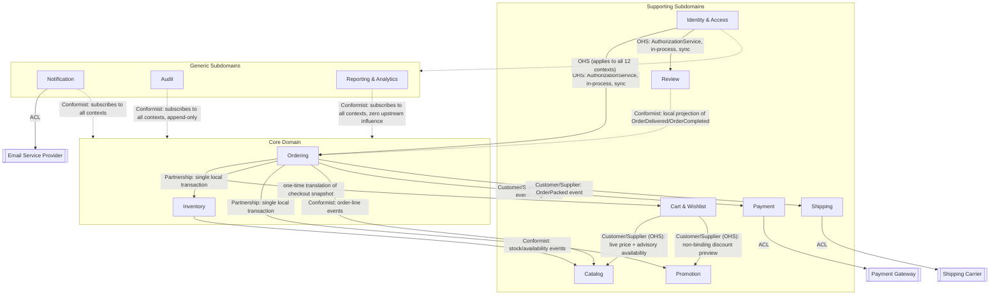
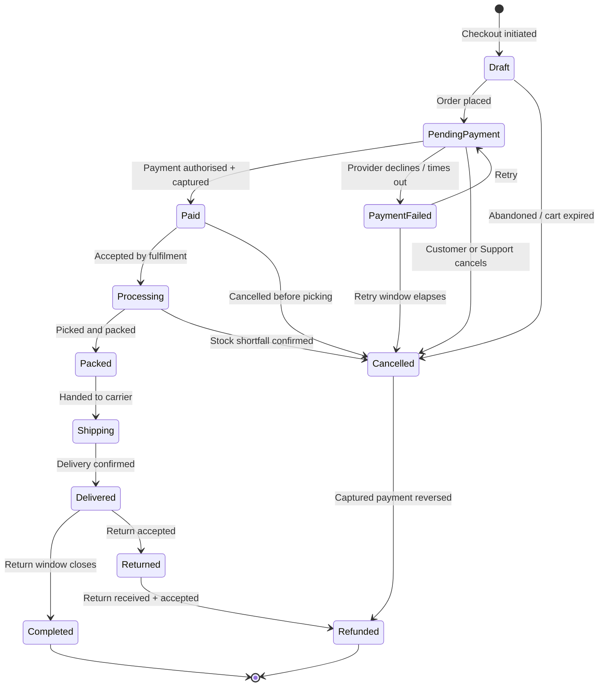
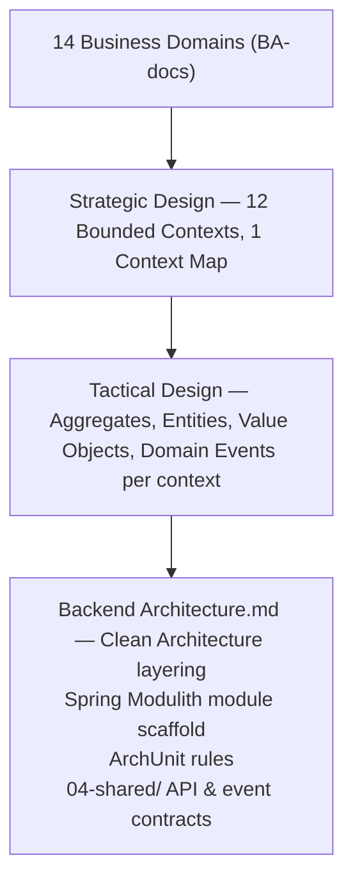

# Domain Model — Enterprise Commerce Platform (ECP)

**Document type:** Domain-Driven Design — Strategic & Tactical Design
**Related documents:** [Business Problem Analysis](../../BA-docs/general-approach.md) · [Software Requirements Specification](../../BA-docs/srs.md) · [Traceability Matrix](../../BA-docs/traceability-matrix.md) · [Solution Architecture](../01-system/Solution%20Architecture.md) · [Technology Stack](../01-system/Technology%20Stack.md)
**Audience:** Backend Engineering, Architecture Review

---

## 1. Purpose of This Document

[Solution Architecture](../01-system/Solution%20Architecture.md) commits the platform to Domain-Driven Design as a governing style (§3), names seven business modules as a starting point for Strategic Design (§5, P1), and names the DDD tactical building blocks — Aggregate Root, Entity, Value Object, Domain Service, Domain Event — as the mechanism by which business invariants are enforced (§5, P5). It does not define what those modules actually own, how they relate to one another, or what their aggregates and invariants are. This document is that definition.

It is organized in two parts, matching how DDD itself separates the two concerns:

- **Part I — Strategic Design** answers *what are the boundaries of the business, and how do they relate to each other?* It classifies subdomains by business importance, reconciles the 14 business-analysis domains into a set of bounded contexts, maps the relationships between them, and fixes a shared vocabulary.
- **Part II — Tactical Design** answers *what, concretely, lives inside each boundary?* It defines the aggregates, entities, value objects, domain services, domain events, and repositories that implement each bounded context, and the invariants (`BR-*`) each one enforces.

Everything here is scoped by what [`srs.md`](../../BA-docs/srs.md) §4–§5 and the [use cases](../../BA-docs/use-cases/) already specify. Nothing here invents new business behavior; it gives the already-specified behavior a structure that [Backend Architecture](./Backend%20Architecture.md) and the Spring Modulith module scaffold can implement directly, and that ArchUnit/JMolecules (SA §8) can verify.

---

# Part I — Strategic Design

## 2. Subdomain Classification

DDD asks that investment be proportional to business differentiation, not spread evenly. This is a classification of *business importance*, not technical difficulty — Promotion, for example, turns out to carry Core-grade concurrency invariants (§5.5) while remaining strategically Supporting, because the discount rules themselves are not what the business competes on.

| Class | Bounded Contexts | Why |
|---|---|---|
| **Core** | Ordering, Inventory | Checkout & Order is, in the BA use cases' own words, "the domain the business is actually for" — every other capability exists to get a customer to a placed order. Inventory carries the highest-emphasized business risk in the entire specification: `BR-INV-01`'s oversell prevention under concurrent demand is called out repeatedly (`srs.md` R1 §2, §8; SA P8) as the failure mode the business cannot absorb. |
| **Supporting** | Catalog, Cart & Wishlist, Payment, Shipping, Promotion, Review, Identity & Access | Necessary, custom to this business, but not the differentiator. A competent implementation is expected here; competitive advantage is not sought here. |
| **Generic** | Notification, Audit, Reporting & Analytics | Solved problems. Each is a well-understood pattern (event-driven dispatch, append-only log, CQRS projection) that could, in principle, be satisfied by an off-the-shelf capability. Investment here is deliberately minimized — see the proportional-rigor rule in §7. |

---

## 3. From 14 Business Domains to 12 Bounded Contexts

[`srs.md`](../../BA-docs/srs.md) §2.2 fixes 14 business/domain codes (`CUS`, `CAT`, `SCH`, `INV`, `CRT`, `ORD`, `PAY`, `SHP`, `PRM`, `REV`, `NTF`, `ADM`, `RPT`, `AUD`). [Solution Architecture](../01-system/Solution%20Architecture.md) §5 P1 names only 7 modules (Catalog, Inventory, Ordering, Payment, Shipping, Promotion, Customer). This section is the reconciliation neither document performs — it is a deliberate strategic decision, not an oversight, and each divergence from a 1:1 mapping is justified below rather than left implicit.

| BA domain code(s) | Bounded Context | Reconciliation |
|---|---|---|
| `CUS` | **Identity & Access** | SA's module is named "Customer." It is realized here as **Identity & Access**, explicitly renamed and widened: role-based access spans Guest, Customer, Staff, Warehouse Operator, Customer Support, and Administrator (SA §4 Actors table), not customers alone. Customer is one profile/role within this context, not the whole of it. |
| `CAT` | **Catalog** | Unchanged — owns Product, Variant, Category. |
| `SCH` | *(folded into Catalog)* | Keyword search, filtering, and ranking (`FR-SCH-01`–`04`) are a pure alternate query path over Catalog's own data — no separate business rules of their own, so no separate bounded context. Its read model is a CQRS projection *inside* Catalog (§8.2), not a new aggregate. Note: "frequently bought together" (`FR-SCH-08`), "trending" (`FR-SCH-09`), and personalized recommendations (`FR-SCH-11`) additionally need purchase co-occurrence and per-customer history — this read model is therefore a Conformist consumer of Catalog's *own* events **and** Inventory's stock/availability events **and** Ordering's order-line events, not Catalog data alone. |
| `INV` | **Inventory** | Unchanged. |
| `CRT` | **Cart & Wishlist** | Its own context. SA's own Actors table already implies this: a guest cart merging into a customer cart on login is described as "a Cart module concern, not a Customer module concern." |
| `ORD` | **Ordering** | Unchanged. |
| `PAY` | **Payment** | Unchanged. |
| `SHP` | **Shipping** | Unchanged. |
| `PRM` | **Promotion** | Unchanged. |
| `REV` | **Review** | Its own context — different lifecycle and invariants (moderation, verified-buyer eligibility) than Catalog, even though it displays alongside products. |
| `NTF` | **Notification** | Its own context — Generic, cross-cutting. |
| `ADM` | *(not a bounded context)* | Walking `UC-ADM-01`–`06`: only account suspension (`UC-ADM-03`) and role management (`UC-ADM-06`) are genuinely identity-shaped domain logic, and both land in Identity & Access. The rest — product/category edits (`UC-ADM-01/02`), order inspection/action (`UC-ADM-04`), inventory adjustment (`UC-ADM-05`) — are role-gated operations that already route through Catalog's, Ordering's, and Inventory's own public APIs. There is no leftover domain logic for "Administration" to own. It dissolves into (a) the User/Role model and authorization Open Host Service owned by Identity & Access, and (b) a thin, permission-gated composition layer (an admin BFF/API composing each context's own public API) — not a domain model of its own. |
| `RPT` | **Reporting & Analytics** | Its own context — Generic, pure CQRS read side. |
| `AUD` | **Audit** | Its own context — Generic. Note: the *authorization decision* logic (`BR-AUD-02`) lives in Identity & Access as an Open Host Service, not here. Audit owns only the immutable log of what happened. |

**Final set — 12 bounded contexts:** Identity & Access, Catalog, Inventory, Cart & Wishlist, Ordering, Payment, Shipping, Promotion, Review, Notification, Audit, Reporting & Analytics.

This is not scope creep against Solution Architecture: SA's 7 named modules plus the Cart module it already implies account for 8; the remaining 4 (Review, Notification, Audit, Reporting & Analytics) are either drawn as separate boxes in SA §3's own architecture diagram or directly implied by the event-consumer pattern SA already commits to in P2/P13/P17.

---

## 4. Bounded Contexts

Each context owns its own domain model, application services, infrastructure, and a deliberate public API — everything else is private to it (SA §5 P1). "Does not own" is stated explicitly for each because it is usually the more load-bearing decision.

| Context | Purpose | Owns | Explicitly does not own |
|---|---|---|---|
| **Identity & Access** | Authenticate and authorize every actor; hold the account/profile relationship. | `Account`/`User`, roles, addresses, the platform's single authorization decision. | Order history, payment methods, reviews. |
| **Catalog** | Define what is sellable and let it be found. | `Product`, `Variant`, `Category`, the search/recommendation read model. | Stock levels, price *availability* (Catalog states the list price; Inventory states whether it can currently be sold). |
| **Inventory** | Guarantee stock is never oversold. | `StockItem`, `StockReservation` (as a child of `StockItem`). | Product content, pricing. |
| **Cart & Wishlist** | Hold a customer's in-progress selection, unpriced. | `Cart`, `CartLine`, `Wishlist`. | Prices (queries Catalog live), stock guarantees (queries Inventory-derived availability, non-authoritative), the order itself. |
| **Ordering** | Turn a checkout intent into a legally-progressing, financially-frozen order. | `Order`, `OrderLine`, the order state machine. | Payment capture, shipment execution, stock bookkeeping (coordinates with, does not own). |
| **Payment** | Capture and refund money against an order, exactly once per attempt. | `Payment`, `PaymentAttempt`, `Refund`. | The decision to place or cancel an order. |
| **Shipping** | Get a packed order to the customer and track it faithfully. | `Shipment`, `TrackingEvent`. | Packing/fulfillment operations themselves (Inventory/Warehouse concern upstream of Shipping). |
| **Promotion** | Decide, deterministically, what discount applies. | `Promotion`, usage counters. | Cart or order totals themselves (it returns a discount decision; Cart/Ordering apply it). |
| **Review** | Let verified buyers rate and review what they bought. | `Review`. | Product content, order history (references both by identity only). |
| **Notification** | Reliably deliver a message for a significant business event. | `NotificationRequest`. | The business meaning of the event it delivers. |
| **Audit** | Hold an immutable record of every significant action. | `AuditEntry` (append-only). | The authorization decision itself (Identity & Access owns that). |
| **Reporting & Analytics** | Answer business-intelligence questions without touching the transactional path. | Read-only projections. | Any authoritative business state. |

---

## 5. Context Map

### 5.1 The Order-Placement Partnership

This is the central design decision in this document. `BR-ORD-02` requires that creating an order and reserving its stock be "a single indivisible operation... including under system failure." Reading `UC-ORD-05` and `UC-PRM-02` together shows this indivisibility is not two-way, it is three-way:

> `UC-PRM-02` E7 — *"Limit reached by a concurrent redemption... Exactly one succeeds; the other is told the promotion is exhausted. The limit holds under concurrency for the same reason `BR-INV-01` does — over-redemption is unbudgeted spend."*

`UC-ORD-05` step 3 re-prices the order and re-validates any voucher immediately before step 4's atomic reserve-and-create. Promotion usage-limit consumption is, structurally, the identical oversell problem as stock. Placing an order is therefore one local transaction spanning three aggregates in three different bounded contexts:

- **`Order`** (Ordering) — enforces `BR-ORD-01`, `BR-ORD-02`, `BR-ORD-03` as its own single-aggregate invariants.
- **`StockItem`** (Inventory) — enforces `BR-INV-01` as its own single-aggregate invariant.
- **`Promotion`** (Promotion) — enforces its usage-cap counter as its own single-aggregate invariant.

Each aggregate's invariant is single-aggregate. Atomicity *across* the three comes from one shared local database transaction — today's modular monolith — not from a wider aggregate boundary. This is a documented, deliberate departure from "one aggregate per transaction," scoped specifically to what `BR-ORD-02` requires, not a general license to touch multiple aggregates casually elsewhere.

Ordering owns two outbound ports for this, structurally identical to the external `PaymentProcessor`/`ShippingProvider` ports SA §4 already names, even though today's implementations are internal:

| Port | Owned by | Implemented today by | Implemented after extraction by |
|---|---|---|---|
| `StockReservationPort` | Ordering | In-process adapter calling Inventory's application service inside the same transaction | Saga/compensating-action adapter against an extracted Inventory service |
| `PromotionRedemptionPort` | Ordering | In-process adapter calling Promotion's application service inside the same transaction | Saga/compensating-action adapter against an extracted Promotion service |

Because it is one local transaction today, a mid-placement failure (`UC-INV-01` E3: "failure part-way through a multi-line reservation") does not need an explicit compensating action *now* — plain transaction rollback releases everything already taken, for free. The Saga/compensating-action design is what §5.1's port table exists to make a swap-in, not a rewrite, if Inventory or Promotion is ever extracted into its own service (SA §11).

### 5.2 Relationship Table

| Upstream | Downstream | Pattern | Mechanism |
|---|---|---|---|
| Catalog | Cart & Wishlist | Customer/Supplier, Open Host Service | Live price + advisory (non-authoritative) availability, queried at display time |
| Promotion | Cart & Wishlist | Customer/Supplier, Open Host Service | Non-binding discount preview only |
| Cart & Wishlist | Ordering | One-time translation | Ordering's application service reads Cart's checkout snapshot once and translates it into Order's own frozen `OrderLine` value objects; not an ongoing dependency, and not an Anticorruption Layer — Cart is a friendly in-house upstream, not a foreign model. |
| Ordering ↔ Inventory | — | **Partnership** | Single local transaction; see §5.1. |
| Ordering ↔ Promotion | — | **Partnership** | Single local transaction; see §5.1. |
| Inventory | Catalog | Conformist | Catalog's read model consumes Inventory's stock/availability events so browse/search reflects availability (`FR-INV-07`, `FR-CAT-04`). |
| Ordering | Catalog | Conformist | Catalog's read model additionally consumes order-line events, needed for "frequently bought together"/"trending"/personalized recommendation (§3, `SCH`). |
| Ordering | Payment | Customer/Supplier, async events | `OrderPlaced` triggers a payment attempt; `PaymentSucceeded`/`PaymentFailed` flow back. Deliberately not synchronous, so payment latency/failure never blocks order creation. |
| Ordering | Shipping | Customer/Supplier, async events | Triggered by `OrderPacked` only — not `OrderPaid`. Per `FR-SHP-04` and the §5.3 order-lifecycle state model, a shipment is created after picking/packing, not at payment. |
| Payment | Payment Gateway | Anticorruption Layer | `PaymentProcessor` port (SA §4). |
| Shipping | Shipping Carrier | Anticorruption Layer | `ShippingProvider` port (SA §4). |
| Notification | Email Service Provider | Anticorruption Layer | `NotificationSender` port (SA §4). |
| Ordering | Review | Conformist | Review maintains its own local read-model projection of "which customers have Delivered/Completed orders containing which products," built from `OrderDelivered`/`OrderCompleted` events — not a synchronous call per review submission. Accepted eventual-consistency tradeoff for `BR-REV-01`. |
| Identity & Access | every other context | Open Host Service | A synchronous, in-process `AuthorizationService` call made from every other context's *application layer* (never its domain layer) before executing a command. This is what makes `BR-AUD-02` ("same decision regardless of entry point") hold by construction rather than by convention. |
| every context | Notification | Conformist | Downstream subscriber to domain events from all 11 other contexts; dispatches via the `NotificationSender` ACL. |
| every context | Audit | Conformist | Downstream subscriber to domain events from all 11 other contexts; exposes no mutation API at all — `BR-AUD-01` is enforced by construction, not by a runtime check. |
| every context | Reporting & Analytics | Conformist | Downstream subscriber to domain events from all 11 other contexts; zero upstream influence — no context designs around Reporting's needs. |

### 5.3 Shared Kernel

A small, behavior-only set of Value Objects is shared across all 12 contexts: `Money` (amount + currency + precision, per SA §10's explicit requirement that a monetary value is never a bare number), typed identity wrappers (`CustomerId`, `ProductId`, `SkuId`, `OrderId`, …), and `Address`. Kept deliberately tiny to avoid the coupling trap a Shared Kernel invites if it grows.

Two governance rules:

1. **Zero outbound dependencies.** The kernel depends on none of the 12 contexts — it must sit structurally beneath all of them, or Spring Modulith's module-boundary check has nothing meaningful to verify.
2. **Physical home is not `04-shared`.** [`SA-docs/README.md`](../README.md#folder-layout) §1.1 reserves `04-shared/` for API/contract artifacts (OpenAPI, DTOs, event contracts, a permission matrix) — not domain code. This kernel needs its own module (e.g., a `shared-kernel` package beneath the backend source tree). This is a forward-pointer for [Backend Architecture](./Backend%20Architecture.md) to resolve, not a decision this document can make on its own.

---

## 6. Ubiquitous Language

Terms that shift meaning across contexts, or that are easy to conflate:

| Term | Meaning here | Note |
|---|---|---|
| **Cart line** vs. **Order line** | A `CartLine` carries no price (`BR-CRT-04`); an `OrderLine` carries a `Money` value frozen at placement (`BR-ORD-06`). | Never treat a cart line as a priced object — the price is looked up live every time a cart is displayed. |
| **SKU** vs. **Product** vs. **Variant** | A `Product` is the sellable concept (name, description, category); a `Variant` is one purchasable configuration of it (size, color); a SKU identifies *at most one* Variant across the entire catalog (`BR-CAT-01`). | "Product" alone is never purchasable — only a Variant/SKU is. |
| **Reservation** | Colloquially ambiguous. This document always says **`StockReservation`**: a child entity of a `StockItem`, scoped to exactly one `(SKU, Warehouse)` pair, with its own Held→Committed/Released lifecycle (`BR-INV-02`). An order line that spans multiple warehouses is multiple independent `StockReservation` parts, not one entity spanning aggregates. | See §8.3. |
| **Customer** (BA term) vs. **Account/User** (this document's term) | `srs.md` uses "Customer" for the `CUS` domain specifically. This document's Identity & Access context owns a broader `Account`/`User` concept covering every human role (Guest through Administrator); "Customer" is one role within it. | See §3's reconciliation note. |
| **Available stock** | `quantityOnHand − quantityReserved` on a `StockItem` — a derived value, never stored independently, so it cannot drift out of sync with its inputs. | Enforces `BR-INV-01` by construction. |
| **Discount preview** vs. **Redemption** | Promotion's Cart-facing OHS returns a *preview* (non-binding, may change by checkout). Only the Order-Placement Partnership's `PromotionRedemptionPort` call is binding. | See §5.1. |

---

# Part II — Tactical Design

## 7. Tactical Design Principles

Stated once here and applied throughout §8, to avoid repeating the same reasoning twelve times.

**Building blocks**, per JMolecules' vocabulary (SA §5 P5, §8):

- **Aggregate Root** — the only object outside the aggregate is allowed to hold a reference to; the transaction and consistency boundary.
- **Entity** — has identity and a lifecycle, but is only ever reached through its aggregate root.
- **Value Object** — no identity, defined entirely by its attributes, immutable.
- **Domain Event** — an immutable record that something significant happened, named in the past tense.
- **Domain Service** — see the rule immediately below.
- **Repository** — one per aggregate root, never per entity.

**Domain Service vs. Application Service.** This distinction is drawn once, explicitly, because it is the one most often blurred in practice: anything that loads or saves more than one aggregate *instance*, opens a unit of work/transaction, or crosses a module's public-API boundary is **Application Service** (orchestration/use-case) work — it does not belong in the domain layer, and SA §8's ArchUnit rule ("Domain must not depend on Infrastructure") would reject it there anyway. A **Domain Service** stays pure: given already-loaded Value Objects/Entities, it returns a decision, with no repository access and no cross-module I/O. Example of a genuine Domain Service: `PromotionStackingPolicy`, which computes `BR-PRM-03`'s deterministic stacking outcome from a list of already-loaded `Promotion` value objects — no I/O, no orchestration. The Order-Placement Partnership's coordination (§5.1), by contrast, is Application Service work, because it spans aggregate instances across bounded contexts.

**Outbound port pattern for cross-context calls**, internal or external. SA §4 already defines this shape for external integrations (`PaymentProcessor`, `ShippingProvider`, `NotificationSender`). This document applies the identical shape to *internal* cross-context calls that must survive a future service extraction: `StockReservationPort` and `PromotionRedemptionPort` (§5.1), each with an in-process adapter today and a Saga-capable adapter after extraction. The domain/application layer depends only on the port; which adapter answers it is an infrastructure decision.

**Global cross-aggregate constraints.** Several rules are cardinality/uniqueness constraints that cross aggregate *instances* and therefore cannot be single-aggregate invariants regardless of how boundaries are drawn: `BR-CAT-01` (SKU uniqueness across the whole catalog), `BR-CUS-01` (email uniqueness across all accounts), `BR-CAT-03` (a category may not become its own ancestor), `BR-REV-02` (at most one review per customer per product), `BR-AUD-03` (a user may not revoke the last remaining Administrator). Stated once: **a database unique/check constraint is the actual enforcement point** for each of these; an optional domain-service pre-check against a repository exists only to give fast user feedback, never as the source of truth. This is standard practice and is not repeated per rule in §8.

**Multi-vendor forward-compatibility.** SA §10 commits that "Catalog, Inventory, and Order Aggregates can carry an explicit seller/ownership attribute without redesign." Concretely, `Product`, `StockItem`, and `Order` each carry a reserved, currently-unused `ownerId`/`sellerId` field — stated here explicitly, per aggregate in §8, so it is not silently forgotten when multi-vendor is eventually built.

**Proportional rigor.** Investment matches the subdomain classification in §2: **full** aggregate/invariant/event/repository detail for Ordering, Inventory, Payment, Promotion, Cart & Wishlist, Catalog, Identity & Access, and Shipping; **light** treatment (entity list + one relationship paragraph, no full invariant walkthrough) for Review, Notification, Audit, and Reporting & Analytics. This is a feature of correct subdomain classification, not an inconsistency — a Generic subdomain is, by definition, not where differentiating design effort belongs.

---

## 8. Per-Context Tactical Model

### 8.1 Identity & Access

| Aggregate | Root | Entities | Key Value Objects |
|---|---|---|---|
| `Account` | `Account` (per `srs.md`, keyed by email) | `Address` (list, one flagged default) | `EmailAddress`, `CredentialHash`, `Role`, `AccountStatus` |

| Invariant | Rule | Enforced by |
|---|---|---|
| Email identifies at most one account | `BR-CUS-01` | DB unique constraint (§7 global-constraint pattern) |
| Unverified accounts can browse/cart but not order or review | `BR-CUS-02` | Cross-context check — Ordering's and Review's *application services* query `Account.verificationStatus` via this context's public API before proceeding, not a domain-layer dependency |
| Verification/reset/refresh tokens are single-use, expiring | `BR-CUS-03` | `Account` aggregate method |
| Authentication failure reveals nothing about which credential was wrong | `BR-CUS-04` | Application service (constant-shape response regardless of failure reason) |
| At most one default shipping address | `BR-CUS-05` | `Account` aggregate invariant over its `Address` entities |
| A user may not self-grant a role they lack, nor revoke the last Administrator | `BR-AUD-03` | DB check constraint / count query (§7 global-constraint pattern) |
| Authorization decision is a platform property, identical regardless of entry point | `BR-AUD-02` | `AuthorizationService` — Open Host Service, called synchronously in-process by every other context's application layer |

**Domain Events:** `AccountRegistered`, `AccountVerified`, `AccountRoleChanged`, `AccountSuspended`.
**Repository:** `AccountRepository`.

### 8.2 Catalog

| Aggregate | Root | Entities | Key Value Objects |
|---|---|---|---|
| `Product` | `Product` | `Variant` | `Sku`, `Money` (list price), `ProductAttributes` |
| `Category` | `Category` | — | — |

| Invariant | Rule | Enforced by |
|---|---|---|
| A SKU identifies at most one purchasable unit across the entire catalog | `BR-CAT-01` | DB unique constraint (§7 global-constraint pattern) |
| An unpublished product is excluded from browse/search/cart but remains visible on orders that already contain it | `BR-CAT-02` | `Product.publicationStatus`, checked by Catalog's own query handlers; Ordering never re-queries Catalog for an existing order's lines (`BR-ORD-06`) |
| A category may not be its own ancestor; a non-empty category may not be deleted until reassigned | `BR-CAT-03` | Domain-service pre-check + DB constraint (§7 global-constraint pattern) |

`Product` carries a reserved, currently-unused `ownerId` field (§7 multi-vendor forward-compatibility).

**Read side (not a tactical building block, a CQRS projection):** Search/filter/rank/autocomplete and recommendation queries (§3, `SCH`) are served from an Elasticsearch-backed read model, populated as a Conformist consumer of Catalog's own events, Inventory's stock/availability events, and Ordering's order-line events (§5.2).

**Domain Events:** `ProductCreated`, `ProductPublished`, `ProductPriceChanged`, `ProductDiscontinued`, `VariantAdded`, `CategoryChanged`.
**Repository:** `ProductRepository`, `CategoryRepository`.

### 8.3 Inventory (Core)

| Aggregate | Root | Entities | Key Value Objects |
|---|---|---|---|
| `StockItem` | `StockItem` (identity: `Sku` + `WarehouseId`) | `StockReservation` (child, not a separate aggregate) | `Quantity`, `ReservationStatus` (Held / Committed / Released) |

`StockItem` is the single-aggregate consistency boundary. `quantityOnHand` and `quantityReserved` are counters on the root; `availableQuantity` is derived (`quantityOnHand − quantityReserved`), never stored independently. A `StockReservation` is a child entity because its state transition and the counter update it causes must be atomic — `UC-INV-03` step 3 states decrementing stock and marking the reservation committed happen "as one operation," which is exactly what a single-aggregate invariant guarantees and a two-aggregate design would have to re-earn via a transaction.

An order line spanning multiple warehouses is modeled as multiple independent `StockReservation` parts, each against its own `StockItem`, each committed or released independently — evidenced directly by `UC-INV-02` A3 and `UC-INV-03` A1/A2, both of which describe partial commit/release as a legal outcome. There is no cross-warehouse aggregate; the "this order line's stock came from three parts" concept is a plain set of `(StockItemId, StockReservationId)` identity references held on the `Order` side (§8.5), not a domain object with its own invariants.

`StockItem` carries a reserved, currently-unused `ownerId`/`sellerId` field (§7 multi-vendor forward-compatibility).

| Invariant | Rule | Enforced by |
|---|---|---|
| Available stock never negative; no concurrent sequence over-reserves | `BR-INV-01` | `StockItem` aggregate, optimistic-locked version, single-aggregate invariant |
| A reservation resolves exactly once — committed or released, never both/neither | `BR-INV-02` | `StockReservation` entity's own terminal state machine |
| A stock adjustment requires a reason, records the actor, and is audited | `BR-INV-03` | Application service, publishes an event Audit consumes |

**Domain Events:** `StockReserved`, `StockReservationCommitted`, `StockReservationReleased`, `StockReservationExpired` (Scheduler-driven sweep), `StockAdjusted`.
**Repository:** `StockItemRepository`.
**Participates in:** the Order-Placement Partnership (§5.1) via `StockReservationPort`.

### 8.4 Cart & Wishlist

| Aggregate | Root | Entities | Key Value Objects |
|---|---|---|---|
| `Cart` | `Cart` (owner: customer or guest session) | `CartLine` | `CartStatus` |
| `Wishlist` | `Wishlist` | `WishlistItem` | — |

| Invariant | Rule | Enforced by |
|---|---|---|
| Cart expiry is a configurable inactivity window, may differ for guest vs. authenticated | `BR-CRT-01` | Scheduler-driven expiry, application service |
| A line's quantity may not exceed *advisory* available stock at add/amend time | `BR-CRT-02` | Application service queries Catalog's OHS (which is itself fed by Inventory's events, §5.2) — non-authoritative; the authoritative check is the Order-Placement Partnership at placement |
| Merging a guest cart into a customer cart never silently discards a line | `BR-CRT-03` | `Cart` aggregate merge method |
| A cart holds no price of its own | `BR-CRT-04` | `CartLine` stores no `Money` field at all — price is looked up live from Catalog every time the cart is displayed |

**Domain Events:** `CartLineAdded`, `CartExpired`, `CartCheckedOut`.
**Repository:** `CartRepository`, `WishlistRepository`.

### 8.5 Ordering (Core, flagship)

| Aggregate | Root | Entities | Key Value Objects |
|---|---|---|---|
| `Order` | `Order` | `OrderLine` | `Money` (frozen unit price, per line and totals), `Address` (shipping/billing snapshot), `OrderStatus` |

`OrderLine.unitPriceAtOrder` is a `Money` value frozen at placement — it is never re-derived from Catalog's current price. `Order` carries a reserved, currently-unused `ownerId`/`sellerId` field (§7 multi-vendor forward-compatibility).

| Invariant | Rule | Enforced by |
|---|---|---|
| Only the defined state transitions are legal, regardless of role or entry point | `BR-ORD-01` | `Order.transition()` — the only mutator of `OrderStatus`, rejects any transition not in the diagram above |
| Order creation + stock reservation is a single indivisible operation | `BR-ORD-02` | The Order-Placement Partnership (§5.1) — Application Service, not domain-layer, since it spans aggregates across contexts |
| Repeated submission of the same confirmed checkout yields one order | `BR-ORD-03` | Idempotency key on the placement command, checked by the placement Application Service before the Partnership transaction opens |
| Order may be cancelled through Processing; once Packed, only returned | `BR-ORD-04` | Encoded directly in the state diagram above — `Cancelled` has no incoming edge from `Packed` |
| A return may only be requested from Delivered, within the configured window | `BR-ORD-05` | `Order.transition()` guard |
| Once Paid, line items/prices/discounts/fee/total are fixed; later change is refund or return, never amendment | `BR-ORD-06` | `Order`'s mutating methods reject any change to `OrderLine`/`Money` fields once `OrderStatus ≥ Paid` |

**Domain Events:** `OrderCreated`, `OrderPaid`, `OrderProcessing`, `OrderPacked`, `OrderShipped`, `OrderDelivered`, `OrderCompleted`, `OrderCancelled`, `OrderPaymentFailed`, `OrderRefunded`, `OrderReturned`.
**Repository:** `OrderRepository`.
**Participates in:** the Order-Placement Partnership (§5.1), as the initiator.

### 8.6 Payment

| Aggregate | Root | Entities | Key Value Objects |
|---|---|---|---|
| `Payment` (per order) | `Payment` | `PaymentAttempt`, `Refund` | `Money`, `IdempotencyKey`, `AttemptOutcome` |

Same tactical rigor as Inventory deliberately, since the problem shape is identical: an idempotency-keyed, exactly-once state transition plus a running total that must hold under concurrent/duplicate delivery.

| Invariant | Rule | Enforced by |
|---|---|---|
| A provider result is applied at most once per attempt | `BR-PAY-01` | `PaymentAttempt`'s own terminal state (Pending→Succeeded/Failed), deduplicated by `IdempotencyKey` |
| Cumulative refunded amount never exceeds captured amount | `BR-PAY-02` | `Payment` aggregate invariant: `sum(Refund.amount) ≤ sum(PaymentAttempt.capturedAmount)`, checked in `Payment.refund()` |
| Cash On Delivery offered only where destination and order value satisfy configured eligibility | `BR-PAY-03` | Application service, checked at payment-method selection |

**Domain Events:** `PaymentCaptured`, `PaymentFailed`, `PaymentRefunded`.
**Repository:** `PaymentRepository`.
**External integration:** `PaymentProcessor` port (Anticorruption Layer to the Payment Gateway).

### 8.7 Shipping

| Aggregate | Root | Entities | Key Value Objects |
|---|---|---|---|
| `Shipment` | `Shipment` | `TrackingEvent` (append-only) | `Carrier`, `TrackingReference`, `ShipmentStatus` |

| Invariant | Rule | Enforced by |
|---|---|---|
| The fee charged is recalculated whenever destination/contents/provider change, and the fee at confirmation is the fee charged | `BR-SHP-01` | Application service at quote/confirm time, not a `Shipment` invariant (fee belongs to the order, not the shipment) |
| An out-of-order carrier update never moves the shipment backwards | `BR-SHP-02` | `Shipment.applyTrackingUpdate()` — compares the incoming update's carrier timestamp/status rank against the latest recorded `TrackingEvent` before applying |

**Domain Events:** `ShipmentCreated`, `ShipmentDispatched`, `ShipmentDelivered`.
**Repository:** `ShipmentRepository`.
**External integration:** `ShippingProvider` port (Anticorruption Layer to the Shipping Carrier).

### 8.8 Promotion

| Aggregate | Root | Entities | Key Value Objects |
|---|---|---|---|
| `Promotion` | `Promotion` | — | `DiscountRule`, `ValidityWindow`, `UsageCounter` |

Redemption-slot claiming is a single-aggregate invariant on `Promotion`, symmetric to `StockItem`'s stock claiming (§8.3) — this symmetry is exactly why the Order-Placement Partnership (§5.1) treats Ordering↔Promotion the same way it treats Ordering↔Inventory.

| Invariant | Rule | Enforced by |
|---|---|---|
| A promotion applies only when every condition holds, evaluated at apply-time and again at placement | `BR-PRM-01` | `Promotion` aggregate method, called twice: once (non-binding) from Cart's preview, once (binding) inside the Partnership |
| Total discount never exceeds the discountable value; order total never negative | `BR-PRM-02` | `Promotion` aggregate invariant |
| Deterministic stacking policy when multiple promotions are eligible | `BR-PRM-03` | `PromotionStackingPolicy` — a genuine Domain Service (§7): pure function over already-loaded `Promotion` value objects, no I/O |

**Domain Events:** `PromotionActivated`, `PromotionRedeemed`, `PromotionExpired`.
**Repository:** `PromotionRepository`.
**Participates in:** the Order-Placement Partnership (§5.1) via `PromotionRedemptionPort`.

### 8.9 Review (light)

`Review` aggregate: rating, text, images, moderation status; references `ProductId` and `CustomerId` by identity only, never by object reference. `BR-REV-01` (only a verified buyer — a customer with a Delivered/Completed order containing the product — may review) is checked against Review's own local projection built from Ordering's `OrderDelivered`/`OrderCompleted` events (§5.2), not a synchronous call. `BR-REV-02` (at most one review per customer per product) follows the §7 global-constraint pattern (DB unique constraint). `BR-REV-03` (author-editable within a window, moderator-only after) and `BR-REV-04` (image format/size limits) are `Review` aggregate methods.

**Domain Events:** `ReviewSubmitted`, `ReviewPublished`, `ReviewModerated`.
**Repository:** `ReviewRepository`.

### 8.10 Notification (light)

A thin `NotificationRequest` entity (recipient, channel, triggering event, delivery outcome) rather than a rich aggregate — this context is fundamentally an event-driven dispatcher, not a domain with its own business invariants beyond delivery guarantees. `BR-NTF-01` (delivered at least once, or recorded undeliverable, never silently dropped) and `BR-NTF-02` (opt-out applies to promotional, never transactional, notifications) are dispatcher-level rules, not aggregate invariants.

**External integration:** `NotificationSender` port (Anticorruption Layer to the Email Service Provider).
**Repository:** `NotificationRequestRepository`.

### 8.11 Audit (light)

`AuditEntry` (actor, action, entity, before/after values, timestamp, reason) — append-only by construction: the repository and application service for this context expose no update or delete operation at all, for any role, through any interface. This is how `BR-AUD-01` holds structurally rather than as a runtime check that could be bypassed by a new entry point. Populated as a downstream Conformist subscriber to domain events from all 11 other contexts.

**Repository:** `AuditEntryRepository` (append-only interface — no `update`/`delete` methods exist).

### 8.12 Reporting & Analytics (light)

No meaningful aggregates — pure CQRS read side. Downstream Conformist subscriber to domain events from all 11 other contexts, materializing projections into MongoDB/Elasticsearch per SA §5 P13. `BR-RPT-01` (revenue counts only Paid-or-beyond orders, excluding refunds/returns from the periods they occur in) is a projection-computation rule, not an aggregate invariant. Zero upstream influence — no other context designs around this one's needs (§5.2).

---

## 9. Domain Events Catalog

The catalogue is [`Integration Contract.md`](../04-shared/Integration%20Contract.md) §7 — every event name against its publishing context, its transport, its known consumers, and its payload. It is the normative contract for what crosses a boundary, so it is the copy kept; the event names this document's §8 aggregates publish are the same strings.

Two properties of the catalogue matter to the domain model rather than to the contract. **Notification, Audit, and Reporting & Analytics are universal consumers** — generic subdomains subscribing to nearly every context, which is why they appear in almost every row and why none of the twelve core contexts depends on them. And **an event's transport is a consequence of its context map relationship**, not a free choice: a Partnership or Shared Kernel pairing stays in-process, while a Conformist or Customer/Supplier pairing across a future extraction boundary goes through the outbox to Kafka (§7).

---

## 10. Business Rule Traceability

Every `BR-*` from [`srs.md`](../../BA-docs/srs.md) §4, mapped to where it is actually enforced. Mirrors the convention already established in [`traceability-matrix.md`](../../BA-docs/traceability-matrix.md).

| Rule | Bounded Context | Aggregate / Mechanism | Section |
|---|---|---|---|
| `BR-CUS-01` | Identity & Access | `Account`, DB unique constraint | §8.1 |
| `BR-CUS-02` | Identity & Access → Ordering, Review | Cross-context verification-status check | §8.1 |
| `BR-CUS-03` | Identity & Access | `Account` aggregate method | §8.1 |
| `BR-CUS-04` | Identity & Access | Application service | §8.1 |
| `BR-CUS-05` | Identity & Access | `Account` aggregate invariant | §8.1 |
| `BR-CAT-01` | Catalog | `Product`/`Variant`, DB unique constraint | §8.2 |
| `BR-CAT-02` | Catalog | `Product.publicationStatus` | §8.2 |
| `BR-CAT-03` | Catalog | `Category`, DB constraint | §8.2 |
| `BR-SCH-01` | Catalog (read side) | Query-scoping in the search/recommendation read model | §8.2 |
| `BR-INV-01` | Inventory | `StockItem` single-aggregate invariant | §8.3 |
| `BR-INV-02` | Inventory | `StockReservation` terminal state machine | §8.3 |
| `BR-INV-03` | Inventory | Application service + Audit event | §8.3 |
| `BR-CRT-01` | Cart & Wishlist | Scheduler-driven expiry | §8.4 |
| `BR-CRT-02` | Cart & Wishlist | Advisory check via Catalog OHS | §8.4 |
| `BR-CRT-03` | Cart & Wishlist | `Cart` aggregate merge method | §8.4 |
| `BR-CRT-04` | Cart & Wishlist | `CartLine` has no `Money` field | §8.4 |
| `BR-ORD-01` | Ordering | `Order.transition()` | §8.5 |
| `BR-ORD-02` | Ordering + Inventory + Promotion | The Order-Placement Partnership | §5.1, §8.5 |
| `BR-ORD-03` | Ordering | Idempotency key, checked pre-Partnership | §8.5 |
| `BR-ORD-04` | Ordering | State diagram edge set | §8.5 |
| `BR-ORD-05` | Ordering | `Order.transition()` guard | §8.5 |
| `BR-ORD-06` | Ordering | `Order` mutator guards on `OrderStatus ≥ Paid` | §8.5 |
| `BR-PAY-01` | Payment | `PaymentAttempt`, idempotency key | §8.6 |
| `BR-PAY-02` | Payment | `Payment` aggregate invariant | §8.6 |
| `BR-PAY-03` | Payment | Application service | §8.6 |
| `BR-SHP-01` | Shipping (application layer) | Fee recalculation at quote/confirm | §8.7 |
| `BR-SHP-02` | Shipping | `Shipment.applyTrackingUpdate()` | §8.7 |
| `BR-PRM-01` | Promotion | `Promotion` aggregate method | §8.8 |
| `BR-PRM-02` | Promotion | `Promotion` aggregate invariant | §8.8 |
| `BR-PRM-03` | Promotion | `PromotionStackingPolicy` Domain Service | §8.8 |
| `BR-REV-01` | Review → Ordering | Local projection of `OrderDelivered`/`OrderCompleted` | §8.9 |
| `BR-REV-02` | Review | DB unique constraint | §8.9 |
| `BR-REV-03` | Review | `Review` aggregate method | §8.9 |
| `BR-REV-04` | Review | `Review` aggregate method | §8.9 |
| `BR-NTF-01` | Notification | Dispatcher delivery guarantee | §8.10 |
| `BR-NTF-02` | Notification | Dispatcher preference check | §8.10 |
| `BR-RPT-01` | Reporting & Analytics | Projection-computation rule | §8.12 |
| `BR-AUD-01` | Audit | No mutation API surface exists | §8.11 |
| `BR-AUD-02` | Identity & Access | `AuthorizationService` OHS | §8.1 |
| `BR-AUD-03` | Identity & Access | DB check constraint / count query | §8.1 |

---

## 11. Summary

This document turns [Solution Architecture](../01-system/Solution%20Architecture.md)'s P1/P5 commitments into a concrete model: 12 bounded contexts (§3–§4), a context map with one central, evidence-backed hard boundary — the three-way Order-Placement Partnership (§5.1) — and a full tactical breakdown for every Core and high-invariant Supporting context, traced back to every `BR-*` rule in the SRS (§10).

What this unlocks next: [Backend Architecture](./Backend%20Architecture.md) (still a stub) can now define the Clean Architecture layering and package structure that houses these aggregates; the Spring Modulith module scaffold can be generated directly from §4's context list; ArchUnit rules can be written against the Domain Service/Application Service distinction in §7; and `04-shared/` can define the API and event contracts for the Domain Events Catalog in §9.
