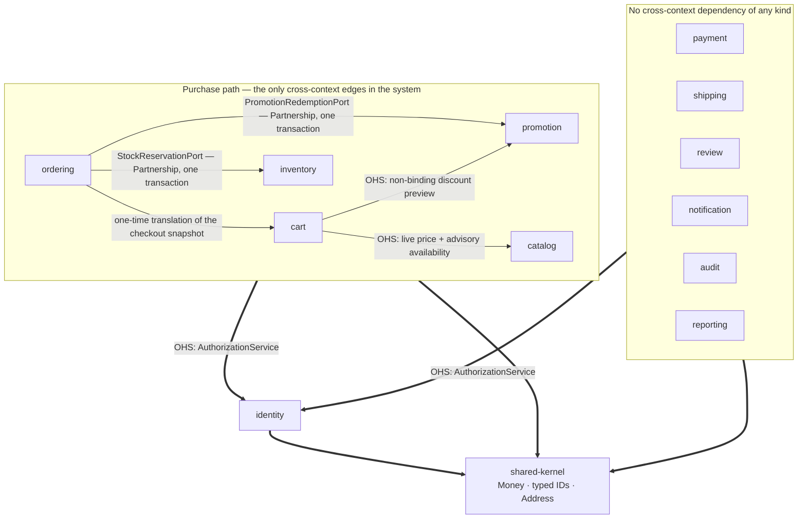
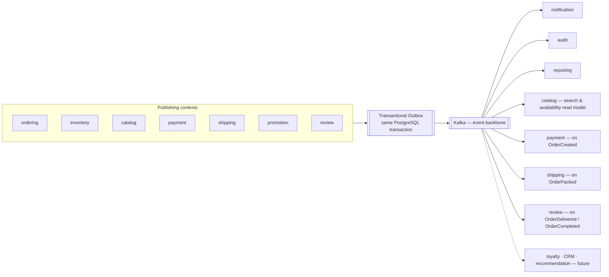
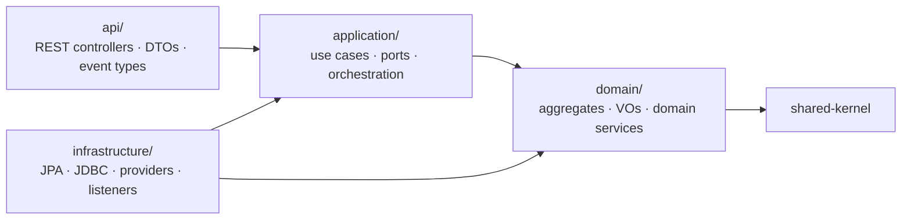

# Module Dependency Diagram — Enterprise Commerce Platform (ECP)

**Document type:** Backend architecture specification
**Status:** Accepted, except §5 (**Proposed** — decided here for the first time)
**Audience:** Engineering, Architecture Review
**Related documents:** [Domain Model](./Domain%20Model.md) · [Solution Architecture](../01-system/Solution%20Architecture.md) · [ADR-0005](../01-system/ADR/ADR-0005-clean-architecture-ports-and-adapters.md) · [ADR-0006](../01-system/ADR/ADR-0006-spring-modulith-module-boundaries.md) · [ADR-0012](../01-system/ADR/ADR-0012-transactional-outbox-and-kafka.md) · [ADR-0018](../01-system/ADR/ADR-0018-architecture-governance-ci-gate.md)

---

## 1. Purpose of This Document

[`Domain Model.md`](./Domain%20Model.md) §5 draws the **context map**: which bounded contexts relate to each other, and under which strategic pattern. That is a design statement about the business.

This document draws the **module dependency graph**: which Gradle subproject's code may reference which other's, in which direction, through which package. That is a structural statement about the build — and unlike the context map, it is a claim the compiler and the CI gate can falsify.

The two are not the same picture, and the difference is the whole point. A context map edge such as *"Ordering → Payment, Customer/Supplier, async events"* is a real business relationship that produces **no dependency edge at all** once §5's rule is applied. Conversely, `shared-kernel` appears nowhere in the context map but is depended on by all thirteen other modules.

Three questions [`ADR-0006`](../01-system/ADR/ADR-0006-spring-modulith-module-boundaries.md) leaves open are settled here:

1. Which cross-module edges actually exist, and in which direction (§3).
2. Where a published event's Java type lives, and therefore whether consuming an event couples you to its publisher (§5).
3. Whether the resulting graph is acyclic — because if it is not, Spring Modulith fails the build and no amount of documentation rescues it (§3.3).

---

## 2. The Module Set

Fourteen Gradle subprojects under root project `ecp` ([ADR-0027](../01-system/ADR/ADR-0027-java-21-spring-boot-4-gradle.md)): thirteen library modules plus `app`, the only subproject that applies `org.springframework.boot` and produces the `bootJar`.

| Subproject | Bounded context | Subdomain | DB table prefix (`ADR-0009`) |
|---|---|---|---|
| `shared-kernel` | — (not a context) | — | — |
| `identity` | Identity & Access | Supporting | `identity_` |
| `catalog` | Catalog | Supporting | `catalog_` |
| `inventory` | Inventory | **Core** | `inventory_` |
| `cart` | Cart & Wishlist | Supporting | `cart_` |
| `ordering` | Ordering | **Core** | `ordering_` |
| `payment` | Payment | Supporting | `payment_` |
| `shipping` | Shipping | Supporting | `shipping_` |
| `promotion` | Promotion | Supporting | `promotion_` |
| `review` | Review | Supporting | `review_` |
| `notification` | Notification | Generic | `notification_` |
| `audit` | Audit | Generic | `audit_` |
| `reporting` | Reporting & Analytics | Generic | `reporting_` |
| `app` | — (composition root) | — | — |

`shared-kernel` and `app` are the two subprojects that are not bounded contexts. The kernel sits structurally *beneath* every context; `app` sits *above* every context and contains no business logic — only wiring, configuration, and the Spring Boot entry point. Everything in between is a context, one for one, as [`Domain Model.md`](./Domain%20Model.md) §3 resolves them.

Every module has the same internal shape ([ADR-0006](../01-system/ADR/ADR-0006-spring-modulith-module-boundaries.md) §4):

```nano
  <module>/
  ├── api/              public   — the module's deliberate surface: services, DTOs, event types
  ├── application/      internal — use cases, ports, orchestration
  ├── domain/           internal — aggregates, value objects, domain services
  └── infrastructure/   internal — adapters (persistence, providers, event listeners)
```

Only `api/` is reachable from another module. The other three are internal by Modulith's default, and reaching into them is the specific violation the CI gate exists to catch.

---

## 3. Compile-Time Dependency Graph

This graph contains **only** edges that are a real `implementation(project(":x"))` declaration in a module's `build.gradle.kts`. An edge means: this module's code names a type from that module's `api` package.



The thick edges are drawn once from each group rather than as twenty-four separate arrows; they are twenty-four real Gradle declarations.

### 3.1 The five real cross-context edges

| From | To | Mechanism | Source |
|---|---|---|---|
| `ordering` | `cart` | Reads Cart's checkout snapshot once and translates it into `Order`'s own frozen `OrderLine` value objects. Not an ongoing dependency. | Domain Model §5.2 |
| `ordering` | `inventory` | `StockReservationPort`, in-process adapter, inside the placement transaction. | Domain Model §5.1 |
| `ordering` | `promotion` | `PromotionRedemptionPort`, in-process adapter, inside the placement transaction. | Domain Model §5.1 |
| `cart` | `catalog` | Open Host Service — live price and advisory, non-authoritative availability, queried at display time. | Domain Model §5.2 |
| `cart` | `promotion` | Open Host Service — non-binding discount preview only. | Domain Model §5.2 |

**Direction of the two Partnership edges is a decision, not a given.** [`ADR-0005`](../01-system/ADR/ADR-0005-clean-architecture-ports-and-adapters.md) §4 fixes that `Ordering` *owns* `StockReservationPort` even though Inventory satisfies it. It does not say which module hosts the adapter, and the two answers produce opposite module edges. The adapter lives in **`ordering.infrastructure`** and calls `inventory.api`, giving `ordering → inventory`. The alternative — Inventory implementing Ordering's port — would make Inventory depend on Ordering, and [`Domain Model.md`](./Domain%20Model.md) §4 states explicitly that Inventory *does not own* order concerns. A Core context must not learn that Ordering exists in order to protect its own stock invariant.

### 3.2 The two universal edges

| Edge | Why every module has it |
|---|---|
| every context → `identity` | The synchronous, in-process `AuthorizationService` call made from every context's **application** layer before executing a command or serving a role-scoped query. This is what makes `BR-AUD-02` ("same decision regardless of entry point") hold by construction (Domain Model §5.2). It applies to `audit` and `reporting` too: neither has a command surface, but both serve role-scoped reads — SRS §2.3 grants the audit trail to Support and Admin only, and reporting to Staff, Warehouse, and Admin on different scopes. |
| every module → `shared-kernel` | `Money`, typed identity wrappers, and `Address` (Domain Model §5.3). The kernel has **zero outbound dependencies**, which is what lets it sit beneath everything without creating a cycle. |

### 3.3 The graph is acyclic — and §5 is why

Reading the graph as a topological order, top to bottom: `ordering` → {`cart`, `inventory`, `promotion`} → {`catalog`} → `identity` → `shared-kernel`, with `payment`, `shipping`, `review`, `notification`, `audit`, and `reporting` sitting alongside as leaves that depend on nothing but `identity` and the kernel.

That acyclicity is not luck. The context map contains at least three relationships that look like cycles:

- Ordering publishes `OrderCreated` **to** Payment; Payment publishes `PaymentCaptured` **back to** Ordering.
- Inventory publishes stock events **to** Catalog; Ordering publishes order-line events **to** Catalog — while Ordering already depends on Inventory.
- Review projects Ordering's delivery events; Catalog displays Review's ratings.

None of them appears above, because §5 rules that Kafka-transported events create no compile-time coupling. Remove that rule and the module graph has a cycle on the platform's most business-critical path, `ApplicationModules.verify()` fails, and the modular monolith stops being modular.

---

## 4. Runtime Event Flow

A separate picture, deliberately. These are runtime edges — messages over a topic — and none of them is a Gradle dependency. Conflating the two is what makes module graphs unreadable and, worse, what makes them look cyclic when they are not.



Two transports coexist, and which one an interaction uses is fixed by [`ADR-0012`](../01-system/ADR/ADR-0012-transactional-outbox-and-kafka.md) §4, not by preference:

| Transport | Used when | Creates a module dependency? |
|---|---|---|
| In-process Spring Modulith event | Local subscribers only, within one deployable | **Yes** — the listener method's parameter is the publisher's event type |
| Outbox + Kafka | Must survive a restart, fan out to multiple asynchronous consumers, or eventually cross a service boundary | **No** — see §5 |
| Synchronous port call | Not an event at all; `BR-ORD-02` requires atomicity | **Yes** — §3.1 |

The message-by-message view of that flow — the outbox write inside the business transaction, the relay poll, the fan-out, and each consumer's idempotency obligation — is [`Sequence/00-Overview.md`](./Sequence/00-Overview.md) §3.

The dashed future consumers are `P2` and `AC-03` working as intended: loyalty subscribes to `OrderPaid` without checkout changing by a line, and without appearing anywhere in §3's graph.

---

## 5. Where a Published Event's Java Type Lives

**Status: `Proposed`.** No existing document states this, so per [ADR/README](../01-system/ADR/README.md) §2 it is recorded here as a first-time decision awaiting ratification, not presented as settled.

The gap is narrow and load-bearing. [`ADR-0012`](../01-system/ADR/ADR-0012-transactional-outbox-and-kafka.md) §4 sends event *schemas* to `04-shared/Event Contract` — a documentation artefact. [`Domain Model.md`](./Domain%20Model.md) §5.3 bars events from `shared-kernel`, which is value objects only. Neither says where the Java `record` lives, and the answer decides whether consuming an event couples you to its publisher.

**The rule, by transport:**

| Transport | Where the type lives | Consumer's compile-time dependency |
|---|---|---|
| **In-process** Modulith event | The publishing module's `api` package — e.g. `identity.api.AccountRegistered` | The publisher's `api`. A real, visible, one-directional Gradle edge. |
| **Outbox + Kafka** event | The publisher declares it in its own `api` package for its own outbox write. Each consumer declares its **own** local record in `<consumer>.infrastructure`, deserialised from the topic. | **None.** The contract is the JSON schema in [`04-shared/Integration Contract`](../04-shared/Integration%20Contract.md) §7, not a shared Java type. |

**Why the duplication is deliberate rather than sloppy.** A consumer redeclaring three fields of `OrderPaid` looks like waste until you notice what it buys:

- **It is what keeps the graph acyclic.** Ordering↔Payment, Ordering↔Catalog, and Review↔Catalog are all cycles under a shared-type scheme, and cycles fail `ApplicationModules.verify()`.
- **It is what makes extraction free.** [`ADR-0002`](../01-system/ADR/ADR-0002-modular-monolith-deployment-unit.md) commits to keeping extraction a boundary-preserving change. A Kafka consumer that owns its own deserialisation type behaves identically in-process and out-of-process; one that imports the publisher's class cannot be extracted without first being rewritten.
- **It is what makes additive versioning real.** A consumer that binds only the fields it uses tolerates a publisher adding fields, which is exactly the evolution rule [`ADR-0012`](../01-system/ADR/ADR-0012-transactional-outbox-and-kafka.md) §4 requires.

The cost is honest and worth stating: the JSON schema in `04-shared/Event Contract` becomes the *only* thing keeping publisher and consumer in step. Nothing in the compiler catches a consumer that misreads a field. Contract tests against the published schema are the mitigation, and they are not optional.

---

## 6. Intra-Module Layer Dependencies

Inside a module, dependencies point inward. This is [`ADR-0005`](../01-system/ADR/ADR-0005-clean-architecture-ports-and-adapters.md) §4's rule, reproduced here because it is half of what the CI gate checks — the other half being §3's module graph.



| Layer | May depend on | May **not** depend on |
|---|---|---|
| `domain` | the shared kernel only | application, infrastructure, api, Spring, JPA, Jackson, any provider SDK |
| `application` | domain, ports | infrastructure, api, concrete adapters |
| `infrastructure` | domain, application, ports | api |
| `api` | application | domain internals, infrastructure |

Two consequences worth making explicit, because both are easy to violate without noticing:

- **The `AuthorizationService` call is an application-layer call.** `identity` may be named from another module's `application` package and nowhere else. A domain object that asks who the caller is has made authorisation part of a business invariant, which is precisely what `BR-AUD-02` and Domain Model §5.2 forbid.
- **The Partnership adapters are infrastructure.** `ordering.infrastructure` hosts the `StockReservationPort` and `PromotionRedemptionPort` adapters. `ordering.domain` never names `inventory` or `promotion`; it names only the port interfaces `ordering.application` owns.

---

## 7. Forbidden Edges

Everything the graph must not contain, with the mechanism that catches it. Each is build-failing under [`ADR-0018`](../01-system/ADR/ADR-0018-architecture-governance-ci-gate.md), not review-failing.

| Forbidden | Why | Caught by |
|---|---|---|
| Any cycle between modules | Makes independent reasoning, testing, and future extraction impossible; `NFR-MAINT-02` becomes untestable | `ApplicationModules.verify()` |
| Reaching into another module's `application`, `domain`, or `infrastructure` | The module's deliberate surface is `api`; anything else is an internal detail its owner may change freely (`NFR-MAINT-01`) | Modulith module-boundary check |
| Any outbound dependency from `shared-kernel` | The kernel must sit structurally beneath all thirteen modules, or the boundary check has nothing meaningful to verify (Domain Model §5.3) | ArchUnit dependency test |
| An aggregate, repository, or service in `shared-kernel` | Behaviour-only value objects; growth is the coupling trap the kernel invites | ArchUnit rule forbidding `@AggregateRoot` / `@Repository` stereotypes in the kernel package |
| A `domain` package naming `identity`, or any other module | Authorisation and cross-context coordination are application concerns (§6) | ArchUnit layer rule |
| A direct call from `ordering` to Inventory's or Promotion's application service, bypassing the ports | Defeats the swap-in that keeps future extraction cheap; Modulith reports it as a violation and the temptation is to relax the rule rather than the code (ADR-0006 §5) | ArchUnit rule + code review |
| A foreign key across module table prefixes | `ordering_order` must not reference `catalog_product`; a shared schema is not a shared model ([ADR-0009](../01-system/ADR/ADR-0009-postgresql-source-of-truth.md)) | Schema migration review + integration test |
| `inventory` or `promotion` depending on `ordering` | Inverts the Partnership direction §3.1 fixes; a Core context would learn about a downstream one | `@ApplicationModule(allowedDependencies = {...})` |
| Any module depending on `app` | `app` is the composition root; nothing composes it | `ApplicationModules.verify()` |

---

## 8. The One Porous Boundary

The Order-Placement Partnership ([`Domain Model.md`](./Domain%20Model.md) §5.1) is the single place in the system where one transaction spans three modules. `BR-ORD-02` requires that creating an order, reserving its stock, and consuming a promotion's usage allowance be indivisible *including under system failure*, and `UC-PRM-02` E7 makes promotion over-redemption structurally the same oversell problem as `BR-INV-01`.

This is legitimate and documented, but it is the one boundary that is deliberately porous, and two things keep it from becoming a general licence:

1. **It goes through `StockReservationPort` and `PromotionRedemptionPort`, never a direct call.** Both are owned by `ordering.application`, satisfied by adapters in `ordering.infrastructure`. Today those adapters call the target module's application service inside the same transaction; after a future extraction they become saga/compensating-action adapters, and `ordering.domain` does not change.
2. **It is scoped to this one interaction.** Every other cross-module edge in §3.1 is a query or a one-time translation, none of which shares a transaction.

Because it is one local transaction today, a mid-placement failure — `UC-INV-01` E3, "failure part-way through a multi-line reservation" — needs no compensating action: rollback releases every held reservation for free. That is the benefit [`ADR-0002`](../01-system/ADR/ADR-0002-modular-monolith-deployment-unit.md) is buying, and §10 is the bill.

---

## 9. How the Graph Is Verified

The diagram in §3 is not documentation of intent; it is a specification the build checks on every commit. Three mechanisms, all non-skippable under [`ADR-0018`](../01-system/ADR/ADR-0018-architecture-governance-ci-gate.md):

| Mechanism | What it verifies |
|---|---|
| `ApplicationModules.of(EcpApplication.class).verify()` | No cycles; no module reaches another module's internals; every declared dependency is real |
| `@ApplicationModule(allowedDependencies = {...})` on each module's `package-info.java` | The **allow-list** — a module may declare only the edges §3.1 and §3.2 grant it. A new edge is a deliberate, reviewable change to this annotation, not something a developer adds by writing an import. |
| ArchUnit rules | The layer table in §6, the `shared-kernel` rules in §7, and the stereotype rules from [ADR-0007](../01-system/ADR/ADR-0007-jmolecules-tactical-ddd.md) |

The allow-list is the load-bearing one. Without it, Modulith verifies only that the graph is *acyclic and boundary-respecting* — it would happily accept `review → payment` if someone wrote it. With it, §3 becomes the single source of truth, and adding an edge requires saying so out loud.

`ApplicationModules` also generates a module canvas and component diagram from the same metadata. Where that generated output disagrees with §3, **the generated output is right** and this document is stale.

---

## 10. Extraction Readiness

[`Solution Architecture.md`](../01-system/Solution%20Architecture.md) §11 keeps microservice extraction open without paying for it now. §3's graph is what makes that claim checkable: a module's extraction cost is exactly the cost of converting its inbound and outbound compile-time edges into network calls.

| Module | Edges to convert | Extraction cost |
|---|---|---|
| `reporting`, `audit`, `notification` | None but `identity` and the kernel | **Lowest.** Already pure Kafka consumers with no upstream influence. Extraction is a deployment change. |
| `review`, `shipping`, `payment` | None but `identity` and the kernel | **Low.** All inbound coupling is already Kafka. Payment additionally owns an ACL to an external provider, which does not change. |
| `catalog` | Inbound from `cart` (OHS) | **Low–moderate.** One synchronous OHS becomes a network call on the cart-display path; its availability data is already advisory and non-authoritative, so a timeout degrades rather than breaks. |
| `cart` | Inbound from `ordering`; outbound to `catalog`, `promotion` | **Moderate.** The `ordering → cart` read is one-time and already snapshot-shaped. |
| `identity` | Inbound from all twelve | **Moderate but pervasive.** Twelve synchronous authorisation calls become network calls on every command path. Latency budget, caching, and fail-closed behaviour all become live design problems. |
| `inventory` | `StockReservationPort` — inside the placement transaction | **Highest.** `BR-ORD-02`'s atomicity is currently a local rollback; across a service boundary it becomes a saga with compensating actions on the platform's most business-critical path. |
| `promotion` | `PromotionRedemptionPort` — inside the placement transaction | **Highest**, for the same reason. `UC-PRM-02` E7's over-redemption guarantee has the same shape as the oversell guarantee. |
| `shared-kernel` | — | Not extractable. It becomes a published library every service depends on, with the versioning problem that implies. |

The ranking is the useful output: the three Generic contexts could leave tomorrow, and the two Core Partnership participants are where the real work is — which is exactly what [`ADR-0002`](../01-system/ADR/ADR-0002-modular-monolith-deployment-unit.md) §5 predicts when it calls the Partnership "the single largest item of work in any future extraction."

---

## 11. Open Items

| Item | Status |
|---|---|
| **The admin BFF's module placement.** [`Domain Model.md`](./Domain%20Model.md) §3 dissolves `ADM` into Identity & Access plus "a thin, permission-gated composition layer composing each context's own public API." [ADR-0006](../01-system/ADR/ADR-0006-spring-modulith-module-boundaries.md) §5 leaves its placement to `Backend Architecture.md`. It is not in §3's graph because it does not have a home yet — and wherever it lands it will depend on many contexts' `api` packages, making it the one component with a legitimately wide fan-out. | Unresolved — for [`Backend Architecture.md`](./Backend%20Architecture.md) |
| **§5's event-type rule** is `Proposed` and needs ratification, or promotion into an ADR of its own. | Awaiting architecture review |
| **Contract tests against `04-shared/Event Contract`.** §5 trades compile-time safety for extraction freedom; the trade is only sound if the schema is actually tested. [`ADR-0018`](../01-system/ADR/ADR-0018-architecture-governance-ci-gate.md)'s test stack does not yet name a contract-testing tool. | Unresolved |
| **`app`'s wiring role.** Whether `app` holds only configuration or also the composition of cross-module transaction boundaries. | For [`Backend Architecture.md`](./Backend%20Architecture.md) |

---

## 12. Next Step

[`Backend Architecture.md`](./Backend%20Architecture.md) turns this graph into a build: the Gradle multi-project layout, the `package-info.java` allow-lists, the outbox relay implementation, topic naming, and the admin BFF's placement. The contracts that cross the boundary — REST, events, errors, permissions — are specified in [`04-shared/Integration Contract.md`](../04-shared/Integration%20Contract.md). The physical topology this single deployable runs on is in [`01-system/Deployment Diagram.md`](../01-system/Deployment%20Diagram.md).
