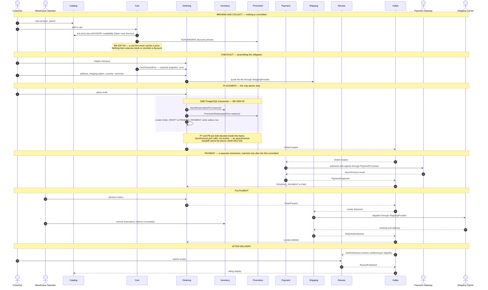
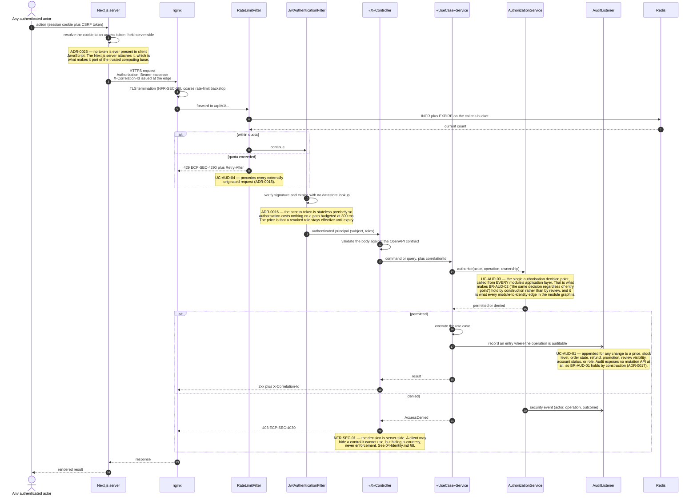
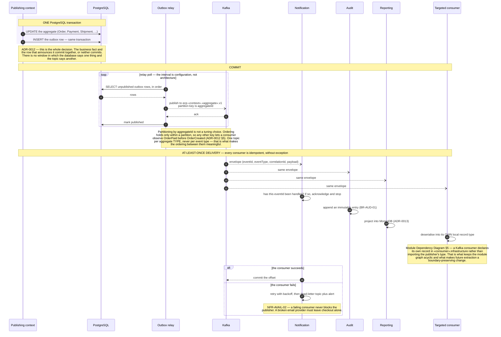

# Sequence Diagrams — Overview

**Document type:** Backend architecture specification
**Status:** **Proposed**
**Audience:** Backend Engineering, Frontend Engineering, Architecture Review
**Related documents:** [README](./README.md) · [Module Dependency Diagram](../Module%20Dependency%20Diagram.md) · [Domain Model](../Domain%20Model.md) · [Integration Contract](../../04-shared/Integration%20Contract.md)

Three module-level diagrams. The first is the map; the other two are mechanisms that every layered diagram in this folder leans on rather than redrawing.

Arrow and frame conventions are in [`README.md`](./README.md) §3.1–§3.2.

---

## 1. The Purchase Path

The whole of it, context to context, with each step naming the layered diagram that expands it. Nothing here is authoritative about ordering *within* a step — that is what the expansions are for. What it is authoritative about is the sequence of steps and, crucially, which of them share a transaction: exactly one does.

| | |
|---|---|
| **Use cases** | `UC-CAT-03` · `UC-CRT-01` · `UC-ORD-01`–`05` · `UC-PAY-02` · `UC-INV-03` · `UC-SHP-03`–`06` · `UC-REV-01` |
| **Business rules** | `BR-CRT-04` · `BR-ORD-01` · `BR-ORD-02` · `BR-INV-01` · `BR-PAY-01` |
| **Decisions** | [ADR-0005](../../01-system/ADR/ADR-0005-clean-architecture-ports-and-adapters.md) · [ADR-0011](../../01-system/ADR/ADR-0011-optimistic-locking-reservation-model.md) · [ADR-0012](../../01-system/ADR/ADR-0012-transactional-outbox-and-kafka.md) |
| **Problems** | `P6` · `P7` · `P8` · `P11` |

**Where each step is expanded**

| Step | Diagram |
|---|---|
| Browse, search | [`05-Cart-Catalog-Search.md`](./05-Cart-Catalog-Search.md) §6, §7 |
| Add to cart | [`05-Cart-Catalog-Search.md`](./05-Cart-Catalog-Search.md) §2 |
| Checkout steps | [`01-Ordering.md`](./01-Ordering.md) §2–§5 |
| **Place order** | [`01-Ordering.md`](./01-Ordering.md) §6 |
| Reserve stock | [`02-Inventory.md`](./02-Inventory.md) §2 |
| Redeem voucher | [`06-Fulfilment.md`](./06-Fulfilment.md) §6 |
| Authorise payment | [`03-Payment.md`](./03-Payment.md) §2 |
| Advance status, ship, deliver | [`01-Ordering.md`](./01-Ordering.md) §10, [`06-Fulfilment.md`](./06-Fulfilment.md) §2–§4 |
| Submit review | [`07-Supporting.md`](./07-Supporting.md) §2 |

**Why this picture has cycles and the module graph does not.** Ordering publishes to Payment and Payment publishes back to Ordering; Ordering depends on Inventory while Inventory feeds Catalog, which Cart reads. Every one of those loops closes through a `--)` arrow, and [`Module Dependency Diagram.md`](../Module%20Dependency%20Diagram.md) §5 rules that a Kafka-transported event creates no compile-time coupling: each consumer declares its own local record type rather than importing the publisher's. Remove that rule and `ApplicationModules.verify()` fails on the platform's most business-critical path. This diagram is the runtime picture; the module graph is the compile-time one, and conflating them is what makes module graphs look cyclic when they are not.

---

## 2. The Request Pipeline

Drawn once here, in full. Every other diagram in this folder collapses it to a note, because repeating six messages forty-seven times would push the actual content a third of the way down each diagram.

| | |
|---|---|
| **Use cases** | `UC-AUD-03` · `UC-AUD-04` · `UC-AUD-01` |
| **Business rules** | `BR-AUD-01` · `BR-AUD-02` |
| **Quality** | `NFR-SEC-01` · `NFR-SEC-06` · `NFR-OBS-01` · `NFR-OBS-03` · `NFR-PERF-01` |
| **Decisions** | [ADR-0015](../../01-system/ADR/ADR-0015-redis-cache-and-rate-limiting.md) · [ADR-0016](../../01-system/ADR/ADR-0016-jwt-refresh-rotation-rbac.md) · [ADR-0025](../../01-system/ADR/ADR-0025-httponly-cookie-session.md) · [ADR-0031](../../01-system/ADR/ADR-0031-contract-first-openapi.md) |
| **Problems** | `P5` · `P16` · `P17` |

**Why the order of the four gates is fixed.** Rate limiting precedes authentication because an unauthenticated flood must be cheap to reject — putting JWT verification first would make the flood pay for signature checks. Authentication precedes contract validation because there is no reason to parse a body for a caller with no valid token. Contract validation precedes authorisation because `UC-AUD-03` decides on an *operation*, and a malformed request has not yet named one. And authorisation sits in the **application** layer rather than the controller, because `BR-AUD-02` requires the same decision for a request that arrives from the Scheduler or an event consumer, neither of which passes through a controller at all.

**Correlation.** `NFR-OBS-03` is satisfied by one identifier issued at the edge and threaded through the application service, the domain event, the outbox row, the Kafka envelope, and every downstream consumer's logs. It also appears in every error response ([Integration Contract §4.1](../../04-shared/Integration%20Contract.md)). One identifier survives every hop, which is the whole of the requirement.

---

## 3. The Event Backbone

The mechanism behind every `--)` arrow in this folder. It is drawn once for the same reason as the request pipeline, and it carries the decision that makes `P6` unreachable.

| | |
|---|---|
| **Use cases** | `UC-NTF-01` · `UC-AUD-01` · `UC-RPT-01` |
| **Business rules** | `BR-NTF-01` · `BR-AUD-01` |
| **Quality** | `NFR-REL-06` · `NFR-AVAIL-02` · `NFR-OBS-03` |
| **Decisions** | [ADR-0012](../../01-system/ADR/ADR-0012-transactional-outbox-and-kafka.md) · [ADR-0013](../../01-system/ADR/ADR-0013-mongodb-scoped-to-read-models.md) · [ADR-0014](../../01-system/ADR/ADR-0014-elasticsearch-search-read-model.md) · [ADR-0017](../../01-system/ADR/ADR-0017-append-only-audit-log.md) |
| **Problems** | `P2` · `P6` |

**What the envelope carries.** Every message above is the envelope in [Integration Contract §6.1](../../04-shared/Integration%20Contract.md): `eventId` (the idempotency key every consumer keys on), `eventType`, `eventVersion`, `occurredAt`, `aggregateType`/`aggregateId`, `correlationId`, `actor`, and a `payload` of **business fields only** — never a raw request body, a credential, a token, or a payment instrument (`NFR-SEC-07`). `occurredAt` is when the fact happened, not when it was published; outbox lag means the two differ, and a consumer that conflates them computes wrong durations.

**What this costs.** Removing the compile-time link between publisher and consumer is what keeps the module graph acyclic, and the price is paid in full here: **nothing in the compiler catches a consumer that misreads a field.** Contract tests against the published schema are the only mechanism that would, and [Integration Contract §8.4](../../04-shared/Integration%20Contract.md) records that no tool has been named for them yet. This is an open gap, not a solved problem.

**What it buys.** `P2` and `AC-03` work as intended: a future loyalty, CRM, or recommendation consumer subscribes to `OrderPaid` without checkout changing by a line, and without appearing anywhere in the compile-time module graph.
