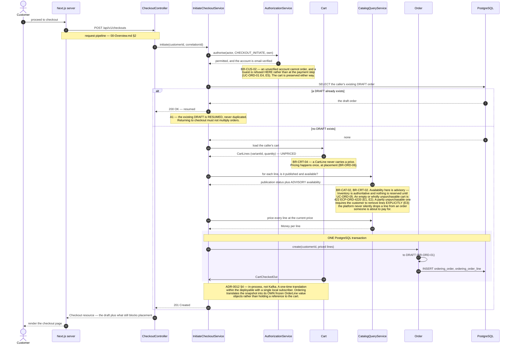
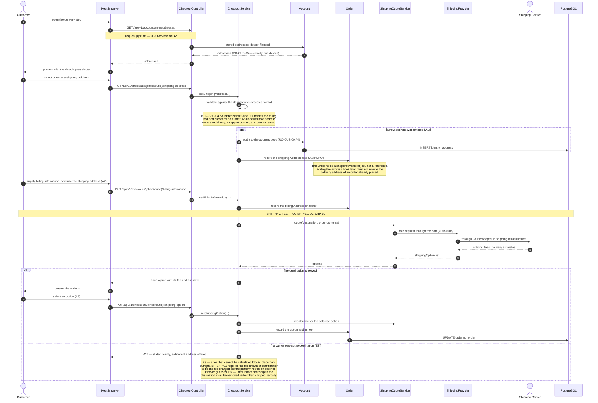
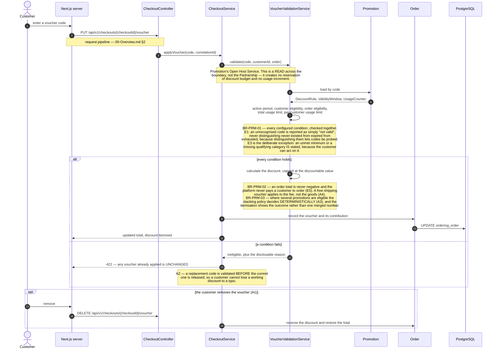
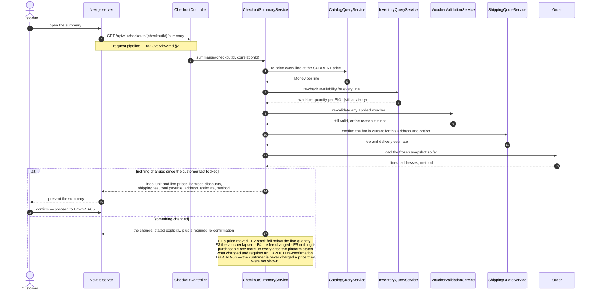
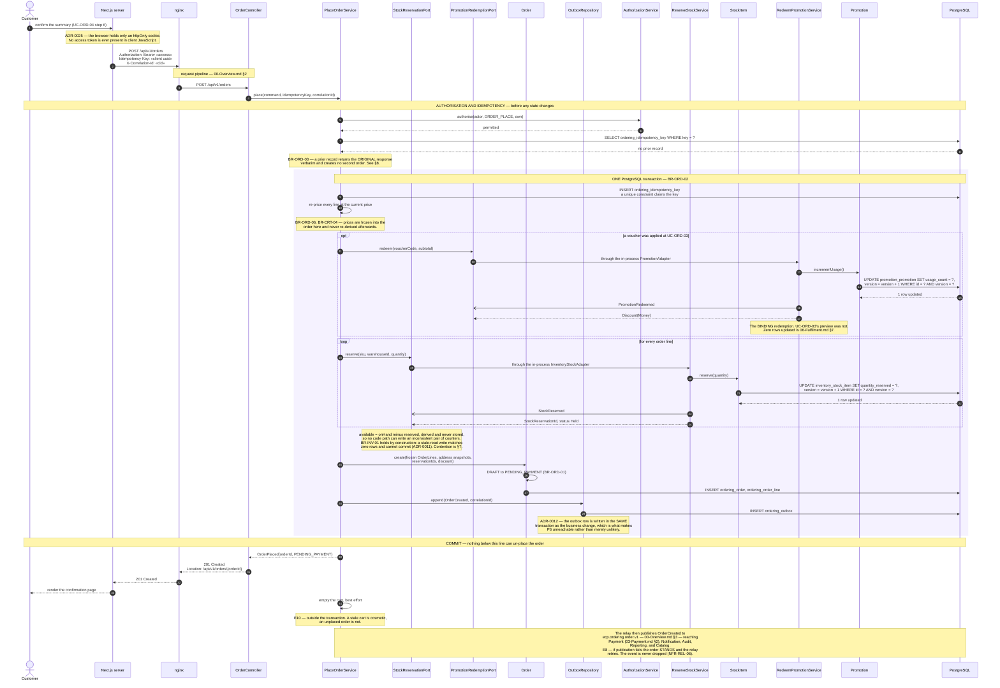
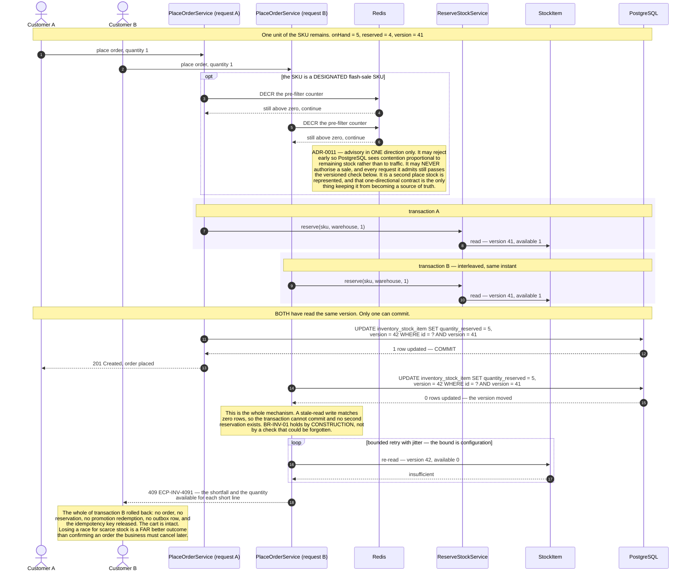
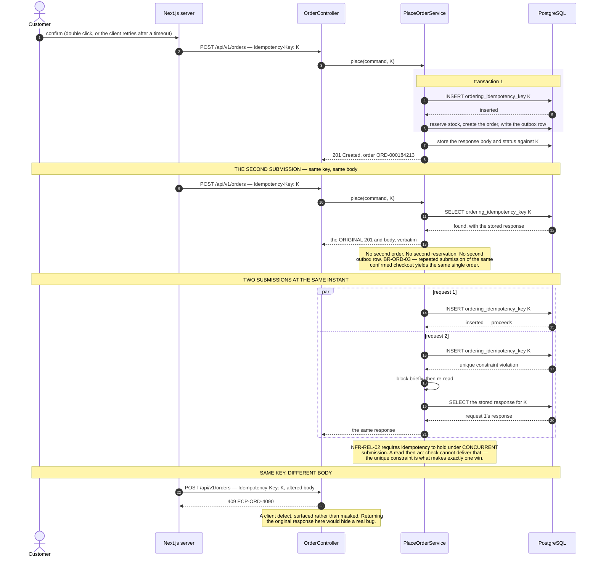
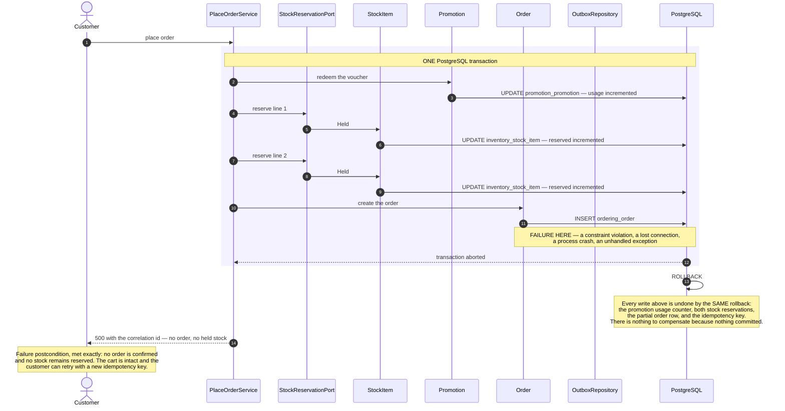
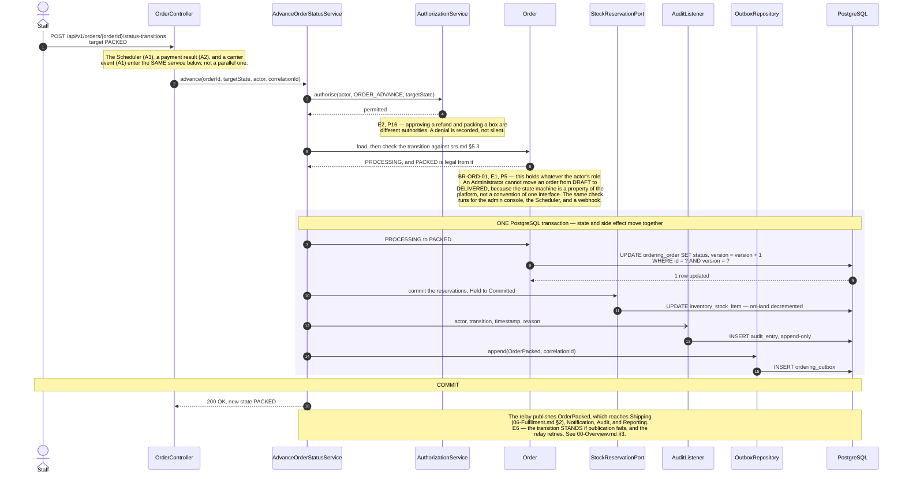
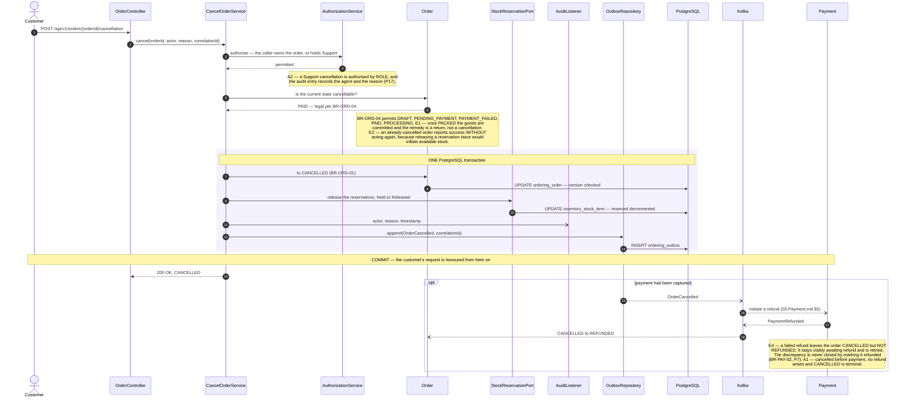

# Sequence Diagrams — Ordering

**Document type:** Backend architecture specification
**Status:** **Proposed**
**Audience:** Backend Engineering, Architecture Review, QA
**Related documents:** [README](./README.md) · [00-Overview](./00-Overview.md) · [UC-ORD](../../../BA-docs/use-cases/06-checkout-order.md) · [Domain Model](../Domain%20Model.md) · [ADR-0011](../../01-system/ADR/ADR-0011-optimistic-locking-reservation-model.md) · [ADR-0012](../../01-system/ADR/ADR-0012-transactional-outbox-and-kafka.md)

---

## 1. Purpose

The transition from intent to obligation. Four diagrams assemble a checkout, one places the order, three show the ways placement fails, and two cover the lifecycle afterwards.

Sections §6 through §9 are the centre of gravity for the whole folder. `P7` (partial failure across order, payment, and inventory) and `P8` (overselling under concentrated demand) are both decided by the ordering of messages inside a single transaction frame, and neither is visible in any static diagram in this repository.

Two rules dominate every diagram below:

- **`BR-ORD-02`** — creating an order and reserving its stock is one indivisible operation.
- **`BR-ORD-01`** — only the transitions in [`srs.md`](../../../BA-docs/srs.md) §5.3 are legal, whoever requests them and however they arrive.

The request pipeline every diagram opens with is drawn in [`00-Overview.md`](./00-Overview.md) §2.

---

## 2. UC-ORD-01 — Initiate Checkout

| | |
|---|---|
| **Use cases** | `UC-ORD-01` main success · `UC-AUD-03` |
| **Business rules** | `BR-CUS-02` · `BR-CRT-02` · `BR-CRT-04` · `BR-CAT-02` · `BR-ORD-01` |
| **Quality** | `NFR-PERF-02` |
| **Decisions** | [ADR-0005](../../01-system/ADR/ADR-0005-clean-architecture-ports-and-adapters.md) · [ADR-0012](../../01-system/ADR/ADR-0012-transactional-outbox-and-kafka.md) |
| **Problems** | `P11` |

**Why no stock is reserved here.** The success postcondition is deliberate: an order exists in `DRAFT` and *nothing is held*. Reserving at the start of checkout would strand inventory for every abandoned session, and `P11` identifies each checkout step as an abandonment point. The cost of deferring is that the availability shown here is advisory and can go stale — which is exactly why `UC-ORD-04` re-checks it and `UC-ORD-05` re-checks it again under a lock.

**Why the cart hand-off is in-process rather than Kafka.** `CartCheckedOut` has one local subscriber, does not need to survive a restart independently of the transaction that raised it, and is consumed once. [`ADR-0012`](../../01-system/ADR/ADR-0012-transactional-outbox-and-kafka.md) §4's rule sends it in-process, and that is what produces the real `ordering → cart` Gradle edge in [Module Dependency Diagram §3.1](../Module%20Dependency%20Diagram.md). Sending it through Kafka would remove the edge but buy nothing, and would make a one-time translation eventually consistent for no reason.

---

## 3. UC-ORD-02 — Provide Shipping and Billing Information

| | |
|---|---|
| **Use cases** | `UC-ORD-02` main success · `UC-SHP-01` · `UC-SHP-02` · `UC-CUS-09` |
| **Business rules** | `BR-CUS-05` · `BR-SHP-01` |
| **Quality** | `NFR-PERF-02` · `NFR-SEC-04` |
| **Decisions** | [ADR-0005](../../01-system/ADR/ADR-0005-clean-architecture-ports-and-adapters.md) |

**Why the fee is quoted through a port.** `FR-SHP-02` is satisfied by a carrier the platform does not control, and `P3` requires that adding a second carrier is an adapter change rather than a project. The `ShippingProvider` port is what makes the `CheckoutService` above indifferent to which carrier answers — nothing in this diagram above the port line changes when the carrier does.

**Why the fee is recalculated more than once.** `BR-SHP-01` states that the fee presented at confirmation is the fee charged. An address change after a quote (E4) invalidates it, so the quote is re-run before the summary, and `UC-ORD-04` confirms it a third time. Quoting once and trusting it is how a customer is charged a different amount from the one they agreed to.

---

## 4. UC-ORD-03 — Apply Voucher at Checkout

| | |
|---|---|
| **Use cases** | `UC-ORD-03` main success · `UC-PRM-02` |
| **Business rules** | `BR-PRM-01` · `BR-PRM-02` · `BR-PRM-03` |
| **Problems** | `P5` |
| **Binding counterpart** | [`06-Fulfilment.md`](./06-Fulfilment.md) §6 |

**Why this validation is not the last one.** Nothing here increments a usage counter, and nothing here is binding. `UC-ORD-05` step 3 re-validates *inside* the placement transaction, because validating once leaves a window in which an exhausted campaign can still be redeemed (E6). The preview and the redemption are different operations against the same aggregate, and [Domain Model §5.2](../Domain%20Model.md) separates them deliberately: the Cart-facing Open Host Service returns a non-binding preview, and only `PromotionRedemptionPort` inside the Partnership binds. The failure that falls out of that gap is [§7 of `06-Fulfilment.md`](./06-Fulfilment.md).

---

## 5. UC-ORD-04 — Review Order Summary

| | |
|---|---|
| **Use cases** | `UC-ORD-04` main success |
| **Business rules** | `BR-CRT-04` · `BR-INV-01` · `BR-ORD-06` · `BR-PRM-01` · `BR-SHP-01` |
| **Quality** | `NFR-PERF-02` |

**Why four checks that all ran a moment ago run again.** Each of them can go stale between the step that set it and this one, and each has a different owner: prices move in Catalog, stock moves in Inventory, campaigns lapse in Promotion, fees move with the address in Shipping. A summary is a promise about a total, and the four inputs to that total are owned by four contexts that do not coordinate.

**Why this is still not enough.** Every check here is a read without a lock, so the summary can go stale the instant it is rendered — E2 says so explicitly. Reserving stock here to prevent that would strand inventory for every customer who reads a summary and leaves. The design accepts a stale summary and resolves it under a lock at placement, which is why `UC-ORD-05` re-runs all of this a *third* time. That is not redundancy; it is the only point at which the check and the state change are atomic.

---

## 6. UC-ORD-05 — Place Order

**The most important diagram in this repository.** Everything inside the tinted frame commits together or not at all, and that single property is what answers `P7` and `P8`.

| | |
|---|---|
| **Use cases** | `UC-ORD-05` main success · `UC-INV-01` · `UC-PRM-03` · `UC-AUD-03` |
| **Business rules** | `BR-ORD-01` · `BR-ORD-02` · `BR-ORD-03` · `BR-ORD-06` · `BR-INV-01` · `BR-PRM-01` |
| **Quality** | `NFR-REL-01` · `NFR-REL-02` · `NFR-REL-06` · `NFR-PERF-02` |
| **Decisions** | [ADR-0005](../../01-system/ADR/ADR-0005-clean-architecture-ports-and-adapters.md) · [ADR-0011](../../01-system/ADR/ADR-0011-optimistic-locking-reservation-model.md) · [ADR-0012](../../01-system/ADR/ADR-0012-transactional-outbox-and-kafka.md) · [ADR-0016](../../01-system/ADR/ADR-0016-jwt-refresh-rotation-rbac.md) · [ADR-0025](../../01-system/ADR/ADR-0025-httponly-cookie-session.md) |
| **Problems** | `P6` · `P7` · `P8` |
| **Failure paths** | §7 · §8 · §9 |

### 6.1 Why the ordering inside the frame is what it is

**The idempotency claim comes first, and inside the transaction.** Reading the key outside the transaction (the `SELECT` above the frame) is a fast path, not the guarantee — two simultaneous requests can both read "no prior record". The guarantee is the `INSERT` against a unique constraint *inside* the frame: exactly one of the two commits, and the loser retries and finds the original. `NFR-REL-02` requires idempotency to hold under concurrent submission, which a read-then-act check cannot provide.

**Re-pricing precedes reservation.** A price is cheap to compute and cannot fail on contention; a reservation is expensive and can. Doing the fallible, contended work last means a re-price that changes the total aborts before any stock has been held.

**Promotion redemption precedes stock reservation.** Both are optimistically locked and either can lose. Promotion is redeemed first because a promotion aggregate is a *single row* under campaign-wide contention, while stock reservations are per-SKU and per-warehouse — losing the cheaper, more contended race first avoids holding N stock reservations open while waiting to discover that the voucher is exhausted.

**Order creation precedes the outbox write, and both are inside.** The order must exist before an event can name its id. And the outbox row must be inside, because [`ADR-0012`](../../01-system/ADR/ADR-0012-transactional-outbox-and-kafka.md)'s entire value is that the fact and its announcement share a commit. Move the outbox `INSERT` one line below the frame and `P6` becomes reachable: an order exists that Payment, Notification, and Reporting never hear about.

**Payment is not in the frame at all.** It cannot be — the provider is a party the platform does not control and its call can hang for as long as it likes. Holding a database transaction open across a third-party network call would convert every provider slowdown into database connection exhaustion. That is why `OrderCreated` leaves through the outbox and Payment is a separate transaction reached only after this one committed, and it is why an order can legitimately sit in `PENDING_PAYMENT`.

**What the two ports buy.** [`ADR-0005`](../../01-system/ADR/ADR-0005-clean-architecture-ports-and-adapters.md) §4 gives Ordering ownership of `StockReservationPort` and `PromotionRedemptionPort` even though Inventory and Promotion satisfy them. Today both adapters are in-process and join this transaction. After a future extraction they become Saga-capable adapters against remote services, and *this diagram is the thing that changes* — the frame stops being one transaction and becomes a compensating-action sequence. Naming that boundary now is what makes the extraction a boundary-preserving change rather than a rewrite, and [Module Dependency Diagram §3.1](../Module%20Dependency%20Diagram.md) explains why the adapters live in `ordering.infrastructure` rather than the other way round.

---

## 7. Failure — Two Placements Race for the Last Units

`P8`, in the only form it actually occurs. This is not an error case: it is the ordinary outcome of a flash sale, and it happens most at peak revenue.

| | |
|---|---|
| **Use case** | `UC-ORD-05` E1, E2 · `UC-INV-01` E1 |
| **Business rules** | `BR-INV-01` · `BR-INV-02` |
| **Quality** | `NFR-REL-03` · `NFR-SCAL-06` |
| **Decisions** | [ADR-0011](../../01-system/ADR/ADR-0011-optimistic-locking-reservation-model.md) · [ADR-0015](../../01-system/ADR/ADR-0015-redis-cache-and-rate-limiting.md) |
| **Problems** | `P8` |

**Why optimistic locking rather than a lock or a queue.** Pessimistic row locks serialise every checkout on a hot SKU, including the many that would have succeeded, and hold a lock across application logic. A queue makes placement asynchronous, which breaks the synchronous confirmation the customer is waiting for. Optimistic locking makes the *uncontended* path — the overwhelming majority — cost nothing, and pays only where two writers genuinely collide. [`ADR-0011`](../../01-system/ADR/ADR-0011-optimistic-locking-reservation-model.md) §3 weighs all three.

**What this costs, stated honestly.** Retry storms under single-SKU contention are the mechanism's worst case, and they coincide exactly with peak revenue. The Redis pre-filter mitigates it for SKUs someone *designated* in advance; an unanticipated viral product gets no such protection and will see elevated retry-exhaustion rejections. Retry exhaustion must therefore be a monitored signal, not a silent `500`. And the rejection above is a real conversion loss suffered by a customer who had already committed intent — which is why the response distinguishes `ECP-INV-4091` ("someone took the last one, retrying may work") from a generic checkout error. [Integration Contract §4.4](../../04-shared/Integration%20Contract.md) makes that an expected outcome under load rather than a failure.

**Why `available` is derived and never stored.** Storing `availableQuantity` alongside `quantityOnHand` and `quantityReserved` creates three numbers that can disagree. Deriving it means no code path can write an inconsistent pair, and the version check protects the one authoritative row.

---

## 8. Failure — Duplicate Submission

| | |
|---|---|
| **Use case** | `UC-ORD-05` E4 |
| **Business rules** | `BR-ORD-03` |
| **Quality** | `NFR-REL-02` |
| **Decisions** | [ADR-0003](../../01-system/ADR/ADR-0003-rest-api-style.md) · [ADR-0011](../../01-system/ADR/ADR-0011-optimistic-locking-reservation-model.md) |
| **Problems** | `P7` |

**Why idempotency is a separate mechanism from optimistic locking.** They solve different problems and neither substitutes for the other. Optimistic locking prevents *overselling* — two writers changing the same row from the same read. It does nothing about a single customer submitting twice, because both submissions are perfectly legal writes against different rows. `BR-ORD-03` needs a claim on the *intention*, which is what the `Idempotency-Key` and its unique constraint provide. [`ADR-0011`](../../01-system/ADR/ADR-0011-optimistic-locking-reservation-model.md) §4 states this separation explicitly.

**Why the key is scoped rather than global.** [`ADR-0003`](../../01-system/ADR/ADR-0003-rest-api-style.md) §4 requires `Idempotency-Key` on order placement and payment initiation only — the operations whose repetition is a business defect. Applying it everywhere would impose a storage and retention cost on every `GET` and every naturally idempotent `PUT` for no benefit. Keys are retained at least 24 hours; one reused after expiry is treated as new.

---

## 9. Failure — Something Breaks Between Reservation and Order Creation

The case `BR-ORD-02` exists for, and the clearest statement of `P7` in the system.

| | |
|---|---|
| **Use case** | `UC-ORD-05` E5 |
| **Business rules** | `BR-ORD-02` · `BR-INV-02` |
| **Quality** | `NFR-REL-01` |
| **Decisions** | [ADR-0002](../../01-system/ADR/ADR-0002-modular-monolith-deployment-unit.md) · [ADR-0011](../../01-system/ADR/ADR-0011-optimistic-locking-reservation-model.md) |
| **Problems** | `P7` |

**Why this needs no compensating logic.** This is the payoff for [`ADR-0002`](../../01-system/ADR/ADR-0002-modular-monolith-deployment-unit.md)'s choice of a modular monolith over services. Ordering, Inventory, and Promotion write to one PostgreSQL instance in one transaction, so the database's rollback *is* the compensation. `UC-INV-01` E3 needs no code at all. Split these three contexts into separate services with separate databases and this diagram becomes a saga: a reservation that must be explicitly released, a promotion counter that must be explicitly decremented, and a compensating action for each that can itself fail — with a new class of bug where the compensation is lost and stock stays held forever.

**What this costs later.** [`ADR-0002`](../../01-system/ADR/ADR-0002-modular-monolith-deployment-unit.md) commits to keeping extraction a boundary-preserving change, and the ports in §6 are the seam. But the honest statement is that extracting Inventory or Promotion turns this rollback into a saga, and *that* is the real cost of extraction — not the wiring. The ports make it tractable; they do not make it free. [`Module Dependency Diagram.md`](../Module%20Dependency%20Diagram.md) §3.1 records the same trade-off from the dependency side.

**Why a partial failure is worse than a total one.** An order recorded without stock is a promise the warehouse cannot keep; stock held without an order is invisible loss that no report shows. Both are resolved by hand, and `P7` names the cost. A clean `500` that the customer can retry is strictly better than either.

---

## 10. UC-ORD-10 — Advance Order Status

| | |
|---|---|
| **Use cases** | `UC-ORD-10` main success · `UC-INV-03` · `UC-AUD-01` |
| **Business rules** | `BR-ORD-01` · `BR-INV-02` · `BR-AUD-01` · `BR-AUD-02` |
| **Quality** | `NFR-REL-01` · `NFR-OBS-01` |
| **Problems** | `P5` · `P7` · `P17` |

**Why the side effect is inside the frame.** E3 is unambiguous: a `PROCESSING → PACKED` that advances the order but fails to commit the reservation leaves stock the platform believes it still holds. That is `P7` again in a quieter form — no customer sees it, and no report shows it, which makes it worse rather than better. State and side effect move together or neither moves.

**Why the audit entry is inside too.** E4 states that a transition whose audit entry cannot be written is *not applied*. This is the one place where an audit failure blocks a business operation, and it is deliberate: `P17` exists because an unattributable change to an order is not acceptable at any price. Everywhere else audit is a Kafka consumer and cannot block anything.

**Why one service handles four kinds of trigger.** Staff, the Scheduler, a payment result, and a carrier webhook all advance orders. Routing them through one application service is what makes `BR-ORD-01` hold uniformly — `P5`'s requirement that no rule lives only behind a human-initiated entry point. The `Scheduler (Time)` actor in [Solution Architecture §4](../../01-system/Solution%20Architecture.md) is a first-class trigger for exactly this reason.

**Concurrency.** E5 is handled by the same `@Version` mechanism as stock: two actors advancing one order both read the same version, one commits, and the other is re-evaluated against the new state and declines as E1 if it is no longer legal. A bulk advance (A4) evaluates and applies each order independently, so one illegal transition neither fails the batch nor leaves the rest half-applied.

---

## 11. UC-ORD-08 — Cancel Order

| | |
|---|---|
| **Use cases** | `UC-ORD-08` main success · `UC-INV-02` · `UC-PAY-06` |
| **Business rules** | `BR-ORD-01` · `BR-ORD-04` · `BR-INV-02` · `BR-PAY-02` |
| **Quality** | `NFR-REL-01` |
| **Problems** | `P7` |

**Why the refund is asynchronous but the release is not.** Releasing a reservation is a local row update that belongs in the same transaction as the state change — E3 makes the priority explicit: if the release fails the order is *still* cancelled, because the customer's request is honoured, and the release is retried and escalated. Held-but-unreleasable stock is invisible loss. The refund, by contrast, crosses to a provider the platform does not control, so it takes the same route as every other provider interaction: an event out, a result back, and an order state that reflects reality rather than intention.

**Why a cancellation can lose a race.** E5 — a cancellation and a fulfilment advance can arrive together. Both go through the version check on `Order`, exactly one applies, and if the advance wins and reaches `PACKED` the cancellation fails as E1 and the customer is directed to request a return. This is the same mechanism as §7 and §10, applied a third time: one aggregate, one version column, one winner.

**Partial cancellation** (A4) releases only the affected lines' reservations, adjusts the order total, and refunds any excess capture — bounded by `BR-PAY-02`, which caps cumulative refunds at the amount actually captured.
