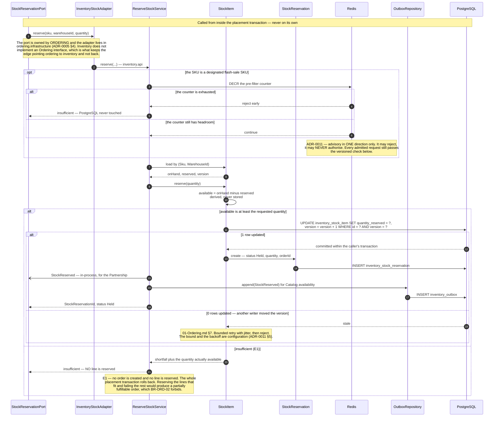
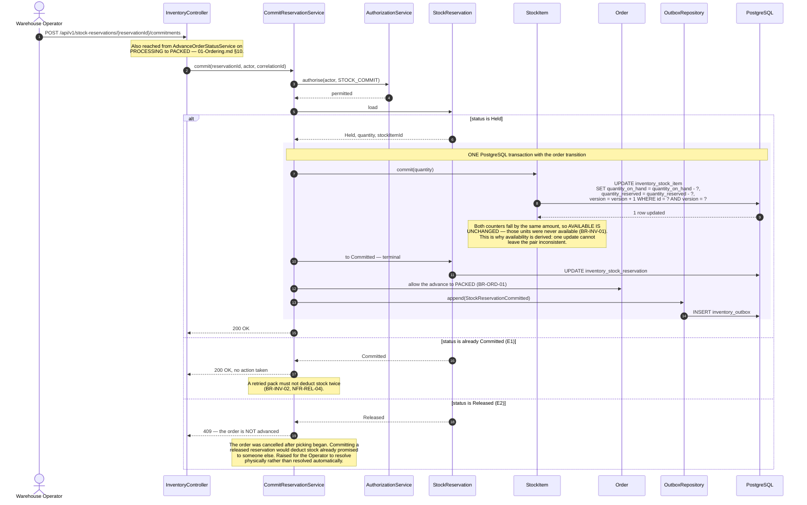
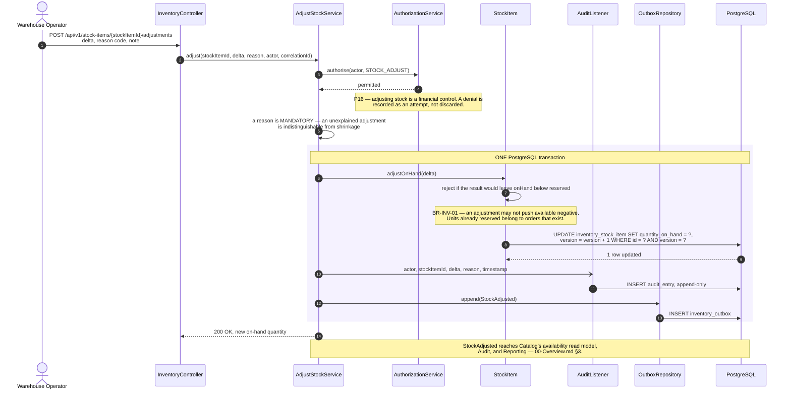
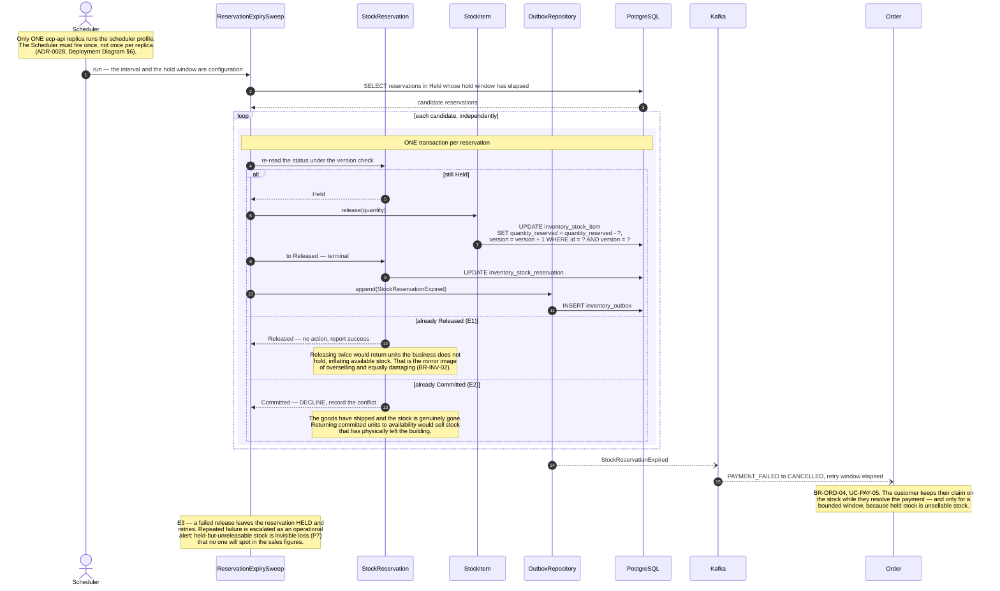

# Sequence Diagrams — Inventory

**Document type:** Backend architecture specification
**Status:** **Proposed**
**Audience:** Backend Engineering, Architecture Review, QA
**Related documents:** [README](./README.md) · [01-Ordering](./01-Ordering.md) · [UC-INV](../../../BA-docs/use-cases/04-inventory.md) · [ADR-0011](../../01-system/ADR/ADR-0011-optimistic-locking-reservation-model.md)

---

## 1. Purpose

Inventory is one of the two **Core** subdomains, and the reservation lifecycle is the reason. Every diagram here turns on one aggregate, `StockItem`, and one mechanism: a `@Version` column that turns a stale read into zero updated rows.

The reservation states are `Held`, `Committed`, and `Released` ([Domain Model §8.3](../Domain%20Model.md)). `BR-INV-02` makes each transition terminal — a reservation that has been committed can never be released, and one that has been released can never be committed. Almost every exception flow below is a consequence of that rule.

The one thing Inventory deliberately does **not** know is that Ordering exists. [Module Dependency Diagram §3.1](../Module%20Dependency%20Diagram.md) fixes the direction: `ordering → inventory`, never the reverse, because a Core context must not learn about a downstream one in order to protect its own invariant.

---

## 2. UC-INV-01 — Reserve Stock for an Order

The inside view of the `StockReservationPort` call in [`01-Ordering.md`](./01-Ordering.md) §6. It has no HTTP entry point of its own: the primary actor is Checkout & Order, and this always runs inside the caller's transaction.

| | |
|---|---|
| **Use cases** | `UC-INV-01` main success |
| **Business rules** | `BR-INV-01` · `BR-INV-02` |
| **Quality** | `NFR-REL-03` · `NFR-SCAL-06` |
| **Decisions** | [ADR-0010](../../01-system/ADR/ADR-0010-jpa-write-model-jdbc-read-models.md) · [ADR-0011](../../01-system/ADR/ADR-0011-optimistic-locking-reservation-model.md) · [ADR-0015](../../01-system/ADR/ADR-0015-redis-cache-and-rate-limiting.md) |
| **Problems** | `P8` |
| **Contention path** | [`01-Ordering.md`](./01-Ordering.md) §7 |

**Why the same event goes out twice, by two transports.** `StockReserved` is published in-process *and* through the outbox to Kafka, and [`ADR-0012`](../../01-system/ADR/ADR-0012-transactional-outbox-and-kafka.md) §4 lists it in both rows deliberately. The in-process copy serves the Partnership participants inside the deployable. The Kafka copy feeds Catalog's availability read model, which is a separate deployable concern and must survive a restart. Sending only the in-process event would leave the storefront's availability display stale after any process bounce; sending only the Kafka event would make the Partnership eventually consistent, which `BR-ORD-02` forbids.

**Why multi-warehouse lines are independent reservations.** There is no cross-warehouse aggregate. A line drawn from two warehouses produces two `StockReservation` rows, and the `Order` side holds a plain set of `(StockItemId, StockReservationId)` references ([Domain Model §8.3, §8.5](../Domain%20Model.md)). Partial commit and partial release are therefore legal outcomes — which is what makes `UC-INV-03` A2 (partial fulfilment) expressible rather than approximated.

---

## 3. UC-INV-03 — Commit Reserved Stock on Fulfilment

| | |
|---|---|
| **Use cases** | `UC-INV-03` main success · `UC-ORD-10` |
| **Business rules** | `BR-INV-01` · `BR-INV-02` · `BR-INV-03` · `BR-ORD-01` |
| **Quality** | `NFR-REL-01` · `NFR-REL-04` |
| **Problems** | `P7` |

**Why the commitment shares the order's transaction.** E4 states it plainly: if the commitment fails, the reservation stays `Held` **and the order does not advance**. Order state and stock state move together or not at all. An order that reached `PACKED` on a failed commitment leaves the platform believing it still holds stock that has physically left — `P7` in the form nobody notices, because no customer complains and no report shows it.

**The physical shortfall case.** E3 is the one where the platform's figure and reality have already diverged before this diagram starts: the shelf holds fewer units than the record. There is no software fix, and the design does not pretend otherwise. The Operator records an adjustment (§4), which makes the divergence **visible and attributable** rather than silently absorbed, and the order is cancelled or partially fulfilled with its reservation released accordingly. `P17`'s requirement is that the discrepancy has a name and an author, not that it never happens.

---

## 4. UC-INV-04 — Adjust Inventory

| | |
|---|---|
| **Use cases** | `UC-INV-04` · `UC-AUD-01` |
| **Business rules** | `BR-INV-01` · `BR-INV-03` · `BR-AUD-01` |
| **Quality** | `NFR-OBS-01` |
| **Problems** | `P16` · `P17` |

**Why an adjustment cannot push availability negative.** `quantityReserved` represents units already promised to orders that exist. An adjustment that took `onHand` below `reserved` would make `available` negative and would mean the platform had sold goods it cannot supply — arriving at `P8`'s outcome through the back door rather than through a race. The aggregate rejects it, and the shortfall is resolved by cancelling orders explicitly (`UC-ORD-08`), which is visible, rather than by a number quietly going negative, which is not.

---

## 5. Failure — A Reservation Outlives Its Order

The Scheduler as a first-class trigger. Without this sweep, one abandoned failed payment holds stock indefinitely, and after a flash sale that is a large number of units.

| | |
|---|---|
| **Use cases** | `UC-INV-02` A1 · `UC-PAY-05` · `UC-ORD-08` |
| **Business rules** | `BR-INV-01` · `BR-INV-02` · `BR-ORD-04` · `BR-CRT-01` |
| **Quality** | `NFR-REL-04` |
| **Decisions** | [ADR-0011](../../01-system/ADR/ADR-0011-optimistic-locking-reservation-model.md) · [ADR-0028](../../01-system/ADR/ADR-0028-deployment-topology-containerisation.md) |
| **Problems** | `P5` · `P7` · `P8` |

**Why each reservation gets its own transaction.** A sweep that processed the whole batch in one transaction would let a single conflicting reservation roll back every other release in the batch, and would hold locks across an unbounded number of rows. Per-reservation transactions mean one `Committed` reservation (E2) declines on its own and the rest still return to availability.

**Why the hold window is not an architectural constant.** Too long and inventory is stranded by dead orders; too short and a legitimately slow checkout is cancelled underneath the customer. [`ADR-0011`](../../01-system/ADR/ADR-0011-optimistic-locking-reservation-model.md) §5 makes it a business setting, and `BR-CRT-01` already establishes that expiry windows are configurable. The diagram shows *that* the sweep happens, never how often.

**Why the Scheduler is drawn as an actor.** [Solution Architecture §4](../../01-system/Solution%20Architecture.md) lists `Scheduler (Time)` in the Actors table, not as an implementation detail, because `P5` requires that no rule live only behind a human-initiated entry point. Expiry is a business rule, and it enters the domain through the same application service and the same authorisation model as an API call.
