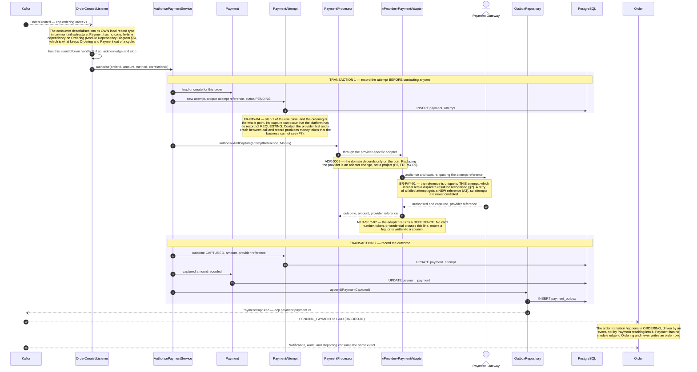
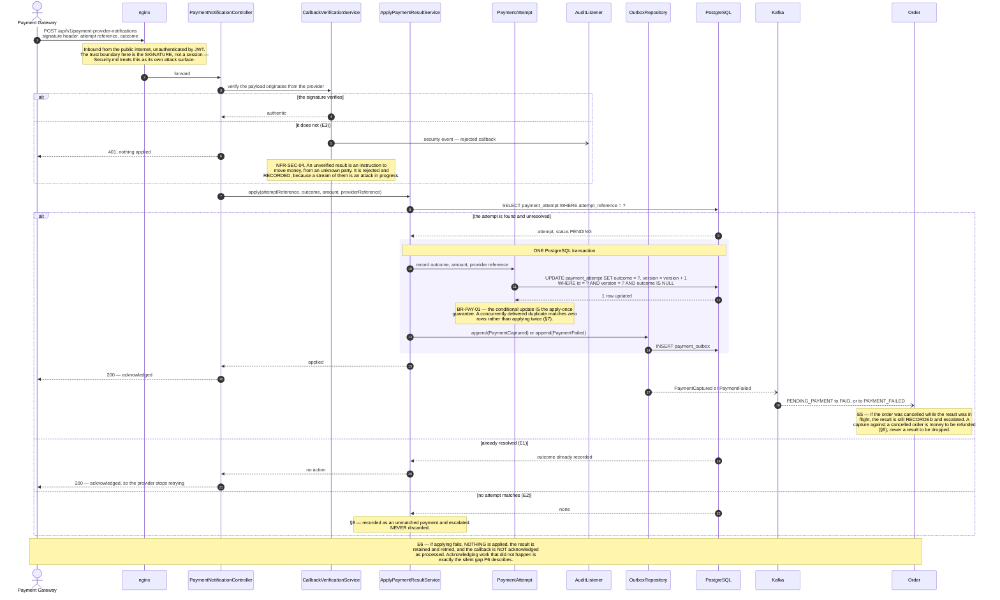
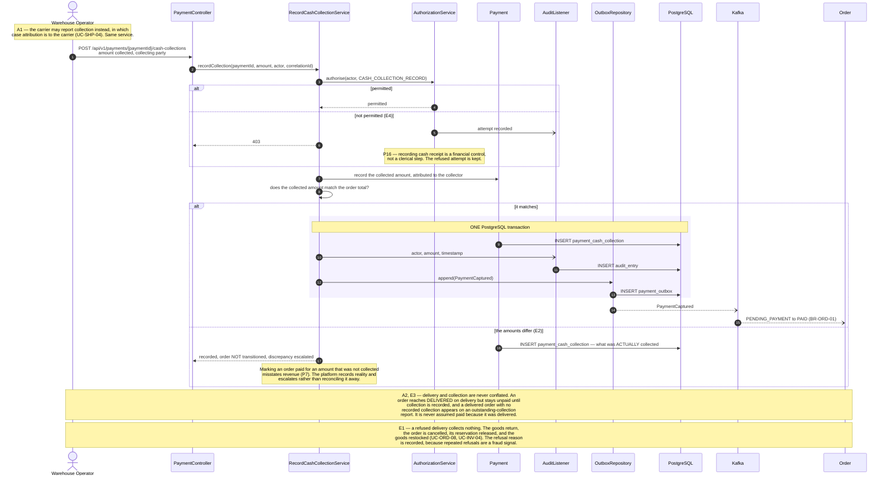
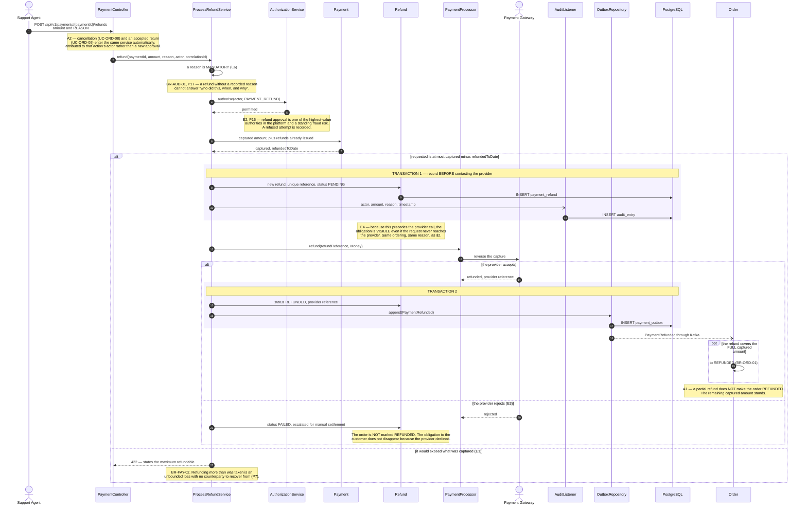
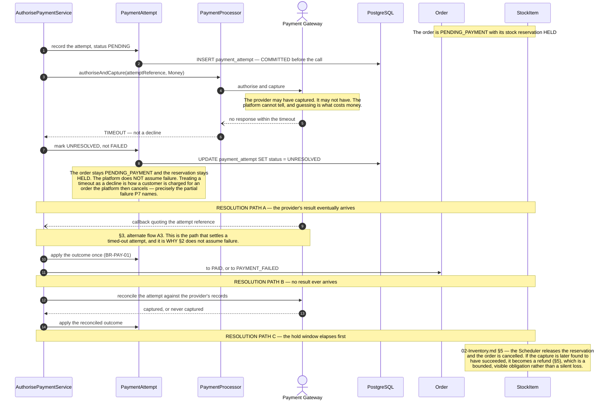
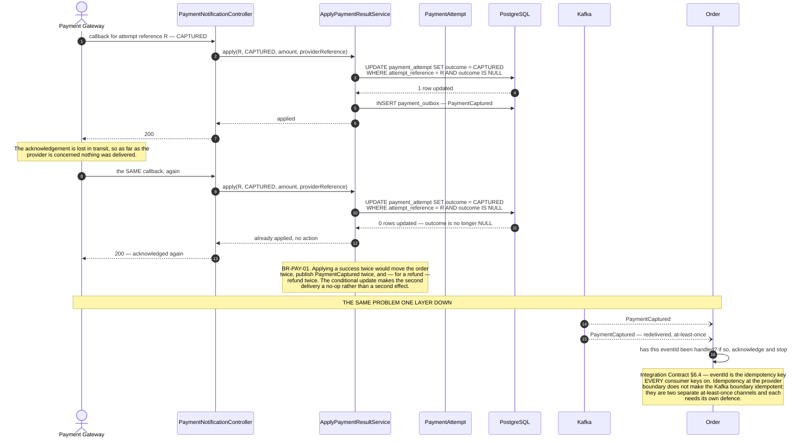
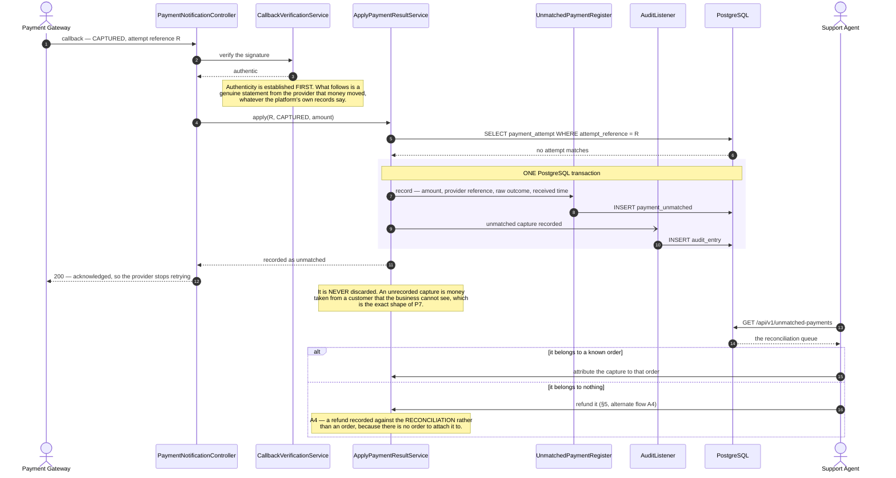

# Sequence Diagrams — Payment

**Document type:** Backend architecture specification
**Status:** **Proposed**
**Audience:** Backend Engineering, Architecture Review, QA, Finance
**Related documents:** [README](./README.md) · [01-Ordering](./01-Ordering.md) · [UC-PAY](../../../BA-docs/use-cases/07-payment.md) · [Security](../../01-system/Security.md) · [ADR-0012](../../01-system/ADR/ADR-0012-transactional-outbox-and-kafka.md)

---

## 1. Purpose

Where the platform touches real money. Every use case here is bounded by a party the platform does not control, and that single fact shapes the whole domain.

Three rules run through every diagram below:

- **`BR-PAY-01`** — every provider result is applied **at most once**, however many times it arrives. Providers retry until acknowledged, so duplicate delivery is routine rather than exceptional.
- **`BR-PAY-02`** — cumulative refunds are capped at the amount actually captured.
- **`NFR-SEC-07`** — no card number, token, or provider credential enters a log, an event payload, or a database column. A payment event carries a provider *reference*, never an instrument.

And one distinction that the architecture is built around: **a provider that does not answer has not declined.** Treating a timeout as a decline is how an order gets cancelled after the customer was charged, and §6 is that case drawn in full.

`P3` applies with equal weight. No diagram below names a provider: `FR-PAY-09` requires payment to be expressed independently of any one of them, which is what the `PaymentProcessor` port is for.

Arrow and frame conventions: [`README.md`](./README.md) §3.1–§3.2.

---

## 2. UC-PAY-02 — Authorise Online Payment

| | |
|---|---|
| **Use cases** | `UC-PAY-02` main success · `UC-ORD-05` step 7 |
| **Business rules** | `BR-PAY-01` · `BR-ORD-01` |
| **Quality** | `NFR-REL-01` · `NFR-REL-04` · `NFR-AVAIL-03` · `NFR-SEC-07` |
| **Decisions** | [ADR-0005](../../01-system/ADR/ADR-0005-clean-architecture-ports-and-adapters.md) · [ADR-0012](../../01-system/ADR/ADR-0012-transactional-outbox-and-kafka.md) |
| **Problems** | `P3` · `P7` |
| **Failure paths** | §6 · §7 · §8 |

**Why the attempt is recorded before the provider is called, and in its own transaction.** If the record shared a transaction with the provider call, a rollback would erase the evidence that a call was made — and the call cannot be rolled back. Recording first, and committing that record, means the worst case is an attempt with an unknown outcome, which §6 shows is recoverable. The alternative — a capture the platform has no record of requesting — is not.

**Why the amount is verified against the order total.** E6: an authorised amount differing from the order total does **not** transition the order to `PAID`. It records the discrepancy and escalates. Accepting a mismatch means either the customer was overcharged or revenue was under-collected, and both are found later by a human either way. Finding them now is cheaper.

**Why separate authorisation and capture is an adapter concern.** A2: where a provider separates the two, authorisation holds funds and capture occurs on dispatch, and an uncaptured authorisation is released within the provider's window. That difference lives entirely behind the `PaymentProcessor` port. Nothing above the port line in the diagram changes.

**A zero-total order never reaches this diagram.** `UC-ORD-05` A3: a fully discounted order moves straight to `PAID` inside the placement transaction. Cash On Delivery (A1) also skips it, and is settled at §4.

---

## 3. UC-PAY-03 — Handle Payment Gateway Result

The inbound direction, and the only diagram in the folder where the **primary actor is an external party**.

| | |
|---|---|
| **Use cases** | `UC-PAY-03` main success |
| **Business rules** | `BR-PAY-01` · `BR-PAY-02` · `BR-ORD-01` |
| **Quality** | `NFR-REL-04` · `NFR-REL-06` · `NFR-SEC-04` |
| **Decisions** | [ADR-0003](../../01-system/ADR/ADR-0003-rest-api-style.md) · [ADR-0012](../../01-system/ADR/ADR-0012-transactional-outbox-and-kafka.md) |
| **Problems** | `P6` · `P7` |

**Why this is a REST endpoint and not a queue.** The provider chooses the transport, and it chooses HTTP. The design consequence is that the endpoint must be idempotent, must be fast (providers time out and retry), and must acknowledge only after durably recording the result — which is why the outbox row is inside the transaction and the `200` is returned after the commit.

**Why the conditional update carries the idempotency rather than a prior read.** A read-then-act check has a window: two duplicate callbacks delivered simultaneously can both read `PENDING`. The `WHERE ... AND outcome IS NULL` clause closes it, in exactly the same way the `@Version` clause closes the overselling window in [`01-Ordering.md`](./01-Ordering.md) §7. The same mechanism, applied to a different invariant.

**Why a contradictory result is never overwritten.** E4: a result that contradicts one already applied records the conflict and escalates. Deciding automatically which of two contradictory financial statements is true is precisely what a human reconciliation is for, and an automatic rule here would be wrong in whichever direction it chose.

---

## 4. UC-PAY-04 — Settle Cash On Delivery Payment

| | |
|---|---|
| **Use cases** | `UC-PAY-04` main success · `UC-SHP-06` · `UC-AUD-01` |
| **Business rules** | `BR-PAY-03` · `BR-ORD-01` · `BR-AUD-01` |
| **Quality** | `NFR-OBS-01` |
| **Problems** | `P7` · `P16` · `P17` |

**Why Cash On Delivery has its own diagram at all.** It is the one payment path with no provider in it, and therefore no signature, no attempt reference, and no callback. The controls that the provider flow gets for free — a reference that makes duplicates detectable, a signature that authenticates the counterparty — have to be replaced by authorisation and audit, which is why both appear explicitly above. `BR-PAY-03` also confines the method to where it is economic, because it carries the highest collection risk of any method the platform offers.

---

## 5. UC-PAY-06 — Process Refund

| | |
|---|---|
| **Use cases** | `UC-PAY-06` main success · `UC-ORD-08` · `UC-ORD-09` |
| **Business rules** | `BR-PAY-01` · `BR-PAY-02` · `BR-ORD-01` · `BR-AUD-01` |
| **Quality** | `NFR-REL-01` · `NFR-REL-04` · `NFR-OBS-01` |
| **Problems** | `P7` · `P16` · `P17` |

**Why an audit failure does not block a refund, when it blocks a status advance.** [`01-Ordering.md`](./01-Ordering.md) §10 refuses a transition whose audit entry cannot be written; here, E7 says the refund **stands** and the missing entry is escalated as a compliance exception. The difference is whether anything external has already happened. A status transition is entirely internal and can safely be refused. A refund has already moved the customer's money, and reversing it to satisfy a logging failure would be worse than the gap it fixes. The use cases state both positions explicitly, and the asymmetry is deliberate rather than an inconsistency.

**Cash On Delivery refunds** (A3) have no provider capture to reverse. The refund is recorded and settled by the business's own process, and the order still reaches `REFUNDED` once settled — which is why the refund record, not the provider call, is what the order state follows.

---

## 6. Failure — The Provider Does Not Answer

**A timeout is not a decline.** This is the single most consequential distinction in the payment domain, and the reason `UC-PAY-02` E2 exists.

| | |
|---|---|
| **Use cases** | `UC-PAY-02` E2, E3 · `UC-PAY-03` A3 |
| **Business rules** | `BR-PAY-01` · `BR-ORD-01` · `BR-INV-02` |
| **Quality** | `NFR-REL-04` · `NFR-AVAIL-03` |
| **Problems** | `P7` |

**The distinction between E2 and E3.** E3 — the provider is *unreachable*, so no request was made — is genuinely different and genuinely safer: no attempt reaches the provider, the order simply stays `PENDING_PAYMENT`, and the customer is told to retry shortly. Platform state is not corrupted by a provider outage (`NFR-AVAIL-03`). E2 — the request went out and no answer came back — is the hard case, because the platform now holds a claim it cannot evaluate. The design's answer is to make that uncertainty *explicit and durable* (`UNRESOLVED`) rather than collapsing it to a guess.

**Why the reservation is held rather than released.** Releasing on timeout would free stock that may belong to an order that was in fact paid. Holding it costs the business a strandable unit for a bounded window; releasing it costs an oversell and a cancelled paid order. `ADR-0011`'s hold window bounds the first, and nothing bounds the second.

**Why every resolution path converges on the same three services.** Whether the result arrives by callback, by reconciliation, or by expiry, it is applied through `ApplyPaymentResultService` and the same conditional update. There is no second code path that can apply a result differently, which is what makes `BR-PAY-01` hold across all three.

---

## 7. Failure — The Same Result Is Delivered Twice

Routine, not exceptional. Providers retry until acknowledged.

| | |
|---|---|
| **Use cases** | `UC-PAY-03` E1 |
| **Business rules** | `BR-PAY-01` |
| **Quality** | `NFR-REL-04` |
| **Decisions** | [Integration Contract §6.4](../../04-shared/Integration%20Contract.md) |

**Why acknowledging a duplicate with `200` is correct.** A provider that receives an error keeps retrying, and an endpoint that returns `409` on a duplicate turns a harmless repeat into an escalating retry storm. The contract is "apply once, acknowledge always". The one case that must **not** be acknowledged is E6 — a result the platform genuinely failed to record — because there the retry is exactly what is wanted.

---

## 8. Failure — A Capture With No Order

The case that must never be discarded.

| | |
|---|---|
| **Use cases** | `UC-PAY-02` E4 · `UC-PAY-03` E2, E5 |
| **Business rules** | `BR-PAY-01` · `BR-PAY-02` |
| **Quality** | `NFR-OBS-01` |
| **Problems** | `P7` · `P17` |

**Why acknowledging is right even though nothing was applied.** The provider's obligation ends when it has delivered the result, and refusing to acknowledge would produce an indefinite retry loop that fixes nothing — the attempt will not appear by being told about again. Durably recording the capture and acknowledging is what converts an invisible loss into a visible work item.

**Why a capture against a cancelled order lands here too.** E5: the order was cancelled while the result was in flight. The result is recorded and escalated rather than dropped, because a capture against a cancelled order is money to be refunded (§5), not a result to be ignored. Both routes end in the same reconciliation queue, which is deliberate — it is the one place where money the platform holds but cannot explain is visible in a single list.
