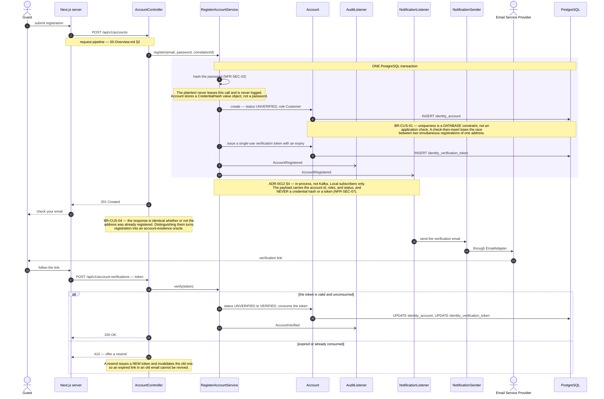
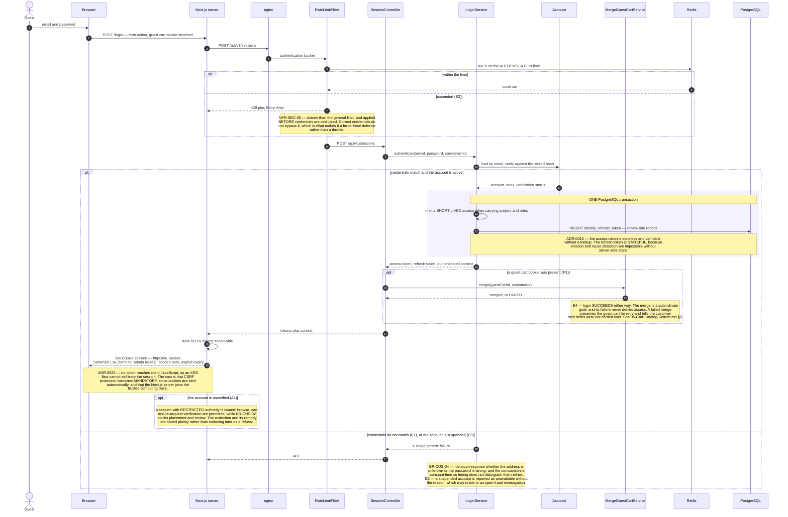
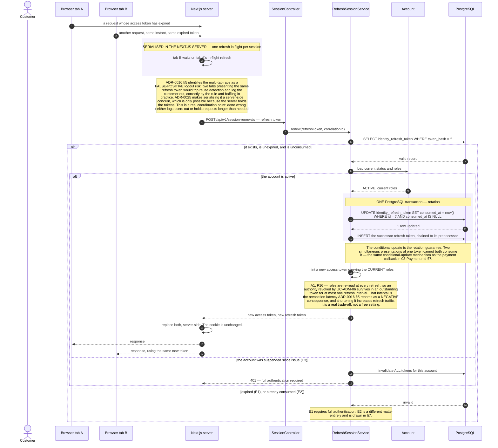
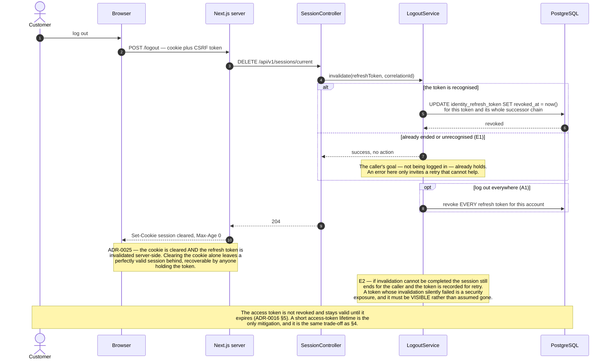
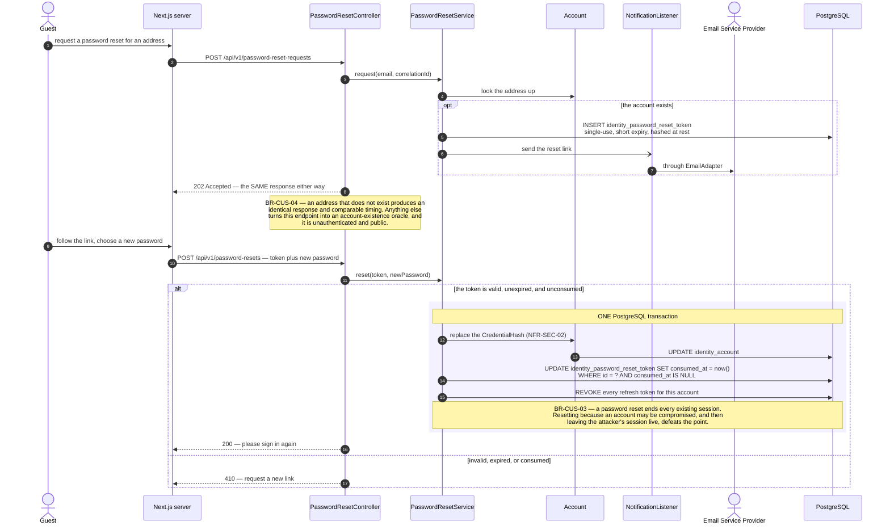
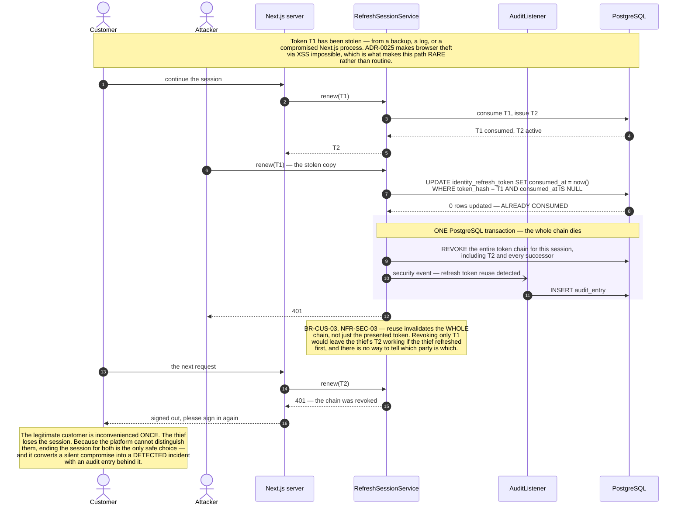
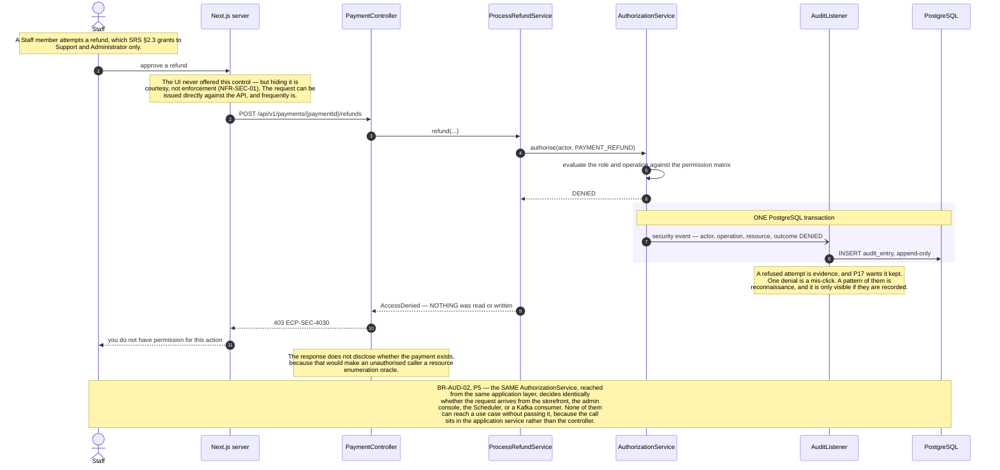

# Sequence Diagrams — Identity & Access

**Document type:** Backend architecture specification
**Status:** **Proposed**
**Audience:** Backend Engineering, Frontend Engineering, Security Review
**Related documents:** [README](./README.md) · [UC-CUS](../../../BA-docs/use-cases/01-customer-identity.md) · [UC-AUD](../../../BA-docs/use-cases/14-audit-access-control.md) · [Security](../../01-system/Security.md) · [ADR-0016](../../01-system/ADR/ADR-0016-jwt-refresh-rotation-rbac.md) · [ADR-0025](../../01-system/ADR/ADR-0025-httponly-cookie-session.md)

---

## 1. Purpose

Identity & Access is the context every other context depends on ([Module Dependency Diagram §3.2](../Module%20Dependency%20Diagram.md)), and the only one whose diagrams span both the Next.js server and the backend as *separate* trusted parties.

The context is deliberately wider than "Customer": role-based access spans Guest, Customer, Staff, Warehouse Operator, Support Agent, and Administrator, which is why [Domain Model §3](../Domain%20Model.md) renames SA's "Customer" module to Identity & Access. Customer is one role within it, not the whole of it.

Two decisions produce almost everything below:

- **[`ADR-0016`](../../01-system/ADR/ADR-0016-jwt-refresh-rotation-rbac.md)** — a stateless access token so authorisation costs nothing on the hot path, plus a **stateful, rotating** refresh token, because `NFR-SEC-03`'s "reuse invalidates the session" requires server-side state by definition.
- **[`ADR-0025`](../../01-system/ADR/ADR-0025-httponly-cookie-session.md)** — the browser holds an httpOnly cookie and **the Next.js server is the only party that ever sees a token**.

Arrow and frame conventions: [`README.md`](./README.md) §3.1–§3.2.

---

## 2. UC-CUS-01, UC-CUS-02 — Register and Verify

| | |
|---|---|
| **Use cases** | `UC-CUS-01` · `UC-CUS-02` · `UC-NTF-01` |
| **Business rules** | `BR-CUS-01` · `BR-CUS-02` · `BR-CUS-04` |
| **Quality** | `NFR-SEC-02` · `NFR-SEC-05` |
| **Decisions** | [ADR-0012](../../01-system/ADR/ADR-0012-transactional-outbox-and-kafka.md) · [ADR-0017](../../01-system/ADR/ADR-0017-append-only-audit-log.md) |

**Why verification gates ordering rather than login.** `BR-CUS-02` blocks order placement and review submission, not authentication. An unverified customer can browse and build a cart (§3, A1), which preserves the work they have already done and gives them a reason to complete verification. Blocking login instead would discard the session and the cart for a customer who has done nothing wrong.

**Why uniqueness is a constraint rather than a check.** Two simultaneous registrations of the same address both pass an application-level "does this email exist" check and both insert. The unique index is the only thing that makes exactly one win — the same reasoning as the idempotency key in [`01-Ordering.md`](./01-Ordering.md) §8 and the `@Version` column in §7 of that document. Three different invariants, one mechanism: let the database arbitrate.

---

## 3. UC-CUS-03 — Log In

| | |
|---|---|
| **Use cases** | `UC-CUS-03` main success · `UC-CRT-05` · `UC-AUD-04` |
| **Business rules** | `BR-CUS-02` · `BR-CUS-03` · `BR-CUS-04` |
| **Quality** | `NFR-SEC-02` · `NFR-SEC-03` · `NFR-SEC-05` · `NFR-SEC-06` |
| **Decisions** | [ADR-0015](../../01-system/ADR/ADR-0015-redis-cache-and-rate-limiting.md) · [ADR-0016](../../01-system/ADR/ADR-0016-jwt-refresh-rotation-rbac.md) · [ADR-0025](../../01-system/ADR/ADR-0025-httponly-cookie-session.md) |
| **Problems** | `P1` |

**Why the role in the cookie is display data only.** The Next.js server may pass a role hint so the UI can decide what to render. `NFR-SEC-01` keeps every authorisation decision server-side in `AuthorizationService`, and hiding a control the user cannot use is courtesy, never enforcement — §8 is what actually enforces it.

**Why guest carts are cookie-identified rather than part of the session.** A guest cart exists before any account does. Identifying it by its own cookie keeps it outside the authenticated session entirely, which is what lets `P1`'s merge-on-login be a Cart concern rather than an Identity one — exactly as [Solution Architecture §4](../../01-system/Solution%20Architecture.md)'s Actors table anticipates.

---

## 4. UC-CUS-05 — Refresh the Authenticated Session

| | |
|---|---|
| **Use cases** | `UC-CUS-05` main success |
| **Business rules** | `BR-CUS-03` |
| **Quality** | `NFR-SEC-03` |
| **Decisions** | [ADR-0016](../../01-system/ADR/ADR-0016-jwt-refresh-rotation-rbac.md) · [ADR-0025](../../01-system/ADR/ADR-0025-httponly-cookie-session.md) |
| **Problems** | `P16` |
| **Failure path** | §7 |

**Why rotation needs server-side state at all.** A purely stateless scheme cannot detect that a token has already been used, because there is nowhere to record it. `NFR-SEC-03` requires that reuse of a consumed refresh token invalidates the session, so the refresh token *must* be stateful. [`ADR-0016`](../../01-system/ADR/ADR-0016-jwt-refresh-rotation-rbac.md) accepts the hybrid — stateless access, stateful refresh — precisely to keep the lookup off the hot path while still making reuse detectable. The refresh-token store is consequently a stateful component on the authentication path, with its own availability, retention, and cleanup concerns.

---

## 5. UC-CUS-04 — Log Out

| | |
|---|---|
| **Use cases** | `UC-CUS-04` |
| **Business rules** | `BR-CUS-03` |
| **Decisions** | [ADR-0016](../../01-system/ADR/ADR-0016-jwt-refresh-rotation-rbac.md) · [ADR-0025](../../01-system/ADR/ADR-0025-httponly-cookie-session.md) |

---

## 6. UC-CUS-07 — Reset a Forgotten Password

| | |
|---|---|
| **Use cases** | `UC-CUS-07` · `UC-NTF-01` |
| **Business rules** | `BR-CUS-03` · `BR-CUS-04` |
| **Quality** | `NFR-SEC-02` · `NFR-SEC-05` |

---

## 7. Failure — A Consumed Refresh Token Is Presented Again

`NFR-SEC-03`'s reuse detection, and the reason rotation is worth its cost.

| | |
|---|---|
| **Use cases** | `UC-CUS-05` E2 · `UC-AUD-01` |
| **Business rules** | `BR-CUS-03` |
| **Quality** | `NFR-SEC-03` |
| **Decisions** | [ADR-0016](../../01-system/ADR/ADR-0016-jwt-refresh-rotation-rbac.md) · [ADR-0025](../../01-system/ADR/ADR-0025-httponly-cookie-session.md) |

**Why the chain is revoked rather than the token.** At the moment of detection the platform has two parties presenting descendants of one token and no way to tell which is legitimate. Revoking only the reused token leaves whichever party refreshed most recently in possession of a working session — and that is as likely to be the attacker as the customer. Killing the chain is the only choice that does not depend on guessing.

**Why this is a genuine defence rather than a formality.** It only works if a stolen token is *rare and detectable*. [`ADR-0025`](../../01-system/ADR/ADR-0025-httponly-cookie-session.md) is what makes it so: with no token in client JavaScript, an XSS flaw cannot exfiltrate the session, so the paths by which T1 leaks are few and mostly server-side. Rotation and reuse detection on a token that any script could read would be theatre.

---

## 8. Failure — Authorisation Denied

`UC-AUD-03`, from the refusing side. The counterpart to the permitted branch in [`00-Overview.md`](./00-Overview.md) §2.

| | |
|---|---|
| **Use cases** | `UC-AUD-03` · `UC-AUD-01` |
| **Business rules** | `BR-AUD-01` · `BR-AUD-02` |
| **Quality** | `NFR-SEC-01` · `NFR-OBS-01` |
| **Decisions** | [ADR-0016](../../01-system/ADR/ADR-0016-jwt-refresh-rotation-rbac.md) · [ADR-0017](../../01-system/ADR/ADR-0017-append-only-audit-log.md) |
| **Problems** | `P5` · `P16` · `P17` |

**Why authorisation lives in the application layer rather than the controller.** Controllers only exist for HTTP. The Scheduler advances order states, event consumers apply payment results, and neither passes through one. Putting the check in the application service is what makes `BR-AUD-02` hold for all four entry points — and it is the reason every one of the thirteen business modules carries a compile-time edge to `identity` ([Module Dependency Diagram §3.2](../Module%20Dependency%20Diagram.md)). That edge is not incidental coupling; it is the enforcement mechanism made structural.

**What this diagram does not defend against.** A role revoked *after* an access token was issued stays effective until that token expires ([ADR-0016](../../01-system/ADR/ADR-0016-jwt-refresh-rotation-rbac.md) §5). `AuthorizationService` evaluates the roles the token carries, not the roles the account currently holds. §4 shortens the window to one refresh interval; closing it entirely would require a datastore lookup on every request, which is exactly the cost the stateless access token exists to avoid. `AccountSuspended` and `AccountRoleChanged` events exist, and a deny-list for high-severity revocations is possible — at the price of reintroducing that lookup.
