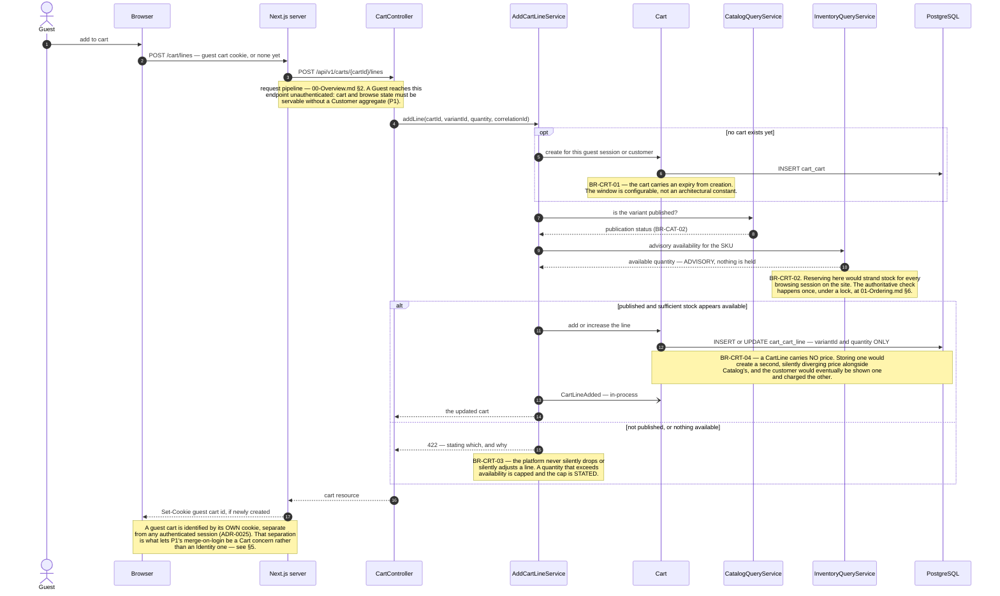
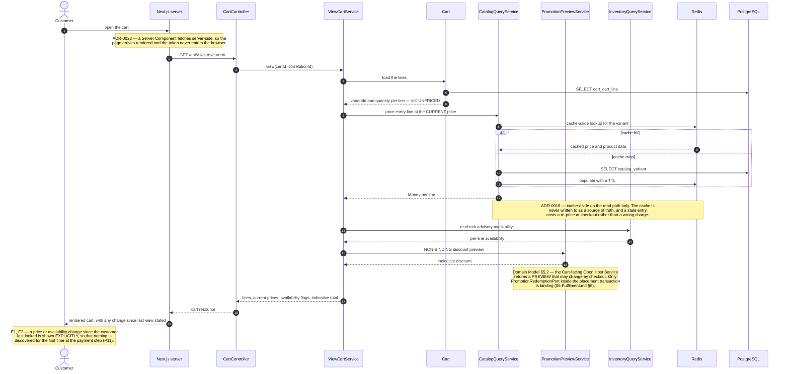
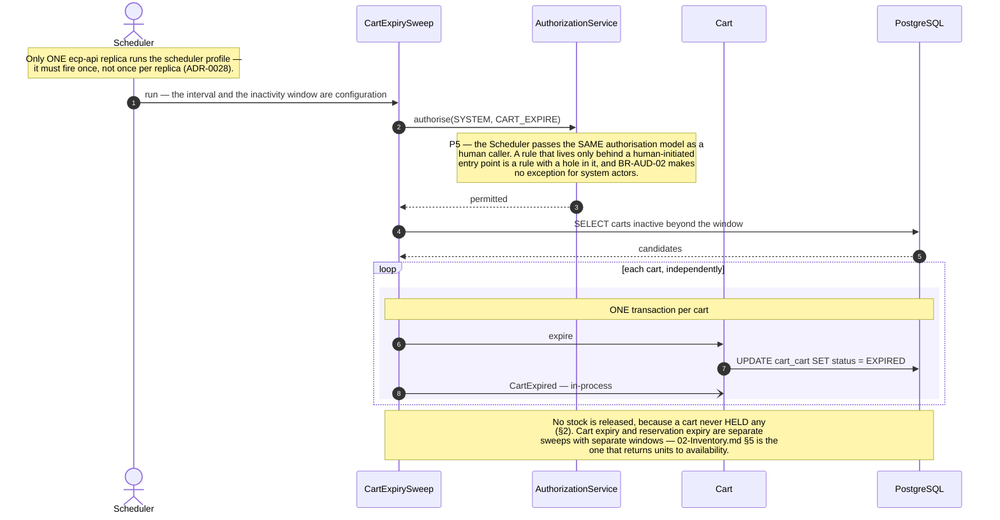
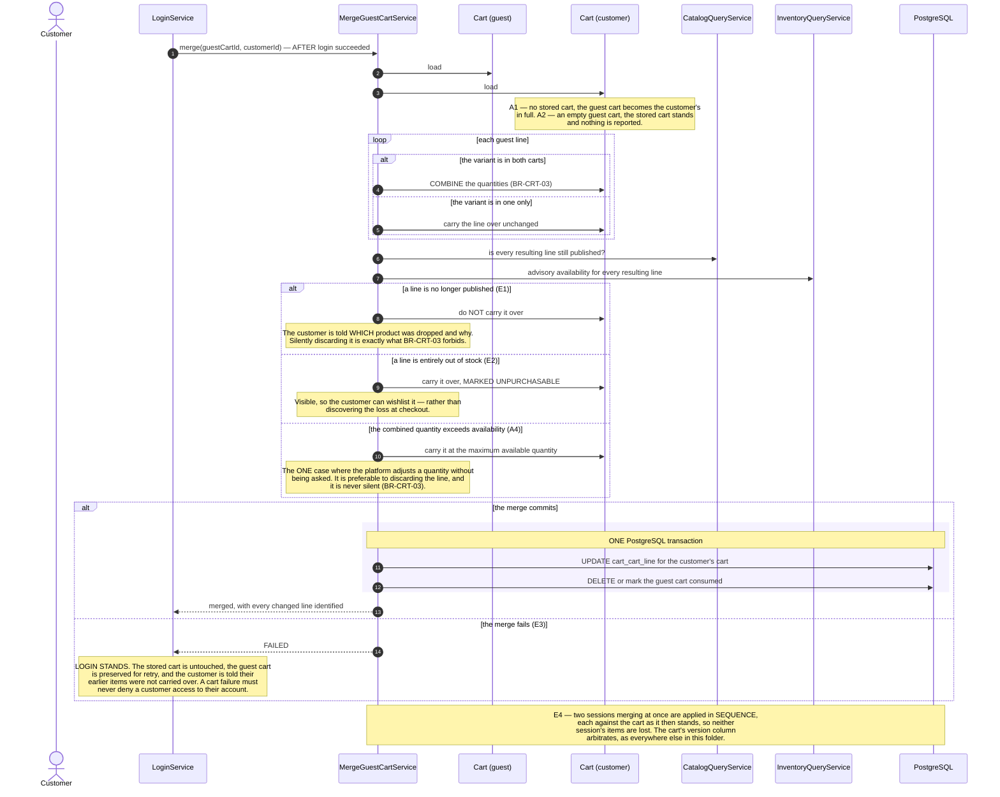
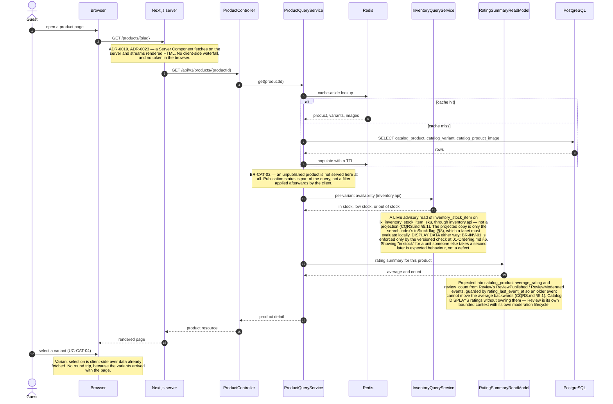
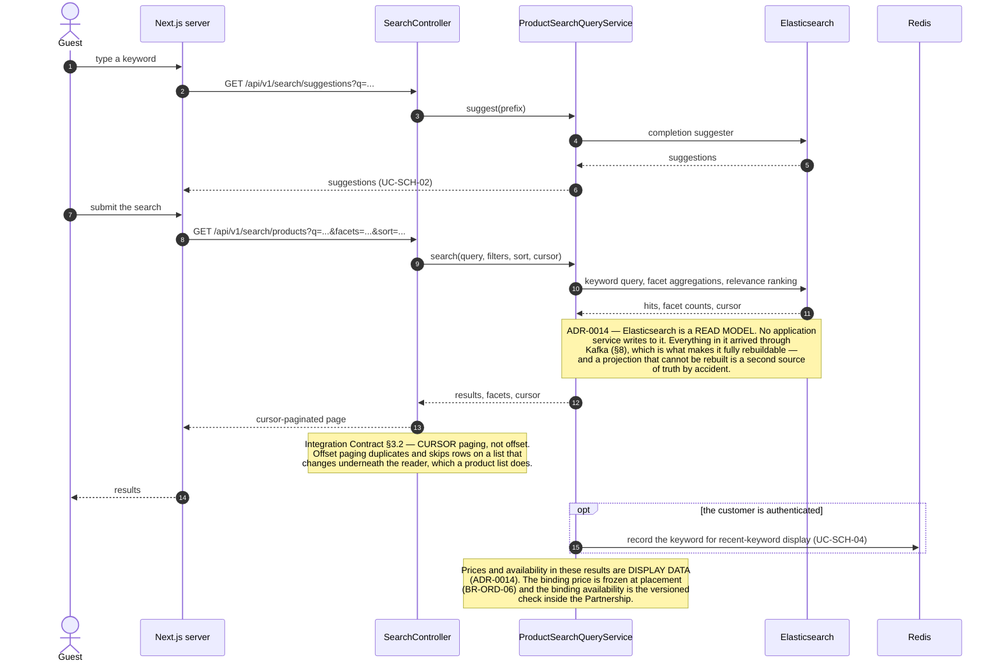
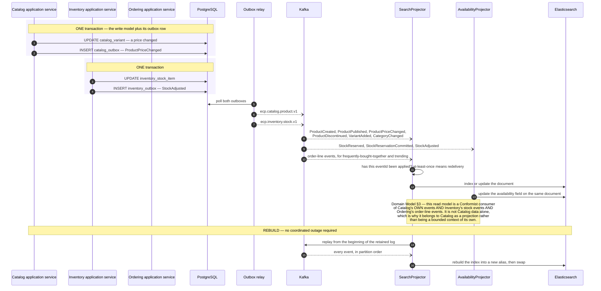
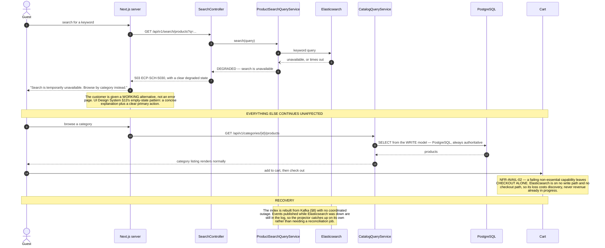

# Sequence Diagrams — Cart, Catalog, and Search

**Document type:** Backend architecture specification
**Status:** **Proposed**
**Audience:** Backend Engineering, Frontend Engineering, Architecture Review
**Related documents:** [README](./README.md) · [UC-CRT](../../../BA-docs/use-cases/05-cart-wishlist.md) · [UC-CAT](../../../BA-docs/use-cases/02-catalog-category.md) · [UC-SCH](../../../BA-docs/use-cases/03-search-recommendation.md) · [ADR-0014](../../01-system/ADR/ADR-0014-elasticsearch-search-read-model.md) · [ADR-0015](../../01-system/ADR/ADR-0015-redis-cache-and-rate-limiting.md) · [ADR-0023](../../01-system/ADR/ADR-0023-server-first-data-fetching.md)

---

## 1. Purpose

Everything before the obligation begins. These are the highest-traffic paths in the platform and the ones where a customer is most easily lost, and the architecture reflects that: almost nothing here is authoritative.

One rule governs the whole group. **A price or an availability figure shown while browsing is display data.** The binding price is frozen at placement (`BR-ORD-06`) and the binding availability is the versioned check inside the Partnership ([ADR-0011](../../01-system/ADR/ADR-0011-optimistic-locking-reservation-model.md)). Every read model below is allowed to be stale, and the design's job is to make sure that staleness is discovered at a cheap moment rather than an expensive one.

Search is not a bounded context. [Domain Model §3](../Domain%20Model.md) folds `SCH` into Catalog: keyword search, filtering, and ranking are an alternate query path over Catalog's own data with no business rules of their own. Its read model is a CQRS projection *inside* Catalog.

---

## 2. UC-CRT-01 — Add an Item to the Cart

| | |
|---|---|
| **Use cases** | `UC-CRT-01` · `UC-CAT-03` |
| **Business rules** | `BR-CRT-01` · `BR-CRT-02` · `BR-CRT-03` · `BR-CRT-04` · `BR-CAT-02` |
| **Quality** | `NFR-PERF-01` |
| **Decisions** | [ADR-0015](../../01-system/ADR/ADR-0015-redis-cache-and-rate-limiting.md) · [ADR-0025](../../01-system/ADR/ADR-0025-httponly-cookie-session.md) |
| **Problems** | `P1` |

---

## 3. UC-CRT-04 — View the Cart

| | |
|---|---|
| **Use cases** | `UC-CRT-04` |
| **Business rules** | `BR-CRT-02` · `BR-CRT-04` |
| **Quality** | `NFR-PERF-01` |
| **Decisions** | [ADR-0015](../../01-system/ADR/ADR-0015-redis-cache-and-rate-limiting.md) · [ADR-0023](../../01-system/ADR/ADR-0023-server-first-data-fetching.md) |

**Why the cart is re-priced on every view rather than cached with prices.** `BR-CRT-04` makes the cart a list of intentions, not a quote. Pricing at read time means a price change propagates immediately and there is exactly one place a price comes from. The cost is a Catalog call per view, which is why the Redis cache-aside layer exists — and why a stale cache entry is tolerable here in a way it would not be at placement.

---

## 4. UC-CRT-06 — Expire an Inactive Cart

| | |
|---|---|
| **Use cases** | `UC-CRT-06` |
| **Business rules** | `BR-CRT-01` |
| **Decisions** | [ADR-0028](../../01-system/ADR/ADR-0028-deployment-topology-containerisation.md) |
| **Problems** | `P5` |

---

## 5. Failure — Merging a Guest Cart That Conflicts

| | |
|---|---|
| **Use cases** | `UC-CRT-05` · `UC-CUS-03` E4 |
| **Business rules** | `BR-CRT-02` · `BR-CRT-03` |
| **Problems** | `P1` |

**Why the merge is subordinate to login.** E3 and `UC-CUS-03` E4 agree deliberately: the merge failing never denies access. A customer locked out of their account because of a cart problem is a far worse outcome than a cart they have to rebuild, and the guest cart is preserved so that even that is usually recoverable.

---

## 6. UC-CAT-03 — View Product Details

| | |
|---|---|
| **Use cases** | `UC-CAT-03` · `UC-CAT-04` · `UC-REV-04` |
| **Business rules** | `BR-CAT-01` · `BR-CAT-02` |
| **Quality** | `NFR-PERF-01` · `NFR-AVAIL-02` |
| **Decisions** | [ADR-0015](../../01-system/ADR/ADR-0015-redis-cache-and-rate-limiting.md) · [ADR-0019](../../01-system/ADR/ADR-0019-nextjs-app-router-rendering-strategy.md) · [ADR-0023](../../01-system/ADR/ADR-0023-server-first-data-fetching.md) |

---

## 7. UC-SCH-01 — Search Products

| | |
|---|---|
| **Use cases** | `UC-SCH-01` · `UC-SCH-02` · `UC-SCH-03` |
| **Business rules** | `BR-CAT-02` |
| **Quality** | `NFR-PERF-01` · `NFR-AVAIL-02` |
| **Decisions** | [ADR-0008](../../01-system/ADR/ADR-0008-cqrs-command-query-separation.md) · [ADR-0014](../../01-system/ADR/ADR-0014-elasticsearch-search-read-model.md) |
| **Failure path** | §9 |

---

## 8. The Search and Availability Projection

How anything gets into Elasticsearch. The read side of [`ADR-0008`](../../01-system/ADR/ADR-0008-cqrs-command-query-separation.md), and a concrete instance of the backbone in [`00-Overview.md`](./00-Overview.md) §3.

| | |
|---|---|
| **Use cases** | `UC-SCH-01` · `UC-CAT-03` · `UC-INV-05` |
| **Quality** | `NFR-AVAIL-02` · `NFR-SCAL-04` |
| **Decisions** | [ADR-0008](../../01-system/ADR/ADR-0008-cqrs-command-query-separation.md) · [ADR-0012](../../01-system/ADR/ADR-0012-transactional-outbox-and-kafka.md) · [ADR-0014](../../01-system/ADR/ADR-0014-elasticsearch-search-read-model.md) |
| **Problems** | `P11` |

**Why no application service writes to Elasticsearch directly.** A dual write — updating PostgreSQL and the index in the same method — has no transaction spanning both, so any failure between them leaves the two permanently disagreeing with no record of which is right. Routing every index update through Kafka means the outbox already guarantees the event will be delivered, and the projector's idempotency guarantees redelivery is harmless. The index becomes derivable rather than authored, which is what makes the rebuild path above possible at all.

**What is deliberately not here.** Personalised recommendation (`FR-SCH-11`) is deferred by SRS §8. When it arrives it is another consumer of the same event stream, added without touching anything in this diagram — `P2` working as designed.

---

## 9. Failure — The Search Index Is Unavailable

| | |
|---|---|
| **Use cases** | `UC-SCH-01` E · `UC-CAT-02` |
| **Quality** | `NFR-AVAIL-02` |
| **Decisions** | [ADR-0014](../../01-system/ADR/ADR-0014-elasticsearch-search-read-model.md) |
| **Problems** | `P11` |

**Why this diagram exists at all.** [`ADR-0014`](../../01-system/ADR/ADR-0014-elasticsearch-search-read-model.md) commits that search "degrades, never blocks" and adds that this is to be **verified by a dependency-failure test, not assumed**. The value of drawing it is that it makes the claim concrete enough to write that test against: browse, cart, and checkout must all complete with Elasticsearch stopped.

**The honest limitation.** Losing search is not free — it is a real and large conversion loss, since a customer who cannot find a product cannot buy it, and `P11` counts every such point. "Degrades, never blocks" means revenue already in flight is protected, not that nothing is lost.
