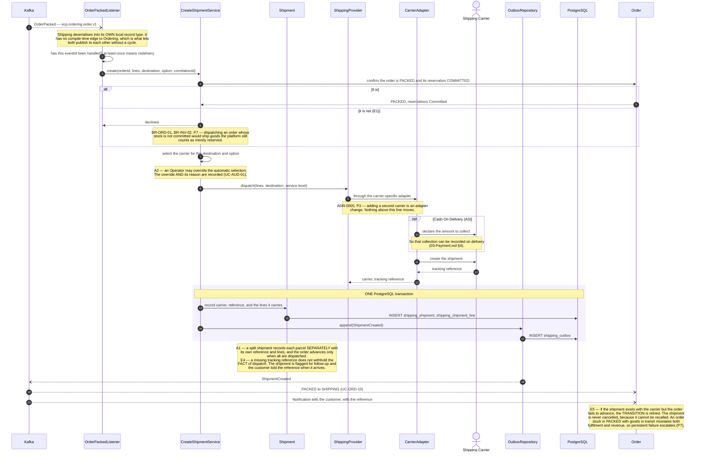
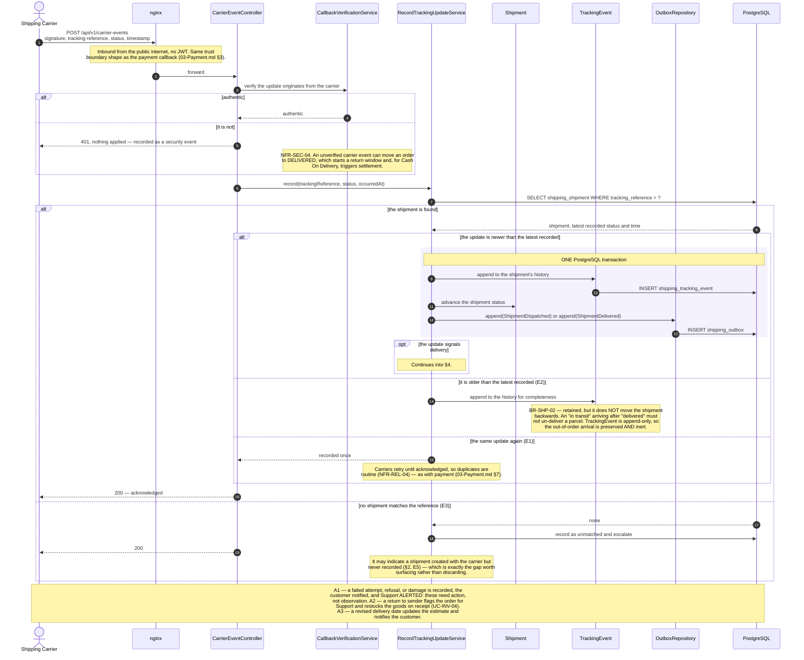
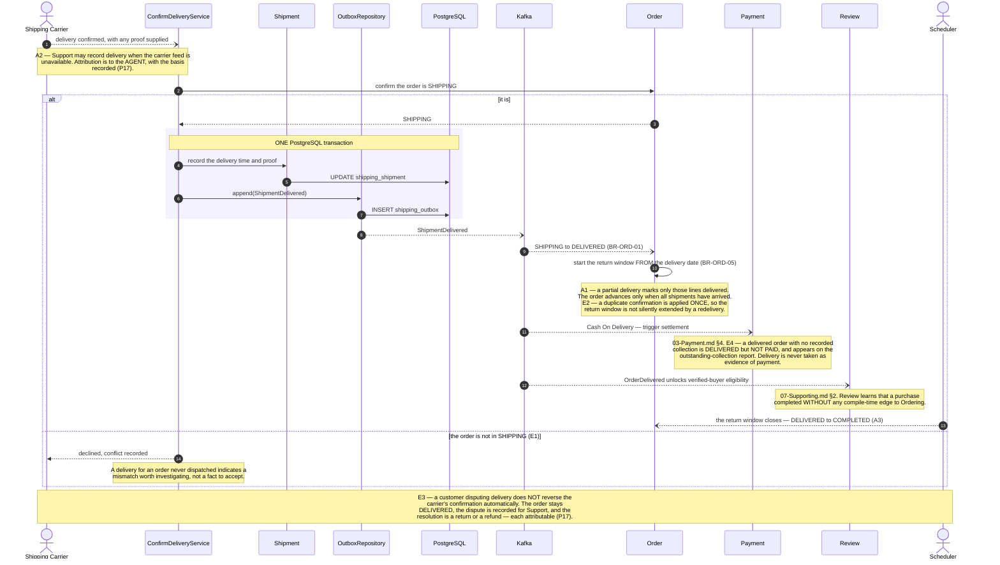
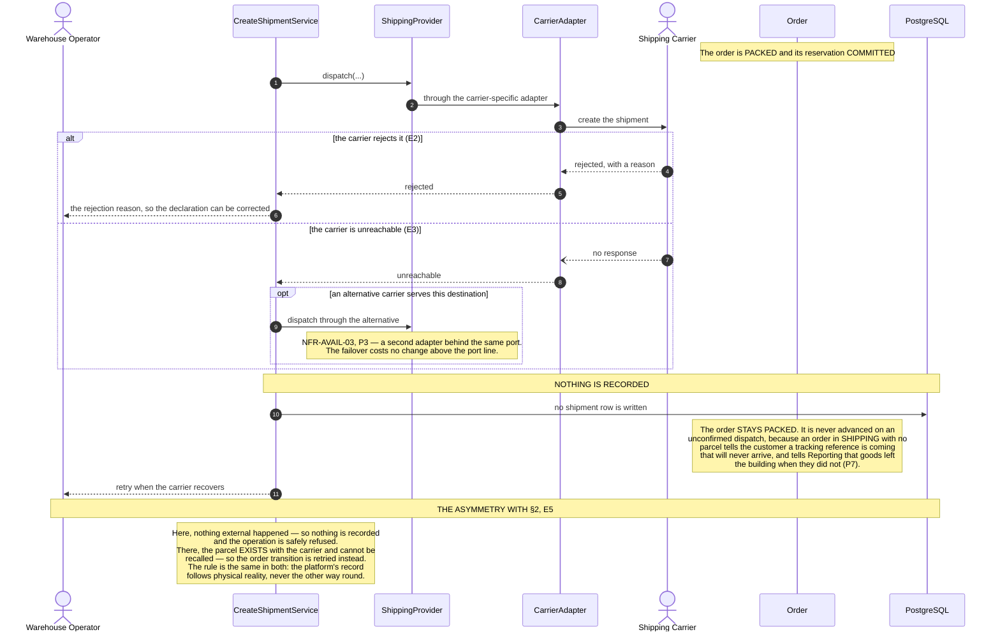
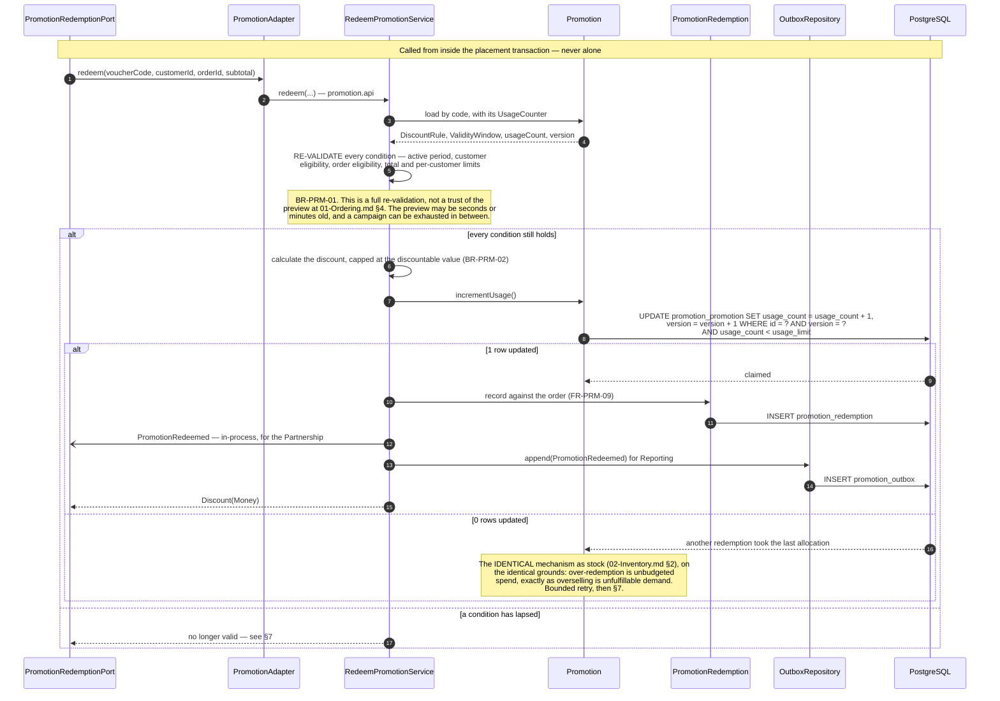
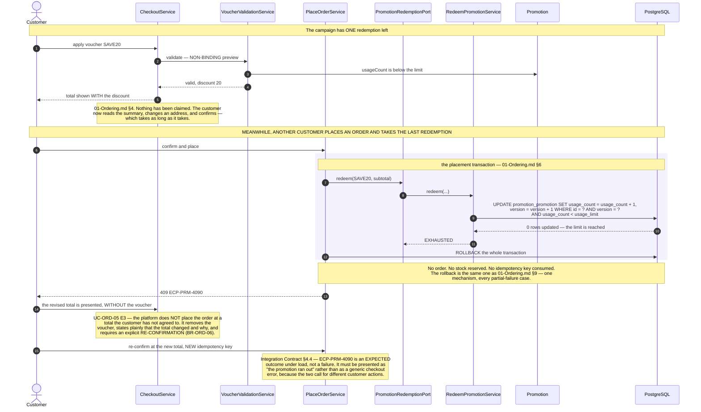
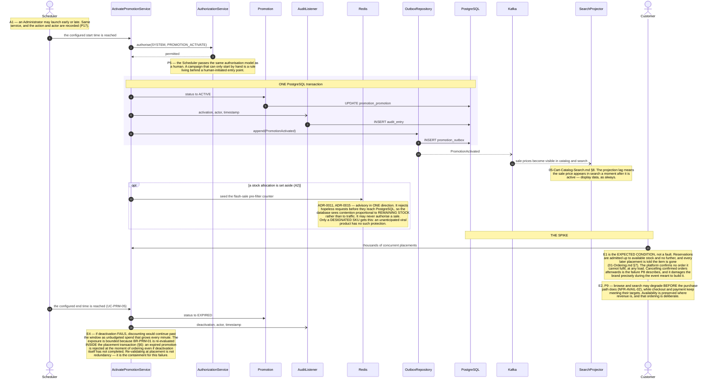

# Sequence Diagrams — Fulfilment and Promotion

**Document type:** Backend architecture specification
**Status:** **Proposed**
**Audience:** Backend Engineering, Architecture Review, QA
**Related documents:** [README](./README.md) · [UC-SHP](../../../BA-docs/use-cases/08-shipping.md) · [UC-PRM](../../../BA-docs/use-cases/09-promotion.md) · [01-Ordering](./01-Ordering.md) · [02-Inventory](./02-Inventory.md)

---

## 1. Purpose

Two domains that look unrelated and share one property: both are driven by a party or a clock the platform does not control, and both must keep an order's state honest when that party is slow, silent, or contradictory.

Shipping is bounded by a carrier. Everything it knows about a parcel arrives asynchronously, out of order, and more than once — so `BR-SHP-02` (never move a shipment backwards) does for tracking what `BR-PAY-01` does for payment results.

Promotion appears here because its *binding* moment is not in the promotion domain at all: it is inside the placement transaction in [`01-Ordering.md`](./01-Ordering.md) §6. §6 below is the inside view of that call, and §7 is what happens when a preview and a redemption disagree.

Arrow and frame conventions: [`README.md`](./README.md) §3.1–§3.2.

---

## 2. UC-SHP-03 — Create a Shipment

| | |
|---|---|
| **Use cases** | `UC-SHP-03` main success · `UC-ORD-10` · `UC-INV-03` |
| **Business rules** | `BR-ORD-01` · `BR-INV-02` |
| **Quality** | `NFR-REL-04` · `NFR-AVAIL-03` |
| **Decisions** | [ADR-0005](../../01-system/ADR/ADR-0005-clean-architecture-ports-and-adapters.md) · [ADR-0012](../../01-system/ADR/ADR-0012-transactional-outbox-and-kafka.md) |
| **Problems** | `P3` · `P7` |
| **Failure path** | §5 |

---

## 3. UC-SHP-04 — Record a Carrier Tracking Update

| | |
|---|---|
| **Use cases** | `UC-SHP-04` main success · `UC-SHP-05` |
| **Business rules** | `BR-SHP-02` |
| **Quality** | `NFR-SEC-04` · `NFR-REL-04` |
| **Problems** | `P6` |

**Why the tracking history is append-only.** `BR-SHP-02` needs two things that pull in opposite directions: the shipment's *current* status must never regress, and the full carrier history must be retained for support and dispute handling. An append-only `TrackingEvent` list with a separately-maintained current status gives both — the late-arriving event is kept and visible, and it changes nothing. Overwriting a single status field would satisfy the first requirement by destroying the evidence for the second.

---

## 4. UC-SHP-06 — Confirm Delivery

The event with the widest blast radius in the platform: it closes fulfilment, starts the return window, unlocks review eligibility, and — for Cash On Delivery — triggers settlement.

| | |
|---|---|
| **Use cases** | `UC-SHP-06` · `UC-PAY-04` · `UC-REV-01` · `UC-ORD-10` |
| **Business rules** | `BR-ORD-01` · `BR-ORD-05` · `BR-REV-01` |
| **Problems** | `P7` · `P17` |

**Why one event drives four consequences through Kafka rather than four direct calls.** Payment, Review, Notification, and Reporting all need to know a delivery happened, and none of them is on Shipping's critical path. Publishing once and letting each consume independently means a failure in Review's projection cannot delay Cash On Delivery settlement, and a new consumer — a loyalty programme awarding points on delivery — is added without touching this diagram. That is `P2`, and the alternative would give Shipping a compile-time edge to four contexts it has no business knowing about.

---

## 5. Failure — The Carrier Cannot Be Reached

| | |
|---|---|
| **Use cases** | `UC-SHP-03` E2, E3 |
| **Business rules** | `BR-ORD-01` |
| **Quality** | `NFR-AVAIL-03` · `NFR-REL-04` |
| **Problems** | `P3` · `P7` |

---

## 6. UC-PRM-03 — Redeem a Promotion at Placement

The inside view of the `PromotionRedemptionPort` call in [`01-Ordering.md`](./01-Ordering.md) §6. Like stock reservation, it has no entry point of its own and always runs inside the caller's transaction.

| | |
|---|---|
| **Use cases** | `UC-PRM-03` · `UC-PRM-02` · `UC-ORD-05` |
| **Business rules** | `BR-PRM-01` · `BR-PRM-02` · `BR-PRM-03` |
| **Quality** | `NFR-REL-03` · `NFR-SCAL-06` |
| **Decisions** | [ADR-0005](../../01-system/ADR/ADR-0005-clean-architecture-ports-and-adapters.md) · [ADR-0011](../../01-system/ADR/ADR-0011-optimistic-locking-reservation-model.md) |
| **Problems** | `P5` |
| **Preview counterpart** | [`01-Ordering.md`](./01-Ordering.md) §4 |

**Why promotion uses the same locking mechanism as stock.** A usage cap and a stock level are the same shape of problem: a finite allocation that concurrent requests draw down, where exceeding it costs real money. [`ADR-0011`](../../01-system/ADR/ADR-0011-optimistic-locking-reservation-model.md) §4 states it directly — promotion redemption is optimistically locked "the same way", inside the same transaction. Using a weaker mechanism for promotion would mean unbudgeted discount is prevented less rigorously than unfulfillable demand, and finance would not accept that distinction.

**Why the `usage_count < usage_limit` predicate is in the `WHERE` clause.** Checking the limit in application code and then updating leaves a window. Putting the predicate in the conditional update closes it, so the cap is enforced by the same statement that claims the allocation. The version check and the limit check are two guards in one atomic operation.

---

## 7. Failure — A Voucher Valid at Preview Is Exhausted at Placement

| | |
|---|---|
| **Use cases** | `UC-ORD-05` E3 · `UC-ORD-03` E6 · `UC-PRM-02` E7 |
| **Business rules** | `BR-PRM-01` · `BR-ORD-06` |
| **Quality** | `NFR-SCAL-06` |
| **Problems** | `P5` |

**Why the preview is allowed to be wrong.** Making it binding would mean reserving discount budget the moment a code is typed — stranding campaign allocation for every abandoned checkout, exactly as reserving stock at `UC-ORD-01` would strand inventory. The design accepts a preview that can lapse and pays for it with a re-confirmation at placement. Both the stock path and the promotion path make the same trade, for the same reason, and resolve it at the same instant.

**Why the order is not simply placed without the discount.** Silently dropping the voucher and charging the higher total would violate `BR-ORD-06` — the customer would be charged a price they were not shown. The `409` is the design working: it costs a round trip and preserves the rule that no total is ever charged without being agreed.

---

## 8. UC-PRM-04 — Launch a Flash Sale

Where every mechanism in this folder is exercised at once, and the only place the architecture is deliberately sized for a spike.

| | |
|---|---|
| **Use cases** | `UC-PRM-04` · `UC-PRM-05` · `UC-AUD-01` |
| **Business rules** | `BR-PRM-01` · `BR-INV-01` |
| **Quality** | `NFR-REL-03` · `NFR-SCAL-06` · `NFR-AVAIL-01` · `NFR-AVAIL-02` |
| **Decisions** | [ADR-0011](../../01-system/ADR/ADR-0011-optimistic-locking-reservation-model.md) · [ADR-0015](../../01-system/ADR/ADR-0015-redis-cache-and-rate-limiting.md) |
| **Problems** | `P5` · `P8` · `P9` |

**Why re-validation at placement is what makes deactivation failure survivable.** E3 and E4 are the two ways the clock can fail — a sale that does not start, and a sale that does not stop. The first is a customer-facing failure with a fixed deadline and no software mitigation; it escalates. The second would be an unbounded and growing financial loss, except that the binding check in §6 reads the promotion's *current* state rather than trusting a flag set at activation. The exposure is therefore bounded by one placement, not by however long it takes someone to notice.
