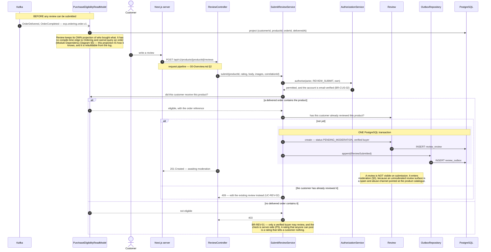
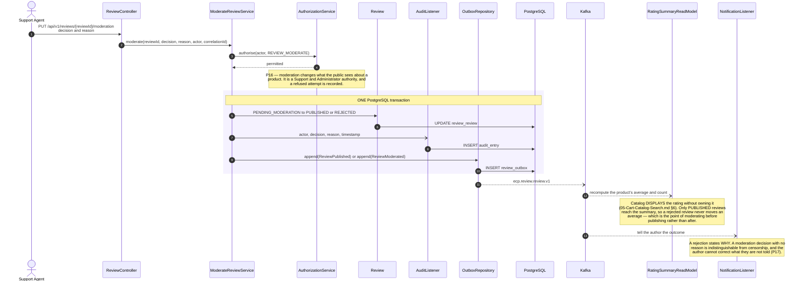
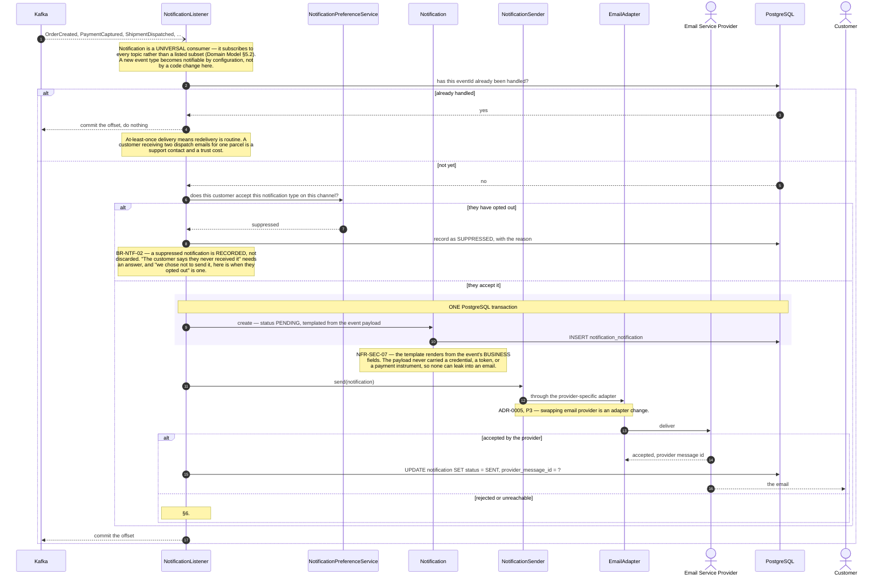
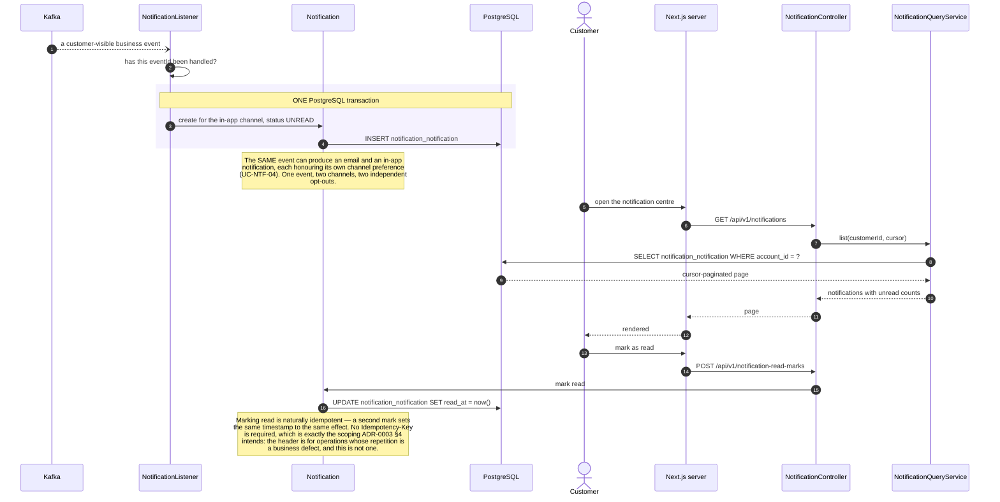
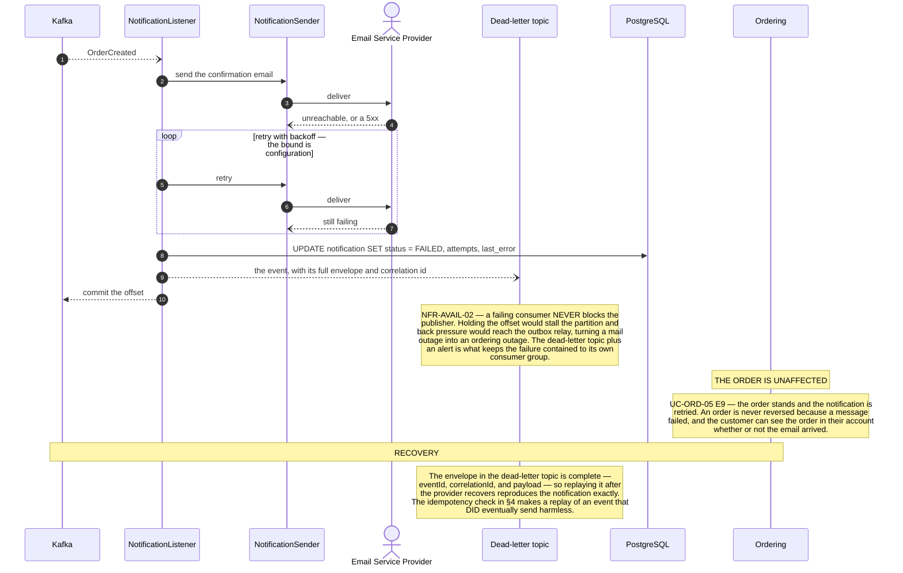
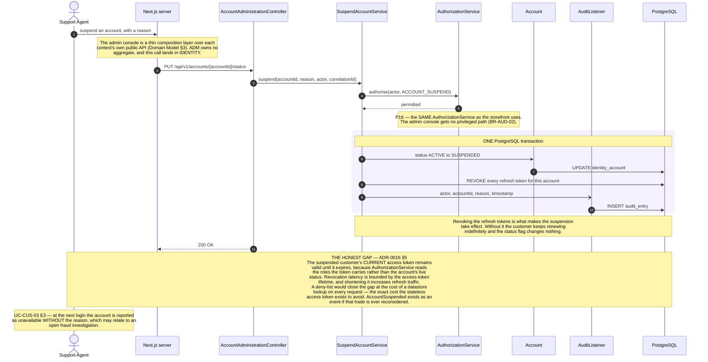
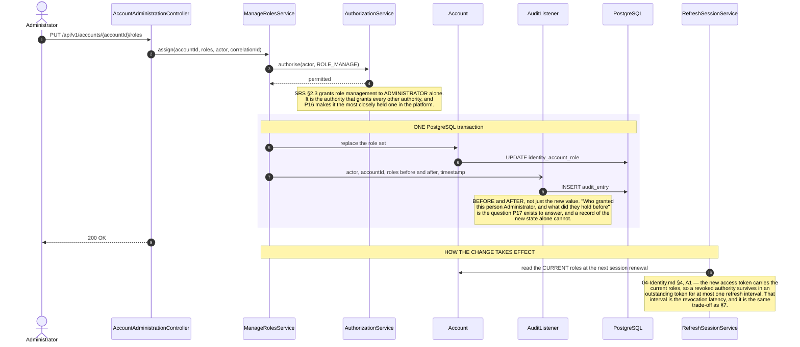
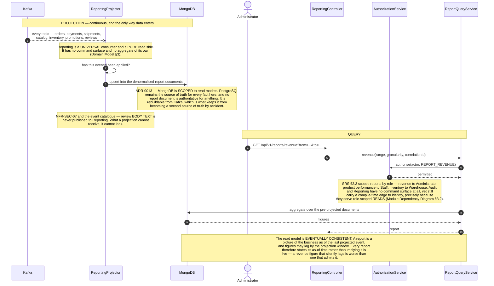
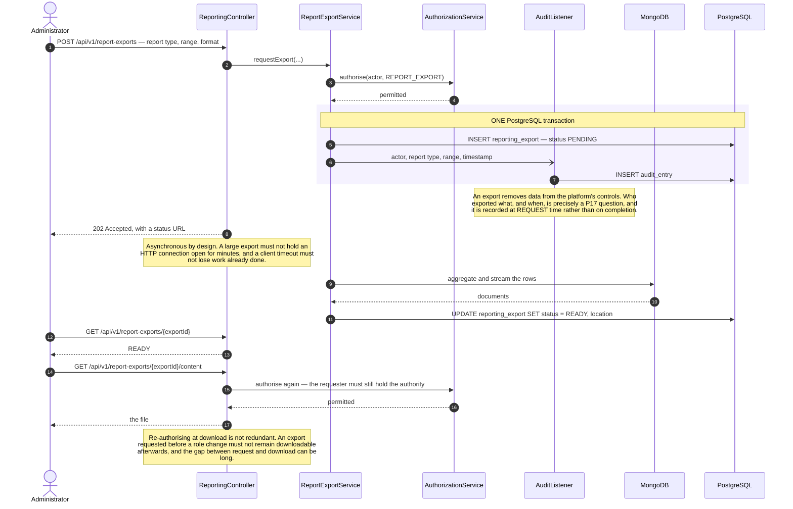
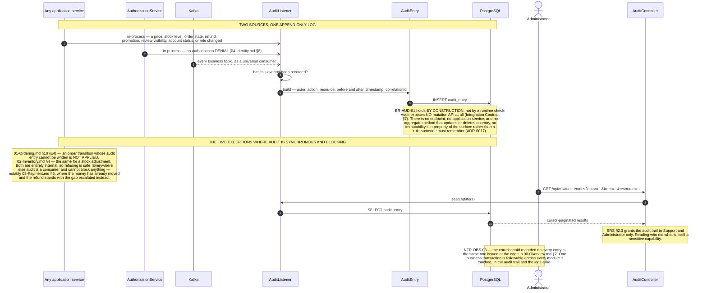

# Sequence Diagrams — Review, Notification, Administration, Reporting, Audit

**Document type:** Backend architecture specification
**Status:** **Proposed**
**Audience:** Backend Engineering, Architecture Review, Compliance
**Related documents:** [README](./README.md) · [00-Overview](./00-Overview.md) · [UC-REV](../../../BA-docs/use-cases/10-review.md) · [UC-NTF](../../../BA-docs/use-cases/11-notification.md) · [UC-ADM](../../../BA-docs/use-cases/12-administration.md) · [UC-RPT](../../../BA-docs/use-cases/13-reporting-analytics.md) · [UC-AUD](../../../BA-docs/use-cases/14-audit-access-control.md)

---

## 1. Purpose

Five domains that share a structural property: **almost everything they do is driven by an event rather than by a caller.** Notification, Audit, and Reporting are the platform's three universal consumers ([Domain Model §5.2](../Domain%20Model.md)) — they subscribe to every Kafka topic rather than to a listed subset. Review learns that a purchase completed the same way.

That is why they appear last and why they are short. Each is an application of [`00-Overview.md`](./00-Overview.md) §3 to a particular purpose, and the interesting content is not the mechanism but what each domain is and is not allowed to do with what it receives.

Administration is the exception, and deliberately so: [Domain Model §3](../Domain%20Model.md) concludes that `ADM` **is not a bounded context**. Walking `UC-ADM-01`–`06`, only account suspension and role management are genuinely identity-shaped domain logic, and both land in Identity & Access. The rest are role-gated operations routing through Catalog's, Ordering's, and Inventory's own public APIs. There is no leftover domain logic for "Administration" to own, so §7 and §8 below are drawn against Identity, and the admin console is a thin composition layer with no aggregates of its own.

---

## 2. UC-REV-01 — Submit a Product Review

| | |
|---|---|
| **Use cases** | `UC-REV-01` · `UC-SHP-06` |
| **Business rules** | `BR-REV-01` · `BR-CUS-02` |
| **Decisions** | [ADR-0012](../../01-system/ADR/ADR-0012-transactional-outbox-and-kafka.md) |
| **Problems** | `P5` |

**Why Review owns a projection instead of asking Ordering.** A synchronous query would give Review a compile-time edge to Ordering, and Ordering already publishes what Review needs. The projection costs a table and an eventual-consistency window — a review attempted in the seconds between delivery and projection is refused and succeeds on retry. That window is acceptable because nobody reviews a product one second after it arrives, and the alternative is a dependency edge that would have to be unpicked at extraction.

---

## 3. UC-REV-05 — Moderate a Review

| | |
|---|---|
| **Use cases** | `UC-REV-05` · `UC-AUD-01` |
| **Business rules** | `BR-REV-02` · `BR-AUD-01` |
| **Problems** | `P16` · `P17` |

---

## 4. UC-NTF-01 — Deliver an Email Notification

| | |
|---|---|
| **Use cases** | `UC-NTF-01` · `UC-NTF-04` |
| **Business rules** | `BR-NTF-01` · `BR-NTF-02` |
| **Quality** | `NFR-AVAIL-02` · `NFR-REL-06` · `NFR-SEC-07` |
| **Decisions** | [ADR-0005](../../01-system/ADR/ADR-0005-clean-architecture-ports-and-adapters.md) · [ADR-0012](../../01-system/ADR/ADR-0012-transactional-outbox-and-kafka.md) |
| **Problems** | `P3` · `P6` |
| **Failure path** | §6 |

**Why email is a consumer of a committed event rather than a step inside the transaction.** [Solution Architecture §4](../../01-system/Solution%20Architecture.md) states it directly: delivery failure must not block the business transaction that triggered it. An order confirmation email sent inside the placement transaction would make a mail provider's outage into a checkout outage — `NFR-AVAIL-02` inverted. Consuming an already-committed event means the worst case is a late email, never a lost order. `UC-ORD-05` E9 says the same from the other side: an order is never reversed because a message failed.

---

## 5. UC-NTF-02, UC-NTF-03 — In-App Notifications

| | |
|---|---|
| **Use cases** | `UC-NTF-02` · `UC-NTF-03` · `UC-NTF-04` |
| **Business rules** | `BR-NTF-01` |
| **Decisions** | [ADR-0023](../../01-system/ADR/ADR-0023-server-first-data-fetching.md) |

---

## 6. Failure — The Email Provider Rejects or Disappears

| | |
|---|---|
| **Use cases** | `UC-NTF-01` E1 · `UC-ORD-05` E9 |
| **Business rules** | `BR-NTF-01` |
| **Quality** | `NFR-AVAIL-02` · `NFR-REL-06` |
| **Problems** | `P6` |

**Why the offset is committed on a permanent failure.** Refusing to commit would make the consumer retry the same event forever and stall every later event on that partition — one undeliverable address blocking every other customer's notifications. Committing and dead-lettering keeps the failure to the single message that caused it. This is the opposite of the payment callback in [`03-Payment.md`](./03-Payment.md) §3, which deliberately does *not* acknowledge a result it failed to apply — and the difference is what is at stake. A lost notification is recoverable from the dead-letter topic; a lost payment result is money.

---

## 7. UC-ADM-03 — Suspend a Customer Account

| | |
|---|---|
| **Use cases** | `UC-ADM-03` · `UC-CUS-03` E3 · `UC-AUD-01` |
| **Business rules** | `BR-CUS-03` · `BR-AUD-01` · `BR-AUD-02` |
| **Quality** | `NFR-SEC-03` · `NFR-OBS-01` |
| **Decisions** | [ADR-0016](../../01-system/ADR/ADR-0016-jwt-refresh-rotation-rbac.md) |
| **Problems** | `P16` · `P17` |

---

## 8. UC-ADM-06 — Manage User Roles

| | |
|---|---|
| **Use cases** | `UC-ADM-06` · `UC-CUS-05` A1 · `UC-AUD-01` |
| **Business rules** | `BR-AUD-01` · `BR-AUD-02` |
| **Problems** | `P16` · `P17` |

---

## 9. The Reporting Projection

| | |
|---|---|
| **Use cases** | `UC-RPT-01`–`UC-RPT-05` |
| **Quality** | `NFR-PERF-03` · `NFR-AVAIL-02` |
| **Decisions** | [ADR-0008](../../01-system/ADR/ADR-0008-cqrs-command-query-separation.md) · [ADR-0013](../../01-system/ADR/ADR-0013-mongodb-scoped-to-read-models.md) · [ADR-0030](../../01-system/ADR/ADR-0030-spring-data-mongodb-read-model-access.md) |
| **Problems** | `P6` · `P17` |

---

## 10. UC-RPT-06 — Export a Report

| | |
|---|---|
| **Use cases** | `UC-RPT-06` · `UC-AUD-01` |
| **Business rules** | `BR-AUD-01` |
| **Problems** | `P17` |

---

## 11. UC-AUD-01 — Record an Audit Entry

The last diagram, and the one every other diagram in this folder has been quietly referring to.

| | |
|---|---|
| **Use cases** | `UC-AUD-01` · `UC-AUD-02` |
| **Business rules** | `BR-AUD-01` · `BR-AUD-02` |
| **Quality** | `NFR-OBS-01` · `NFR-OBS-03` |
| **Decisions** | [ADR-0017](../../01-system/ADR/ADR-0017-append-only-audit-log.md) |
| **Problems** | `P17` |

**Why the audit trail has no mutation API rather than a permission that forbids mutation.** A permission can be misconfigured, and a service method that updates a row can be called by a future developer who does not know why it should not be. Not building the method at all is the only version of `BR-AUD-01` that cannot be undone by a later change nobody reviews carefully. It is the same reasoning as deriving `available` rather than storing it ([`02-Inventory.md`](./02-Inventory.md) §2): make the wrong state unrepresentable instead of forbidden.

**What is deliberately not claimed.** Append-only at the application layer is not tamper-proof at the storage layer. Anyone with direct database access can still alter rows, and nothing here detects it. [`ADR-0017`](../../01-system/ADR/ADR-0017-append-only-audit-log.md) records this as the residual risk it is: the log answers "who did what" for anyone acting *through the platform*, which is the threat `P17` names, and it is not a defence against a compromised database administrator.
