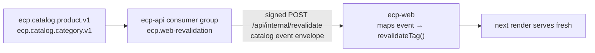

# Data Fetching — Enterprise Commerce Platform (ECP)

**Document type:** Frontend architecture specification (normative)
**Status:** **Proposed** — the file [`ADR-0023`](../01-system/ADR/ADR-0023-server-first-data-fetching.md) §1 named as planned and absent
**Audience:** Frontend Engineering, Backend Engineering, Architecture Review, QA
**Related documents:** [Frontend Architecture](./Frontend%20Architecture.md) · [Routing](./Routing.md) · [State Management](./State%20Management.md) · [ADR-0023](../01-system/ADR/ADR-0023-server-first-data-fetching.md) · [ADR-0036](../01-system/ADR/ADR-0036-nextjs-server-sole-api-caller.md) · [ADR-0038](../01-system/ADR/ADR-0038-event-driven-catalog-revalidation.md) · [Integration Contract](../04-shared/Integration%20Contract.md) · [Error Codes](../04-shared/Error%20Codes.md) · [CQRS](../02-backend/CQRS.md)

---

## 1. Scope

[`ADR-0023`](../01-system/ADR/ADR-0023-server-first-data-fetching.md) decided *where* each read happens and gave the table. This document is the mechanism: the client that makes the call, what it attaches, how it parses the answer, how a failure becomes a screen, and how a statically generated page learns it is stale.

Two backend facts shape everything here, and neither is negotiable:

- **Read models are eventually consistent, except where they are not.** Search lags catalog by seconds; reporting may lag five minutes (`NFR-PERF-06`). **Inventory availability and payment state carry no permitted lag at all.** One caching policy across all of them is guaranteed to be wrong somewhere, and the place it is wrong is a customer acting on a stale order.
- **Degradation is sectional.** `NFR-AVAIL-02` requires that search, recommendations, reviews, or reporting failing does not prevent browsing, checkout, or payment. That is a property of boundaries, not of error handling.

---

## 2. The Fetch Client

One client, in `lib/api`, `server-only`, and nothing else calls `ecp-api` ([`ADR-0036`](../01-system/ADR/ADR-0036-nextjs-server-sole-api-caller.md)).

### 2.1 What it attaches to every request

| Header | Value | Source |
|---|---|---|
| `Authorization` | `Bearer <access token>` from the server-side session | [`Frontend Architecture.md`](./Frontend%20Architecture.md) §4.2 |
| `X-Correlation-Id` | The incoming request's id, or a new one at the edge | [`OpenAPI/README.md`](../04-shared/OpenAPI/README.md) `O-02` |
| `Accept` | `application/json, application/problem+json` | [`Integration Contract.md`](../04-shared/Integration%20Contract.md) §2 |
| `Idempotency-Key` | On `POST /orders` and payment initiation **only** | [`Integration Contract.md`](../04-shared/Integration%20Contract.md) §2.2 |

**The correlation id is threaded, not generated per call.** One browser request produces one id, and every backend call made while rendering that page carries it. This is what makes a customer report traceable across `ecp-web` and `ecp-api` in one query; a per-call id makes the log searchable and the incident unreadable.

### 2.2 Timeouts, retries, and cancellation

| Concern | Policy |
|---|---|
| Timeout | 3 s for reads, 10 s for writes. A read that outlives its budget has already failed the page ([`Performance.md`](./Performance.md) §2) |
| Retry — reads | One retry on a connection error or `503`, with jitter. Never on a `4xx` |
| Retry — writes | **None automatic.** §6.3 |
| Cancellation | The request's `AbortSignal` is propagated, so an abandoned navigation stops its in-flight calls rather than holding a connection to completion |
| `429` | Never retried in-band. `Retry-After` is surfaced to the user ([`Error Codes.md`](../04-shared/Error%20Codes.md) `ECP-GEN-4290`) |

### 2.3 Cache semantics per call

Next.js caches `fetch` results by default in some configurations and not in others, and [`ADR-0019`](../01-system/ADR/ADR-0019-nextjs-app-router-rendering-strategy.md) §5 warns that these semantics have moved between versions. **Every call therefore states its policy explicitly; none relies on a default.**

| Policy | Used for |
|---|---|
| `cache: 'force-cache'` + tags | Catalog, category, product detail — the statically generated routes (§7) |
| `next: { revalidate: <seconds> }` | Advisory reads where a bounded staleness is acceptable and no event exists to invalidate on |
| `cache: 'no-store'` | **Everything per-user or authoritative.** Cart, checkout, orders, payment state, account, admin, and every stock figure that is not decorative |

A reviewer should be able to answer "why is this cached?" from the call site alone. An unstated policy is a review rejection.

---

## 3. Parsing the Boundary

[`ADR-0020`](../01-system/ADR/ADR-0020-typescript-strict-mode.md) §4 is explicit: *"a generated type is a compile-time claim about a network response, not a guarantee."* The client therefore parses.

| Step | Rule |
|---|---|
| Success | The response body is parsed by the feature's Zod schema. A parse failure is an error, not a coerced value — it means the contract and the deployment disagree, and rendering a half-shaped object hides that until it reaches a customer |
| Error | `application/problem+json` is parsed into a typed problem carrying `status`, `code`, `detail`, `errors[]`, and `correlationId` ([`Integration Contract.md`](../04-shared/Integration%20Contract.md) §4.1) |
| Money | Parsed as `{ amount: string, currency: string }` and never converted to a number. [`Frontend Architecture.md`](./Frontend%20Architecture.md) §6.2 states the prohibition; this is where it would be violated |
| Identifiers | Branded, never parsed or ordered ([`Integration Contract.md`](../04-shared/Integration%20Contract.md) §2) |
| Unknown fields | Ignored, not rejected. Additive change is how the contract evolves; a strict parser turns a compatible backend deploy into a frontend outage |

**Parse failures are reported with the correlation id and the operation, and they alarm.** A schema drift that only produces a blank section is the failure mode this parsing exists to prevent, and it is invisible unless someone is told.

---

## 4. Reads

[`ADR-0023`](../01-system/ADR/ADR-0023-server-first-data-fetching.md) §4 gives the read table; [`Routing.md`](./Routing.md) §4–§5 assign it per route rather than repeating it. Three rules govern the whole set.

### 4.1 The zero-lag rule

**Nothing with a zero-lag requirement is client-cached, and nothing authoritative is served from a cached render.** `NFR-PERF-06` permits no lag on inventory availability and payment state; `BR-ORD-06` and [`ADR-0011`](../01-system/ADR/ADR-0011-optimistic-locking-reservation-model.md) make order placement the moment stock is actually decided.

| Data | Policy |
|---|---|
| Order state, payment state | `no-store`, server-fetched, never client-cached |
| Authoritative stock at checkout | `no-store` |
| Cart contents | `no-store` on load; the client cache covers only in-page editing (§5) |
| Displayed availability on a listing or product page | Cached, **and labelled advisory** (§4.2) |

This mirrors [`ADR-0015`](../01-system/ADR/ADR-0015-redis-cache-and-rate-limiting.md)'s rule on the backend, for the same reason and with the same consequence for getting it wrong.

### 4.2 Advisory data is labelled

`Domain Model.md` §5.2 makes search results and catalog availability explicitly non-authoritative, and [`ADR-0019`](../01-system/ADR/ADR-0019-nextjs-app-router-rendering-strategy.md) §4 requires the UI to say so. Concretely: stock shown on a listing is an indication ("In stock" / "Low stock", never "3 left" from a projection), and the binding answer arrives at checkout. An admin dashboard reading a projection that may lag five minutes **shows the lag** — [`ADR-0023`](../01-system/ADR/ADR-0023-server-first-data-fetching.md) §4: *"staleness is surfaced, not concealed."*

### 4.3 Every remote section owns a boundary

`NFR-AVAIL-02` is satisfied structurally: each independently-fetched section sits in its own `Suspense` boundary with its own error boundary, so a failing reviews or recommendations read degrades inside its own frame. The degraded frame uses [`UI Design System.md`](./UI%20Design%20System.md) §13's empty-state pattern — concise explanation, primary action — because §13 is explicit that a section which failed to load and a section with nothing in it should both look composed rather than broken. [`Routing.md`](./Routing.md) assigns the boundaries per route.

---

## 5. The Four Client-Cached Cases

[`ADR-0023`](../01-system/ADR/ADR-0023-server-first-data-fetching.md) §4 admits a client cache only where the browser genuinely owns the interaction. This is that list, and it is **closed** — a fifth is an amendment to this section, not a pull request.

| # | Case | Why the browser owns it | Constraint |
|---|---|---|---|
| 1 | **Search typeahead** | Keystroke-driven; `NFR-PERF-04`'s 150 ms budget needs deduplication and cancellation, not a round trip per character | Debounced; results are advisory and labelled |
| 2 | **In-page cart mutation** | Quantity steppers and line removal must feel immediate while the customer edits | Server-fetched on load; reconciled from the server on every mutation response |
| 3 | **Payment status polling** | An in-flight payment resolves asynchronously and the page must notice | Polled, never cached — each poll is authoritative (§4.1) |
| 4 | **Admin live views** | An operator watching a queue wants it to refresh without navigating | Reporting lag is displayed (§4.2) |

`@tanstack/react-query` is importable from exactly these four feature paths; anywhere else is a lint error ([`Feature Structure.md`](./Feature%20Structure.md) §4, rule `I-8`). The rule exists because this list erodes one convenience at a time, and each individual erosion is defensible.

**Background refetching is off by default.** [`ADR-0023`](../01-system/ADR/ADR-0023-server-first-data-fetching.md) §3 names the failure: aggressive refetching against an eventually-consistent read model produces visible flicker as a projection catches up. Refetch on window focus is disabled; refetch happens on mutation and on explicit interval where an interval is the point (cases 3 and 4).

---

## 6. Writes

### 6.1 One path

Every write is a **Server Action**, or a route handler where a Server Action cannot serve — a provider redirect return, for instance. The browser never calls `ecp-api` ([`ADR-0025`](../01-system/ADR/ADR-0025-httponly-cookie-session.md), [`ADR-0036`](../01-system/ADR/ADR-0036-nextjs-server-sole-api-caller.md)), which keeps the session cookie server-side and gives one place to attach the idempotency key.

**Every action composes one wrapper**, which in order: verifies CSRF ([`Frontend Architecture.md`](./Frontend%20Architecture.md) §4.3), resolves the session, attaches the idempotency key where the operation requires it, invokes the client, maps a typed problem to a typed action result, and performs only the revalidation that action owns. **Catalog administration writes own none:** their storefront invalidation arrives solely through the signed catalog-event callback in §7. A per-action habit would hold for a year and then not; a wrapper fails loudly the first time it is bypassed.

### 6.2 Idempotency

`Idempotency-Key` is required on exactly two operations — `placeOrder` and `initiatePayment` ([`Integration Contract.md`](../04-shared/Integration%20Contract.md) §2.2, [`Error Codes.md`](../04-shared/Error%20Codes.md) `ECP-ORD-4001`).

| Rule | Detail |
|---|---|
| Generated once per **attempt**, not per submission | The key is minted when the customer reaches the confirmation step and is held for the life of that checkout attempt |
| A user-initiated retry reuses the same key | This is what makes the retry safe — the backend returns the original response verbatim rather than creating a second order (`BR-ORD-03`, `NFR-REL-02`) |
| The key is never regenerated on retry | Regenerating it converts a safe retry into a duplicate order, which is the exact defect the header exists to prevent |
| A changed basket means a new attempt | Same key with a different body is `ECP-ORD-4090`, and it is a client defect reported rather than masked |

### 6.3 Order placement is never retried automatically

A network timeout on `POST /orders` has an **unknown** outcome — the order may exist. [`ADR-0023`](../01-system/ADR/ADR-0023-server-first-data-fetching.md) §4 forbids blind retry on the purchase path, and this document adds what the UI does instead: it tells the customer the outcome is unknown, offers a single explicit retry that presents the same key, and never shows a success it has not been told about.

### 6.4 Optimistic UI

| Operation | Optimistic? | Why |
|---|---|---|
| Add to cart, quantity change, wishlist toggle | **Yes** | Cannot fail on business grounds; a rejection is a transport failure and is reverted visibly |
| Apply voucher | **No** | `ECP-PRM-4090` — a concurrent redemption can exhaust a promotion. Showing a discount and retracting it is worse than a brief wait |
| Place order | **Never** | [`ADR-0011`](../01-system/ADR/ADR-0011-optimistic-locking-reservation-model.md) means a placement can be rejected after the customer has committed |
| Any admin write | **No** | An operator needs the confirmed state, not the intended one |

The rule underneath: **optimistic UI is permitted only where the operation cannot fail on business grounds.** And where a placement is rejected, the UI must distinguish **"sold out"** (`ECP-INV-4091`, a `409` that may succeed later for a different quantity) from **"try again"** (a transport failure). Collapsing those into one message is the most common way this screen goes wrong.

---

## 7. Revalidation

[`ADR-0019`](../01-system/ADR/ADR-0019-nextjs-app-router-rendering-strategy.md) §5 names the open problem precisely: statically generated catalog pages "need reliable invalidation," and a missed one shows a stale price. [`ADR-0038`](../01-system/ADR/ADR-0038-event-driven-catalog-revalidation.md) decides the mechanism; this is the wiring.

### 7.1 The tag scheme

Deliberately parallel to the Redis key scheme of [`Backend Architecture.md`](../02-backend/Backend%20Architecture.md) §5.7, so one event invalidates both stores by the same reasoning:

| Event | Tags revalidated |
|---|---|
| `ProductPriceChanged` · `ProductDiscontinued` · `ProductPublished` | `product:{id}`, `variant-price:{sku}` per variant |
| `CategoryChanged` · `ProductPublished` | `category:{slug}` for affected slugs |

### 7.2 The rules

1. **The call carries a signed event envelope, never caller-supplied tags or page content.** `ecp-web` maps supported event types to the table above; the exact versioned body, HMAC signature, and no-op rule are in the [`Private Web Revalidation Callback v1`](../04-shared/Event%20Contract/web-revalidation.v1.md). [`CQRS.md`](../02-backend/CQRS.md) §6.3's rule — an event handler `DEL`s, never `SET`s — applies for the same reason: a payload must not give one page two freshness mechanisms and a guaranteed disagreement between them.
2. **The endpoint is signed** with `ECP_REVALIDATE_SECRET` and is reachable only from the internal network. An unauthenticated cache-purge endpoint is a denial-of-service primitive.
3. **A time-based floor stays on.** Every statically generated route also carries a `revalidate` interval. [`ADR-0015`](../01-system/ADR/ADR-0015-redis-cache-and-rate-limiting.md) §4's reasoning transfers exactly: TTL is a backstop, not the mechanism, and without it a silently-dead consumer is indistinguishable from a working one.
4. **Consumer lag alarms.** [`Backend Architecture.md`](../02-backend/Backend%20Architecture.md) §5.7 alarms on invalidation-consumer lag because nothing else would notice; this consumer joins that alarm.
5. **An admin write does not revalidate directly.** The admin console publishes a change through `ecp-api` and the event does the rest — one invalidation path, not two.

### 7.3 The multi-replica problem

**This mechanism does not work across replicas without a shared cache.** Each `ecp-web` instance holds its own filesystem cache, so one signed POST reaches one replica and the rest keep serving stale pages. [`ADR-0038`](../01-system/ADR/ADR-0038-event-driven-catalog-revalidation.md) §5 makes a shared cache handler a precondition of `N > 1`, alongside the shared session store of [`Frontend Architecture.md`](./Frontend%20Architecture.md) §10 `F-02`. Both are the same discovery: `ecp-web` is stateful, and [`Deployment Diagram.md`](../01-system/Deployment%20Diagram.md) §2 scales it by replica count.

---

## 8. Pagination

[`Integration Contract.md`](../04-shared/Integration%20Contract.md) §3 fixes the envelope; three consequences land on the UI and each is a defect if missed.

| Rule | UI consequence |
|---|---|
| Cursor, not offset | **No page-number control anywhere.** No `?page=7`, no "jump to last page", no total-pages arithmetic. Next/previous and infinite scroll only |
| `page.next` is opaque | Passed through untouched, never parsed or constructed. It travels in the URL as `page=` ([`State Management.md`](./State%20Management.md) §3) |
| `page.total` is **optional** | Absent on search and every Elasticsearch-backed collection, because a deep exact count would breach `NFR-PERF-03`. Every list renders correctly without it — "Showing 20 results" rather than "20 of 4,821", and no skeleton sized from a count that may not arrive |
| `size` is clamped, not rejected | A larger request comes back smaller; the UI reads what it received rather than what it asked for |

Requesting `size` above 100 is a client defect even though the server tolerates it.

---

## 9. Errors Become Screens

One mapping, applied by the wrapper (§6.1) and by the error boundaries (§4.3). Codes are from [`Error Codes.md`](../04-shared/Error%20Codes.md).

| Status / code | Meaning | What the UI does |
|---|---|---|
| `401` · `ECP-GEN-4010` | Access token expired | Refresh **once**, server-side and serialised; on failure, sign-in with a return path. Never a visible error on the first occurrence |
| `401` · `ECP-GEN-4011` | Refresh chain invalidated (`NFR-SEC-03`) | Sign out fully, clear local UI state, explain that the session ended. **Never** retried |
| `403` · `ECP-GEN-4030` | Authenticated, not permitted | A plain "not available to your account" state. Not a redirect — a redirect implies the resource was found |
| `404` · `ECP-GEN-4040` | Absent **or** not owned — deliberately indistinguishable | `notFound()`. The UI **must not** say "you don't have permission", which would undo the non-disclosure ([`Permission Matrix.md`](../04-shared/Permission%20Matrix.md) §3) |
| `409` · `ECP-INV-4091` | Insufficient stock — **expected under peak**, not exceptional | "Sold out" or "only N available", with a path forward. Never "something went wrong" |
| `409` · `ECP-PRM-4090` | Promotion exhausted by a concurrent redemption | The voucher field's own error; the checkout does not fail |
| `409` · `ECP-ORD-4090` | Idempotency key reused with a different body | A client defect. Alarm; show a generic failure rather than blaming the customer |
| `422` | Well-formed, semantically impossible | **Never retried.** The action is not offered again in the same form |
| `429` · `ECP-GEN-4290` | Rate limited | Honour `Retry-After`; disable the control for that duration rather than letting the customer hammer it |
| `400` · `ECP-GEN-4000` | Validation failed | Field-level errors mapped onto their inputs from `errors[]` ([`Integration Contract.md`](../04-shared/Integration%20Contract.md) §4.3). Client validation is feedback only; the server's answer wins (`NFR-SEC-04`) |
| `503` · `ECP-GEN-5030` | Dependency unavailable, retryable | Degrade the **section** (§4.3). This is the `NFR-AVAIL-02` path and the one most likely to be mishandled as a page-level failure |
| `5xx` · `ECP-GEN-5000` | Unmapped exception | Error boundary, correlation id shown to the user so support can find it. **No stack, no response body, no server exception object** ([`Security.md`](../01-system/Security.md) §8.4) |

Two rules across the whole table:

- **`409` is retryable and `422` is not** ([`Integration Contract.md`](../04-shared/Integration%20Contract.md) §2.1). The UI must express that difference, because it is the difference between "try a smaller quantity" and "this will never work."
- **`ECP-INV-4091` and `ECP-PRM-4090` are expected at peak**, not exceptional. They are designed states with designed screens, not error-boundary fallbacks.
