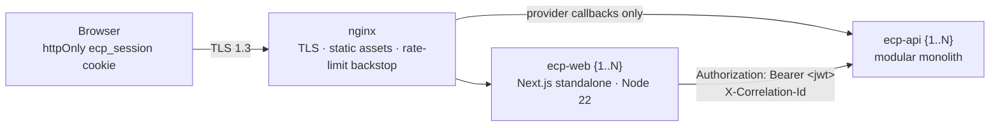
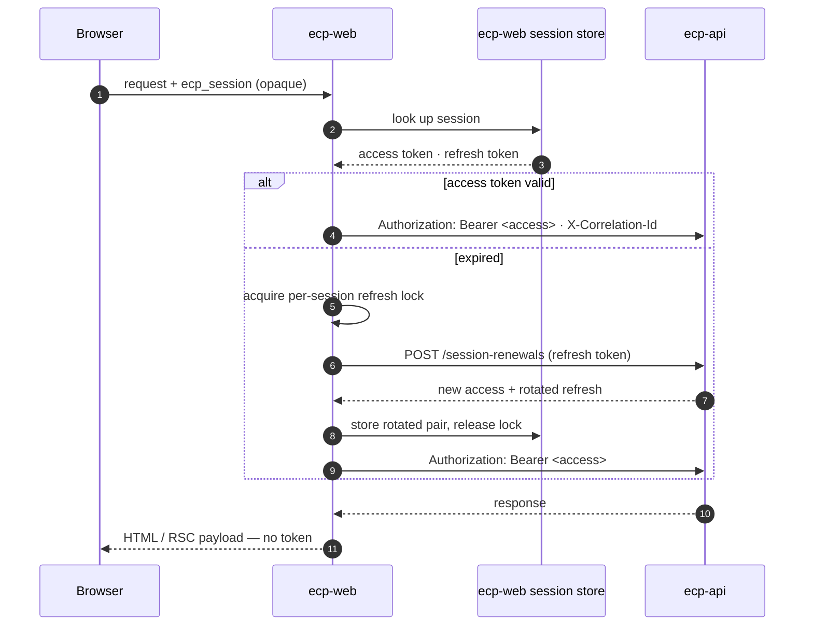

# Frontend Architecture — Enterprise Commerce Platform (ECP)

**Document type:** Frontend architecture specification (normative)
**Status:** **Proposed** — every section discharges a decision an ADR deferred to this file, or makes one no repository document states
**Audience:** Frontend Engineering, Architecture Review, Security, QA
**Related documents:** [Routing](./Routing.md) · [Feature Structure](./Feature%20Structure.md) · [Data Fetching](./Data%20Fetching.md) · [State Management](./State%20Management.md) · [Performance](./Performance.md) · [UI Design System](./UI%20Design%20System.md) · [ADR-0019](../01-system/ADR/ADR-0019-nextjs-app-router-rendering-strategy.md) · [ADR-0020](../01-system/ADR/ADR-0020-typescript-strict-mode.md) · [ADR-0025](../01-system/ADR/ADR-0025-httponly-cookie-session.md) · [ADR-0036](../01-system/ADR/ADR-0036-nextjs-server-sole-api-caller.md) · [Security](../01-system/Security.md) · [Deployment Diagram](../01-system/Deployment%20Diagram.md) · [Integration Contract](../04-shared/Integration%20Contract.md)

---

## 1. What This Folder Is

Eight records — [`ADR-0019`](../01-system/ADR/ADR-0019-nextjs-app-router-rendering-strategy.md) through [`ADR-0026`](../01-system/ADR/ADR-0026-motion-and-accessibility-baseline.md) — decided the frontend's shape: App Router with React Server Components, TypeScript in strict mode, Tailwind with shadcn/ui on Radix, the *Ma* design system as tokens, server-first data fetching, four state categories, an httpOnly session cookie, and a constrained motion and accessibility baseline. Each of them then deferred its follow-on questions to a file that did not exist.

This folder is that file, split into six.

**The split follows the `02-backend/` precedent.** [`Backend Architecture.md`](../02-backend/Backend%20Architecture.md) holds the runtime and defers the command/query split to [`CQRS.md`](../02-backend/CQRS.md) and the schema to [`Database.md`](../02-backend/Database.md), rather than growing into one file nobody finishes reading. The same division applies here, and for the same reason: a route table and a token specification have different readers.

| Document | What it settles |
|---|---|
| **This document** | The runtime, the layer model, session custody, CSRF, CSP, and the TypeScript/codegen/lint toolchain |
| [`Routing.md`](./Routing.md) | The route tree — every storefront and admin route, its rendering class, its cache policy, the roles that reach it, and the OpenAPI operations behind it |
| [`Feature Structure.md`](./Feature%20Structure.md) | The folder layout and the import rules a lint gate enforces |
| [`Data Fetching.md`](./Data%20Fetching.md) | The server-side fetch client, Server Actions, revalidation, pagination, and the error-to-UI mapping |
| [`State Management.md`](./State%20Management.md) | Where each category of state lives, the URL encoding contract, and the shape of the client store |
| [`Performance.md`](./Performance.md) | Per-route-class budgets, bundle and asset discipline, and how the budgets are measured |
| [`UI Design System.md`](./UI%20Design%20System.md) | *(exists)* The *Ma* specification — space, type, colour, components, motion, accessibility |

### 1.1 What this document does not decide

- **Anything an ADR already decided.** These documents elaborate `ADR-0019`–`ADR-0026`; they do not revisit them. Where the work below needed a decision that would have contradicted a record, or that was genuinely contested on its own terms, it became a record instead — [`ADR-0035`](../01-system/ADR/ADR-0035-feature-sliced-frontend-structure.md) through [`ADR-0039`](../01-system/ADR/ADR-0039-frontend-performance-budgets-ci-gate.md).
- **Visual design.** [`UI Design System.md`](./UI%20Design%20System.md) is normative for space, type, colour, and motion, and [`ADR-0022`](../01-system/ADR/ADR-0022-ma-design-tokens.md) makes it mechanical. Nothing here restates a token value.
- **Authorisation.** The frontend enforces nothing (§3.4). The rules are in [`Permission Matrix.md`](../04-shared/Permission%20Matrix.md) and they are applied in `ecp-api`.

### 1.2 Status

Per [`ADR/README.md`](../01-system/ADR/README.md) §2 a document is `Proposed` when the decisions it states exist nowhere else. That is the case for all six files in this folder, so all six carry that status as a whole. Two sections carry more weight than the rest and want ratification specifically: **§4**, which ratifies cookie and CSRF parameters the OpenAPI contract has already had to assume, and **§5**, which converts a `[ASSUMPTION]`-marked CSP into a specification.

---

## 2. The Runtime

### 2.1 What `ecp-web` is

[`Deployment Diagram.md`](../01-system/Deployment%20Diagram.md) §2 puts `ecp-web {1..N}` on VM `app-01` beside `nginx` and `ecp-api`, and §3 fixes the artefact: `next build` with `output: "standalone"`, deployed as a Node 22 container image. One deployable serves both the storefront and the admin console; the separation between them is a route group (§3.2), not a second application.



**The browser never reaches `ecp-api`.** [`ADR-0025`](../01-system/ADR/ADR-0025-httponly-cookie-session.md) rejected the direct-call option deliberately, and [`Security.md`](../01-system/Security.md) §6.3 records the consequence: `ecp-api` needs no permissive CORS policy, and adding one would undo the decision quietly. The single exception is the two provider callbacks, which terminate at `nginx` and are routed to `ecp-api` without passing through `ecp-web` at all.

### 2.2 `ecp-web` is inside the trusted computing base

This is the most important sentence in this document. `ecp-web` holds live access and refresh tokens, so its logging, its error reporting, and its memory handling are security-relevant in a way a conventional frontend's are not. [`Security.md`](../01-system/Security.md) §14 carries this as residual risk **R2** and states plainly that nothing within this architecture mitigates it — the alternative moves the risk into the browser, which is worse.

Three obligations follow, and they are not optional:

| Obligation | Detail |
|---|---|
| No token in any client payload | Not in a serialised RSC payload, not in a props object, not in a `Set-Cookie` the browser can read. §4.2 makes this mechanical. |
| No server exception object reaches a client error reporter | [`Security.md`](../01-system/Security.md) §8.4. A client-side reporter receives an error id and a correlation id, never a stack or a response body. |
| Nothing at `C2` classification is logged | Access tokens, refresh tokens, CSRF tokens, and reset tokens are `NFR-SEC-07` "never" data ([`Security.md`](../01-system/Security.md) §9). This applies to `ecp-web`'s own logs identically to `ecp-api`'s. |

### 2.3 What the runtime is not asked to do

`ecp-web` renders, fetches, and holds a credential. It does not consume Kafka, does not read PostgreSQL, Elasticsearch, MongoDB, or either Redis instance, and does not know which store answered a query — [`Integration Contract.md`](../04-shared/Integration%20Contract.md) §2 keeps read-model choice behind the contract. The one place a backend concern crosses into the frontend is catalog revalidation, and it crosses as a signed HTTP call rather than as a broker subscription ([`ADR-0038`](../01-system/ADR/ADR-0038-event-driven-catalog-revalidation.md), [`Data Fetching.md`](./Data%20Fetching.md) §7).

---

## 3. The Layer Model

### 3.1 Four layers

```nano
  app/            routes — layouts, pages, boundaries, route handlers
      ↓
  features/       one folder per API domain: components · server · schema · url
      ↓
  lib/            the fetch client, session custody, observability   ('server-only')
      ↓
  components/     ui/ (shadcn source) · layout/ — no data access, ever
```

Dependencies point downward only, and `features/A` never imports `features/B`. [`Feature Structure.md`](./Feature%20Structure.md) specifies the layout and the lint rules that enforce it; [`ADR-0035`](../01-system/ADR/ADR-0035-feature-sliced-frontend-structure.md) records why this shape and not a type-first one.

**Feature folders follow the API's fourteen domains, not the backend's thirteen modules.** The two do not line up: `search-recommendation` is a domain in [`OpenAPI/`](../04-shared/OpenAPI/README.md) and a read model owned by `catalog` on the backend, and `cart-wishlist` is one domain over two aggregates. The frontend consumes the contract, so it is organised by the contract. [`Feature Structure.md`](./Feature%20Structure.md) §3 lists the mapping and names the three places it is not one-to-one.

### 3.2 Route groups

Four groups, each with its own layout, its own cookie posture, and its own budget class:

| Group | Contains | Layout | Session |
|---|---|---|---|
| `(storefront)` | Catalog, search, product, cart, wishlist, checkout | Header · footer · full-width shell | Optional — `GUEST` reaches most of it |
| `(auth)` | Sign-in, registration, verification, password reset | Minimal shell, no navigation | None, by construction |
| `(account)` | Profile, addresses, orders, returns, reviews, notifications | Storefront shell + account sidebar | Required, `CUSTOMER` |
| `(admin)` | The operator console across all fourteen domains | Separate shell — dense navigation, no storefront chrome | Required, operator role · `SameSite=Strict` (§4.1) |

[`Routing.md`](./Routing.md) enumerates the routes; this table fixes the groups so the rest of the folder can refer to them.

### 3.3 The Server/Client boundary

[`ADR-0019`](../01-system/ADR/ADR-0019-nextjs-app-router-rendering-strategy.md) §5 names the misplaced `"use client"` as the main source of defects in this model, and it is worth restating why: there is no error. A subtree silently moves into the browser bundle, the page gets slower, and nothing fails. The rules that keep it visible:

| Rule | Detail |
|---|---|
| Server by default | A component is a Server Component unless something forces otherwise. The forcing reasons are exactly four: interactivity, a browser API, a Radix primitive, or Framer Motion. |
| `"use client"` goes on the leaf | Not on the page, not on the section — on the smallest component that actually needs it. A client boundary at the page level is a review rejection, not a preference. |
| Interactive shells take `children` | A client component that wraps content — a disclosure, a tab panel, a dialog — receives server-rendered `children` as props rather than importing them. This is the one technique that keeps a client boundary from spreading. |
| No data access below a client boundary | Client components receive data as props or fetch through one of the four permitted client-cache cases ([`Data Fetching.md`](./Data%20Fetching.md) §5). |
| The bundle is measured, not trusted | The client-JS budget of [`Performance.md`](./Performance.md) §2 is the mechanism that makes a creeping boundary fail the build rather than degrade the site. |

### 3.4 The frontend enforces nothing

[`ADR-0019`](../01-system/ADR/ADR-0019-nextjs-app-router-rendering-strategy.md) §4 states it, [`Integration Contract.md`](../04-shared/Integration%20Contract.md) §5 restates it, and [`Security.md`](../01-system/Security.md) §5 scores the frontend's contribution to authorisation at **zero**. This document adds only the practical corollaries, because they are where the rule is actually broken:

- **A hidden control is a courtesy.** Every role-conditional render in [`Routing.md`](./Routing.md) is labelled as such. The server rejects the call whether or not the button was drawn.
- **A role hint is display data.** The server may pass the acting party's roles for rendering ([`ADR-0025`](../01-system/ADR/ADR-0025-httponly-cookie-session.md) §4). It is never the basis of a decision, never cached as authority, and never consulted before a request — the request is made and the answer is believed.
- **Middleware redirects; it does not authorise.** Sending an unauthenticated caller from `/account/orders` to `/sign-in` is routing. It is not a permission check, and `T9` in [`Security.md`](../01-system/Security.md) §13 is the threat that exists because someone will eventually mistake it for one.
- **A `404` on someone else's order is correct and must be rendered as a `404`.** [`Integration Contract.md`](../04-shared/Integration%20Contract.md) §2.1 returns `404` rather than `403` across an ownership boundary specifically so existence is not disclosed. A client that "helpfully" renders "you don't have permission" undoes that.

---

## 4. Session Custody

**This section discharges [`ADR-0025`](../01-system/ADR/ADR-0025-httponly-cookie-session.md) §5's deferral of the CSRF mechanism and cookie parameters, and ratifies [`Security.md`](../01-system/Security.md) §4.4.** [`OpenAPI/README.md`](../04-shared/OpenAPI/README.md) §6 carries assumptions **`O-03`** (cookie named `ecp_session`) and **`O-04`** (CSRF token in `X-CSRF-Token`) because the contract could not be valid without choosing. Both are adopted here, so the assumption rows can be retired rather than left standing against a stub.

### 4.1 The cookies

Three cookies exist. No fourth is added without amending this section.

| Cookie | `httpOnly` | `Secure` | `SameSite` | Path | Contents |
|---|---|---|---|---|---|
| `ecp_session` | **Yes** | Yes | `Lax` · **`Strict`** on `(admin)` | `/` | Opaque server-session reference. **Never a JWT.** |
| `ecp_csrf` | No — by design | Yes | `Lax` / `Strict`, matching | `/` | Random token, also sent as `X-CSRF-Token` (§4.3) |
| `ecp_cart` | Yes | Yes | `Lax` | `/` | Guest cart identifier only. Not part of the authenticated session. |

Four things this table decides that were previously open:

1. **`ecp_session` is opaque, not a token.** [`ADR-0025`](../01-system/ADR/ADR-0025-httponly-cookie-session.md) §4 requires that no token is ever present in client JavaScript; an opaque reference means no token is present in the *browser* at all, encrypted or otherwise. The access and refresh tokens live in `ecp-web`'s server-side session store, keyed by this value.
2. **`SameSite=Strict` on the admin console** ([`Security.md`](../01-system/Security.md) §4.4). The cost is that an admin arriving from an external link lands unauthenticated and re-navigates; on a low-traffic, high-privilege surface that is the right trade.
3. **`ecp_cart` is separate and survives sign-in.** `FR-CRT-06` and `BR-CRT-03` require a guest cart to merge into the customer's cart on login. Merging is a server call on the sign-in path, not a cookie rename.
4. **Expiry is explicit.** No session cookie is issued without one. Lifetime and idle timeout are product decisions [`ADR-0025`](../01-system/ADR/ADR-0025-httponly-cookie-session.md) §5 leaves open; that they are set is not.

### 4.2 Token custody and refresh



**Refresh is serialised per session, and that is a correctness requirement rather than an optimisation.** [`ADR-0016`](../01-system/ADR/ADR-0016-jwt-refresh-rotation-rbac.md) §5 and [`Security.md`](../01-system/Security.md) §4.3 both name the failure it prevents: two concurrent requests presenting the same refresh token look exactly like the reuse `NFR-SEC-03` treats as compromise, and the whole session is invalidated. `auth.refresh_reuse_detected` is described in [`Security.md`](../01-system/Security.md) §11 as the highest-signal event the platform produces; a frontend that trips it routinely destroys that signal's value.

The lock is held on the session key, is held only across the renewal call, and has a timeout shorter than the request timeout — a lock that outlives its holder converts a refresh race into a hang.

**Logout clears the cookie *and* invalidates the refresh token server-side** ([`ADR-0025`](../01-system/ADR/ADR-0025-httponly-cookie-session.md) §4, `FR-CUS-04`). Clearing the cookie alone leaves a live session behind, which is the more common bug and the less visible one.

### 4.3 CSRF

Cookie authentication trades XSS token theft for CSRF exposure, so the mitigation is mandatory — [`ADR-0025`](../01-system/ADR/ADR-0025-httponly-cookie-session.md) §4 says "not optional and not deferred," and [`Security.md`](../01-system/Security.md) §4.4 specifies the mechanism. This section is its frontend realisation.

| Aspect | Decision |
|---|---|
| Mechanism | **Signed double-submit.** A random token in the non-`httpOnly` `ecp_csrf` cookie and in the `X-CSRF-Token` header, compared server-side in constant time. |
| Why not `SameSite` alone | `SameSite` defends against cross-*site* requests. It does not defend against a compromised same-site subdomain, which is why the token layer exists ([`Security.md`](../01-system/Security.md) §13, `T3`). |
| Scope | Every cookie-authenticated `POST` / `PUT` / `PATCH` / `DELETE`, including Server Actions. |
| Never required | Alongside `bearerAuth` — a bearer token is not ambiently attached, so a non-browser caller has no CSRF exposure to mitigate ([`Security.md`](../01-system/Security.md) §4.4). |
| Rotation | On sign-in, on privilege change, and on logout. Not per request — per-request rotation breaks concurrent submissions and buys nothing here. |
| Failure | `403` with `csrf.token_invalid` logged ([`Security.md`](../01-system/Security.md) §11). Rendered as the §13 empty-state pattern, not as a stack trace. |

**Server Actions are covered by this, not exempt from it.** They are `POST` requests carrying a cookie, so they are precisely the shape CSRF exploits. The check belongs in one wrapper that every action composes ([`Data Fetching.md`](./Data%20Fetching.md) §6), because a per-action habit is the kind of thing that holds for a year and then does not.

### 4.4 What is never done

- **No token in `localStorage`, `sessionStorage`, or `IndexedDB`.** [`ADR-0025`](../01-system/ADR/ADR-0025-httponly-cookie-session.md) rejected this and gave the reason: it defeats rotation and reuse detection entirely.
- **No `Authorization` header set by client JavaScript.** There is nothing to put in one.
- **No token in a URL**, a query parameter, a fragment, or a redirect target.
- **No role or permission cached as authority** (§3.4).

---

## 5. Content Security Policy and Security Headers

[`Security.md`](../01-system/Security.md) §6.3 carries the CSP as **`[ASSUMPTION]`** — `default-src 'self'`, no `unsafe-inline` for scripts, nonce-based where Next.js requires inline — and names this document as where it becomes a specification. It does, here.

### 5.1 The policy

| Directive | Value | Note |
|---|---|---|
| `default-src` | `'self'` | The baseline everything else narrows |
| `script-src` | `'self' 'nonce-<per-request>' 'strict-dynamic'` | No `unsafe-inline`, no `unsafe-eval`. `strict-dynamic` is what lets Next.js's own loader run without widening the policy to a host allowlist |
| `style-src` | `'self' 'nonce-<per-request>'` | Tailwind emits a stylesheet, not inline styles; the nonce covers Next.js's critical-CSS inlining |
| `img-src` | `'self' data: blob:` | `data:` for inlined placeholders, `blob:` for client-side image preview on review upload |
| `font-src` | `'self'` | **This is why fonts are self-hosted.** Inter is served from the origin, not from a font CDN — see [`Performance.md`](./Performance.md) §5 |
| `connect-src` | `'self'` | The browser calls `ecp-web` and nothing else (§2.1) |
| `frame-ancestors` | `'none'` | Clickjacking; supersedes `X-Frame-Options` |
| `form-action` | `'self'` | A payment provider redirect is a navigation the provider initiates, not a form post to a third-party origin |
| `base-uri` | `'none'` | Removes a `<base>` injection vector |
| `object-src` | `'none'` | No plugin content exists |
| `upgrade-insecure-requests` | set | Belt to `NFR-SEC-06`'s braces |

**The nonce is generated per request in middleware** and threaded to the framework's script and style tags. That makes every page dynamic with respect to the nonce, which interacts with the static generation of [`ADR-0019`](../01-system/ADR/ADR-0019-nextjs-app-router-rendering-strategy.md) §4 — the resolution is in [`Performance.md`](./Performance.md) §7 and it is an honest trade, not a solved problem.

**A payment provider redirect is a full-page navigation, not a frame.** `frame-ancestors: 'none'` and the absence of a `frame-src` allowance are deliberate: an embedded provider iframe would require widening the policy and would put a credential-entry surface inside a page this platform controls. If a provider integration later requires framing, it is an amendment to this section with `Security.md` §13 re-examined, not a configuration change.

### 5.2 The other headers

`Strict-Transport-Security` with a long `max-age` and `includeSubDomains` ([`Security.md`](../01-system/Security.md) §7); `X-Content-Type-Options: nosniff`; `Referrer-Policy: strict-origin-when-cross-origin`; `Permissions-Policy` denying camera, microphone, geolocation, and payment-request by default. All are set in one middleware, not per route, so a new route cannot be born unprotected.

### 5.3 The two lint bans

[`Security.md`](../01-system/Security.md) §12.2 makes these build-failing, and [`Testing and Benchmark Strategy.md`](../01-system/Testing%20and%20Benchmark%20Strategy.md) §6.7 puts them in the lint layer:

| Rule | Why |
|---|---|
| `dangerouslySetInnerHTML` is not used | React's escaping is the platform's primary XSS control (`T2`). One call site removes it for that subtree. Review-supplied text and product descriptions are the realistic vectors, and both are rendered as text. |
| `outline: none` is not written | It removes the visible focus indicator [`UI Design System.md`](./UI%20Design%20System.md) §14 requires. Focus styling is changed by restyling the ring, never by removing it. |

Both are errors, not warnings. A genuine exception is a suppression comment with a justification, which is visible in review — which is the point.

---

## 6. TypeScript, Codegen, Lint, and Format

**This section discharges [`ADR-0020`](../01-system/ADR/ADR-0020-typescript-strict-mode.md) §5's deferral of generator choice, lint rule set, and formatter.**

### 6.1 TypeScript

`strict: true`, not relaxed per file, per [`ADR-0020`](../01-system/ADR/ADR-0020-typescript-strict-mode.md) §4. Beyond that record's commitments, three settings that record implies but does not name: `noUncheckedIndexedAccess` (an array index is `T | undefined`, which is what it actually is), `exactOptionalPropertyTypes`, and `verbatimModuleSyntax`. `tsc --noEmit` is build-failing ([`Testing and Benchmark Strategy.md`](../01-system/Testing%20and%20Benchmark%20Strategy.md) §6.7).

### 6.2 The domain vocabulary

[`ADR-0020`](../01-system/ADR/ADR-0020-typescript-strict-mode.md) §4 requires the domain's most easily-lost invariants to be carried into the client. [`Integration Contract.md`](../04-shared/Integration%20Contract.md) §2 says what they are on the wire:

| Wire rule | Frontend type |
|---|---|
| Money is always `{"amount": "129.99", "currency": "VND"}`, amount a **string** | A `Money` type whose `amount` is `string`. **No arithmetic on it anywhere in the frontend.** Totals are computed by `ecp-api` and displayed; a client that adds two line totals has introduced a rounding bug the backend cannot see. |
| Identifiers are opaque strings, never parsed or ordered | Branded types — `OrderId`, `ProductId`, `SkuId`, `CartId` — so a `ProductId` cannot be passed where an `OrderId` belongs |
| Timestamps are RFC 3339 UTC with offset | A branded `Timestamp` string, formatted for display at the last moment and in the user's locale |
| Order status, payment status, `ReservationStatus` are closed sets | Discriminated unions, so an unhandled state is a compile error rather than a blank screen |

The `Money` rule is the one most likely to be broken by someone being helpful, so it is stated as a prohibition rather than a preference: **the frontend formats money; it never computes it.**

### 6.3 Codegen

| Commitment | Detail |
|---|---|
| Source | [`04-shared/OpenAPI`](../04-shared/OpenAPI/README.md) — the hand-authored, normative contract of [`ADR-0031`](../01-system/ADR/ADR-0031-contract-first-openapi.md) |
| Tool | **`openapi-typescript`** — it emits types only, no client and no runtime, which suits a codebase that has its own fetch client (§6.4) and does not want a second one generated into it |
| Output | Checked in, generated in CI, and **a diff fails the build**. [`ADR-0020`](../01-system/ADR/ADR-0020-typescript-strict-mode.md) §5 is explicit that a stale generation is worse than none. |
| Runtime parsing | **Zod** schemas at the API boundary. A generated type is a compile-time claim about a network response; the network delivers whatever it delivers ([`Data Fetching.md`](./Data%20Fetching.md) §3). |
| What is not generated | The Zod schemas for responses the UI depends on structurally are hand-written and reviewed. Generating them from the same document that produced the types would make both wrong in the same way if the document is wrong. |

**Why not a generated client.** A generated client would have to be taught the session cookie, the correlation header, the idempotency key, the problem-JSON parsing, and the cursor pagination — every one of which is a decision in this folder. Teaching a generated artefact five local rules is more work than writing eighty lines of `fetch` wrapper, and the wrapper is reviewable. [`ADR-0036`](../01-system/ADR/ADR-0036-nextjs-server-sole-api-caller.md) records this.

### 6.4 Lint and format

| Layer | Rules |
|---|---|
| Base | `eslint-config-next` with `typescript-eslint` recommended-type-checked |
| Type safety | `no-explicit-any` as an **error** ([`ADR-0020`](../01-system/ADR/ADR-0020-typescript-strict-mode.md) §4: "`any` is a defect"); `no-unsafe-*` enabled; `unknown` plus narrowing is the sanctioned alternative |
| Security | The two bans of §5.3 |
| Design system | Tailwind arbitrary values (`p-[25px]`, `text-[#123456]`) and raw hex in component source are errors ([`ADR-0022`](../01-system/ADR/ADR-0022-ma-design-tokens.md) §4) |
| Boundaries | The import rules of [`Feature Structure.md`](./Feature%20Structure.md) §4, enforced by `eslint-plugin-boundaries` with `dependency-cruiser` as the graph-level check ([`ADR-0035`](../01-system/ADR/ADR-0035-feature-sliced-frontend-structure.md)) |
| Data fetching | `@tanstack/react-query` imports outside the four permitted feature paths are errors ([`Data Fetching.md`](./Data%20Fetching.md) §5) |
| Format | **Prettier**, with `prettier-plugin-tailwindcss` for class ordering. Formatting is not a review topic. |

Lint is build-failing. Together with `tsc --noEmit`, the boundary check, and the budget gate of [`ADR-0039`](../01-system/ADR/ADR-0039-frontend-performance-budgets-ci-gate.md), this is the frontend's answer to [`ADR-0018`](../01-system/ADR/ADR-0018-architecture-governance-ci-gate.md) — the asymmetry `P15` warns about, closed on the half of the system the customer actually touches.

---

## 7. Configuration

| Variable | Server-only | Purpose |
|---|---|---|
| `ECP_API_BASE_URL` | Yes | `http://ecp-api:8080/api/v1` on the internal network |
| `ECP_SESSION_SECRET` | Yes | Signs the session reference and the CSRF token |
| `ECP_REVALIDATE_SECRET` | Yes | Verifies the backend's revalidation callback ([`Data Fetching.md`](./Data%20Fetching.md) §7) |
| `ECP_PUBLIC_ORIGIN` | Yes | Absolute URLs in metadata, sitemaps, and canonical tags |
| `NEXT_PUBLIC_*` | **No — public** | Reserved for values that are genuinely public. **No secret, no internal hostname, and no API base URL is ever given this prefix.** |

**Nothing reaches the browser except through a `NEXT_PUBLIC_` variable or a rendered prop**, and both are reviewed. Secrets are files or environment variables provided by the deployment, per [`Deployment Diagram.md`](../01-system/Deployment%20Diagram.md) §5; none is committed.

`ecp-web` exposes a `GET /healthz` route handler that reports process liveness only. **It does not proxy `ecp-api`'s health** — a frontend that reports itself unhealthy because the API is down removes the ability to serve statically generated catalog pages during an API outage, which is the one thing this architecture can still do.

---

## 8. Verification

The frontend test layers are specified in [`Testing and Benchmark Strategy.md`](../01-system/Testing%20and%20Benchmark%20Strategy.md) §6.7 and are not restated here. What this document adds is which of its own claims each layer verifies:

| Claim | Verified by | Layer |
|---|---|---|
| No token reaches the browser (§2.2, §4.4) | An assertion over rendered output and `Set-Cookie` on the sign-in E2E path | Playwright |
| CSRF is required on every cookie-authenticated write (§4.3) | A request without `X-CSRF-Token` is rejected | Integration test against `ecp-web` |
| Refresh is serialised (§4.2) | Concurrent expired-token requests produce exactly one renewal call | Integration test |
| The CSP is served and is not widened (§5.1) | Header assertion per route group | Integration test |
| Generated types match the contract (§6.3) | Regenerate and diff | CI step, build-failing |
| Boundaries hold (§3.1) | `eslint-plugin-boundaries` · `dependency-cruiser` | Lint, build-failing |
| Budgets hold ([`Performance.md`](./Performance.md)) | Lighthouse CI · bundle-size gate | CI, build-failing ([`ADR-0039`](../01-system/ADR/ADR-0039-frontend-performance-budgets-ci-gate.md)) |
| Contrast, focus, and hit area | `axe` · token contrast assertions | Component tests |

**What is not verified, and is worth saying so.** `ecp-web`'s position in the trusted computing base (§2.2) is not testable — it is a property of the architecture, and the controls are review-enforced. The `Money` prohibition in §6.2 has no lint rule behind it today; it is a review rule, and a weaker guarantee than the rest of §6.

---

## 9. The Deferred Mobile Client

SRS §8 defers a native mobile client, and [`ADR-0025`](../01-system/ADR/ADR-0025-httponly-cookie-session.md) §5 notes it cannot use the cookie flow. This document does not design it, but it does fix the boundary so the eventual design is additive rather than a rewrite:

- **A mobile client calls `ecp-api` directly** with `Authorization: Bearer <jwt>`, which [`Integration Contract.md`](../04-shared/Integration%20Contract.md) §5 already supports — "a new caller, not new rules."
- **It does not call `ecp-web`.** Nothing in this folder — no route handler, no Server Action, no BFF composition — is a public API, and none of it is contract-stable. [`ADR-0036`](../01-system/ADR/ADR-0036-nextjs-server-sole-api-caller.md) makes that explicit so a future client is not built against it by accident.
- **Two authentication flows will then coexist**, which [`ADR-0025`](../01-system/ADR/ADR-0025-httponly-cookie-session.md) §5 accepts. `P5` is what makes it safe: the rules are server-side, so a second client class cannot reach a different answer.

---

## 10. Open Questions

Named so their absence is visible rather than mistaken for an oversight.

| # | Question | Why it is open |
|---|---|---|
| **F-01** | Session lifetime, idle timeout, and "remember me" | [`ADR-0025`](../01-system/ADR/ADR-0025-httponly-cookie-session.md) §5 calls these product decisions. §4.1 requires an explicit expiry; it does not set one. |
| **F-02** | Where `ecp-web`'s server-side session store lives | `redis-state` is the obvious candidate ([`ADR-0034`](../01-system/ADR/ADR-0034-redis-two-instance-topology.md) already names "session hot data"), but §2.3 says `ecp-web` reaches no data store today. Resolving this changes [`Deployment Diagram.md`](../01-system/Deployment%20Diagram.md) §2, so it is a topology decision, not a frontend one. **This is the largest open item in this folder** — multi-replica `ecp-web` does not work without it. |
| **F-03** | Client-side error reporting destination | §2.2 constrains what may be sent; no sink is chosen, and [`Security.md`](../01-system/Security.md) §8 governs whichever is. |
| **F-04** | Internationalisation | SRS §8 defers multi-language. [`ADR-0022`](../01-system/ADR/ADR-0022-ma-design-tokens.md) §5 flags that Inter's script coverage wants checking first. No route-level locale segment exists in [`Routing.md`](./Routing.md), and adding one later changes every URL. |
| **F-05** | Dark mode | Not in [`UI Design System.md`](./UI%20Design%20System.md), not decided. [`ADR-0022`](../01-system/ADR/ADR-0022-ma-design-tokens.md) exposes colour as CSS custom properties so the door stays open. |

`F-02` blocks horizontal scaling of `ecp-web` and should be resolved before the first multi-replica deployment, not after.
