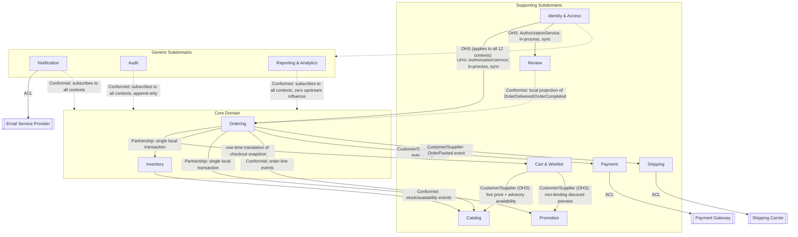
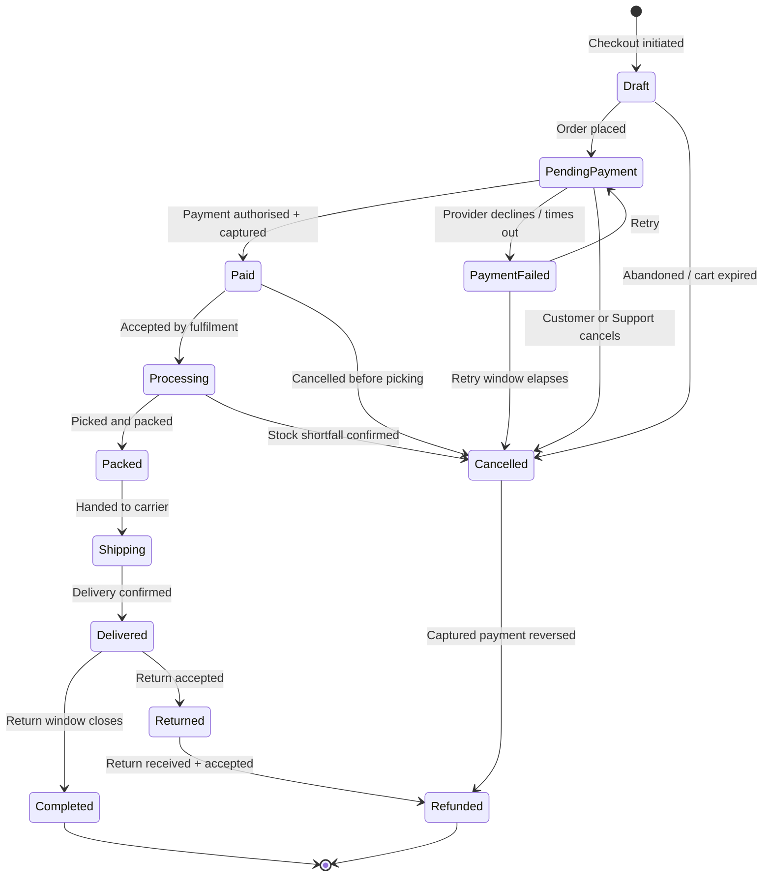
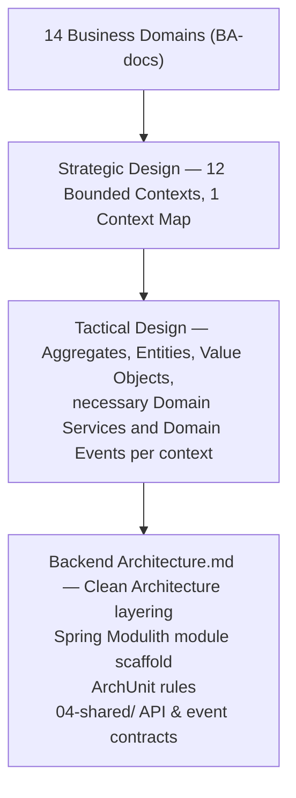

# Domain Model — Enterprise Commerce Platform (ECP)

**Document type:** Domain-Driven Design — Strategic & Tactical Design
**Related documents:** [Business Problem Analysis](../../BA-docs/general-approach.md) · [Software Requirements Specification](../../BA-docs/srs.md) · [Traceability Matrix](../../BA-docs/traceability-matrix.md) · [Solution Architecture](../01-system/Solution%20Architecture.md) · [Technology Stack](../01-system/Technology%20Stack.md)
**Audience:** Backend Engineering, Architecture Review

---

## 1. Purpose

This document defines the bounded contexts, relationships, aggregates, invariants, events, and repositories required by `P1` and `P5` in [Solution Architecture](../01-system/Solution%20Architecture.md).

[`srs.md`](../../BA-docs/srs.md) §4–§5 and the [use cases](../../BA-docs/use-cases/) remain normative for behavior. This document structures that behavior for [Backend Architecture](./Backend%20Architecture.md), Spring Modulith, ArchUnit, and JMolecules.

---

# Part I — Strategic Design

## 2. Subdomain Classification

The classification reflects business differentiation, not technical difficulty. Promotion has strong concurrency rules but remains Supporting.

| Class | Bounded Contexts | Why |
|---|---|---|
| **Core** | Ordering, Inventory | Checkout & Order is, in the BA use cases' own words, "the domain the business is actually for" — every other capability exists to get a customer to a placed order. Inventory carries the highest-emphasized business risk in the entire specification: `BR-INV-01`'s oversell prevention under concurrent demand is called out repeatedly (`srs.md` R1 §2, §8; SA P8) as the failure mode the business cannot absorb. |
| **Supporting** | Catalog, Cart & Wishlist, Payment, Shipping, Promotion, Review, Identity & Access | Necessary, custom to this business, but not the differentiator. A competent implementation is expected here; competitive advantage is not sought here. |
| **Generic** | Notification, Audit, Reporting & Analytics | Solved problems. Each is a well-understood pattern (event-driven dispatch, append-only log, CQRS projection) that could, in principle, be satisfied by an off-the-shelf capability. Investment here is deliberately minimized — see the proportional-rigor rule in §7. |

---

## 3. From 14 Business Domains to 12 Bounded Contexts

This table maps the 14 SRS domain codes to 12 bounded contexts and records each non-1:1 decision.

| BA domain code(s) | Bounded Context | Reconciliation |
|---|---|---|
| `CUS` | **Identity & Access** | SA's module is named "Customer." It is realized here as **Identity & Access**, explicitly renamed and widened: role-based access spans Guest, Customer, Staff, Warehouse Operator, Customer Support, and Administrator (SA §4 Actors table), not customers alone. Customer is one profile/role within this context, not the whole of it. |
| `CAT` | **Catalog** | Unchanged — owns Product, Variant, Category. |
| `SCH` | *(folded into Catalog)* | Keyword search, filtering, and ranking (`FR-SCH-01`–`04`) are a pure alternate query path over Catalog's own data — no separate business rules of their own, so no separate bounded context. Its read model is a CQRS projection *inside* Catalog (§8.2), not a new aggregate. Note: "frequently bought together" (`FR-SCH-08`), "trending" (`FR-SCH-09`), and personalized recommendations (`FR-SCH-11`) additionally need purchase co-occurrence and per-customer history — this read model is therefore a Conformist consumer of Catalog's *own* events **and** Inventory's stock/availability events **and** Ordering's order-line events, not Catalog data alone. |
| `INV` | **Inventory** | Unchanged. |
| `CRT` | **Cart & Wishlist** | Its own context. SA's own Actors table already implies this: a guest cart merging into a customer cart on login is described as "a Cart module concern, not a Customer module concern." |
| `ORD` | **Ordering** | Unchanged. |
| `PAY` | **Payment** | Unchanged. |
| `SHP` | **Shipping** | Unchanged. |
| `PRM` | **Promotion** | Unchanged. |
| `REV` | **Review** | Its own context — different lifecycle and invariants (moderation, verified-buyer eligibility) than Catalog, even though it displays alongside products. |
| `NTF` | **Notification** | Its own context — Generic, cross-cutting. |
| `ADM` | *(not a bounded context)* | Walking `UC-ADM-01`–`06`: only account suspension (`UC-ADM-03`) and role management (`UC-ADM-06`) are genuinely identity-shaped domain logic, and both land in Identity & Access. The rest — product/category edits (`UC-ADM-01/02`), order inspection/action (`UC-ADM-04`), inventory adjustment (`UC-ADM-05`) — are role-gated operations that already route through Catalog's, Ordering's, and Inventory's own public APIs. There is no leftover domain logic for "Administration" to own. It dissolves into (a) the User/Role model and authorization Open Host Service owned by Identity & Access, and (b) a thin, permission-gated composition layer (an admin BFF/API composing each context's own public API) — not a domain model of its own. |
| `RPT` | **Reporting & Analytics** | Its own context — Generic, pure CQRS read side. |
| `AUD` | **Audit** | Its own context — Generic. Note: the *authorization decision* logic (`BR-AUD-02`) lives in Identity & Access as an Open Host Service, not here. Audit owns only the immutable log of what happened. |

**Final set:** Identity & Access, Catalog, Inventory, Cart & Wishlist, Ordering, Payment, Shipping, Promotion, Review, Notification, Audit, and Reporting & Analytics. Solution Architecture already shows or implies all twelve through `P2`, `P13`, and `P17`.

---

## 4. Bounded Contexts

Each context owns its model, application services, infrastructure, and public API. Everything else is private (`P1`).

| Context | Purpose | Owns | Explicitly does not own |
|---|---|---|---|
| **Identity & Access** | Authenticate and authorize every actor; hold the account/profile relationship. | `Account`/`User`, roles, addresses, the platform's single authorization decision. | Order history, payment methods, reviews. |
| **Catalog** | Define what is sellable and let it be found. | `Product`, `Variant`, `Category`, the search/recommendation read model. | Stock levels, price *availability* (Catalog states the list price; Inventory states whether it can currently be sold). |
| **Inventory** | Guarantee stock is never oversold. | `StockItem`, `StockReservation` (as a child of `StockItem`). | Product content, pricing. |
| **Cart & Wishlist** | Hold a customer's in-progress selection, unpriced. | `Cart`, `CartLine`, `Wishlist`. | Prices (queries Catalog live), stock guarantees (queries Inventory-derived availability, non-authoritative), the order itself. |
| **Ordering** | Turn a checkout intent into a legally-progressing, financially-frozen order. | `Order`, `OrderLine`, the order state machine. | Payment capture, shipment execution, stock bookkeeping (coordinates with, does not own). |
| **Payment** | Capture and refund money against an order, exactly once per attempt. | `Payment`, `PaymentAttempt`, `Refund`. | The decision to place or cancel an order. |
| **Shipping** | Get a packed order to the customer and track it faithfully. | `Shipment`, `TrackingEvent`. | Packing/fulfillment operations themselves (Inventory/Warehouse concern upstream of Shipping). |
| **Promotion** | Decide, deterministically, what discount applies. | `Promotion`, usage counters. | Cart or order totals themselves (it returns a discount decision; Cart/Ordering apply it). |
| **Review** | Let verified buyers rate and review what they bought. | `Review`. | Product content, order history (references both by identity only). |
| **Notification** | Reliably deliver a message for a significant business event. | `NotificationRequest`. | The business meaning of the event it delivers. |
| **Audit** | Hold an immutable record of every significant action. | `AuditEntry` (append-only). | The authorization decision itself (Identity & Access owns that). |
| **Reporting & Analytics** | Answer business-intelligence questions without touching the transactional path. | Read-only projections. | Any authoritative business state. |

---

## 5. Context Map

### 5.1 The Order-Placement Partnership

`BR-ORD-02`, `UC-ORD-05`, and `UC-PRM-02` E7 require one local transaction across three aggregates:

- **`Order`** (Ordering) — enforces `BR-ORD-01`, `BR-ORD-02`, `BR-ORD-03` as its own single-aggregate invariants.
- **`StockItem`** (Inventory) — enforces `BR-INV-01` as its own single-aggregate invariant.
- **`Promotion`** (Promotion) — enforces its usage-cap counter as its own single-aggregate invariant.

Each invariant remains inside its aggregate. The shared database transaction provides cross-context atomicity. This exception applies only to `BR-ORD-02`.

Ordering owns two outbound ports for this, structurally identical to the external `PaymentProcessor`/`ShippingProvider` ports SA §4 already names, even though today's implementations are internal:

| Port | Owned by | Implemented today by | Implemented after extraction by |
|---|---|---|---|
| `StockReservationPort` | Ordering | In-process adapter calling Inventory's application service inside the same transaction | Saga/compensating-action adapter against an extracted Inventory service |
| `PromotionRedemptionPort` | Ordering | In-process adapter calling Promotion's application service inside the same transaction | Saga/compensating-action adapter against an extracted Promotion service |

A mid-placement failure (`UC-INV-01` E3) rolls back the local transaction. If Inventory or Promotion is extracted, the same ports use saga and compensation adapters (SA §11).

### 5.2 Relationship Table

| Upstream | Downstream | Pattern | Mechanism |
|---|---|---|---|
| Catalog | Cart & Wishlist | Customer/Supplier, Open Host Service | Live price + advisory (non-authoritative) availability, queried at display time |
| Promotion | Cart & Wishlist | Customer/Supplier, Open Host Service | Non-binding discount preview only |
| Cart & Wishlist | Ordering | One-time translation | Ordering's application service reads Cart's checkout snapshot once and translates it into Order's own frozen `OrderLine` value objects; not an ongoing dependency, and not an Anticorruption Layer — Cart is a friendly in-house upstream, not a foreign model. |
| Ordering ↔ Inventory | — | **Partnership** | Single local transaction; see §5.1. |
| Ordering ↔ Promotion | — | **Partnership** | Single local transaction; see §5.1. |
| Inventory | Catalog | Conformist | Catalog's read model consumes Inventory's stock/availability events so browse/search reflects availability (`FR-INV-07`, `FR-CAT-04`). |
| Ordering | Catalog | Conformist | Catalog's read model additionally consumes order-line events, needed for "frequently bought together"/"trending"/personalized recommendation (§3, `SCH`). |
| Ordering | Payment | Customer/Supplier, async events | `OrderPlaced` triggers a payment attempt; `PaymentSucceeded`/`PaymentFailed` flow back. Deliberately not synchronous, so payment latency/failure never blocks order creation. |
| Ordering | Shipping | Customer/Supplier, async events | Triggered by `OrderPacked` only — not `OrderPaid`. Per `FR-SHP-04` and the §5.3 order-lifecycle state model, a shipment is created after picking/packing, not at payment. |
| Payment | Payment Gateway | Anticorruption Layer | `PaymentProcessor` port (SA §4). |
| Shipping | Shipping Carrier | Anticorruption Layer | `ShippingProvider` port (SA §4). |
| Notification | Email Service Provider | Anticorruption Layer | `NotificationSender` port (SA §4). |
| Ordering | Review | Conformist | Review maintains its own local read-model projection of "which customers have Delivered/Completed orders containing which products," built from `OrderDelivered`/`OrderCompleted` events — not a synchronous call per review submission. Accepted eventual-consistency tradeoff for `BR-REV-01`. |
| Identity & Access | every other context | Open Host Service | A synchronous, in-process `AuthorizationService` call made from every other context's *application layer* (never its domain layer) before executing a command. This is what makes `BR-AUD-02` ("same decision regardless of entry point") hold by construction rather than by convention. |
| every context | Notification | Conformist | Downstream subscriber to domain events from all 11 other contexts; dispatches via the `NotificationSender` ACL. |
| every context | Audit | Conformist | Downstream subscriber to domain events from all 11 other contexts; exposes no mutation API at all — `BR-AUD-01` is enforced by construction, not by a runtime check. |
| every context | Reporting & Analytics | Conformist | Downstream subscriber to domain events from all 11 other contexts; zero upstream influence — no context designs around Reporting's needs. |

### 5.3 Shared Kernel

The Shared Kernel contains only `Money`, typed identity wrappers, and `Address`.

Two governance rules:

1. **Zero outbound dependencies.** The kernel depends on none of the 12 contexts — it must sit structurally beneath all of them, or Spring Modulith's module-boundary check has nothing meaningful to verify.
2. **Physical home is not `04-shared`.** [`SA-docs/README.md`](../README.md#folder-layout) §1.1 reserves it for contract artifacts. Backend Architecture places the kernel in its own `shared-kernel` module.

---

## 6. Ubiquitous Language

Terms that shift meaning across contexts, or that are easy to conflate:

| Term | Meaning here | Note |
|---|---|---|
| **Cart line** vs. **Order line** | A `CartLine` carries no price (`BR-CRT-04`); an `OrderLine` carries a `Money` value frozen at placement (`BR-ORD-06`). | Never treat a cart line as a priced object — the price is looked up live every time a cart is displayed. |
| **SKU** vs. **Product** vs. **Variant** | A `Product` is the sellable concept (name, description, category); a `Variant` is one purchasable configuration of it (size, color); a SKU identifies *at most one* Variant across the entire catalog (`BR-CAT-01`). | "Product" alone is never purchasable — only a Variant/SKU is. |
| **Reservation** | Colloquially ambiguous. This document always says **`StockReservation`**: a child entity of a `StockItem`, scoped to exactly one `(SKU, Warehouse)` pair, with its own Held→Committed/Released lifecycle (`BR-INV-02`). An order line that spans multiple warehouses is multiple independent `StockReservation` parts, not one entity spanning aggregates. | See §8.3. |
| **Customer** (BA term) vs. **Account/User** (this document's term) | `srs.md` uses "Customer" for the `CUS` domain specifically. This document's Identity & Access context owns a broader `Account`/`User` concept covering every human role (Guest through Administrator); "Customer" is one role within it. | See §3's reconciliation note. |
| **Available stock** | `quantityOnHand − quantityReserved` on a `StockItem` — a derived value, never stored independently, so it cannot drift out of sync with its inputs. | Enforces `BR-INV-01` by construction. |
| **Discount preview** vs. **Redemption** | Promotion's Cart-facing OHS returns a *preview* (non-binding, may change by checkout). Only the Order-Placement Partnership's `PromotionRedemptionPort` call is binding. | See §5.1. |

---

# Part II — Tactical Design

## 7. Tactical Design Rules

- Only aggregate roots are referenced outside an aggregate. Repositories exist per aggregate root, never per entity.
- Application Services load or save multiple aggregate instances, open transactions, and call cross-module APIs. A Domain Service is introduced only for domain behaviour that does not naturally belong to one aggregate, entity, or value object; a context may therefore own zero, one, or several. The §5.1 partnership remains an Application Service.
- Cross-context calls use ports. `StockReservationPort` and `PromotionRedemptionPort` have in-process adapters now and saga-capable adapters after extraction.
- Repository pre-checks provide feedback but are not authoritative under concurrency. Global invariants use the database unique/check/foreign-key constraints or an explicit locking/optimistic-concurrency strategy named by the owning context.
- `Product`, `StockItem`, and `Order` reserve an unused `ownerId` or `sellerId` for the multi-vendor path in SA §10.
- Sections 8.1–8.8 define full tactical models. Review, Notification, Audit, and Reporting use the lighter treatment set by §2.

### 7.1 Domain Service Contract

When a bounded context in §8 names a Domain Service, it places that logic beside the context's aggregates, invariants, events, and repository. A service is not created merely to give a context one, to collect stateless methods, or to hide repeated Application Service plumbing. This keeps ownership and rule traceability explicit without producing an anemic domain model.

All of those services follow the same boundary: they receive immutable domain objects or snapshots already loaded by an Application Service, return a decision, plan, or draft, and have no repository, port, clock, transaction, framework, or cross-module dependency. Evaluation time and external facts are inputs, so the same inputs always produce the same result. Application Services remain responsible for authorisation, I/O, transaction control, cross-context orchestration, and applying a returned decision to aggregates.

In the backend implementation, policies and their domain-owned input/decision types live below the owning module's `internal.domain.policy` package and carry no Spring annotation. Application-layer commands, errors, ports, transaction annotations, and API DTOs do not cross into that package.

The services below refine rules already defined by the SRS and use cases. They do not create new business requirements. Where those documents leave a policy open, the service requires an explicit configuration value or returns an unresolved decision rather than silently choosing a rule.

---

## 8. Per-Context Tactical Model

### 8.1 Identity & Access

| Aggregate | Root | Entities | Key Value Objects |
|---|---|---|---|
| `Account` | `Account` (per `srs.md`, keyed by email) | `CustomerAddress` (list, one flagged default), `IdentityToken` | `EmailAddress`, `CredentialHash`, `Role`, `AccountStatus` |

| Invariant | Rule | Enforced by |
|---|---|---|
| Email identifies at most one account | `BR-CUS-01` | DB unique constraint (§7 global-constraint pattern) |
| Unverified accounts can browse/cart but not order or review | `BR-CUS-02` | Cross-context check — Ordering's and Review's *application services* query `Account.verificationStatus` via this context's public API before proceeding, not a domain-layer dependency |
| Verification/reset/refresh tokens are single-use, expiring | `BR-CUS-03` | `IdentityToken` lifecycle rules plus conditional storage updates; the database update preserves the race guarantee |
| Authentication failure reveals nothing about which credential was wrong | `BR-CUS-04` | Application service (constant-shape response regardless of failure reason) |
| A non-empty address book has exactly one default shipping address; an empty address book has none | `BR-CUS-05`, `UC-CUS-09` | `AddressBookPolicy` plan plus the partial unique database index |
| A user may not self-grant a role they lack, nor revoke the last Administrator | `BR-AUD-03` | `AccessControlPolicy` pre-check + DB constraint / count query (§7 global-constraint pattern) |
| Authorization decision is a platform property, identical regardless of entry point | `BR-AUD-02` | `AccessControlPolicy`, exposed through the `AuthorizationService` Open Host Service |

**Domain Service — `AccessControlPolicy`.** `authorize(AccessContext) -> AuthorizationDecision` evaluates the actor's roles against the operation, resource ownership, and the normative [Permission Matrix](../04-shared/Permission%20Matrix.md). `evaluateRoleChange(RoleChangeContext) -> RoleChangeDecision` also rejects self-grant of an unheld role and revocation of the last Administrator. The Application Service supplies the actor, target, active-Administrator count, and resource facts; the policy performs no account lookup. The persistence-side lock/count/constraint strategy remains authoritative under concurrent role changes.

**Domain Service — `AddressBookPolicy`.** `plan(AddressBookContext, AddressBookChange) -> AddressBookPlan` decides the default-address transition across the account's address entities. The first address becomes default shipping; nominating a new default clears the previous nomination; removing the current default while other addresses remain returns `REPLACEMENT_DEFAULT_REQUIRED`; removing the only address is allowed and leaves no default. The plan identifies the target flags and which existing nomination must be cleared. The Application Service loads only the account-scoped facts needed by the policy and applies the plan atomically through the address persistence port; the partial unique index remains the concurrent-write authority. Billing-default behaviour is not inferred from `BR-CUS-05` and remains a separate, explicitly configured rule.

**Existing Domain Policy — `PasswordPolicy`.** `evaluate(CandidatePassword, PasswordRules) -> PasswordDecision` owns password-strength evaluation because the rule is meaningful without HTTP, hashing, or persistence and is reused by registration, password change, and password reset. `PasswordRules` is explicit configuration: `UC-CUS-01` records the concrete strength policy as an open Product Owner decision, so the domain model must not silently make the current implementation's minimum length and character classes normative. `PasswordEncoder` remains an Application port and raw passwords never enter an aggregate or event.

**Internal-code alignment.** The current `PermissionMatrixPermissionChecker` should remain the Application adapter that converts an `AuthorizationDecision` into the module's error contract, while role/ownership evaluation moves to `AccessControlPolicy`. The default-selection branches currently repeated by address add/replace flow through `AddressBookPolicy`; `AddressStore` still owns bulk updates and database interaction. Verification, reset, and refresh token managers remain Application Services because they generate/hash secrets, call `TokenStore`, and control transaction/concurrency behaviour; the `IdentityToken` entity retains expiry/consumption semantics. None of those I/O workflows belongs in a Domain Service.

**Domain Events:** `AccountRegistered`, `AccountVerified`, `AccountRoleChanged`, `AccountSuspended`.
**Repository:** `AccountRepository`.

### 8.2 Catalog

| Aggregate | Root | Entities | Key Value Objects |
|---|---|---|---|
| `Product` | `Product` | `Variant` | `Sku`, `Money` (list price), `ProductAttributes` |
| `Category` | `Category` | — | — |

| Invariant | Rule | Enforced by |
|---|---|---|
| A SKU identifies at most one purchasable unit across the entire catalog | `BR-CAT-01` | DB unique constraint (§7 global-constraint pattern) |
| An unpublished product is excluded from browse/search/cart but remains visible on orders that already contain it | `BR-CAT-02` | `Product.publicationStatus`, checked by Catalog's own query handlers; Ordering never re-queries Catalog for an existing order's lines (`BR-ORD-06`) |
| A category may not be its own ancestor; a non-empty category may not be deleted until reassigned | `BR-CAT-03` | `Category` local guard + `CategoryHierarchyPolicy` multi-node/occupancy decision + persistence constraints |

**Domain Service — `CategoryHierarchyPolicy`.** The service owns only decisions that need facts beyond one `Category`; it does not absorb `Category.create`, `Category.change`, `Category.mayMoveBelow`, or slug generation. `planMove(CategoryMoveContext, CategorySubtreeSnapshot) -> CategoryMoveDecision` validates the target against the proposed parent and subtree, then returns the new root path/depth and the descendant rebase plan. `validateDeletion(CategoryOccupancy) -> CategoryChangeDecision` rejects deletion while child categories or assigned products remain. Decisions use stable reasons (`SELF_PARENT`, `DESCENDANT_PARENT`, `HAS_CHILDREN`, `HAS_PRODUCTS`). The Catalog Application Service loads the immutable snapshots and applies the accepted plan in one transaction. The persistence adapter owns materialised-path SQL; direct self-parent checks, foreign keys, and concurrency control remain persistence safeguards rather than Domain Service responsibilities (`BR-CAT-03`, `UC-ADM-02`).

**Internal-code alignment.** `UpdateCategoryService` remains responsible for authorisation, loading the category/parent/subtree, the transaction, persistence, and event publication; it translates a rejected decision into the Application error contract. `DeleteCategoryService` replaces its inline product/child count branch with a `CategoryOccupancy` decision but still performs both count queries and the delete. The repeated Catalog pattern `authorize → load → mutate → save → publish` is Application-layer orchestration: if consolidated, it must be an application-local workflow helper and must preserve each use case's transaction and idempotency semantics. It must not become a `ProductDomainService`; product field changes, variant/image ownership, price changes, and publication transitions naturally remain behaviour on the `Product` aggregate.

`Product` carries a reserved, currently-unused `ownerId` field (§7 multi-vendor forward-compatibility).

**Read side (not a tactical building block, a CQRS projection):** Search/filter/rank/autocomplete and recommendation queries (§3, `SCH`) are served from an Elasticsearch-backed read model, populated as a Conformist consumer of Catalog's own events, Inventory's stock/availability events, and Ordering's order-line events (§5.2).

**Domain Events:** `ProductCreated`, `ProductPublished`, `ProductPriceChanged`, `ProductDiscontinued`, `VariantAdded`, `CategoryChanged`.
**Repository:** `ProductRepository`, `CategoryRepository`.

### 8.3 Inventory (Core)

| Aggregate | Root | Entities | Key Value Objects |
|---|---|---|---|
| `StockItem` | `StockItem` (identity: `Sku` + `WarehouseId`) | `StockReservation`; `StockAdjustment` (children, not separate aggregates) | `Quantity`, `ReservationStatus` (Held / Committed / Released) |

`StockItem` is the consistency boundary. It stores `quantityOnHand` and `quantityReserved`; `availableQuantity` is derived. `StockReservation` is a child because its transition and counter update are atomic (`UC-INV-03` step 3). `StockAdjustment` is one immutable lifecycle: a validated proposed movement becomes a recorded child only through `StockItem.adjust(...)`. The changed counters and accountable physical-movement fact must either commit together or not at all (`UC-INV-04`, `BR-INV-01`, `BR-INV-03`).

`StockItemRepository` is Inventory's only command-side write repository. It persists a root transition and any root-owned children in the same transaction; `StockReservation` and `StockAdjustment` have no standalone write repository or store. This does not put database APIs in the aggregate: the Infrastructure adapter implements the root-owned persistence boundary. Adjustment-history listing remains a read-side query and must not be used to authorise a command.

An order line across warehouses uses independent `StockReservation` parts (`UC-INV-02` A3, `UC-INV-03` A1/A2). `Order` stores their `(StockItemId, StockReservationId)` references; there is no cross-warehouse aggregate.

`StockItem` carries a reserved, currently-unused `ownerId`/`sellerId` field (§7 multi-vendor forward-compatibility).

| Invariant | Rule | Enforced by |
|---|---|---|
| Available stock never negative; no concurrent sequence over-reserves | `BR-INV-01` | `StockItem` aggregate, optimistic-locked version, single-aggregate invariant |
| A reservation resolves exactly once — committed or released, never both/neither | `BR-INV-02` | `StockReservation` entity's own terminal state machine |
| A stock adjustment requires a reason, records the actor, and is audited | `BR-INV-03` | `StockItem.adjust(...)` creates the immutable `StockAdjustment`; the application transaction records Audit atomically |

**Domain Service — `StockAllocationPolicy`.** `allocate(AllocationRequest, StockAvailabilitySnapshot, AllocationStrategy) -> StockAllocationPlan` assigns each requested SKU quantity across one or more warehouses without allocating more than the supplied available quantity. It returns either a complete plan or the exact shortage per line; it never performs a partial reservation. The strategy is mandatory configuration because `UC-INV-01` explicitly leaves nearest/cheapest/most-stock selection open. If several warehouses are possible and no strategy is configured, the policy returns `ALLOCATION_POLICY_REQUIRED` rather than inventing a preference. The Inventory Application Service loads `StockItem` aggregates, invokes the policy, then asks each selected aggregate to reserve inside the §5.1 transaction; optimistic locking remains the concurrency authority.

**Domain Events:** `StockReserved`, `StockReservationCommitted`, `StockReservationReleased`, `StockReservationExpired` (Scheduler-driven sweep), `StockAdjusted`.
**Repository:** `StockItemRepository`.
**Participates in:** the Order-Placement Partnership (§5.1) via `StockReservationPort`.

### 8.4 Cart & Wishlist

| Aggregate | Root | Entities | Key Value Objects |
|---|---|---|---|
| `Cart` | `Cart` (owner: customer or guest session) | `CartLine` | `CartStatus` |
| `Wishlist` | `Wishlist` | `WishlistItem` | — |

| Invariant | Rule | Enforced by |
|---|---|---|
| Cart expiry is a configurable inactivity window, may differ for guest vs. authenticated | `BR-CRT-01` | Scheduler-driven expiry, application service |
| A line's quantity may not exceed *advisory* available stock at add/amend time | `BR-CRT-02` | Application service queries Catalog's OHS (which is itself fed by Inventory's events, §5.2) — non-authoritative; the authoritative check is the Order-Placement Partnership at placement |
| Merging a guest cart into a customer cart never silently discards a line | `BR-CRT-03` | `CartMergePolicy` produces a plan; `Cart` applies it |
| A cart holds no price of its own | `BR-CRT-04` | `CartLine` stores no `Money` field at all — price is looked up live from Catalog every time the cart is displayed |

**Domain Service — `CartMergePolicy`.** `merge(GuestCartSnapshot, CustomerCartSnapshot, AvailabilitySnapshot) -> CartMergePlan` returns the union of both carts, combines quantities for the same variant, and reports every adjustment. A combined quantity above advisory availability is capped and reported; an unpublished variant is omitted with a reason; a fully out-of-stock line is retained and marked unpurchasable, exactly as `UC-CRT-05` requires. The policy does not delete either cart. The Application Service applies the plan to the customer `Cart`, saves it, and discards the guest cart only after the save succeeds.

**Domain Events:** `CartLineAdded`, `CartExpired`, `CartCheckedOut`.
**Repository:** `CartRepository`, `WishlistRepository`.

### 8.5 Ordering (Core, flagship)

| Aggregate | Root | Entities | Key Value Objects |
|---|---|---|---|
| `Order` | `Order` | `OrderLine` | `Money` (frozen unit price, per line and totals), `Address` (shipping/billing snapshot), `OrderStatus` |

`OrderLine.unitPriceAtOrder` is a `Money` value frozen at placement — it is never re-derived from Catalog's current price. `Order` carries a reserved, currently-unused `ownerId`/`sellerId` field (§7 multi-vendor forward-compatibility).

| Invariant | Rule | Enforced by |
|---|---|---|
| Only the defined state transitions are legal, regardless of role or entry point | `BR-ORD-01` | `Order.transition()` — the only mutator of `OrderStatus`, rejects any transition not in the diagram above |
| Order creation + stock reservation is a single indivisible operation | `BR-ORD-02` | The Order-Placement Partnership (§5.1) — Application Service, not domain-layer, since it spans aggregates across contexts |
| Repeated submission of the same confirmed checkout yields one order | `BR-ORD-03` | Idempotency key on the placement command, checked by the placement Application Service before the Partnership transaction opens |
| Order may be cancelled through Processing; once Packed, only returned | `BR-ORD-04` | Encoded directly in the state diagram above — `Cancelled` has no incoming edge from `Packed` |
| A return may only be requested from Delivered, within the configured window | `BR-ORD-05` | `Order.transition()` guard |
| Once Paid, line items/prices/discounts/fee/total are fixed; later change is refund or return, never amendment | `BR-ORD-06` | `Order`'s mutating methods reject any change to `OrderLine`/`Money` fields once `OrderStatus ≥ Paid` |

**Domain Service — `OrderPricingPolicy`.** `price(OrderPricingContext) -> OrderPriceBreakdown` calculates line totals from the supplied unit-price snapshots, then applies the accepted itemised discounts and shipping fee at the precision required by `FR-DAT-01`. It returns subtotal, per-promotion contributions, shipping fee, and total payable, rejecting a negative or internally inconsistent result. It never queries Catalog, Promotion, or Shipping. The Application Service supplies their accepted snapshots before placement; `Order` freezes the returned breakdown, and after Paid its own invariant prevents repricing (`BR-ORD-06`, `UC-ORD-04`).

**Domain Events:** `OrderCreated`, `OrderPaid`, `OrderProcessing`, `OrderPacked`, `OrderShipped`, `OrderDelivered`, `OrderCompleted`, `OrderCancelled`, `OrderPaymentFailed`, `OrderRefunded`, `OrderReturned`.
**Repository:** `OrderRepository`.
**Participates in:** the Order-Placement Partnership (§5.1), as the initiator.

### 8.6 Payment

| Aggregate | Root | Entities | Key Value Objects |
|---|---|---|---|
| `Payment` (per order) | `Payment` | `PaymentAttempt`, `Refund` | `Money`, `IdempotencyKey`, `AttemptOutcome` |

Payment uses idempotency-keyed state transitions and a concurrency-safe running total.

| Invariant | Rule | Enforced by |
|---|---|---|
| A provider result is applied at most once per attempt | `BR-PAY-01` | `PaymentAttempt`'s own terminal state (Pending→Succeeded/Failed), deduplicated by `IdempotencyKey` |
| Cumulative refunded amount never exceeds captured amount | `BR-PAY-02` | `Payment` aggregate invariant: `sum(Refund.amount) ≤ sum(PaymentAttempt.capturedAmount)`, checked in `Payment.refund()` |
| Cash On Delivery offered only where destination and order value satisfy configured eligibility | `BR-PAY-03` | `PaymentMethodEligibilityPolicy`, checked again at placement |

**Domain Service — `PaymentMethodEligibilityPolicy`.** `evaluate(PaymentSelectionContext, PaymentMethodRules) -> EligiblePaymentMethods` evaluates Cash On Delivery, credit card, digital wallet, and bank transfer against the configured destination, order-value, currency, fee, delay, and provider-availability facts. Each rejected method carries a reason suitable for `UC-PAY-01`; an empty result makes the order unplaceable. Provider availability is supplied by the Application Service—the policy never calls a gateway—and the selected method is re-evaluated when the method or order changes and again at placement (`BR-PAY-03`).

**Domain Events:** `PaymentCaptured`, `PaymentFailed`, `PaymentRefunded`.
**Repository:** `PaymentRepository`.
**External integration:** `PaymentProcessor` port (Anticorruption Layer to the Payment Gateway).

### 8.7 Shipping

| Aggregate | Root | Entities | Key Value Objects |
|---|---|---|---|
| `Shipment` | `Shipment` | `TrackingEvent` (append-only) | `Carrier`, `TrackingReference`, `ShipmentStatus` |

| Invariant | Rule | Enforced by |
|---|---|---|
| The fee charged is recalculated whenever destination/contents/provider change, and the fee at confirmation is the fee charged | `BR-SHP-01` | `ShippingOptionPolicy` over current quote snapshots; the fee is recorded on the order |
| An out-of-order carrier update never moves the shipment backwards | `BR-SHP-02` | `Shipment.applyTrackingUpdate()` — compares the incoming update's carrier timestamp/status rank against the latest recorded `TrackingEvent` before applying |

**Domain Service — `ShippingOptionPolicy`.** `evaluate(ShippingQuoteContext, QuoteSnapshots, ShippingRules) -> ShippingOptionDecision` filters providers that do not serve the destination or contents, calculates multi-warehouse shipment totals, applies configured threshold/default-rate rules, and validates the selected option. It returns the fee, delivery estimate, provider, shipment split, quote fingerprint, and rejection reasons. The Application Service obtains carrier quotes through `ShippingProvider`; the Domain Service performs no provider I/O and never estimates a missing fee unless a configured fallback rate exists (`UC-SHP-01`). A change to destination, contents, warehouse split, or provider invalidates the fingerprint and requires a new decision (`BR-SHP-01`).

**Domain Events:** `ShipmentCreated`, `ShipmentDispatched`, `ShipmentDelivered`.
**Repository:** `ShipmentRepository`.
**External integration:** `ShippingProvider` port (Anticorruption Layer to the Shipping Carrier).

### 8.8 Promotion

| Aggregate | Root | Entities | Key Value Objects |
|---|---|---|---|
| `Promotion` | `Promotion` | — | `DiscountRule`, `ValidityWindow`, `UsageCounter` |

`Promotion` owns redemption-slot claiming. The §5.1 partnership treats it like stock claiming.

| Invariant | Rule | Enforced by |
|---|---|---|
| A promotion applies only when every condition holds, evaluated at apply-time and again at placement | `BR-PRM-01` | `Promotion` aggregate method, called twice: once (non-binding) from Cart's preview, once (binding) inside the Partnership |
| Total discount never exceeds the discountable value; order total never negative | `BR-PRM-02` | `PromotionStackingPolicy`; each `DiscountRule` also caps its own proposal |
| Deterministic stacking policy when multiple promotions are eligible | `BR-PRM-03` | `PromotionStackingPolicy` Domain Service |

**Domain Service — `PromotionStackingPolicy`.** `resolve(PromotionEvaluationContext, PromotionCandidates) -> PromotionPlan` receives candidates that their loaded `Promotion` aggregates have already found eligible under `BR-PRM-01`. It builds only combinations permitted by every candidate's stacking configuration, applies compatible candidates in configured priority order, and uses `PromotionId` as the final tie-break so database iteration order cannot affect price. Each contribution is calculated against its remaining line, goods, or shipping base, rounded at the `FR-DAT-01` precision, and capped so the payable total cannot be negative. If conflicting promotions have no configured precedence, it selects the most favourable singleton plan, then breaks an equal benefit by configured priority and `PromotionId`, as required by `UC-PRM-03` E2.

`PromotionPlan` contains the ordered applied promotions, each contribution, granted-item requests, goods/shipping discounts, total discount, and rejection reasons. The same pure function runs for advisory checkout preview and binding placement. At placement the Application Service reloads and re-evaluates promotions, invokes this policy, reserves granted stock through `StockReservationPort`, claims redemption slots, records the plan on `Order`, and saves inside the §5.1 transaction. None of that orchestration or I/O belongs to the Domain Service.

**Domain Events:** `PromotionActivated`, `PromotionRedeemed`, `PromotionExpired`.
**Repository:** `PromotionRepository`.
**Participates in:** the Order-Placement Partnership (§5.1) via `PromotionRedemptionPort`.

### 8.9 Review (light)

`Review` aggregate: rating, text, images, moderation status; references `ProductId` and `CustomerId` by identity only, never by object reference. `BR-REV-01` (only a verified buyer — a customer with a Delivered/Completed order containing the product — may review) is checked against Review's own local projection built from Ordering's `OrderDelivered`/`OrderCompleted` events (§5.2), not a synchronous call. `BR-REV-02` (at most one review per customer per product) follows the §7 global-constraint pattern (DB unique constraint). `BR-REV-03` (author-editable within a window, moderator-only after) and `BR-REV-04` (image format/size limits) are `Review` aggregate methods.

**Domain Service — `ReviewEligibilityPolicy`.** `evaluate(ReviewEligibilityContext) -> ReviewEligibilityDecision` accepts account-verification status, the local delivered/completed-order evidence, product identity, existing-review fact, actor identity/roles, submission time, and configured edit window. It permits submission only for a verified buyer, permits one review per customer/product, and decides whether an edit is still author-controlled or requires moderation (`BR-REV-01`–`BR-REV-03`, `[A-09]`). The Review Application Service reads the local projection and repository, passes snapshots to the policy, and relies on the DB unique constraint for the concurrent duplicate-review race.

**Domain Events:** `ReviewSubmitted`, `ReviewPublished`, `ReviewModerated`.
**Repository:** `ReviewRepository`.

### 8.10 Notification (light)

`NotificationRequest` stores recipient, channel, triggering event, and outcome. The dispatcher enforces `BR-NTF-01` and `BR-NTF-02`; they are not aggregate invariants.

**Domain Service — `NotificationDeliveryPolicy`.** `decide(NotificationContext, PreferenceSnapshot, RetryPolicy) -> NotificationDeliveryDecision` classifies the message as transactional or promotional, applies channel preferences, and returns `SEND`, `SUPPRESS_PROMOTIONAL`, `RETRY_AT`, or `MARK_UNDELIVERABLE` with a reason. Transactional order/payment/shipment/refund notifications ignore promotional opt-outs; promotional messages honour them (`BR-NTF-02`). Retry limits and spacing are configuration because `UC-NTF-01` leaves them open. The dispatcher persists `NotificationRequest` before delivery and performs provider I/O; the policy only decides the next action and therefore cannot silently drop a notification (`BR-NTF-01`).

**External integration:** `NotificationSender` port (Anticorruption Layer to the Email Service Provider).
**Repository:** `NotificationRequestRepository`.

### 8.11 Audit (light)

`AuditEntry` stores actor, action, entity, before/after values, timestamp, and reason. The repository and application service expose no update or delete operation (`BR-AUD-01`). Audit consumes events from the other 11 contexts.

**Domain Service — `AuditCapturePolicy`.** `createDraft(AuditableActionSnapshot) -> AuditEntryDraft` classifies whether an action is significant under `FR-AUD-02`, requires actor/target/before/after/time and any mandatory reason, distinguishes human, system, provider, and on-behalf-of attribution, and removes credentials, tokens, and payment-instrument details (`NFR-SEC-07`). An invalid significant-action snapshot is rejected rather than producing an incomplete entry. The Application Service supplies the unambiguous timestamp, appends the accepted draft, and exposes no update/delete path; failure handling follows the reversible-versus-irreversible distinction in `UC-AUD-01`.

**Repository:** `AuditEntryRepository` (append-only interface — no `update`/`delete` methods exist).

### 8.12 Reporting & Analytics (light)

Reporting is a CQRS read side with no aggregate. It projects events from the other 11 contexts into MongoDB or Elasticsearch (`P13`). `BR-RPT-01` is a projection rule. Reporting has no upstream influence.

**Domain Service — `ReportingMetricPolicy`.** `project(ReportingEventSnapshot) -> MetricDelta` converts an immutable event into deterministic revenue, product, customer, inventory, order, or conversion deltas. For revenue it adds an order only when it reaches Paid or beyond, uses the frozen order-line prices, and subtracts refunds/returns in the period in which they occur (`BR-RPT-01`, `FR-DAT-03`). Duplicate-event rejection and projection persistence remain infrastructure/application concerns. The service neither queries transaction tables nor influences an upstream context, preserving `P13`; the projection records the event time and as-at time required by `NFR-PERF-06`.

---

## 9. Domain Events Catalog

[`Integration Contract.md`](../04-shared/Integration%20Contract.md) §7 is the normative event catalogue. Notification, Audit, and Reporting are universal consumers. Partnerships stay in-process; relationships across extraction boundaries use the outbox and Kafka.

---

## 10. Business Rule Traceability

Every `BR-*` from [`srs.md`](../../BA-docs/srs.md) §4 maps to its enforcement point.

| Rule | Bounded Context | Aggregate / Mechanism | Section |
|---|---|---|---|
| `BR-CUS-01` | Identity & Access | `Account`, DB unique constraint | §8.1 |
| `BR-CUS-02` | Identity & Access → Ordering, Review | Cross-context verification-status check | §8.1 |
| `BR-CUS-03` | Identity & Access | `IdentityToken` lifecycle + conditional storage update | §8.1 |
| `BR-CUS-04` | Identity & Access | Application service | §8.1 |
| `BR-CUS-05` | Identity & Access | `AddressBookPolicy` plan + partial unique index | §8.1 |
| `BR-CAT-01` | Catalog | `Product`/`Variant`, DB unique constraint | §8.2 |
| `BR-CAT-02` | Catalog | `Product.publicationStatus` | §8.2 |
| `BR-CAT-03` | Catalog | `Category` guard + `CategoryHierarchyPolicy` + persistence constraints | §8.2 |
| `BR-SCH-01` | Catalog (read side) | Query-scoping in the search/recommendation read model | §8.2 |
| `BR-INV-01` | Inventory | `StockAllocationPolicy` plan + `StockItem` invariant | §8.3 |
| `BR-INV-02` | Inventory | `StockReservation` terminal state machine | §8.3 |
| `BR-INV-03` | Inventory | Application service + Audit event | §8.3 |
| `BR-CRT-01` | Cart & Wishlist | Scheduler-driven expiry | §8.4 |
| `BR-CRT-02` | Cart & Wishlist | Advisory check via Catalog OHS | §8.4 |
| `BR-CRT-03` | Cart & Wishlist | `CartMergePolicy` plan + `Cart` aggregate | §8.4 |
| `BR-CRT-04` | Cart & Wishlist | `CartLine` has no `Money` field | §8.4 |
| `BR-ORD-01` | Ordering | `Order.transition()` | §8.5 |
| `BR-ORD-02` | Ordering + Inventory + Promotion | The Order-Placement Partnership | §5.1, §8.5 |
| `BR-ORD-03` | Ordering | Idempotency key, checked pre-Partnership | §8.5 |
| `BR-ORD-04` | Ordering | State diagram edge set | §8.5 |
| `BR-ORD-05` | Ordering | `Order.transition()` guard | §8.5 |
| `BR-ORD-06` | Ordering | `OrderPricingPolicy` snapshot + `Order` mutator guards on `OrderStatus ≥ Paid` | §8.5 |
| `BR-PAY-01` | Payment | `PaymentAttempt`, idempotency key | §8.6 |
| `BR-PAY-02` | Payment | `Payment` aggregate invariant | §8.6 |
| `BR-PAY-03` | Payment | `PaymentMethodEligibilityPolicy` | §8.6 |
| `BR-SHP-01` | Shipping | `ShippingOptionPolicy` over current quote snapshots | §8.7 |
| `BR-SHP-02` | Shipping | `Shipment.applyTrackingUpdate()` | §8.7 |
| `BR-PRM-01` | Promotion | `Promotion` aggregate method | §8.8 |
| `BR-PRM-02` | Promotion | `DiscountRule` proposal cap + `PromotionStackingPolicy` plan cap | §8.8 |
| `BR-PRM-03` | Promotion | `PromotionStackingPolicy` Domain Service | §8.8 |
| `BR-REV-01` | Review → Ordering | `ReviewEligibilityPolicy` over local order projection | §8.9 |
| `BR-REV-02` | Review | `ReviewEligibilityPolicy` + DB unique constraint | §8.9 |
| `BR-REV-03` | Review | `ReviewEligibilityPolicy` + `Review` aggregate method | §8.9 |
| `BR-REV-04` | Review | `Review` aggregate method | §8.9 |
| `BR-NTF-01` | Notification | `NotificationDeliveryPolicy` + dispatcher guarantee | §8.10 |
| `BR-NTF-02` | Notification | `NotificationDeliveryPolicy` | §8.10 |
| `BR-RPT-01` | Reporting & Analytics | `ReportingMetricPolicy` | §8.12 |
| `BR-AUD-01` | Audit | `AuditCapturePolicy` + append-only API surface | §8.11 |
| `BR-AUD-02` | Identity & Access | `AccessControlPolicy` through `AuthorizationService` OHS | §8.1 |
| `BR-AUD-03` | Identity & Access | `AccessControlPolicy` + DB constraint / count query | §8.1 |

---

## 11. Summary

The model defines 12 bounded contexts, the three-way Order-Placement Partnership, context-owned Domain Services only where behaviour spans natural aggregate ownership, and enforcement points for every `BR-*`. [Backend Architecture](./Backend%20Architecture.md) defines their package structure, module scaffold, and ArchUnit rules. [`Integration Contract.md`](../04-shared/Integration%20Contract.md) defines the API and event contracts.
